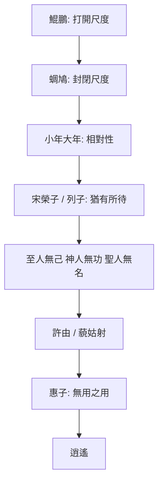

# 逍遙遊

> **閱讀提示**：本篇依原文脈絡展開。文中區分三層聲音——**原典**、**歷代注家**、**本書現代詮釋**。現代應用與哲學分析屬詮釋，不偽托為莊子原文原意。

## 01. 篇名與背景

〈逍遙遊〉為《莊子》內篇第一篇，也是全書最常被單獨閱讀的篇章。「逍遙」言精神之自在往來；「遊」不只是遊歷山水，更是心靈在世界中的活動方式。篇名合起來，問的是：人如何在變化不已的世界裡，真正自在地「遊」？

本篇在全書中的位置極關鍵：它先立下「小大」「有待／無待」「無用之用」等問題框架，其後〈齊物論〉深化是非相對，〈人間世〉談處世，〈大宗師〉談真人與死生，多可回扣此處已埋下的線頭。若把《莊子》比作一座思想建築，〈逍遙遊〉是大門與總綱。

> **原典位置**：內篇・第一篇・〈逍遙遊〉

## 02. 成書背景

《莊子》成書非一時一人之筆。學界通說：內七篇較接近莊周本人或其核心弟子之思想風格；外、雜篇則多有後學擴充、改編。〈逍遙遊〉屬內篇，文學張力與概念密度皆高，歷來視為理解莊學的入口。

戰國中晚期，列國爭戰、游士遊說、名辯大盛。人一方面追求功名與確定答案，一方面又常陷入比較、焦慮與自我束縛。〈逍遙遊〉以寓言破「小成」之見：不是教人逃跑，而是揭示——許多自以為的「自由」，其實仍依賴條件（有待）。

文本流傳上，今本多據晉郭象注本系統；清人郭慶藩《莊子集釋》彙聚舊注，是現代閱讀常用底本之一。本篇引文以通行本為準，標點與用字或有版本差異，重要異讀於註解中說明。

## 03. 結構分析

本篇並非散漫故事集，而有清楚的「升進」節奏：先以極端的大（鯤鵬）打開視野，再以小（蜩、學鳩）對照，破除以自我尺度衡量世界；接著由「小年大年」推到壽命與見識的相對；再由宋榮子、列子說明「猶有所待」；最後點出「至人無己，神人無功，聖人無名」。後半則以堯舜許由、藐姑射神人、以及惠子論大瓠／大樹，把抽象的「無待」落到政治姿態與「無用之用」。

### 結構圖

```text
北冥鯤 → 化而為鵬 → 圖南
        ↓
   蜩與學鳩笑之（小知笑大知）
        ↓
   朝菌／蟪蛄 vs 冥靈／大椿（小年大年）
        ↓
   宋榮子（猶有未樹）→ 列子御風（猶有所待）
        ↓
   至人無己／神人無功／聖人無名
        ↓
   許由卻天下 → 藐姑射神人
        ↓
   惠子：大瓠、大樹 → 無用之用
```

若用一句話總括結構：**由「大」破「小」，由「有待」推向「無待」，由「有用」翻轉為「無用之用」。**

## 04. 原典

> 版本依據：通行本《莊子》；註釋參考郭慶藩《莊子集釋》、成玄英疏、陳鼓應《莊子今註今譯》等。以下為**必要引用**，非全篇逐字照錄。

### （一）開篇：鯤鵬圖南

> 北冥有魚，其名為鯤。鯤之大，不知其幾千里也。化而為鳥，其名為鵬。鵬之背，不知其幾千里也；怒而飛，其翼若垂天之雲。是鳥也，海運則將徙於南冥。南冥者，天池也。

### （二）小知笑大知

> 蜩與學鳩笑之曰：「我決起而飛，搶榆枋，時則不至而控於地而已矣，奚以之九萬里而南為？」

### （三）小年大年

> 朝菌不知晦朔，蟪蛄不知春秋，此小年也。楚之南有冥靈者，以五百歲為春，五百歲為秋；上古有大椿者，以八千歲為春，八千歲為秋。而彭祖乃今以久特聞，眾人匹之，不亦悲乎！

### （四）有所待

> 夫列子御風而行，泠然善也，旬有五日而後反。彼於致福者，未數數然也。此雖免乎行，猶有所待者也。若夫乘天地之正，而御六氣之辯，以遊無窮者，彼且惡乎待哉！故曰：至人無己，神人無功，聖人無名。

### （五）無用之用（節錄）

> 今子有大樹，患其無用，何不樹之於無何有之鄉，廣莫之野，彷徨乎無為其側，逍遙乎寢臥其下？不夭斤斧，物無害者，無所可用，安所困苦哉！

## 05. 白話翻譯

### （一）鯤鵬

北海有一條魚，名字叫鯤。鯤非常大，不知道有幾千里。牠變化成鳥，名字叫鵬。鵬的背也不知道有幾千里；奮起而飛時，翅膀像掛在天邊的雲。這隻鳥，要等海風鼓動，才遷徙到南海——南海，就是天池。

### （二）蜩與學鳩

蟬和學鳩嘲笑牠說：「我們一下子起飛，碰到榆樹、枋樹就停；有時飛不到，就掉回地上罷了。何必飛到九萬里之外的南方去呢？」

### （三）小年大年

朝生暮死的菌類，不知道一個月的終始；夏生秋死的寒蟬，不知道春秋，這叫「小年」。楚國南方有冥靈樹，以五百年為春、五百年為秋；上古有大椿，以八千年為春、八千年為秋。彭祖如今因長壽特別出名，眾人拿他來比較，不也可悲嗎？

### （四）列子與無待

列子駕風而行，輕妙可喜，十五天後回來。他對求福這件事，並不汲汲營營。可是這雖然免於步行，**仍有所依賴**。至於順天地之正理、應六氣之變化，而遊於無窮的人——他還依賴什麼呢？所以說：至人無己，神人無功，聖人無名。

### （五）大樹

現在你有一棵大樹，擔心它無用，為什麼不把它種在「無何有之鄉」、廣漠的原野？在它旁邊徘徊無為，在它下面逍遙躺臥。它不會被斧頭砍伐，也沒有東西傷害它——因為沒什麼用，又哪來困苦呢？

## 06. 字詞註解

| 字詞 | 讀音／釋義 | 說明 |
|------|------------|------|
| 逍遙 | 自在、無掛礙地往來 | 篇名核心；非「玩樂」之義 |
| 遊 | 遊於世、遊於心 | 活動方式，不只地理旅行 |
| 鯤／鵬 | 寓言中的巨魚、巨鳥 | 極寫「大」，用以破「小知」 |
| 北冥／南冥 | 北海／南海 | 「冥」通「溟」，深廣之海 |
| 怒而飛 | 奮力而飛 | 「怒」為振奮，非憤怒 |
| 海運 | 海風鼓動、海水運動 | 鵬徙所需之條件 |
| 蜩 | 蟬 | 與學鳩同屬「小知」形象 |
| 學鳩 | 小鳩一類 | 以近距飛躍自足 |
| 槍榆枋 | 觸及榆、枋 | 形容飛行範圍極小 |
| 朝菌 | 朝生暮死之菌 | 「小年」之喻 |
| 蟪蛄 | 寒蟬之類 | 不知春秋 |
| 冥靈／大椿 | 長壽之樹 | 「大年」之喻 |
| 御風 | 駕風而行 | 列子之能，仍「有待」 |
| 有所待 | 有所依賴、有條件 | 本篇關鍵概念 |
| 六氣 | 陰陽風雨晦明等 | 自然變化之總稱 |
| 至人無己 | 至人不執著自我 | 與「無待」相應 |
| 神人無功 | 神人不居功 | 非追求功績 |
| 聖人無名 | 聖人不求名 | 名亦是一種「待」 |
| 無何有之鄉 | 什麼都沒有的地方 | 象徵不受「有用」邏輯支配之處 |
| 無用之用 | 看似無用，恰成保全與自在 | 篇末與惠子辯的收束 |

## 07. 段落解析


**走讀路線**：鯤鵬圖南 → 小大之辯 → 列子猶有待 → 至人無己／惠子大瓠。關鍵句：**無待**。

### 第一段：為何先寫鯤鵬？

原文不以定義開場，而以「大得過頭」的形象開場。這是敘事策略：**先讓讀者的尺度失效**。若一開始就講「無待」，抽象概念容易落空；先讓人感到「原來世界可以大到這種程度」，後面蜩鳩的嘲笑才顯得可笑，也才顯得可悲。

與上下文關係：鯤鵬是「問題的放大器」。它不是要你去當大鵬，而是要你看見——自己習慣用「我飛多高、我走多遠」來衡量一切。

### 第二段：蜩鳩之笑在說什麼？

蜩與學鳩並非單純愚蠢，而是**以自身經驗為絕對標準**。它們的飛行能力與鵬不同，這本身不是錯；錯在把「對我夠用」擴張成「對你多餘」。這正是小知笑大知的結構：比較來自尺度，尺度來自自我中心。

為何寫在這裡：承接鯤鵬之後，立即給出反題。讀者若只崇拜「大」，仍會落入另一種執著；莊子要破的是「以己度人」的封閉。

### 第三段：小年大年——時間尺度的相對

朝菌、蟪蛄與冥靈、大椿，把「大小」從空間轉到時間。彭祖長壽被眾人欽羨，莊子卻說「不亦悲乎」——悲的不是短命，而是**用單一尺度比較生命**。壽命、成就、名聲，一旦成為唯一坐標，人就永遠活在「不夠」裡。

與前後文：這一段把「小大之辯」普遍化：不只鳥飛得高低，連「什麼叫長久」都相對。為後文「有待」鋪路——人若依賴某個固定尺度，就會被尺度綁住。

### 第四段：宋榮子與列子——進階仍可能有待

宋榮子能做到「舉世譽之而不加勸，舉世非之而不加沮」，已遠超眾人；然而原文說他「猶有未樹也」。列子御風，已近乎神技，仍「猶有所待」——依賴風。

這是本篇最精密的轉折：**進步不等於無待**。能力更強、評價更穩、移動更省力，都可能只是「更高級的依賴」。真正的問題不是「你有多強」，而是「你還靠什麼才能覺得自己自由」。

然後才落到綱領句：乘天地之正、御六氣之辯、以遊無窮——彼且惡乎待哉。並以三句收束人格理想：至人無己，神人無功，聖人無名。

### 第五段：許由與藐姑射——把無待放進政治與生命形象

堯讓天下於許由，許由拒絕。這裡不是簡單歌頌隱士清高，而是質問：**把天下當成可授可受的「名器」，本身是否已落入「有名／有功」的邏輯？** 藐姑射神人則以極度詩意的形象，展示一種不被世俗功名灼傷的生命狀態（肌膚若冰雪、綽約若處子……）。對現代讀者，重點不在「真有神仙」，而在莊子如何用形象語言逼近「無待」的體驗。

### 第六段：惠子與無用之用——收束到人生實踐

惠子以大瓠、大樹譏莊子之言「大而無用」。莊子反問：無用，是否必然是失敗？大樹因無用而免於斤斧，人若只追求「被系統認定有用」，也可能活成永遠可被切割的材料。

「無何有之鄉」不是叫人躺平，而是指出：**「有用」常常是別人的尺子**；若人生只為符合尺子，就很難逍遙。此段與開篇呼應——開篇破小知的尺子，結尾破「有用」的尺子。

## 08. 歷代注家怎麼看

### 郭象

郭象注《莊子》，對後世影響極大。其核心詮釋傾向是「適性逍遙」：萬物各有其性，能安於自性、足於其性，便可逍遙；鵬飛九萬里與蜩鳩槍榆枋，若各適其性，皆可逍遙。此說強調「差異並存」，緩和了「大優於小」的讀法。

**本書提醒**（現代詮釋）：郭象之說有助避免把莊子讀成「必須變大鵬」；但也有學者批評，若過度「安分即逍遙」，可能削弱原文對「小知自以為是」的批判力。讀〈逍遙遊〉時，宜同時看見「破封閉尺度」與「不全然否定差異」兩面。

### 成玄英

成玄英疏多承郭象而更重義理疏通，常以「理」「性」解釋逍遙，並細化寓言中的修行意味。對「無己、無功、無名」，成疏傾向從去除執著、回歸自然之性來理解。對初學者，成疏的好處是條理清楚；需注意唐代疏解有時會帶入更強的工夫論語言。

### 林希逸

林希逸《莊子口義》以較近白話的方式講解，重視文脈與文氣。他往往提醒讀者：莊子善用誇飾與寓言，不可句句坐實為博物記載。對鯤鵬、藐姑射等，林氏多從「寄言」理解——這對現代出版導讀特別有用：先通文氣，再入哲理。

### 其他重要注家

- **王先謙《莊子集解》**：簡明，便於對照字句。
- **郭慶藩《莊子集釋》**：舊注彙編，查考異文與古注的重要工具。
- **今人**：陳鼓應重義理疏通與白話可讀；王邦雄重生命體證與通貫；傅佩榮重概念澄清與現代對話。本專案定位是吸收諸家之長，但**不混寫為同一聲音**。

## 09. 哲學分析

> 以下為**本書現代詮釋**，用於建立可檢索的概念網絡；請與原典、注家分開閱讀。

### 9.1 核心命題：逍遙的條件是什麼？

本篇最容易被誤讀成「追求更大的成功」或「什麼都不要」。更精確的問題是：**自由是否以「不依賴某個條件」來定義？**

- **有待**：自由建立在條件上（風、名、評價、有用、比較尺度）。
- **無待**：不是什麼條件都沒有的真空，而是不被某一條件綁死；能順天地之正、應變化而遊。

因此，「無待」不是能力歸零，而是**依賴結構的鬆綁**。

### 9.2 小大之辯：不是比大小，是比尺度

鯤鵬與蜩鳩的對立，表面是大與小，實際是「開放尺度」與「封閉尺度」。小知的悲劇，不在飛得低，而在**無法想像另有世界**。哲學上，這接近一種認識論提醒：我們的判斷，常被經驗邊界秘密規定。

### 9.3 三句綱領：無己、無功、無名

| 概念 | 所破之執 | 現代轉譯（詮釋） |
|------|----------|------------------|
| 無己 | 自我中心、自我證明 | 不把「我是否比較強」當唯一問題 |
| 無功 | 功績崇拜 | 不把「做出可見成績」當唯一價值 |
| 無名 | 名聲與標籤 | 不把「被看見、被命名」當唯一存在感 |

三者不是叫人變空洞，而是指出：己、功、名一旦成為「待」，人就難以逍遙。

### 9.4 無用之用：對「有用性暴政」的反擊

「有用」在社會中常由權力、市場、效率定義。莊子並非否定一切技能與貢獻，而是揭示：若「有用」成為唯一合法語言，人會恐懼無用，並因此失去自我安置的空間。大樹之喻說明——有時「不被系統徵用」，反而是存活與自在的條件。

### 9.5 接入思想地圖

```text
道
 └─ 無待
     ├─ 逍遙（本篇總題）
     ├─ 無己／無功／無名
     └─ 無用之用
         └─（後文可連）心齋、坐忘、緣督以為經
```

## 10. 與老子比較

《老子》重「無為」「柔弱」「知足」「不爭」，與〈逍遙遊〉的「無待」「無名」有家族相似性：都警惕過度 intervening、過度自我擴張。

差異在於表達與重心：

- 老子更常以「道」的形上語言與治術智慧說話（如「為學日益，為道日損」）。
- 〈逍遙遊〉更以寓言戲劇化「尺度」與「依賴」問題，文學性強，個人精神自由的色彩更鮮明。

可並讀：老子的「無為」，助理解莊子為何不把「強作」當自由；莊子的「無待」，則把自由問題推進到心理依賴與社會評價機制。

## 11. 與儒家比較

儒家重視名分、修身、經世，「有用」於人倫與政治是正面價值。〈逍遙遊〉許由卻天下、無功無名，看起來像直接反儒家。

更細的讀法是：莊子未必否定一切倫理責任，而是警告——當「名」與「功」成為自我綁架，連善也可能異化。儒家求「立人」，莊子問「人是否先被尺子立住」。兩者可緊張對話，而不必化約成「出世 vs 入世」口號。

## 12. 與佛學比較

> 以下為**本書現代詮釋**。本節只交代後世常見的並讀習慣，以及不宜混同之處；**不是**把本篇說成佛學，也不是佛學專論。

後世讀者有時會拿佛學語彙（如我執、法執、涅槃、解脫）來聯想本篇的「無待、無用之用、無己／無功／無名」。這種聯想多半因為兩邊都曾被用來反省執取、變化或言說限度，作為個人閱讀的對照可以，卻**不能**當成原典本意，更不能作成概念對譯。

本篇的關切是依賴結構與尺度封閉，核心語彙與論證屬於在世自在與小大之辯。佛教若討論相近主題，其框架、目標與制度背景（苦集滅道、業報與解脫，或經教／禪修傳統）與《莊子》並不相同。因此不宜把本篇關鍵詞「翻譯」成佛學術語，也不宜用佛學結論倒過來解釋莊子。

閱讀建議：先守住原文概念與篇章脈絡；若參考佛學，只把它當對照組，用來更清楚看見《莊子》自己在說什麼——而不是把《莊子》收編成佛學課本。


## 13. 現代人生應用

> 以下皆為**現代詮釋**，用於把概念轉成可操作的自我觀察，不是莊子「教你職場心法」的原話。

### 13.1 焦慮與比較

蜩鳩笑鵬，很像社群媒體上的相互丈量：以自己的軌道否定別人的軌道，或以別人的軌道羞辱自己。練習問題：

- 我現在用來評價自己的「尺子」是什麼？
- 這把尺子是我選擇的，還是環境塞給我的？

### 13.2 升遷與成功

列子御風「猶有所待」提醒：職位、資源、平台都可能是「風」。升遷本身不必否定；要問的是——若風停了，我是否仍覺得自己存在？無功、無名不是禁止成就，而是防止成就變成唯一氧氣。

### 13.3 財富與「有用」

惠子式焦慮是：「這麼大，為什麼不能變現？」現代對應是把一切（休息、學習、關係、身體）都折算成生產力。無用之用提供另一個問題：有沒有一塊「不被績效徵用」的生活空間？若完全沒有，人很容易「有用到耗盡」。

### 13.4 自由的自我檢測（三問）

1. 我最依賴什麼，才覺得自己還可以？
2. 我最害怕被說成什麼（沒用、失敗、沒名）？
3. 若不比較，我下一步仍想做什麼？

這三問不是標準答案，而是把「有待」從概念變成可觀察的經驗。

## 14. 常見誤解

1. **「逍遙＝躺平」**  
   原文強調的是鬆綁依賴與封閉尺度，不是否定一切行動。乘天地之正、遊於無窮，仍是一種高度的生命主動性。

2. **「要成為大鵬才算成功」**  
   若如此讀，只是把小知的尺子換成大知的尺子。重點是看見尺子本身。

3. **「無用＝什麼都不要做」**  
   「無用之用」針對的是「有用性暴政」，不是鼓勵放棄技能與責任。

4. **「無己＝沒有自我」**  
   更貼近的理解是：不執著以自我為中心的證明遊戲，而非人格消滅。

5. **「莊子反社會」**  
   本篇有許由、神人等形象，但也透過與惠子對話，重新回到人如何在世間安置自己。批判的是僵化價值，而非人必須離群。

## 15. 本篇總結

〈逍遙遊〉以寓言層層推進，核心不是炫博神話，而是追問自由的條件。鯤鵬打開尺度，蜩鳩暴露封閉，小年大年解除單一時間坐標，宋榮子與列子說明進階仍可能有待，三句綱領點明無己、無功、無名，終以無用之用回擊「有用」的單一語言。

若只記一句：

> **真正的問題不是飛得多高，而是你還在靠什麼才能飛——以及那依賴是否已變成牢籠。**

## 16. 心智圖




## 17. 延伸閱讀

### 原典與注疏

- 郭慶藩《莊子集釋》〈逍遙遊〉
- 王先謙《莊子集解》〈逍遙遊〉
- 成玄英疏（見《莊子集釋》所引）

### 今注今譯與通論

- 陳鼓應《莊子今註今譯》〈逍遙遊〉
- 王邦雄《莊子內七篇‧外秋水‧雜天下的現代解讀》相關章節
- 傅佩榮相關莊子導讀（逍遙、無待概念）

### 進階討論（選讀）

- 關於郭象「適性逍遙」之研究論文／哲學史專章
- 徐復觀對莊子精神自由的討論（選讀相關段落）

### 本專案內交叉引用

- 相關篇章：〈齊物論〉（尺度與是非）、〈人間世〉（處世）、〈秋水〉（小大再論）、〈山木〉（材不材）、〈徐無鬼〉（惠施線）
- 相關人物：[惠施](content/figures/惠施.md)、[許由](content/figures/許由.md)、[列禦寇](content/figures/列禦寇.md)、[堯](content/figures/堯.md)
- 相關名詞：[無待](content/terms/無待.md)、[有待](content/terms/有待.md)、[逍遙](content/terms/逍遙.md)、[無用之用](content/terms/無用之用.md)
- 相關主題：[焦慮與比較](content/themes/焦慮與比較.md)、[自由與無待](content/themes/自由與無待.md)、[無用與有用](content/themes/無用與有用.md)
