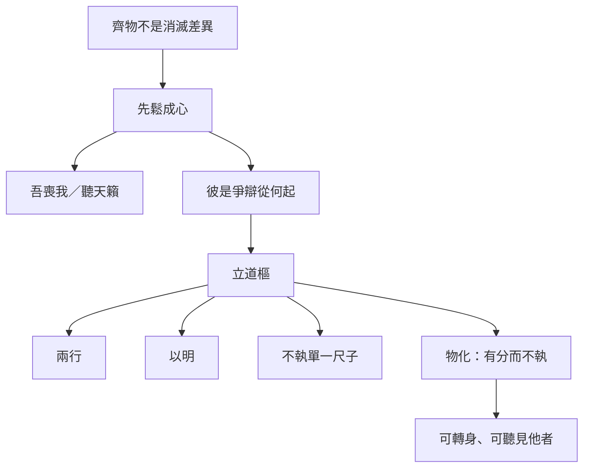

# 齊物論

> **閱讀提示**：以下區分原典、歷代注家與本書現代詮釋；「齊」不是抹平差異，而是鬆開以一端裁斷萬物的成心。

## 01. 篇名與背景

〈齊物論〉承〈逍遙遊〉的「小大之辯」，轉而追問：人何以把自己的見聞、好惡定為天下的是非？「齊物」不是把萬物做成同一物，而是鬆開以一端裁斷萬物的成心；「論」也包含對各種論辯的反省。若〈逍遙遊〉教人看見「有待」與尺度之限，本篇則教人看見「成心」如何把有限尺度誤當宇宙法則。

本篇在全書中居第二篇，是內篇認識論與語言批判的核心。其後〈人間世〉的心齋、〈應帝王〉的鏡喻，多可回扣此處對成心與言辯的分析；〈大宗師〉的物化亦與夢蝶結語相呼。讀內篇宜把本篇視為「尺度問題」的第二層：不僅知自己小，更知自己何以堅持己是、人非。

> **原典位置**：內篇・第二篇・〈齊物論〉

## 02. 成書背景

戰國名家、儒墨及諸子競相立論，「彼是」之爭既是學術問題，也是政治與生存問題。惠施、公孫龍等名辯家使「同異」「堅白」成為專門課題；儒墨互詆，各以仁義、兼愛為天下唯一正理。在這種語言戰場上，說得漂亮往往比想得周全更容易得勢。

內篇此篇以南郭子綦、齧缺、王倪與夢蝶等對話，不提供一套新教條，而展示教條如何形成。它不否定一切判斷，而是追問：判斷依何而立？誰有資格把局部經驗說成普遍真理？通行本文字依郭象本系統，異文可參郭慶藩《莊子集釋》；以下引文以該書所收通行文字為準。

## 03. 結構分析

篇首由聲音入手，先破「有一主宰在操控」的直覺；中段拆解成心與彼是；再經朝三暮四、滑疑之稱，把語言操弄與認知限度寫實；末段以夢蝶不讓讀者停在概念，而回到身分與變化的經驗。

### 結構圖

```text
南郭子綦「吾喪我」→ 人籟／地籟／天籟
        ↓
成心與言辯（大知小知、彼是互生）
        ↓
道樞、兩行 → 朝三暮四
        ↓
滑疑、生死是非的限度
        ↓
莊周夢蝶 → 物化
```

若用一句話總括：**由天籟破主宰幻覺，由成心見執，由兩行保張力，由夢蝶收於身體經驗。**

## 04. 原典

> 版本依據：郭慶藩《莊子集釋》通行本。**原典位置**：內篇第二篇〈齊物論〉。以下為必要引用，非全篇逐字照錄。

### （一）吾喪我與三籟

> 南郭子綦隱机而坐，仰天而嘘，荅焉似喪其耦。……曰：「吾喪我矣。」  
> 汝聞人籟而未聞地籟，汝聞地籟而未聞天籟夫！

### （二）成心與彼是

> 大知閒閒，小知間間；大言炎炎，小言詹詹。  
> 彼亦一是非，此亦一是非。是亦彼也，彼亦是也。

### （三）道樞與兩行

> 道通為一，其分也，成也；其成也，毀也。唯其言也，可不謂之為天籟乎？  
> 是以莫若以明。  
> 是以聖人和之以是非而休乎天鈞，是謂兩行。

### （四）朝三暮四

> 狙公賦芧，曰：「朝三而暮四。」眾狙皆怒。曰：「然則朝四而暮三。」眾狙皆悅。名實未虧而喜怒為用，亦因是也。

### （五）夢蝶與物化

> 昔者莊周夢為胡蝶，栩栩然胡蝶也……不知周之夢為胡蝶與，胡蝶之夢為周與？周與胡蝶，則必有分矣。此之謂物化。

## 05. 白話翻譯

### （一）吾喪我

南郭子綦靠著几案坐著，仰天長嘆，神情像失去了與自己相對的伴侶。他說：「我喪失了我。」齧缺問天籟，他說：你只聽過人吹孔而出的聲音，還沒聽過風穿萬竅的地籟，更沒聽過使萬物各自如此的天籟。

### （二）成心言辯

大智慧寬廣從容，小聰明忙於計較；大言宏闊，小言瑣碎。你說的「是」在對方眼中可能正是「非」；彼與此相對而生，彼此互為「是」與「非」。

### （三）道樞兩行

道本通而為一，分開就形成，形成也就走向毀；這樣的言說，能不稱為天籟嗎？與其陷在彼是裡，不如以明照見。聖人調和是非，休於天鈞，這叫兩行——兩邊並行而不以一端消滅他端。

### （四）朝三暮四

養猴的人分栗子，說早上三顆晚上四顆，猴子都生氣；改說早上四顆晚上三顆，猴子都高興。名實沒變，喜怒卻被話語框定牽動。

### （五）夢蝶

莊周夢見自己變成蝴蝶，翩翩飛舞，醒後不知是莊周夢蝶，還是蝶夢莊周。周與蝶當然有分別，但這正顯出萬物在變化、彼此轉化——此之謂物化。

## 06. 字詞註解

| 字詞 | 讀音／釋義 | 說明 |
|---|---|---|
| 齊物 | 調齊成心對物之偏見 | 非「萬物同一」 |
| 成心 | 已成定見 | 使人以己為準的心理結構 |
| 吾喪我 | 鬆開固定之我 | 天籟段前提，非失憶 |
| 人籟／地籟／天籟 | 吹孔／風入萬竅／使各竅自鳴 | 層層破「有主宰分配對錯」 |
| 彼是 | 彼此、是非 | 相對而立，非自然即有 |
| 道樞 | 道的樞紐 | 不黏死於彼此一端的位置 |
| 天鈞 | 天然之平 | 兩行所休之處 |
| 兩行 | 兩邊並行 | 非折衷，而是不以一方消滅他方 |
| 滑疑 | 難以確定之稱 | 承認知與不知皆有限 |
| 物化 | 萬物變化、彼此轉化 | 夢蝶結語 |
| 莫若以明 | 不如以明照見 | 照見成心，非取消裁決 |

## 07. 段落解析

**走讀路線**：三籟 → 成心言辯 → 道樞兩行 → 夢蝶物化。關鍵句：**莫若以明**。

### 為何從「三籟」而非「齊物」起筆？

南郭子綦不先定義什麼叫齊，而讓齧缺聽風入萬竅。人籟可指吹孔；地籟是眾竅因風而響；天籟則使各竅「虛者求使也，實者求鳴也」——各發其聲，並無一個統一主宰在分配對錯。**齊的前提，是先承認差異本在各自發聲**，而不是先立一個標準再去削平萬物。與〈逍遙遊〉先寫鯤鵬破小知同理：先讓「主宰式的是非」失焦，後文成心、彼是才有入口。

### 「吾喪我」與天籟如何銜接？

「吾喪我」不是消滅自我，而是暫時鬆開「我必須是誰、我必須對」的固定框架。唯有此喪，才聽得見地籟、天籟——不是神秘聲響，而是萬物各因其性而鳴。這為全篇定調：**齊物首先是鬆成心，不是取消萬物差異。**

### 成心與言辯：為何愈辯愈固？

「大知閒閒，小知間間」描寫的不是智力階級表，而是**成心一旦確立，就會自動生產論戰材料**。彼是「相對而立」，不是自然就有「我對你錯」。道樞、兩行不是要取消判斷，而是**不把某一端的判斷當成宇宙唯一法則**。朝三暮四接在其後，用餵法名目之變讓猴子喜怒翻轉——所得未變，變的是語言框定；這是把成心問題落到可感的操弄術，也是對戰國遊說話術的側擊。

### 為何生死、滑疑段不放在夢蝶之前？

中段若只停在「是非可兩行」，讀者仍可能以為齊物是**思辨遊戲**。於是莊子寫滑疑之稱、追問「既已知吾知之為正，其未知之正又在何方」——承認人總以為自己的「知」已立正。**這是從語言層推到生命處境：人會死、角色會換、知與不知都有限。** 為夢蝶鋪路：物化不是口號，而是「周／蝶／分／化」同時真實的經驗張力。

### 夢蝶置末：要收束什麼？

結語「周與胡蝶，則必有分矣。此之謂物化」——**有分**，才說物化；不是取消分別，而是說分別不固定於一個永恆主體。若只記「齊物＝都一樣」，便誤讀；若只記「物化＝虛無」，也誤讀。全文由天籟破主宰→成心見執→兩行保張力→夢蝶收於身體經驗，敘事本身即論證。

### 滑疑之稱與「樂通」

「滑疑之稱，愚人之役也」——承認有些名稱、學說讓人越辯越糊塗，成心的奴隸。後文「樂通，幾與道合」則說，若能通達於變化之樂（非享樂），近於道。這兩句把全篇從批判拉向**可能的通達**：齊物不是終點在虛無，而是終點在能遊於變化。

### 與他篇如何互讀？

〈齊物論〉的成心、兩行，在〈人間世〉成為進權力現場前的**心齋**前提；在〈應帝王〉則轉為鏡式應物、不因己意塞住。〈逍遙遊〉破小大之辯，本篇破是非之執，〈大宗師〉再問：若「我」可化，真人如何面對死生？不宜把各篇抽成同一套「相對主義」口訣，而宜看**同一警告在不同場景的具體化**。

## 08. 歷代注家怎麼看

### 郭象

郭象重「彼此相因」與萬物自得，認為是非不必由外在標準強行統一；彼是互生，各安其分。這能防止以一物壓萬物，但不可化成對現實傷害的冷漠。郭注亦以「獨化」解天籟，強調萬物自發，非有神明分配。

### 成玄英

成疏以「忘彼此、遣是非」說明道樞，強調破除偏執；其詮釋較具工夫論色彩。對「吾喪我」，多解為忘懷形執、冥合虛通；對兩行，則說聖人不偏滯一方，以天鈞調和。

### 林希逸

林氏注意到朝三暮四的文字機鋒：猴子所得未變，變的是名目與預期，正揭露人情受語言牽動。又指出夢蝶段文情極處：「必有分」三字，防止讀者把物化誤解為取消差異。

### 郭慶藩與其他

郭慶藩《莊子集釋》彙諸家異文舊說，於「滑疑」「天鈞」等字義可核對；近人多以本篇討論語言、相對性與主體問題，宜始終回到「成心」與「兩行」的原文脈絡，勿以西方相對主義直接套入。

## 09. 哲學分析

> 以下為**本書現代詮釋**。

齊物不是「所有主張同樣正確」，而是三步工夫：知道我有立場；承認他者也有其可理解處；在衝突中不把有限見識絕對化。道樞不是無立場，而是能移動的樞紐——不讓某一「是」霸佔全場。夢蝶也不是宣告世界虛假，而是讓「固定自我」失去最後保證：身分可轉，卻仍有「周與蝶之分」。

可連結為：成心 → 彼是固化 → 爭辯；反省成心 → 兩行 → 開放回應。這與〈秋水〉的尺度反省相通，但本篇更集中於**語言與是非如何製造成心**，而非自然視野的擴大。

## 10. 與老子比較

《老子》說「知不知，上」，同樣警惕知識自滿；「道可道，非常道」亦警戒言辯之限。〈齊物論〉更細緻地分析語言如何製造彼是，並以天籟、夢蝶等寓言展示。老子多以反向格言說治道，莊子則使讀者在對話與寓言中親歷尺度的滑動。

## 11. 與儒家比較

儒家需辨義利、善惡以承擔責任；莊子追問的是，誰有資格把某一套名目當作絕對？孟子「是非之心」與本篇可對話：儒家重確立是非以修身齊家，莊子則警告成心如何把「己是」說成「天理」。兩者的張力促使我們區分「必要判斷」與「把判斷神聖化」。

## 12. 與佛學比較

「成心」「是非」常被拿來與分別心、邊見並讀；「物化」也有人聯想到無常。對照可以讓「執一察為天下」更銳利，但本篇的骨幹仍是天籟、兩行與言辯中的因是。

讀時宜先跟著對話與寓言走：齊物不是取消判斷，而是追問判斷站在哪裡。


## 13. 現代人生應用

> 以下為**本書現代詮釋**。

網路爭論前可問：我的「是」依據何種經驗？是否把對方縮成標籤？職場分歧中，兩行不是不決策，而是在決策前補足被排除的觀點。朝三暮四也提醒我們，制度溝通不能只改包裝；若資源與尊嚴未變，話術終會被看穿。

1. **是非之爭**：先問自己的「是」依何經驗、是否已把對方縮成標籤；再決定要不要對決。
2. **莫若以明**：爭議未歇時，與其加碼口號，不如照見雙方成心與被排除的觀點，再做可修正的判斷。
3. **物化**：角色、情緒與自我敘事都可能轉換；不必用單一固定之「我」去堵死下一步。
4. **朝三暮四**：改革若只改名目、不改實質，群眾的喜怒終會反噬信任。

### 13.1 成心自檢（爭論前）

爭論升溫前，可暫停三問：我是否已把對方當成「必然錯」？我手中的證據，是否只是局部經驗？若對方也有可理解之處，我能否在不放棄底線的前提下，先聽完？這不是和稀泥，而是避免成心把對話變成戰爭動員。

### 13.2 兩行與決策

組織決策時，「兩行」可轉為程序：重大方案須附「反方摘要」與「被排除選項的代價說明」。決策仍可表態，但表態前須看見自己可能漏掉的一面——這是「莫若以明」的制度化。

### 13.3 夢蝶與身分轉換

轉職、離婚、移民、重病後，舊身分敘事常仍支配情緒。夢蝶提醒我們：身分可化，但「有分」——不必否認過去的自己，也不必把過去鎖死未來。哀傷與重新命名可以並存。

## 14. 常見誤解

1. **齊物＝道德相對主義**：原文批判成心，未說傷害與照護毫無差別。
2. **夢蝶＝人生只是夢**：它說物化與認同的不穩，不是虛無主義。
3. **不要說話才不執著**：本篇正以語言教人反省語言，關鍵在不固執。
4. **莫若以明＝誰都不對、所以誰都對**：以明是照見成心與尺度，不是取消裁決與責任。
5. **兩行＝和稀泥、永不表態**：兩行要求在決策前補足被排除的一面，不是永遠不下判斷。
6. **吾喪我＝消滅人格**：是鬆開成心，不是否定責任與關係。

## 15. 本篇總結

〈齊物論〉讓人看見：困住人的不只是外物，也是把一己尺度誤當全體的成心。齊不是消滅差異，而是在差異裡保留可轉身、可聽見他者的道樞。夢蝶以「有分」收束物化，使全篇既不淪為虛無，也不淪為教條——這正是內篇認識批判的標竿高度。

## 16. 心智圖




## 17. 延伸閱讀

- 郭慶藩《莊子集釋》〈齊物論〉
- 成玄英《南華真經注疏》〈齊物論〉
- 林希逸《莊子口義》〈齊物論〉
- 陳鼓應《莊子今註今譯》；王邦雄《莊子內七篇‧外秋水‧雜天下的現代解讀》

---
### 交叉引用
- 相關篇章：〈逍遙遊〉、〈人間世〉、〈大宗師〉、〈秋水〉
- 相關人物：[莊周](content/figures/莊周.md)、南郭子綦、齧缺、王倪
- 相關名詞：[齊物](content/terms/齊物.md)、[物化](content/terms/物化.md)、[卮言](content/terms/卮言.md)、成心、天籟、道樞、兩行
- 相關主題：[焦慮與比較](content/themes/焦慮與比較.md)、認識、語言、衝突、身分

### 讀法建議

初讀可先通讀全篇，留意南郭子綦「吾喪我」、彼是互生到莊周夢蝶的轉折；再回看第四節節錄與第七節段落關係。進一步研究宜並置郭象的自得、成玄英的遣是非與林希逸對朝三暮四的文勢說明，並以郭慶藩核對字句。跨文化比較或現代應用須標明為後設詮釋。
