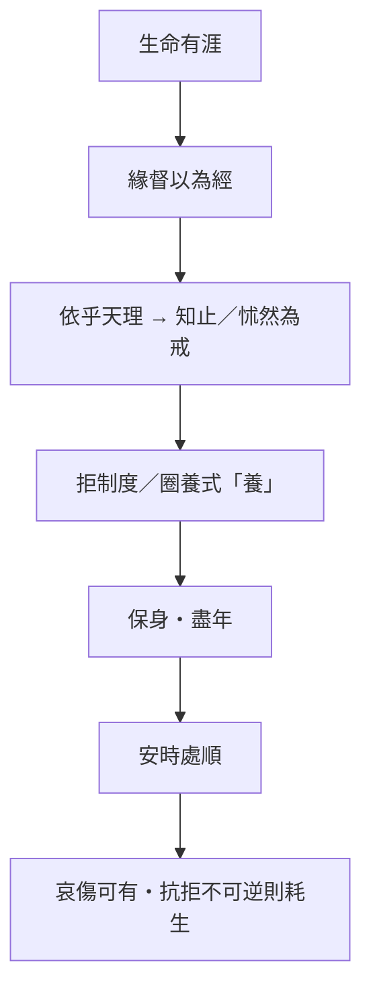

# 養生主

> **閱讀提示**：本篇的「養生」首先是保全天年與安頓生命，不可直接化約為養生保健術。

## 01. 篇名與背景

「養生主」可解作養生的宗旨或主宰。〈齊物論〉拆解成心後，本篇立刻問：在充滿限制與傷害的世界，生命如何不自耗？庖丁的刀、右師的足、老聃之死，分別由技藝、刑傷與哀傷呈現同一問題——**有限的生命，如何在結構中行走而不硬碰？**

本篇是內篇由認識批判轉向身體與生命實踐的橋樑。其「緣督」「知止」將在〈人間世〉化為心齋與言語風險意識；外篇〈達生〉則把技進乎道展開為凝神、以天合天。讀時宜與〈逍遙遊〉的「有待」並看：養生不是追逐無限，而是在有限中找可持續之路。

> **原典位置**：內篇・第三篇・〈養生主〉

## 02. 成書背景

戰國人命常繫於戰爭、刑罰與徵役。「養生」並非奢侈的私人健康，而含避害、全身、盡年之意。當時醫藥、導引與方術亦興，但本篇不談丹藥延年，而談如何在刀斧、刑罰與哀傷中不失其生——這是哲學的養生，不是養生館的養生。

文惠君聽庖丁之言而稱善，顯示此篇亦面對君主：技進乎道，最終服務於「不傷」——不傷刀、不傷牛、亦不傷執政者與執技者自身。這使養生主題超出個人養身，而連結技術倫理與政治身體。

本篇屬內篇，通行本依郭象注系統；重要引文據郭慶藩《莊子集釋》。庖丁解牛故事可能吸收工匠傳統，秦失弔老聃則與道家祖師形象相連；讀者宜辨寓言與史實之分際。

## 03. 結構分析

篇首給綱領，庖丁具體示範；中段以殘身與受困的鳥防止讀者把「技進乎道」讀成炫技；末段以死亡收束養生的真正邊界。

### 結構圖

```text
有涯／無涯 → 緣督以為經
        ↓
庖丁解牛：依乎天理、知止、戒慎
        ↓
右師斷足 → 澤雉寧處樊中
        ↓
秦失弔老聃：安時處順
```

若用一句話總括：**先劃邊界，再示技道，再校正制度之傷，最後以死生驗養生真義。**

## 04. 原典

> **原典位置**：內篇第三篇〈養生主〉；版本依據：郭慶藩《莊子集釋》。以下為必要引用，非全篇逐字照錄。

### （一）有涯無涯與緣督

> 吾生也有涯，而知也無涯。以有涯隨無涯，殆已！已而為知者，殆而已矣！  
> 緣督以為經，可以保身，可以全生，可以養親，可以盡年。

### （二）庖丁解牛

> 臣之所好者道也，進乎技矣。依乎天理，批大郤，導大窾，因其固然。  
> 彼節者有間，而刀刃者無厚；以無厚入有間，恢恢乎其於遊刃必有餘地矣。  
> 每至於族，吾見其難為，怵然為戒，視為止，行為遲。動刀甚微，謫然已解，如土委地。

### （三）右師與澤雉

> 公文軒見右師而驚，曰：「吾始見之而驚，今更見之而忘天下。」  
> 澤雉十步一啄，百步一飲，不蕲畜乎樊中。神雖王，不善也。

### （四）秦失弔老聃

> 老聃死，秦失弔之，三號而出。弟子曰：「非夫子之友邪？」曰：「然。……適來，夫子時也；適去，夫子順也。安時而處順，哀樂不能入也。」

### （五）澤雉（補）

> 澤雉十步一啄，百步一飲，不蕲畜乎樊中。神雖王，不善也。

篇末「善夭善老善始善終」諸句（通行本或有異文），進一步把養生收於**善其終**——不是追求長壽，而是善於面對終局。

## 05. 白話翻譯

### （一）緣督

人的生命有限，欲知之事無窮；拿有限生命追逐無窮知識，會陷於危殆。沿著居中的常道行走，能保身、全生、奉親、終其天年。

### （二）庖丁

庖丁說他所喜愛的是道，已超過普通技術：順著牛體原有紋理，在筋骨空隙處下刀。牛的關節本有空隙，刀刃則沒有厚度；以無厚的刀進入有隙之處，刀自然總有餘地可遊。遇到筋骨交錯處，他仍怵然為戒，目光專注、動作放慢，輕輕一劃便解開，像土塊落地。

### （三）右師與澤雉

公文軒見斷足的右師，說起初驚訝，後來見他卻忘了天下。澤雉走十步才啄一口，百步才飲一次，不願被養在籠中——雖被奉為神鳥，卻不自在。

### （四）秦失

老聃死了，秦失去吊唁，哭三聲便走。弟子問：他不是您的朋友嗎？秦失說：是。老聃來是時機到了，去是順著變化；能安於時、順於變，哀樂便不會侵入到失去分寸。

## 06. 字詞註解

| 字詞 | 讀音／釋義 | 說明 |
|---|---|---|
| 涯 | 邊際 | 生命、精力皆有限 |
| 督 | 中、正 | 「緣督」非固定保健穴位說 |
| 緣督 | 循中道而行 | 在結構中找可持續之路 |
| 天理 | 天然紋理 | 指牛體結構，不是抽象倫理 |
| 郤／窾 | 空隙 | 庖丁下刀所循之處 |
| 族 | 筋骨交錯處 | 最難處，更需戒慎 |
| 怵然為戒 | 警惕戒慎 | 熟練仍不魯莽 |
| 兀者／右師 | 斷足受刑者 | 刑罰與身體之傷 |
| 樊中 | 籠中 | 澤雉寧自由而不願豢養 |
| 安時處順 | 安於所遇、順其變化 | 不等於毫無哀傷 |

## 07. 段落解析

**走讀路線**：有涯無涯 → 庖丁解牛 → 右師斷足 → 秦失弔喪。關鍵句：**緣督知止**。

### 為何先寫「有涯／無涯」而不先寫庖丁？

「吾生也有涯，而知也無涯」不是反智，而是**先劃出養生的邊界**：拿有限生命追逐無窮資訊、功名與辯論，本身就是耗損。「緣督以為經」因此不是口號，而是**在結構裡找可持續的中道**——能保身、全生、養親、盡年，四者並列，說明養生從未只是個人技巧。若跳過這段直接讀解牛，易把本篇誤成職場效率學。

### 庖丁解牛：「進乎技」在何處？

庖丁由「所見全牛」到「神遇不以目視」，說的是**熟練後的整體感通**；關鍵不在快，而在「彼節者有間，以無厚入有間」。遇到筋骨交錯仍「怵然為戒」，防止神技變成魯莽——**知止**與**有餘地**同時成立。這與〈齊物論〉的成心形成對照：庖丁不是取消判斷，而是在牛體結構中辨認何處可入、何處不可硬闖。刀十九年不換，正因不逆理而行。

### 為何緊接右師、澤雉兩則？

右師斷足、澤雉「寧其寧處樊中，莫之而逢矰」——**制度與圈養也會傷生**。若只停在庖丁的從容，讀者可能以為「技進乎道」即可免疫一切；這兩則把問題拉回刑罰、徵役與安逸的陷阱：身體可被國法斷去，自由也可被餵養換走。與上下文：它們校正「養生＝個人修煉」的窄化讀法。

### 秦失弔老聃：為何不以禮哭？

「始也吾以為其人也，而今非也」——吊唁若只剩**角色扮演**，便與所吊對象脫節。老聃「適來適去」，秦失以「安時處順」解，不是否認哀傷，而是**不讓哀樂變成對變化的拒絕**。這是全篇真正的收束：養生的終極考驗不在刀法，而在能否順死生之大變而不自傷。

### 公文軒與右師：觀看者的轉變

公文軒「始見之而驚，今更見之而忘天下」——寫的是**觀看者的改變**，不是右師自我標榜。最初見斷足而驚，後來見其神完而忘天下之紛擾。這與王駘段同構：德充的符驗，往往要透過旁人的目光轉換才顯出。讀者亦是被邀請轉換目光的一方。

### 與他篇如何互讀？

「緣督」「知止」在〈人間世〉轉為心齋與言語風險；在〈達生〉則展開為凝神、以天合天。〈養生主〉的[庖丁](content/figures/庖丁.md)與〈德充符〉的才全並非同一問題——前者問**如何在結構中節用**，後者問**形貌不全時德如何仍可感**。讀內篇宜沿此線：保全生命→亂世處世→形殘不損德→真人與死生→政治應物。

## 08. 歷代注家怎麼看

### 郭象

郭象將緣督解為順中而行、各得其性；庖丁所以不傷刀，因不逆物之自然。又說「以有涯隨無涯」是知止於分內，非絕對反知。

### 成玄英

成疏著重忘知遣累，以虛心應物；「安時處順」是去除逆變之心，而非否認親情。對庖丁段，多解為心手相應、神遇於理。

### 林希逸

林氏特別指出庖丁故事的文勢：刀十九年不換，正為凸顯「順理」勝過蠻力，不可拘泥為廚藝秘方。又提醒秦失三號，是破俗禮之執，不是薄情。

### 郭慶藩與其他

郭慶藩彙集名物與字義考證；今人解讀多提醒「吾生有涯」不是反智，而是反對無節制地耗盡生命。王先謙《莊子集解》字句簡明，可與郭集釋對讀。又，「全生」一語歷代或解為保全生命，或解為全其生之質，宜並存而不必強分。

## 09. 哲學分析

> 以下為**本書現代詮釋**。

「緣督」是一種節度：承認資源有限，選擇不與結構硬碰。庖丁的道不在掌握萬物，而在細察限制、等待可行之隙。這與「最有效率」不同：真正成熟的行動包含停刀、戒慎與保留。安時處順也不是命定論，而是區分不可控的變化與仍可調整的回應。

本篇可視為[工作與技道](content/themes/工作與技道.md)主題在內篇的奠基：技術若只追求速度與征服，終會傷刀傷身；技若進乎道，則在結構中找空隙、在難處更戒慎。又，「全生」「盡年」二語可與當代「可持續工作」「職業生涯長度」對話，但須標明為現代詮釋，不可偽托為莊子原意。

## 10. 與老子比較

《老子》說「知足不辱，知止不殆」，與本篇不以有涯逐無涯相近。「治大國若烹小鮮」亦重不妄動、順理。差異是〈養生主〉以具體技藝寫出順理的身體感，並把死亡置入養生的範圍，較老子更敘事、更具身。老子「守中」與「緣督」亦可互參，但緣督更強調在具體結構中找空隙，而非抽象守一。

## 11. 與儒家比較

儒家重奉親與哀禮；本篇也說「可以養親」，但秦失段反省哀禮若失真便成俗套。可視為對禮之真情與形式關係的追問，不宜簡化為反孝。孟子「養吾浩然之氣」重內在充養，本篇則重**不逆理、不耗竭**的外在身體節度，兩者可互補。曾子「任重而道遠」與「以有涯隨無涯」亦形成張力：責任須在有限生命中節度分配。

## 12. 與佛學比較

庖丁的細察、知止，後世或聯想到觀身、中道；安時處順也常被拿來談無常中的安頓。這些聯想能提示「別硬耗」，但本篇真正要緊的是緣督以為經——在有涯之生裡找可走的縫隙。

養生主是技道與年命的學問，不是先換成修行名相再回頭解釋庖丁。


## 13. 現代人生應用

> 以下為**本書現代詮釋**。

工作上，先列出不能硬碰的結構：工時、專業邊界、身體警訊；再找「窾」而非一味加力。學習上，「知無涯」提醒選擇問題而非囤積資訊。面對失去，安時處順不是催促自己不哭，而是容許哀傷存在，同時不以抗拒不可逆之事耗盡餘生。

1. **緣督以為經**：在工時、身體警訊與專業邊界上找可走的「中」，少做硬碰硬骨的消耗。
2. **庖丁解牛**：複雜處「怵然為戒」——停、看、複查，再進刀；熟練包含知止，不是一味加速。
3. **澤雉**：問自己是否為了牢籠裡的「養」而失去本來能走、能歇的餘地；該保的生命節奏優先於虛榮的安頓。
4. **秦失三號**：儀式若只剩表演，不如誠實面對哀傷的限度與變化。

### 13.1 知止與資訊飲食

「以有涯隨無涯」在當代常表現為無止境的資訊攝取、比較與回應義務。緣督在此可具體化：每日設定「知止」邊界——哪些主題值得深讀、哪些爭論不必入場、哪些通知可關。養生首先是注意力與精力的保全。

### 13.2 庖丁式專業

專業成熟不是「更快」，而是更知道哪裡不能下刀。遇到複雜專案、棘手關係或醫療決策時，學庖丁在「族」處放慢：多問一次、多查一次、多留一次餘地。神遇不以目視，是整體感通，不是跳過檢核。

### 13.4 善終與儀式

秦失三號不是標準答案，而是提醒：儀式若與對象的生命態度脫節，便成表演。現代讀者可問：我們的告別方式，是在安置哀，還是在完成社會期待？安時處順允許簡化，也允許隆重——關鍵是誠實面對變化。

## 14. 常見誤解

1. **養生＝延年偏方**：本篇關心的是全生與盡年，不提供醫療處方。
2. **庖丁＝熟能生巧**：熟練重要，但核心是依理、知止與戒慎。
3. **安時處順＝壓抑悲傷**：它批評失度的沉溺，不否定情感。
4. **緣督＝凡事妥協、沒有原則**：緣督是依理而行的節度，不是放棄該守的界線。
5. **澤雉＝拒絕一切照顧與資源**：故事反對的是以豢養換走自由，不是否定互助與專業照護。
6. **有涯無涯＝反對學習**：是反對無節制追逐，不是反智。
7. **緣督＝養生穴位**：歷代多有「督脈」之說，但宜回到「循中道、不硬碰」的哲學義，勿執為方術。

## 15. 本篇總結

〈養生主〉以刀與牛教人看見生命的節度：有限者不必追逐無限，行動不必硬闖，哀傷也不必演成自我毀傷。養生的最高處，是在變化中不失其生——從緣督到安時，是一條由身體技藝通向死生大變的內篇主線。讀全篇宜記住：庖丁的從容以「怵然為戒」為前提，秦失的淡然以「友」為前提；二者都不是冷漠，而是**在限度內盡其生**。

若以一句話收束：**知止於有涯，順理於有間，安時於大化。**

## 16. 心智圖




## 17. 延伸閱讀

- 郭慶藩《莊子集釋》〈養生主〉
- 成玄英《南華真經注疏》〈養生主〉
- 林希逸《莊子口義》〈養生主〉
- 陳鼓應《莊子今註今譯》；王邦雄《莊子內七篇‧外秋水‧雜天下的現代解讀》

---
### 交叉引用
- 相關篇章：〈齊物論〉、〈人間世〉、〈德充符〉、〈大宗師〉
- 相關人物：[庖丁](content/figures/庖丁.md)、文惠君、右師、老聃、秦失
- 相關名詞：緣督、天理、技進乎道、安時處順
- 相關主題：[工作與技道](content/themes/工作與技道.md)、有限性、身體、哀傷

### 讀法建議

初讀可先通讀全篇，抓住緣督綱領、庖丁解牛到安時處順的推進；再回看第四節節錄與第七節段落關係。進一步研究宜並置郭象的順中、成玄英的保身義與林希逸對刀十九年的文勢說明，並以郭慶藩核對字句。與〈達生〉梓慶、〈徐無鬼〉匠石等技藝篇可並讀，但本篇重「節度」與「死生」，彼等重「質」與「凝神」。外篇〈養生主〉同名概念若混淆，宜回到內篇此篇之「緣督知止」為準。
