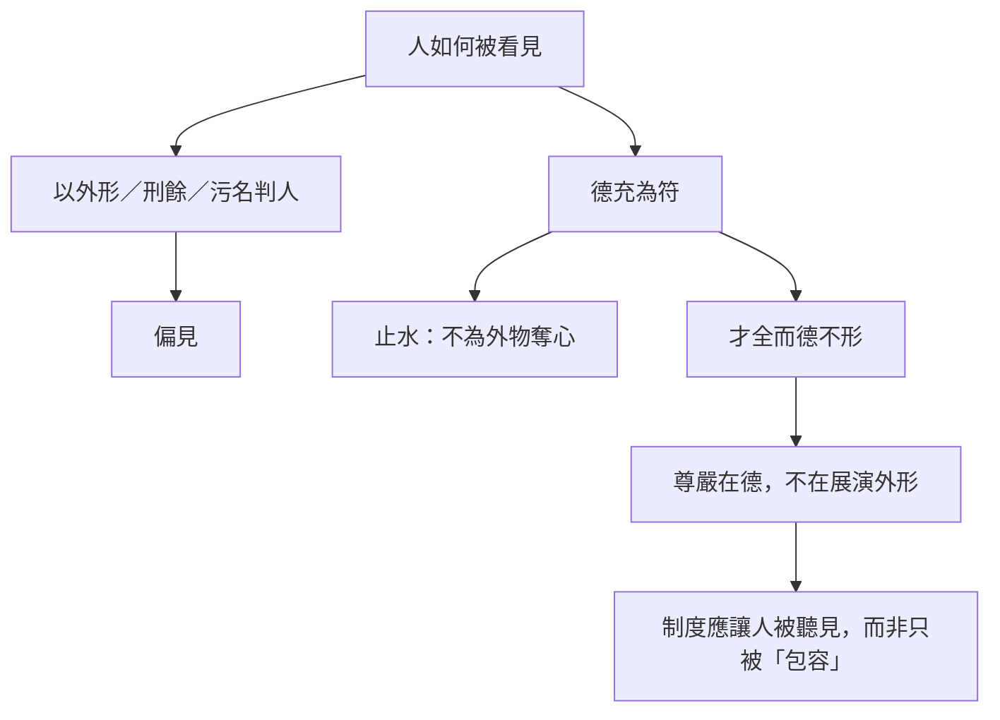

# 德充符

> **閱讀提示**：本篇以形體殘缺者為主角，批判的是以外形判人；不得將其浪漫化，或拿來否定障礙者的現實處境。

## 01. 篇名與背景

「德充符」意為內在德性充實而有可感之符驗。〈人間世〉談亂世保身，〈德充符〉繼而問：即使身體被刑罰或社會目光標為「不全」，人是否仍能保有完整的生命尊嚴？當制度以形貌、爵位、才用分人高下，德如何仍能「充」於內而不被外形奪走？

本篇是內篇身體政治與尊嚴論的核心。王駘、申徒嘉、哀駘它等寓言人物，皆在翻轉「形全才值得尊重」的秩序；「止水」「才全而德不形」則把問題從社會偏見推到內在是否被外物奪心。讀時須同時看見文本反污名的力量與古代刑罰背景，不可浪漫化殘缺。

> **原典位置**：內篇・第五篇・〈德充符〉

## 02. 成書背景

戰國刑罰常施於身體，刖足、劓鼻等使「兀者」成為可見的社會標記。形貌亦與仕進、婚配及社會地位相連；醜、殘、賤往往被視為德之不足的外證。本篇以寓言翻轉這套秩序，但不意味古代社會已實現平等——它是思想實驗與批判，不是歷史實錄。

通行本依郭象系統；引文據郭慶藩《莊子集釋》。與〈人間世〉支離疏可對讀：彼處重制度邊緣的保身，本篇重德之符驗與觀看方式的改正。

「德充」之「符」，不是迷信的靈驗，而是他人能感知的安定與真實——王駘使從者如市，哀駘它使女子求嫁，都是寓言誇飾，旨在刺破「形先於德」的習慣。

## 03. 結構分析

### 結構圖

```text
王駘：兀者而從者如市 → 魯君問孔子
        ↓
申徒嘉與子產：同堂而名分之困
        ↓
哀駘它：醜而人皆愛／避走
        ↓
闉跂支離無脣：說衛君
        ↓
止水、死生、同異 → 才全而德不形
```

若用一句話總括：**以形殘者動搖外形—價值連鎖，以止水收束於不為外物奪心。**

## 04. 原典

> **原典位置**：內篇第五篇〈德充符〉；版本依據：郭慶藩《莊子集釋》。以下為必要引用，非全篇逐字照錄。

### （一）王駘

> 魯有兀者王駘，從之遊者，與孔子中分。常季問於仲尼曰：「彼兀者也，而王先生，與之並立而爭言，不若王也。」

### （二）申徒嘉

> 申徒嘉者，衛之兀者也，與子產同師於伯昏無人。子產謂申徒嘉曰：「子不我與，子何與我辭？」

### （三）哀駘它

> 哀駘它者，魯人也，其母只而生之。……男子見之，皆走避之。女子見之，皆求其父而嫁之。

### （四）止水

> 人莫鑑於流水，而鑑於止水；唯止能止眾止。  
> 死生亦大矣，而不得與之變。雖天地覆墜，亦將不與之遺。

### （五）同異

> 自其異者視之，肝膽楚越也；自其同者視之，萬物皆一也。其知一也，其不知一也；其不知一也，其知一也。

### （六）遊心乎德之和（節錄）

> 故德有所長，而形有所忘，使天下忘其形者，莫若德焉。

「德不形」不是隱藏美德，而是德不以形名炫耀；這是全篇從社會偏見到內在修養的轉折。

### （七）仲尼論德（節錄）

> 仲尼曰：「丘也願與造物者為人。」

借孔子之口說「與造物者為人」，顯示德充主題亦在儒道對話場域中展開，不宜簡化為單純反儒。

## 05. 白話翻譯

### （一）王駘

魯國有個斷足的人叫王駘，跟從他遊學的人，與跟孔子的人幾乎各半。常季問孔子：他只是被截足的人，國君卻願意和他並立、爭著同他說話，您不如他。

### （二）申徒嘉

申徒嘉是衛國斷足者，與子產同師學道。子產說：你不肯與我同朝，為什麼又與我爭辯？

### （三）哀駘它

哀駘它是魯人，母親生他時只見一隻眼睛。男子見他都避走，女子見他卻求父親讓她嫁給他——德在形名之外發生作用。

### （四）止水

人不以流動的水為鏡，而以靜水為鏡；只有自身能安定，才能使別人的躁動也安定。死生是大事，但他不被它牽著改變；即使天地傾覆，也不遺失所守。

### （五）同異

從差異看，肝膽如楚越般相隔；從共同處看，萬物原可相通。知與不知，亦在此同異之間轉換。

## 06. 字詞註解

| 字詞 | 讀音／釋義 | 說明 |
|---|---|---|
| 德充 | 德性充實 | 非道德績效排行榜 |
| 符 | 外顯徵驗 | 指德的感化力，非迷信符籙 |
| 兀者 | 斷足受刑者 | 非用於貶稱現代障礙者 |
| 止水 | 安定之心 | 與僵化沉默不同 |
| 才全 | 才性完具 | 不等於技能齊全 |
| 德不形 | 德不炫耀於外 | 非隱藏美德以換名 |
| 遊心乎德之和 | 心遊於德之調和 | 內在充養之喻 |
| 形全 | 形體完整 | 子產所執，未必等於德全 |

## 07. 段落解析

**走讀路線**：王駘 → 申徒嘉 → 哀駘它 → 才全德不形。關鍵句：**德充於內**。

### 為何先寫王駘「從者如市」？

兀者王駘缺足，卻使魯國「從之者半於孔子」。這不是統計報告，而是**對子產爵位直覺的第一擊**：眾人追隨的，未必是形全位高者。子產「先見之而不言，後見之而不說」，暴露他仍被**身分秩序**困住——與王駘並立爭言，才顯出德充之符驗不在儀表。若開篇即講「德充」，易成抽象道德；先寫「市」，才讓讀者感到衝突。

### 申徒嘉與子產：為何同堂而對立？

受刑者與執政者同師學道，子產卻「子不我與，子何與我辭？」——**羞辱的結構在名分，不在辯論勝負**。申徒嘉「知自得其得」，不以外形自卑，反使子產的「完形」顯得狹隘。與王駘段呼應：形殘者不是被憐悯的客體，而是**逼問「誰有資格拒絕與誰同列」**的場景。

### 哀駘它：為何「醜而人皆愛」？

哀駘它「色惡而心悅」，男子避走、女子求父——**極端反轉**旨在刺破「先看形貌再定可否親近」的習慣。關鍵不在醜本身，而在**德不形**：感化發生於形名之外。後文「遊心乎德之和」把問題從社會偏見推到**內在是否被外物奪心**；才全、形全的辨析，防止讀者以為「只要內心好，外形無關」——原文從未否認形在現實中的重量，而是問形能否**僭越**為德的全部判準。

### 止水與死生：為何作哲學收束？

「莫鑑於流水而鑑於止水」——**動中能止，才能照物**；「死生亦大矣，而不得與之變」，不是冷血，而是**不因最大變故而丟失所守**。「自其異者視之，肝膽楚越；自其同者視之，萬物皆一」——同異並存，呼應〈齊物論〉而落於**身體與人際**：德充不是社交魅力，是**外物不能奪其中心**。

### 關跂支離無脣：為何還要寫？

關跂支離無脣說衛君，形體更殘，卻仍能以言動君——這防止讀者把德充符讀成「只要內心好，外形無關」的廉價安慰。原文從未否認形在現實中的重量；它問的是：形能否**僭越**為德的全部判準，以及觀看者能否改變其目光。

### 與他篇如何互讀？

支離疏在〈人間世〉從制度邊緣談保身，本篇從**德之符驗**談形不全仍可充。〈大宗師〉的[真人](content/terms/真人.md)「不逆物」與本篇止水相應；〈應帝王〉的鏡喻則是德不形在政治上的延伸。讀時宜分場景：本篇重**人如何被形名綁架**，不宜抽成「重內輕外」的心靈雞湯。

### 仲尼論王駘（節錄導讀）

孔子答常季：王駘「立不教，坐不論」，而學者去其師而學焉——德充之符驗，不在言教，而在感化。這段與哀駘它、申徒嘉形成三角：一重無言感化，一重名分之辱，一重形貌之惡，共同完成「德不形」的論證。讀者宜注意：孔子在寓言中常為「反身」角色，不宜直接等同儒家立場。全篇亦宜與〈人間世〉支離疏對讀，形成「形殘—德充—制度」的立體圖景。

## 08. 歷代注家怎麼看

### 郭象

郭象以「德充於內，形不害道」解釋，重在各安其性而不為外形所累。又說止水之止，是神安而不動於物。

### 成玄英

成疏強調忘形遣累、虛心應物；內德充實故能感人。對哀駘它段，多解為破相好之執。

### 林希逸

林氏提醒哀駘它故事是極端的文學反轉，目的在破相貌與名位之見，不可執為實錄以論醜美。

### 郭慶藩與其他

現代讀法應同時承認文本反歧視的力量與其古代刑罰背景，不能把殘缺當成抽象哲學素材。近人論述無障礙與尊嚴時，宜區分寓言批判與當代權利語言。又，子產段可與《左傳》子產形象對讀，但寓言人物不必與史實完全重合。

## 09. 哲學分析

> 以下為**本書現代詮釋**。

「德」在此不是可量化的品格清單，而是人不被形貌、處境與評價完全定義的穩定性。止水並非壓制情緒，而是不把他人的嫌惡內化為自身價值。這也要求制度改變：若只讚美個人超越，卻不處理無障礙、污名與排除，就誤讀了本篇對社會眼光的挑戰。

與[無用與有用](content/themes/無用與有用.md)主題相連：外形、才用常被當成「有用」的標準；本篇則問，當「無用」「不全」被污名化，人是否仍能德充於內？「才全而德不形」一句，宜與〈人間世〉「無用之用」對讀：一重內在充養，一重制度保全，內篇由此形成身心與制度的雙線倫理。

## 10. 與老子比較

《老子》說「大白若辱」「大巧若拙」，同樣反轉表面價值；「聖人不積」亦近不以外物定己。本篇更集中於身體、刑罰與被觀看者，敘事性更強。老子「常德不離」與「德充於內」可互參，但莊子更敢以極端形殘寓言刺破社會目光。

## 11. 與儒家比較

儒家重德化與人格感召，本篇亦說德能感人；其差異在於莊子更警惕禮法如何藉形貌、爵位區分高下。孟子「形色，天性也」亦承認身體，但儒家較信以禮文整飾；莊子則問整飾何時變成排斥。孔子「以貌取人，失之子羽」與王駘段可遙相呼應，顯示儒道在此有交會亦有張力。

## 12. 與佛學比較

哀駘它「才全而德不形」，後世或以「不以貌取」相參。對照有助鬆動對形軀的執取，但本篇論的是德充於內、符驗於外——形殘而人親，是價值重估，不是另一套身心論的譯名。

先讀兀者、惡人諸寓言的力量，再決定要不要旁參別家話頭。


## 13. 現代人生應用

> 以下為**本書現代詮釋**。

遇見外貌、疾病、年齡或身心差異時，先檢查自己的預設：是否把可見特徵當成能力和人格的證據？在組織中，尊重不能只靠「看見內在」，更要有可近用環境、反歧視流程與當事人發聲位置。

1. **形殘德全**：遇見外貌、疾病或身心差異時，先檢查自己是否把可見特徵當成能力與人格的證據。
2. **哀駘它**：吸引力若來自德充而非外形標準，組織與公共空間便應讓當事人被聽見、被信任，而非只被「包容」。
3. **止水照人**：安定不是麻木；先讓自己的目光少被外物搖動，才較能公正回應他人。
4. **制度回扣**：無障礙、反歧視流程與當事人決策權，才是對「不以形貶人」的具體回應。

### 13.1 觀看習慣的改正

面對身心差異、年齡、口音、穿著等可見線索，練習「延遲判斷」：先完成任務所需資訊，再讓偏見入場。德充符所批判的，是偏見搶在認識之前。

### 13.2 組織與公共空間

「包容」若只停留在口號，而無障礙設計、合理調整與當事人參與決策，仍是把負擔丟給個人。哀駘它的故事若讀成「內心好就夠」，便誤讀；制度必須讓德充有落實的環境。

### 13.4 觀看者的責任

德充符不只要求「被看者」堅強，更要求**觀看者改變**。王駘、哀駘它的故事都在問：你為何跟從、為何避走、為何求嫁？尊嚴是雙向的：一方德充，一方亦須停止以形取人。

## 14. 常見誤解

1. **德充符說殘缺更高貴**：它否定以形貶人，不美化痛苦。
2. **內在好就不必改制度**：這恰把負擔丟回個人。
3. **止水是沒有情緒**：它是安定，不是麻木。
4. **哀駘它＝外貌不重要、歧視自然消失**：故事挑戰以形取人，仍要求環境與規範跟著改變。
5. **德充＝靠意志克服身體限制**：本篇談的是不被社會目光耗盡，不是否定醫療、輔具與合理調整。
6. **王駘＝鼓勵斷足**：是批判以形取人，不是鼓吹刑罰。
7. **才全＝才藝齊全**：才全是性分完具，不是技能排行榜；與「德不形」連讀，方知全在內不在外。
8. **止水＝不問世事**：是內在安定以照物，不是對不公義沉默；申徒嘉反辱子產，正是有德者的回應。
9. **同異＝取消差異**：同異並存，是觀看方式可轉換，不是說身體差異不存在或無須照護。

## 15. 本篇總結

〈德充符〉以形殘者動搖「外形—價值—資格」的連鎖。德充不是掩蓋身體，而是讓人不被社會目光耗盡，同時要求目光本身接受質詢——這是內篇在保身之後，對尊嚴與觀看倫理的深化。王駘、申徒嘉、哀駘它各從不同角度刺破「形先於德」，止水與同異則把問題收於內在安定與觀看方式。

若以一句話收束：**德充於內，符驗於人，而不以外物奪其心。**

## 16. 心智圖




## 17. 延伸閱讀

- 郭慶藩《莊子集釋》〈德充符〉
- 成玄英《南華真經注疏》〈德充符〉
- 林希逸《莊子口義》〈德充符〉
- 陳鼓應《莊子今註今譯》；王邦雄《莊子內七篇‧外秋水‧雜天下的現代解讀》

---
### 交叉引用
- 相關篇章：〈人間世〉、〈大宗師〉、〈養生主〉
- 相關人物：王駘、申徒嘉、子產、哀駘它
- 相關名詞：德充、才全、止水、形殘德全
- 相關主題：[無用與有用](content/themes/無用與有用.md)、身體、歧視、尊嚴、制度

### 讀法建議

初讀可先通讀全篇，由形殘而德充的諸對話讀到「才全而德不形」；再回看第四節節錄與第七節段落關係。進一步研究宜並置郭象對德充於內、成玄英對忘形與林希逸對寓言機鋒的說明，並以郭慶藩核對字句。與當代身心障礙研究、反歧視法規對讀時，須標明古今語境差異，勿把刑罰寓言直接套於現代障礙者。止水、同異兩段宜與〈齊物論〉並讀，看身體政治如何承接認識批判。
