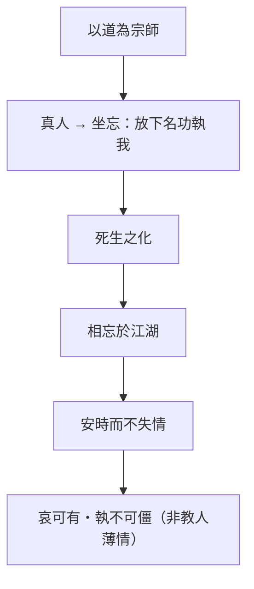

# 大宗師

> **閱讀提示**：本篇以「道」為最高宗師；死生之論旨在改變執取，不是要求人不哀或輕忽死亡。

## 01. 篇名與背景

「大宗師」即以道為大宗師。〈德充符〉由形殘見德，本篇再推至死生：若身形與遭遇皆變，人如何不把生死當作唯一的自我判決？當人間師表、名分、儀式都無法安頓最後的失去，還有什麼可依？

本篇是內篇死生觀與修養論的頂峰。真人、坐忘、相忘於江湖、子桑戶之死等段落，把〈齊物論〉物化、〈養生主〉安時處順推到喪祭與友誼現場。其後〈應帝王〉以渾沌收束內篇政治寓言，宜與本篇「不逆化」連讀：個人死生與政治塑形，同屬「不可強加」的範圍。

> **原典位置**：內篇・第六篇・〈大宗師〉

## 02. 成書背景

內篇以戰國寓言處理死亡、友誼與修養。真人、女偊與顏回、子桑戶等故事未必是史實人物；道家、儒家對喪禮各有傳統，本篇以鼓琴、號而歌等情節挑戰禮之唯一形式。通行本依郭象注系統，以下引文依郭慶藩《莊子集釋》。

戰國動亂，死生常見；莊子不以宗教來世安撫，而以「化」「同體」重新安置失去。讀者宜辨：這是哲學態度，不是臨床哀傷手冊。

女偊教顏回、子祀子輿論死生等段落，顯示本篇亦屬「師友傳道」文類；與儒家師弟、喪祭傳統並存於戰國文化場域，宜並讀而不宜二選一。

## 03. 結構分析

由道先天地的描述立宗，再寫真人與坐忘的工夫，接著由相忘與四友的病死，讓抽象的死生觀落在關係與儀式裡。

### 結構圖

```text
道為宗師（有情有信、可傳不可受）
        ↓
真人：不逆物、其息深深
        ↓
女偊／顏回：坐忘
        ↓
子祀子輿：相與語死生
        ↓
相忘於江湖 → 子桑戶之死與鼓琴
        ↓
化、命、安時
```

若用一句話總括：**以道代師表，以真人立理想，以坐忘鬆執，以喪友驗是否薄情。**

## 04. 原典

> **原典位置**：內篇第六篇〈大宗師〉；版本依據：郭慶藩《莊子集釋》。以下為必要引用，非全篇逐字照錄。

### （一）道為宗師

> 夫道，有情有信，無為無形；可傳而不可受，可得而不可見；自本自根，未有天地，自古以固存。

### （二）真人

> 古之真人，不逆寡，不雄成，不謨士。……其寢不夢，其覺不憂，其食不甘，其息深深。真人之息以踵，眾人之息以喉。

### （三）坐忘

> 墮肢體，黜聰明，離形去知，同於大通，此謂坐忘。

### （四）相忘於江湖

> 泉涸，魚相與處於陸，相呴以濕，相濡以沫，不如相忘於江湖。

### （五）子桑戶之死

> 子桑戶、孟子反、子琴張三人相與語曰：「孰能相與於無相與，相為於無相為？」……子桑戶死。子貢弔之，見或歌，或哭。

### （六）子祀子輿（節錄）

> 子輿病，子祀往問之。……「偉哉夫造物者，其以予為拘攣也！」……「予惡乎惡哉！」

病與死兩段並置，測試「安化」是否薄情；是全篇情感張力最高處之一。

### （七）孟孫才之喪（節錄）

> 孟孫氏之為人也，無知幾何，而喪之親戚，哭無哀聲。

又一喪事反例：哭無哀聲亦非真道，莊子藉此再破「形式即真情」的兩端執著。

## 05. 白話翻譯

### （一）道

道有其真實可信之處，卻無所作為、沒有固定形狀；可由人相傳而不能像物品般授受，可體得而不能以眼看見。它自本自根，天地未生以前就已存在。

### （二）真人

古代真人不逞強補救不足，不以成功自雄，也不急著出謀。他睡覺不做夢，醒來不憂慮，吃飯不貪味，呼吸深沉——真人的氣息連到腳跟，常人只到喉嚨。

### （三）坐忘

放下對肢體、聰明與形知的執著，與大道相通，這叫坐忘。

### （四）相忘

泉水枯竭，魚在陸地互相吐沫潤濕，還不如在江湖中彼此忘卻。

### （五）子桑戶

子桑戶、孟子反、子琴張三人相約：誰能在無心相與中相與，在無為中相為？子桑戶死了，子貢去吊唁，見有人唱歌，有人哭泣。

## 06. 字詞註解

| 字詞 | 讀音／釋義 | 說明 |
|------|------------|------|
| 大宗師 | 以道為最高師 | 非人間宗師可完全取代 |
| [真人](content/terms/真人.md) | 真實而通於道的人 | 非神仙頭銜 |
| [坐忘](content/terms/坐忘.md) | 坐而忘形知 | 非昏沉或失憶 |
| [物化](content/terms/物化.md) | 萬物變化、彼此轉化 | 與夢蝶、死生相連 |
| 化 | 變化 | 生死是化的一環 |
| 命 | 所遇之分 | 不等於消極宿命 |
| 安時處順 | 安於所遇、順其變化 | 承〈養生主〉而來 |
| 相呴以濕 | 互相吐沫潤濕 | 涸澤之魚，非常態 |
| 鼓琴而歌 | 彈琴唱歌 | 喪禮中的反禮之舉 |

## 07. 段落解析

**走讀路線**：道為宗師 → 真人 → 坐忘 → 子祀子輿。關鍵句：**安死生之化**。

### 為何先立「道為大宗師」而不先談真人？

篇首「道，有情有信，無為無形；可傳而不可受，可得而不可見」——**先把宗師從人間師表移開**。若一開始就講真人，讀者易把真人當成可模仿的「完美人設」；先說道的不可物化，才使後文真人、坐忘、物化都指向**不可據有的依歸**，而非新教條。這與〈齊物論〉破成心、〈逍遙遊〉破有待，在內篇屬第三層：**知「我」亦非固定主體後，如何活？**

### 真人段：「不逆物」在說什麼？

真人「其寢不夢，其覺不憂，其食不甘，其息深深」——不是禁欲標榜，而是**不與物逆、不與化爭**的生命姿態。「以道觀之，物無所謂死生、存亡」是從化之整體看，不是取消個別哀樂。與後文子桑戶之死對讀：若只摘「安時處順」，會誤以為莊子要求無情；**真人段先立理想型，後文用喪友測試這理想是否薄情。**

### 坐忘：為何要「捐」仁義禮樂？

[顏回](content/figures/顏回.md)「墮肢體，黜聰明，離形去知，同於大通」——**坐忘是鬆開形知對道的遮蔽**，不是反道德口號。「同於大通」也不是融入神秘能量，而是**不再以固定名分塞住感通**。與〈人間世〉心齋連續：心齋是進場前的虛，坐忘是**更深一層的捐執**；兩者皆不是放空，而是讓「道集虛」。

### 相忘於江湖與子桑戶：為何置末？

「泉涸，魚相與處於陸，相呴以濕，相濡以沫，不如相忘於江湖」——**困局中勉強維持，不如各自回到可游之處**；這不是鼓吹遺棄，而是問關係是否只剩「干涸時的互濕」。子桑戶死，子貢「絲絲而哭」，子琴張「鼓琴而歌」——**同一喪事，兩種哀**；莊子不是要選邊，而是逼問：禮能否承認**死即化**，而不把死者鎖為「永遠失去」？

### 子祀子輿：病與死的對話

子祀、子輿、子犁、子來「以無為首，以生為脊，以死為尻」相與為友，子輿病，子祀問之，答以「偉哉夫造物者」——這是全篇最富戲劇性的死生場景。它測試讀者：能否在病苦中仍說「予惡乎惡哉」？不是讚美痛苦，而是**不把變化當成對「我」的侮辱**。與子桑戶之喪並讀，一為病中，一為死後，共同完成「安化」的立體描寫。

### 與他篇如何互讀？

〈大宗師〉把〈齊物論〉[物化](content/terms/物化.md)、〈養生主〉安時處順推到**死生與喪祭**；〈應帝王〉的渾沌則是政治版的「不可強加」。外篇〈至樂〉鼓盆、〈知北遊〉道在卑近，可與本篇對讀，但本篇重**友與師的宗極**。內七篇至此，由逍遙→齊物→養生→人間→德充→大宗師→應帝王，形成一條由**尺度、生命、處世、形名、死生到政治**遞升的線。

### 女偊教額回（節錄導讀）

女偊「其居也，思道不務其服；其臨喪也，無服色之變」——真人不是無情，而是不被服飾、儀色牽動；這與子桑戶之喪的鼓琴並讀，可見莊子對「哀之形式」的持續追問，而非一概反禮。

## 08. 歷代注家怎麼看

### 郭象

郭象以「任其自化」解真人，不以人力逆天；其長處是強調不強作。對坐忘，則說忘懷形知、冥合大道。

### 成玄英

成玄英以忘形遣知、冥同大道解坐忘，較突出修養次第。對子桑戶段，多解為順化不執。

### 林希逸

林希逸重文脈，指出相忘不是薄情，而是有江湖可遊時不必在枯竭處勉強相濡；鼓琴而歌是文情反折，非反禮之輕率。

### 郭慶藩與其他

郭慶藩可供字義、異文參照；今人多由此篇討論莊子的死生觀，宜避免將其說成否認親情。王邦雄等現代詮釋多強調「安化」與「不失情」並存。又，女偊教顏回「墮肢體」一段，歷來與道教內丹傳統有糾葛，讀莊子原典時宜先回到郭象、成玄英的脈絡，再論後世發展。

## 09. 哲學分析

> 以下為**本書現代詮釋**。

真人不是完美人格，而是不把控制感當作生命唯一支柱。坐忘先鬆開「我必須靠身分、能力、記憶維持自己」的執著；物化則使死亡不只是剝奪，也回到變化的整體。這不取消醫療、哀傷或倫理責任。

本篇與[死亡與喪親](content/themes/死亡與喪親.md)主題直接相連：它不提供「不要哭」的口訣，而問哀傷如何不變成對變化的永久拒絕；相忘則問關係能否在活水裡，而非只在涸澤中互濕。又，「同於大通」可與[物化](content/terms/物化.md)、[坐忘](content/terms/坐忘.md)、[道](content/terms/道.md)等名詞連讀，形成內篇死生工夫的概念叢集。

## 10. 與老子比較

《老子》重「復歸於根」與不爭，「出生入死」亦談死生之域；本篇則由真人、友誼和喪禮具體呈現返本與順化，敘事性更強，情感張力更大。

## 11. 與儒家比較

儒家以喪禮安置哀與關係，「三年之喪」重情之深；本篇以鼓琴挑戰禮的唯一形式。兩者都在面對失去，分歧在是否以既定儀式衡量真情——可並讀而不必二選一。曾子「慎終追遠」與秦失三號亦可對讀：禮之真情與形式，始終是儒道共同關心的問題。

## 12. 與佛學比較

真人、坐忘、相忘於江湖，常被聯想到無我、無常。並讀可以加深「死生一條」的感受，但本篇大宗是師法造化：造適不及笑，安排而去化。

坐忘是忘仁義禮樂之階，通向與天為徒；宜留在先秦氣化與師友敘事裡讀。


## 13. 現代人生應用

> 以下為**本書現代詮釋**。

遭逢病痛、退休或喪親時，可問哪些身份正在被迫改變，並讓哀傷有時間與關係承接。相忘的提醒不是切斷照顧，而是別把困局常態化：能修復泉源時，應共同尋回江湖。

1. **真人**：在病痛、退休或失親時，少用「應該看破」催自己；先讓哀傷有關係、儀式與專業承接。
2. **坐忘**：練習放下卡住自己的名、功與固定自我敘事，好讓下一步仍能應變——不是關掉現實。
3. **相忘於江湖**：困局若可修復，應共同尋回可游泳的活水；相忘不是切斷照顧，而是別把魚相濡以沫的非常態當成唯一關係模式。
4. **子桑戶之喪**：允許哀的多元形式；不必用單一哭儀衡量真情。

### 13.1 喪親與儀式

失去親友時，不必用「應該看破」催促自己或他人。坐忘與安時是長期工夫，不是喪禮當下的強制標準。可保留哭泣、保留儀式，同時問：我是否在抗拒變化本身，還是在誠實地愛？

### 13.2 相忘於江湖的關係

長期照顧者與被照顧者、高度依賴的伴侶或同事，有時陷入「相濡以沫」的枯竭狀態。相忘不是遺棄，而是共同尋找可恢復自主與資源的「江湖」——分工、喘息、外援、制度支持，都是復泉之道。

### 13.4 醫療與臨終

「順命」不否定治療與照護。真人段與子祀子輿段可與現代緩和醫療、安寧病房對話：目標不是「看破」，而是在變化中減少不必要的抗拒與自我折磨，同時保留關係與專業支持。

## 14. 常見誤解

1. **齊生死＝不悲傷**：本篇處理的是不被哀傷吞沒。
2. **坐忘＝放空**：它是去執的工夫，不是逃避現實。
3. **順命＝拒絕治療**：原文未授權放棄照護。
4. **真人＝冷酷無感情的超人**：真人之真在於不以外物傷生，不是否定親愛與哀悼。
5. **相忘江湖＝關係裡誰都不管誰**：能相忘於道，前提是活水還在；泉涸處仍須互助，並設法復泉。
6. **鼓琴而歌＝喪禮都該唱歌**：是挑戰禮之唯一，不是取消一切儀式。
7. **坐忘＝反道德**：坐忘是鬆形知之執，不是建立新的道德優越；捐仁義是破執，不是反人倫本身。
8. **真人無夢＝禁欲標榜**：是「不與物逆」的寫法，不是生理學陳述；勿以字面論斷真人生活。
9. **相忘＝遺棄親友**：相忘前提是江湖仍在；涸澤相濡時仍須互助，並設法復泉。

## 15. 本篇總結

〈大宗師〉以道取代外在權威，以真人、坐忘與死生之化鬆開自我固著。它要人學的不是冷漠，而是在不可控變化中仍能不失其通——這是內篇在德充之後，對終極依歸與喪失的正面回答。子桑戶之喪與子祀子輿之病，是全文情感試金石：若讀成薄情，便誤讀；若讀成無哀，亦誤讀。

若以一句話收束：**以道為師，以化為友，以安時處順收死生之大變。**

## 16. 心智圖




## 17. 延伸閱讀

- 郭慶藩《莊子集釋》〈大宗師〉
- 成玄英《南華真經注疏》〈大宗師〉
- 林希逸《莊子口義》〈大宗師〉
- 陳鼓應《莊子今註今譯》；王邦雄《莊子內七篇‧外秋水‧雜天下的現代解讀》

---
### 交叉引用
- 相關篇章：〈養生主〉、〈德充符〉、〈齊物論〉、〈至樂〉
- 相關人物：[顏回](content/figures/顏回.md)、女偊、子桑戶、孟子反
- 相關名詞：[真人](content/terms/真人.md)、[坐忘](content/terms/坐忘.md)、[物化](content/terms/物化.md)、[道](content/terms/道.md)、安時處順
- 相關主題：[死亡與喪親](content/themes/死亡與喪親.md)、友誼、身分

### 讀法建議

初讀可先通讀全篇，由道有情有信、真人之息到坐忘、死生之化；再回看第四節節錄與第七節段落關係。進一步研究宜並置郭象對獨化、成玄英對坐忘工夫與林希逸對死生寓言的文勢說明，並以郭慶藩核對字句。與〈至樂〉鼓盆、〈養生主〉安時處順並讀，可形成內篇死生觀的完整輪廓。子桑戶之喪與孟孫才之喪若並讀，可見莊子如何破「哭儀即真情」的兩端執著。
