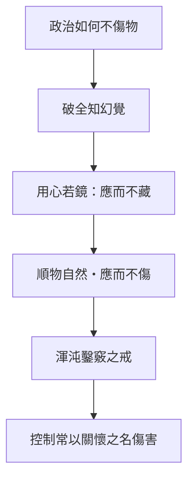

# 應帝王

> **閱讀提示**：本篇的無為政治批判強制塑形與炫耀治理；不等於主張政府放棄公共責任。

## 01. 篇名與背景

「應帝王」說明如何面對帝王、亦如何作為治理者而不以私智宰制。內篇最後以渾沌被鑿七竅而死作結，將政治的問題濃縮為：善意改革為何可能殺死所欲改善者？從〈逍遙遊〉的無待到〈齊物論〉的兩行，再到本篇的「用心若鏡」，內七篇形成一條由個人到政治的回應鏈。

本篇是全書[政治與無為](content/themes/政治與無為.md)主題在內篇的收束。壺子破神巫、肩吾問連叔、渾沌鑿竅，分別破除全知幻想、誤讀無用、以及強制同化——三者皆指向：治理不在於把世界雕成自己的形狀。

> **原典位置**：內篇・第七篇・〈應帝王〉

## 02. 成書背景

戰國諸侯競逐富強，治術往往意味徵發、教化與控制。商鞅變法、孟子王道、老子無為，各提供不同政治想像；本篇以寓言回應這種治理欲，不提出具體制度藍圖，而警戒**私意整容**。通行本依郭象系統，以下依郭慶藩《莊子集釋》。

渾沌故事與《山海經》神話可能有淵源，編入莊學後成為政治寓言的經典結局。讀者宜辨：批判的是「強加」，不是一切教育與公共行動。

蒲衣子段（通行本或有異文）與肩吾連叔並置，顯示內篇結局不只有渾沌一槌定音，亦有「明王」「神人」等理想型的多層鋪陳——最終仍歸於「無容私」與「勿強造」。

## 03. 結構分析

由識人神巫受壺子戲弄，破除全知者；由肩吾問連叔，展示無功之治；再以蒲衣子與渾沌故事收束。

### 結構圖

```text
神巫季咸自信知人 → 壺子四示其形
        ↓
肩吾／連叔：藐姑射神人、無功之治
        ↓
「用心若鏡」「順物自然」
        ↓
儵忽報德 → 渾沌鑿竅七日而死
```

若用一句話總括：**先破全知，再立鏡喻，最後以渾沌之死定格強加之害。**

## 04. 原典

> **原典位置**：內篇第七篇〈應帝王〉；版本依據：郭慶藩《莊子集釋》。以下為必要引用，非全篇逐字照錄。

### （一）壺子與神巫

> 鄭有巫者季咸，知人死生、存亡、禍福、壽夭，期以歲月日，若神。……壺子曰：「吾示之以地文，……示之以天壤，……示之以太沖，……示之以未始出吾宗。」

### （二）用心若鏡

> 至人之用心若鏡，不將不迎，應而不藏，故能勝物而不傷。  
> 順物自然而無容私焉，而天下治矣。

### （三）肩吾與連叔

> 肩吾問於連叔曰：「吾聞言於接輿，言而無當，狂而不端。吾與化為人，心未嘗死，南有藐姑射之山，有神人居焉。」

### （四）渾沌之死

> 南海之帝為儵，北海之帝為忽，中央之帝為渾沌。儵與忽時相與遇於渾沌之地，渾沌待之甚善。儵與忽謀報渾沌之德，曰：「人皆有七竅以視聽食息，此獨無有，嘗試鑿之。」日鑿一竅，七日而渾沌死。

### （五）明王（節錄，各本詳略或有異）

> 明王治天下也，好問而好察；以天下為度，不以一己私意塞住。

明王與渾沌形成對照：一為「好問好察」的正面理想，一為「強加開竅」的悲劇結局。

### （六）為己／為名（節錄，後段）

> 為己，學者也；為人，役夫也。

內篇結尾常連及「為己／為人」之辨：治理若為名、為功，便近役夫；為己之學，則近虛而應物。與鏡喻、無容私一脈相承。

## 05. 白話翻譯

### （一）壺子

鄭國有巫者季咸，能預知人的死生禍福，準確如神。壺子四次展示不同「形」，使神巫最後「立未定，逃失屨」——能知者，其實不知。

### （二）若鏡

至人用心像鏡子：不預先迎接，也不把來者藏住；只是如實回應，因此能勝任外物而不傷害。順著萬物的自然，不容進私意，天下便可治理。

### （三）藐姑射神人

肩吾聽接輿的話覺得狂放，連叔則說南方藐姑射山有神人，乘雲龍而遊，不務俗功——不是無用，而是不讓俗務定義自己。

### （四）渾沌

儵、忽感謝渾沌厚待，想替他鑿出七竅；一天一竅，第七天渾沌死了。

## 06. 字詞註解

| 字詞 | 讀音／釋義 | 說明 |
|------|------------|------|
| 應 | 感應、應對 | 非迎合 |
| 若鏡 | 如鏡照物 | 不預設、不滯留 |
| 不將不迎 | 不先迎、不強拒 | 與「藏」相對 |
| 應而不藏 | 回應而不固執 | 非無記憶，是不執 |
| 無容私 | 不容納私意 | 非沒有判斷 |
| 渾沌 | 未分化的整體 | 寓言形象 |
| 七竅 | 視聽食息之孔 | 秩序象徵 |
| 儵／忽 | 南海／北海之帝 | 名含「忽忽」之速 |

## 07. 段落解析

**走讀路線**：神巫遇壺子 → 無為而治 → 渾沌鑿竅。關鍵句：**無容私、勿強造**。

### 為何先寫神巫「知人」而非先講無為？

季咸能預知生死，鄭人「見之皆走」——**治理與占驗共享同一套「全知幻想」**。壺子四示其形（地文、天壤、太沖、未始出吾宗），使神巫「立未定，逃失屨」：**能知者，其實不知**。這是內篇政治篇的開場：在談帝王之前，先拆掉「有人能完全讀懂他人」的前提。若跳過此段，「用心若鏡」易讀成個人修養，而非**對權力知識的警覺**。

### 肩吾與連叔：「無功之治」如何說？

肩吾聽說「神人」不問俗務，以為「是與無用同也」——**把無為誤讀成無用**。連叔以藐姑射神人、乘雲龍而遊，說明**不務俗功，正因不讓俗務定義自己**；這呼應〈逍遙遊〉神人，但語境已轉向**誰配當帝王、誰在旁觀**。與壺子段銜接：一破「知人之巫」，一立「不為功所役之神人」，為鏡喻鋪路。

### 「用心若鏡」：應與迎、藏如何並存？

「不將不迎，應而不藏，故能勝物而不傷」——**不預設迎接（將），也不把經驗鎖死（藏）**；鏡照物來物去，物與鏡皆不傷。這不是無判斷，而是**不因私意變形所應**。「順物自然而無容私焉，而天下治矣」——治，在於少塞入私智，不在於取消責任。與〈人間世〉心齋、〈齊物論〉兩行可互參：虛以應物，而非虛以逃避。

### 渾沌鑿竅：為何作內篇結局？

儵忽報德，「人皆有七竅……此獨無有，嘗試鑿之」——**把「人人皆有」當成應強加的標準**，七日而渾沌死。動機是善，手段是「讓他像大家一樣」，結果是**殺死異質本身**。這使全篇無為從哲學句變成**政治悲劇**：內七篇以渾沌收束，把「應帝王」的問題定格在——**善意改革、教化、開竅，何時變成暴力？**

### 蒲衣子與明王：理想治術的另一面

通行本中，肩吾問連叔之後，尚有關於「明王」治天下、蒲衣子傳道的段落（各本詳略或有異）。其要義與鏡喻一致：**好問而好察，以天下為度，不以一己私意塞住**。這說明內篇政治理想不是「什麼都不做」，而是**做而不私容、察而不強加**。讀渾沌前宜知此層，免把無為誤讀成虛無。

### 與他篇如何互讀？

渾沌與〈人間世〉顏回勸諫、外篇〈駢拇〉外加仁義同族：**以己尺度強加於人**。〈大宗師〉的坐忘是向內鬆執；本篇是向外**戒私容**。外篇〈在宥〉「無攖人心」、〈天道〉「虛靜無為」可延伸此線，但內篇結局最尖銳——**連報德都可以是殺機**。

### 天根問無名（節錄導讀）

後段天根問無名於至道，答以「至道之精，窈冥冥冥」——內篇結尾常連及無名、無為，與開篇壺子破「有名之知」呼應：政治與修養皆須戒執有名、可占之「知」。此層與渾沌寓言合讀，內七篇便在「不可強加」處收束，為全書內篇畫下句點。

## 08. 歷代注家怎麼看

### 郭象

郭象以鏡不留物解「應而不藏」，強調感而後應、無心順物。對渾沌，則說鑿竅失其本真。

### 成玄英

成玄英說虛心照物、不將不迎，將無為解作不以私智傷物。對壺子段，多解為示道之深，非術數。

### 林希逸

林希逸把渾沌故事讀作寓言警策：人常以自己所習為善，反害其本；又指出儵忽之名含「忽忽」之速，諷輕率改造。

### 郭慶藩與其他

郭慶藩可供校勘；近代討論常由本篇連至反技術官僚、反家長主義，須避免把古文直接套作現代制度答案。又，壺子「未始出吾宗」歷來被解為示道之極，與神巫占驗形成方法論對立：一重變化不可執，一重預測不可恃。

## 09. 哲學分析

> 以下為**本書現代詮釋**。

鏡的理想是回應能力，不是被動。好的治理需觀察具體處境、接受回饋、承認不知道；「無容私」尤其防止把統治者的偏好偽裝為普遍需要。渾沌之死警告改革者：若只以同一標準設計人與社會，善政也可能成為傷害。

本篇與[逍遙](content/terms/逍遙.md)的無待、[政治與無為](content/themes/政治與無為.md)相連：外不強加，內不執私；「應」因此是動態的、情境的，不是放任。渾沌之死亦可與[無用之用](content/terms/無用之用.md)對讀：渾沌之「無用」（無七竅）恰是其存，強加「有用」標準即殺之——這是內篇對「有用邏輯」最極端的政治寓言。

## 10. 與老子比較

《老子》以「無為而無不為」及「我無為而民自化」批評多欲多事；〈應帝王〉以鏡與渾沌更強調回應性與差異。老子偏重治國格言，本篇偏重寓言悲劇與全知批判。老子「聖人常善救人，故無棄人」與渾沌之死可對讀：救人之善，若變成強加，亦可能成棄人之惡。

## 11. 與儒家比較

儒家重教化與德治，莊子則追問教化何時越過人的自性。孟子「勿施諸人」與渾沌寓言可對話：可把本篇視為對善意權力的限制，而非否定公共照護。孔子「己所不欲，勿施於人」亦近「無容私」，但儒家更重教化與正名，莊子則更警覺教化之暴力面。

## 12. 與佛學比較

渾沌鑿竅、用心若鏡，後世或比附不執、隨緣。鏡喻確有跨傳統的親和，但本篇是治道寓言：明王之治，功蓋天下而似不自己。

重點在少鑿、少強求，讓政治不要把渾沌開成七竅俱死。


## 13. 現代人生應用

> 以下為**本書現代詮釋**。

管理者可把「若鏡」轉成程序：先聽當事人、用小規模試行、設回饋與撤回機制，再推行政策。親密關係亦然：不要以「為你好」鑿掉對方的差異；涉及危害時，尊重差異不排除明確界線與保護。

1. **無為而治／應物若鏡**：政策與管理先聽受影響者、小規模試行、公開回饋與撤回機制；少用「我已全知」強推單一方案。
2. **渾沌鑿七竅**：親密關係與組織改造皆然——「為你好」若鑿掉對方的差異，善意也會致命；涉及危害時，尊重差異仍須搭配明確界線與保護。
3. **無容私**：問自己此刻的改革衝動，是在回應物勢，還是在把自己的正常樣貌強加給所有人。
4. **破神巫**：警惕「專家全知」敘事；預測與模型不能取代受影響者的聲音。

### 13.1 政策試行與撤回

「應而不藏」可轉為治理程序：試行期、影響評估、受影響者聽證、撤回條款。渾沌之死是沒有試行、沒有聽證、以「為你好」強推的極端寓言。

### 13.2 教育與教養的邊界

父母、師長、管理者常想「開竅」對方。尊重差異不等於放任危害；但在價值觀、生活方式、職涯選擇上，宜先問：我是在回應對方的需要，還是在複製自己的正常？

### 13.4 改革倫理

渾沌寓言可轉為改革倫理三問：誰定義「正常」？受影響者能否說不？失敗能否撤回？「七日鑿竅」是沒有試行、沒有同意、沒有退路的極端；現代治理宜以此為反面教材，而非反對一切改變。

## 14. 常見誤解

1. **無為＝不治理**：它批評妄為，並要求更細的應物能力。
2. **渾沌＝愚昧最好**：故事批判強制同化，非讚美無知。
3. **若鏡＝沒有立場**：鏡能照見並回應，只是不先以私意扭曲。
4. **鑿七竅＝反對一切學習與開化**：故事反對的是強制同化與私意整容，不是否定教育與溝通。
5. **無容私＝領導者不能有判斷**：無私要求的是不以成見扭曲回饋，不是放棄對弱者的保護責任。
6. **壺子＝反科學**：破的是占驗式全知，不是反對一切知識與證據。
7. **無為＝不負責任**：鏡喻要求更細的觀察與回應；無為是無妄為，不是無作為。
8. **明王與渾沌矛盾**：明王重察，渾沌重不強加；二者合流於「以天下為度、無容私」。
9. **為己為人段＝只顧自己**：「為己」在此近「為本」之學，不是自私；與「為人役」相對，是戒以功名役心。
10. **鏡喻＝被動**：鏡能照見並回應；應帝王之「應」是動態回應，不是無所作為。

## 15. 本篇總結

〈應帝王〉以無心若鏡收束內篇：從逍遙的無待、齊物的兩行，到治理時不強加私智。渾沌之死留下最尖銳的提醒：改善他人之前，先問自己是否正在把他變成自己——這是內七篇政治寓言的句點。壺子破巫、連叔立神人、鏡喻立應物、渾沌破強加，四層遞進，缺一層都易誤讀無為。

若以一句話收束：**應物若鏡，無容私意；勿以善名，鑿人七竅。**

## 16. 心智圖




## 17. 延伸閱讀

- 郭慶藩《莊子集釋》〈應帝王〉
- 成玄英《南華真經注疏》〈應帝王〉
- 林希逸《莊子口義》〈應帝王〉
- 陳鼓應《莊子今註今譯》；王邦雄《莊子內七篇‧外秋水‧雜天下的現代解讀》

---
### 交叉引用
- 相關篇章：〈逍遙遊〉、〈齊物論〉、〈人間世〉、〈在宥〉
- 相關人物：壺子、神巫季咸、肩吾、連叔、儵、忽、渾沌
- 相關名詞：[道](content/terms/道.md)、無為、若鏡、應
- 相關主題：[政治與無為](content/themes/政治與無為.md)、管理、差異、改革

### 讀法建議

初讀可先通讀全篇，由明王之治、應物無私到渾沌七日而死；再回看第四節節錄與第七節段落關係。進一步研究宜並置郭象對無心應物、成玄英對渾沌義與近人對鑿竅寓言的政治解讀，並以郭慶藩核對字句。外篇〈在宥〉「無攖人心」、〈秋水〉天人之分可延伸此線，但內篇結局最尖銳。讀畢內七篇，宜回頭從〈逍遙遊〉無待一路追至渾沌，看個人工夫如何匯入政治警戒。
