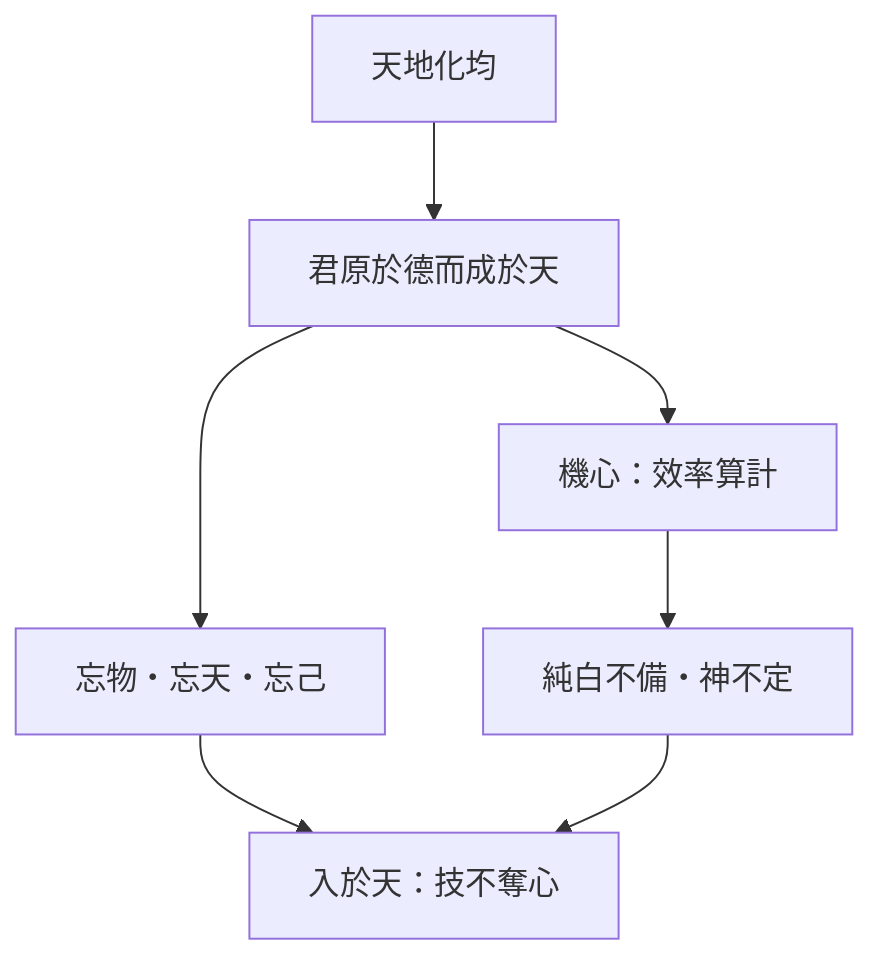

# 天地

> 閱讀提示：本文依通行本次序說明；「原典」「注家」與「本書現代詮釋」分列，不把後世說法偽作莊子原意。

## 01. 篇名與背景
〈天地〉以「天地」命名，先立宇宙與政治的共通尺度：天地雖大，其化均；君原於德而成於天。外篇前四篇（駢拇至在宥）多從仁義、治術的副作用切入；本篇則把問題提升到「帝道／聖德」如何與天德相應，再以漢陰丈人拒用桔槔，把抽象的無為落到機心與純白之爭。篇末「忘乎物……入於天」，是本篇對帝王之德的收束語。與〈在宥〉「安性命之情」、〈天道〉「虛靜」可並讀，但〈天地〉獨特之處在於：它把技術—效率—機心連成一條鏈，是外篇中最完整的「工作與技道」文本之一。

## 02. 成書背景
本篇屬外篇，篇幅長、寓言多，常被視為莊學後學編合：既有宇宙論與君德綱領，也有黃帝遺玄珠、堯與華封人、伯成子高辭諸侯等故事。今本依郭象注本系統；引文以郭慶藩《莊子集釋》所收通行文字為準。戰國技術與功利語言日盛，「用力少、見功多」已成聖人論的一部分；本篇用抱甕丈人，對這種效率倫理提出尖銳異議。子貢、孔子皆儒家譜系人物，顯示本篇亦在儒道之間對「事功」與「神定」作張力對話。它緊接〈在宥〉之後，可視為把「無為而天德」進一步落到技術與心性的交戰場。

## 03. 結構分析
開篇以「其化均」「其治一」立綱，說明君德原於天、技藝須層層上兼於道。中段穿插黃帝求玄珠、許由論齧缺、華封人、伯成子高等寓言，檢驗「聰明叡知」可否配天。後半漢陰丈人拒槔，由機械→機事→機心→純白不備，把技術問題轉為心性問題；老聃答「忘乎物、忘乎天、忘己」，收束為「入於天」。

### 結構圖
```text
天地雖大，其化均也
    ↓
君原於德而成於天（帝道／聖德）
    ↓
寓言檢驗：玄珠／齧缺／華封／伯成子高
    ↓
漢陰丈人：抱甕 vs 桔槔 → 機心傷純白
    ↓
忘乎物、忘乎天、忘己 → 入於天
```

## 04. 原典
> **原典位置**：外篇・第十二篇・〈天地〉。版本依據：郭慶藩《莊子集釋》系統。

> 天地雖大，其化均也；萬物雖多，其治一也；人卒雖眾，其主君也。君原於德而成於天，故曰：玄古之君天下，無為也，天德而已矣。

> 黃帝遊乎赤水之北，登崑崙之丘而南望，還歸，遺其玄珠。使知索之，不得；使離朱索之，不得；使喫詬索之，不得。乃使象罔，象罔得之。

> 子貢南遊於楚，反於晉，過漢陰，見一丈人方將為圃畦，鑿隧而入井，抱甕而出灌，搰搰然用力甚多而見功寡。……為圃者忿然作色而笑曰：「吾聞之吾師：『有機械者必有機事，有機事者必有機心。』機心存於胸中，則純白不備；純白不備，則神生不定；神生不定者，道之所不載也。吾非不知，羞而不為也。」

> 堯問許由曰：「子治天下，吾已治之矣，吾猶願觀此也。汝其為我乎？」許由曰：「子治天下，天下已治也，而我猶代子，吾將為名乎？名者，實之賓也，吾將為賓乎？」

> 孔子謂子貢曰：「彼假修渾沌氏之術者也。識其一，不知其二；治其內，而不治其外。夫純白備而道之所舍也，夫虛靜恬淡寂寞無為者，天地之平而道德之至也。」

## 05. 白話翻譯
天地雖然廣大，化育卻是均平的；萬物雖然繁多，治理的樞紐卻是同一的；人雖然眾多，主宰在君。君的根源在德，成就在天——遠古君臨天下，只是無為，合於天德而已。

黃帝在赤水之北遊玩，登上崑崙丘向南眺望，回來後遺失了玄珠。派「知」去尋找，找不到；派離朱、喫詬去尋，也找不到。最後派象罔，象罔得到了。

子貢從楚國北返，路過漢水之陰，見一位老人挖隧道入井、抱著甕出來澆灌，用力很大、功效卻少。子貢推薦桔槔：費力少、一天可灌百畦。老人變色笑說：有機械必有機事，有機事必有機心；機心在胸，純白就不完備；純白不備，精神便動盪；精神動盪，道便無所安住。我不是不知道這機械，是羞於使用。

堯問許由能否代治天下，許由說：你已治了，我若代你，是為名；名是實的賓客，我豈能當賓客？

孔子對子貢說：漢陰丈人是假修渾沌氏之術者，只知其一不知其二，治內不治外。但純白完備，正是道所安住之處；虛靜恬淡寂寞無為，是天地平和與道德至境。

老聃說：治理若落在人事上，還要忘物、忘天，這叫忘己；能忘己的人，才叫進入天之中。

## 06. 字詞註解
| 字詞 | 釋義 | 說明 |
|---|---|---|
| 其化均也 | 化育均平 | 開篇尺度：大不等於偏私。 |
| 君原於德而成於天 | 君德根源於德、成就於天 | 「帝道／聖德」的綱領句。 |
| 天德 | 合於天之德 | 與「無為也，天德而已矣」連讀。 |
| 玄珠 | 玄妙之珠 | 象徵道或本真；知、離朱不得。 |
| 桔槔／槔 | 槓桿汲水裝置 | 子貢所薦之械；效率的象徵。 |
| 機心 | 機巧算計之心 | 由械→事→心的連鎖。 |
| 純白 | 質樸未鑿之心 | 機心所傷者；非道德潔癖。 |
| 忘乎物 | 不執於外物 | 與忘天、忘己連屬，非空洞虛無。 |
| 入於天 | 與天合一 | 本篇工夫與政治理想的會合點。 |

## 07. 段落解析

**走讀路線**：化均而治一 → 玄珠／許由 → 漢陰丈人拒槔 → 入於天。

### 為何先說「其化均」？
若不先立天地均化，後面「無為而天德」易被讀成空話。開篇把政治收進宇宙秩序：君不是另立一套私意，而是讓治理像天地化育一樣不偏不滯。後文談技、事、義、德、道、天的層層上兼，都從這「均／一」來。這與「道」之均平、無私相應，亦為後文批判「見功多」的偏執埋下伏筆。

### 寓言群如何服務帝道？
黃帝遺玄珠，知、離朱、喫詬皆不得，象罔得之——說明帝王之德不靠知辯與明察硬取。「知」索不得，呼應後世對占有式求知的批判。許由論齧缺「以人受天」，警告聰明敏給反而乘人無天。華封人、伯成子高則從壽富多子與賞罰立刑兩面，檢視「養德」是否被外求與法制掏空。這些故事不是插曲，而是對開篇綱領的逐一壓力測試。

### 漢陰一段為何夾在篇中？
子貢代表「用力少、見功多」的聖人論；丈人則指出效率鏈條如何侵入心：械生事，事生心，心傷純白。孔子評「假修渾沌氏之術」「治其內而不治其外」，留下張力——本篇並非簡單歌頌拒技術，而是讓讀者看見：技術倫理若只談產出，會漏掉神能否安定、道能否安住。這是「工作與技道」的核心：技不僅改變勞動，也改變心思結構。

### 「忘乎物」如何收束全篇？
辯者離堅白、可不可，屬「以人治道」的極端。老聃把治理收回到人，卻要求連物、天、己都忘——不是取消責任，而是卸下佔有與配天之自負。與開篇「君原於德而成於天」首尾相應：能入於天者，才談得上帝道。此「忘」近〈大宗師〉「坐忘」，但語境更偏政治與技術。

### 技、事、義、德、道、天的層層上兼
篇中說「技兼於事，事兼於義，義兼於德，德兼於道，道兼於天」——技術不是孤立的，它向上連結事功、義理、德性、道與天。子貢推桔槔，停在「技」的效率層；丈人則從「技」一路追到「道之所不載」。這條鏈說明：談技術倫理不能只談產出，須問它把人心帶向哪一層。若技只服務見功多，便可能切斷與德、道的連結。

### 伯成子高辭諸侯：賞罰立刑的代價
伯成子高受堯封為諸侯，卻耕種自食，認為堯「擾擾乎終其世」，自己「耕而不食，與堯之德衰矣」。這段與〈天運〉老聃評三皇五帝同調：過度立制、賞罰，可能反而傷害「天德」。它為漢陰丈人鋪路：不只個人拒械，整個政治若沉迷事功與法制，也會遠離「其化均」的開篇尺度。

## 08. 歷代注家怎麼看
### 郭象
郭象注「其化均」多從任物自化、不強齊理解；對機心一段，強調機心亂神明，使不得寧。他保護「各任其能」的差異，但也須對照原文：漢陰丈人是「羞而不為」，態度比「安於其分」更決絕。
### 成玄英
成玄英疏以純白為真性，機心為偽；並將「忘己入天」疏為與天合德。其長處是把械—心—道的連鎖講清楚；閱讀時宜分辨唐代修養語彙屬疏家層。
### 林希逸與後世
林希逸重文勢，指出子貢「風波之民」自嘆與丈人「全德」對照是篇中警策。郭慶藩彙舊注異文；王先謙簡明。陳鼓應多從反機心、重自然闡釋，仍宜保留孔子「治內／治外」的複調，勿化為單一拒械宣言。林希逸亦指出「技兼於事……道兼於天」一句為全篇層次綱領，讀漢陰段前宜先把握此層層上兼的結構。

## 09. 哲學分析
> 以下為本書現代詮釋。

〈天地〉提出雙層主張。第一層是**均化的帝道**：政治正當性不來自賞罰堆疊，而來自是否像天地一樣均、靜、無私。第二層是**機心批判**：工具不只改變勞動，也改變心思結構——當「見功多」成為唯一美德，純白與神定便成代價。

「忘乎物」不是反物，而是反對以物、以天、以己為可佔有的籌碼。本篇的尖銳處在於：它承認桔槔「非不知」，卻仍選擇羞而不為——把倫理判斷放在「神生是否定」而非僅放在產量。這使〈天地〉成為外篇中少見的技術哲學文本，亦與庖丁「官知止而神欲行」的技道形成對照：技可精進，但須不傷神、不損道。

華封人「三祝」與「三辭」亦值得注意：堯以壽、富、多子為福，華封人卻辭，怕壽使精衰、富使行失、多子使智深。這不是反福，而是反對把福當成可外求、可堆疊的指標——與機心批判同構：當你以「見功多」或「福多」規定人生，純白便難保全。

## 10. 與老子比較
《老子》說「絕巧棄利」「人多利器，國家滋昏」，同樣警覺機巧。差別在於：老子多以治術格言收束於樸；〈天地〉則用漢陰場景寫出「械→事→心」的心理機制，並以孔子的評語留下治內治外的張力，論辯密度更高。兩者皆重無為，但〈天地〉把無為接到「天德」與「入於天」的具體工夫。

## 11. 與儒家比較
子貢、孔子是儒家譜系人物；本篇讓他們面對拒槔與「忘己」。儒家肯定利用厚生與事功；本篇問事功是否傷神。對話點不在「該不該用工具」，而在工具是否反過來規定何謂聖人。華封人論壽富多子，也與儒家福壽想像形成張力：養德是否必經外求之福。孔子「治其內而不治其外」的評語，顯示文本保留儒門內部的自我批判空間。

《論語》稱子貢「辯也」、善貨殖，正是本篇子貢形象的文化來源。子貢推桔槔，代表儒家實用理性；丈人拒槔，代表莊學對「實用」之內在代價的警覺。孔子評丈人「治內不治外」，不是簡單站隊，而是點出：內外皆須治，但次序與重心可爭。這使〈天地〉成為儒莊對話而非單方面宣判。

## 12. 與佛學比較

機心、純白、玄珠，後世或以妄念、清淨心比附。本篇更貼地：桔槔一出，機心隨之，純白難保。

技術—功利如何牽動性情，是戰國語境裡的問題；先讀漢陰丈人，再決定要不要旁參。


## 13. 現代人生應用
> 以下為本書現代詮釋。

回扣「機心／純白」：導入自動化、評分系統或效率工具前，先問——它會不會迫使我時刻算計最短路徑，以致無法安住於工作本身？若神已不定，產出再高也接近「道之所不載」。這是「工作與技道」的當代讀法：技術選擇亦是心性選擇。

回扣「忘乎物」：管理與創新常以「掌控變數」自居。可練習辨認哪些物、哪些指標已被當成「我」的延伸；能暫時放下佔有感，判斷才較像「入於天」——不是放棄作為，而是不讓作為變成自我膨脹。

回扣「其化均」：組織資源分配若長期偏袒可見績效、忽略看不見的照料與穩定，便偏離本篇的均化尺度。政治上的「無為」亦要求不過度攪動，與〈在宥〉可並讀。

回扣玄珠寓言：以「知」索道而不得，象罔得之——在創新與研究中，過度依賴分析框架（知、離朱）有時反而錯失整體；留白、遊觀、不強求答案的態度（象罔）可能是另一種「得」。這不是反專業，而是提醒專業亦有其盲點。子貢「風波之民」的自嘆，則是效率倫理對心靈的代價：當你見識了「全德」，便難再安心只做「見功多」的風波中人。

## 14. 常見誤解
1. **莊子反對一切機械與科技。** 丈人說「吾非不知，羞而不為」；焦點是機心與神定，不是博物學上的拒械。
2. **無為＝君主什麼都不做。** 「君原於德而成於天」仍是一種積極的相應，不是空位。
3. **忘物＝不理人間事務。** 「有治在人」仍在，忘的是執取，不是職務。
4. **孔子批評丈人，所以丈人錯了。** 文本保留複調：子貢震撼與孔子評語並存，讀者須自己承擔張力。
5. **玄珠必須靠「無知」取得。** 象罔得之重在非占有式求取，不宜簡化為反智。
6. **華封人三辭＝反福。** 所辭是外求之福堆疊，不是反對一切福樂。
7. **入於天＝神秘體驗。** 入於天是忘執後的相應，不是脫離人世的玄境。

## 15. 本篇總結
〈天地〉由「其化均」立帝道綱領，用寓言檢驗聰明能否配天，再以漢陰抱甕揭示機心傷純白，終以忘物忘己入於天收束。讀者帶走的不是反技術口號，而是：效率若不能安住精神與均平之德，便難稱帝王之德。子貢與丈人的對照、孔子「治內治外」的評語，使本篇始終保持開放張力，而非給出簡單的拒械結論。

## 16. 心智圖



## 17. 延伸閱讀
- 郭慶藩《莊子集釋》〈天地〉；王先謙《莊子集解》〈天地〉。
- 成玄英《南華真經注疏》〈天地〉；林希逸《莊子口義》〈天地〉。
- 陳鼓應《莊子今註今譯》相關章節；並可對讀〈在宥〉之無為、〈天道〉之虛靜。
- 並參 [工作與技道](content/themes/工作與技道.md)、[政治與無為](content/themes/政治與無為.md)。

---
### 交叉引用
- 相關篇章：〈在宥〉、〈天道〉、〈應帝王〉、〈馬蹄〉、〈養生主〉
- 相關人物：[孔子](content/figures/孔子.md)
- 相關名詞：[道](content/terms/道.md)
- 相關主題：[政治與無為](content/themes/政治與無為.md)、[工作與技道](content/themes/工作與技道.md)
