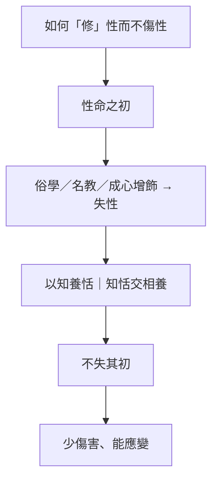

# 繕性

> 閱讀提示：本文依通行本次序說明；「原典」「注家」與「本書現代詮釋」分列，不把後世說法偽作莊子原意。

## 01. 篇名與背景

「繕」是修飾、整治；「性」是性命之本然。篇名看似主張修性，全文卻反覆警惕以外在學說矯飾本性。它承〈刻意〉對刻意養形的批判，將焦點放在仁義、好知與世俗成功如何使人「失其性」。

與〈駢拇〉「外加仁義」、〈馬蹄〉「善治失性」同屬外篇性命批判組，但本篇語氣較內斂，偏重士人內在的知與恬、名教與成心。若前幾篇多寫政治與制度，〈繕性〉則把鏡頭轉向讀者自身：你正在累積的修養、學問與身分，是在養性，還是在「繕」出一個看起來更正確的自己？

## 02. 成書背景

本篇屬外篇，應含莊學後學的論辯材料，思想與內篇相近而筆法較論說化。今本依郭象注本傳世；引文採郭慶藩《莊子集釋》系統。

戰國諸子競談治身治世，「修性」「養性」「全性」已是通行語彙。儒家重修身，道家亦言復樸，楊墨各家各有養生、養德方案。本篇以「自然」反省修養語言本身的代價：當「性」本身成為可被修飾、可被展示、可被比較的對象，人是否已離「性命之初」越來越遠？它回應的是修養文化的內卷，而非單純否定學問。

## 03. 結構分析

篇首先說古人不以知傷道、不以人助天，提出「以知養恬」；繼論性情為仁義與學問所擾，聖人蹩躠為仁、踉蹌為義，天下始疑、始分。再以容成氏、大庭氏等上古帝王，對照後世失性之種種；復論俗學、好知、禮樂如何使人離初。末以「古之人，在混芒之中」與「澹然無極而遊於無極」收束於未被分別切割的生命狀態，並舉保性、全性諸名，把問題落回讀者。

### 結構圖

```text
以知養恬／恬養無知
    ↓
聖人仁義禮樂 → 天下疑、分
    ↓
上古混芒 vs 後世失性
    ↓
俗學、好知、名教之累
    ↓
不失其初／澹然無極
```

## 04. 原典

> **原典位置**：外篇・第十六篇・〈繕性〉。版本依據：郭慶藩《莊子集釋》系統。

### （一）以知養恬

> 古之治道者，以恬養知；知生而無以知為也，謂之以知養恬。古之治道者，恬而不知；知而不恬，則德離於性；恬而不知，則德離於知。知恬交相養，而和理出其性。

### （二）混芒與聖人起

> 古之人，在混芒之中，與一世而得澹漠焉。當是時也，陰陽和靜，鬼神不擾，四時得節，萬物不傷，群生不夭。及至聖人，蹩躠為仁，踉蹌為義，而天下始疑矣；澶漫為樂，摘僻為禮，而天下始分矣。

### （三）失性之由

> 馬團草，而豫章之木，其性也。然且世世稱之曰：「伯樂善治馬，而陶、匠善治埴木。」此亦治天下者之過也。夫天下之善人少，不善人多，則邪說易入，正說難行。

### （四）俗學與好知（節錄）

> 俗學者，以知為己，以知為人，以知為天下，此亦治天下者之過也。夫好知，則小知也；小知，則大知也。繩之以規矩，矯之以繩墨，斷之以椎鑿，此亦治天下之過也。

### （五）復初與遊（節錄）

> 古之民混芒之時，臥則居居，起則于于，民不知其所為，民不知其所之。含哺而熙，鼓腹而遊，民能以此矣。故聖人不得而臣之，不得而臣之，則其德可與天地比矣。

## 05. 白話翻譯

### （一）以知養恬

古時善治道的人，以恬淡涵養知識；知識生起，卻不拿知識去逞能，叫做以知養恬。古時善治道的人，恬淡而不知逞能；只知不恬，德便離開本性；只恬不知，德便離開知識。知與恬相互涵養，和理便從本性中生出。

### （二）混芒與聖人起

古人處在渾融未分的狀態，與世同在而淡泊。那時陰陽平和、四時合節，萬物不受傷害。到了聖人奔走推行仁，踉蹌推行義，天下開始疑惑；鋪張音樂、分判禮制，天下開始分裂。

### （三）失性之由

馬吃團草、豫章之木本有其性。然而世世代代仍稱伯樂善治馬、陶匠善治埴木——這也是治理天下者的過錯。天下善人少、不善人多，則邪說易入，正說難行。

### （四）俗學與好知

世俗學問以知識自恃、以知識服人、以知識治天下，這也是治理天下者的過錯。好弄智巧是小知，小知積成大知。用規矩繩墨矯正，用椎鑿裁斷，這也是治理天下的過錯。

### （五）復初與遊

上古之民在混芒之時，躺臥則安適，起身則自在，不知強求所為，不知強求所之。含食嬉戲，拍腹遊逛，人民能夠這樣就夠了。所以聖人無法使他們臣服——無法臣服，其德便可與天地相比。

## 06. 字詞註解

| 字詞 | 釋義 | 說明 |
|---|---|---|
| 繕性 | 修飾性情 | 本篇多帶反諷：過度修飾反傷性。 |
| 恬 | 安靜淡泊 | 非遲鈍，而是不以知逞勝。 |
| 以知養恬 | 用知涵養恬淡 | 知可存在，但須受恬節制。 |
| 德離於性 | 德與本性分離 | 知或恬單邊失衡的後果。 |
| 和理出其性 | 和理從本性生出 | 非外加，而是交相養的結果。 |
| 混芒 | 渾融未分貌 | 理想化的原初狀態，非考古。 |
| 澹漠 | 淡泊無求 | 與後世「好知」對照。 |
| 蹩躠踉蹌 | 奔走勞苦、踉蹌強行 | 聖人推行仁義的動態。 |
| 澶漫摘僻 | 鋪張、繁碎 | 形容禮樂過度分化。 |
| 俗學 | 世俗學問 | 以知自恃、以知服人、以知治天下。 |
| 好知 | 好弄智巧 | 與〈馬蹄〉「踶跂好知」呼應。 |
| 成心 | 已成的固定見解 | 理解批判之關鍵，雖非本篇首出。 |
| 性命之初 | 性命本初狀態 | 非歷史回溯，而是校正尺度。 |
| 居居于于 | 安適、自在貌 | 混芒之民的具體寫法。 |

## 07. 段落解析

**走讀路線**：以知養恬 → 混芒與聖人 → 俗學好知 → 復初遊。讀時問：**你的修養是在養性，還是在繕性？**

### 為何先說「以知養恬」而非先罵名教？

開篇立「知恬交相養」，**知不是敵人，失控的知才是**。若一上來就反智，讀者易把本篇當成反文明；先立「知須受恬節制」，才使後文對仁義、禮樂的批判**針對「強作、失時、失和」**，而非否定一切人倫。這與〈齊物論〉[成心](content/terms/成心.md)、〈養生主〉有涯無涯形成三角：知要可用，但不能無邊擴張。

### 混芒敘事：為何寫「古之民」？

「古之人，在混芒之中」——**不是考古，而是反襯**。後世「聖人」出而民疑、分、爭，對照的是**正性如何在「為善、立教」中流失**。與〈馬蹄〉赫胥氏段可並讀，但本篇語氣較內斂，重**個人求知欲與名教疲勞**，不只政治批判。結構上，混芒提供「測量尺」：你離「不知其所為」有多遠？

### 仁義禮樂段：為何說「疑、分」？

「疑」不是說人變壞，而是說**善意制度一旦脫離時宜，反而製造疑惑與隔閡**。「分」則指社會開始用禮樂切分等級、角色、是非。這不是說禮樂無用，而是說**當禮樂變成矯性、文飾、競逐的機制**，人便離「性命之初」越來越遠。與儒家「緣情制禮」可對話：莊子問的是，**你手上的禮，還貼不貼近情實？**

### 俗學段：從個人到天下

「以知為己、為人、為天下」三層推進，把批判從個人虛榮擴到公共治理。士人以知自恃，再以知服人，最後以知治天下——每一步都可能離恬更遠。與〈胠篋〉「為大盜積」不同，本篇重**內在節奏**：你不是被盜，而是被自己累積的知識架勢綁住。

### 末段如何收束？

「含哺而熙，鼓腹而遊」與〈馬蹄〉呼應，但本篇結尾強調「聖人不得而臣之」——不是政治反抗口號，而是說當民不需被臣屬，德才可與天地比。這把「復初」從懷古轉成**可嚮往的生命節奏**：少一點被知識與名教驅趕，多一點恬與遊。

## 08. 歷代注家怎麼看

### 郭象

郭象多以「任其自得」釋性，認為仁義非必為害，害在矯性強為；此說保留了差異中各適其性的空間。對「以知養恬」，郭注多從「知不傷性」疏通，有助避免把本篇讀成反知。

### 成玄英

成玄英將「恬」解為虛靜之心，說聖人若執跡立教，便易使人失真；重點是去其執著，不是毀棄一切德目。他對混芒段多從「淳樸」讀，提醒不可坐實為歷史階段。

### 林希逸

林希逸提醒「聖人」在此帶批評語境，不能抽離上下文讚頌。他對「俗學」段重文勢，指出三層「以知為」是層層升高。又提醒「繕」字反諷，篇名本身即是批判。

### 郭慶藩與後世

郭慶藩便於校異；陳鼓應常從文明批判讀此篇，宜同時看到它也反省個人的求知欲。王邦雄等今人重生命體證，可與內篇[坐忘](content/terms/坐忘.md)對讀，但不宜把混芒直接等同坐忘境界。

## 09. 哲學分析

> 以下為本書現代詮釋。

### 9.1 核心命題：修養悖論

本篇提出「修養悖論」：人為了更好而累加方法、身分與規範，可能把原先要保存的生命感受磨損。哲學上要問的不是「要不要修」，而是：**修養的目標函數是什麼？** 若目標變成可被看見的「繕」，本性便成材料。

### 9.2 以知養恬：知的雙重性

知可養恬，也可離性；恬可守知，也可成無知。關鍵在「交相養」的動態平衡，而非單邊壓制。這比單純「反知」或「崇知」都更細緻，也使本篇可與現代「終身學習」對話：學習若只增加焦慮，便是離性之知。

### 9.3 成心與名教疲勞

雖「成心」在〈齊物論〉首出，本篇的俗學、好知可視為成心在歷史與制度中的展開。當仁義禮樂固定成「應當如此」，人便開始用成心生活，而非用性命之情回應具體處境。名教疲勞因此不是懶惰，而是**情實與名目長期脫節**的耗損。

### 9.4 混芒：校正尺度，非歷史幻想

混芒不是叫人回到史前，而是提供校正尺度：生命能否「不知其所為」地安適？現代對應不是辭職歸隱，而是保留不被績效與身分完全佔滿的餘地。與主題「自由與無待」相連：無待不是無所事事，而是不必事事為展示而存在。

### 9.5 接入思想地圖

```text
性命之初
 └─ 繕性批判（本篇）
     ├─ 以知養恬
     ├─ 俗學／好知
     ├─ 成心與名教
     └─ 混芒校正
         └─（可連）坐忘、心齋、焦慮與比較
```

## 10. 與老子比較

《老子》說「為學日益，為道日損」，與本篇對增飾的警覺近似；兩者皆以樸、恬、少私為重。差別是老子常直接說治術的[無為](content/terms/無為.md)，本篇以仁義禮樂造成的心理與社會分裂作細部批判。

可並讀《老子》第四十八章：為學日益，為道日損。老子給出方向，〈繕性〉描寫「日益」如何具體傷性——從疑、分到俗學三層。兩者互補，構成對修養文化的完整診斷。

## 11. 與儒家比較

儒家視仁義禮樂為成人與安邦的條件；本篇則問：若德目變成表演與強制，是否反而傷性？這不是簡單的反道德，而是對「德目如何實踐」的緊張對話。

[孔子](content/figures/孔子.md)重「修己以安人」，修養有明確方向；〈繕性〉問：修到何時變成「繕」？孟子「養浩然之氣」重內在充實，與「以知養恬」表面可通，但浩然之氣仍連結義與道，本篇則更警惕義與道被制度化成「蹩躠踉蹌」的強作。儒家可補莊子過度浪漫化自然之處，莊子可防儒家把教化絕對化。

## 12. 與佛學比較

俗學傷性、成心，可與執著的批判互參；「以知養恬」也常被拿來談知的節制。本篇重心是性命之初與混芒——知要用來養，不是用來耗。

修養若反過來傷性，問題就在繕性本身的悖論。


## 13. 現代人生應用

> 以下為**本書現代詮釋**。

### 13.1 自我優化是否「繕性」

自我管理、履歷與療癒課程都可能成為「繕性」：先問它是否使人更能安靜、感受與照料關係，還是只製造新的比較。回扣「以知養恬」：若課程讓你知道更多焦慮來源，卻不能帶來恬，便是離性之知。連結主題「焦慮與比較」。

### 13.2 保留不績效化的時間

「返性／復初」不是拒絕學習，而是保留不績效化的閱讀、步行與交談。工作訓練不可少，但可問：這週有沒有一小時「不知其所為」？不是浪費，而是防止工具理性獨占生命。與主題「工作與技道」相連：技道之善須留白。

### 13.3 知恬交相養的日常檢驗

每增加一項資訊訂閱、一門線上課、一個效率方法，問：它與恬是交相養，還是只知不恬？若手機裡的知識永遠比生活更熱鬧，便接近俗學「以知為己」。

### 13.4 禮與情：會議與儀式

仁義禮樂段的「疑、分」可轉譯：當會議、儀式只剩形式正確，參與者開始疑惑「這有什麼用」，團隊開始分裂為「有在聽」與「演給上面看」。問：禮還貼不貼近具體的人情？

## 14. 常見誤解

1. **本篇反對仁義。** 它批判仁義被強作、僵化的後果，不等於讚美殘酷。
2. **復初就是拒絕學習。** 「以知養恬」明言知可存在，關鍵是不以知傷道。
3. **自然等於放任。** 不傷萬物、不夭群生本身含有節制與責任。
4. **俗學＝一切學問都有毒。** 本篇反對的是失性的好知與名教之累，不是取消技藝與公共知識。
5. **恬愉＝永遠開心、不准焦慮。** 恬淡是不被外物牽走中心，不是情緒管制或否認痛苦。
6. **混芒＝反社會。** 是校正尺度，不是叫人退出一切關係。

## 15. 本篇總結

〈繕性〉追問：修身何時會變成傷身？答案不在取消一切學問，而在使知識、仁義與禮制不離恬淡、不失其初。它把「自然」提出為對文明與自我塑造的持續校正，並以知恬交相養避免簡單的反智或崇智。

## 16. 心智圖




## 17. 延伸閱讀

- 郭慶藩《莊子集釋》、王先謙《莊子集解》〈繕性〉。
- 成玄英《南華真經注疏》、林希逸《莊子口義》〈繕性〉。
- 陳鼓應《莊子今註今譯》、王邦雄《莊子內七篇‧外秋水‧雜天下的現代解讀》相關章節。
- 對讀〈刻意〉、〈馬蹄〉、內篇〈齊物論〉成心段。

---
### 交叉引用
- 相關篇章：〈刻意〉、〈在宥〉、〈馬蹄〉、〈齊物論〉
- 相關人物：[莊周](content/figures/莊周.md)、[孔子](content/figures/孔子.md)
- 相關名詞：[道](content/terms/道.md)、成心、[坐忘](content/terms/坐忘.md)、無為、性命之初
- 相關主題：[焦慮與比較](content/themes/焦慮與比較.md)、[工作與技道](content/themes/工作與技道.md)、[自由與無待](content/themes/自由與無待.md)
