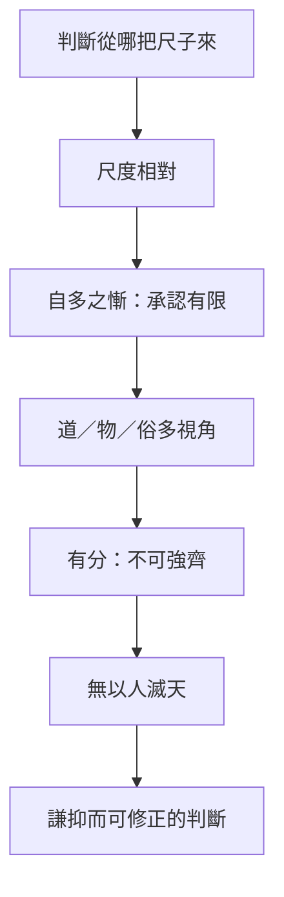

# 秋水

> 閱讀提示：本文依通行本次序說明；「原典」「注家」與「本書現代詮釋」分列，不把後世說法偽作莊子原意。

## 01. 篇名與背景

秋水盛漲，百川灌河，河伯因見自身廣大而自滿；至北海，見海若，方知所見有限。〈秋水〉以這一視覺劇變開篇，隨後用問答討論大小、貴賤、死生、利害與人天之分。它承接〈逍遙遊〉的[小大之辯](content/terms/逍遙.md)，又與〈齊物論〉的[齊物](content/terms/齊物.md)互參，卻不只說「相對」，更追問人在相對處境中如何不僭越、不妄斷。

本篇篇幅長、層次多，是外篇中最常被單獨研讀的篇章之一。王邦雄《莊子內七篇‧外秋水‧雜天下的現代解讀》即以〈秋水〉為外篇代表，可見其地位。讀者宜沿原典順序走讀，勿把後段的惠施名辯與前段的河海寓言拆成兩篇不相干的論文。

## 02. 成書背景

本篇屬外篇，語言與內篇相通而篇幅較長，通常視為莊學後學整理的材料，不能直接等同[莊周](content/figures/莊周.md)親筆。今本依郭象注本系統流傳；引文以郭慶藩《莊子集釋》所收通行文字為準。戰國名辯盛行，[惠施](content/figures/惠施.md)一派討論大小、是非、名實，都是爭論焦點；本篇用河海寓言將辯論拉回有限生命的自知，又以「無以人滅天」收束，顯示它關心的不只是認識論，還有生命與制度的承受力。

## 03. 結構分析

本篇從河伯的「自多」開始，經海若逐層拆除單一尺度：先破河海大小，再破人間貴賤，繼而談萬物之齊、得失之變；中段以夔、蚿、蛇、風等譬喻說明各有條件，並以井蛙、夏蟲、曲士警醒見聞的侷限。後段[孔子](content/figures/孔子.md)自謙、公孫龍問辯，把抽象尺度問題帶回語言與名實；末以「牛馬四足」之喻提出天人之辨，是全文哲學重心。

### 結構圖

```text
秋水百川 → 河伯自多 → 見北海而慚
    ↓
大小、貴賤無定 → 萬物有分、不可強齊
    ↓
夔／蚿／蛇／風 → 各有所長、各有所限
    ↓
井蛙／夏蟲／曲士 → 見聞之限
    ↓
仲尼自謙 → 公孫龍問辯
    ↓
無以人滅天 → 知分、守分、應變
```

## 04. 原典

> **原典位置**：外篇・第十七篇・〈秋水〉。版本依據：郭慶藩《莊子集釋》系統。

> 秋水時至，百川灌河；涇流之大，兩涘渚崖之間，不辨牛馬。於是焉河伯欣然自喜，以天下之美為盡在己。順流而東行，至於北海，東面而視，不見水端。於是焉河伯始旋其面目，望洋向若而歎曰：「野語有之曰：『聞道百，以為莫己若者。』我之謂也。今我睹子之難窮也，吾非至於子之門則殆矣，吾長見笑於大方之家。」

> 海若曰：「井蛙不可以語於海者，拘於虛也；夏蟲不可以語於冰者，篤於時也；曲士不可以語於道者，束於教也。今爾出於涯涘，觀於大海，知爾之醜；爾將自反也。」

> 以道觀之，物無貴賤；自其物觀之，生之相代也，若循環之無端，不可得而知其紀。以言觀之，貴賤不在己；以趣觀之，萬物一齊；以道觀之，物無貴賤。故由道觀之，物無貴賤；由物觀之，物自貴相賤；由俗觀之，貴賤不在己。

> 夔憐蚿，蚿憐蛇，蛇憐風，風憐目，目憐心。夔謂蚿曰：「吾以一足踸踔而不行，子無多跂，果哉！」

> 孔子遊於匡，宋人圍之數匝。子路謂孔子曰：「昔者由聞夫子之為人君難，為人臣亦不易。今夫子累德積義，行年五十有一而不遇，宜乎夫子之不遇也！」孔子曰：「由，汝未達時也。……吾命窮矣。」

> 公孫龍問於魏牟曰：「吾方異智，論物之方，以證雖小而大，可以與天下辯。奈何眾人之口，卒然合於辯，吾是以疑之。」

> 牛馬四足，是謂天；落馬首，穿牛鼻，是謂人。故曰：無以人滅天，無以故滅命，無以得殉名。謹守而勿失，是謂反其真。

## 05. 白話翻譯

秋水到來，所有河流注入黃河，水勢浩大，兩岸沙洲間連牛馬也分不清。河伯很高興，以為天下的美景全在自己這裡。順流東行到北海，向東望去看不見海的盡頭，他才轉過頭對海若感嘆：俗話說「聽到一點道理，就以為沒有人比得上自己」，說的正是我。如今我看見你難以窮盡，若不到你門前，差點就危險了；我將長久被通達大道的人所笑。

海若說：井裡的蛙不能和牠談海，因為住處侷限；夏天的蟲不能談冰，因為生命受季節限制；見識偏狹的讀書人不能談大道，因為被既有教條束住。如今你走出河岸，看見大海，才知道自己的不足；你將會自我反省。

從[道](content/terms/道.md)來看，萬物沒有固定貴賤；從事物自身來看，生命彼此更替，像循環沒有端點；從言說來看，貴賤不由自己決定；從志趣來看，萬物可說一齊；再從道來看，又無貴賤。因此由道觀之無貴賤，由物觀之則各自貴己賤他，由世俗觀之貴賤也不在自己。

夔憐憫蚿，蚿憐憫蛇，蛇憐憫風，風憐憫眼睛，眼睛憐憫心。夔對蚿說：我用一隻腳跳躍卻走不動，你卻有那麼多腳，真是果決啊！

孔子在匡地遊歷，被宋人圍困。子路對孔子說：從前聽說做君難、做臣也不易；如今先生積德累義，五十一歲仍不得志，也難怪不得志。孔子說：仲由，你還沒明白時勢。……我的命運是窮困了。

公孫龍問魏牟：我自以為智巧過人，論證物之方圓大小，可以與天下辯論；為何眾人之口忽然合於辯論，我因此疑惑。

牛馬本有四足，這叫天性；套住馬頭、穿牛鼻牽引，這是人為。因此不要用人為傷害天性，不要用成見傷害生命，不要為了名聲犧牲所得。謹慎守住而不失去，這叫做返歸本真。

## 06. 字詞註解

| 字詞 | 釋義 | 說明 |
|---|---|---|
| 秋水 | 秋季盛水 | 起篇的自然時令，也是視野改變的條件。 |
| 河伯／海若 | 河神／北海神 | 寓言角色，不宜坐實為神話知識。 |
| 望洋 | 仰望無際貌 | 河伯見海而驚惶自失；成語「望洋興嘆」出此。 |
| 自多 | 自以為多、自滿 | 不是擁有多，而是把所見當全部。 |
| 大方之家 | 通達大道者 | 河伯自謙之語，非現代「大方」之意。 |
| 拘於虛 | 受空間限制 | 井蛙之喻的關鍵。 |
| 篤於時 | 固執於季節 | 夏蟲不能語冰的條件。 |
| 曲士 | 見識偏狹者 | 「曲」是局曲，不專指某一階層。 |
| 以道觀之 | 從道之角度觀看 | 與「以物觀之」「以俗觀之」並列，顯多視角。 |
| 踸踔 | 一足跳躍 | 夔只有一足，卻自以為不如多足。 |
| 天／人 | 自然本然／人為安排 | 本篇要辨分際，不是消滅人事。 |
| 故 | 成見、執著 | 「無以故滅命」之「故」，近於固執的緣由。 |
| 反其真 | 返歸本真 | 與後世「真人」概念可互參，但不可等同。 |

## 07. 段落解析

**走讀路線**：河伯自大 → 海若破尺度 → 多視角觀物 → 井蛙夏蟲 → 天人之辨。關鍵句：**無以人滅天**。

### 河伯何以先「自喜」？

河伯的錯不在看見黃河浩大，而在「以天下之美為盡在己」。先寫其自信，才使北海的無邊形成轉折：認知的問題常非完全無知，而是局部經驗被誤認為全體。這與[焦慮與比較](content/themes/焦慮與比較.md)主題相關——人在相對優勢中容易失去尺度感。

### 海若為何不直接說「一切都相對」？

海若承認河海有大小、事物有差等，卻說尺度須連同時間、位置、用途來看。接著提出「以道觀之／以物觀之／以俗觀之」的多重視角，避免把相對論讀成「沒有事實、什麼都一樣」。前段破自多，後段轉入「知分」：知道自己有限，也知道萬物不能任意互換。

### 夔、蚿、蛇、風一串譬喻有何用意？

這一串「憐」與「果哉」的對話，表面是嘲笑他者，實則每個角色都從自身條件出發評斷他者。夔以一足為苦，卻羨慕多足；風、目、心又各以其能為準。它接在貴賤之辯之後，說明：即便承認相對，人仍易把自身尺度當成普遍標準——這比河伯的自滿更隱微。

### 三種不能語道如何銜接？

井蛙受空間限制，夏蟲受時間限制，曲士受教條限制，次第從外在環境轉入心智框架。它們不是嘲笑弱者，而是提醒讀者：每個人都有自己的井、季節與課本；河伯剛離開一口井，不應再把北海變成新教條。

### 孔子自謙與公孫龍問辯為何置於後段？

孔子在匡被圍，子路以「積德卻不遇」質疑；孔子卻說「命窮」，不把自己失意的解釋權全交給道德算計。公孫龍自恃辯才，卻在「眾人之口」前動搖——名辯的勝負亦受情境與聽眾左右。兩段把前文的尺度問題帶回人世：即便通達如仲尼、巧辯如公孫龍，仍受時命與眾議所限。

### 「無以人滅天」在篇中何意？

在小大、貴賤的辯論後，本篇回到身體與生命。牛馬之喻說人為制度、技術、名聲都有力量，卻不得反過來壓毀生命的本有節律。這與前面的相對性相接：既知人見有限，就不宜以一套人定標準吞沒全部。它亦與[政治與無為](content/themes/政治與無為.md)相關——治道若只問效率而不問「天」，便可能「滅天」。

## 08. 歷代注家怎麼看

### 郭象

郭象以「各當其分」理解大小：河伯在河、海若在海，各自適性，不必互相奪取。對「以道觀之，物無貴賤」，他強調道本身不立貴賤，並非取消具體處境中的分別。他的強項是反對以一物的尺度裁斷萬物；但若只讀成安分，也可能淡化原文對自滿與人為侵奪的警告。

### 成玄英

成玄英疏重「達觀」，說河伯由局促轉為知其不及；對天人之辨，強調順任自然、不以私意矯治。其疏井蛙、夏蟲、曲士三喻，重在說明悟道須破執，不可囿於見聞。對「無以人滅天」，他連於養生、守真，有助讀者看見本篇不僅是認識論，也是生命倫理。

### 林希逸與後世

林希逸特別適合用來讀本篇的文勢：河伯一喜一慚，寓言先以情狀動人再出義理。他說海若非傳授百科，而在「轉眼」——讓河伯自己看見不足。郭慶藩彙諸家異文；王先謙字句較簡明。今人陳鼓應多從萬物相對與自然主義闡釋，閱讀時仍須保留本篇「有分」的限制，勿把「齊」讀成取消一切判斷。

## 09. 哲學分析

> 以下為本書現代詮釋。

### 9.1 尺度反省：相對而不虛無

〈秋水〉不是粗略的相對主義。它提出：大小、貴賤、得失若抽離條件便易失真；但「以物觀之」仍有差等，「以俗觀之」仍有評價。哲學工作首先是**辨識觀點**：我在用哪一種尺度說話？這與〈齊物論〉的[齊物](content/terms/齊物.md)不同——〈齊物論〉重在消解對立執著，〈秋水〉重在**知其所限**。

### 9.2 認知謙抑與可修正的判斷

見聞有限並不使判斷不可能，卻要求判斷可修正。河伯的成長不是由「錯」變「全知」，而是由自多轉為能問、能自反。井蛙、夏蟲、曲士三喻是對讀者的自我檢查：我們皆可能受位置、時代與訓練所限。這種可受教性，正是本篇的達觀。

### 9.3 生命分際：不以人滅天

「齊」在此不是抹平差異，而是不以單一位置霸佔全體。末段的天人之辨把認識論收束為生命政治：人為安排（落馬首、穿牛鼻）有其必要，但不得反過來壓毀「天」與「命」。制度、技術、名聲若使身體、物種與生活長期受損，便需重估——這是[道](content/terms/道.md)的實踐面向，不是抽象口號。

## 10. 與老子比較

《老子》說「知人者智，自知者明」與「人法地，地法天」，同樣將自知與順自然相連。不同處在於：老子多以簡約格言與政治語言說無為；〈秋水〉則用河海、井蛙的具體視角，展示尺度如何在移動中改變。兩者都不是反對技術，而是反對自以為能完全支配。老子「道法自然」與本篇「反其真」，可對讀而各見詳略。

## 11. 與儒家比較

儒家重名分、禮義與學習，〈秋水〉批評「曲士」與「以人滅天」，似乎衝突。然而本篇所反對的不是學問本身，而是把已學的規範封成唯一世界。儒家的「知所不知」與謙遜可和河伯受教對讀；[孔子](content/figures/孔子.md)自謂「命窮」，亦顯示聖人知時命之限。差異在於，儒家較相信以禮整理人倫，莊子更警惕整理逾界、以人滅天。

## 12. 與佛學比較

河伯自多，可與我慢、條件性並讀；「無以人滅天」也常被拿來談分際。本篇骨幹仍是小大之辯與海若的多視角：先問尺子，再問貴賤得失。

秋水是尺度反省與認知謙抑，不是緣起論的中譯。


## 13. 現代人生應用

> 以下為**本書現代詮釋**。

### 13.1 專業判斷中的河伯時刻

在專業工作中，河伯時刻是「我掌握這個指標，所以已懂全局」。實作上可在重大判斷前問：我的資料像河流還是像北海？受誰、受哪段時間、受哪種制度限制？在跨領域合作中，勿把專業術語變成曲士之教；先讓不同尺度彼此可見。這回扣「以道觀之／以物觀之」的多視角，也連於[焦慮與比較](content/themes/焦慮與比較.md)——比較本身未必錯，錯在以單一尺度定輸贏。

### 13.2 制度設計與「無以人滅天」

「無以人滅天」可用於工時、醫療與科技設計：績效、演算法與流程是人為工具，若使睡眠、關係、身體承受長期損害，便需重估其代價。它不是拒絕管理，而是使管理服從生命，而非反之。組織若只問 KPI 不問人的「四足」，便接近「穿牛鼻」而忘「天」。

### 13.3 辯論、輿論與公孫龍的困境

公孫龍自恃辯才，卻在眾口前動搖——提醒今日資訊環境：邏輯上「贏」不等於被理解，更不等於改變處境。面對[政治與無為](content/themes/政治與無為.md)的張力，有時需要的不是更多辯論，而是像河伯那樣承認：我還沒看見海的盡頭。

### 13.4 跨文化對話：承認「大方之家」

在跨文化、跨學科對話中，河伯時刻尤易出現：以己方框架判斷他方「不合理」。實踐上可先問：對方像井蛙、夏蟲，還是我尚未看見的北海？這不是取消批判，而是**先擴展尺度再下判斷**——與[惠施](content/figures/惠施.md)名辯傳統可弱對照，但本篇重心在生命分際而非辯勝。

## 14. 常見誤解

1. **萬物齊一，所以沒有對錯。** 本篇反對的是絕對化尺度，並未取消具體情境中的判斷與傷害。
2. **河伯見海後就應自卑。** 他由自滿轉為學習，不是改投另一種「我最渺小」的執著。
3. **反人為就是反文明。** 「人」可安排、教化；問題是其是否滅傷「天」與「命」。
4. **井蛙是罵人。** 這三喻首先是自我檢查：我們皆可能受位置、時代與訓練所限。
5. **相對主義等於什麼都可以。** 「謹守而勿失，是謂反其真」說明仍有應守之分際。

## 15. 本篇總結

〈秋水〉由河伯見海，教人放下「所見即全體」的自多；由多重視角與夔蚿之喻，辨識限制的來源；再以天人之辨，防止人為尺度毀傷生命。其要點不是拒絕判斷，而是在判斷中保有尺度感、修正力與分際。作為外篇旗艦，它把[逍遙](content/terms/逍遙.md)的小大之辯、[齊物](content/terms/齊物.md)的觀點轉換，落實為可實踐的生命智慧。

## 16. 心智圖




## 17. 延伸閱讀

- 郭慶藩《莊子集釋》〈秋水〉；王先謙《莊子集解》〈秋水〉。
- 成玄英《南華真經注疏》〈秋水〉；林希逸《莊子口義》〈秋水〉。
- 陳鼓應《莊子今註今譯》、王邦雄《莊子內七篇‧外秋水‧雜天下的現代解讀》相關章節。

---
### 交叉引用

- 相關篇章：〈逍遙遊〉、〈齊物論〉、〈山木〉、〈知北遊〉
- 相關人物：[莊周](content/figures/莊周.md)、[惠施](content/figures/惠施.md)、[孔子](content/figures/孔子.md)
- 相關名詞：[道](content/terms/道.md)、[齊物](content/terms/齊物.md)、[逍遙](content/terms/逍遙.md)、[真人](content/terms/真人.md)
- 相關主題：[政治與無為](content/themes/政治與無為.md)、[焦慮與比較](content/themes/焦慮與比較.md)、[自由與無待](content/themes/自由與無待.md)
