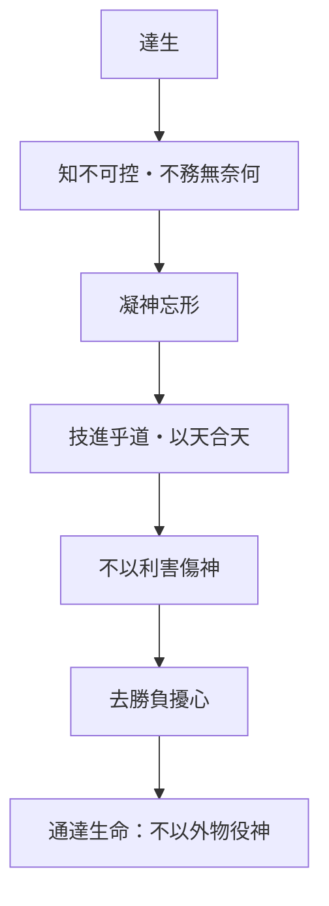

# 達生

> 閱讀提示：本文依原典次序，區分原典、注家與本書現代詮釋。

## 01. 篇名與背景

「達生」不是延年秘術，而是通達生命的情理。篇中祝宗人、佝僂承蜩、津人操舟、梓慶削木為鐻、呂梁丈人等故事，從養神、技藝、冒險到工巧，反覆說明：形體與技術可鍛鍊，真正關鍵卻是心不被外物、恐懼與名利打散。它與內篇〈養生主〉[庖丁](content/figures/庖丁.md)解牛並讀，是外篇對[工作與技道](content/themes/工作與技道.md)最完整的展開之一。

## 02. 成書背景

本篇屬外篇，故事群可能來自不同傳承，後來編入同一「達生」主題。今本以郭象注本系統為據，引文從郭慶藩《莊子集釋》。它反映戰國技藝、游士與養生論盛行的時代，卻不把「成功技法」當成終點。與〈刻意〉批評導引養形、〈繕性〉論知養恬可對讀，顯示莊學對身心工夫的整體關懷。

## 03. 結構分析

前段先說達生者不以利害害生；中段列承蜩、操舟、蹈水者，展示專注如何忘卻外在驚駭；梓慶故事把工巧推至「以天合天」；後段以鬥雞、射者、賭博等反面例子，顯示勝負心反使技藝失常。全篇由限→神→合天→反面，是平衡的技藝哲學。

### 結構圖

```text
不以利害累生 → 凝神忘形
  ↓                 ↓
承蜩／操舟／蹈水 → 梓慶為鐻：以天合天
  ↓
勝負、名利、恐懼 → 擾心失技
```

## 04. 原典

> **原典位置**：外篇・第十九篇・〈達生〉；依郭慶藩《莊子集釋》系統。

> 達生之情者，不務生之所無以為；達命之情者，不務知之所無奈何。生之所無以為，知之所無奈何，而一為之，則殆矣。

> 仲尼適楚，出於林中，見痀僂承蜩，猶掇之也。仲尼顧謂弟子曰：「彼有以也，而得其道者也。」……仲尼曰：「用志不分，乃凝於神。其痀僂丈人之謂乎！」

> 孔子觀於呂梁，懸水三十仞，魑魅魍魎，之所不能照也。有一丈夫游之，以為有苦而欲死者也。……孔子曰：「始吾以夫子徒與人也，吾今見之矣。……純氣之守也，非知巧果敢之敢也。」

> 梓慶削木為鐻，鐻成，見者驚猶鬼神。魯侯問其故。梓慶曰：「臣將為鐻，未嘗敢以耗氣也，必齊以靜心。齊三日，輒忘爵祿；齊五日，輒忘是非；齊七日，輒忘四肢，形體也。……然後入山林，觀天性；形軀至矣，然後成見鐻，然後成。」

> 紀渻子為王養鬥雞。十日而問：「雞已乎？」曰：「未也，方虛憍而恃氣。」……又十日而問，曰：「幾矣。雞雖有鳴者，已無變矣，望之似木雞矣，其德全矣。」

> 津人操舟，其於水也，殆乎！……操舟者若神，彼其於水也，殆乎！……孔子曰：「始吾以夫子徒與人也，吾今見之矣。」

## 05. 白話翻譯

通達生命情理的人，不追求生命本來無法得到的東西；通達命運情理的人，不強求知曉無可奈何之事。若對「生之所無以為」「知之所無奈何」仍硬要去做、去知，就危險了。

孔子到楚國，走出樹林，見一彎腰老人捕蟬，像拾取一樣輕易。孔子對弟子說：他有本領，得到了道。……孔子說：心志不分散，就凝聚成神明般的專注，說的正是那位彎腰老人！

孔子在呂梁觀看，懸瀑三十仞，連鬼怪都不敢靠近。有一人游於其中，孔子以為他想自殺。……後來孔子說：起初我以為先生只是尋常人，如今看見了。……這是純氣的守持，不是智巧果敢的冒進。

梓慶做鐻前必先齋戒安靜心神。齋三日，便忘爵祿；齋五日，便忘是非；齋七日，便忘四肢與形體。……然後進山觀察木材自然的形勢；遇見最相合的材料，鐻的樣子先在心中完成，才下手製作。

紀渻子為王養鬥雞。十天後問：雞好了嗎？答：還沒，正虛驕而仗氣。……又過十天問，答：差不多了。雞雖有鳴者，它已不為所動，看起來像木雞，德性已全。

津人操舟，在險水上行船，幾乎不可思議。孔子見後說：起初我以為先生只是尋常人，如今看見了——操舟者幾近神妙，因他與水勢相合，而非憑智巧果敢硬闖。

## 06. 字詞註解

| 字詞 | 釋義 | 說明 |
|---|---|---|
| 達生 | 通達生之情理 | 非單指保養肉身，而是知生之限度。 |
| 達命 | 通達命之情理 | 與達生並列，承認不可控。 |
| 無以為／無奈何 | 無法做到／無法改變 | 達生的邊界概念，非消極遁世。 |
| 用志不分 | 意志不分散 | 是專注，不是僵硬緊繃。 |
| 凝於神 | 精神凝聚 | 描寫熟練而澄明的狀態。 |
| 承蜩 | 接取蟬 | 佝僂丈人的技藝，極細微處見專一。 |
| 純氣 | 純一之氣 | 呂梁丈夫之能，非智巧果敢。 |
| 鐻 | 架鐘的木器 | 梓慶的工藝作品。 |
| 齊 | 齋戒、整肅 | 清除功利雜念的準備，近[心齋](content/terms/心齋.md)。 |
| 以天合天 | 以己之天合材之天 | 工匠與材料各順其性。 |
| 木雞 | 像木頭的雞 | 鬥雞至德，不為外物所動。 |
| 津人 | 操舟者 | 與承蜩、蹈水並列的高險技藝。 |
| 祝宗人 | 主持祭祀者 | 前段故事，以技與道對照。 |

## 07. 段落解析

**走讀路線**：不以利害累生 → 承蜩操舟 → 以天合天 → 鬥雞忘適。

### 祝宗人與養神：為何篇首先談「不傷生」？

通行本前段有祝宗人為人禱祀的故事：他可使龜甲灼裂、骨相呈祥，卻自認只是「技」而非「道」。這與後文承蜩、梓慶形成對照——**外在儀式再炫目，若不能養神，仍是「為壽／為名」的偏尚**。達生首句「不務生之所無以為」因此不是消極，而是**把力氣用在生命真正承擔得了之處**。

### 為何先立「無可奈何」的邊界？

「生之所無以為，知之所無奈何，而一為之，則殆矣」——**達生不是無限擴張能力**，而是辨認哪些事本不在「知／為」的管轄。這與〈養生主〉有涯無涯、〈繕性〉以知養恬呼應：技藝再精，仍須**知命限**。若跳過此段，承蜩、蹈水易被讀成成功學。

### 承蜩、操舟、蹈水：為何三則並列？

三則都在**高風險處**顯示「用志不分，乃凝於神」——不是神秘通靈，而是**減少雜念使身體穩定**。承蜩在細微，操舟在險境，蹈水在幾近不可能；層層加壓，說明凝神不是休閒狀態，而是**危機中的專一**。與〈養生主〉[庖丁](content/figures/庖丁.md)同族，但本篇更強調**志分**與**不試他事**。

### 梓慶為鐻：為何「齋心」在觀材之前？

「既成，見樸樕，後見形，後見成功」——**先忘功名，再讓材料的形勢說話**。「以天合天」：工匠之天合木材之天，不是主觀意志壓服材料。這是全篇論證高峰：**技進乎道**在此是**忘外物、順材性**，不是炫技。與後文賭博、恐懼、炫技的反面故事對照，結構清晰。

### 鬥雞與末段危境：為何仍寫恐懼與利害？

紀渻子養雞，由虛憍而恃氣，到「望之似木雞」——說明達生亦需**去除勝負心**。後文置入賭注、恐懼、殺身之險——**防止讀者把達生浪漫化**。達生不是「永遠不慌」，而是**在不可控處不硬為**；在可控技藝處，仍須凝神而不被名利分散。

### 與他篇如何互讀？

〈達生〉與內篇〈養生主〉庖丁、外篇〈田子方〉忘形技藝、〈秋水〉知分，可成**技—身—心**讀法鏈。不宜與現代「心流」直接等同——本篇的「神」連著**命限、齋心、以天合天**，缺了邊界與材料，便只剩效率口號。

## 08. 歷代注家怎麼看

### 郭象

郭象以順其所受釋「達命」，不把不可控之事變成心病；對技者則重其「任自然」而非刻意造作。他說「用志不分」是專一於當下之事，不是排斥一切外物，這有助避免把達生讀成禁欲主義。

### 成玄英

成玄英說凝神須除去塵累，梓慶的齋戒是忘名利以虛心應物，不是求奇術。對呂梁丈夫，他疏為「純氣守神」，與智巧果敢相對。其工夫論色彩濃，宜標為疏家詮釋，不可倒灌為先秦原意。

### 林希逸與後世

林希逸善說本篇故事的層級：承蜩見專一，梓慶見虛心合材，鬥雞見去勝心。今人常以它談心流，但「心流」只能作對照，不可抹去其天人關係與命限意識。郭慶藩、王先謙可供字句互證。

## 09. 哲學分析

> 以下為本書現代詮釋。

### 9.1 命限與可控：達生的兩面

達生有兩面：承認不可控，並在可做之處全神投入。前者防止全能焦慮，後者避免把順其自然誤為消極。「達命」不是宿命論，而是**不把心力耗在無奈何之處**——這與[死亡與喪親](content/themes/死亡與喪親.md)主題中「安時處順」的態度可弱對照，但本篇重心在技藝與養神。

### 9.2 技進乎道：專注的哲學

「用志不分，乃凝於神」提出一種技藝倫理：專業的極致不是控制一切，而是在可練之處讓心與身合一。承蜩、操舟、蹈水三則顯示，專注發生在**高風險、高要求**的處境，不是逃避現實。這是[工作與技道](content/themes/工作與技道.md)的核心命題。

### 9.3 以天合天：非支配式技術觀

梓慶的「以天合天」提出：專業並非只問我能逼材料做到什麼，還要問材料、身體與情境允許什麼。它與[無用之用](content/terms/無用之用.md)不同——後者論處世策略，此處論**創作與工藝中的順性**。齋心近[心齋](content/terms/心齋.md)，但本篇不談政治隱退，而談手藝中的忘我。

## 10. 與老子比較

《老子》重「知足」「不爭」與「大巧若拙」，和本篇不以利害累生相近。〈達生〉更細緻地寫出工藝過程，將無為表現為高度準備後的順勢，不是什麼都不做。老子「治大國若烹小鮮」與本篇「不試他事」的專一，亦可互參。

## 11. 與儒家比較

儒家重習藝、敬事與專業責任，與梓慶的整肅並不相斥。[孔子](content/figures/孔子.md)在本篇是觀技者，讚「用志不分」，顯示聖人亦重技道。差別在於莊子尤其警惕名利與勝負污染技藝；儒家則較重技藝如何服務倫理與社會，兩者可對話而不必對立。

## 12. 與佛學比較

凝神、承蜩、梓慶，有人比附定學。本篇談的是養生與技道：以天合天，則其果不材。

熟練裡含知止，應物而不傷生——留在梓慶齋以靜心的現場即可。


## 13. 現代人生應用

> 以下為**本書現代詮釋**。

### 13.1 高壓任務：承蜩的啟示

面對高壓任務，可先分「能做、不能控制、尚未知道」三類；把精力放回可練習的流程。痀僂承蜩提醒：高壓前先清雜累，把注意力從「一定成功／丟臉」拉回可練習的動作本身。這回扣「達命」的邊界，也連於[焦慮與比較](content/themes/焦慮與比較.md)——勝負心會擾技。

### 13.2 創作與設計：梓慶的齋心

做設計、寫程式或醫療判斷時，梓慶提醒先清除展示欲，再讀材料與限制；熟練不是無視限制，而是能讓限制參與決策。留一段不被評分打斷的時間，讓「形軀至矣」——材料與情境先進入判斷，再下手。

### 13.3 風險決策：呂梁丈夫與鬥雞

呂梁丈夫涉險，因先知水深、知命限，順流而遊，不是靠口號硬闖。紀渻子的木雞則說：在競爭環境中，「德全」是不為外物所動，不是虛張氣勢。兩則合看：達生既要有技，也要知何時不為。

### 13.4 醫療與照護：知所不為

醫護與照護工作者常面對「知之所無奈何」——病情、家屬期待、制度限制皆非個人可盡控。達生提醒：在不可為處不硬為，在可為處（陪伴、專注當下操作）仍須凝神。這不是冷漠，而是**避免把全能幻覺轉嫁為自我耗竭**，亦連於[死亡與喪親](content/themes/死亡與喪親.md)主題中對限度的承認。

## 14. 常見誤解

1. **達生就是養生術。** 本篇首重不以外物傷神。
2. **專注等於逼迫自己。** 「不分」來自去除雜累，不是更猛烈地焦慮。
3. **順自然否定訓練。** 承蜩與梓慶皆有長久工夫。
4. **純氣＝天生天賦、不必練習。** 寓言中的工夫來自長期專志，不是神秘氣功速成。
5. **呂梁＝鼓勵冒險主義。** 丈夫能遊，因先知水深、知命限；不知水性而縱身，正是本篇所戒。

## 15. 本篇總結

〈達生〉以技藝故事說生命哲學：承認命限，不被利害牽引，虛心觀物，才能使形與神、技與材相合。其通達不是神奇掌控，而是少受無謂損耗後的從容準確。與[庖丁](content/figures/庖丁.md)、[真人](content/terms/真人.md)的修養理想可成讀法鏈，但本篇更接地氣，直指日常技藝。

## 16. 心智圖




## 17. 延伸閱讀

- 郭慶藩《莊子集釋》、王先謙《莊子集解》〈達生〉。
- 成玄英《南華真經注疏》、林希逸《莊子口義》〈達生〉。
- 陳鼓應《莊子今註今譯》、王邦雄《莊子內七篇‧外秋水‧雜天下的現代解讀》相關章節。

---
### 交叉引用

- 相關篇章：〈養生主〉、〈人間世〉、〈田子方〉、〈刻意〉
- 相關人物：[庖丁](content/figures/庖丁.md)、[孔子](content/figures/孔子.md)、[列禦寇](content/figures/列禦寇.md)（蹈水傳統可互參）
- 相關名詞：[心齋](content/terms/心齋.md)、[真人](content/terms/真人.md)、達生、以天合天
- 相關主題：[工作與技道](content/themes/工作與技道.md)、[焦慮與比較](content/themes/焦慮與比較.md)
