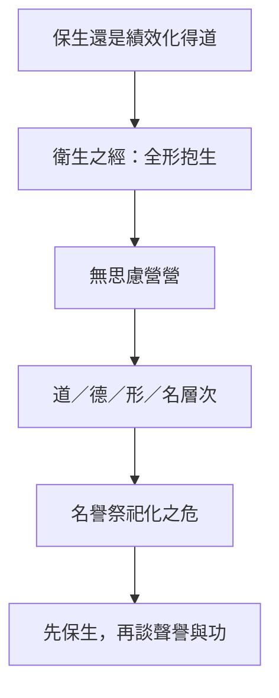

# 庚桑楚

> **閱讀提示**：本篇依通行本段落次序導讀。下文清楚區分**原典**、**歷代注家**與**本書現代詮釋**；後兩者不可倒寫為「莊子原話」。

## 01. 篇名與背景

〈庚桑楚〉以老子弟子庚桑楚為篇名主角。他居於畏壘之山，因「無為」而使一方稱頌；南榮趎卻慕名來問，急於求得可操作的道術。全篇因此不是政治寓言的旁枝，而是一場關於「如何不傷生」的工夫對話：從地方治理的反響，轉入個人身心的耗散，再上升到道、德、形、名的層次區分。

雜篇文本多經後學編纂，語調與內篇不必一律；讀本篇時，宜抓住「衛生」這一主軸，看問答如何一步步校正「急於成道」的心態。

> **原典位置**：雜篇・第23篇・〈庚桑楚〉；引文據郭慶藩《莊子集釋》所收通行系統。

## 02. 成書背景

戰國中晚期，士人游學、隱居與地方聲望交織：有人因「無事而治」被歌頌，有人因求道心切而自傷。〈庚桑楚〉將這種張力寫成師弟問答——庚桑楚拒絕把畏壘之民的稱頌變成自己的「教績」，南榮趎則把「得道」誤想成可速成的技術。

本篇與〈養生主〉、〈人間世〉同屬「保身」譜系，但焦點更集中在：名聲與知識如何反向耗損形神。郭象注本奠定今本篇次；近人多視雜篇含後學材料，故引文以郭慶藩《莊子集釋》為據，異文另參校勘，不由單一標點推斷全部思想。

## 03. 結構分析

全篇大致可分為三層推進：

1. **畏壘之譽**：庚桑楚居山，日計不足、歲計有餘；民欲俎豆之，庚桑楚不安。
2. **南榮趎問道**：弟子因慕名而焦灼；庚桑楚示以「衛生之經」，並囑「全汝形，抱汝生」。
3. **道／德／形／名**：後段申論道為德之欽、生為德之光，警惕形名外馳。

### 結構圖

```text
庚桑楚居畏壘（無為而民譽）
        ↓ 不安於「被祭祀化」
南榮趎慕名求道（急、散、營營）
        ↓ 校正問法
衛生之經 → 全形抱生
        ↓ 概念收束
道／德／形／名的層次
```

節奏是：先寫外在聲望如何壓人，再寫內在求道如何自耗，最後用概念層次防止把養生縮成口號。

## 04. 原典

> **版本依據**：郭慶藩《莊子集釋》；以下擇錄關鍵句，非全篇逐字抄錄。
>
> **原典位置**：雜篇〈庚桑楚〉。

> 庚桑楚之始來，吾洒然異之。今吾日計之而不足，歲計之而有餘。

> 衛生之經，能抱一乎？能勿失乎？能無卜筮而知吉凶乎？……能兒子乎？

> 全汝形，抱汝生，無使汝思慮營營。

> 道者，德之欽也；生者，德之光也；性者，生之質也。

> 形勢者，德之累也；聲色者，性之餌也。

> 南榮趎曰：「若然，則民之聞命，亦何疾焉？不聞命而反有邪？」庚桑楚曰：「未聞命而反有邪者，是忘其所當忘，而忘其所不當忘也。此忘其所忘，而忘其所不當忘，是忘之忘者也。」

第一則出自畏壘之民的觀感：短期看不到「績效」，長期卻覺得有餘——這是對「日計」式治理的反諷。第二則「衛生之經」一連串「能……乎」，逼問者回到嬰兒般不自傷的狀態。第三則直接點出南榮趎的病：形不守、生不抱、思慮營營。第四則則把道、德、生、性排成層次，防止讀者把「名」當「道」。第五則補上「形勢」「聲色」為德性之累、為性之餌——外在形勢與感官刺激會誘人外馳。第六則則以「忘」的雙重錯置收束：該忘的不忘（執著名聲），不該忘的卻忘了（守形抱生），這是「忘之忘」的顛倒。

## 05. 白話翻譯

畏壘的人說：庚桑楚剛來時，我們覺得他特別；如今若按天算帳，好像不夠；若按年算，卻綽綽有餘。

關於衛生的常道，你能守住專一嗎？能不失落嗎？能不用卜筮就知吉凶嗎？……能像初生的嬰兒那樣嗎？

保全你的形體，護住你的生命，別讓思慮來回奔走、空轉耗神。

道，是德所尊崇的根源；生命，是德的光華；性，是生命的質地——形與名若反過來壓制這些，人便自傷而不自知。

合起來看：南榮趎想「學一套立刻見效的道」，庚桑楚卻要他先停止以名聲、知識和功效不斷耗散生命；衛生不是多做幾項技術，而是讓心不再逐物。

## 06. 字詞註解

| 字詞 | 釋義 | 本篇閱讀提示 |
|---|---|---|
| 畏壘 | 山名／地名 | 庚桑楚隱居處；地方「無為而治」的舞台 |
| 日計／歲計 | 按日結算／按年結算 | 諷刺短線績效眼光；有餘在長期節奏 |
| 衛生之經 | 護養生命的常道 | 本篇工夫綱領，非方技秘方 |
| 全汝形 | 保全形體 | 針對自虐式求道、過度思慮 |
| 抱汝生 | 護持生命 | 與「營營」相對：抱住，而非追逐 |
| 營營 | 往來勞碌、思慮奔走 | 南榮趎的病徵 |
| 兒子 | 嬰兒 | 「衛生」的喻象：少機心、少自傷 |
| 道／德／性 | 根源／所得／質地 | 後段層次說，防「名」僭「道」 |
| 形／名 | 形體／名號 | 可指涉，不可反客為主 |

## 07. 段落解析

**走讀路線**：畏壘之譽 → 南榮趎問道 → 衛生之經 → 道德形名。關鍵句記一句即可：**全汝形，抱汝生，無使汝思慮營營。**

### 為何先寫畏壘之譽？

若開篇直接講「衛生」，讀者容易以為這是私人修煉手冊。先寫民欲尊奉庚桑楚，才顯出問題：連「無為成功」也會變成新的名韁。庚桑楚的不安，是對「被當作成績單」的拒絕。

### 民欲俎豆，庚桑楚為何不安？

稱頌若變成「必須維持的政績」，無為也會變成表演。楚的不安，是警覺自己正被祭品化——這為後文「名不可壓道」鋪路。

### 為何中段轉入南榮趎？

畏壘寫的是外在聲望；南榮趎寫的是內在焦灼。他慕名而來，說明「求道」本身可被名聲驅動。「衛生之經」的一串追問，正是拆掉「給我步驟」的期待，改問：你還能不能回到不自傷的狀態？

### 為何以道、德、形、名收束？

前段故事容易被讀成「少做事就好」。後段補上概念層次：保全形生，是為了讓德有所安頓，而不是為了換取更大的名。順序上，經驗（畏壘）→ 工夫（衛生）→ 義理（道／德），使本篇不只抒情，也能論證。

### 「形勢」「聲色」段落在哪裡？

若只停在「全形抱生」，讀者可能以為衛生是閉門靜坐。後文指出：形勢（外在局勢、體面姿態）會成為德的負累；聲色會成為性的誘餌。這把問題從個人內心拉到社會誘惑——南榮趎慕名而來，本身就是被「形勢」牽動。庚桑楚的教導因此具有雙向性：內在止營營，外在少被名聲與感官牽走。

### 「忘之忘」如何讀？

南榮趎問：若人民不必聽命也能自好，為何還要「命」？庚桑楚答：問題在於人常「忘其所當忘，而忘其所不當忘」——該放下執著時不放下，該守住根本時卻失守。這與〈大宗師〉的「坐忘」不同層次：此處「忘」是分辨力的診斷，不是神秘體驗。讀者可問：我在求道時，是否把該守的日常生活（睡眠、飲食、關係）當成可犧牲的瑣事，卻把該放下的名聲執著當成正當？

## 08. 歷代注家怎麼看

**郭象**多從「任其性命之情」讀庚桑楚：民譽而楚不安，正因不願以譽亂其性。他提醒：衛生不是另立一套與世隔絕的標準，而是不以外譽傷內。

**成玄英**把「衛生之經」疏為守一、去機心，並以「兒子」喻無分別之境。其長處是凸顯工夫語感；閱讀時仍須分辨：唐代道教修養語彙屬疏家詮釋層，不宜直接回填為戰國原義。

**林希逸**強調南榮趎「思慮營營」是文眼：本篇針砭的是求道太急，不是教人廢棄學習。他亦提醒畏壘一段勿坐實為地方史，重在寄言。

**王先謙**《莊子集解》於「日計不足、歲計有餘」句，多從治道與農事節律互參，提醒讀者勿把「有餘」讀成物質豐裕，而宜看長期生態是否可持續。此見有助於避免把庚桑楚理解成「什麼都不做就會自動成功」的誤讀。

**郭慶藩**《莊子集釋》廣引舊說，於「衛生之經」諸「能……乎」句，或連於《老子》嬰兒、專氣之說，或連於養生方技傳統；讀者宜分辨：集釋所收諸家意見屬注疏層，未必皆為莊周原旨。本書取郭慶藩本為引文底本，正是為了讓讀者可追溯這層文獻堆疊。

## 09. 哲學分析

> 以下為**本書現代詮釋**。

本篇的核心張力是：**想成道的意志，本身可能最傷生**。南榮趎的困境不是懶惰，而是把安定當成可用意志強取的成果；庚桑楚所示，是先讓形神不再被「必須有所得」追趕。

「日計不足、歲計有餘」提供另一種時間哲學：有些生活與治理的好處，無法在短週期指標裡顯現；若只承認日計，人會把安靜誤判為無效。「全形抱生」則要求區分：哪些思慮在釐清事情，哪些思慮只是在空轉自我證明。

道、德、形、名的排列，可讀作防止範疇錯置：名可用來指稱，卻不能代替生之質。這與〈齊物論〉破是非、〈養生主〉[緣督](content/terms/緣督以為經.md)，方向相近，但本篇更具體地寫出「慕道者」如何自困。與〈繕性〉「失其本性」的批判也可對讀：兩篇都擔心人為的「修養項目」反過來傷害[性命之情](content/terms/性命之情.md)。

「忘之忘」則提出一種**元層次的自我檢查**：人不只執著，還可能執著於「我要放下執著」——於是連「忘」都變成新的表演。庚桑楚的診斷因此接近現代心理學所說的「二級焦慮」：為自己的焦慮而焦慮。解法不是再加一層工夫，而是回到「全形抱生」這種具體、可驗證的生活底線。

## 10. 與老子比較

《老子》「專氣致柔，能嬰兒乎」「名與身孰親」，與本篇「兒子」「全形抱生」明顯呼應；庚桑楚又被寫作老聃弟子，使文本自覺置於老子譜系。差異在於：老子多以格言談治身治國，〈庚桑楚〉則用師弟問答，把「求道心切」戲劇化，讓讀者看見衛生如何在人際與聲望中失敗或得救。

## 11. 與儒家比較

儒家重進德修業、日新又新；本篇警惕「日計」式自我考核若變成營營，反傷其生。爭點不在「要不要修養」，而在修養是否以外在進境證明自我。當儒者說「求諸己」，莊子問：你所求的「己」，是否已被名與績效掏空？可作互參，不宜化約為反儒。

## 12. 與佛學比較

衛生之經、忘之忘，或被比附戒定慧與去執。本篇是南榮趎求道太急的現場：能兒子乎、能嬰兒乎——求有所得本身成累。

衛生屬先秦養生工夫，宜從「急」字讀起。


## 13. 現代人生應用

> 以下為**本書現代詮釋**。

- **衛生之經**：在資訊與自我優化焦慮中，先問「這項練習是在養我，還是在證明我沒有落後？」能減者減，使身心有可休息的節律。
- **全汝形、抱汝生**：生病、過勞、失眠時，把「還要進步」暫降級；先守形體與基本生活，再談志向——這是抱生，不是放棄。
- **日計不足、歲計有餘**：寫作、照護、學習等慢功夫，避免只看每日產出；改用較長週期看是否「有餘地」。
- **忘之忘**：自我檢視時，問自己是否在「為放下而放下」——若連休息都變成績效項目，便接近南榮趎的營營。

### 與全書養生線的接軌

從〈養生主〉的庖丁、〈人間世〉的心齋，到本篇的衛生之經，莊子反覆關心「技藝與名聲如何傷神」。庚桑楚的獨特處在於把問題寫成**慕道者的自我傷害**——最危險的往往不是外敵，而是「我必須立刻有所得」的內在命令。這與[工作與技道](content/themes/工作與技道.md)主題中對「把優化當宗教」的反省，可橫向對讀。

## 14. 常見誤解

1. **「衛生＝養生功法／長生術。」**  
   本篇重點是止息營營、保全形生，不是傳授方技細節。

2. **「庚桑楚反對一切稱頌，所以成功也該隱形到消失。」**  
   他不安的是譽反過來役使自己，不是否定人際感謝本身。

3. **「全形抱生＝不要思考、不要學習。」**  
   所破的是空轉的思慮，不是清明的辨認。

4. **「嬰兒＝幼稚或反智。」**  
   「兒子」喻少機心、少自傷，不是放棄成年責任。

5. **「有餘就是躺平。」**  
   「歲計有餘」是長期節奏裡的充裕感，不是拒絕承擔。

## 15. 本篇總結

〈庚桑楚〉由畏壘之譽寫到南榮趎之急，再收於道、德、形、名：它問的不是「如何更快得道」，而是「如何在求道與治世時仍能衛生」。真正的關鍵句是：**全汝形，抱汝生，無使汝思慮營營。**

若以一句話收束：**先讓生命不被名聲與急切掏空，道才可能被尊崇，而不是被當成績效項目。**

## 16. 心智圖




## 17. 延伸閱讀

### 原典與注疏

- 郭慶藩《莊子集釋》〈庚桑楚〉
- 王先謙《莊子集解》〈庚桑楚〉
- 成玄英《南華真經注疏》相關篇章
- 林希逸《莊子口義》相關篇章

### 今注今譯與研究

- 陳鼓應《莊子今註今譯》〈庚桑楚〉
- 王邦雄《莊子內七篇‧外秋水‧雜天下的現代解讀》相關章節
- 劉笑敢等關於《莊子》內、外、雜篇與文本層次的研究

### 本專案內交叉引用

- 相關篇章：〈養生主〉、〈人間世〉、〈德充符〉、〈刻意〉、〈繕性〉、〈庚桑楚〉本篇可連〈外物〉「外物不可必」
- 相關人物：[老聃](content/figures/老聃.md)、庚桑楚、南榮趎
- 相關名詞：衛生之經、全形抱生、[道](content/terms/道.md)、[性命之情](content/terms/性命之情.md)、形、名
- 相關主題：[工作與技道](content/themes/工作與技道.md)、[名與利](content/themes/名與利.md)、[焦慮與比較](content/themes/焦慮與比較.md)
