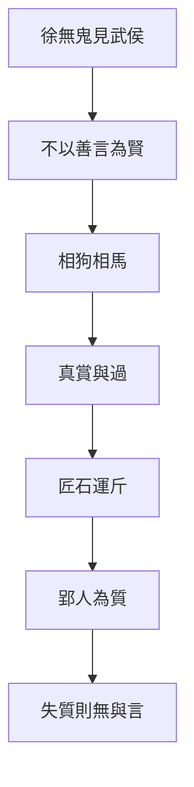

# 徐無鬼

> **閱讀提示**：本篇依通行本段落次序導讀。下文清楚區分**原典**、**歷代注家**與**本書現代詮釋**；後兩者不可倒寫為「莊子原話」。

## 01. 篇名與背景

〈徐無鬼〉以隱士徐無鬼為線索，寫他因女商引見魏武侯，不談仁義教條，而以相狗、相馬切入「君主究竟賞什麼」。篇中最著名的匠石運斤、郢人白堊，則把「真賞」推到極致：高度技藝必須有能相與的對象（質）；質亡，技亦無可施。

雜篇常拼合多組故事，本篇的貫穿問題是：**政治與知人，能否離開言語表演與偏好？** 真知真賞，對政權與友誼同樣嚴苛。

> **原典位置**：雜篇・第24篇・〈徐無鬼〉；引文據郭慶藩《莊子集釋》所收通行系統。

## 02. 成書背景

戰國國君身邊充斥游士、說客與「善言」之士；能把仁義說得漂亮，往往比能辨人、能辦事更容易得寵。〈徐無鬼〉針對這種「以言取人」的生態：狗不因善吠為良，人也不該只因善言為賢。

匠石與郢人的故事，則可能來自工匠傳統與知音母題，被編入莊學後，成為對「對手／質」的哲學化：沒有可信任的對方，最高技藝也只能停擺。郭象注本定篇次；引文以郭慶藩《莊子集釋》為據。

## 03. 結構分析

1. **徐無鬼見武侯**：拒談現成道德套語，改以相狗、相馬談好尚與知人。
2. **真賞與過**：涉及「真人之過」——連真人亦有過，政治更不可假裝無過。
3. **匠石運斤／郢人**：技與質相依；質死而斤無所運。
4. **後段問道與知士**：名言、知解的限度再被推開。

### 結構圖

```text
徐無鬼見魏武侯
        ↓ 不以善言定賢
相狗／相馬（好尚與用人）
        ↓
真賞／真人之過
        ↓
匠石運斤 ←→ 郢人為質
        ↓ 質亡技歇
名言與知解的限度
```

全篇由「宮廷如何聽人」走到「技藝如何需要對手」，再落到「言說本身的邊界」：政治批判與認識論同場。

## 04. 原典

> **版本依據**：郭慶藩《莊子集釋》；以下擇錄關鍵句，非全篇逐字抄錄。
>
> **原典位置**：雜篇〈徐無鬼〉。

> 狗不以善吠為良，人不以善言為賢。

> 吾相狗又不若吾相馬也。……吾相馬，直者中繩……

> 郢人堊漫其鼻端，若蠅翼，使匠石斲之。匠石運斤成風，聽而斲之，盡堊而鼻不傷，郢人立不失容。

> 自夫子之死也，吾無以為質矣！吾無與言之矣。

第一則把「說得好」與「人是否賢」切開。第二則以相馬的層次，暗示知物、知人有精粗，不能停在表面反應。第三、四則是匠石典故：運斤成風極寫技，而莊子聞惠施之死歎「無以為質」，則把技藝寓言轉成對知音與論敵的哀悼——真賞需要一個能立而不失容的對方。

## 05. 白話翻譯

狗不因為叫得響就稱良犬，人也不因為話說得好就稱賢人。

我相狗的本事，還不如我相馬。……相馬時，看它體態是否合於法度……——意思是：真正的「看得出」，有層次，不是被聲音或辭令牽著走。

郢人鼻尖沾了一點薄如蠅翼的白粉，請匠石砍掉。匠石揮斧生風，隨手斫去白粉，鼻卻毫髮無傷；郢人站著，面不改色。宋元君想重演，匠石說：對手死了，我再也沒有可以配我這斧的「質」了。

莊子經過惠施之墓，對跟隨的人講完這故事，說：夫子死了，我沒有對手了，也沒有可以深談的人了。

合起來看：本篇要分開的是「說得漂亮」與「真能相與」；政治若只寵善言，便失去質；友誼與辯論若失去可對之質，連最高的表達也落空。

## 06. 字詞註解

| 字詞 | 釋義 | 本篇閱讀提示 |
|---|---|---|
| 徐無鬼 | 篇中隱士 | 以「非善言」路線見國君 |
| 魏武侯 | 魏國君主 | 聽言、好尚的政治舞台 |
| 相狗／相馬 | 品評犬馬 | 喻知人層次；不為「聲」所欺 |
| 善言 | 動聽、合君意之言 | 本篇政治批判的靶心 |
| 真賞 | 真實的賞識 | 能識質，而非識辭令 |
| 質 | 對象、對手、可對之體 | 匠石故事關鍵：無質則技無可施 |
| 運斤成風 | 揮斧快疾如風 | 極技的象徵，依賴信任 |
| 堊 | 白土／白粉 | 鼻端薄粉，寫精度與危險 |
| 真人 | 體道之人 | 「真人之過」：連至者亦不諱過 |

## 07. 段落解析

**走讀路線**：見武侯／相狗相馬 → 真人之過 → 匠石運斤 → 無以為質。前半諷「善言」，後半悼「對手」——技與言都需要質。

### 為何以見武侯開篇？

宮廷是「善言」最被獎勵的地方。徐無鬼若一開口就講仁義，只是另一種善言；改談相狗相馬，是迫使武侯離開套語，面對自己的好尚與用人之實。

### 為何中插入匠石運斤？

相馬還停在「識物」；運斤把問題升級為「關係中的技」：再高的能力，也需要對方不躲、不亂、能承擔風險。這使「真賞」有身體感——賞的不是表演，而是可與之共當危險的默契。

### 為何收在「無以為質」？

把匠石故事接到惠施之死，政治篇忽然變成悼友篇：莊子與惠施終身辯難，惠施卻是他的「質」。如此，本篇不只諷國君，也自省言辯之條件——沒有對手的正確，是寂寞的正確。

## 08. 歷代注家怎麼看

**郭象**解匠石段，多強調「非獨工之巧，乃有其質」：技不能離其所對。對武侯段，則警惕以言取士，失其人之實。

**成玄英**疏「運斤成風」為心手相得、物我無間；並指出郢人「立不失容」與匠石之信互為條件。其工夫化讀法有助理解「質」，但勿把寓言縮成純粹內修口訣。

**林希逸**提醒：莊子過惠子之墓而稱「無以為質」，是文情極處——辯敵即知音。讀雜篇不可只摘「狗不以善吠為良」當罵人話，而忽略後文的哀悼結構。

## 09. 哲學分析

> 以下為**本書現代詮釋**。

本篇提出一種嚴格的認識倫理：**能說，不代表能見；能見，還需要能對。** 「善言為賢」之所以危險，是因為語言可以脫離實踐與性格，自成討喜的商品。相狗相馬的層次說，要求判斷回到可觀察的結構，而不是音量與修辭。

「質」的概念比「知音」更冷峻：它包含信任、穩定與一起承擔失誤的可能。匠石可以運斤，因為郢人不閃；政治與組織若人人自保、無人肯當質，再好的人才也只能「聽而無可斲」。真人之過，則打破「有道者永不犯錯」的神話，使批評與自省仍有空間。

## 10. 與老子比較

《老子》「信言不美，美言不信」「知人者智」，與「不以善言為賢」同調。老子多從治國用言的戒律說；〈徐無鬼〉則用宮廷對話與工匠寓言，把「言／質」的分裂寫成可感的場面，並連到友誼與喪友，層次更敘事化。

## 11. 與儒家比較

儒家亦重「聽其言而觀其行」「以友輔仁」。本篇與之可對話處在於：反對空言取人。差異是匠石段把「友」推到可共生死風險的「質」，且莊子與惠施的關係並非同門進德，而是辯難中的相成。故可補儒家「觀行」之所未寫：有時對手比同溫層更能成全言說。

## 12. 與佛學比較

本篇暫略。匠石之「質」屬技藝與知音傳統，不宜逕比佛教善知識或禪宗機鋒對手，以免概念錯置。

## 13. 現代人生應用

> 以下為**現代詮釋**，回扣本篇概念。

- **不以善言取人**：面試、投票、追網紅意見時，把「說得真好」與「做得是否穩」分開；多看長期行為與承擔後果的方式。
- **真賞**：欣賞同事或朋友，賞其可託之事、可對之質，而非只轉發其金句。
- **運斤與質**：團隊裡若無人敢當「郢人」（承擔風險、不臨場閃躲），再強的執行者也會被迫收斧——先建立信任，再談極致表現。
- **無以為質**：失去可深辯的對手時，承認寂寞，而非假裝自己已無需對話；必要時主動尋找能立不失容的批評者。

## 14. 常見誤解

1. **「反對善言＝反對溝通、鼓勵講粗話。」**  
   所反的是以動聽取代賢能，不是否定清楚表達。

2. **「匠石故事教人冒險炫技。」**  
   重點是信與質；無質而運斤，是宋元君式的愚蠢重演。

3. **「真賞就是挑剔、永遠不滿意。」**  
   真賞是能識結構與承擔，不是以否定證明自己高明。

4. **「莊子悼惠施＝忽然變溫情主義。」**  
   悼的是失質；辯難本身仍被肯定為思想的條件。

5. **「真人無過，故政治人物可神聖化。」**  
   文本反說真人之過——更不可神化權力。

## 15. 本篇總結

〈徐無鬼〉從魏武侯的聽言，寫到匠石的運斤，再落到莊子失惠施之質：它追問的是**誰配被賞、誰配被言、誰配作為對手**。警句「狗不以善吠為良，人不以善言為賢」必須與「吾無以為質矣」連讀，才不致變成只會罵人的口號。

若以一句話收束：**沒有可對之質，再華麗的言與再高的技，都只是空轉。**

## 16. 心智圖




## 17. 延伸閱讀

### 原典與注疏

- 郭慶藩《莊子集釋》〈徐無鬼〉
- 王先謙《莊子集解》〈徐無鬼〉
- 成玄英《南華真經注疏》相關篇章
- 林希逸《莊子口義》相關篇章

### 今注今譯與研究

- 陳鼓應《莊子今註今譯》〈徐無鬼〉
- 王邦雄《莊子內七篇‧外秋水‧雜天下的現代解讀》相關章節
- 劉笑敢等關於《莊子》內、外、雜篇與文本層次的研究

### 本專案內交叉引用

- 相關篇章：〈德充符〉、〈大宗師〉、〈秋水〉、〈惠施〉相關段落、〈天下〉
- 相關人物：徐無鬼、魏武侯、匠石、郢人、莊周、惠施
- 相關名詞：善言、真賞、質、運斤成風
- 相關主題：知人、政治修辭、技藝、友誼與辯難
