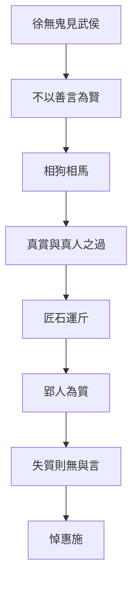

# 徐無鬼

> **閱讀提示**：本篇依通行本段落次序導讀。下文清楚區分**原典**、**歷代注家**與**本書現代詮釋**；後兩者不可倒寫為「莊子原話」。

## 01. 篇名與背景

〈徐無鬼〉以隱士徐無鬼為線索，寫他因女商引見魏武侯，不談仁義教條，而以相狗、相馬切入「君主究竟賞什麼」。篇中最著名的匠石運斤、郢人白堊，則把「真賞」推到極致：高度技藝必須有能相與的對象（質）；質亡，技亦無可施。

雜篇常拼合多組故事，本篇的貫穿問題是：**政治與知人，能否離開言語表演與偏好？** 真知真賞，對政權與友誼同樣嚴苛。它與〈德充符〉「不以形取人」、〈應帝王〉破全知，形成雜篇中對用人與言說的集中批判；又以[莊周](content/figures/莊周.md)過[惠施](content/figures/惠施.md)之墓悼「無以為質」，把政治諷刺收於友誼與辯難。

> **原典位置**：雜篇・第24篇・〈徐無鬼〉；引文據郭慶藩《莊子集釋》所收通行系統。

## 02. 成書背景

戰國國君身邊充斥游士、說客與「善言」之士；能把仁義說得漂亮，往往比能辨人、能辦事更容易得寵。〈徐無鬼〉針對這種「以言取人」的生態：狗不因善吠為良，人也不該只因善言為賢。

匠石與郢人的故事，則可能來自工匠傳統與知音母題，被編入莊學後，成為對「對手／質」的哲學化：沒有可信任的對方，最高技藝也只能停擺。郭象注本定篇次；引文以郭慶藩《莊子集釋》為據。雜篇成書層次複雜，宜保留「編纂」意識，不宜全歸於莊周親筆。

後段尚有「黃顗問孔子」「南伯子綦」等段落，談知士、名言與道之關係，與前半政治諷刺、匠石哀悼形成三重結構：用人、技藝、知解，皆需「質」。

## 03. 結構分析

1. **徐無鬼見武侯**：拒談現成道德套語，改以相狗、相馬談好尚與知人。
2. **真賞與過**：涉及「真人之過」——連真人亦有過，政治更不可假裝無過。
3. **匠石運斤／郢人**：技與質相依；質死而斤無所運。
4. **後段問道與知士**：名言、知解的限度再被推開。

### 結構圖

```text
徐無鬼見魏武侯
        ↓ 不以善言定賢
相狗／相馬（好尚與用人）
        ↓
真賞／真人之過
        ↓
匠石運斤 ←→ 郢人為質
        ↓ 質亡技歇
莊子過惠施之墓：無以為質
        ↓
名言與知解的限度
```

全篇由「宮廷如何聽人」走到「技藝如何需要對手」，再落到「言說本身的邊界」：政治批判與認識論同場。

## 04. 原典

> **版本依據**：郭慶藩《莊子集釋》；以下擇錄關鍵句，非全篇逐字抄錄。
>
> **原典位置**：雜篇〈徐無鬼〉。

### （一）不以善言為賢

> 狗不以善吠為良，人不以善言為賢。

### （二）相狗相馬

> 吾相狗又不若吾相馬也。……吾相馬，直者中繩，曲者中鉤，方者中規，圓者中規，國馬之材止矣；天下馬一也。

### （三）匠石運斤

> 郢人堊漫其鼻端，若蠅翼，使匠石斲之。匠石運斤成風，聽而斲之，盡堊而鼻不傷，郢人立不失容。

### （四）無以為質

> 自夫子之死也，吾無以為質矣！吾無與言之矣。

### （五）真人之過

> 故真人其過人之也，若人之過也。

### （六）相馬層次（補）

> 上質若亡其一，若絕其一，若失其一，然後天下馬一也。

「天下馬」之說，把知人推到超越外形規矩的層次，與「不以善言為賢」形成對稱：真正的識見，不在聲與辭，而在結構與氣質。

第一則把「說得好」與「人是否賢」切開。第二則以相馬的層次，暗示知物、知人有精粗，不能停在表面反應。第三、四則是匠石典故：運斤成風極寫技，而莊子聞惠施之死歎「無以為質」，則把技藝寓言轉成對知音與論敵的哀悼。

## 05. 白話翻譯

### （一）

狗不因為叫得響就稱良犬，人也不因為話說得好就稱賢人。

### （二）

我相狗的本事，還不如我相馬。相馬時，看它體態是否合於法度——直、曲、方、圓各得其中，這是國馬之材；至於天下馬，則更上一層，不是只看外形規矩。

### （三）

郢人鼻尖沾了一點薄如蠅翼的白粉，請匠石砍掉。匠石揮斧生風，隨手斫去白粉，鼻卻毫髮無傷；郢人站著，面不改色。

### （四）

莊子經過惠施之墓，對跟隨的人講完這故事，說：夫子死了，我沒有對手了，也沒有可以深談的人了。

### （五）

所以真人犯了過錯，就像一般人犯過錯一樣——並非永不失手。

合起來看：本篇要分開的是「說得漂亮」與「真能相與」；政治若只寵善言，便失去質；友誼與辯論若失去可對之質，連最高的表達也落空。

## 06. 字詞註解

| 字詞 | 釋義 | 本篇閱讀提示 |
|---|---|---|
| 徐無鬼 | 篇中隱士 | 以「非善言」路線見國君 |
| 魏武侯 | 魏國君主 | 聽言、好尚的政治舞台 |
| 女商 | 引見者 | 宮廷中介，象徵說客生態 |
| 相狗／相馬 | 品評犬馬 | 喻知人層次；不為「聲」所欺 |
| 善言 | 動聽、合君意之言 | 本篇政治批判的靶心 |
| 真賞 | 真實的賞識 | 能識質，而非識辭令 |
| 質 | 對象、對手、可對之體 | 匠石故事關鍵：無質則技無可施 |
| 運斤成風 | 揮斧快疾如風 | 極技的象徵，依賴信任 |
| 堊 | 白土／白粉 | 鼻端薄粉，寫精度與危險 |
| [真人](content/terms/真人.md) | 體道之人 | 「真人之過」：連至者亦不諱過 |
| 天下馬 | 最上等的馬 | 相馬層次之高，喻知人之深 |

## 07. 段落解析

**走讀路線**：見武侯／相狗相馬 → 真人之過 → 匠石運斤 → 無以為質。前半諷「善言」，後半悼「對手」——技與言都需要質。

### 為何以見武侯開篇？

宮廷是「善言」最被獎勵的地方。徐無鬼若一開口就講仁義，只是另一種善言；改談相狗相馬，是迫使武侯離開套語，面對自己的好尚與用人之實。相馬層次（國馬→天下馬）更暗示：**知人也有高下，不能停在「會說」**。

### 為何中插入匠石運斤？

相馬還停在「識物」；運斤把問題升級為「關係中的技」：再高的能力，也需要對方不躲、不亂、能承擔風險。這使「真賞」有身體感——賞的不是表演，而是可與之共當危險的默契。與[工作與技道](content/themes/工作與技道.md)主題相連：技進乎道，仍需「質」。宋元君聽後曰「寡人猶以為重言」——寓言之效在於讓君主自覺其聽言方式之淺。

### 後段名言與知士

篇末「黃顗問孔子」「南伯子綦」等段，再推「知士」「名言」之限：知解可傳，道不可執。這使全篇不止於諷武侯，亦反省**一切言說體制**——包括學術、師承與哲學本身。讀雜篇宜看編纂者如何把政治、技藝、知解三線收於「質」。

### 為何收在「無以為質」？

把匠石故事接到[惠施](content/figures/惠施.md)之死，政治篇忽然變成悼友篇：[莊周](content/figures/莊周.md)與惠施終身辯難，惠施卻是他的「質」。如此，本篇不只諷國君，也自省言辯之條件——沒有對手的正確，是寂寞的正確。宋元君想重演運斤而無人敢當郢人，正是**無質則技不可複製**的寫實。

### 真人之過如何與全篇相關？

「真人其過人之也，若人之過也」打破聖人無過神話，使政治批判仍有自省空間：連「真人」都可過，權力者更不可假裝無瑕。這與「不以善言為賢」呼應——**賢不在話說得滿，而在能承認限度**。

## 08. 歷代注家怎麼看

### 郭象

郭象解匠石段，多強調「非獨工之巧，乃有其質」：技不能離其所對。對武侯段，則警惕以言取士，失其人之實。

### 成玄英

成疏「運斤成風」為心手相得、物我無間；並指出郢人「立不失容」與匠石之信互為條件。其工夫化讀法有助理解「質」，但勿把寓言縮成純粹內修口訣。

### 林希逸

林氏提醒：莊子過惠子之墓而稱「無以為質」，是文情極處——辯敵即知音。讀雜篇不可只摘「狗不以善吠為良」當罵人話，而忽略後文的哀悼結構。

### 郭慶藩與其他

郭慶藩《莊子集釋》於相馬、匠石各段可核對字句；王先謙集解簡明可參。近人論「質」多連知音傳統，宜回到本篇政治與友誼雙線。又，魏武侯好言而輕實，與戰國君主普遍困境相呼應，寓言雖誇飾，問題仍具現代性。

## 09. 哲學分析

> 以下為**本書現代詮釋**。

本篇提出一種嚴格的認識倫理：**能說，不代表能見；能見，還需要能對。** 「善言為賢」之所以危險，是因為語言可以脫離實踐與性格，自成討喜的商品。相狗相馬的層次說，要求判斷回到可觀察的結構，而不是音量與修辭。

「質」的概念比「知音」更冷峻：它包含信任、穩定與一起承擔失誤的可能。匠石可以運斤，因為郢人不閃；政治與組織若人人自保、無人肯當質，再好的人才也只能「聽而無可斲」。真人之過，則打破「有道者永不犯錯」的神話，使批評與自省仍有空間。全篇因此同時服務[政治與無為](content/themes/政治與無為.md)與[工作與技道](content/themes/工作與技道.md)兩條主題線。

## 10. 與老子比較

《老子》「信言不美，美言不信」「知人者智」，與「不以善言為賢」同調。老子多從治國用言的戒律說；〈徐無鬼〉則用宮廷對話與工匠寓言，把「言／質」的分裂寫成可感的場面，並連到友誼與喪友，層次更敘事化。

## 11. 與儒家比較

儒家亦重「聽其言而觀其行」「以友輔仁」。本篇與之可對話處在於：反對空言取人。差異是匠石段把「友」推到可共生死風險的「質」，且莊子與惠施的關係並非同門進德，而是辯難中的相成。故可補儒家「觀行」之所未寫：有時對手比同溫層更能成全言說。

## 12. 與佛學比較

匠石運斤、質，後世或以善知識、機鋒對手比附。本篇更動人的是過惠子之墓——辯敵即知音，無以為質。

先讀相馬、匠石與哀悼結構，技藝之「質」不必先換成禪門術語。


## 13. 現代人生應用

> 以下為**本書現代詮釋**。

- **不以善言取人**：面試、投票、追網紅意見時，把「說得真好」與「做得是否穩」分開；多看長期行為與承擔後果的方式。
- **真賞**：欣賞同事或朋友，賞其可託之事、可對之質，而非只轉發其金句。
- **運斤與質**：團隊裡若無人敢當「郢人」（承擔風險、不臨場閃躲），再強的執行者也會被迫收斧——先建立信任，再談極致表現。
- **無以為質**：失去可深辯的對手時，承認寂寞，而非假裝自己已無需對話；必要時主動尋找能立不失容的批評者。
- **真人之過**：領導者與專家亦須保留認錯空間，勿以「絕不出錯」維持權威。

### 13.1 招聘與選舉

履歷上的華麗表述、辯論場上的機鋒、社群上的金句，都可能是「善言」。真賞要求看見：此人在壓力下如何決策、犯錯後如何承擔、與他人合作時是否可當「質」。

### 13.2 團隊中的郢人

高績效文化常缺少敢承擔風險的「質」——人人怕背鍋，便無人敢讓匠石運斤。領導者若只獎表演、不獎承擔，團隊技藝終會空心化。

### 13.4 公共討論中的「質」

公共討論若只剩同溫層按讚，便無「質」可言。真賞在公共領域意味著：主動尋找能立而不失容的反方、願意被修正的對話夥伴，而非只收集支持自己的證據。

## 14. 常見誤解

1. **「反對善言＝反對溝通、鼓勵講粗話。」** 所反的是以動聽取代賢能，不是否定清楚表達。
2. **「匠石故事教人冒險炫技。」** 重點是信與質；無質而運斤，是宋元君式的愚蠢重演。
3. **「真賞就是挑剔、永遠不滿意。」** 真賞是能識結構與承擔，不是以否定證明自己高明。
4. **「莊子悼惠施＝忽然變溫情主義。」** 悼的是失質；辯難本身仍被肯定為思想的條件。
5. **「真人無過，故政治人物可神聖化。」** 文本反說真人之過——更不可神化權力。
6. **「相馬只論外形。」** 天下馬之說，正是超越表面規矩的層次。
7. **「悼惠施＝否定辯論。」** 悼的是失質，不是否定惠施之學；〈天下〉篇對惠施仍有專條評述。

## 15. 本篇總結

〈徐無鬼〉從魏武侯的聽言，寫到匠石的運斤，再落到莊子失惠施之質：它追問的是**誰配被賞、誰配被言、誰配作為對手**。警句「狗不以善吠為良，人不以善言為賢」必須與「吾無以為質矣」連讀，才不致變成只會罵人的口號。全篇三線——宮廷用人、工匠技藝、哲學辯難——同歸於「質」：沒有可對之體，言與技皆空轉。

若以一句話收束：**沒有可對之質，再華麗的言與再高的技，都只是空轉。**

## 16. 心智圖



## 17. 延伸閱讀

### 原典與注疏

- 郭慶藩《莊子集釋》〈徐無鬼〉
- 王先謙《莊子集解》〈徐無鬼〉
- 成玄英《南華真經注疏》相關篇章
- 林希逸《莊子口義》相關篇章

### 今注今譯與研究

- 陳鼓應《莊子今註今譯》〈徐無鬼〉
- 王邦雄《莊子內七篇‧外秋水‧雜天下的現代解讀》相關章節
- 劉笑敢等關於《莊子》內、外、雜篇與文本層次的研究

---
### 交叉引用
- 相關篇章：〈德充符〉、〈大宗師〉、〈秋水〉、〈天下〉
- 相關人物：徐無鬼、魏武侯、匠石、郢人、[莊周](content/figures/莊周.md)、[惠施](content/figures/惠施.md)
- 相關名詞：[真人](content/terms/真人.md)、善言、真賞、質、運斤成風
- 相關主題：[政治與無為](content/themes/政治與無為.md)、[工作與技道](content/themes/工作與技道.md)、知人、友誼與辯難

### 讀法建議

初讀宜通讀全篇，勿只摘「狗不以善吠為良」；須讀到匠石運斤與悼惠施，才見全篇文勢。與〈天下〉惠施條、〈齊物論〉辯論傳統、〈德充符〉不以形取人可並讀。研究層次宜並置郭慶藩、林希逸對「質」的說明，並標明雜篇編纂性。匠石段與〈徐無鬼〉外〈列御寇〉等技藝寓言可對照，但本篇獨特處在宮廷用人與悼友並置。
