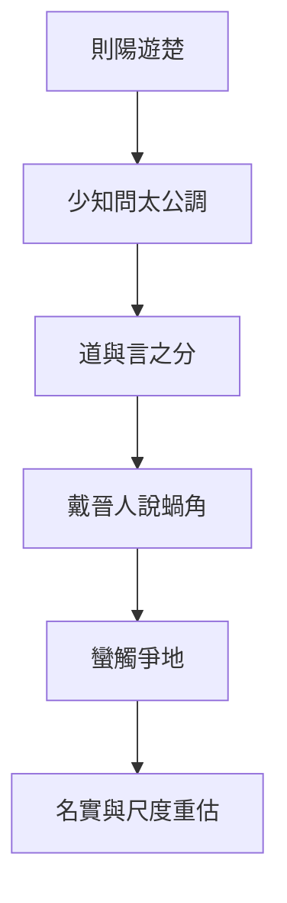

# 則陽

> **閱讀提示**：本篇依通行本段落次序導讀。下文清楚區分**原典**、**歷代注家**與**本書現代詮釋**；後兩者不可倒寫為「莊子原話」。

## 01. 篇名與背景

〈則陽〉以人物則陽遊於楚開篇，隨即進入少知與太公調關於道、言、知的問答；中段戴晉人對魏王講述蝸角上蠻氏、觸氏之戰，把「奪地而戰、伏尸數萬」縮到蝸牛兩角——全篇最尖銳的政治寓言。其問題不是「世界很小」的感嘆，而是：**名分與尺度一被絕對化，微小的爭端也可燃燒成巨大的犧牲。**

雜篇材料駁雜，本篇宜抓住「名實／尺度」主軸：游士求見、玄談道體、國君爭地，三種場面共用同一把被放大的尺子。

> **原典位置**：雜篇・第25篇・〈則陽〉；引文據郭慶藩《莊子集釋》所收通行系統。

## 02. 成書背景

戰國爭地、會盟、游說並行：一寸疆土、一項名號，皆可動員千軍。名家、辯者又使「名」「實」成為專門問題。〈則陽〉把這兩股壓力疊在一起——太公調談道不可執於言，戴晉人則用蝸角讓國君看見自己的戰爭尺度何其荒謬。

此類寓言不必視為史實紀錄；它是思想實驗：若把觀測尺度拉遠，今日不可讓的「國恥／國體」，是否仍值得以數萬生命支付？引文據郭慶藩《莊子集釋》。

## 03. 結構分析

1. **則陽遊楚**：求聞於有道，見接輿之風而不得其門——先寫「言與見」的落空。
2. **少知問太公調**：道、物、言、知如何相及而不相役。
3. **戴晉人／蝸角蠻觸**：魏瑩欲戰，以蝸牛兩角之國相喻。
4. **名實收束**：爭的是名，耗的是實；尺度一變，勝負改觀。

### 結構圖

```text
則陽遊楚（求言而不得）
        ↓
少知 ↔ 太公調（道／言／知）
        ↓ 把「大」說破
戴晉人：蝸角上的蠻觸之戰
        ↓ 尺度塌陷
名實之爭顯出偶然與可讓
```

順序上，先讓「求道之言」受挫，再給玄理，最後用寓言砸向具體戰爭——理論不懸空，政治不免責。

## 04. 原典

> **版本依據**：郭慶藩《莊子集釋》；以下擇錄關鍵句，非全篇逐字抄錄。
>
> **原典位置**：雜篇〈則陽〉。

> 有國於蝸之左角者曰觸氏，有國於蝸之右角者曰蠻氏；時相與爭地而戰，伏尸數萬，逐北旬有五日而後反。

> 少知問於太公調曰：「何謂丘里之言？」……太公調曰：「……言而足，則終日言而盡道；言而不足，則終日言而盡物。……」

> 道不可有，有不可無。……或使莫為，在物一曲。

蝸角一段是本篇記憶點：兩國在蝸牛角上爭地，死傷慘重——對聽者（魏王）而言，這不是笑話，而是鏡子。少知與太公調則處理「言能否盡道」：言若自足於道則可，若只在物上打轉，終日言也只是盡物。後者與蝸角寓言合流：把局部物爭說成絕對大道，正是「言而不足」的政治版。

## 05. 白話翻譯

蝸牛左角上有個國家叫觸氏，右角上有個叫蠻氏；兩邊為了爭地盤打仗，倒斃的屍體數以萬計，追擊敗軍十五天後才回來。

少知問太公調：什麼叫「丘里之言」？太公調答到：話若真夠得上道，整天說也在說道；話若夠不上，整天說也只是在說物。……道不能被「佔有」；硬說「有」或硬說「無」，都容易偏在一曲。

合起來看：本篇不是叫人覺得「人類很渺小就好了」；它要讀者看見——爭端常由一個被絕對化的名分與尺度放大。站在蝸牛之外，蠻觸之戰荒唐；站在一角之內，它卻像整個世界。政治智慧在於，偶爾願意爬到角外看一眼。

## 06. 字詞註解

| 字詞 | 釋義 | 本篇閱讀提示 |
|---|---|---|
| 則陽 | 篇首游士 | 求見、求言的起點 |
| 少知／太公調 | 問答雙方 | 處理道與言之關係 |
| 丘里之言 | 鄉里間的說法／局部之言 | 對比「盡道」之言 |
| 戴晉人 | 說蝸角寓言者 | 以喻諫君，改其戰爭尺度 |
| 蠻氏／觸氏 | 蝸角兩國 | 極端縮小的「國際關係」 |
| 爭地 | 爭奪土地 | 戰國主題的寓言化 |
| 伏尸數萬 | 死傷極多 | 諷刺「小爭」的大代價 |
| 名實 | 名稱與實際 | 本篇政治哲學關鍵 |
| 尺度 | 觀看與評價的基準 | 蝸角寓言之所改 |

## 07. 段落解析

**走讀路線**：則陽求言不得 → 太公調論言 → 蝸角蠻觸之戰 → 名實收束。蝸角段是全文記憶點：**角內像天下，角外像鬧劇。**

### 為何先寫則陽遊楚、求言不得？

開篇若直接講蝸角，易被當成只諷戰爭。先寫求道者得不到現成教誨，才建立全篇態度：重大道理往往不在可販售的「一句話」，而在尺度轉換的經驗。

### 為何中段要有太公調？

蝸角是形象打擊；太公調是概念準備。「言而足／不足」說明：語言可以盡道，也可以把人鎖在物爭裡。沒有這段，寓言只剩相對主義的笑；有了這段，笑才變成對「名言如何製造戰爭」的分析。

### 為何蝸角放在政治對話裡？

戴晉人不是對隱士說宇宙觀，而是對欲戰的魏王說。寓言的位置決定其功能：改君之尺，不是勸人出世。後文名實之累，則防止讀者以為「看小了就結束」——真正要鬆動的是以名為實的執著。

## 08. 歷代注家怎麼看

**郭象**讀蝸角，重在「以差觀之，則齊」：自其異者視之，肝膽楚越；自其同者視之，萬物皆一。他強調尺度相對，但亦須防把郭注讀成取消一切是非的藉口——文本針對的是爭地之虐，不是取消救護。

**成玄英**疏蠻觸，明言以小喻大、破國君矜伐；於太公調段則重「遣名」以求玄通。其破執語感強，仍屬唐代義疏層。

**林希逸**特賞蝸角敘事的戲劇力：先問「有之乎」，再指「在魏王之前」——讓聽者發現自己正是角上之人。讀法上不可只當奇想，而要還原諫諍結構。

## 09. 哲學分析

> 以下為**本書現代詮釋**。

本篇的哲學貢獻是把〈齊物論〉的「因是因非」接到地緣政治：是非不只在口舌，也在地圖與動員令裡。蝸角寓言運作的機制是**尺度轉換**——同一場戰爭，在角內是聖戰，在角外是鬧劇。名實問題因此不是書齋遊戲：當「名」要求「實」無限支付（人民、土地、尊嚴的修辭），莊子要求重新校準名是否仍指涉其宣稱要保護之物。

「言而足則盡道，不足則盡物」可讀作：政治修辭若只在物（土地、戰利、面子）上打轉，卻自稱替天行道，便是言不足而僭道。太公調的「一曲」，正是對這種僭越的診斷。

## 10. 與老子比較

《老子》「兵者凶器」「飄風不終朝」，與蝸角諷戰相通；「道可道，非常道」亦近太公調對言之戒。差異在於：老子常以治術格言收斂欲望；〈則陽〉用極小空間裡的極大傷亡，製造認知休克，使國君無法維持原來的「不得不戰」敘事。

## 11. 與儒家比較

儒家重義戰、正名、華夷與封疆。本篇不否認秩序需要名稱，但質問：正名若成為爭地的燃料，名是否已離實？可與孟子反「爭地以戰，殺人盈野」對讀——價值取向或近，而莊子的方法是尺度寓言，不是仁政制度設計。

## 12. 與佛學比較

本篇暫略。雖有人以「一多」「須彌芥子」比蝸角，然本篇脈絡是戰國諫戰與名實，與佛教宇宙論、空觀修行不同源，不宜硬比附。

## 13. 現代人生應用

> 以下為**現代詮釋**，回扣本篇概念。

- **蝸角之爭**：組織內鬥、網路論戰、家族意氣相持時，試問「若把鏡頭拉遠十倍，這塊『地』還值不值得伏尸（關係破裂、健康透支）？」
- **名實尺度**：頭銜、品牌、國族修辭都很硬時，查核它們實際保護了什麼、犧牲了什麼；名大而實空，便是角上的旗。
- **言而足／盡物**：發言前區分：我是在澄清道理，還是在反覆搬運情緒與物利？後者即使終日言，也只是盡物。
- **一曲之戒**：專業、立場、陣營都是「一曲」；需要時借太公調的提醒，承認自己可能只看見蝸牛的一角。

## 14. 常見誤解

1. **「蝸角＝人生毫無意義，什麼都不必爭。」**  
   寓言針對的是被放大的名實之戰，不是取消保護弱者或基本正義。

2. **「看破尺度就可以嘲笑所有認真的人。」**  
   戴晉人是為了止戰與校準，不是培養犬儒式冷笑。

3. **「名都是假的，所以不用負責任。」**  
   本篇要名回到實，不是廢名；無名的權力往往更難追究。

4. **「太公調教人不說話。」**  
   「言而足」反而肯定能盡道之言；所戒是不足而強以為道。

5. **「則陽篇只是相對主義故事集。」**  
   結構上有求道、論言、諫戰的推進，主題是尺度與名實，不是怎麼都行。

## 15. 本篇總結

〈則陽〉以遊楚求言起，經太公調之理，落在蠻觸之戰的鏡子上：它逼問國君與讀者——**你以為自己在守整個天下，是否其實只在守蝸牛的一角？** 名實與尺度一明，許多「不可讓」會重新變得可商量；真正不可讓的，應是生命與基本之實，而非膨脹的名。

若以一句話收束：**先改尺子，再決定是否值得一戰。**

## 16. 心智圖




## 17. 延伸閱讀

### 原典與注疏

- 郭慶藩《莊子集釋》〈則陽〉
- 王先謙《莊子集解》〈則陽〉
- 成玄英《南華真經注疏》相關篇章
- 林希逸《莊子口義》相關篇章

### 今注今譯與研究

- 陳鼓應《莊子今註今譯》〈則陽〉
- 王邦雄《莊子內七篇‧外秋水‧雜天下的現代解讀》相關章節
- 劉笑敢等關於《莊子》內、外、雜篇與文本層次的研究

### 本專案內交叉引用

- 相關篇章：〈齊物論〉、〈秋水〉、〈逍遙遊〉、〈天下〉
- 相關人物：則陽、少知、太公調、戴晉人、魏瑩
- 相關名詞：蝸角、蠻觸、名實、尺度、丘里之言
- 相關主題：戰爭、相對性、語言與政治、觀測尺度
