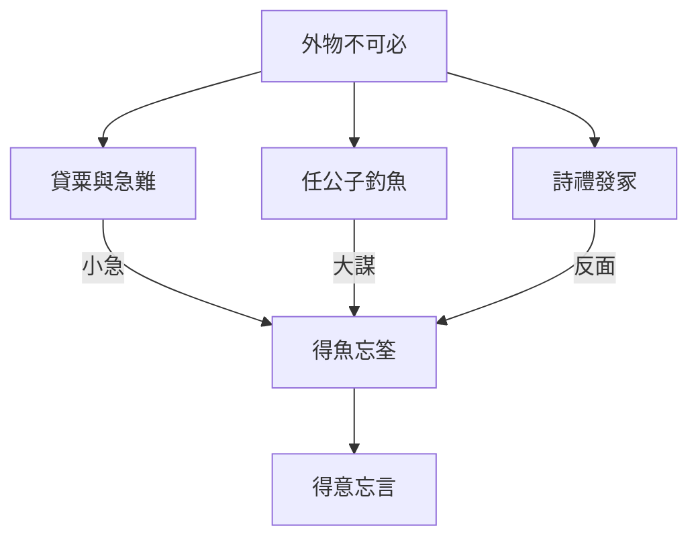

# 外物

> **閱讀提示**：本篇依通行本段落次序導讀。下文清楚區分**原典**、**歷代注家**與**本書現代詮釋**；後兩者不可倒寫為「莊子原話」。

## 01. 篇名與背景

〈外物〉開宗明義：「外物不可必」——外界的事物、機遇、別人的反應，都不能用意志保證。篇中有莊周貸粟、任公子以大鉤巨緇釣魚、儒者詩禮發冢等故事，末段收在「得魚忘筌」「得意忘言」：工具（筌、蹄、言）為抵達而設，抵達後執著工具，便反客為主。

本篇因此有雙線：**生存條件的不可控**，與**符號工具的可放下**。雜篇拼合痕跡明顯，但兩線共同指向——人若把外物與言說當成可必、可執的終點，便會自困。

> **原典位置**：雜篇・第26篇・〈外物〉；引文據郭慶藩《莊子集釋》所收通行系統。

## 02. 成書背景

戰國民生無常：貸貸、乾魚、大河之魚，皆可寫成寓言。士人又依賴詩書禮樂作為晉身工具，遂有「儒以詩禮發冢」的尖刻諷刺——經典若只為盜墓式的利益服務，文言與實行已經脫節。

「筌蹄」之喻後來影響魏晉言意之辨，但在本篇脈絡裡，它首先接在「外物不可必」之後：連魚是否上鉤都不可控，何況把筌當成魚本身。引文據郭慶藩《莊子集釋》。

## 03. 結構分析

1. **外物不可必**：總起——陰陽、天時、人情皆不可強求必得。
2. **莊周貸粟／涸轍**：急難中的緩不濟急，寫「必」之妄。
3. **任公子釣魚**：大鉤巨緇、蹲乎會稽——大事需大器與時，非小得失可比。
4. **儒以詩禮發冢**：諷經典工具化。
5. **得魚忘筌／得意忘言**：收束工具與意旨的關係。

### 結構圖

```text
外物不可必（總綱）
        ↓
貸粟／急難（不可必的日常）
        ↓
任公子大鉤（不可必的「大成」條件）
        ↓
詩禮發冢（工具被利益劫持）
        ↓
得魚忘筌 → 得意忘言
```

由「求而不可必」，寫到「得而應能忘」：前者戒妄控，後者戒執器。

## 04. 原典

> **版本依據**：郭慶藩《莊子集釋》；以下擇錄關鍵句，非全篇逐字抄錄。
>
> **原典位置**：雜篇〈外物〉。

> 外物不可必，故龍逢誅，比干戮，箕子狂……

> 任公子為大鉤巨緇，五十犗以為餌，蹲乎會稽，投竿東海……

> 儒以詩禮發冢。……「詩固有之曰：『青青之麥，生於陵陂。……』」

> 荃者所以在魚，得魚而忘荃；蹄者所以在兔，得兔而忘蹄；言者所以在意，得意而忘言。吾安得夫忘言之人而與之言哉！

> 莊周家貧，故往貸粟於監河侯。監河侯曰：「諾。我將得邑金，將貸子三百金，可乎？」莊周忿然作色曰：「周昨來，有中道而呼者。周顧視車轍中，有鮒魚。周問之曰：『鮒魚來，子何為者邪？』對曰：『我，東海之波臣也。君豈有斗升之水而活我邪？』周曰：『諾。我且南遊吳越之王，激西江之水而迎子，可乎？』鮒魚忿然作色曰：『吾失神明，無所處，吾得斗升之水然活耳，君乃言此，曾不如早索我於枯魚之肆！』」

第一則以忠臣命運說明：德行與外物後果之間沒有保證契約。第二則任公子之釣，寫「大」需要相稱的工具與等待，嘲諷只用小竿心思度量世界的人。第三則儒者一邊誦詩一邊盜墓，極寫文言與行為的分裂。第四則是全書論言意最常被徵引的句子：筌、蹄、言都是手段；並歎息難遇已能忘言、仍可與之言的人。第五則「貸粟／涸轍之魚」把「不可必」落到急難：緩不濟急的承諾，與空談大計同構——都是用遙遠的「將來」迴避當下的責任。

## 05. 白話翻譯

外在的事物不能指望「必然如此」：所以龍逢被殺，比干被害，箕子裝瘋……德行換不來外物的保險。

任公子做了巨大的釣鉤和粗繩，用五十頭牛當魚餌，蹲在會稽，把竿投向東海……（久之才有大魚），然後遠近的人才能分享——這不是抱著小魚竿在溝渠邊能理解的事業。

有儒生按著詩禮去挖墳。……還引《詩》說「青青的麥子，長在山坡上……」——經典成了掩護盜掘的台詞。

魚笱是用來捕魚的，捕到魚就該忘掉魚笱；兔網是用來捉兔的，捉到兔就該忘掉兔網；言語是用來傳達意思的，得到意思就該忘掉言語。我哪裡能遇到已經忘掉言語的人，再和他說話呢！

合起來看：「忘筌」不是反知識、反語言，而是警告——工具一旦被當成目的，就遮住原本要抵達的事；「外物不可必」則提醒：物資、機會與名位，從來不是意志的奴隸。

## 06. 字詞註解

| 字詞 | 釋義 | 本篇閱讀提示 |
|---|---|---|
| 外物 | 自身以外的事物與際遇 | 篇名；強調不可「必」 |
| 不可必 | 不能保證、不能強制 | 總綱；反宿命擔保幻想 |
| 任公子 | 寓言中的大釣者 | 大事業需大器與時 |
| 大鉤巨緇 | 巨大釣具 | 與小智小得對照 |
| 貸粟 | 借糧 | 莊周急難；緩不濟急的諷喻 |
| 詩禮發冢 | 以詩禮之言盜墓 | 諷經典淪為利益話術 |
| 荃／筌 | 捕魚器具 | 「得魚忘筌」之器 |
| 蹄 | 捕兔之具 | 與筌並列的工具喻 |
| 得意忘言 | 得意義而忘言辭 | 言意關係；影響後世玄學 |

## 07. 段落解析

**走讀路線**：外物不可必 → 貸粟急難 → 任公子大釣 → 詩禮發冢 → 得魚忘筌。兩條線：**別妄想必得**，**別死抓工具**。

### 為何以「不可必」總起？

若無此句，後文任公子、忘筌易被讀成成功學或語言哲學專題。總起先切斷「德→福」「努力→必得」的契約幻想，後面的故事才都落在同一個問題域：人如何在不可控中仍合宜地使用工具與言語。

### 莊周貸粟為何接在總起之後？

借糧遭拒、涸轍之魚——寫的是「急難等不得大計畫」。它把「不可必」從抽象拉到日常：人餓了不能只用長遠道理搪塞。讀任公子前先看見小急難，才懂大釣不是嘲笑貧困，而是校正尺度。

### 為何要有任公子？

貸粟寫小急難；任公子寫大企圖。兩者都「不可必」，但尺度不同：有人用小溝的邏輯嘲笑東海之釣，正如用短期績效否定需長期條件的事。段落功能是校正「小成見」。

### 為何以忘筌收尾？

前面寫外物難必，人容易改為死抓工具（多備筌、多堆言、多引詩禮）。發冢段展示工具被劫持的醜態；忘筌段則給出對治：目的達成（或意義已得）後，放開工具，才能再與「忘言之人」對話——否則永遠在修辭層打架。

### 貸粟與涸轍之魚的諷刺結構

監河侯的「將貸子三百金」與莊子對鮒魚的「激西江之水而迎子」形成鏡像：兩者都用遙不可及的未來搪塞眼前的急需。這不是說人永遠不能規劃長遠，而是警告——當「大計畫」被用來迴避當下可做的最小幫助，它就變成另一種巧偽。段落因此把「外物不可必」與「人際責任」接起來：你可以控制不了結果，卻仍須辨認自己是在真誠回應，還是在表演慷慨。

### 與〈寓言〉、〈天下〉的言說線

忘筌句常與〈寓言〉的「言無言」、〈天下〉對莊周「卮言」的評述連讀。三篇共同關心：語言如何既必要又可放下。〈外物〉的獨特貢獻在於把言意問題嵌進「外物不可必」的生存處境——人對世界失控時，最容易加倍投資在可控的言與器上。

## 08. 歷代注家怎麼看

**郭象**解「外物不可必」，謂人之生當安其不可奈何；解忘筌，則謂言以出意，得意則言可忘——重在不執。其「安命」色彩強，宜與文本對忠臣被戮的憤慨並讀，避免變成純然順民哲學。

**成玄英**疏任公子，強調志大者器大、不可與井蛙論；疏筌蹄，則連到遣教、忘言的工夫。有助理解「忘」，但勿把莊子收成只勸人沉默。

**林希逸**特點「儒以詩禮發冢」之諷：莊子惡的是竊詩禮之名而行盜之實。讀忘筌句，他亦提醒末句「安得忘言之人而與之言」——忘言不是終止交談，而是尋找能越過言障的對話者。

**王先謙**於貸粟段多從惠施與莊子交誼傳統注之，提醒監河侯或即惠施之別稱（諸說不一）；無論坐實與否，諷刺結構不變：知識分子之間的「將來幫你」有時比陌生人的拒絕更傷人，因為它消耗了信任卻未兌現。

**郭慶藩**集釋於「得魚忘筌」句廣引魏晉言意之辨材料，顯示此喻在後世哲學史中的獨立生命；讀戰國原脈絡時，仍應把它放回「外物不可必」之後——忘筌首先是生存與工具倫理，然後才是玄學命題。

## 09. 哲學分析

> 以下為**本書現代詮釋**。

本篇同時處理**因果傲慢**與**符號崇拜**。因果傲慢以為外物可由德行或計劃鎖定；符號崇拜以為掌握經典、模型、術語就等於掌握實事。任公子表明：有些目標需要相稱的條件與時間，不可必得，卻仍可準備；忘筌表明：準備本身不是目的。

「得意忘言」常被抽去當藝術理論；在〈外物〉裡，它緊貼「外物不可必」——因為人對外物失控時，最容易加倍投資在可控的言與器上，最後只剩下器，沒有魚。莊子要的是：用言，但不被言佔滿；求物，但不與不可必之物賭上整個自我。

與[語言與真實](content/themes/語言與真實.md)主題條目可對讀：全書從〈齊物論〉的天籟、〈外物〉的忘筌到〈寓言〉的三種言，形成一條可追蹤的言說哲學線。本篇的現代意義在於：當我們無法控制市場、疫情、選舉結果時，是否反而更執著於意識形態口號、方法論標籤、或學位與證照——把「筌」當成「魚」？

## 10. 與老子比較

《老子》「為者敗之，執者失之」「功成身退」，與「不可必」「忘筌」相近：戒強執。老子更常從治道與謙退說；〈外物〉則並舉忠臣慘局、大釣、盜墓儒生，使「執」的失敗有社會與語言的多幅畫面。

## 11. 與儒家比較

本篇「詩禮發冢」是對儒家符號被濫用的內部嘲諷式外部批評：不是否定詩禮可成德，而是暴露其可被盜用。孔子亦重「辭達而已矣」；「得意忘言」可與「辭達」對讀——達意之後，不以辭為驕。爭點在於：莊子更不信任外物對德行的回報契約。

## 12. 與其他傳統的對話（含後世佛學聯想）

> 以下為**本書現代詮釋**。本節以《莊子》本篇概念為主；其他傳統（含儒家、後世佛學等）只作對照，**不以任何一家為尊**，更不是把本篇說成佛學。

本篇要緊的是「得魚忘筌、外物不可必」：關切在言意與外物。讀法上，先守住這些原典語彙與故事順序，再談它能否照見今日——哲學可以深，人生卻宜像行人：輕一點、活一點，胸中留一寸氣，路上仍有風。

後世讀者或會聯想到其他傳統的話頭（例如儒家的成德／正名，或佛學的破執／無常）。這種聯想可以保留為**不同觀點**，幫助你更清楚看見莊子在說什麼；但不宜做成概念對譯，也不宜用別家結論倒過來裁定《莊子》。注家如郭象、成玄英亦是觀點之一，不是原典本身。

若讀完還帶走什麼，寧取莊子式的在世氣象——器是橋，不是家——而不是把本篇收編成任何一家的教門課本。


## 13. 現代人生應用

> 以下為**本書現代詮釋**：回扣本篇原典概念，帶到可走的一步。不是教門功課，也不是催你修行；三萬天有限，能遊、能化、還走得動就好。

- **外物不可必**：求職、感情、創作發表，可盡力準備，但把「結果必須如我所願」從自我價值裡卸載；未得不等於人格破產。
- **任公子之釣**：做需要長期累積的事時，拒絕只用「小溝邏輯」自我羞辱；檢查是否已具備相稱的「鉤與餌」（能力、資源、時間），而非只焦慮。
- **得魚忘筌**：學位、證照、簡報模板、術語——有用就用；事已成、意已達，便少拿它們壓人，也少被它們反鎖。
- **得意忘言**：爭論停在用詞警察時，改問「對方要保全的意思是什麼？」先得魚（意），再決定是否還要修筌（措辭）。

### 與全書「執」的批判線

從〈齊物論〉破成心、〈外物〉忘筌，到〈寓言〉言無言，莊子對「執器不執意」的關心一脈相承。本篇的「不可必」則補上**因果謙卑**：你可以準備大鉤，卻不能保證東海必有大魚；你可以誦詩禮，卻不能保證德行必得善終。這不是虛無，而是把努力從「擔保幻想」改為「合宜回應」。讀〈秋水〉「計四海之不能容大也」時，亦可見同一種尺度謙卑：大與小、成與敗，都須放在更寬的視野裡，而非賭上整個自我。

## 14. 常見誤解

1. **「外物不可必＝什麼都別規劃。」**  
   任公子恰恰在準備大器；不可必 ≠ 不作為。

2. **「忘筌＝反智、焚書、不學習。」**  
   先有筌而後可忘；無筌而誇忘，是空話。

3. **「得意忘言＝可以隨便說話、不負責。」**  
   忘的是執辭，不是取消意義與承諾。

4. **「諷儒＝全面否定儒家經典。」**  
   諷的是以詩禮掩護發冢式利益，不是否定經典的成德可能。

5. **「大釣成功學：要做就做最大。」**  
   寓言對照的是器與志相稱，以及小見笑大；不是盲目放大賭注。

## 15. 本篇總結

〈外物〉以「不可必」為綱，以任公子寫條件與等待，以發冢寫工具被盜，以忘筌寫得而後能捨。它既戒對外物的擔保幻想，也戒對言語與器具的戀物。末句「安得夫忘言之人而與之言」說明：忘言不是封閉，而是為了重新打開真正的交談。

若以一句話收束：**外物強求不到，言語執著不得；魚與意才是方向，筌與言只是路過的工具。**

## 16. 心智圖




## 17. 延伸閱讀

### 原典與注疏

- 郭慶藩《莊子集釋》〈外物〉
- 王先謙《莊子集解》〈外物〉
- 成玄英《南華真經注疏》相關篇章
- 林希逸《莊子口義》相關篇章

### 今注今譯與研究

- 陳鼓應《莊子今註今譯》〈外物〉
- 王邦雄《莊子內七篇‧外秋水‧雜天下的現代解讀》相關章節
- 劉笑敢等關於《莊子》內、外、雜篇與文本層次的研究；魏晉「言意之辨」相關討論

### 本專案內交叉引用

- 相關篇章：〈逍遙遊〉、〈齊物論〉、〈養生主〉、〈秋水〉、〈寓言〉、〈天下〉
- 相關人物：[莊周](content/figures/莊周.md)、[惠施](content/figures/惠施.md)、任公子
- 相關名詞：外物、不可必、筌蹄、得意忘言、[寓言](content/terms/寓言.md)
- 相關主題：[語言與真實](content/themes/語言與真實.md)、[無用與有用](content/themes/無用與有用.md)、[名與利](content/themes/名與利.md)
