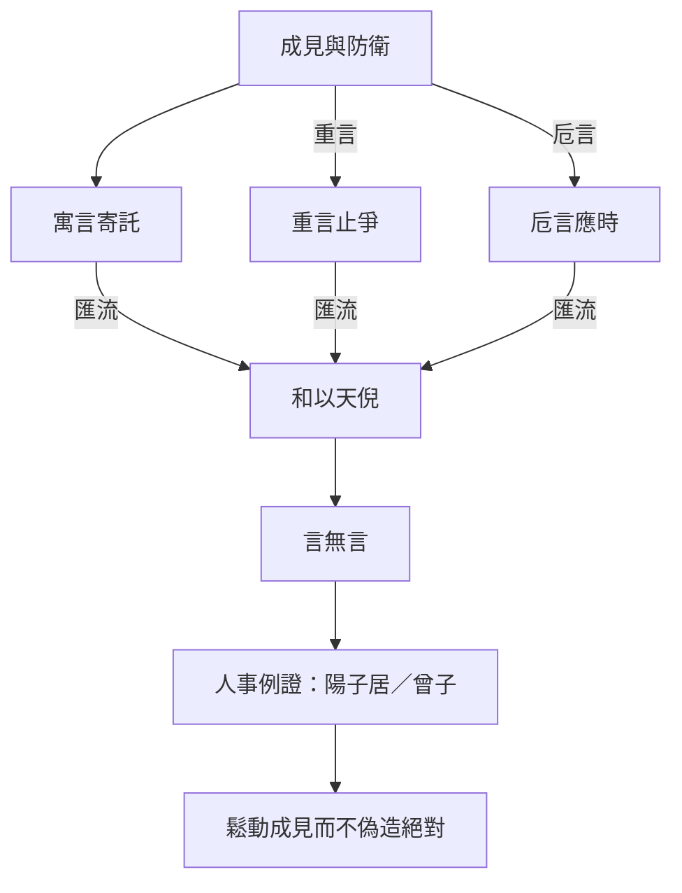

# 寓言

> **閱讀提示**：本篇依通行本段落次序導讀。下文區分**原典**、**歷代注家**與**本書現代詮釋**；後兩者不可倒寫為「莊子原話」。

## 01. 篇名與背景

〈寓言〉篇名即全書寫作方法的自白。「寓」是寄託：把意思寄在別人、別事、別地上說；「言」則提醒讀者：莊子從來不以單一論證壓倒讀者，而以多聲部的說話方式打開思考。

本篇在雜篇中的特殊地位，在於它幾乎像一篇「讀《莊子》說明書」。〈天下〉末段亦以寓言、重言、卮言概括莊周之文；〈寓言〉則把這三種言說攤開，並用具體故事示範：為何有時要借重古人、為何有時要讓語言像酒器般隨滿隨傾。讀本篇，等於同時讀「怎麼說」與「怎麼聽」。

> **原典位置**：雜篇・第27篇・〈寓言〉。版本依據見下「原典」節。

## 02. 成書背景

〈寓言〉的語言理論口吻，與內篇寓言實踐高度呼應，但篇中若干人物故事（如陽子居見老聃、曾子再仕）的編排方式，仍顯示雜篇常見的「理論綱領＋例證串聯」結構。近人多視其為莊學傳統中對自身文體的後設反省：未必每一則例證皆出莊周親筆，但「三種言」的框架確能解釋內篇為何如此寫。

戰國名辯與游士辭令盛行，「說服」常等於爭勝。本篇卻提出另一條路：不是把話說得更硬，而是讓話說得更活——讓聽者自己從寄託中轉出新的觀看位置。引文以郭慶藩《莊子集釋》所收通行系統為準；異文異讀另參校勘，不宜由單一標點推斷全篇思想。

## 03. 結構分析

全篇可粗分為三層：先立「寓言／重言／卮言」與「和以天倪」的總綱；再以「齊與言」的辯證說明為何「不言則齊」仍必須言；其後串入陽子居南之沛、曾子再仕而心再化等故事，把抽象的說話方法落回具體的人情與仕隱抉擇。

### 結構圖

```text
寓言十九（寄託他人他事）
        ↕
重言十七（借重耆舊權威）
        ↕
卮言日出（隨滿隨傾的活語）
        ↓
和以天倪（與自然之分際相和）
        ↓
陽子居見老聃／曾子再仕等例
        ↓
示範：成見如何被語言鬆動
```

節奏上，理論在前、故事在後：先讓讀者知道「為什麼要用這種寫法」，再看「用了之後人會怎樣改變」。這與〈齊物論〉「物化」的是非相對、〈人間世〉「心齋」的聽言工夫可互相參照。

## 04. 原典

> **版本依據**：郭慶藩《莊子集釋》所據通行本；以下擇錄關鍵句，非全篇逐字抄錄。

> 寓言十九，重言十七，卮言日出，和以天倪。

> 寓言十九，藉外論之。……重言十七，所以已言也，是為耆艾。……卮言日出，和以天倪，因以曼衍，所以窮年。

> 不言則齊，齊與言不齊，言與齊不齊也，故曰無言。言無言，終身言，未嘗言；終身不言，未嘗不言。

> 陽子居南之沛，老聃西遊於秦，邀於郊，至於梁而遇老子。老子中道仰天而嘆曰：「始以汝為可教，今不可也。」

> 曾子再仕而心再化，曰：「吾及親仕，三釜而心樂；後仕，三千鍾而不洎，吾心悲。」

> 莊周與惠施遊於濠梁之上。莊子曰：「儵魚出游從容，是魚之樂也。」惠子曰：「子非魚，安知魚之樂？」莊子曰：「子非我，安知吾不知魚之樂？」

上引必須連讀：前段交代文體策略，中段談「言／不言」的弔詭，後段用人物故事證明——語言與處境會改變人對祿位、親情、榮辱的感受。陽子居一段尤重「可教／不可教」的轉折：傲慢一露，師者便嘆其不可。曾子段則以俸祿數字的翻轉，寫出「晚」的悲劇：不是錢少，而是親不及。篇末濠梁之辯（通行本或見於他篇，思想家族相近）則示範[卮言](content/terms/卮言.md)式回應：不正面贏辯論，而轉移觀看位置——從「知不知」到「我知我知之樂」。

## 05. 白話翻譯

「寓言占十分之九」：多數意思要借別人的嘴、別國的事來說，以免聽者因「這是針對我」而立刻防衛。「重言占十分之七」：其中又有許多話要借年長、有聲望者的名義來說，好讓爭辯先停下來。「卮言每天出現」：像酒器隨斟隨滿、滿則自傾，言語應隨時勢而新，與「天倪」（自然之分際、變化之端）相和，由此延伸展開，足以度過一生。

「不言則齊」以下大意是：若不說話，萬物本可齊一；但一說就與「齊」錯位，所以說「無言」——不是禁止開口，而是不以固定命題鎖定世界。終身在說，卻未嘗把話說死；終身不說，也未嘗沒有在回應。

陽子居南行至沛，與西遊的老聃相遇。老子中途仰天嘆氣：本來以為你可教，現在看你這樣，不行了。曾子兩度出仕，心境兩度改變：父母在時，俸祿雖少而心安；後來俸祿豐厚，卻來不及養親，因而悲傷。兩則故事都在說明：言語與祿位本身不是重點，重點是它們如何牽動人的自我認識。

## 06. 字詞註解

| 字詞 | 釋義 | 本篇閱讀提示 |
|---|---|---|
| 寓言 | 寄託於他者而說的話 | 非「虛構＝隨便」；有明確鬆動成見的功能 |
| 重言 | 借重耆舊、權威之口的話 | 「重」兼有重複與借重；為止爭，非神化古人 |
| 卮言 | 如卮器般隨滿隨傾的活語 | 日日出新，對應變化；忌讀成油滑空話 |
| 天倪 | 自然之分際、變化之端 | 「和以天倪」是與變化相和，非取消一切分別 |
| 曼衍 | 連綿推衍、隨之展開 | 卮言得以「窮年」的方式 |
| 耆艾 | 年長者、有資望者 | 重言所借的社會信用 |
| 藉外論之 | 藉外在人事來議論 | 避開「直接對號入座」的防衛 |
| 三釜／三千鍾 | 微薄與豐厚的俸祿 | 曾子故事的對照軸是親養，不是數字崇拜 |
| 不洎 | 來不及（及於親） | 祿厚而親不及，點出「晚」的悲劇 |
| 可教 | 尚可引導、可受教 | 陽子居段的關鍵評價，關乎態度而非智商 |

## 07. 段落解析


**走讀路線**：寓言重言卮言 → 莊周自辯 → 與惠施總評。

### 第一層：為何先講三種言？

開篇不講宇宙論，而講說話比例，因為全書最大的閱讀障礙正是文體：讀者若把寓言當史實、把重言當聖諭、把卮言當相對主義，就會整本讀歪。三種言的排列，是給讀者一張地圖，再進入後面故事。

### 第二層：「言無言」為何接在總綱之後？

若只有「多說寓言」，讀者可能以為莊子鼓勵巧辯。接上「言無言」的弔詭，是為了踩煞車：說話的目的不是堆砌命題，而是讓語言回到可用、可棄的工具位置。這與後文「得魚忘筌」類思想同調，但本篇焦點更窄——專攻「怎麼說才不傷齊」。

### 第三層：陽子居、曾子故事放在哪裡？

理論說完，立刻用「教／不教」「祿少心樂／祿多心悲」兩組對照，說明語言與處境會改寫人的自我。陽子居段寫傲慢使[重言](content/terms/重言.md)失效；曾子段寫親情尺度使祿位意義翻轉。兩者都不是附錄趣聞，而是三種言在人事上的驗收。

### 第四層：與〈天下〉的自述如何呼應？

〈天下〉末段評莊周「以寓言為廣，以重言為真，以卮言為曼衍」，與本篇開宗幾乎同構。讀者可把兩篇當「作者（或莊學傳統）對自己的說明書」：一篇在雜篇中間自我揭示，一篇在全書末尾學術史收束。若只讀〈天下〉而不讀〈寓言〉，容易把三種言當成抽象修辭學；讀了本篇的陽子居、曾子，才知道它們是**活生生的說話倫理**。

### 「言無言」與辯論文化

戰國縱橫、名辯之風，使「贏過對方」成為話語的隱性目標。本篇的「終身言，未嘗言」不是虛無，而是拒絕把語言變成佔領制高點的武器。這與〈齊物論〉「因是」「兩行」可連讀，但〈寓言〉更自覺地從**作者／說者**角度反省：我選擇用什麼方式說，本身已是倫理選擇。

## 08. 歷代注家怎麼看

**郭象**注「卮言」多就「無心而隨物」發揮：言語若執定一端，便與天倪相乖。他的路數把三種言收束到「適性」：寓言、重言都是因人而施的方便。長處是避免把本篇讀成修辭教科書；短處是若過度「適性」，可能淡化「藉外論之」對權力與成見的策略性批判。

**成玄英**疏「寓言十九」強調「寄之他人」「十言而九見信」，把說服效果說得很實務；疏「卮言」則連到「圓轉無窮」。唐代疏義常帶修道語彙，讀者應分開：其「圓轉」可助解文勢，不宜逕稱為戰國莊周的工夫術語。

**林希逸**特重本篇為「一部《莊子》之序」，提醒三種言是讀全書的鑰匙。他主張勿把陽子居、曾子故事坐實為傳記考證，而應看「寄言」所指向的驕吝與祿養問題。此見對雜篇讀法尤其穩妥。

## 09. 哲學分析

> 以下為**本書現代詮釋**。

〈寓言〉的哲學核心不是「相對主義＝怎麼說都行」，而是：**語言如何在不偽造絕對的前提下，仍然有效地鬆動執著。** 寓言降低防衛，重言暫停意氣之爭，卮言維持對變化的開放——三者合起來，是一種認識論上的「柔性介入」。

「和以天倪」標明限度：活語不是機會主義。天倪意味著世界本有分際與轉折；人的言語應貼著這些轉折調整，而不是用一個口號覆蓋所有情境。由此可聯繫〈齊物論〉的是非相因、〈人間世〉的「先存諸己」，但本篇更自覺地談「作者／說者」的倫理：你有沒有權利、有沒有技巧，用某種方式對別人說話？

陽子居與曾子則把問題從「說」轉到「被說與被處境改寫」：人聽見什麼、處在什麼祿養關係裡，會改變他以為穩固的自我。說話方法因此也是養生方法——傷人的話、過時的話、傲慢的姿態，都會傷生。與[導論](content/chapters/00-導論/00-導論.md)所說三層聲音（原典／注家／現代詮釋）可對照：本書亦採「寓言式」編排（故事＋注疏＋現代分析），讀者宜自覺文體，勿把任何一層冒充另一層。

## 10. 與老子比較

《老子》多次談「言」與「名」：「道可道，非常道」、「知者不言，言者不知」、「善言無瑕讁」。老子傾向以減損言說、慎用名號來守護道；〈寓言〉則承認必須大量說話（十九、十七），但改變說話的方式。

同處在於：兩者都不信任硬性定義能窮盡道。異處在於：老子常以治術與箴言壓縮語言；本篇以文學策略擴展語言的彈性。讀「卮言日出」，不宜直接等同老子的「希言」；一重節制發言量，一重改變發言形態。

## 11. 與儒家比較

儒家極重視「正名」、辭令與師說傳承；重言借用耆舊，表面上接近儒家對傳統權威的尊重。但〈寓言〉的重言是策略性的「所以已言」（讓爭議先停），不是把耆舊神聖化。寓言「藉外論之」也與儒家直陳倫理規範的路徑不同。

真正的張力在：儒家希望語言建立穩定的人倫秩序；本篇擔心穩定的語言本身成為新的成見。故比較不宜簡化為「儒重言、道廢言」——莊子廢的是死言，不是一切教化。

## 12. 與佛學比較

> 以下為**本書現代詮釋**。本節只交代後世常見的並讀習慣，以及不宜混同之處；**不是**把本篇說成佛學，也不是佛學專論。

後世讀者有時會拿佛學語彙（如方便說法、不立文字、禪機）來聯想本篇的「寓言、重言、卮言、天倪」。這種聯想多半因為兩邊都曾被用來反省執取、變化或言說限度，作為個人閱讀的對照可以，卻**不能**當成原典本意，更不能作成概念對譯。

本篇的關切是言說策略，核心語彙與論證屬於莊學文體自述。佛教若討論相近主題，其框架、目標與制度背景（苦集滅道、業報與解脫，或經教／禪修傳統）與《莊子》並不相同。因此不宜把本篇關鍵詞「翻譯」成佛學術語，也不宜用佛學結論倒過來解釋莊子。

閱讀建議：先守住原文概念與篇章脈絡；若參考佛學，只把它當對照組，用來更清楚看見《莊子》自己在說什麼——而不是把《莊子》收編成佛學課本。


## 13. 現代人生應用

> 以下為**現代詮釋**，回扣本篇「寓言／重言／卮言／天倪」，不是職場公式。

### 13.1 需要勸說固執的對方時

先問：我是在「對他的身分開槍」，還是在「藉一個共同能看的故事」談事情？〈寓言〉的「藉外論之」提示：直接指責常啟動防衛；換成案例、類比、第三方經驗，往往才讓人聽得進去。這不是操縱，而是承認聽者的自尊也是真實條件。

### 13.2 討論陷入意氣、誰也不讓時

可暫時借用「重言」的精神：引入雙方都認的程序、數據來源或共同尊敬的第三者，先「已言」（止爭），再回到實質。重點不是抬出權威壓人，而是讓對話從勝負回到問題。

### 13.3 寫作、教學或公開發言時

檢查自己的句子是否已「說死」：有沒有把暫時有效的判斷寫成永恆定律？「卮言日出」要求定期更新表述，讓語言跟著經驗與證據轉，而不是用去年的口號管今年的情況。

### 13.4 面對升遷、加薪與親情時間衝突時

回扣曾子「三釜心樂／三千鍾而悲」：數字上升不自動等於生活完整。可問——這份報酬所換取的時間，是否仍夠照顧我真正在乎的關係？若來不及，祿位已在改寫「心」的方向，這正是本篇要人提早看見的地方。

## 14. 常見誤解

1. **「寓言＝故事很好聽，所以可以隨便解釋。」**  
   寄託仍有結構與指向；解釋須貼合三種言的功能與段落位置。

2. **「重言就是迷信古人、依賴權威。」**  
   原文功能是止爭與借信，不是取消獨立思考。

3. **「卮言＝怎麼說都對的相對主義。」**  
   「和以天倪」限制了任意性；活語仍須貼著變化的分際。

4. **「莊子既然講無言，就不必認真說話。」**  
   「言無言」反對的是把話說死，不是鼓勵冷漠或含糊塞責。

5. **「陽子居被罵，所以求學就要自我貶低。」**  
   故事針對的是驕態擋住可教性，不是否定尊嚴或提問。

## 15. 本篇總結

〈寓言〉以「寓言十九、重言十七、卮言日出，和以天倪」自我揭示莊子式說話方法，再用「言無言」的弔詭防止讀者把策略讀成油滑，最後以陽子居、曾子等故事驗收：語言與處境如何改寫人的自我與親養尺度。

若以一句話收束：**會說話，不是把人說服到無路可退，而是讓人還有路可以自己走過來。**

## 16. 心智圖




## 17. 延伸閱讀

### 原典與注疏

- 郭慶藩《莊子集釋》〈寓言〉
- 王先謙《莊子集解》〈寓言〉
- 成玄英《南華真經注疏》〈寓言〉
- 林希逸《莊子口義》〈寓言〉

### 今注今譯與研究

- 陳鼓應《莊子今註今譯》〈寓言〉
- 王邦雄相關現代解讀中關於莊子文體與寓言的討論
- 劉笑敢等關於《莊子》文體、內外雜篇與敘事策略的研究

### 本專案內交叉引用

- 相關篇章：〈齊物論〉、〈人間世〉、〈秋水〉、〈外物〉、〈天下〉
- 相關人物：[莊周](content/figures/莊周.md)、[老聃](content/figures/老聃.md)、[惠施](content/figures/惠施.md)、陽子居、曾子
- 相關名詞：[寓言](content/terms/寓言.md)、[重言](content/terms/重言.md)、[卮言](content/terms/卮言.md)、天倪、得意忘言（參〈外物〉）
- 相關主題：[語言與真實](content/themes/語言與真實.md)、[名與利](content/themes/名與利.md)
