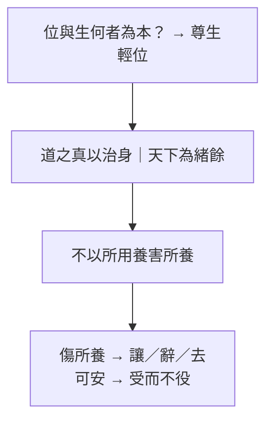

# 讓王

> **閱讀提示**：本篇依通行本段落次序導讀。下文區分**原典**、**歷代注家**與**本書現代詮釋**。本篇文本性質爭議大，尤不可把每個故事角色的話直接標成「莊子主張」。

## 01. 篇名與背景

〈讓王〉以「讓」與「王」對舉：王位、天下、爵祿被一讓再讓，拒受者反覆申明——生命比權位更先、更重。篇名本身已標出主題：**把統治慾望從價值金字塔的頂端移開**。

本篇在雜篇中屬於「故事聯章」型：堯讓許由、子州支父、善卷，大王亶父去邠，以及原憲、曾子、顏闔、列子辭粟等，幾乎一則接一則。文學上像隱逸倫理的主題變奏；思想上則反覆敲打「尊生」。讀者若只尋找一句精鍊哲學命題，會失望；若把它讀成戰國至漢初道家傳統如何用敘事教導「不以天下易生」，則脈絡清楚。

> **原典位置**：雜篇・第28篇・〈讓王〉。

## 02. 成書背景

近現代莊學研究多指出：〈讓王〉、〈盜跖〉、〈說劍〉、〈漁父〉四篇，文體、詞彙與內篇差異較顯，或為較晚編入的道家（乃至雜纂）材料。**本書採謹慎立場：不把本篇逕稱為莊周本人政論，而視為莊學傳統後續的「貴生／讓國」敘事彙編。** 其價值在思想史與倫理想像，不在為莊周「認證」每一句話。

材料所反映的焦慮很具體：在征伐與封賞頻繁的時代，士人如何拒絕「以身殉天下／殉名」的召喚？讓國故事提供一種極端示範——連天下都可以不要，何況爵祿。這種極端性正是文類特徵，讀時宜當寓言化倫理實驗，而非制度藍圖。引文據郭慶藩《莊子集釋》通行系統；文字異同另參校勘。

## 03. 結構分析

開篇多組「讓天下而不受」，確立「治身優先於治國、治天下」的價值序；中段轉入大王亶父避狄、窮士安貧、孔子陳蔡之厄等，把「尊生」從王位場面拉到流亡、疾病、飢寒；末段常以辭聘、辭粟收束，顯示「不取」同樣需要勇氣。

### 結構圖

```text
堯／舜讓天下 → 許由、子州支父、善卷拒受
        ↓
口號化命題：道之真以治身……土苴以治天下
        ↓
大王亶父去邠（土地可棄，人民與生為重）
        ↓
原憲、曾子、顏闔等安貧／辭祿
        ↓
尊生：不以爵祿、天下易生
```

全篇是「主題反覆」而非層層推理：同一價值（生重於位）在不同身分（天子候選人、國君、貧士）上重奏。讀法應抓變奏差異，避免每一則都摘要成同一句「不要當官」。

## 04. 原典

> **版本依據**：郭慶藩《莊子集釋》所據通行本；以下擇錄關鍵句，非全篇逐字抄錄。

> 堯以天下讓許由，許由不受。……道之真以治身，其緒餘以為國家，其土苴以治天下。由此觀之，帝王之功，聖人之餘事也，非所以完身養生也。

> 大王亶父居邠，狄人攻之。……不以所用養害所養。……因杖筴而去之。民相連而從之，遂成國於岐山之下。

> 原憲居魯，環堵之室，茨以生草……子貢乘大馬……原憲華冠縰履，杖藜而應門。……「憲聞之，無財謂之貧，學而不能行謂之病。今憲貧也，非病也。」

> 曾子居衛，縕袍無表，顏色腫噲，手足胼胝。……三日不舉火，十年不製衣。……天子不得臣，諸侯不得友。

> 顏闔為魯君使齊，孔子曰：「子之仕也，為君乎？為民乎？……今子之仕，人危之，子危之，子將安歸？」

> 列子行食於道，見有餓者，仰而視之。……子列子之辭粟也，為見善而驚，為見善而驚，是內誠而外發者也。

上引三組不宜拆散：第一組給出價值排序（身／國／天下）；第二組把「所用養」與「所養」分開——土地是養人之具，不可反過來傷害被養的人；第三組以貧困形象對抗「病在不行」的自我欺騙，顯示尊生不是享樂，而是拒絕用身分羞辱填補生命。顏闔段則把「仕」的動機拆成「為君」還是「為民」，逼問出仕是否把自己與他人同時置入危局。列子辭粟段則反轉：不是「清高拒絕一切」，而是「見善而驚」——內心仍有真誠反應，才配談不取；假裝不動心反而是另一種病。

## 05. 白話翻譯

堯要把天下讓給許由，許由不接受。篇中因而申明：道真正切要的部分用來安頓自身；多餘的一點點才拿去治理國家；剩下的糟粕才去治理天下。照此看來，帝王功業只是聖人的餘事，並不是用來保全身體、養護生命的正道。

大王亶父住在邠地，狄人來侵。他不願為了養人的土地，去傷害被養的人民與生命，於是拄著杖離開；百姓相連跟隨，後來在岐山之下另成一國。重點不在「搬家成功」，而在他分得清：工具（土地、財用）不能壓過目的（人的生存）。

原憲住在簡陋的屋子裡，子貢車馬鮮麗來訪。原憲說：沒有錢叫做貧；學了卻做不到才叫做病。我是貧，不是病。曾子在衛，衣袍破舊、形容憔悴，卻仍呈現「天子不得臣，諸侯不得友」的不可徵用性。兩則都在改寫貧窮的意義：匱乏可以是條件，屈從才是病。

## 06. 字詞註解

| 字詞 | 釋義 | 本篇閱讀提示 |
|---|---|---|
| 讓王 | 辭讓王位／天下 | 篇名主題；「讓」是倫理姿態，未必是史料 |
| 尊生 | 以生命為尊 | 本篇主軸；不同於縱欲式貴生 |
| 緒餘 | 剩餘、餘緒 | 治國相對治身而言只是剩餘 |
| 土苴 | 糟粕、渣滓 | 治天下在價值序上更邊緣 |
| 完身養生 | 保全身體、養護生命 | 「帝王之功」被明確排除在此目的之外 |
| 所用養／所養 | 用來養生之具／被養者 | 大王亶父段的概念核心 |
| 貧／病 | 無財 vs 學而不能行 | 原憲用來翻轉羞辱性目光 |
| 天子不得臣 | 不可被天子納為臣屬 | 曾子形象的「不可徵用」 |
| 辭粟／辭聘 | 拒絕糧食資助或聘任 | 「不取」與「讓位」同屬拒斥外物主宰 |
| 岐山 | 亶父遷居之地 | 敘事結果；重點仍在抉擇理由 |

## 07. 段落解析


**走讀路線**：讓國故事群 → 守真拒位 → 名不如生。

### 第一層：為何連綴那麼多「讓天下」？

重複不是無話可說，而是文類需要：要把「天下可讓」說到令人震驚，才能動搖「得天下＝最高成就」的預設。許由、善卷等名字像一組符號，功能接近母題變奏，不宜逐一做人物年表考證。

### 第二層：為何插入大王亶父？

若只有隱士拒位，讀者易以為本篇教人逃離責任。亶父一段保留「為民」的關切：他不是拋下百姓，而是拒絕用戰爭與土地拜物教傷害所養之人。尊生在此與保民發生聯繫——這是本篇少數直接碰觸統治倫理的地方。

### 第三層：貧士故事如何收束主題？

王位場面結束後，鏡頭對準環堵之室與縕袍，避免讀者以為尊生只屬於「有資格讓天下」的人。原憲的「貧／病」之辨、曾子的不可臣友，把問題轉成：在日常權力關係裡，你是否仍能不被祿位定義？這才是多數讀者真正會碰到的「讓」。

### 第四層：顏闔、列子段落在說什麼？

顏闔故事把隱逸倫理從「不當王」推進到「不當危臣」：出仕若只為君、不為民，則君危己危，無所歸。列子辭粟則校正「拒絕」的動機——若內心仍被善惡驚動，那是誠；若刻意表演不動，則是另一種求名。兩段補足本篇：尊生不是一律逃離，而是看清**為誰、為何、以什麼代價**在取或捨。

### 與〈逍遙遊〉許由線的關係

[許由](content/figures/許由.md)洗耳、拒堯天下是內篇經典場景；〈讓王〉幾乎把這條線擴寫成專輯。對讀時可問：內篇的許由與雜篇的善卷、子州支父，語氣是否一致？內篇較含蓄，雜篇較極端——這正是文本層次差異的教學案例。

## 08. 歷代注家怎麼看

**郭象**多以「各安其分」讀讓國：能讓者有能讓之性，居位者亦可適性而治，不必人人逃堯舜。此解緩和了文本的絕決，使〈讓王〉不致讀成全面反政治；但也可能把「土苴以治天下」的尖銳排序抹平。

**成玄英**疏「道之真以治身」一路推向修養先於外王，強調殘生傷性之不可。其唐代語境常把「養生」講得更工夫化；讀者應分辨：原文的「尊生」首先是價值排序與敘事倫理，不一定等於後來道教內養術。

**林希逸**提醒本篇「多是設辭」，人物有無不必死摳，要看「輕天下而重性命」之意。此見與現代文本批判可合流：把〈讓王〉當思想史材料，而不是莊周年譜附件。

## 09. 哲學分析

> 以下為**本書現代詮釋**。

〈讓王〉的哲學貢獻，不在提出比內篇更細緻的形上學，而在把「無用之用」「保身」等線索，改寫成一套**極端的價值序示範**：身＞國＞天下。它用敘事強迫讀者看見——許多被歌頌的「大事業」，預設了人以自身為燃料。

必須同時標出限度：作為後出色彩濃的材料，它有時把隱逸道德寫得過滿，接近「拒位即善」的簡化。與〈人間世〉相比，後者更痛苦地承認人必須在權縫中說話；〈讓王〉則常以拒絕為完整答案。故現代詮釋宜取「尊生」之醒覺，而慎取其「一律讓掉」的敘事解決。

「所用養害所養」是本篇最可普遍化的命題：手段顛倒為目的時，生命就被工具化。這比「大家都去當隱士」更經得起跨時代討論。與[名與利](content/themes/名與利.md)主題條目連讀：全書從〈逍遙遊〉的無功無名、〈人間世〉的「名」之危險，到本篇的「土苴以治天下」，可見「輕位」不是一次性的姿態，而是反覆被不同文體重奏的問題。

## 10. 與老子比較

《老子》言「名與身孰親？身與貨孰多？」「貴以身為天下，若可寄天下」。與〈讓王〉的尊生、輕位高度同調，甚至可說本篇是把老子式貴身命題故事化、戲劇化。

差異在文體與政治想像：老子仍常以「聖人治」的口吻說話；〈讓王〉大量寫「根本不接受治權」。若說老子是節制統治慾，本篇常是拒斥統治位——後者更絕，也更像隱逸文學的擴大。

## 11. 與儒家比較

儒家亦有「堯舜禪讓」敘事，但重點多在傳賢與公天下；〈讓王〉的重點卻在「不受」。原憲、曾子在儒家傳統本是德行典範，本篇借其貧而有守的形象，轉向「不可臣」的貴生論，等於改寫儒家人物的意義重心。

爭點不在「該不該有責任」，而在「責任是否可以合法地要求人犧牲生命與尊嚴」。儒家傾向在秩序中完成人格；本篇擔心秩序以「天下」之名吞噬人身。兩者可互為警戒，不宜單向取消。

## 12. 與佛學比較

讓國安貧、尊生，後世或以少欲、放下比附。本篇是名不如生的故事群：王位可讓，生命不可拿去換。

尊生、完身，屬戰國道家敘事；出離與菩薩道是另一套結構，並讀時分開即可。


## 13. 現代人生應用

> 以下為**本書現代詮釋**。

### 13.1 當「更大的職稱／舞台」伸手來邀時

先排價值序，再談榮譽：這份位置要佔用的睡眠、親密關係、健康與判斷力，是否已超過它能成就的「緒餘」意義？〈讓王〉不是叫你必然拒絕，而是叫你承認——**若連「可以拒絕」的想像都沒有，你已被王位敘事綁架。**

### 13.2 組織用「大局／使命」要求過度犧牲時

借用亶父句式檢查：我們正在用什麼「所用養」（業績、品牌、市場）傷害「所養」（員工、學生、家人、自己的身體）？若工具反噬目的，所謂忠誠已接近殘生。

### 13.3 經濟條件不佳、又被成功學羞辱時

回扣原憲「貧／病」之辨：物質匱乏需要務實改善；但把「還沒賺到」等同「人格病態」，是另一種傷生。可分開兩件事——理財行動與自我羞辱，不讓後者冒充前者。

### 13.4 面對「不接受資助／不掛名」的抉擇時

曾子式的「不得臣、不得友」在現代可轉讀為：有些資源附帶被徵用、被代表、被站隊。拒絕不一定清高，也可能是在保護自己還能誠實說話的位置。關鍵是看清交換條件，而不是表演清貧。

## 14. 常見誤解

1. **「篇中每個故事都是莊周親筆，代表莊子政治主張。」**  
   文本層次有爭議；宜作後出道家材料謹慎閱讀。

2. **「尊生＝苟活、恐懼責任。」**  
   本篇尊生常與不辱、不殘、不顛倒手段目的相連，不是膽小的別名。

3. **「讓王就是反政府、反一切公共事務。」**  
   亶父段仍關切人民；批判的是以天下之名害生，不是取消共同生活。

4. **「安貧被歌頌，所以不該改善生活。」**  
   原憲之貧是對照「病在不行」；重點在不被祿位定義，而非崇拜貧窮。

5. **「能讓位的人才有道德。」**  
   敘事極端化是文類需要；日常倫理更常落在如何拒絕傷生的交換，而非人人有王位可讓。

## 15. 本篇總結

〈讓王〉以一連串讓國、去邠、安貧、辭祿的故事，反覆演練「道之真以治身，其緒餘以為國家，其土苴以治天下」的價值序，並以「不以所用養害所養」點出手段與目的的顛倒危機。作為可能偏晚的道家彙編，它不宜被誇大為莊周本人的制度方案，卻仍尖銳地質問：你的「大事業」是否正在消耗你的生？

若以一句話收束：**先能護住可活、可尊的生命，其餘功業才談得上是餘事，而不是獻祭。**

## 16. 心智圖




## 17. 延伸閱讀

### 原典與注疏

- 郭慶藩《莊子集釋》〈讓王〉
- 王先謙《莊子集解》〈讓王〉
- 成玄英《南華真經注疏》〈讓王〉
- 林希逸《莊子口義》〈讓王〉

### 今注今譯與研究

- 陳鼓應《莊子今註今譯》〈讓王〉（及其對雜篇真偽的說明）
- 關於〈讓王〉〈盜跖〉〈說劍〉〈漁父〉成篇年代的討論（劉笑敢等）
- 王邦雄等現代解讀中涉及貴生、隱逸的章節

### 本專案內交叉引用

- 相關篇章：〈逍遙遊〉、〈人間世〉、〈養生主〉、〈盜跖〉、〈漁父〉
- 相關人物：[許由](content/figures/許由.md)、[堯](content/figures/堯.md)、[列禦寇](content/figures/列禦寇.md)、原憲、曾子、顏闔
- 相關名詞：尊生、[性命之情](content/terms/性命之情.md)、[無用之用](content/terms/無用之用.md)、[無為](content/terms/無為.md)
- 相關主題：[名與利](content/themes/名與利.md)、[政治與無為](content/themes/政治與無為.md)
