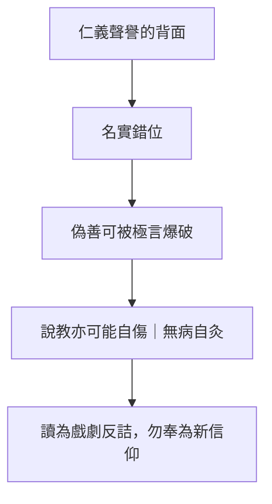

# 盜跖

> **閱讀提示**：本篇是高度戲劇化、言語誇張的辯難體。下文區分**原典**、**歷代注家**與**本書現代詮釋**。盜跖的話是文學上的「反面極言」，**不可直接當成作者頒布的人生守則**。

## 01. 篇名與背景

〈盜跖〉以盜賊之名為篇題，一開始就把讀者拋進道德顛倒的場景：最被禮教貶斥的人物，反而坐在主審席上；最被尊崇的孔子形象，變成被怒斥、被譏笑、狼狽而退的說客。篇名本身已是挑釁——它逼問「名」到底由誰定義。

本篇在雜篇中以「對決結構」著稱：幾乎全程是對話與斥罵，少有內篇式的層層遞進。其力量來自修辭的極端：歷數聖王不得好死、譏刺伯夷叔齊、嘲弄孔子「無病自灸」。讀它，先要承認這是**諷刺劇／抗辯詞**，不是平實史傳，也不是溫和的修養手冊。

> **原典位置**：雜篇・第29篇・〈盜跖〉。

## 02. 成書背景

學界多將〈盜跖〉與〈讓王〉〈說劍〉〈漁父〉並列，視為風格偏晚、論辯色彩濃的作品：詞彙急切、情節誇張、對儒家名教的攻擊遠比內篇外露。它可能反映戰國末至漢初某些道家（或反名教）論者的心情——對「仁義」被權力徵用極度不信任。

因此閱讀策略應是雙層的：一層聽盜跖如何拆穿「以名飾暴」；另一層保持文類警戒——**角色勝利≠命題真理**。把盜跖每一句都實踐為生活方式，會從批判偽善滑向為殘暴開脫。引文據郭慶藩《莊子集釋》通行系統。

## 03. 結構分析

篇首交代孔子與柳下季為友，欲往說盜跖；柳下季勸阻，孔子仍去。中段是盜跖大怒設席、痛斥「巧偽人」，歷數黃帝至周文王之戰伐與名士之慘死，並抨擊矯情的廉潔與聲譽。末段孔子色變、無言而退，柳下季以「無病而自灸」「料虎頭、編虎鬚」收束。

### 結構圖

```text
孔子欲化盜跖（名教自信）
        ↓
柳下季勸阻（知不可）
        ↓
盜跖怒斥：仁義／聖王／名士皆虛
        ↓
誇飾枚舉：戰伐、刑戮、餓死、毀名
        ↓
孔子狼狽退場
        ↓
「無病自灸」：干預錯位的諷刺
```

結構像一場單向壓倒的審判。作者幾乎不給孔子對等的理論反擊，這正是文類選擇：要讓「名教說教」在暴力與慾望的現實前失語。讀者的工作不是選邊站成盜賊，而是看見失語暴露了什麼問題。

## 04. 原典

> **版本依據**：郭慶藩《莊子集釋》所據通行本；以下擇錄關鍵句，非全篇逐字抄錄。

> 孔子與柳下季為友，柳下季之弟名曰盜跖。盜跖從卒九千人，橫行天下，侵暴諸侯。……孔子謂柳下季曰：「……丘請往說之。」

> 盜跖大怒，兩展其足，案劍瞋目聲如乳虎，曰：「丘來前！……爾作言造語，妄稱文、武……妄作孝弟而僥倖於封侯富貴者也。子之罪大極重，疾走歸！不然，我將以子肝益晝餔之膳！」

> 世之所高，莫若黃帝……湯放其主，武王殺紂。自是之後，以強凌弱，以眾暴寡。湯、武以來，皆亂人之徒也。

> 丘所謂無病而自灸也，疾走料虎頭，編虎鬚，幾不免虎口哉！

> 盜跖乃方休倚大杖，枕股而寢，弟子請起。盜跖仰目而視曰：「夫避己之所不肖，而強以名聲蓋之，此士之所苦也。」

> 孔子再拜趨走，出門上車，執轡三失，目芒然無見，色若死灰，據軾瞑目，不復得食。

上引顯示三種修辭暴力：人身威脅、歷史翻案、成語式譏刺。其尖銳處不在歷史考證是否精準，而在追問——若「世之所高」的聖王敘事充滿征伐，仁義之言是否可能成為粉飾？末句「無病自灸」則把箭頭轉回說教者：你不是在救人，而是在把自己送進虎口並製造新的表演。中引「避己之所不肖，而強以名聲蓋之」則點出**名聲補償**：人常借道德名號遮掩內在的不肖——這與〈人間世〉「德蕩乎名」、[孔子](content/figures/孔子.md)在多篇中被寫成「為名所役」的形象可連讀。末引孔子退場的身體描寫（執轡三失、色若死灰）不是滑稽小品，而是讓讀者看見：當話語失效，身體會先崩潰——名教自信在此刻變成可見的創傷。

## 05. 白話翻譯

孔子與柳下季是朋友；柳下季的弟弟叫盜跖，帶著大批人馬橫行侵暴。孔子仍要去勸說他。盜跖大怒，瞪眼按劍，罵孔子編造文武之言、假借孝悌求取富貴，喝令快走，否則要把他的肝當下酒菜。

接著盜跖翻轉「世人所推崇」的名單：從黃帝以下，征伐不斷；湯放逐其主，武王殺紂——既然如此，後世以強凌弱、以眾暴寡，不過是一脈相承。他並攻擊那些為名而死、為廉而枯的人：聲譽常常是另一種貪欲。

孔子嚇得臉色大變，退回去。柳下季說：這真是沒病卻給自己艾灸——跑去摸老虎頭、編老虎鬍鬚，差點送進虎口。白話意思是：你把干預當成美德，卻誤判對象與情勢，幾乎害死自己，也沒改變對方。

## 06. 字詞註解

| 字詞 | 釋義 | 本篇閱讀提示 |
|---|---|---|
| 盜跖 | 傳說中的大盜；篇中角色 | 文學符號，勿當信史人物傳 |
| 柳下季 | 柳下惠；篇中為勸阻者 | 代表「知其不可」的清醒 |
| 巧偽人 | 巧言矯飾之人 | 盜跖對孔子式說教的定性 |
| 妄稱文、武 | 假借文王、武王名義 | 攻擊「以古聖話語授權自己」 |
| 世之所高 | 世人最推崇者 | 翻案修辭的起點 |
| 以強凌弱 | 強者欺凌弱者 | 把聖王敘事連到暴力結構 |
| 無病而自灸 | 沒病卻灼艾自虐 | 譏不當干預、自我表演式道德 |
| 料虎頭、編虎鬚 | 撩弄猛虎 | 形容不自量力的勸說 |
| 橫行天下 | 肆意往來侵暴 | 開篇即確立暴力現實 |
| 名 | 名聲、令譽 | 本篇核心靶子：名如何遮掩與傷生 |

## 07. 段落解析


**走讀路線**：往說暴者 → 極言反詰 → 名實錯位。讀時記：**抗辯文體，非教條**。

### 第一層：為何讓孔子先「請往說之」？

開場必須建立名教的自信：以為言語可以化暴。沒有這份自信，後面的崩盤就沒有戲劇性。柳下季的勸阻則預告失敗——作者並不假裝這是勢均力敵的辯論賽。

### 第二層：盜跖的歷史枚舉在做什麼？

它用「極端取樣」攻擊神聖譜系：只要聖王敘事裡找得到征伐與弒放，仁義的純潔性就受質疑。這是修辭策略，不是嚴謹史學。段落功能是逼「名」與「實」對質：你們歌頌的秩序，是否建基在你不願直視的暴力上？

### 第三層：為何以「無病自灸」收束？

若停在盜跖勝訴，文本易被讀成「為盜張目」。末段把焦點轉到勸說者的自傷與錯位干預：問題不只是盜跖殘暴，也包括名教使者把「說教」本身當成功績。雙向諷刺，才是本篇較完整的落點。

### 第四層：孔子身體的退場

篇末不寫孔子「辯贏」或「悟道」，而寫他失態、失食、失見——這是戲劇性的**身體否定**。與〈漁父〉中孔子被漁父訓誡、〈說劍〉中趙文王吃不下飯，形成雜篇後段的「聖人形象鬆動」系列。讀者宜把[孔子](content/figures/孔子.md)當寓言裝置，看見話語與權力關係的裂縫，而非做傳記考據。

### 與〈胠篋〉、〈讓王〉的對讀

〈胠篋〉言「聖人不死，大盜不止」；〈盜跖〉則讓大盜親口罵聖王。〈讓王〉尊生而輕位；〈盜跖〉則懷疑「位」與「名」背後的暴力。三篇可串成雜篇對政治—道德敘事的批判線，但語氣與文類各異，不宜混為一談。

## 08. 歷代注家怎麼看

**郭象**面對此篇往往強調「各極一偏」：盜跖之言有激射名教虛偽之功，卻不可執為正道。這種讀法試圖挽救文本，使它不致淪為教人為惡的手冊——與現代「文類警戒」相近。

**成玄英**疏解時仍常以「寄言」說明：借盜跖之口，破貪名矯行。他承認語句猛厲，但把宗旨拉回「去偽」。讀者須注意：疏家的「破偽」是詮釋收編，未必等於原敘事的全部能量；原敘事確實更暴烈、更不留餘地。

**林希逸**一再提醒「此皆寓言」，人物對話不必核對春秋史實。對本篇尤其重要：若把盜跖當史料，會在歷史考證裡迷失；若當抗辯文體，才能看見它對「聲譽經濟」的攻擊。

## 09. 哲學分析

> 以下為**本書現代詮釋**。

〈盜跖〉最有哲學效力的一擊是：**名譽與仁義可以成為慾望的高級偽裝。** 當人追逐「被稱為善」，善就可能轉成可交易、可炫耀、可動員群眾的符號；而符號一旦脫離對生命與弱者的實際後果，便接近盜跖所罵的「巧偽」。

但本篇同時示範「反駁的限度」。以暴制名、以極言推翻一切規範，可以摧毀虛偽，也可以摧毀共同生活所需的起碼約束。故詮釋上應採「解毒劑」模型：劑量用於中和名教毒物，過量則自身成毒。這與〈齊物論〉反省是非、〈人間世〉反省「德蕩乎名」可對讀，惟本篇用的是怒吼而非分析。

「無病自灸」則提出干預倫理：動機良善不足以證明行動恰當；錯估對象、把勸說當自我完成，會製造新的傷害。與[名與利](content/themes/名與利.md)、[語言與真實](content/themes/語言與真實.md)主題可橫向連讀：全書對「名」的警惕，從內篇〈人間世〉到雜篇〈盜跖〉、〈漁父〉，強度遞增但問題域一脈相承。

## 10. 與老子比較

《老子》批評「大道廢，有仁義」「失德而後仁」，對仁義後起、作為衰世標籤的看法，與盜跖抨擊巧偽有家族相似性。但老子的語氣是凝鍊諷喻，常歸向無為、少私；〈盜跖〉則讓暴力主角以恐嚇與翻案發言，倫理餘地更窄。

不宜說「盜跖＝老子」。老子仍構想聖人治身治國的可能；本篇幾乎讓名教場景崩盤，只留下譏刺的煙塵。同處在疑仁義之工具化，異處在建設性方案的有無。

## 11. 與儒家比較

本篇是《莊子》中對儒家形象最不客氣的文本之一：孔子被寫成既冒險又無效的說客，聖王譜系被寫成亂源。它擊中的真實問題是——儒者若只販賣話術與聲望，而不處理權力與民生的殘酷，確實會變成「巧偽」。

儒家可以反問：沒有仁義名教，橫行侵暴如何被指認為惡？這正是本篇留下的張力。比較的收穫不是宣布誰贏，而是承認：**批判偽善，與放棄一切規範，中間還有漫長的路**；〈盜跖〉只走了前半段的爆破。

## 12. 與佛學比較

盜跖罵聖，有人聯想破執、呵佛罵祖。本篇是戲劇體的名教爆破：角色勝利≠命題真理。

讀時帶文類說明書——怒氣綁在戰國暴力與聲譽經濟，不是機鋒開悟的劇本。


## 13. 現代人生應用

> 以下為**本書現代詮釋**。

### 13.1 看見「道德品牌」正在變現時

當個人或機構把慈善、理念、文化口號做成流量與權勢的通行證，可借用本篇的懷疑：這套語言實際保護了誰、傷害了誰？懷疑不是犬儒，而是要求名與後果對帳。

### 13.2 想去「感化」明顯不吃這套的對象時

先做柳下季式評估：對方的慾望結構與力量關係，是否允許說教進入？若場面更像虎須，你的前往可能主要滿足「我有行動」的自我形象——這正是「無病自灸」。改找可行的制度途徑，往往比獨行勸說更負責。

### 13.3 閱讀極端控訴文、網路公審稿時

練習文類辨識：誇飾枚舉擅長打倒光環，不擅長建立替代方案。可吸收其對偽善的敏感，同時問：文章有沒有把一切規範等同謊言？若有，你正在吞下一整瓶解毒劑。

### 13.4 自己靠「清譽」過活時（教師、NGO、公眾發言者）

定期檢查：我是否更在意被稱為正直，而非減少實際傷害？〈盜跖〉對「僥倖於封侯富貴」的嘲諷，可轉讀為對「道德資本」的自覺——清譽若成新的貪欲，批判別人虛偽之前先審查自己。

## 14. 常見誤解

1. **「盜跖說得痛快，所以作者支持偷搶殺掠。」**  
   文類是抗辯與諷刺；角色極言≠行為指南。

2. **「本篇證明儒家全假、仁義無用。」**  
   它攻擊的是被權力與名聲工具化的仁義表演，不能直接等同取消一切倫理。

3. **「孔子在篇中很蠢，所以歷史孔子如此。」**  
   人物是戲劇符號，用來測試名教話術的邊界。

4. **「既然名都虛偽，不如什麼都不信。」**  
   全面不信只是另一種偷懶；本篇較有價值的是追問名實錯位。

5. **「無病自灸＝不要幫助任何人。」**  
   它反對的是錯位、表演式、不自量力的干預，不是反對一切救助。

## 15. 本篇總結

〈盜跖〉以誇飾辯難讓「盜」審「聖」，把仁義、聖王與名士的聲譽經濟逼到牆角，並以「無病而自灸」「料虎頭、編虎鬚」回刺說教者的自傷式道德。作為雜篇戲劇體，它必須帶著文類說明書閱讀：其貢獻是爆破偽善，其風險是把爆破誤當成新的信仰。

若以一句話收束：**先別急著崇拜罵得最兇的人；先看被罵的「名」是否真的在遮掩傷害——以及罵本身是否又在製造新的傷害。**

## 16. 心智圖




## 17. 延伸閱讀

### 原典與注疏

- 郭慶藩《莊子集釋》〈盜跖〉
- 王先謙《莊子集解》〈盜跖〉
- 成玄英《南華真經注疏》〈盜跖〉
- 林希逸《莊子口義》〈盜跖〉

### 今注今譯與研究

- 陳鼓應《莊子今註今譯》〈盜跖〉及雜篇討論
- 關於〈盜跖〉文體、成篇年代與「反儒」強度的研究
- 比較閱讀：〈人間世〉「德蕩乎名」、〈外物〉言意問題

### 本專案內交叉引用

- 相關篇章：〈人間世〉、〈胠篋〉、〈讓王〉、〈漁父〉、〈列御寇〉
- 相關人物：[孔子](content/figures/孔子.md)、[盜跖](content/figures/盜跖.md)、柳下季
- 相關名詞：名、仁義、巧偽、[無為](content/terms/無為.md)
- 相關主題：[名與利](content/themes/名與利.md)、[語言與真實](content/themes/語言與真實.md)、[政治與無為](content/themes/政治與無為.md)
