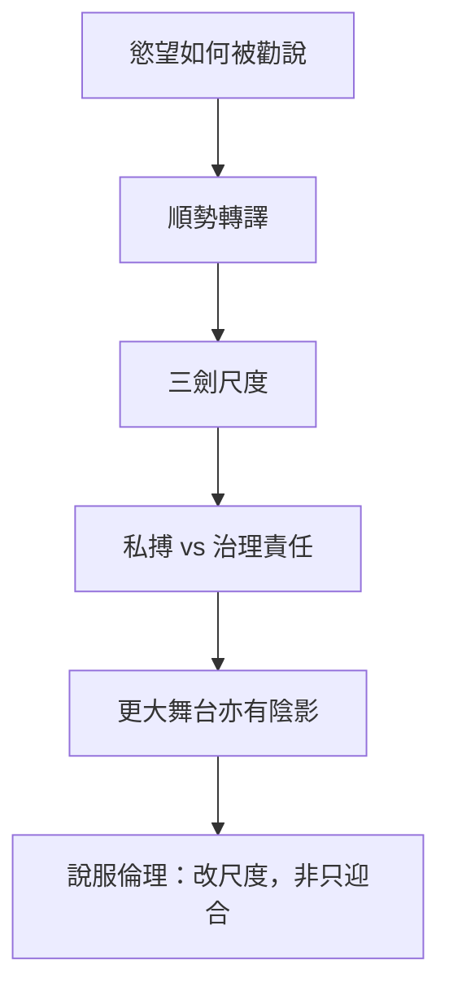

# 說劍

> **閱讀提示**：本篇依通行本敘事導讀。下文區分**原典**、**歷代注家**與**本書現代詮釋**。篇中「莊子說劍」是文學場景，讀者應同時注意其游說修辭，不宜當成莊周行跡的實錄。

## 01. 篇名與背景

〈說劍〉的「說」是遊說、陳說；「劍」是趙文王沉迷的對象。篇名合起來，就是一場**圍繞嗜好展開的政治轉譯**：不正面禁止君主玩劍，而把「劍」重新定義成三種層級的治理隱喻。

在雜篇裡，本篇文體接近縱橫家辭令：鋪陳華麗、層次分明、以對方慾望為接口。它與內篇哲學散文距離明顯，卻也因此特別適合觀察——莊學傳統進入宮廷勸說場合時，會長成什麼樣子。核心戲劇動作只有一個：讓好劍之君，聽見「天子之劍」比「庶人之劍」更大。

> **原典位置**：雜篇・第30篇・〈說劍〉。

## 02. 成書背景

〈說劍〉常與〈讓王〉〈盜跖〉〈漁父〉同被視為偏晚或風格異質的篇章：情節完整如短篇小說，論點靠排比譬喻推進，較少內篇那種概念翻轉的密度。它可能出自嫻熟宮廷語言的道家後學之手，把「無用之用／無為」改裝成君主聽得懂的「劍論」。

戰國趙地武風與劍客文化，為故事提供現實底色：君主若以私鬥之勇為樂，國力與政治注意力會被吸進血腥娛樂。本篇的諷刺對象，正是這種**把殺戮當嗜好、把嗜好當政治**的錯位。引文據郭慶藩《莊子集釋》通行系統；人名、稱謂異文（趙文王／趙惠文王等）以通行讀法說明大意即可。

## 03. 結構分析

開端寫趙文王喜劍，劍士日夜相擊，死傷相繼；太子患之，以厚幣請莊子。莊子入見，不立刻罵「嗜殺」，而宣稱己亦有三劍。隨後依序陳說天子之劍、諸侯之劍、庶人之劍：前二者以天地、山河、諸侯、四時為喻，導向御天下／治一國；庶人之劍則是蓬頭突鬢、相擊於前的私鬥。文王聞罷，疏遠劍士，三月不出。

### 結構圖

```text
好劍之君 ← 劍士相擊、死傷相屬
        ↓
厚幣請「莊子」入說
        ↓
不直諫，而獻「三劍」框架
        ↓
天子之劍（山河四時／御天下）
諸侯之劍（銳士／一國之威）
庶人之劍（私鬥嗜殺）
        ↓
慾望被重新分級 → 止劍士
```

關鍵技法是「順勢抬升」：先承認對方愛劍，再把劍的意義升級，使原來的嗜好自動掉到最低層。這是勸說術，也是政治諷喻的結構。

## 04. 原典

> **版本依據**：郭慶藩《莊子集釋》所據通行本；以下擇錄關鍵句，非全篇逐字抄錄。

> 昔趙文王喜劍，劍士夾門而客三千餘人，日夜相擊於前，死傷者歲百餘人，好之不厭。

> 太子曰：「……夫子必肯，臣請奉千金。」莊子曰：「……臣有三劍，唯王所用，請先言而後試。」

> 天子之劍，以燕谿石城為鋒，齊岱為鍔……此劍一用，匡諸侯，天下服矣。……諸侯之劍……此劍一用，如雷霆之震也……庶人之劍，蓬頭突鬢垂冠……相擊於前，上斬頸領，下決肝肺……無異於鬥雞，一旦命已絕矣，無所用於國事。

> 王乃牽而上殿。宰人上食，王三環之。莊子曰：「大王安坐定氣，劍事已畢奏矣！」於是文王不出宮三月，劍士皆服斃其處也。

> 諸侯之劍：以知士為鋒，以道德為刃，以賢為脊，以忠為夾，以豪傑為環。此劍一用，如雷霆之震也，四方莫不賓，在內則治民，在外則伐敵，此諸侯之劍也。

上引須連看「喜之不厭」與「無所用於國事」：前者是慾望沉溺，後者是政治審判。三劍不是兵器分類學，而是把君主的注意力從「誰殺得過誰」拖到「你到底在用哪一種力量治理」。諸侯之劍段補上中間層：仍以「劍」為喻，但已把賢士、道德、忠義編入劍身——這是遊說術的「漸進抬升」，讓君主覺得自己若只玩庶人劍，就配不上諸侯乃至天子的自我形象。結局「不出宮三月」與「劍士服斃其處」則示範：改變嗜好型暴力的關鍵，往往是**撤走權力的注視與供養結構**，而不只是聽了一堂好課。

## 05. 白話翻譯

從前趙文王愛好劍術，門下聚集大批劍士，日夜在面前相擊，一年死傷上百人，他卻愛好不厭。太子憂心，用重金請莊子去勸。莊子說：我也有三把劍，請讓王挑選；不過請允許我先說明，再談試劍。

天子之劍，以廣大山川為鋒鍔，用起來足以匡正諸侯、使天下歸服。諸侯之劍，像雷霆震懾一方，用於一國之威。至於庶人之劍，不過蓬頭突鬢的人在眼前互砍，上斬頸項、下穿肝肺，跟鬥雞無異，轉眼喪命，對國事毫無用處。

文王聽完，神色改觀，環繞走了幾圈，吃不下飯。莊子說：請王安坐定氣，劍的事我已經奏完了。於是文王三個月不願出宮耽於劍事，劍士們也在原來的位置上頹廢失意。故事的重點是：慾望被更高層的意義「收編」之後，低層嗜好失去光澤。

## 06. 字詞註解

| 字詞 | 釋義 | 本篇閱讀提示 |
|---|---|---|
| 說劍 | 以言辭陳說「劍」之義 | 「說」是遊說，不只是談論兵器 |
| 劍士 | 以擊劍搏殺為業／為樂者 | 象徵被嗜好豢養的暴力群體 |
| 三劍 | 天子／諸侯／庶人三等劍喻 | 核心修辭裝置；非實劍目錄 |
| 天子之劍 | 以天下山川四時為喻之劍 | 把殺伐慾望轉成「御天下」的想像 |
| 諸侯之劍 | 一國威懾之劍 | 中間層：仍是力，但被納入邦國 |
| 庶人之劍 | 私鬥相擊之劍 | 被貶為鬥雞式娛樂 |
| 匡諸侯 | 匡正諸侯 | 天子之劍的政治效果宣稱 |
| 鬥雞 | 以雞相鬥為戲 | 庶人劍的貶義類比 |
| 先言而後試 | 先講清楚再比試 | 用語言取代血腥表演 |
| 定氣 | 安定氣息／情緒 | 勸說完成後對君主身心的收束 |

## 07. 段落解析


**走讀路線**：庶人劍 → 天子劍 → 好劍之君疏劍士。關鍵句：**轉譯嗜好**。

### 第一層：為何先寫死傷「好之不厭」？

開篇必須讓嗜好的代價可見，否則後面的層級升級沒有道德重量。死傷數字不是統計報告，而是諷刺：君王的娛樂帳單用人命支付。

### 第二層：為何不直諫「請停劍」？

在喜劍之君面前，直諫等於否定其快感來源，易觸怒而失敗。〈說劍〉選擇進入對方的慾望語言，再改寫詞彙表——這與〈人間世〉「因」的處世智慧同族，但本篇更華麗、更宮廷。

### 第三層：結局「劍士服斃」說明什麼？

勸說成功的標誌，不是哲理被理解，而是供養結構崩解：君主不再提供目光與場域，劍士便無以自處。政治諷喻在此收束——**嗜好型暴力依賴權力的注視**；注視一撤，表演結束。這與當代「注意力經濟」中爭議內容的興衰，有結構上的類比：沒有平台與觀眾，表演性衝突難以持續。

### 第四層：與〈人間世〉「因」的勸說倫理

〈人間世〉教人「因其所安」；〈說劍〉則示範極端順勢：先承認王愛劍，再改寫劍的等級。兩篇都拒絕硬碰，但〈說劍〉更華麗、風險更高——「天子之劍」可能美化更大的征服。讀者應學其**轉碼技術**，同時警覺其**政治代價**。與[政治與無為](content/themes/政治與無為.md)主題連讀：全書對治道的想像，從內篇〈應帝王〉的渾沌，到外篇〈在宥〉，再到本篇的「劍論」，語氣愈發入世，也愈需讀者自帶批判距離。

## 08. 歷代注家怎麼看

**郭象**注此篇，常把三劍收向「各安其分」：天子有天子之事，庶人劍不足以幹國。他的讀法強調「用當其分」，使文本成為治術寓言，而不只是反武故事。

**成玄英**疏「庶人之劍……無異於鬥雞」，明白點出譏刺；疏天子之劍則鋪陳「以道御世」之意。唐代疏義有時把「道」講得更抽象，讀者可回扣原文的具體物象（山河、四時、雷霆），避免把排比修辭全數玄學化。

**林希逸**視為「策士之詞」，提醒文采勝於理境，與內篇不同。此評有助定位：本篇的貢獻主要在政治諷喻與勸說結構，不在形上新義；但「把慾望重新分級」仍是可抽取的思想動作。

## 09. 哲學分析

> 以下為**本書現代詮釋**。

〈說劍〉的哲學動作可以概括為：**慾望轉碼**——不消滅慾望，而改寫慾望對象的意義階層，使原本的沉溺在新尺度下顯得渺小。庶人劍被貶，天子劍被抬，中間藏著危險與智慧：智慧是讓人跳出私鬥快感；危險是「天子之劍」仍可能美化更大的征服。

因此本篇不宜讀成單純反戰和平主義。它對私鬥式暴力很嚴厲，對「以天下為劍」的宏大力量卻近乎讚頌——這更像把君主從娛樂性殺戮，勸回「嚴肅的統治力」。與〈逍遙遊〉的無待相比，這裡明顯更入世、更權謀。現代詮釋應標明：可學其「改寫尺度」的方法，須警覺其「更大的劍」仍可能傷生。

「先言而後試」也有認識論意味：先讓概念出場，再決定是否進入實作；語言可以中止不必要的流血表演。與〈外物〉「得意忘言」對讀：一篇談放下言器，一篇談先用言器止住暴力——看似相反，其實都關心**言與行的先後與分際**。

## 10. 與老子比較

《老子》言「兵者不祥之器」「天下有道，卻走馬以糞；天下無道，戎馬生於郊」，對兵器與戰爭持節制態度。〈說劍〉同樣厭惡無意義的血腥娛樂，但論證策略不同：老子減損兵事，本篇則把「劍」升級成治天下的象徵資本。

同處：反對為嗜好而殺。異處：老子更徹底地貶低兵；本篇允許「天子之劍」的宏大想像作為勸說代價。讀時宜分開「反鬥雞式殺戮」與「是否贊成帝國式威懾」。

## 11. 與儒家比較

儒家論政常正面陳說仁義、禮樂、民本；〈說劍〉幾乎不走這條路，而走「以彼之矛，改彼之盾」的遊說。它與孟子見梁惠王談「何必曰利」的場景可對照：都是入君門、轉話題；但孟子直接改主題，本篇則假裝繼續談劍。

儒家可能批評：把治國比作劍，仍保留暴力隱喻。莊學此篇可能回應：對一個只聽得懂劍的耳朵，你只能先從劍說起。比較的價值在勸說倫理——順從對方語言到何種程度，才不算共謀？

## 12. 與佛學比較

三劍分級，或被聯想金剛、慧劍。本篇是宮廷遊說：把嗜殺娛樂改寫成治天下的象徵資本，終使劍士失養。

劍是修辭裝置；先看庶人劍如何被貶，再談別家劍喻。


## 13. 現代人生應用

> 以下為**本書現代詮釋**。

### 13.1 主管沉迷「內部對決／零和競技」時

若團隊文化鼓勵互相砍殺式競爭，可嘗試〈說劍〉式分級：把榮耀從「贏過同事」抬到「共同完成對外人有用的事」。不是禁止競爭，而是讓庶人劍式互撕看起來像鬥雞。

### 13.2 自己有消耗性嗜好（包括資訊、爭辯、遊戲式憤怒）時

問：我的「劍士」是誰——哪些內容、社群、儀式每天在我面前相擊，讓我「好之不厭」？三劍框架可改寫為：這個嗜好對我真正要守護的生活層級，是天子級、諸侯級，還是庶人級的空轉？

### 13.3 必須勸說權力者、又不能直接頂撞時

學習「先言而後試」：先共同定義詞彙與層級，再談行動。直接說「你錯了」常失敗；先進入對方關心的符號，再改寫其高低，是本篇示範的險著——用時須自問有沒有把更大的暴力一起美化了。

### 13.4 文化產業或媒體靠「血腥／對立」取悅觀眾時

回扣劍士「夾門而客」：注意力經濟會豢養表演性衝突。撤走目光（不點讚、不演算法餵養）有時比道德說教更快讓「劍士服斃」。這是把結局段轉成公民媒體實踐。

### 與〈應帝王〉、〈在宥〉的治道對照

內篇〈應帝王〉以渾沌之死警告「好為人」；外篇〈在宥〉言「聞在宥天下，不聞治天下」。〈說劍〉則走另一條路：不直接談無為，而用君主聽得懂的「劍」重新分級。三篇可見莊學傳統對政治的不同語氣——從悲劇寓言、到制度批判、到宮廷遊說，讀者宜保持距離，擇其方法而不盲從其結論。

## 14. 常見誤解

1. **「篇中莊子真有其事，可當傳記。」**  
   敘事是文學遊說場景；人物行跡不可逕作史實。

2. **「本篇鼓吹天子用劍征服天下。」**  
   天子之劍是勸說用的升級譬喻；全文主要靶子是私鬥嗜殺。仍須警覺宏大暴力被美化的風險。

3. **「反對庶人劍＝反對所有武術或自衛。」**  
   譏刺的是作為國君娛樂、無用於國事的互砍文化。

4. **「會說話就能改變暴君。」**  
   故事是理想型成功案例；現實勸說受制度與個性限制，不可神話修辭。

5. **「風格像策士，所以沒有莊學意味。」**  
   文體異質不代表無可取：慾望轉碼與尺度重估，仍與莊學「換個角度看」的家族技巧相通。

## 15. 本篇總結

〈說劍〉寫趙文王好劍成癖，莊子以天子、諸侯、庶人三劍重新分級，把鬥雞式私搏貶下去，把治理尺度抬上來，終使君主疏遠劍士。作為偏宮廷辭令的雜篇作品，它示範如何順慾望而轉慾望，也留下「更大的劍」可能被歌頌的陰影。

若以一句話收束：**先別急著搶走別人手上的劍；先問他以為自己在耍的，究竟是哪一把——以及那一把到底配不配得上他真正的責任。**

## 16. 心智圖




## 17. 延伸閱讀

### 原典與注疏

- 郭慶藩《莊子集釋》〈說劍〉
- 王先謙《莊子集解》〈說劍〉
- 成玄英《南華真經注疏》〈說劍〉
- 林希逸《莊子口義》〈說劍〉

### 今注今譯與研究

- 陳鼓應《莊子今註今譯》〈說劍〉及雜篇真偽說明
- 關於〈說劍〉與縱橫遊說文體、成篇年代的討論
- 對讀：〈人間世〉言說之難、〈徐無鬼〉中與武技／政治相關段落

### 本專案內交叉引用

- 相關篇章：〈人間世〉、〈讓王〉、〈盜跖〉、〈漁父〉、〈徐無鬼〉
- 相關人物：[莊周](content/figures/莊周.md)、趙文王、太子
- 相關名詞：[無為](content/terms/無為.md)、[無用之用](content/terms/無用之用.md)
- 相關主題：[政治與無為](content/themes/政治與無為.md)、[工作與技道](content/themes/工作與技道.md)
