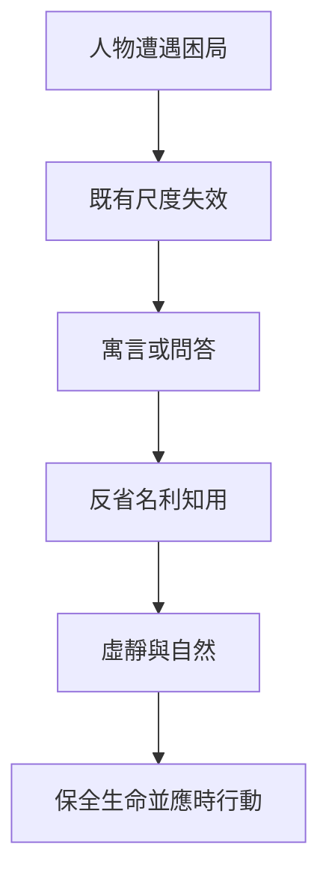

# 說劍

> **閱讀提示**：本篇依通行本的段落次序導讀。下文清楚區分**原典**、**歷代注家**與**本書現代詮釋**；後兩者不可倒寫為「莊子原話」。

## 01. 篇名與背景

〈說劍〉列在今本《莊子》雜篇。雜篇多為戰國中晚期至兩漢之際道家傳統累積、編纂的文本，篇內往往含多組語調不一的材料。因此，讀它不宜預設每一段都出自莊周本人；更好的問題是：這些故事如何承接、改寫或爭辯莊學的自由、自然、名利與政治問題？

本篇的核心線索可概括為：趙文王好劍，莊子以庶人劍、諸侯劍、天子劍轉化政治欲望。 它不用單一論證推到底，而以人物問答、誇飾比喻與轉折串成思考路徑。這種寫法要求讀者同時注意故事的文學效果和它所針對的價值結構。

> **原典位置**：雜篇・第30篇・〈說劍〉。

## 02. 成書背景

《莊子》三十三篇的形成歷時甚長。郭象注本奠定今本篇次；近現代研究多認為內篇與莊周關係較密，外、雜篇則包含後學材料。這不是說雜篇「沒有價值」，而是要在閱讀時保留文本層次：它們常記錄了道家思想進入游士論辯、隱逸倫理、政治修辭後的不同面貌。

本篇所反映的時代，正是諸侯競爭、士人游說、名辯與禮法並起的世界。在此環境中，「名」「利」「用」「真」不只是個人修養詞，也是制度如何規訓人的問題。引文以郭慶藩《莊子集釋》所收通行系統為依據；文字異同應另參校勘本，不宜由單一標點推斷全部思想。

## 03. 結構分析

趙文王沉湎劍客，趙惠文王請莊子入說；莊子不直接責罵，而將劍分為庶人、諸侯、天子三等，前二者導向私鬥與國亂，天子之劍則以山河、四時、德政為象徵，終使文王止劍士。

### 結構圖

```text
問題與人物相遇
        ↓
寓言／問答打破既有判準
        ↓
名、利、知、用的反省
        ↓
回到自然、虛靜或保全生命
```

全篇的節奏不是提供一條可套用的教條，而是先讓慣常判準碰壁，再開出另一個觀看位置。這也使它能和〈逍遙遊〉的「有待」、〈齊物論〉的是非問題、〈人間世〉的處世困境互相呼應。

## 04. 原典

> **版本依據**：郭慶藩《莊子集釋》所據通行本；以下擇錄關鍵句，非全篇逐字抄錄。

> 臣之所奉皆可。然臣有三劍，唯王所用，請先言而後試。

這一句必須放回前後故事理解。它不是孤立格言：前段通常先顯出人物被某種名位、知識或功效逼迫，後段才藉比喻改變視角。故其尖銳處不在提出一個新的固定標準，而在使原標準失去唯一性。

另可參看本篇中關於人物進退、技藝或言說的段落。雜篇筆法時有誇張、反諷與辯難，不能把每個角色的話都當作者最後裁決；尤其反面人物的極言，常是為了逼出問題。

## 05. 白話翻譯

上引大意是：篇章顯然善於辭令與鋪陳，與內篇哲學散文風格相距甚遠，通常被看作後起的縱橫家式作品。其可取處是以君主熟悉的欲望為入口，將「好劍」轉譯為治國責任。

若把本篇主要敘事連起來，可譯為：人在世間往往先以自己的利益、名分或既有知識判斷一件事；然而當故事中的人物遭遇更大的變化，原先牢靠的判斷便顯出局限。篇中所說的「道」不是另一件可佔有的外物，而是提醒人不以局部經驗冒充全體。於是，合宜的行動不是逞強地掌控一切，而是在具體關係中辨明何者值得守護、何者應當放下。

這種白話翻譯保留了原文的張力：它並未許諾人只要「放下」便沒有困難；它所反對的是把困難一概化約成可用名聲、辭令或暴力解決的東西。

## 06. 字詞註解

| 字詞 | 釋義 | 本篇閱讀提示 |
|---|---|---|
| 道 | 萬物運行與人可依循的根源 | 不宜簡化成一條口號或規則 |
| 德 | 各物得其性、保其生的力量 | 常與外在功名相對照 |
| 命 | 所受之限與時勢 | 非消極宿命，而是辨認不可強制處 |
| 名 | 名聲、名分、概念標籤 | 可溝通，亦可能反過來束縛人 |
| 利 | 爵祿、利益與可獲取之物 | 莊子警惕把它變成唯一尺度 |
| 真 | 真實、精誠或未受矯飾的狀態 | 不等於任性表露 |
| 自然 | 自然而然、各循其性 | 非近代意義的「野外」 |
| 無為 | 不妄作、不強加 | 不等於什麼也不做 |
| 虛 | 容納而不自滿 | 是工夫上的開放，不是空洞 |
| 言 | 語言、論說 | 可以指路，不能取代所指 |
| 用 | 功效與可被徵用性 | 需與「無用之用」對讀 |
| 逍遙 | 不被單一依賴困住的遊 | 非消費式的放鬆 |

## 07. 段落解析

### 第一層：為何從故事與相遇開始？

趙文王沉湎劍客，趙惠文王請莊子入說；莊子不直接責罵，而將劍分為庶人、諸侯、天子三等，前二者導向私鬥與國亂，天子之劍則以山河、四時、德政為象徵，終使文王止劍士。 以人物相遇起筆，讓抽象問題先化為一個具體困局。這種安排使讀者不會把「道」誤讀成外加答案：人物本來已帶著一套判準，故事的功能正是使其判準受挫。

### 第二層：寓言為何要誇張？

誇張不是知識不足，而是將日常習焉不察的結構放大。當利益、辯論、名位或技能被推到極端，讀者才會看見其中的依賴關係。這與〈逍遙遊〉用鯤鵬放大尺度相似，但本篇更貼近人事與語言的糾結。

### 第三層：後段如何收束？

前段拆解成見，後段不以新教條取代舊教條，而把焦點轉回生命的保全與應時。這是全篇與上下文的連接：否定的目的不是虛無，而是讓人有餘地重新安頓行動。

## 08. 歷代注家怎麼看

**郭象**常以「各適其性」解《莊子》。依此進路，本篇不必被讀成反對一切名利或制度，而是反對違其性、以外物傷生。郭注的長處是避免把寓言硬讀為逃世命令；但若只說安分適性，也可能淡化文本對權力與言說的尖銳質疑。

**成玄英**的疏解多把道、德、虛靜串成修養工夫，強調去除偏執而通於自然。他有助於理解故事為何不只批評別人，也逼讀者反省自己的心。閱讀時仍須注意：唐代道教化語彙是疏家的詮釋層，不可直接回填為戰國原義。

**林希逸**重視文脈與寓言筆法，提醒讀者勿把奇事逐字坐實。這對雜篇尤其重要：本篇許多人物與對話可視為「寄言」，其真實性首先是思想與文學的真實，而不是傳記證據。

## 09. 哲學分析

> 以下為**本書現代詮釋**。

篇章顯然善於辭令與鋪陳，與內篇哲學散文風格相距甚遠，通常被看作後起的縱橫家式作品。其可取處是以君主熟悉的欲望為入口，將「好劍」轉譯為治國責任。 從哲學上說，本篇處理的是「判準的自限」：任何有用的尺度——功績、道德名目、專業知識、群體立場——一旦宣稱自己能窮盡生命，就會變成傷人的尺度。

這不導向「所有判斷都一樣」。莊子式的反省不是取消判斷，而是要求判斷知道自己的邊界，並能在情勢變化時調整。由此可連到三個概念：

1. **齊物**：不把一時立場絕對化。
2. **無待**：不以名、利、被肯定作為唯一心理支點。
3. **養生**：保全生命的節奏，不為外物過度耗損。

## 10. 與老子比較

《老子》說「為學日益，為道日損」、「名與身孰親」，與本篇對名利、強為的警惕相通。兩者都不把擴張欲望視為自由。不同處在於：老子多以短章和治術語言呈示「無為」，本篇則以人物衝突和反諷展示判準崩解的瞬間。

因此可把老子的「損」理解為減少妄作，把本篇的故事理解為：人如何發現自己一直在妄作。二者互照，不應混成同一句話。

## 11. 與儒家比較

儒家重視仁義、禮、責任與可傳承的學習，本篇則警惕仁義、名分或辭令被外在化、工具化。兩者真正的爭點不必概括為「入世／出世」：儒家問如何建立可靠的人際秩序，莊子問秩序何時開始壓迫生命的自發性。

故本篇可作為反省而非簡單反儒。當禮使人能相敬，它有其功能；當禮或道德標籤成為控制、羞辱或自我炫耀的工具，莊子的批判便切中要害。

## 12. 與佛學比較

後世讀者容易以「破執」比較本篇與佛教。兩者都可提醒人勿固著名相與自我中心；但歷史上佛教傳入中國遠在《莊子》成書之後，概念系統、解脫目標與修行脈絡並不相同。

因此本篇僅作跨傳統對話：可比較其鬆動執著的效果，**不可**把道、虛、自然直接等同於空、涅槃或佛教無我。

## 13. 現代人生應用

> 以下為**現代詮釋**，不是古人提供的職場公式。

### 13.1 被績效追趕時

先辨認自己正在追的是工作本身的品質，還是「必須被看見」的焦慮。前者可以促進投入；後者常把人交給無盡的比較。本篇所破的不是努力，而是把可量化成果當唯一生命證據。

### 13.2 面對爭論時

問自己：我是在澄清事情，還是在保衛一個不能失去的身分？若對話只剩勝負，便可能落入本篇所警惕的名言之累。暫停、重述對方觀點、承認未知，都是「虛」的具體練習。

### 13.3 面對資源與機會時

外物可求而不可必。規畫、儲蓄與爭取機會都合理；但若把未得視為人格失敗，外物便已傷生。可問：即使結果未如預期，我要守住的生活節奏和關係是什麼？

### 13.4 面對公共議題時

本篇不支持冷漠。它要求人在站隊以前先看尺度與代價：一項政策、制度或道德訴求，究竟保護了誰，又讓誰失去說話與安身的位置？這是把「齊物」帶入公共判斷的起點。

## 14. 常見誤解

1. **「批判名利，所以什麼責任都不必承擔。」**  
   本篇批判的是名利反客為主，不是取消照顧他人與完成承諾。

2. **「自然就是想怎樣就怎樣。」**  
   「自然」包含因時、知限與不強加，與任性並不相同。

3. **「寓言不可靠，所以可以任意解釋。」**  
   寓言非史料並不等於無結構；仍須依篇章位置、用詞與前後轉折閱讀。

4. **「無為就是不作為。」**  
   無為反對妄為。庖丁、匠人等故事恰顯示高度技藝與不強作可並存。

5. **「莊子只反對儒家。」**  
   《莊子》對自身的言說、知識與名聲也持續自我反省，不能化約為派別口號。

## 15. 本篇總結

〈說劍〉以雜篇特有的多聲部筆法，將趙文王好劍，莊子以庶人劍、諸侯劍、天子劍轉化政治欲望。放進故事、辯難與比喻中。其重要處不在提供一個「正確人生」的答案，而在拆開那些看似理所當然的答案：名聲是否等於價值？辭令是否等於理解？效用是否等於生命的理由？

若以一句話收束：**真正的自在，不是拒絕世界，而是不讓世界既定的尺子完全代替你判斷何為值得。**

## 16. 心智圖

```text
外在判準（名／利／知／用）
          ↓ 過度固著
焦慮、爭奪、傷生
          ↓ 寓言與反諷
看見判準的限度
          ↓ 虛靜、因時、保全
在關係中較自由地行動
```



## 17. 延伸閱讀

### 原典與注疏

- 郭慶藩《莊子集釋》〈說劍〉
- 王先謙《莊子集解》〈說劍〉
- 成玄英《南華真經注疏》相關篇章
- 林希逸《莊子口義》相關篇章

### 今注今譯與研究

- 陳鼓應《莊子今註今譯》〈說劍〉
- 王邦雄《莊子七講》相關章節
- 劉笑敢等關於《莊子》內、外、雜篇與文本層次的研究

### 本專案內交叉引用

- 相關篇章：〈逍遙遊〉、〈齊物論〉、〈人間世〉、〈秋水〉、〈知北遊〉、〈天下〉
- 相關人物：莊周、惠施、孔子、列禦寇（依本篇人物另行補建）
- 相關名詞：道、德、自然、無為、無待、齊物、無用之用
- 相關主題：自由、比較、名利、政治、語言與真實
