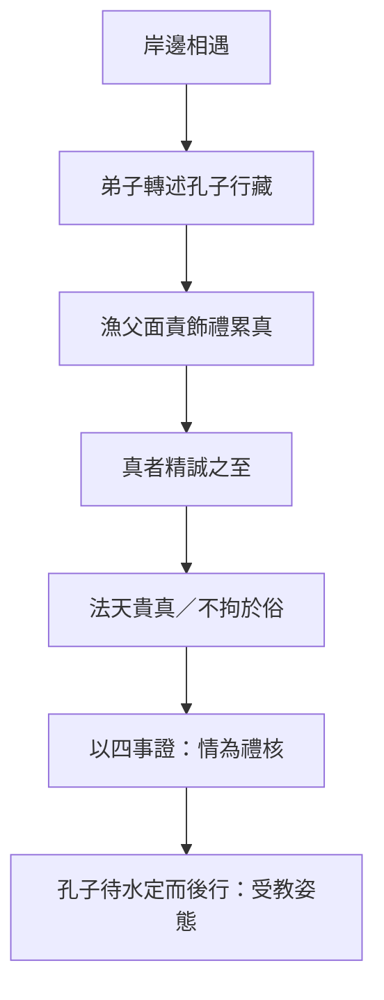
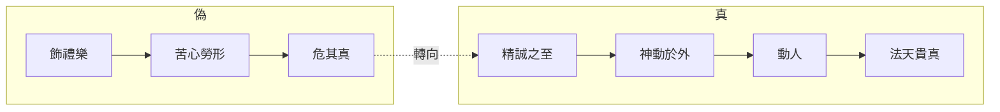

# 漁父

> **閱讀提示**：本篇依原文敘事順序展開。文中區分三層聲音——**原典**、**歷代注家**、**本書現代詮釋**。現代應用與哲學分析屬詮釋，不偽托為莊子原文原意。

## 01. 篇名與背景

〈漁父〉以「漁父」為篇名：不是寫漁業技術，而是以水濱隱者作為批判聲音。孔子師徒遊於緇帷之林，鼓琴誦書；一漁父上岸，先問弟子、再面見孔子，最後以「真」字收束全篇義理。

在雜篇諸作中，本篇與〈盜跖〉、〈說劍〉同屬「孔子受教／受辱」型戲劇。差別在於：〈盜跖〉以暴力與名教對撞，語氣極銳；〈漁父〉則較近「教誨體」——漁父不是要摧毀孔子，而是指出仁義禮樂若離開「精誠」，就只剩外飾。核心命題可濃縮為：**真者，精誠之至也**；禮的問題，不在有無儀式，而在儀式是否還能動人。

> **原典位置**：雜篇・第31篇・〈漁父〉。版本依據見郭慶藩《莊子集釋》。

## 02. 成書背景

學界多視〈漁父〉為雜篇中較晚的作品：文中孔子形象高度文學化，論辯明顯服務於道家「貴真」立場，與內篇〈人間世〉、〈德充符〉中對孔子較複雜的處理不同。這不表示本篇「沒有莊學價值」，而是提醒：它記錄的是後學如何用對話體，把「真／偽」「天／人」「誠／禮」的張力寫成一場可演出的相遇。

戰國至漢初，儒術與禮儀議論日盛；同時隱逸、養生與「法天」話語亦流行。〈漁父〉正坐落在此張力帶：一面承認孔子「仁則仁矣」，一面質問——若修身齊家治國平天下的路徑使人「苦心勞形以危其真」，則功業再大，亦可能是對生命本真的侵蝕。

引文以郭慶藩《莊子集釋》所收通行本為據；異文異讀另參校勘，不宜由單一標點推斷全部思想。

## 03. 結構分析

全篇可分為四個敘事單元，重心逐步由「問人」轉到「論真」：

1. **岸邊初遇**：漁父見弟子，問「彼何為者也」；子貢以孔子行藏答之。
2. **面見與批評**：孔子下船（或趨而就之），自陳憂世；漁父責其「飾禮樂、選人倫」而「苦心勞形」。
3. **論真與八疵四患**：提出「真者精誠之至」「法天貴真，不拘於俗」；並以事親、事君、飲酒、處喪等日常情境，說明「禮」須以「情」為核。
4. **孔子自省**：漁父刺船而去；孔子待水波定、不聞挐音而後敢升車，向弟子自嘆「遇丈人」如失。

### 結構圖

```text
緇帷之林：孔子鼓琴誦書
        ↓
漁父問弟子 → 知「孔氏」
        ↓
面責：仁義禮樂累身、危真
        ↓
正題：真＝精誠之至；法天貴真
        ↓
舉例：事親／事君／飲酒／處喪（禮不勝情）
        ↓
漁父去 → 孔子久立、自省
```



若用一句話總括結構：**先讓「禮的專家」出場，再讓「真」從水濱反過來考問禮。**

## 04. 原典

> **版本依據**：郭慶藩《莊子集釋》所據通行本；以下為必要引用，非全篇逐字抄錄。

### （一）漁父初問

> 孔子遊乎緇帷之林，休坐乎杏壇之上。弟子讀書，孔子絃歌鼓琴。奏曲未半，有漁父者，下船而來……

### （二）批評飾禮危真（節錄大意依據）

> 苦心勞形以危其真。……今子修身以明污，昭昭乎若揭日月而行也。

### （三）本篇樞紐：真與精誠

> 真者，精誠之至也。不精不誠，不能動人。故強哭者雖悲不哀，強怒者雖嚴不威，強親者雖笑不和。真悲無聲而哀，真怒未發而威，真親未笑而和。真在內者，神動於外，是所以貴真也。

### （四）法天貴真

> 禮者，世俗之所為也；真者，所以受於天也，自然不可易也。故聖人法天貴真，不拘於俗。

### （五）事親與處喪（禮以情為核）

> 事親以適，不論所以矣……處喪以哀，無問其禮矣。……功成之美，無一其跡矣。

## 05. 白話翻譯

### （一）岸邊

孔子在緇帷之林遊覽，在杏壇休息。弟子讀書，孔子彈琴唱歌。曲子還沒奏到一半，有位漁父下船走來，鬚眉皆白，被髮揄袂，沿著上岸，離陸地約數十步而止，向左而立，聽完曲。

### （二）批評的大意

漁父透過弟子得知對方是魯國孔氏，以仁義為業、飾禮樂、選人倫，上以忠君、下以化民。他並不否認孔子「仁」，卻指出：如此苦心勞形，其實可能危害「真」——把生命耗在可展示的德行與儀節上，反而遠離受於天的本然。

### （三）真者精誠之至

「真」是精誠到了極致。不精不誠，就不能打動人。強裝哭的人，看起來悲，其實不哀；強裝怒的人，看起來嚴，其實不威；強裝親的人，看起來笑，其實不和。真正的悲，不必靠聲音也哀；真正的怒，未發也自有威；真正的親，未笑也自有和。真在內，神采就會動於外——所以要貴真。

### （四）法天貴真

禮，多是世俗約定做出來的；真，卻是受於天、自然不可改易的。因此聖人效法天、看重真，不被流俗儀文綁死。事親以求安適為要，不必執著固定做法；處喪以哀為要，不必先問儀節是否完備；功業完成，也不必執著於單一痕跡與形式。

### （五）收束

漁父說完便刺船而去，延緣葦間。孔子待水面波紋平定、聽不見搖船聲，才敢登車。他對弟子說：遇到深於道的人，若不敬，便是遠於德——今日之遇，幾乎像失去了什麼。

## 06. 字詞註解

| 字詞 | 釋義 | 本篇閱讀提示 |
|------|------|--------------|
| 漁父 | 捕魚的隱者形象 | 敘事上的批判主體；非職業說明 |
| 緇帷之林 | 林木茂密如帷幕之處 | 開場場景；「帷」暗示遮蔽與靜聽 |
| 杏壇 | 孔子休坐授徒處 | 後世成為「講學」符號；此處為文學場景 |
| 真 | 精誠、未受矯飾的內在狀態 | 本篇最高價值詞；≠任性表露 |
| 精誠 | 精神專一而誠懇 | 「真」的定義項：真＝精誠之至 |
| 動人 | 感發他人 | 真偽的判準之一：能否自然動人 |
| 強哭／強怒／強親 | 勉強做出的表情 | 反襯「真在內，神動於外」 |
| 法天 | 效法天之自然 | 與「拘於俗」相對 |
| 貴真 | 以真為貴 | 本篇綱領：法天貴真 |
| 俗 | 流俗儀文與眾人習尚 | 禮之所從出；可有用，亦可成偽 |
| 禮 | 儀節、規範、人倫程序 | 本篇不廢禮，而問禮是否離情 |
| 情 | 真實之情（哀、適、和等） | 禮的核；「處喪以哀」即其例 |
| 八疵 | 漁父所列為人之病 | 與「四患」同屬修身檢核清單 |
| 四患 | 漁父所列處世之患 | 讀時宜回扣「危其真」的主題 |
| 受於天 | 得自天然、非人為捏造 | 真的來源；對照「世俗之所為」 |
| 不拘於俗 | 不被流俗綁死 | 非廢俗，而是不以俗代真 |

## 07. 段落解析


**走讀路線**：遇漁父於水濱 → 貴真 → 八疵四患。

### 第一層：為何從「聽琴」開始？

開場不是辯論會，而是漁父先聽完一曲。這安排很重要：**批判者先進入對方的世界**，不是一上來就罵。孔子師徒以絃歌呈現「有教」的文明形象；漁父的出現，則把場景從「杏壇講學」拉到「水濱異音」。後文「待水波定」的細節，也與開場的樂聲形成首尾呼應——聲音停了，反省才開始。

### 第二層：為何讓孔子「仁則仁矣」仍被責？

漁父並未否認孔子之仁，這比全盤否定更尖銳。問題不在「你不仁」，而在「你以仁義禮樂把自己與世人一起拖進勞形危真」。換言之，本篇攻擊的是**美德的外在化**：當德行變成可展示、可比較、可政治動員的工程，精誠就可能被「昭昭乎若揭日月」的表演取代。

與上下文：此段為「真」字登場鋪路——若沒有先承認孔子已站在道德高地，後面「貴真」就容易被讀成反道德；有了這層轉折，讀者才明白：真不是反仁，而是問仁是否還活著。

### 第三層：為何用「強哭／強怒／強親」說真？

這三組對比把抽象的「真」落到身體與表情。莊子（或後學）在此做的是現象學式提示：人能辨認「假悲」「假威」「假和」，因為外貌與神氣對不上。真不在嗓門大，而在「神動於外」——內在專一，自然外顯。

為何寫在這裡：緊接批評之後，必須給出可理解的標準；否則「貴真」只是口號。此處標準是「能否動人」，不是「是否合禮」。

### 第四層：事親、處喪為何出現？

若只停留在反禮，本篇會變成虛無主義。漁父改談日常倫理：事親重「適」，處喪重「哀」，飲酒重「樂」，事君重「功」——形式可以多樣，核心之情不可假。這是全篇最「可實踐」的一段：**不是叫人廢禮，而是叫人別讓禮壓過情。**

與前後文：前段立「真」，此段把真放進儒者最熟悉的人倫場景，形成「以彼之矛，攻彼之盾」的結構；末段孔子自省，才顯得有重量。

### 第五層：為何以「待水定」收束？

漁父離去後，孔子不立刻上車，而等波紋平、挐音歇。這不是多餘的文學花絮，而是把「受教」寫成身體節奏：聽完重話，心與感官需要一段靜定。雜篇常誇飾孔子狼狽；此處狼狽較溫和，卻更接近「真」之主題——連敬畏與慚愧，也要是真的。

## 08. 歷代注家怎麼看

### 郭象

郭象注「真」與「自然」一路，傾向把「法天貴真」讀成各安其性、不以外飾傷生。依此，漁父不是要廢人倫，而是反對「以世俗之禮強其所不能」。郭注的長處，是避免把本篇讀成「反孔子＝反一切文明」；風險則是：若過度「適性」，可能淡化原文對「飾禮」「昭昭而行」的鋒芒。

### 成玄英

成玄英疏強調「精誠」與「神動於外」的工夫意味：內不誠則外無感。他常以「去偽存真」疏通文氣，使「強哭不哀」等句成為修養檢證。讀者宜注意：唐疏的道教化語彙是詮釋層，不宜直接回填為戰國原義；但其對「誠能動人」的強調，與本文樞紐句高度貼合。

### 林希逸

林希逸重視文脈，提醒〈漁父〉是「寄言」：漁父不必坐實為某隱士傳記，孔子亦是文學中的受教者。他往往指出：篇中論禮處，並非全盤抹殺禮，而是「禮之本在誠」。此讀法對現代導讀特別有用——可同時保留儒道張力與文本的教誨結構。

### 其他

- **王先謙《莊子集解》**：字句簡明，便於對照「八疵」「四患」條目。
- **郭慶藩《莊子集釋》**：彙舊注，查「真者精誠之至」一段古注的重要入口。
- **今人**：陳鼓應突出「貴真」與反虛偽；王邦雄可連到生命真實感；傅佩榮可作概念澄清。皆屬今詮，勿與原典混聲。

## 09. 哲學分析

> 以下為**本書現代詮釋**。

### 9.1 真：不是「誠實發言」，而是「精誠之至」

現代語「真」常被縮成「不說謊」。本篇的「真」更強：它要求內在專一到能自然外顯，並能動人。因此，真包含認知上的不自欺，也包含情感與身體的一致性。一個人可以「字字屬實」卻毫無精誠——那仍可能是另一種偽。

### 9.2 禮與真：對立，還是層級？

本篇看似禮／真對立，更深結構是層級：**真為本，禮為末；情為核，文為緣。** 「處喪以哀，無問其禮」不是鼓勵失禮，而是說：若哀已至，儀節的完備性是次級問題；若儀節完備而哀假，則禮已死。

這使〈漁父〉與〈大宗師〉「死生一體」、〈人間世〉「心齋」可互參：都在問——形式與名教何時開始替代生命本身的感受與回應。

### 9.3 「動人」作為倫理判準

「不精不誠，不能動人」把倫理效果放進人與人的感通，而非僅放進規則符合。這接近一種「感通倫理學」：規範若不能喚起真實的敬、哀、和，就只剩管理技術。當然，現代詮釋也需警惕——「動人」可被煽情政治濫用；故必須連回「受於天」「自然不可易」，以免真淪為修辭表演。

### 9.4 接入思想地圖

```text
真（精誠之至）
 ├─ 內：神不外馳、不自欺
 ├─ 外：神動於外、能動人
 └─ 對治：飾禮／強哭強怒強親
         └─ 法天貴真，不拘於俗
             └─ 禮以情為核（事親適、處喪哀）
```

## 10. 與老子比較

《老子》云「信言不美，美言不信」，又重「見素抱樸」「少私寡欲」，與〈漁父〉之反飾、貴真同屬一家族。老子更常以治術與形上短章說話；〈漁父〉則把問題戲劇化為「儒者遇到水濱隱者」。

可並讀處：老子的「樸」助理解「真」為何拒絕雕飾；〈漁父〉的「精誠之至」則把樸推進到人際感通——不只自己素樸，還要問是否仍能真實動人。二者互照，不宜混成一句「反禮教」口號。

## 11. 與儒家比較

這是本篇最直接的對話面。儒家以禮立人倫，孔子本人亦重「禮云禮云，玉帛云乎哉」——儒家內部本有「禮之本」的反省。〈漁父〉把這條線拉到極端：若以道家「受於天」的真為最高，世俗之禮便只能居次。

爭點不應化約為「要不要禮」：

- 儒家問：沒有可傳承的形式，真誠如何不被私意吞噬？
- 本篇問：形式一旦可表演、可量化、可炫耀，真誠如何還活得成？

較健康的讀法是張力並存：〈漁父〉可作為儒家的鏡；儒家對「徒善不足以為政」的提醒，也可反過來質問「唯情感是否足夠」。

## 12. 與佛學比較

> 以下為**本書現代詮釋**。本節只交代後世常見的並讀習慣，以及不宜混同之處；**不是**把本篇說成佛學，也不是佛學專論。

後世讀者有時會拿佛學語彙（如破妄、見性、涅槃）來聯想本篇的「貴真、精誠、八疵四患」。這種聯想多半因為兩邊都曾被用來反省執取、變化或言說限度，作為個人閱讀的對照可以，卻**不能**當成原典本意，更不能作成概念對譯。

本篇的關切是真與禮的張力，核心語彙與論證屬於精誠與天然。佛教若討論相近主題，其框架、目標與制度背景（苦集滅道、業報與解脫，或經教／禪修傳統）與《莊子》並不相同。因此不宜把本篇關鍵詞「翻譯」成佛學術語，也不宜用佛學結論倒過來解釋莊子。

閱讀建議：先守住原文概念與篇章脈絡；若參考佛學，只把它當對照組，用來更清楚看見《莊子》自己在說什麼——而不是把《莊子》收編成佛學課本。


## 13. 現代人生應用

> 以下為**現代詮釋**，回扣「真／精誠／禮以情為核」，不是職場公式。

### 13.1 儀式與場合：先問「還有沒有情」

婚喪喜慶、開會致詞、公開道歉——現代生活充滿儀式。可先問：我是在完成程序，還是在讓該有的敬、哀、謝真正到位？本篇不是叫人取消儀式，而是警告：**程序完整而情假，最傷人，也最傷己。**

### 13.2 表達憂慮與憤怒

「強怒者雖嚴不威」。在組織或家庭中，提高音量不自動等於有威信。較接近本篇的練習是：先辨認怒從何來、要保護什麼，再決定是否說、如何說——讓神氣與內容一致，而不是表演嚴厲。

### 13.3 公開形象與「揭日月而行」

個人品牌、履歷美德、社群上的良善人設，容易變成「昭昭乎若揭日月」。本篇提醒：越急著證明自己光明，越可能危及精誠。可操作的一問是——若沒有觀眾，這件事我還會同樣做嗎？

### 13.4 陪伴喪親與困境中的人

「處喪以哀，無問其禮」。面對他人悲痛，急著講正確的話、做足樣子，常不如安靜的在場與真實的難過。禮數可作底線，卻不應壓過哀本身。

## 14. 常見誤解

1. **「貴真就是想怎樣就怎樣。」**  
   真是精誠之至，包含對人倫之情的鄭重，不是任性。

2. **「本篇全面反儒家、反禮。」**  
   原文承認孔子之仁，並在事親、處喪中保留倫理核心；所反的是離情之禮。

3. **「能動人＝善煽情就對了。」**  
   「動人」須連回「真在內」；煽情恰是「強哭／強親」的現代版。

4. **「漁父的話句句等於莊周本人。」**  
   本篇屬雜篇教誨體，宜作思想史文本讀，不宜當成莊周語錄全集。

5. **「只要內心真誠，外在言行可完全不顧。」**  
   「神動於外」說明真會顯於外；內外分裂本身即不誠。

## 15. 本篇總結

〈漁父〉以水濱隱者考問杏壇聖人，把全篇壓到一個字：**真**。真被定義為精誠之至；其對立面不是「禮」本身，而是失誠之飾、強作之態、以及把美德做成表演的生活方式。「法天貴真，不拘於俗」要求人把尺度從「是否合俗儀」轉回「是否仍受於天、能否動人」。

若以一句話收束：**禮可以學習，真無法假裝；當儀文開始替代精誠，文明就只剩下聲響。**

## 16. 心智圖




## 17. 延伸閱讀

### 原典與注疏

- 郭慶藩《莊子集釋》〈漁父〉
- 王先謙《莊子集解》〈漁父〉
- 成玄英《南華真經注疏》〈漁父〉相關疏文
- 林希逸《莊子口義》〈漁父〉

### 今注今譯與研究

- 陳鼓應《莊子今註今譯》〈漁父〉
- 王邦雄相關論「真實／虛偽」的現代解讀
- 關於雜篇「孔子對話體」年代與思想傾向的研究（劉笑敢等）

### 本專案內交叉引用

- 相關篇章：〈人間世〉、〈德充符〉、〈大宗師〉、〈盜跖〉、〈天下〉
- 相關人物：[孔子](content/figures/孔子.md)、[顏回](content/figures/顏回.md)、[莊周](content/figures/莊周.md)
- 相關名詞：[道](content/terms/道.md)、[無為](content/terms/無為.md)、精誠、真
- 相關主題：[政治與無為](content/themes/政治與無為.md)、[語言與真實](content/themes/語言與真實.md)、[焦慮與比較](content/themes/焦慮與比較.md)
