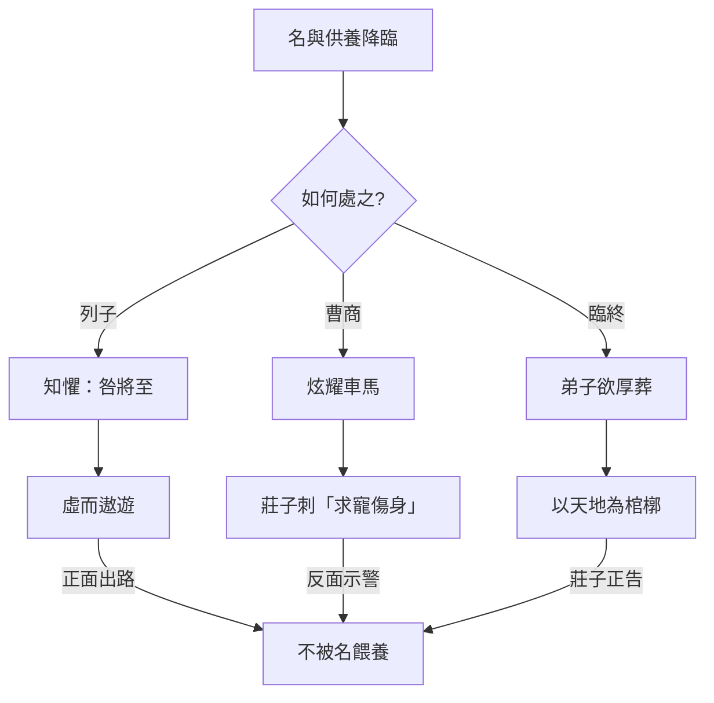
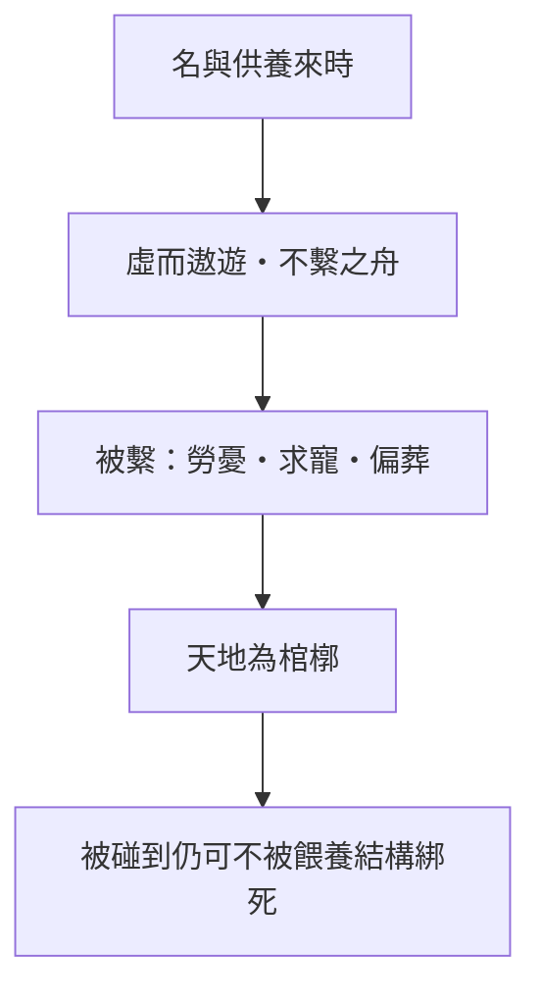

# 列御寇

> **閱讀提示**：本篇為雜篇中的「故事串珠」體，段落語氣不一。文中區分三層聲音——**原典**、**歷代注家**、**本書現代詮釋**。不可把每一則寓言都讀成同一作者的同一命題。

## 01. 篇名與背景

〈列御寇〉以列子為篇名人物，但全篇並非列子專傳。開篇寫列子因受人敬奉而有「食於十漿」之驚，引出伯昏無人「巧者勞而智者憂」「虛而遨遊」的警策；中段以曹商使秦得車、莊子譏其「舔痔」式求寵，把啖名逐利推到荒誕；末段「莊子將死」，弟子欲厚葬，莊子以天地為棺槨、日月為連璧拒之——把「名」與「身後之名」一併放下。

本篇在全書中的功能像一組**處世風險說明書**：名聲如何反過來餵養你、吞噬你；人如何在被供養、被稱讚時失去「虛」；以及死亡面前，連殯葬之「禮」也可能變成另一種執名。它與〈逍遙遊〉列子「猶有所待」、〈應帝王〉「虛而待物」遙相呼應，但筆法更雜、更諷。

> **原典位置**：雜篇・第32篇・〈列御寇〉。版本依據見郭慶藩《莊子集釋》。

## 02. 成書背景

雜篇常彙編不同來源的短章。〈列御寇〉中，列子故事近隱逸警世，曹商故事近游士諷刺，莊子將死近學派自我形象塑造——三者主題相近（名、利、身），文氣不必同出一時。近現代研究多提醒：雜篇「莊子言行」材料，有的可能出自後學對宗師形象的追寫，讀時宜保留文本層次。

戰國游士奔走於諸侯之間，車馬、粟帛、名聲是可計算的報償；同時隱者傳統又以「不被供養」為清高的另一種身分政治。〈列御寇〉兩邊都寫到：它既嘲笑曹商式「以所學換車馬」，也警告列子式「尚未求名而名已至」——後者更細，因為危險發生在你以為自己仍清高之時。

引文以郭慶藩《莊子集釋》所收通行本為據。

## 03. 結構分析

全篇可粗分為三組（中間另有短章，此處抓主幹）：

1. **列子與伯昏無人**：受人敬奉 → 恐懼「咎」將至 → 「虛而遨遊」的教導。
2. **曹商使秦（及相關利祿故事）**：得車炫耀 → 莊子以極刻薄比喻刺穿「以身試寵」。
3. **莊子將死**：弟子欲厚葬 → 天地棺槨、烏鳶蝼蚁皆可「葬」 → 拒以人為形式障蔽自然。

### 結構圖

```text
列子食於十漿（名未求而人予）
        ↓
伯昏無人：巧勞智憂；虛己遨遊
        ↓
（中段短章：辯知、神巫等，略）
        ↓
曹商使秦得車：啖名逐利之極寫
        ↓
莊子將死：拒厚葬
        ↓
天地為棺槨／萬物為齋送
```



若用一句話總括：**名可遠人，也可來人；來人而不虛，人就被名所養、所驅、所葬。**

## 04. 原典

> **版本依據**：郭慶藩《莊子集釋》所據通行本；以下為必要引用，非全篇逐字抄錄。

### （一）列子驚於供養

> 列御寇之齊，中道而反，遇伯昏瞀人。伯昏瞀人曰：「奚方而反？」曰：「吾驚焉。」……「吾食於十漿，而五漿先饋。」

### （二）虛而遨遊

> 巧者勞而知者憂，無能者無所求，飽食而敖遊，汎若不繫之舟，虛而遨遊者也。

### （三）曹商使秦（諷刺）

> 宋人有曹商者，為宋王使秦。其往也，得車數乘；王說之，益車百乘。反於宋，見莊子……莊子曰：「秦王有病召醫，破癰潰痤者得車一乘，舔痔者得車五乘，所治愈下，得車愈多。子豈治其痔邪？何得車之多也？子行矣！」

### （四）莊子將死

> 莊子將死，弟子欲厚葬之。莊子曰：「吾以天地為棺槨，以日月為連璧，星辰為珠璣，萬物為齎送。吾葬具豈不備邪？何以加此！」弟子曰：「吾恐烏鳶之食夫子也。」莊子曰：「在上為烏鳶食，在下為螻蟻食，奪彼與此，何其偏也！」

## 05. 白話翻譯

### （一）列子為何中途折返？

列禦寇前往齊國，半路折回，遇見伯昏瞀人。伯昏問：為什麼回來？列子說：我受驚了。我在十家賣漿的地方用餐，竟有五家搶先送上——人家因為我的「名」而特別對待我。我擔心：這種被供養的狀態，會招來禍患。

### （二）伯昏的警策

伯昏指出：善於用巧的人勞苦，聰明外露的人憂慮；看似「無能」、無所求的人，反而能飽食而遨遊，像一艘沒有被繩索繫住的船——**虛而遨遊**。意思是：你若被他人的禮敬填滿，心就不虛；不虛，就會成為可被利用、可被忌妒、可被追究的「有名之物」。

### （三）曹商得車

宋人曹商替宋王出使秦國，去時只有幾輛車；秦王喜歡他，加到一百輛。他回宋後向莊子炫耀。莊子說：秦王生病召醫，能弄破膿瘡的得一輛車，願意「舔痔」的得五輛——治得越下作，車越多。你難道是治痔的嗎？為什麼車這麼多？你走吧！

### （四）莊子將死

莊子快死時，弟子想厚葬他。莊子說：我把天地當棺槨，日月當連璧，星辰當珠璣，萬物當陪葬——葬具還不夠完備嗎？何必再加？弟子擔心被烏鴉老鷹吃掉。莊子說：在上被烏鳶吃，在下被螻蟻吃；從那邊搶來給這邊，何必如此偏心！

## 06. 字詞註解

| 字詞 | 釋義 | 本篇閱讀提示 |
|------|------|--------------|
| 列御寇 | 列子；御風故事見〈逍遙遊〉 | 本篇寫其「驚於名」，與御風之「有待」可互參 |
| 伯昏瞀人／無人 | 隱者、達者之師形象 | 警策主體；「虛」之教導者 |
| 十漿／五漿先饋 | 十家賣漿、五家搶先供養 | 名至而物至的具體場景 |
| 驚焉 | 受驚、警覺 | 列子尚知懼，故可教 |
| 咎 | 災禍、罪責 | 名盛則謗與患隨之 |
| 巧者勞 | 有技巧者反更辛勞 | 與「無能者無所求」對舉 |
| 知者憂 | 智謀外露者多憂 | 智成為負擔 |
| 不繫之舟 | 未被纜繩繫住的船 | 「虛而遨遊」的核心喻象 |
| 虛 | 內心不被名利填滿 | 本篇工夫關鍵；≠自我貶低 |
| 遨遊 | 自在往來 | 與〈逍遙遊〉之「遊」同族 |
| 曹商 | 使秦得車的宋人 | 啖名求寵的諷刺典型 |
| 益車百乘 | 賞車增至百輛 | 「得」的誇飾；對照舔痔之喻 |
| 破癰潰痤 | 弄破膿瘡 | 求寵層級之起點 |
| 舔痔 | 極言卑屈取寵 | 諷刺修辭；非醫學記載 |
| 厚葬 | 隆重殯葬 | 臨終段落所拒之「名／禮」 |
| 棺槨 | 內棺外槨 | 莊子以天地代之 |
| 連璧／珠璣 | 陪葬珍寶 | 以日月星辰替換人間寶物 |
| 烏鳶／螻蟻 | 食屍之鳥與蟲 | 破「上下貴賤」的葬埋執念 |
| 齎送 | 送葬之物 | 萬物皆可為送；無需厚備 |

## 07. 段落解析


**走讀路線**：射之誡 → 中鹵彈 → 擊金而反。關鍵句：**技不失真**。

### 第一層：列子為何「驚」而不是「喜」？

普通人被五家搶著請客，多半沾沾自喜；列子卻折返。這「驚」是全篇第一個價值信號：**名至物至，未必是福。** 它接續〈逍遙遊〉對列子「猶有所待」的批評而轉深——此處所待者，不是風，而是他人的供養與目光。

與上下文：若開篇就寫曹商，讀者只看到醜陋求寵；先寫列子，才能寫出「清高者也可能被名擊中」的細膩危險。

### 第二層：「不繫之舟」為什麼是虛？

舟若被繫住，看似安全，實則失去隨水而往的自由；心若被禮敬填滿，看似受肯定，實則變成可被輿論與權力牽引的物件。「虛」不是空虛無內容，而是**不讓外來餵養成為自己的重心**。巧者勞、知者憂——越有能耐越被徵用；無能者無所求，反而保全遨遊的空間。

### 第三層：曹商段為何如此刻薄？

「舔痔得車」是《莊子》中最尖銳的政治諷刺之一。它把「外交成功—賞車—炫耀」的正當敘事，翻轉成「你到底願意卑屈到什麼程度」。文學效果極強，但也需提醒（現代詮釋）：這是寓言式極言，用來照出**報酬與人格屈降的交換結構**，不是教人辱罵所有出使或從政者。

與前後文：列子段寫「名未求而至」；曹商段寫「名與利主動獵取」。一被動、一主動，合起來才是完整的「名利病理學」。

### 第四層：臨終厚葬與「奪彼與此」

弟子的擔心很「正常」：怕老師屍體被鳥吃。莊子卻指出：厚葬不過是把鳥的食物改成蟻的食物——仍是偏心。這裡的哲學力道不在「薄葬政策」，而在**連死後安置也要爭「正確的被吃法」**，說明人對「我」的執著可以延伸到屍身。以天地為棺槨，是把個體還給大化，與〈至樂〉鼓盆、《大宗師》死生一體同調。

## 08. 歷代注家怎麼看

### 郭象

郭象讀「虛而遨遊」，多落在「無心以順物」：不預設機巧，則勞憂不生。對曹商段，郭注傾向點明「貪寵者自辱」；對將死段，則強調「死生與化為體」，厚葬只是生人之情的延續執著。其長處是把雜篇短章收束到「適性／無心」；需防的是把尖銳諷刺全部磨成溫和的安命論。

### 成玄英

成疏對「不繫之舟」發揮甚詳，常以心無繫著釋「虛」。對厚葬，成疏強調莊子「一死生、外形骸」，弟子之恐烏鳶，仍是分別心。唐疏工夫論色彩較濃，有助修養式閱讀，但語彙不可直接等同戰國原義。

### 林希逸

林希逸特重文氣：曹商段是「痛罵」，讀時要見其滑稽與凜烈；將死段是「達」，讀時要見其透脫。他提醒不可把舔痔句坐實為記事，也不可把列子「食於十漿」讀成勸人拒絕一切人情——重點在「心是否被餵養牽走」。

### 其他

- **王先謙《莊子集解》**：便於核對人名異稱（伯昏瞀人／無人）與章次。
- **郭慶藩《莊子集釋》**：曹商、將死兩段古注彙編的入口。
- **今人**：陳鼓應突出對權貴與虛名的批判；討論莊子形象塑造時，宜分開「思想」與「傳記真實性」。

## 09. 哲學分析

> 以下為**本書現代詮釋**。

### 9.1 名作為「餵養結構」

本篇最獨特的洞見，未必是「名不好」，而是：**名會餵人**。五漿先饋、車馬加益，都是餵養。被餵養者若無「虛」，就會調整自己的行為去維持餵養——於是名從結果變成主人。這比單純說「不要名」更精確。

### 9.2 虛而遨遊：與無待、心齋的關係

「虛」在〈人間世〉是心齋的核心；在〈應帝王〉是「虛而待物」；在本篇則具體化為「不被供養填滿」。三者可連成一條線：虛不是空無一物，而是保持可遊的餘地。列子御風猶有待於風；此處則警告猶有待於人的目光。

### 9.3 諷刺的倫理學限度

曹商段使用羞辱性比喻，力量來自冒犯。現代詮釋若只模仿刻薄，易落入以辱罵代替分析。較穩妥的讀法是抽出結構：當報酬隨「自我降格」而上升，體系就在獎勵屈從。批判應對準結構，而非以人身攻擊為樂。

### 9.4 死亡與「偏」

「奪彼與此，何其偏也」把喪葬爭論降維成對鳥與蟻的偏袒——用荒謬打破莊嚴執念。哲學上，這是齊物精神在屍身層次的運用：連「如何被分解」也不值得變成最後的勝負。

### 9.5 接入思想地圖

```text
名
 ├─ 被動至（列子：五漿先饋）→ 知懼 → 虛而遨遊
 ├─ 主動求（曹商：益車百乘）→ 諷刺 → 拒以身換寵
 └─ 身後延（厚葬）→ 天地棺槨 → 不與烏鳶螻蟻爭偏
```

## 10. 與老子比較

《老子》「名與身孰親」「知足不辱，知止不殆」，與本篇對名聲、車馬、身後榮光的警惕相通。老子多以格言收束欲望；〈列御寇〉則用場景與辱格比喻讓讀者「看見」名如何運作。

可並讀：老子助理解「知止」；本篇助理解「止不住時，名已開始養你」。虛而遨遊近於老子之「無私／不自見」，但莊子更強調遊的動態形象。

## 11. 與儒家比較

儒家重名教、慎終追遠、葬之以禮。本篇將死段幾乎正面衝撞厚葬與慎終的形式面。爭點仍宜精細化：

- 儒家之禮，意在透過形式安頓哀與敬；
- 本篇擔心形式變成對「我」的最後營造，反而障蔽大化。

列子段對「受人敬奉」的恐懼，也可對照儒家「君子疾沒世而名不稱焉」——一憂名不稱，一憂名稱而咎至。兩者不必互相取消，但張力真實存在。

## 12. 與佛學比較

虛而遨遊、拒厚葬，易被讀成空、看破。本篇是名利降臨與臨終安排：名可遠人，也可來人；來人而不虛，人就被名所養。

虛是道家式在世遊走，不是先換成出離論再解釋曹商與莊子將死。


## 13. 現代人生應用

> 以下為**本書現代詮釋**。

### 13.1 當稱讚與資源開始「找上你」

升遷、邀約、免費招待、特別通融——若來勢突然，可學列子之「驚」：先問這份禮遇綁定了什麼期待。練習不是拒人千里，而是保持「不繫」：接受人情，卻不把自我價值外包給持續被餵養。

### 13.2 辨認「得車愈多」的交換

有些機會明碼標價：越願意自我矮化、越願意說違心的話，回報越高。本篇曹商段的現代用處，是給這種交換命名。你可以仍選擇進入體制，但應清楚自己付的是哪一種「身價」。

### 13.3 社群聲量與「五漿先饋」

粉絲、轉發、被認識的快感，很像漿家先饋。虛的練習可以很具體：定期做無人看見的事；或在稱讚到來時，延遲自我敘事的改寫——不要立刻變成「被稱讚的那個人設」。

### 13.4 談死亡與告別方式

預立醫療、喪禮形式、訃聞規格，常變成家人的面子戰場。本篇不是規定人人薄葬，而是問：我們是否在為逝者爭一種「正確的被安置」，而忽略哀與化本身？討論時可把「偏」字拿出來——我們在保護誰的心安，又在排除什麼自然過程？

## 14. 常見誤解

1. **「虛就是要變得無能、無成就。」**  
   「無能者無所求」是對照修辭；重點是無所求於名利餵養，不是否定能力。

2. **「本篇叫人拒絕一切禮物與職位。」**  
   列子所驚的是「因名而饋」的結構，不是一切人際餽贈。

3. **「莊子辱罵曹商，所以嘲諷等於有道。」**  
   諷刺是文學手段；道不在學會罵人。

4. **「拒厚葬＝不孝、不尊重死者。」**  
   文本挑戰的是執形與偏心；敬與哀仍可有其他安置方式。

5. **「篇中莊子言行皆為信史。」**  
   臨終對話富文學性，宜作思想表達讀，慎作傳記還原。

## 15. 本篇總結

〈列御寇〉用三組強場景寫同一個問題：人如何被「名」養活、驅使、甚至死後繼續塑造。列子段教「虛而遨遊」——如不繫之舟；曹商段揭「求寵的價格」；將死段把棺槨交還天地。合起來，它不是教人變冷漠，而是教人**別把餵養當自己，別把賞車當成就，別把厚葬當最後的我**。

若以一句話收束：**能遊者，不是從未被名碰到的人，而是被碰到仍能保持虛、不讓纜繩繫住船的人。**

## 16. 心智圖




## 17. 延伸閱讀

### 原典與注疏

- 郭慶藩《莊子集釋》〈列御寇〉
- 王先謙《莊子集解》〈列御寇〉
- 成玄英《南華真經注疏》相關疏文
- 林希逸《莊子口義》〈列御寇〉

### 今注今譯與研究

- 陳鼓應《莊子今註今譯》〈列御寇〉
- 〈逍遙遊〉列子御風段對讀
- 關於《莊子》中「莊子言行」材料性質的討論

### 本專案內交叉引用

- 相關篇章：〈逍遙遊〉、〈人間世〉、〈應帝王〉、〈至樂〉、〈外物〉、〈天下〉
- 相關人物：[列禦寇](content/figures/列禦寇.md)、[莊周](content/figures/莊周.md)、[惠施](content/figures/惠施.md)
- 相關名詞：[逍遙](content/terms/逍遙.md)、[無用之用](content/terms/無用之用.md)、[物化](content/terms/物化.md)、虛
- 相關主題：[死亡與喪親](content/themes/死亡與喪親.md)、[無用與有用](content/themes/無用與有用.md)、[自由與無待](content/themes/自由與無待.md)
