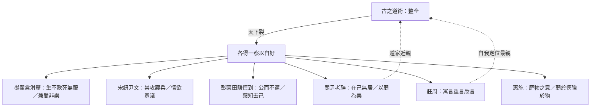
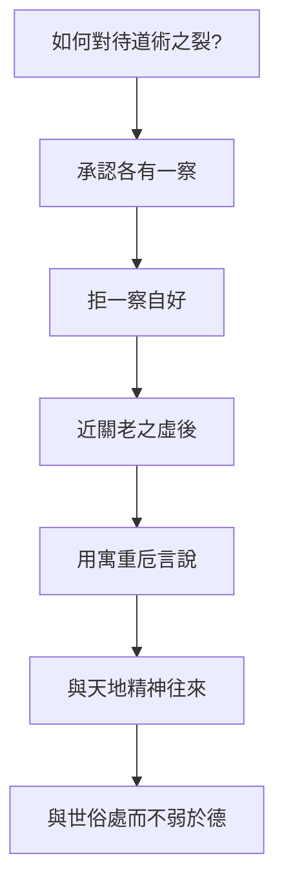

# 天下

> **閱讀提示**：〈天下〉是《莊子》中罕見的**學術史／思想地圖**篇章，不是人物寓言集。讀法應接近「先秦道術總論」：先立「古之道術」的整全理想，再評各家「得一察焉以自好」。文中區分**原典**、**歷代注家**、**本書現代詮釋**三層聲音。

## 01. 篇名與背景

〈天下〉列雜篇之末，篇名取開篇視野：「天下」非僅政治疆域，而是文明中「道術」所託的整體世界。它提出一個全書級命題——**道術將為天下裂**——然後以有序的學派評述，為讀者繪製戰國思想的裂變圖。

在三十三篇中，本篇地位特殊：它幾乎不靠鯤鵬式寓言推進，而靠**分類、稱引、褒貶與自我定位**。末段寫莊周「以謬悠之說、荒唐之言、無端崖之辭」及「寓言／重言／卮言」，等於給《莊子》文體立自我說明。因此，〈天下〉既是思想史文獻，也是理解「莊子如何看待莊子」的後設篇章。

> **原典位置**：雜篇・第33篇・〈天下〉。版本依據見郭慶藩《莊子集釋》。

## 02. 成書背景

多數研究者視〈天下〉為較晚出的總論性作品：它對墨家、宋鈃尹文、彭蒙田駢慎到、關尹老聃、莊周（以及惠施等）的掌握，顯示作者處於學派分化已明、需要「譜系敘事」的時代。其立場明顯偏道家——以「古之人」「道術」之全為尺度，評諸子為偏至——故它不是中立百科，而是**有判準的學術史**。

此種寫法，與《荀子・非十二子》《韓非子・顯學》等同屬戰國至漢初「論諸子」傳統，但〈天下〉的獨特性在於：它把最高理想放在「備於天地之美、稱神明之容」的整全道術，並在譜系末端安放莊周，使全書收束於自我解釋。

引文以郭慶藩《莊子集釋》所收通行本為據；學派歸類與人物離合，歷來有異說，下文於註解標明爭議處。

## 03. 結構分析

全篇是清楚的「總—分—合」結構：

1. **總論**：古之道術／「道術將為天下裂」／「天下多得一察焉以自好」。
2. **分評諸家**（由遠而近、由偏而親）：
   - 墨翟、禽滑釐
   - 宋鈃、尹文
   - 彭蒙、田駢、慎到
   - 關尹、老聃
   - 莊周
3. **附論名家**：惠施（及桓團、公孫龍等）——以「弱於德、強於物」收束辯者之蔽。

### 結構圖

```text
古之道術（整全：天地—神明—人倫—萬物）
                ↓ 裂
        ┌───────┼───────┐
       墨家    宋尹    彭田慎
    （儉苦兼愛）（禁攻情欲）（棄知去己）
                ↓
            關尹・老聃（見譽／無為）
                ↓
              莊周（謬悠荒唐；寓／重／卮）
                ↓
            惠施等辯者（強於物而弱於德）
```



總括一句：**先畫「全」，再量「偏」，最後用莊周文體說明「如何說那個全」。**

## 04. 原典

> **版本依據**：郭慶藩《莊子集釋》所據通行本；以下為必要引用，非全篇逐字抄錄。

### （一）總綱：道術將為天下裂

> 天下之治方術者多矣，皆以其有為不可加矣。……天下大亂，賢聖不明，道德不一，天下多得一察焉以自好。……道術將為天下裂。

### （二）古之人的整全

> 古之人其備乎！配神明，醇天地，育萬物，和天下，澤及百姓，昭於本數，係於末度，六通四辟，小大精粗，其運無乎不在。

### （三）墨家（節錄評語方向）

> 不侈於後世，不靡於萬物，不暉於數度，以繩墨自矯，而備世之急；古之道術有在於是者。墨翟禽滑釐聞其風而說之。……其生也勤，其死也薄，其道大觳；使人憂，使人悲，其行難為也……

### （四）宋鈃、尹文

> 不累於俗，不飾於物，不苟於人，不忮於眾，願天下之安寧以活民命，人我之養畢足而止……

### （五）彭蒙、田駢、慎到

> 公而不當，易而無私，決然無主，趣物而不兩，不顧於慮，不謀於知，於物無擇，與之俱往……

### （六）關尹、老聃

> 以本為精，以物為粗，以有積為不足，澹然獨與神明居……人皆取先，己獨取後……人皆取實，己獨取虛……堅則毀矣，銳則挫矣……可謂至極。

### （七）莊周（文體自我說明）

> 芴漠無形，變化無常……以天下為沈濁，不可與莊語；以卮言為曼衍，以重言為真，以寓言為廣。……獨與天地精神往來而不敖倪於萬物，不譴是非，以與世俗處。……其於本也，弘大而辟，深閎而肆；其於宗也，可謂稠適而上遂矣。

### （八）惠施

> 弱於德，強於物，其塗隩矣。……惠施不能以此自寧，散於萬物而不厭，卒以善辯為名。……悲夫！

## 05. 白話翻譯

### （一）總論

天下研究「方術」的人很多，都覺得自己那一套已無可再加。其實古來的道術是整全的：能配合神明、醇厚於天地、養育萬物、調和天下。後來天下大亂，聖賢之光不明，道德標準分裂，於是各人只抓住一個角落的觀察，自以為完整——**道術將要被天下撕裂了。**

### （二）墨家

墨翟、禽滑釐一派，崇尚儉約、以繩墨自我矯正，生時勤勞、死時薄葬，反對奢樂。他們確有「備世之急」的古風；但道路過於枯苦，使人憂悲，難於普遍實行，其「非樂、節葬」等主張，在〈天下〉看來是得其一端而失其和。

### （三）宋鈃、尹文

他們不被流俗拖累，不以外物矯飾，希望天下安寧、人民活命，人我之養夠用就停；主張禁攻寢兵，情欲寡淺。〈天下〉承認其有「見侮不辱」一路的救世心，同時暗示其對「心」與「物」的處理仍屬一偏之察。

### （四）彭蒙、田駢、慎到

他們強調公正而不結黨，平易而無私，決然不立固定主宰，隨物而往，棄知去己。〈天下〉一方面肯定其近於「公」；另一方面批評：若「非生人之行而至死人之理」，把活的主體過度掏空，仍未臻道術之全——慎到之道，「慨乎皆有所缺」。

### （五）關尹、老聃

以本為精、以物為粗；人爭先而己取後，人取實而己取虛；知道堅易毀、銳易挫。〈天下〉給予極高評價，稱為「古之博大真人」——在譜系中，這是莊周之前最受推崇的近親。

### （六）莊周

他認為天下沈濁，不可只用一本正經的「莊語」；於是以卮言推衍，以重言取信，以寓言擴大。他獨與天地精神往來，卻不傲視萬物；不執著譴責是非，而能與世俗相處。其於本、於宗，〈天下〉許以弘大深閎——這是全書最明確的「莊學自贊／自述」。

### （七）惠施

惠施強於分析萬物、善辯出名，卻「弱於德」。〈天下〉嘆其不能自寧，終究散於物論——辯者之途，幽曲而難歸於道。

## 06. 字詞註解

| 字詞 | 釋義 | 本篇閱讀提示 |
|------|------|--------------|
| 道術 | 整全的道與治術／學術 | 本篇最高尺度；對照「方術」 |
| 方術 | 一方之術、局部之學 | 諸子所執；「皆以其有為不可加」 |
| 天下裂 | 道術分裂於天下 | 總命題；思想史的危機敘事 |
| 一察 | 一隅之觀察 | 「自好」的認識論根源 |
| 自好 | 自以為尚、自以為足 | 學派封閉性的心理機制 |
| 神明 | 靈明／造化之精微 | 「配神明」屬古之人整全的一環 |
| 本數／末度 | 根本與末節法度 | 全備者能貫穿本末 |
| 墨翟／禽滑釐 | 墨家宗師與大弟子 | 評為勤苦薄葬、道大觳 |
| 大觳 | 過於瘠薄苛苦 | 墨家之蔽的關鍵評語 |
| 宋鈃／尹文 | 近墨而重心性與反戰 | 「禁攻寢兵」「情欲寡淺」 |
| 彭蒙／田駢／慎到 | 齊學一系；貴公、棄知 | 〈天下〉許其公，惜其缺 |
| 棄知去己 | 去掉智巧與自我執持 | 近道又恐近「死人」 |
| 關尹／老聃 | 道家近親 | 本篇推崇為「博大真人」 |
| 取後／取虛 | 不爭先、不積實 | 老子式策略的學術史表述 |
| 莊語 | 端莊正經的言論 | 對照卮言、寓言 |
| 寓言 | 寄託他人他事之言 | 「以寓言為廣」 |
| 重言 | 借重耆老／權威之言 | 「以重言為真」 |
| 卮言 | 曼衍無端、因應變化之言 | 「以卮言為曼衍」；莊學文體核心 |
| 天地精神 | 與造化相通之精神 | 莊周「獨與……往來」 |
| 不敖倪於萬物 | 不傲視萬物 | 逍遙而不傲慢 |
| 不譴是非 | 不執著譴責是非 | 與〈齊物論〉互通 |
| 惠施 | 名家／辯者代表 | 「弱於德，強於物」 |
| 歷物之意 | 惠施分析萬物的論題 | 見篇末歷物諸條 |
| 弱於德、強於物 | 德弱而物論強 | 辯者總評 |

## 07. 段落解析

### 第一層：為何先立「古之道術」才評諸子？

若沒有「全」的理想型，任何批評都會變成派系互罵。〈天下〉先描繪一個能貫穿神明、天地、萬物、百姓、本數末度的整全狀態，然後才說「裂」。這使後文對墨、慎、惠的貶抑，都服務於同一個認識論命題：**局部觀察被膨脹成全體，就是亂世之學術結構。**

### 第二層：評列順序為什麼如此排列？

大致由「遠於道」到「近於道」，再到「莊周自我定位」，最後以惠施為辯者殷鑑。墨家最先，因其「大觳」與莊學養生、任自然距離最遠；關老緊挨莊周，顯示道家內部譜系；惠施殿後，提醒「強於物」的知識主義仍是威脅。這不是現代學科分類，而是**價值距離的排序**。

### 第三層：對墨家「承認其風」又「嘆其難為」說明什麼？

〈天下〉的評定技術很穩：先說「古之道術有在於是者」——承認一端之真；再說其不可普遍、失於和——指出膨脹之害。這比全盤抹殺更有思想史信度，也避免讀者把莊學讀成「凡異己皆錯」。

### 第四層：慎到「棄知去己」為何仍「有所缺」？

此段極關鍵：看起來很「道家」的主張，仍可能被評為缺。因為把「去己」推到近乎「死人之理」，會失去活的因應與神明之醇。這為莊周段鋪路——莊子要的不是死寂的無己，而是能「與世俗處」又「與天地精神往來」的雙向能力。

### 第五層：寓言／重言／卮言為何出現在學術史末段？

因為〈天下〉不只問「誰對」，還問「**如何言說才配得上道術之全**」。天下沈濁，莊語不夠；需要寓言打開想像，重言借力傳統，卮言保持流動。這三段論是閱讀全書的方法論鑰匙，也使本篇從「評別人」轉成「解釋自己為何這樣寫」。

### 第六層：惠施收束的作用

以惠施之才，終「善辯為名」而「不能自寧」——〈天下〉用悲劇語氣提醒：分析萬物的能力若無「德」的承載，知識會變成自我流放。對照全書莊惠對話，此處等於給「好友兼對手」一個總帳。

## 08. 歷代注家怎麼看

### 郭象

郭象注「道術裂」與「一察自好」，常回到其「性分」論：各家執一性以為全，故裂。他對莊周段「不譴是非，以與世俗處」特別契其「遊外以冥內」的讀法。需注意：郭象可能把「裂」解釋得過順，削弱原文對亂世與道德不一的歷史痛感。

### 成玄英

成疏細釋寓言、重言、卮言：寓言廣其義，重言信其言，卮言曼衍以應時。此三分法經成疏而更教條化，卻極便於教學。對墨、慎諸評，成疏多以「執滯」釋其蔽，與「一察」相通。

### 林希逸

林希逸強調〈天下〉是「莊子後序」式文字：讀全書後再讀此篇，方知諸篇筆法有自。他提醒惠施段與〈齊物論〉〈秋水〉互看；並指出「博大真人」美關老，可見莊學對老子傳統的自覺歸趨與差異（莊更謬悠）。

### 其他

- **王先謙《莊子集解》**：學派人名、章次對讀方便。
- **郭慶藩《莊子集釋》**：本篇長文古注最富，宜作校讀底本。
- **今人**：侯外廬、錢穆、陳鼓應、劉笑敢等對〈天下〉年代與學派歸類討論甚多；本專案採「晚出總論、道家立場的學術史」為工作假說，不關閉異說。

## 09. 哲學分析

> 以下為**本書現代詮釋**。

### 9.1 「一察焉以自好」：認識論的政治

本篇最深的哲學貢獻，未必是對某家評分高低，而是揭示：**亂世不只是武力分裂，也是判準分裂。** 每人把自己窗口所見稱為天下，學術就成為「自好」的戰場。這與〈齊物論〉「道隱於小成」同構，但〈天下〉把它歷史化、學派化。

### 9.2 整全不是百科相加

「古之道術」不是把墨、名、法、儒條目加總。它是一種**本末貫通的運作**：小大精粗，其運無乎不在。因此，現代讀者若把〈天下〉讀成「知識愈多愈全」，恰與篇旨相反；全來自通，不來自堆。

### 9.3 莊周的自我定位：親關老，別於慎墨，戒於惠施

譜系距離本身就是論證：

| 對象 | 〈天下〉的基本判斷（概括） | 對莊學的意義 |
|------|---------------------------|--------------|
| 墨家 | 有古風，道大觳，難為 | 拒苦行普遍化 |
| 宋尹 | 救民之志，仍屬一察 | 拒僅以反戰／寡欲為極 |
| 彭田慎 | 貴公去己，慨有所缺 | 拒死寂式無主 |
| 關老 | 至極、博大真人 | 近親與典範 |
| 莊周 | 弘大深閎；寓重卮 | 自我方法論 |
| 惠施 | 弱德強物 | 辯者之戒 |

### 9.4 文體即哲學：卮言為什麼必要？

若道術之全無法被「莊語」一次說盡，則語言策略本身成為思想的一部分。寓言防僵化，重言防無根，卮言防固著——三者合起來，是對「一察自好」在文體層的對治。

### 9.5 接入思想地圖

```text
道術（全）
 └─ 裂 → 方術／一察自好
      ├─ 墨：儉苦兼愛
      ├─ 宋尹：禁攻寡欲
      ├─ 彭田慎：公／棄知
      ├─ 關老：虛／後／弱
      ├─ 莊：寓・重・卮；與天地精神往來
      └─ 惠：歷物善辯（戒）
```

## 10. 與老子比較

〈天下〉幾乎把關尹、老聃寫成理想型：「取後」「取虛」「堅毀銳挫」。這與《老子》本文高度一致。差異在於：〈天下〉接著推出莊周——在老子式「至極」之後，還需要謬悠荒唐的言說，以面對「天下沈濁」。

可謂：老子示範「道之行」；〈天下〉中的莊周示範「道之言」。讀《老子》可理解為何關老被尊；讀莊周段可理解為何《莊子》不能寫成《老子》的複本。

## 11. 與儒家比較

〈天下〉對儒家著墨不如對墨、名、道清楚（篇中「詩書禮樂」多出現在古之道術的整全描述，而非獨立長評）。這本身值得玩味：儒家經典被寫進「古之人備」的文化背景，卻未像墨家那樣被單列痛批或單列盛讚。

對照《荀子・非十二子》可見不同學術史策略：荀重正名定分，莊（後學）重道術整全與言說方式。現代詮釋不宜硬說〈天下〉「反儒」或「親儒」；較準確的是——**它以道家尺度重繪諸子，儒家在圖中更像背景座標。**

## 12. 與佛學比較

後世或以「破執」「不落邊見」比附「一察自好」之戒。認識論上可對話：皆警惕局部執為全體。但〈天下〉的框架是先秦道術與方術，目標是文明中的神明與人倫貫通，不是解脫論。

**本篇作思想史閱讀時，佛學比較非必要；若談，僅標為跨傳統對話，勿等同。**

## 13. 現代人生應用

> 以下為**現代詮釋**，回扣「道術／一察自好／寓重卮」，服務於如何讀書、如何處多元價值，而非績效或爭論教戰模板。

### 13.1 讀思想、學科與「專業」時

每個學科都像「方術」：經濟學、心理學、工程、管理，皆「以其有為不可加」。〈天下〉的練習是：先承認其「有在於是者」，再問它把哪一塊膨脹成了全體。這能減少門戶之見，也避免反智地否定專業。

### 13.2 面對公共議論的「自好」

網路時代人人有窗口，窗口極易變成天下。可借用本篇三問：我是否只有一察？我是否自好到聽不進本末？我是否把方法（流量、立場、語氣）當成了真理本身？

### 13.3 表達複雜觀點：向寓言／重言／卮言借法

- **寓言**：用故事與案例打開想像，避免一開始就下定義戰。  
- **重言**：適當援引傳統與可靠來源，避免憑空立說。  
- **卮言**：保持可修正、可轉向，避免一次發言鎖定終身立場。  

這不是寫作炫技，而是對治「一察自好」的語言倫理。

### 13.4 看學派譜系，也看自我定位

〈天下〉教人畫地圖：誰近、誰遠、誰是戒鑑。個人知識生活亦可如此——標出自己的「關老」（典範）、自己的「惠施」（易沉迷的智力遊戲）、自己的「墨」（易走極端的道德熱情）。地圖的目的不是站隊，而是避免把偏愛誤認為整全。

## 14. 常見誤解

1. **「〈天下〉是客觀中立的先秦哲學史。」**  
   它是道家立場的評定譜系；「中立百科」不是其文體。

2. **「道術裂＝百家都錯，只有莊子對。」**  
   原文對各家多先肯定「有在於是者」；莊周段亦是方法論自述，不是簡單頒獎。

3. **「棄知去己就是莊學最高境界。」**  
   慎到被評「有所缺」；莊學要的是能往來天地又處世俗。

4. **「寓言就是假話，所以莊子不嚴肅。」**  
   寓言是廣；莊語不足時，寓言反而是更嚴肅的策略。

5. **「惠施段證明莊子與名家無關。」**  
   相反，全書密集對話惠施；此處是總評其蔽，不是否認其重要性。

## 15. 本篇總結

〈天下〉以「道術將為天下裂」為總綱，把《莊子》收束成一幅有判準的先秦思想地圖：墨之苦、宋尹之救、慎到之公而缺、關老之至極、莊周之寓重卮、惠施之強物弱德。它讓讀者明白——全書的荒唐謬悠，不是隨便；而是在沈濁之世，為了逼近那個「小大精粗，其運無乎不在」的整全，所採取的言說與生存方式。

若以一句話收束：**裂不可怕，可怕的是把一察當成天下；而莊學的回應，是畫出裂縫，並發明能在裂縫中仍與天地精神往來的語言。**

## 16. 心智圖

```text
                    古之道術（全・備・通）
                            │
                    「天下裂／一察自好」
            ┌───────────┬────┴────┬───────────┐
          墨家         宋尹     彭田慎      辯者惠施
         大觳        禁攻寡欲   公而有缺     強物弱德
            \           |         /            |
             \          |        /             |
              \     關尹・老聃（博大真人）      |
               \         |                     |
                \      莊周                    |
                 \   寓・重・卮                 |
                  \  與天地精神往來 ←——戒鑑——┘
                   \ 不敖倪／不譴是非
```



## 17. 延伸閱讀

### 原典與注疏

- 郭慶藩《莊子集釋》〈天下〉
- 王先謙《莊子集解》〈天下〉
- 成玄英《南華真經注疏》〈天下〉（寓言／重言／卮言疏）
- 林希逸《莊子口義》〈天下〉

### 今注今譯與研究

- 陳鼓應《莊子今註今譯》〈天下〉
- 王邦雄《莊子內七篇‧外秋水‧雜天下的現代解讀》相關章節
- 劉笑敢等關於〈天下〉年代、作者與先秦學術史書寫的研究
- 對讀：《荀子・非十二子》《史記・太史公自序》論六家要指

### 本專案內交叉引用

- 相關篇章：〈齊物論〉、〈秋水〉、〈寓言〉、〈逍遙遊〉、〈天道〉、〈天運〉
- 相關人物：莊周、惠施、老聃、關尹、墨翟
- 相關名詞：道、卮言、齊物、無為、逍遙
- 相關主題：政治與無為、自由與無待、語言與真實（思想地圖）
- 相關地圖：可接 `content/maps/` 思想地圖（道術分裂譜系）
