# 莊子全解

**原典・白話・哲學・人生智慧**

Zhuangzi Atlas

人生玩家

李孟霖編集

版本 1.0.0（draft）・2026


<div class="pagebreak"></div>

%%RAW%%
<section class="author-flap-page" id="作者介紹">
  <p class="author-flap-label">書面折頁｜作者介紹</p>
  <p class="author-flap-name">
    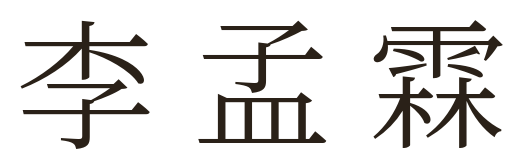
  </p>
  <p class="author-flap-role">編集・《莊子全解》</p>
  <p class="author-flap-body">出生於台灣。年少時不學無術，母親說以後長大應該是放牛吃草、撿牛屎賺錢。這幾年在人世中載浮載沉，見證過人性純粹的惡，也感受過美好。是個迷途的小書僮。</p>
  <p class="author-flap-body">未來打算寫一本結合 OECD 指引與各國判決的移轉訂價與預先訂價實務指南。（有時間的話）</p>
</section>
%%/RAW%%


<div class="pagebreak"></div>

%%RAW%%
<section class="epigraph-page">
  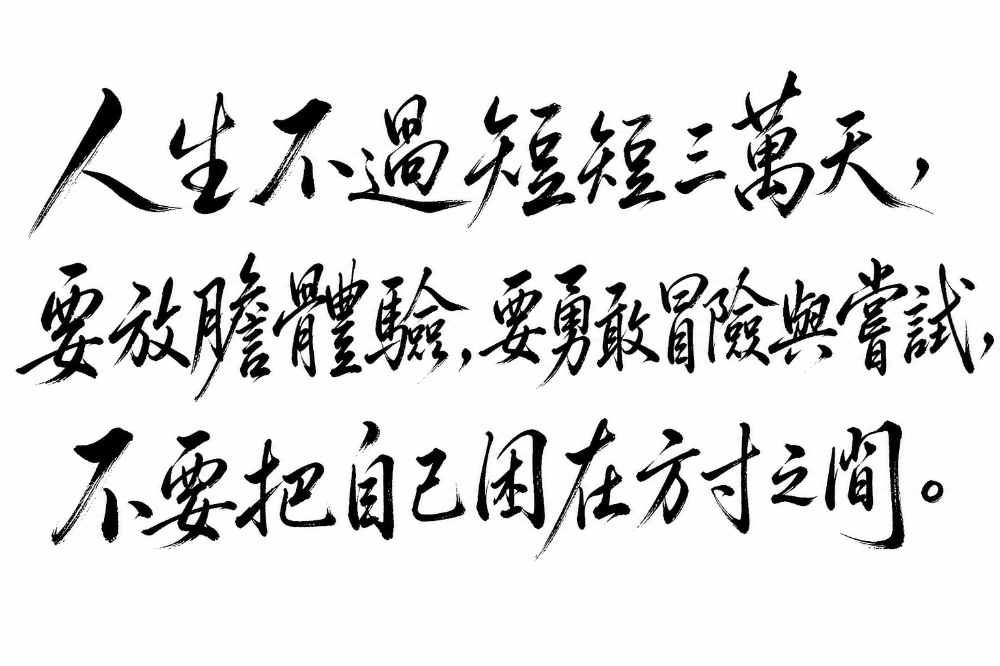
  <p class="calligraphy-fallback sr-only">人生不過短短三萬天，要放膽體驗，要勇敢冒險與嘗試，不要把自己困在方寸之間。</p>
</section>
%%/RAW%%


<div class="pagebreak"></div>

# 出版資訊

## 書名與版本

- **中文書名**：莊子全解
- **英文書名**：Zhuangzi Atlas
- **副標題**：原典・白話・哲學・人生智慧
- **編著者**：李孟霖編集
- **版本**：1.0.0（draft，尚未達出版級 review／published）
- **年份**：2026

## 編輯說明

本書依《莊子》內篇、外篇、雜篇順序編排，並於正文前附緒論（改編自專案〈導論〉）。各篇採固定結構：原典、白話、字詞、段落解析、歷代注家、哲學分析、比較閱讀、現代應用等，方便影印後依篇翻查。

內容分三層聲音，閱讀時請分開看待：

1. **原典**：標明篇名與版本依據之《莊子》引文。
2. **歷代注解**：郭象、成玄英等注家說法（標注家名）。
3. **本書現代詮釋**：哲學分析與人生應用（明標為詮釋，不可視為原文）。

## 引用版本

正文引文以郭慶藩《莊子集釋》所收通行本系統為準；異文與篇章真偽僅在影響解讀時提示。

## 免責聲明

- 本書之現代詮釋與人生應用，僅供閱讀與思考參考，**不構成法律、醫療、宗教或人生決策之指導**。
- 目前為 draft 成冊稿，文字仍可能修訂；若用於正式出版或課堂指定讀本，請以日後 review／published 版本為準。
- 請尊重原典與注家文獻；轉載本書現代詮釋文字時，請註明出處「莊子全解」。


<div class="pagebreak"></div>

# 《莊子全解》自序

台灣人的平均壽命約為80歲，這意味著40歲的我，已經站在了人生折返點。

回首這幾年，迎接女兒的新生，目睹父母的逐漸老化，經歷了自己的一場大病，再到送走阿公——生、老、病、死，彷彿在短時間內將人生「全餐」吃了一遍。記得那年躺在病床上，我曾發誓絕不再為了工作透支生命，可康復後，卻又下意識地加班到深夜才離去。也記得大伯與阿公臨終時，那瘦骨嶙峋、與往昔判若兩人的模樣，那種視覺上的衝擊，曾讓我陷入巨大的虛無：我們窮盡一生，到底在追求什麼？

當女兒出生，看著那個小生命努力睜開眼，第一次探索這個世界，我對她說：「嗨，歡迎來到這個世界。」那一刻，生命顯得無比神奇；但當阿公離世，站在棺木前，看著他因脫水而變得陌生，甚至難以辨識的容顏，我才驚覺，原來死亡並非電影裡的平靜安詳，而是如此赤裸且殘酷。

生命之於此，似乎就是這樣。走的時候，煙消雲散；走過一遭，連曾經穿過的衣物、蓋過的棉被，最終都將被捨棄。彷彿來過，卻沒帶走什麼，也沒留下什麼。在那一剎那，我隱約觸摸到了人生的底色。喔，原來這就是人生！

在職場浮沉多年，歷經挫折，我也見識了人性中純粹的惡，但也慶幸遇到了許多良善之人。面對情感與工作的磨難，我心中有過許多執著。為了尋找答案，我讀過《被討厭的勇氣》、《蛤蟆先生去看心理師》，也讀過《金剛經》。我不知道怎麼「課題分離」，也不確定如何「應無所住，而生其心」。直到遇見了《莊子》，我才在那些艱澀或平實的字句中，感受到靈魂的些許釋放與解惑。

然而，外人的詮釋終究隔了一層。與其一味汲取他人的觀點，不如由我親自記錄——記錄莊子的精神，如何真實地應用於現實的生活與工作。

這本《莊子全解》想做的事很單純：讓讀者在這一本書裡，依原典順序讀完三十三篇，而不是只撿幾句「人生金句」。

《莊子》難讀，往往不是因為文字古奧，而是因為它用寓言、重言、卮言說話，又被後世注家與現代勵志語層層覆蓋。因此，本書堅持三層分讀：

1. 先看**原典**寫了什麼；
2. 再看**注家**怎麼解；
3. 最後才讀本書的**現代詮釋**——後者是編者的哲學整理與人生應用，不是「莊子親口說」。

若你是第一次讀莊子，建議先讀緒論與內篇七篇，再依興趣進入外篇、雜篇。願這冊書能陪你把《莊子》，慢慢讀。這不僅是前人的智慧，更是指引我在人生折返點後，走得更從容的引路燈。

—— 莊子全解．李孟霖．2026 仲夏


<div class="pagebreak"></div>

# 緒論：如何閱讀《莊子》

> **閱讀提示**：本導論不是莊子原篇。原典引文均標明出處；注家意見與本書現代詮釋分列，不以後人語言冒充原文。

## 01. 篇名與背景

《莊子》不是一部可以用幾條「人生金句」讀完的書。它以寓言、重言、卮言穿插，時而辯論、時而戲謔、時而寫極深的死生經驗。這篇導論所要處理的，不是替讀者預先下結論，而是提供一張閱讀地圖：如何先辨文本，再入問題；如何既不把莊子讀成消極逃避，也不把它削成勵志語錄。

全書的中心關切可暫以四組問題表示：人如何不被功名、形體與成見困住？是非之爭有沒有更寬的視野？人在危險政治與人際關係中如何保全？面對變化、衰老與死亡，如何安頓？內篇七篇依次展開自由、齊同、養生、處世、德、死生與治道，並非零散名言的集合。

## 02. 成書背景

莊周約活動於戰國中期；列國競爭、遊說求仕、名辯興盛，正是「知」與「用」被高度競逐的時代。《莊子》三十三篇不大可能盡出一人之手。一般研究多將內篇七篇視為較接近莊周及其核心思想圈的文本；外篇、雜篇成分較複雜，可能有後學編入與不同支系聲音。這是閱讀的起點，不是貶抑：文本層次不同，問題與寫作時代也可能不同。

今本的定型與晉代郭象注本關係極深。郭象刪定為三十三篇，其注也深刻塑造後世理解；唐成玄英作疏，清郭慶藩《莊子集釋》廣收舊說，為今日常用考讀基礎。本書引文以郭慶藩所據通行本系統為準；異文與篇章真偽只在影響解讀時提示，不把學術爭議假裝成已定論。

## 03. 結構分析

本導論按「文本—方法—路線」行進：先建立成書與版本意識，再說明莊子獨特的寓言語言，最後把三十三篇與本專案的閱讀層次接起來。

### 結構圖

```text
戰國語境與成書層次
        ↓
內篇／外篇／雜篇的閱讀差異
        ↓
寓言、重言、卮言：不把話語當教條
        ↓
原典 → 注家 → 現代詮釋
        ↓
內篇七篇閱讀地圖 → 全書交叉閱讀
```

## 04. 原典

> 版本依據：郭慶藩《莊子集釋》所收通行本。以下引文分見〈寓言〉、〈天下〉、〈齊物論〉。

> 寓言十九，重言十七，卮言日出，和以天倪。

> 道術將為天下裂。

> 吹萬不同，而使其自己也，咸其自取，怒者其誰邪？

第一句說明《莊子》的說話方式：以故事寄託、以古人或權威之言加重、以隨境流出的話語應對。第二句提醒讀者，戰國思想已分流而爭；第三句則從風聲萬竅帶出萬物各有聲響、各自取其位置的問題。

> **原典位置**：〈寓言〉、〈天下〉、〈齊物論〉；本篇為編者導論，非《莊子》原有篇章。

## 05. 白話翻譯

「寓言十九」意謂全書多借故事寄意；「重言十七」常借古人、長者或他者之口增加分量；「卮言日出」則像自然傾注的酒器，隨時生發而不固著於一說。「道術將為天下裂」是說原本可通的道路與技藝，已被各家分割、各自執守。「吹萬不同」以風入萬竅而聲音不同為喻：差異確實存在，但不可立刻把自己的聲音當作唯一尺度。

## 06. 字詞註解

| 字詞 | 讀音／釋義 | 說明 |
|------|------------|------|
| 道術 | 關於道的學術、方術與治理之道 | 不只指單一宗教技術 |
| 內篇 | 今本前七篇 | 通常較受重視，仍須逐篇閱讀 |
| 外篇／雜篇 | 其餘二十六篇 | 文本年代與思想聲音較多樣 |
| 寓言 | 寄寓之言 | 非「虛構所以無真實價值」 |
| 重言 | 借重之言 | 常假託古人，須辨敘事策略 |
| 卮言 | 隨境流行之言 | 不可固定為僵硬命題 |
| 天倪 | 自然的分際、端倪 | 與〈齊物論〉的「兩行」相關 |

## 07. 段落解析

先講文本史，是為了防止把「莊子」當成沒有歷史的單一聲音；再講寓言，是為了防止把它讀成哲學教科書的定義集。兩步之後才談現代意義，因為若跳過文本與文脈，今日任何焦慮都可以硬套為「莊子早就說過」。

### 本書每篇怎麼讀（送印版建議）

不必每節都同等用力。實用順序如下：

1. **先讀 01–03、07**：知道這篇在講什麼、結構怎麼走。
2. **再讀 04–05**：對照原典與白話，跟著故事走，不必背條文。
3. **重點讀 07、09、13**：段落解析說「這段為何在這裡」；哲學分析與現代應用標明為本書詮釋，可同意可保留。
4. **08、10–12 當延伸**：注家與跨傳統比較，想深讀再翻；不必一次啃完。
5. **14–17 收尾**：常見誤解防踩雷；心智圖幫你回顧全篇。

內篇建議依次讀。〈逍遙遊〉問自由與有待，〈齊物論〉鬆動是非與成心，〈養生主〉以技藝談生命節度，〈人間世〉進入危險的人間，〈德充符〉反轉形殘與德全，〈大宗師〉處理真人與死生，〈應帝王〉把工夫推到政治。讀完內篇，再回看外、雜篇中同題反覆，較能看見差異而非急著統一。

外篇 **08–11**（駢拇→在宥）宜連讀：同一條「仁義外加、治術傷性」的批判線。雜篇 **23–26**（庚桑楚→外物）宜連讀：從「求道太急」到「外物不可必、得意忘言」。

### 全書三十三篇閱讀地圖（V1.0 送印版）

以下按部類標出各篇在整體論述中的位置，供交叉閱讀；不必一次讀完，但宜知道「這篇在回應什麼」。

**內篇（01–07）**是理解全書的樞紐。〈逍遙遊〉開出自由與[無待](content/terms/無待.md)的問題；〈齊物論〉以[天籟](content/terms/齊物.md)與[成心](content/terms/成心.md)鬆動是非；〈養生主〉以[緣督](content/terms/緣督以為經.md)談技藝與生命節度；〈人間世〉進入危局中的[心齋](content/terms/心齋.md)工夫；〈德充符〉反轉形貌與德；〈大宗師〉以[真人](content/terms/真人.md)與死生相忘；〈應帝王〉把問題推到治道。讀畢內篇，你已具備閱讀外、雜篇的「母語」。

**外篇（08–22）**多沿內篇主題展開，但語氣更尖、材料更雜。**08–11** 批判仁義外加與治術傷性；**12–14** 談天地、天道、天運與政治秩序；**15–16** 對照刻意修養與繕性；**17** 〈秋水〉以小大之辯再論尺度；**18–20** 處理至樂、達生、山木等生死與材不材；**21–22** 以田子方、知北遊收束形神與「道不可言」的張力。外篇不宜逐篇孤立：同一概念（如[無為](content/terms/無為.md)）在不同篇中可能有不同語氣，正宜對照。

**雜篇（23–33）**成分最複雜，宜帶文本史意識。**23–27** 偏工夫與言說：庚桑楚的衛生、徐無鬼的相馬、則陽的蝸角、外物的不可必、寓言的自述文體。**28–30** 文體戲劇化：讓王、盜跖、說劍——讀前先看文類說明，勿把角色台詞當作者教條。**31–33** 為全書收束：漁父論真、列御寇論虛與死、天下為思想地圖。讀〈天下〉前，建議至少讀過內篇與〈寓言〉，否則「寓言十九」等自陳難以著陸。

### 與本專案百科的接軌

本網站除篇章外，另有[人物](content/figures/_index.md)、[名詞](content/terms/_index.md)、[主題](content/themes/_index.md)與[思想地圖](content/maps/思想地圖.md)。讀到〈逍遙遊〉中的[許由](content/figures/許由.md)、〈秋水〉中的[河伯](content/figures/河伯.md)，或全書反覆出現的[惠施](content/figures/惠施.md)，可點入條目看跨篇脈絡。主題條目如[自由與無待](content/themes/自由與無待.md)、[語言與真實](content/themes/語言與真實.md)、[死亡與喪親](content/themes/死亡與喪親.md)，則把分散在各篇的線索收成可追蹤的網絡。導論的任務之一，就是讓讀者知道：篇章是主幹，百科是索引與橋樑。

## 08. 歷代注家怎麼看

### 郭象

郭象以「自生」「獨化」解釋萬物，重視各物適其性分。其注使《莊子》成為魏晉玄學核心文本；優點是看見差異不必化為高下，限制是若只讀成「各安其分」，可能削弱原文對成心與權力的反詰。

### 成玄英

成玄英《南華真經注疏》承郭而加以疏通，常以遣執、虛通說明寓言。他的章句分疏有助於追蹤論述；但唐代道教語彙亦會帶入後起的修行框架，讀者宜辨其時代。

### 林希逸

林希逸《莊子口義》重文章脈絡與日常可理解性，特別適合初讀者。他提醒莊子多用奇譎誇飾來「寄言」，不宜將鯤鵬、神人逐項當作實錄。

### 其他重要注家

王先謙《莊子集解》便於字句對讀；郭慶藩《莊子集釋》是查古注與異文的重要門徑。近人陳鼓應、王邦雄、錢穆等各有哲學史、生命實踐或義理解讀；本書採取可核對原文、標出詮釋層次的方式與之對話。

## 09. 哲學分析

> 以下為**本書現代詮釋**。

讀《莊子》可守三個原則。第一，先問「這段話在故事裡反對什麼」，再問它能支持什麼；莊子常以反問與反轉破除既有答案。第二，區分「相對性」與「什麼都一樣」：齊物不是取消痛苦、是非與責任，而是拒絕把有限立場絕對化。第三，將「道」理解為一種使萬物變化得以展開的視野，不急著把它實體化為一個神祕物件。

本專案採三層標記：**原典**提供可查的文字與位置；**歷代注家**呈現可追溯的傳統解釋；**現代詮釋**才把概念帶入今日。三層可以互相照亮，不能互相冒名。

更具體地說：當你讀到「莊子說逍遙」，應先問——這是〈逍遙遊〉哪一段原典？郭象如何注？成玄英如何疏？本書「哲學分析」又在哪一層？若把郭象的「適性」直接當成戰國莊周的原話，或把本書的現代應用倒填為「莊子職場心法」，都違反閱讀倫理。V1.0 全書三十三篇已依此體例完稿：每篇固定十七節（導論結構略異但聲音分層相同），便於對照練習。

另一項哲學提醒：莊子常使用**反轉**與**弔詭**（如「言無言」「無用之用」），其功能往往是鬆動讀者既有的概念框架，而非提供可背誦的新定義。讀到矛盾句時，先問它在故事脈絡中反對什麼，再問它能否支持什麼——這比急著「調和矛盾」更接近原典的運作方式。

## 10. 與老子比較

《老子》與《莊子》都警惕強作、尚名與人為過度，皆談道、無為、自然。然而《老子》常以短章處理治術與反向策略；《莊子》則以長篇寓言、人物對話與感官形象鬆動讀者的立場。兩者有親緣，不能以「老莊」一詞抹平差別。

## 11. 與儒家比較

儒家以仁義、禮樂、學習與公共責任安頓人生；《莊子》則反覆追問：名分與善意一旦僵化，是否反而傷生？這不等於莊子沒有倫理關切。〈人間世〉關心受害者與危險政治，〈德充符〉拒絕以外形判人；它提供的是對既有規範的內部壓力測試。

## 12. 與佛學比較

後世讀者常將「忘我」「齊物」與佛教破執相聯。兩者都可用來反省執取，但歷史系統、苦集滅道與解脫目標並不相同。比較只能作為跨傳統對話，不能把《莊子》提前說成佛學，也不能以佛學術語取代原文。

## 13. 現代人生應用

> 以下為**現代詮釋**，不是「莊子職場守則」。

面對資訊與意見衝突，可先辨自己的「成心」：我以什麼身分、利益、恐懼在判斷？面對職涯競爭，可從「有待」檢查自己是否只靠職稱與評價維持價值。面對關係衝突，可借「兩行」暫停把對方壓成單一標籤。這些練習不替代制度改革、醫療或求助；莊子的用處是增加看見困局結構的空間。

**送印版提醒**：本書各篇以「跟著原典順序讀懂故事」為第一目標，學術比較與注家分歧是輔助，不是考試範圍。若某一節讀起來吃力，先跳過 08、10–12，讀完 15 本篇總結再決定要不要回頭。

### 電子書與網站並用

紙本或 PDF 適合連續深讀；網站則便於跳轉交叉引用與主題索引。建議：第一遍跟篇章順序走，第二遍用主題條目（如[名與利](content/themes/名與利.md)、[工作與技道](content/themes/工作與技道.md)）做橫向閱讀，看同一問題在不同篇如何變奏。〈盜跖〉與〈漁父〉都談「真偽」，但文類與結論方向不同——橫讀最能看見這種差異。

### 寫作與教學場景

若你要引用本書段落：請標明篇章、節次與「原典／注家／現代詮釋」層次。課堂討論可採「先讀 04–05 原典白話，再辯 09 與 14」：讓學生練習區分文本與詮釋，而不是競賽誰背得最多金句。莊子不是勵志語錄庫；導論希望讀者帶著方法進入，而不是帶著結論進入。

## 14. 常見誤解

1. **「齊物就是沒有對錯」**：它先追問判斷的立足點，不是替暴力與欺騙免責。  
2. **「無為就是不做事」**：無為反對妄為與強制，不等於放棄回應。  
3. **「寓言不是真的，所以不用認真」**：寓言以不直說的方式逼近問題，正須讀其安排。  
4. **「莊子只有出世」**：內篇大量書寫在世的風險、身體與政治，並未逃開人間。  

## 15. 本篇總結

讀《莊子》，先把它放回戰國與傳本脈絡，再跟著寓言的轉折走；先分辨原典、注家與當代詮釋，再討論它能否照見今日。這種讀法不會立刻給你一句答案，卻能避免讓任何一句話成為新的牢籠。

## 16. 心智圖

```text
文本層次：內篇／外篇／雜篇 → 傳本與注疏
閱讀方法：寓言／重言／卮言 → 追問脈絡
核心問題：自由｜是非｜養生｜處世｜死生｜治道
三層聲音：原典 → 注家 → 現代詮釋
```

## 17. 延伸閱讀

- 郭慶藩《莊子集釋》
- 成玄英《南華真經注疏》
- 林希逸《莊子口義》
- 陳鼓應《莊子今註今譯》
- 王邦雄《莊子內七篇‧外秋水‧雜天下的現代解讀》
- A. C. Graham, *Chuang-tzu: The Inner Chapters*（英文選讀）

---

### 交叉引用

- 相關篇章：〈逍遙遊〉、〈齊物論〉、〈人間世〉、〈大宗師〉、〈天下〉、〈寓言〉
- 相關人物：[莊周](content/figures/莊周.md)、[老聃](content/figures/老聃.md)、郭象、成玄英、林希逸
- 相關名詞：[道](content/terms/道.md)、[寓言](content/terms/寓言.md)、[卮言](content/terms/卮言.md)、[重言](content/terms/重言.md)、[成心](content/terms/成心.md)、[無為](content/terms/無為.md)
- 相關主題：[自由與無待](content/themes/自由與無待.md)、[語言與真實](content/themes/語言與真實.md)、[政治與無為](content/themes/政治與無為.md)
- 相關地圖：[思想地圖](content/maps/思想地圖.md)


<div class="pagebreak"></div>

%%RAW%%
<nav class="toc" id="目錄-wrap">
<h1 id="目錄">目錄</h1>
<ul class="toc-list toc-front">
<li class="toc-row" data-target="莊子全解自序"><a href="#莊子全解自序">自序</a><span class="toc-dots" aria-hidden="true"></span><span class="toc-page"></span></li>
<li class="toc-row" data-target="緒論"><a href="#緒論">緒論：如何閱讀《莊子》</a><span class="toc-dots" aria-hidden="true"></span><span class="toc-page"></span></li>
</ul>
<h2 class="toc-part">內篇</h2>
<ul class="toc-list">
<li class="toc-row" data-target="逍遙遊"><a href="#逍遙遊">01　〈逍遙遊〉</a><span class="toc-dots" aria-hidden="true"></span><span class="toc-page"></span></li>
<li class="toc-row" data-target="齊物論"><a href="#齊物論">02　〈齊物論〉</a><span class="toc-dots" aria-hidden="true"></span><span class="toc-page"></span></li>
<li class="toc-row" data-target="養生主"><a href="#養生主">03　〈養生主〉</a><span class="toc-dots" aria-hidden="true"></span><span class="toc-page"></span></li>
<li class="toc-row" data-target="人間世"><a href="#人間世">04　〈人間世〉</a><span class="toc-dots" aria-hidden="true"></span><span class="toc-page"></span></li>
<li class="toc-row" data-target="德充符"><a href="#德充符">05　〈德充符〉</a><span class="toc-dots" aria-hidden="true"></span><span class="toc-page"></span></li>
<li class="toc-row" data-target="大宗師"><a href="#大宗師">06　〈大宗師〉</a><span class="toc-dots" aria-hidden="true"></span><span class="toc-page"></span></li>
<li class="toc-row" data-target="應帝王"><a href="#應帝王">07　〈應帝王〉</a><span class="toc-dots" aria-hidden="true"></span><span class="toc-page"></span></li>
</ul>
<h2 class="toc-part">外篇</h2>
<ul class="toc-list">
<li class="toc-row" data-target="駢拇"><a href="#駢拇">08　〈駢拇〉</a><span class="toc-dots" aria-hidden="true"></span><span class="toc-page"></span></li>
<li class="toc-row" data-target="馬蹄"><a href="#馬蹄">09　〈馬蹄〉</a><span class="toc-dots" aria-hidden="true"></span><span class="toc-page"></span></li>
<li class="toc-row" data-target="胠篋"><a href="#胠篋">10　〈胠篋〉</a><span class="toc-dots" aria-hidden="true"></span><span class="toc-page"></span></li>
<li class="toc-row" data-target="在宥"><a href="#在宥">11　〈在宥〉</a><span class="toc-dots" aria-hidden="true"></span><span class="toc-page"></span></li>
<li class="toc-row" data-target="天地"><a href="#天地">12　〈天地〉</a><span class="toc-dots" aria-hidden="true"></span><span class="toc-page"></span></li>
<li class="toc-row" data-target="天道"><a href="#天道">13　〈天道〉</a><span class="toc-dots" aria-hidden="true"></span><span class="toc-page"></span></li>
<li class="toc-row" data-target="天運"><a href="#天運">14　〈天運〉</a><span class="toc-dots" aria-hidden="true"></span><span class="toc-page"></span></li>
<li class="toc-row" data-target="刻意"><a href="#刻意">15　〈刻意〉</a><span class="toc-dots" aria-hidden="true"></span><span class="toc-page"></span></li>
<li class="toc-row" data-target="繕性"><a href="#繕性">16　〈繕性〉</a><span class="toc-dots" aria-hidden="true"></span><span class="toc-page"></span></li>
<li class="toc-row" data-target="秋水"><a href="#秋水">17　〈秋水〉</a><span class="toc-dots" aria-hidden="true"></span><span class="toc-page"></span></li>
<li class="toc-row" data-target="至樂"><a href="#至樂">18　〈至樂〉</a><span class="toc-dots" aria-hidden="true"></span><span class="toc-page"></span></li>
<li class="toc-row" data-target="達生"><a href="#達生">19　〈達生〉</a><span class="toc-dots" aria-hidden="true"></span><span class="toc-page"></span></li>
<li class="toc-row" data-target="山木"><a href="#山木">20　〈山木〉</a><span class="toc-dots" aria-hidden="true"></span><span class="toc-page"></span></li>
<li class="toc-row" data-target="田子方"><a href="#田子方">21　〈田子方〉</a><span class="toc-dots" aria-hidden="true"></span><span class="toc-page"></span></li>
<li class="toc-row" data-target="知北遊"><a href="#知北遊">22　〈知北遊〉</a><span class="toc-dots" aria-hidden="true"></span><span class="toc-page"></span></li>
</ul>
<h2 class="toc-part">雜篇</h2>
<ul class="toc-list">
<li class="toc-row" data-target="庚桑楚"><a href="#庚桑楚">23　〈庚桑楚〉</a><span class="toc-dots" aria-hidden="true"></span><span class="toc-page"></span></li>
<li class="toc-row" data-target="徐無鬼"><a href="#徐無鬼">24　〈徐無鬼〉</a><span class="toc-dots" aria-hidden="true"></span><span class="toc-page"></span></li>
<li class="toc-row" data-target="則陽"><a href="#則陽">25　〈則陽〉</a><span class="toc-dots" aria-hidden="true"></span><span class="toc-page"></span></li>
<li class="toc-row" data-target="外物"><a href="#外物">26　〈外物〉</a><span class="toc-dots" aria-hidden="true"></span><span class="toc-page"></span></li>
<li class="toc-row" data-target="寓言"><a href="#寓言">27　〈寓言〉</a><span class="toc-dots" aria-hidden="true"></span><span class="toc-page"></span></li>
<li class="toc-row" data-target="讓王"><a href="#讓王">28　〈讓王〉</a><span class="toc-dots" aria-hidden="true"></span><span class="toc-page"></span></li>
<li class="toc-row" data-target="盜跖"><a href="#盜跖">29　〈盜跖〉</a><span class="toc-dots" aria-hidden="true"></span><span class="toc-page"></span></li>
<li class="toc-row" data-target="說劍"><a href="#說劍">30　〈說劍〉</a><span class="toc-dots" aria-hidden="true"></span><span class="toc-page"></span></li>
<li class="toc-row" data-target="漁父"><a href="#漁父">31　〈漁父〉</a><span class="toc-dots" aria-hidden="true"></span><span class="toc-page"></span></li>
<li class="toc-row" data-target="列御寇"><a href="#列御寇">32　〈列御寇〉</a><span class="toc-dots" aria-hidden="true"></span><span class="toc-page"></span></li>
<li class="toc-row" data-target="天下"><a href="#天下">33　〈天下〉</a><span class="toc-dots" aria-hidden="true"></span><span class="toc-page"></span></li>
</ul>
<ul class="toc-list toc-back">
<li class="toc-row" data-target="後記"><a href="#後記">後記</a><span class="toc-dots" aria-hidden="true"></span><span class="toc-page"></span></li>
<li class="toc-row" data-target="版權頁"><a href="#版權頁">版權頁</a><span class="toc-dots" aria-hidden="true"></span><span class="toc-page"></span></li>
</ul>
</nav>
%%/RAW%%


<div class="pagebreak"></div>

<!-- part: 內篇 id: 01 -->

# 逍遙遊

> **閱讀提示**：本篇依原文脈絡展開。文中區分三層聲音——**原典**、**歷代注家**、**本書現代詮釋**。現代應用與哲學分析屬詮釋，不偽托為莊子原文原意。

## 01. 篇名與背景

〈逍遙遊〉為《莊子》內篇第一篇，也是全書最常被單獨閱讀的篇章。「逍遙」言精神之自在往來；「遊」不只是遊歷山水，更是心靈在世界中的活動方式。篇名合起來，問的是：人如何在變化不已的世界裡，真正自在地「遊」？

本篇在全書中的位置極關鍵：它先立下「小大」「有待／無待」「無用之用」等問題框架，其後〈齊物論〉深化是非相對，〈人間世〉談處世，〈大宗師〉談真人與死生，多可回扣此處已埋下的線頭。若把《莊子》比作一座思想建築，〈逍遙遊〉是大門與總綱。

> **原典位置**：內篇・第一篇・〈逍遙遊〉

## 02. 成書背景

《莊子》成書非一時一人之筆。學界通說：內七篇較接近莊周本人或其核心弟子之思想風格；外、雜篇則多有後學擴充、改編。〈逍遙遊〉屬內篇，文學張力與概念密度皆高，歷來視為理解莊學的入口。

戰國中晚期，列國爭戰、游士遊說、名辯大盛。人一方面追求功名與確定答案，一方面又常陷入比較、焦慮與自我束縛。〈逍遙遊〉以寓言破「小成」之見：不是教人逃跑，而是揭示——許多自以為的「自由」，其實仍依賴條件（有待）。

文本流傳上，今本多據晉郭象注本系統；清人郭慶藩《莊子集釋》彙聚舊注，是現代閱讀常用底本之一。本篇引文以通行本為準，標點與用字或有版本差異，重要異讀於註解中說明。

## 03. 結構分析

本篇並非散漫故事集，而有清楚的「升進」節奏：先以極端的大（鯤鵬）打開視野，再以小（蜩、學鳩）對照，破除以自我尺度衡量世界；接著由「小年大年」推到壽命與見識的相對；再由宋榮子、列子說明「猶有所待」；最後點出「至人無己，神人無功，聖人無名」。後半則以堯舜許由、藐姑射神人、以及惠子論大瓠／大樹，把抽象的「無待」落到政治姿態與「無用之用」。

### 結構圖

```text
北冥鯤 → 化而為鵬 → 圖南
        ↓
   蜩與學鳩笑之（小知笑大知）
        ↓
   朝菌／蟪蛄 vs 冥靈／大椿（小年大年）
        ↓
   宋榮子（猶有未樹）→ 列子御風（猶有所待）
        ↓
   至人無己／神人無功／聖人無名
        ↓
   許由卻天下 → 藐姑射神人
        ↓
   惠子：大瓠、大樹 → 無用之用
```

若用一句話總括結構：**由「大」破「小」，由「有待」推向「無待」，由「有用」翻轉為「無用之用」。**

## 04. 原典

> 版本依據：通行本《莊子》；註釋參考郭慶藩《莊子集釋》、成玄英疏、陳鼓應《莊子今註今譯》等。以下為**必要引用**，非全篇逐字照錄。

### （一）開篇：鯤鵬圖南

> 北冥有魚，其名為鯤。鯤之大，不知其幾千里也。化而為鳥，其名為鵬。鵬之背，不知其幾千里也；怒而飛，其翼若垂天之雲。是鳥也，海運則將徙於南冥。南冥者，天池也。

### （二）小知笑大知

> 蜩與學鳩笑之曰：「我決起而飛，搶榆枋，時則不至而控於地而已矣，奚以之九萬里而南為？」

### （三）小年大年

> 朝菌不知晦朔，蟪蛄不知春秋，此小年也。楚之南有冥靈者，以五百歲為春，五百歲為秋；上古有大椿者，以八千歲為春，八千歲為秋。而彭祖乃今以久特聞，眾人匹之，不亦悲乎！

### （四）有所待

> 夫列子御風而行，泠然善也，旬有五日而後反。彼於致福者，未數數然也。此雖免乎行，猶有所待者也。若夫乘天地之正，而御六氣之辯，以遊無窮者，彼且惡乎待哉！故曰：至人無己，神人無功，聖人無名。

### （五）無用之用（節錄）

> 今子有大樹，患其無用，何不樹之於無何有之鄉，廣莫之野，彷徨乎無為其側，逍遙乎寢臥其下？不夭斤斧，物無害者，無所可用，安所困苦哉！

## 05. 白話翻譯

### （一）鯤鵬

北海有一條魚，名字叫鯤。鯤非常大，不知道有幾千里。牠變化成鳥，名字叫鵬。鵬的背也不知道有幾千里；奮起而飛時，翅膀像掛在天邊的雲。這隻鳥，要等海風鼓動，才遷徙到南海——南海，就是天池。

### （二）蜩與學鳩

蟬和學鳩嘲笑牠說：「我們一下子起飛，碰到榆樹、枋樹就停；有時飛不到，就掉回地上罷了。何必飛到九萬里之外的南方去呢？」

### （三）小年大年

朝生暮死的菌類，不知道一個月的終始；夏生秋死的寒蟬，不知道春秋，這叫「小年」。楚國南方有冥靈樹，以五百年為春、五百年為秋；上古有大椿，以八千年為春、八千年為秋。彭祖如今因長壽特別出名，眾人拿他來比較，不也可悲嗎？

### （四）列子與無待

列子駕風而行，輕妙可喜，十五天後回來。他對求福這件事，並不汲汲營營。可是這雖然免於步行，**仍有所依賴**。至於順天地之正理、應六氣之變化，而遊於無窮的人——他還依賴什麼呢？所以說：至人無己，神人無功，聖人無名。

### （五）大樹

現在你有一棵大樹，擔心它無用，為什麼不把它種在「無何有之鄉」、廣漠的原野？在它旁邊徘徊無為，在它下面逍遙躺臥。它不會被斧頭砍伐，也沒有東西傷害它——因為沒什麼用，又哪來困苦呢？

## 06. 字詞註解

| 字詞 | 讀音／釋義 | 說明 |
|------|------------|------|
| 逍遙 | 自在、無掛礙地往來 | 篇名核心；非「玩樂」之義 |
| 遊 | 遊於世、遊於心 | 活動方式，不只地理旅行 |
| 鯤／鵬 | 寓言中的巨魚、巨鳥 | 極寫「大」，用以破「小知」 |
| 北冥／南冥 | 北海／南海 | 「冥」通「溟」，深廣之海 |
| 怒而飛 | 奮力而飛 | 「怒」為振奮，非憤怒 |
| 海運 | 海風鼓動、海水運動 | 鵬徙所需之條件 |
| 蜩 | 蟬 | 與學鳩同屬「小知」形象 |
| 學鳩 | 小鳩一類 | 以近距飛躍自足 |
| 槍榆枋 | 觸及榆、枋 | 形容飛行範圍極小 |
| 朝菌 | 朝生暮死之菌 | 「小年」之喻 |
| 蟪蛄 | 寒蟬之類 | 不知春秋 |
| 冥靈／大椿 | 長壽之樹 | 「大年」之喻 |
| 御風 | 駕風而行 | 列子之能，仍「有待」 |
| 有所待 | 有所依賴、有條件 | 本篇關鍵概念 |
| 六氣 | 陰陽風雨晦明等 | 自然變化之總稱 |
| 至人無己 | 至人不執著自我 | 與「無待」相應 |
| 神人無功 | 神人不居功 | 非追求功績 |
| 聖人無名 | 聖人不求名 | 名亦是一種「待」 |
| 無何有之鄉 | 什麼都沒有的地方 | 象徵不受「有用」邏輯支配之處 |
| 無用之用 | 看似無用，恰成保全與自在 | 篇末與惠子辯的收束 |

## 07. 段落解析


**走讀路線**：鯤鵬圖南 → 小大之辯 → 列子猶有待 → 至人無己／惠子大瓠。關鍵句：**無待**。

### 第一段：為何先寫鯤鵬？

原文不以定義開場，而以「大得過頭」的形象開場。這是敘事策略：**先讓讀者的尺度失效**。若一開始就講「無待」，抽象概念容易落空；先讓人感到「原來世界可以大到這種程度」，後面蜩鳩的嘲笑才顯得可笑，也才顯得可悲。

與上下文關係：鯤鵬是「問題的放大器」。它不是要你去當大鵬，而是要你看見——自己習慣用「我飛多高、我走多遠」來衡量一切。

### 第二段：蜩鳩之笑在說什麼？

蜩與學鳩並非單純愚蠢，而是**以自身經驗為絕對標準**。它們的飛行能力與鵬不同，這本身不是錯；錯在把「對我夠用」擴張成「對你多餘」。這正是小知笑大知的結構：比較來自尺度，尺度來自自我中心。

為何寫在這裡：承接鯤鵬之後，立即給出反題。讀者若只崇拜「大」，仍會落入另一種執著；莊子要破的是「以己度人」的封閉。

### 第三段：小年大年——時間尺度的相對

朝菌、蟪蛄與冥靈、大椿，把「大小」從空間轉到時間。彭祖長壽被眾人欽羨，莊子卻說「不亦悲乎」——悲的不是短命，而是**用單一尺度比較生命**。壽命、成就、名聲，一旦成為唯一坐標，人就永遠活在「不夠」裡。

與前後文：這一段把「小大之辯」普遍化：不只鳥飛得高低，連「什麼叫長久」都相對。為後文「有待」鋪路——人若依賴某個固定尺度，就會被尺度綁住。

### 第四段：宋榮子與列子——進階仍可能有待

宋榮子能做到「舉世譽之而不加勸，舉世非之而不加沮」，已遠超眾人；然而原文說他「猶有未樹也」。列子御風，已近乎神技，仍「猶有所待」——依賴風。

這是本篇最精密的轉折：**進步不等于無待**。能力更強、評價更穩、移動更省力，都可能只是「更高級的依賴」。真正的問題不是「你有多強」，而是「你還靠什麼才能覺得自己自由」。

然後才落到綱領句：乘天地之正、御六氣之辯、以遊無窮——彼且惡乎待哉。並以三句收束人格理想：至人無己，神人無功，聖人無名。

### 第五段：許由與藐姑射——把無待放進政治與生命形象

堯讓天下於許由，許由拒絕。這裡不是簡單歌頌隱士清高，而是質問：**把天下當成可授可受的「名器」，本身是否已落入「有名／有功」的邏輯？** 藐姑射神人則以極度詩意的形象，展示一種不被世俗功名灼傷的生命狀態（肌膚若冰雪、綽約若處子……）。對現代讀者，重點不在「真有神仙」，而在莊子如何用形象語言逼近「無待」的體驗。

### 第六段：惠子與無用之用——收束到人生實踐

惠子以大瓠、大樹譏莊子之言「大而無用」。莊子反問：無用，是否必然是失敗？大樹因無用而免於斤斧，人若只追求「被系統認定有用」，也可能活成永遠可被切割的材料。

「無何有之鄉」不是叫人躺平，而是指出：**「有用」常常是別人的尺子**；若人生只為符合尺子，就很難逍遙。此段與開篇呼應——開篇破小知的尺子，結尾破「有用」的尺子。

## 08. 歷代注家怎麼看

### 郭象

郭象注《莊子》，對後世影響極大。其核心詮釋傾向是「適性逍遙」：萬物各有其性，能安於自性、足於其性，便可逍遙；鵬飛九萬里與蜩鳩槍榆枋，若各適其性，皆可逍遙。此說強調「差異並存」，緩和了「大優於小」的讀法。

**本書提醒**（現代詮釋）：郭象之說有助避免把莊子讀成「必須變大鵬」；但也有學者批評，若過度「安分即逍遙」，可能削弱原文對「小知自以為是」的批判力。讀〈逍遙遊〉時，宜同時看見「破封閉尺度」與「不全然否定差異」兩面。

### 成玄英

成玄英疏多承郭象而更重義理疏通，常以「理」「性」解釋逍遙，並細化寓言中的修行意味。對「無己、無功、無名」，成疏傾向從去除執著、回歸自然之性來理解。對初學者，成疏的好處是條理清楚；需注意唐代疏解有時會帶入更強的工夫論語言。

### 林希逸

林希逸《莊子口義》以較近白話的方式講解，重視文脈與文氣。他往往提醒讀者：莊子善用誇飾與寓言，不可句句坐實為博物記載。對鯤鵬、藐姑射等，林氏多從「寄言」理解——這對現代出版導讀特別有用：先通文氣，再入哲理。

### 其他重要注家

- **王先謙《莊子集解》**：簡明，便於對照字句。
- **郭慶藩《莊子集釋》**：舊注彙編，查考異文與古注的重要工具。
- **今人**：陳鼓應重義理疏通與白話可讀；王邦雄重生命體證與通貫；傅佩榮重概念澄清與現代對話。本專案定位是吸收諸家之長，但**不混寫為同一聲音**。

## 09. 哲學分析

> 以下為**本書現代詮釋**，用於建立可檢索的概念網絡；請與原典、注家分開閱讀。

### 9.1 核心命題：逍遙的條件是什麼？

本篇最容易被誤讀成「追求更大的成功」或「什麼都不要」。更精確的問題是：**自由是否以「不依賴某個條件」來定義？**

- **有待**：自由建立在條件上（風、名、評價、有用、比較尺度）。
- **無待**：不是什麼條件都沒有的真空，而是不被某一條件綁死；能順天地之正、應變化而遊。

因此，「無待」不是能力歸零，而是**依賴結構的鬆綁**。

### 9.2 小大之辯：不是比大小，是比尺度

鯤鵬與蜩鳩的對立，表面是大與小，實際是「開放尺度」與「封閉尺度」。小知的悲劇，不在飛得低，而在**無法想像另有世界**。哲學上，這接近一種認識論提醒：我們的判斷，常被經驗邊界秘密規定。

### 9.3 三句綱領：無己、無功、無名

| 概念 | 所破之執 | 現代轉譯（詮釋） |
|------|----------|------------------|
| 無己 | 自我中心、自我證明 | 不把「我是否比較強」當唯一問題 |
| 無功 | 功績崇拜 | 不把「做出可見成績」當唯一價值 |
| 無名 | 名聲與標籤 | 不把「被看見、被命名」當唯一存在感 |

三者不是叫人變空洞，而是指出：己、功、名一旦成為「待」，人就難以逍遙。

### 9.4 無用之用：對「有用性暴政」的反擊

「有用」在社會中常由權力、市場、效率定義。莊子並非否定一切技能與貢獻，而是揭示：若「有用」成為唯一合法語言，人會恐懼無用，並因此失去自我安置的空間。大樹之喻說明——有時「不被系統徵用」，反而是存活與自在的條件。

### 9.5 接入思想地圖

```text
道
 └─ 無待
     ├─ 逍遙（本篇總題）
     ├─ 無己／無功／無名
     └─ 無用之用
         └─（後文可連）心齋、坐忘、緣督以為經
```

## 10. 與老子比較

《老子》重「無為」「柔弱」「知足」「不爭」，與〈逍遙遊〉的「無待」「無名」有家族相似性：都警惕過度 intervening、過度自我擴張。

差異在於表達與重心：

- 老子更常以「道」的形上語言與治術智慧說話（如「為學日益，為道日損」）。
- 〈逍遙遊〉更以寓言戲劇化「尺度」與「依賴」問題，文學性強，個人精神自由的色彩更鮮明。

可並讀：老子的「無為」，助理解莊子為何不把「強作」當自由；莊子的「無待」，則把自由問題推進到心理依賴與社會評價機制。

## 11. 與儒家比較

儒家重視名分、修身、經世，「有用」於人倫與政治是正面價值。〈逍遙遊〉許由卻天下、無功無名，看起來像直接反儒家。

更細的讀法是：莊子未必否定一切倫理責任，而是警告——當「名」與「功」成為自我綁架，連善也可能異化。儒家求「立人」，莊子問「人是否先被尺子立住」。兩者可緊張對話，而不必化約成「出世 vs 入世」口號。

## 12. 與佛學比較

後世常以「破執」讀莊子，與佛教「我執」「法執」話語易發生對話。〈逍遙遊〉之「無己」，確實可與「破我執」互參。

但需謹慎：

1. 《莊子》與佛教非同一系統，不可把鯤鵬直接譯成禪宗公案。
2. 「無待」不等于涅槃；「逍遙」不等于解脫論的完整結構。
3. 若作比較，宜標明為**跨傳統詮釋**，並回扣原文「有待／無待」本身。

本篇暫以「可對話、勿等同」為原則。

## 13. 現代人生應用

> 以下皆為**現代詮釋**，用於把概念轉成可操作的自我觀察，不是莊子「教你職場心法」的原話。

### 13.1 焦慮與比較

蜩鳩笑鵬，很像社群媒體上的相互丈量：以自己的軌道否定別人的軌道，或以別人的軌道羞辱自己。練習問題：

- 我現在用來評價自己的「尺子」是什麼？
- 這把尺子是我選擇的，還是環境塞給我的？

### 13.2 升遷與成功

列子御風「猶有所待」提醒：職位、資源、平台都可能是「風」。升遷本身不必否定；要問的是——若風停了，我是否仍覺得自己存在？無功、無名不是禁止成就，而是防止成就變成唯一氧氣。

### 13.3 財富與「有用」

惠子式焦慮是：「這麼大，為什麼不能變現？」現代對應是把一切（休息、學習、關係、身體）都折算成生產力。無用之用提供另一個問題：有沒有一塊「不被績效徵用」的生活空間？若完全沒有，人很容易「有用到耗盡」。

### 13.4 自由的自我檢測（三問）

1. 我最依賴什麼，才覺得自己還可以？
2. 我最害怕被說成什麼（沒用、失敗、沒名）？
3. 若不比較，我下一步仍想做什麼？

這三問不是標準答案，而是把「有待」從概念變成可觀察的經驗。

## 14. 常見誤解

1. **「逍遙＝躺平」**  
   原文強調的是鬆綁依賴與封閉尺度，不是否定一切行動。乘天地之正、遊於無窮，仍是一種高度的生命主動性。

2. **「要成為大鵬才算成功」**  
   若如此讀，只是把小知的尺子換成大知的尺子。重點是看見尺子本身。

3. **「無用＝什麼都不要做」**  
   「無用之用」針對的是「有用性暴政」，不是鼓勵放棄技能與責任。

4. **「無己＝沒有自我」**  
   更貼近的理解是：不執著以自我為中心的證明遊戲，而非人格消滅。

5. **「莊子反社會」**  
   本篇有許由、神人等形象，但也透過與惠子對話，重新回到人如何在世間安置自己。批判的是僵化價值，而非人必須離群。

## 15. 本篇總結

〈逍遙遊〉以寓言層層推進，核心不是炫博神話，而是追問自由的條件。鯤鵬打開尺度，蜩鳩暴露封閉，小年大年解除單一時間坐標，宋榮子與列子說明進階仍可能有待，三句綱領點明無己、無功、無名，終以無用之用回擊「有用」的單一語言。

若只記一句：

> **真正的問題不是飛得多高，而是你還在靠什麼才能飛——以及那依賴是否已變成牢籠。**

## 16. 心智圖


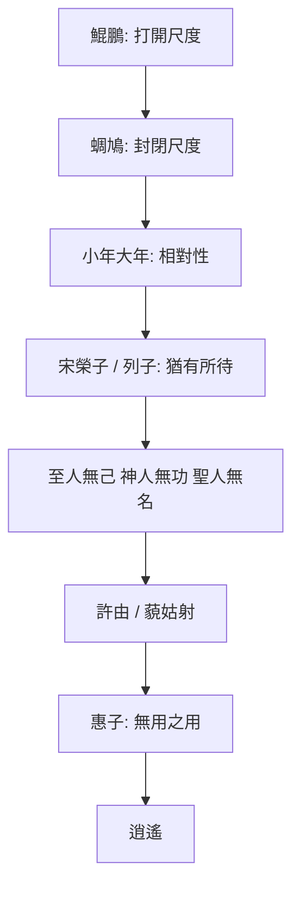

## 17. 延伸閱讀

### 原典與注疏

- 郭慶藩《莊子集釋》〈逍遙遊〉
- 王先謙《莊子集解》〈逍遙遊〉
- 成玄英疏（見《莊子集釋》所引）

### 今注今譯與通論

- 陳鼓應《莊子今註今譯》〈逍遙遊〉
- 王邦雄《莊子內七篇‧外秋水‧雜天下的現代解讀》相關章節
- 傅佩榮相關莊子導讀（逍遙、無待概念）

### 進階討論（選讀）

- 關於郭象「適性逍遙」之研究論文／哲學史專章
- 徐復觀對莊子精神自由的討論（選讀相關段落）

### 本專案內交叉引用

- 相關篇章：〈齊物論〉（尺度與是非）、〈人間世〉（處世）、〈秋水〉（小大再論）、〈山木〉（材不材）、〈徐無鬼〉（惠施線）
- 相關人物：[惠施](content/figures/惠施.md)、[許由](content/figures/許由.md)、[列禦寇](content/figures/列禦寇.md)、[堯](content/figures/堯.md)
- 相關名詞：[無待](content/terms/無待.md)、[有待](content/terms/有待.md)、[逍遙](content/terms/逍遙.md)、[無用之用](content/terms/無用之用.md)
- 相關主題：[焦慮與比較](content/themes/焦慮與比較.md)、[自由與無待](content/themes/自由與無待.md)、[無用與有用](content/themes/無用與有用.md)


<div class="pagebreak"></div>

<!-- part: 內篇 id: 02 -->

# 齊物論

> **閱讀提示**：以下區分原典、歷代注家與本書現代詮釋；「齊」不是抹平差異，而是鬆開以一端裁斷萬物的成心。

## 01. 篇名與背景

〈齊物論〉承〈逍遙遊〉的「小大之辯」，轉而追問：人何以把自己的見聞、好惡定為天下的是非？「齊物」不是把萬物做成同一物，而是鬆開以一端裁斷萬物的成心；「論」也包含對各種論辯的反省。若〈逍遙遊〉教人看見「有待」與尺度之限，本篇則教人看見「成心」如何把有限尺度誤當宇宙法則。

本篇在全書中居第二篇，是內篇認識論與語言批判的核心。其後〈人間世〉的心齋、〈應帝王〉的鏡喻，多可回扣此處對成心與言辯的分析；〈大宗師〉的物化亦與夢蝶結語相呼。讀內篇宜把本篇視為「尺度問題」的第二層：不僅知自己小，更知自己何以堅持己是、人非。

> **原典位置**：內篇・第二篇・〈齊物論〉

## 02. 成書背景

戰國名家、儒墨及諸子競相立論，「彼是」之爭既是學術問題，也是政治與生存問題。惠施、公孫龍等名辯家使「同異」「堅白」成為專門課題；儒墨互詆，各以仁義、兼愛為天下唯一正理。在這種語言戰場上，說得漂亮往往比想得周全更容易得勢。

內篇此篇以南郭子綦、齧缺、王倪與夢蝶等對話，不提供一套新教條，而展示教條如何形成。它不否定一切判斷，而是追問：判斷依何而立？誰有資格把局部經驗說成普遍真理？通行本文字依郭象本系統，異文可參郭慶藩《莊子集釋》；以下引文以該書所收通行文字為準。

## 03. 結構分析

篇首由聲音入手，先破「有一主宰在操控」的直覺；中段拆解成心與彼是；再經朝三暮四、滑疑之稱，把語言操弄與認知限度寫實；末段以夢蝶不讓讀者停在概念，而回到身分與變化的經驗。

### 結構圖

```text
南郭子綦「吾喪我」→ 人籟／地籟／天籟
        ↓
成心與言辯（大知小知、彼是互生）
        ↓
道樞、兩行 → 朝三暮四
        ↓
滑疑、生死是非的限度
        ↓
莊周夢蝶 → 物化
```

若用一句話總括：**由天籟破主宰幻覺，由成心見執，由兩行保張力，由夢蝶收於身體經驗。**

## 04. 原典

> 版本依據：郭慶藩《莊子集釋》通行本。**原典位置**：內篇第二篇〈齊物論〉。以下為必要引用，非全篇逐字照錄。

### （一）吾喪我與三籟

> 南郭子綦隱机而坐，仰天而嘘，荅焉似喪其耦。……曰：「吾喪我矣。」  
> 汝聞人籟而未聞地籟，汝聞地籟而未聞天籟夫！

### （二）成心與彼是

> 大知閒閒，小知間間；大言炎炎，小言詹詹。  
> 彼亦一是非，此亦一是非。是亦彼也，彼亦是也。

### （三）道樞與兩行

> 道通為一，其分也，成也；其成也，毀也。唯其言也，可不謂之為天籟乎？  
> 是以莫若以明。  
> 是以聖人和之以是非而休乎天鈞，是謂兩行。

### （四）朝三暮四

> 狙公賦芧，曰：「朝三而暮四。」眾狙皆怒。曰：「然則朝四而暮三。」眾狙皆悅。名實未虧而喜怒為用，亦因是也。

### （五）夢蝶與物化

> 昔者莊周夢為胡蝶，栩栩然胡蝶也……不知周之夢為胡蝶與，胡蝶之夢為周與？周與胡蝶，則必有分矣。此之謂物化。

## 05. 白話翻譯

### （一）吾喪我

南郭子綦靠著几案坐著，仰天長嘆，神情像失去了與自己相對的伴侶。他說：「我喪失了我。」齧缺問天籟，他說：你只聽過人吹孔而出的聲音，還沒聽過風穿萬竅的地籟，更沒聽過使萬物各自如此的天籟。

### （二）成心言辯

大智慧寬廣從容，小聰明忙於計較；大言宏闊，小言瑣碎。你說的「是」在對方眼中可能正是「非」；彼與此相對而生，彼此互為「是」與「非」。

### （三）道樞兩行

道本通而為一，分開就形成，形成也就走向毀；這樣的言說，能不稱為天籟嗎？與其陷在彼是裡，不如以明照見。聖人調和是非，休於天鈞，這叫兩行——兩邊並行而不以一端消滅他端。

### （四）朝三暮四

養猴的人分栗子，說早上三顆晚上四顆，猴子都生氣；改說早上四顆晚上三顆，猴子都高興。名實沒變，喜怒卻被話語框定牽動。

### （五）夢蝶

莊周夢見自己變成蝴蝶，翩翩飛舞，醒後不知是莊周夢蝶，還是蝶夢莊周。周與蝶當然有分別，但這正顯出萬物在變化、彼此轉化——此之謂物化。

## 06. 字詞註解

| 字詞 | 讀音／釋義 | 說明 |
|---|---|---|
| 齊物 | 調齊成心對物之偏見 | 非「萬物同一」 |
| 成心 | 已成定見 | 使人以己為準的心理結構 |
| 吾喪我 | 鬆開固定之我 | 天籟段前提，非失憶 |
| 人籟／地籟／天籟 | 吹孔／風入萬竅／使各竅自鳴 | 層層破「有主宰分配對錯」 |
| 彼是 | 彼此、是非 | 相對而立，非自然即有 |
| 道樞 | 道的樞紐 | 不黏死於彼此一端的位置 |
| 天鈞 | 天然之平 | 兩行所休之處 |
| 兩行 | 兩邊並行 | 非折衷，而是不以一方消滅他方 |
| 滑疑 | 難以確定之稱 | 承認知與不知皆有限 |
| 物化 | 萬物變化、彼此轉化 | 夢蝶結語 |
| 莫若以明 | 不如以明照見 | 照見成心，非取消裁決 |

## 07. 段落解析

**走讀路線**：三籟 → 成心言辯 → 道樞兩行 → 夢蝶物化。關鍵句：**莫若以明**。

### 為何從「三籟」而非「齊物」起筆？

南郭子綦不先定義什麼叫齊，而讓齧缺聽風入萬竅。人籟可指吹孔；地籟是眾竅因風而響；天籟則使各竅「虛者求使也，實者求鳴也」——各發其聲，並無一個統一主宰在分配對錯。**齊的前提，是先承認差異本在各自發聲**，而不是先立一個標準再去削平萬物。與〈逍遙遊〉先寫鯤鵬破小知同理：先讓「主宰式的是非」失焦，後文成心、彼是才有入口。

### 「吾喪我」與天籟如何銜接？

「吾喪我」不是消滅自我，而是暫時鬆開「我必須是誰、我必須對」的固定框架。唯有此喪，才聽得見地籟、天籟——不是神秘聲響，而是萬物各因其性而鳴。這為全篇定調：**齊物首先是鬆成心，不是取消萬物差異。**

### 成心與言辯：為何愈辯愈固？

「大知閒閒，小知間間」描寫的不是智力階級表，而是**成心一旦確立，就會自動生產論戰材料**。彼是「相對而立」，不是自然就有「我對你錯」。道樞、兩行不是要取消判斷，而是**不把某一端的判斷當成宇宙唯一法則**。朝三暮四接在其後，用餵法名目之變讓猴子喜怒翻轉——所得未變，變的是語言框定；這是把成心問題落到可感的操弄術，也是對戰國遊說話術的側擊。

### 為何生死、滑疑段不放在夢蝶之前？

中段若只停在「是非可兩行」，讀者仍可能以為齊物是**思辨遊戲**。於是莊子寫滑疑之稱、追問「既已知吾知之為正，其未知之正又在何方」——承認人總以為自己的「知」已立正。**這是從語言層推到生命處境：人會死、角色會換、知與不知都有限。** 為夢蝶鋪路：物化不是口號，而是「周／蝶／分／化」同時真實的經驗張力。

### 夢蝶置末：要收束什麼？

結語「周與胡蝶，則必有分矣。此之謂物化」——**有分**，才說物化；不是取消分別，而是說分別不固定於一個永恆主體。若只記「齊物＝都一樣」，便誤讀；若只記「物化＝虛無」，也誤讀。全文由天籟破主宰→成心見執→兩行保張力→夢蝶收於身體經驗，敘事本身即論證。

### 滑疑之稱與「樂通」

「滑疑之稱，愚人之役也」——承認有些名稱、學說讓人越辯越糊塗，成心的奴隸。後文「樂通，幾與道合」則說，若能通達於變化之樂（非享樂），近於道。這兩句把全篇從批判拉向**可能的通達**：齊物不是終點在虛無，而是終點在能遊於變化。

### 與他篇如何互讀？

〈齊物論〉的成心、兩行，在〈人間世〉成為進權力現場前的**心齋**前提；在〈應帝王〉則轉為鏡式應物、不因己意塞住。〈逍遙遊〉破小大之辯，本篇破是非之執，〈大宗師〉再問：若「我」可化，真人如何面對死生？不宜把各篇抽成同一套「相對主義」口訣，而宜看**同一警告在不同場景的具體化**。

## 08. 歷代注家怎麼看

### 郭象

郭象重「彼此相因」與萬物自得，認為是非不必由外在標準強行統一；彼是互生，各安其分。這能防止以一物壓萬物，但不可化成對現實傷害的冷漠。郭注亦以「獨化」解天籟，強調萬物自發，非有神明分配。

### 成玄英

成疏以「忘彼此、遣是非」說明道樞，強調破除偏執；其詮釋較具工夫論色彩。對「吾喪我」，多解為忘懷形執、冥合虛通；對兩行，則說聖人不偏滯一方，以天鈞調和。

### 林希逸

林氏注意到朝三暮四的文字機鋒：猴子所得未變，變的是名目與預期，正揭露人情受語言牽動。又指出夢蝶段文情極處：「必有分」三字，防止讀者把物化誤解為取消差異。

### 郭慶藩與其他

郭慶藩《莊子集釋》彙諸家異文舊說，於「滑疑」「天鈞」等字義可核對；近人多以本篇討論語言、相對性與主體問題，宜始終回到「成心」與「兩行」的原文脈絡，勿以西方相對主義直接套入。

## 09. 哲學分析

> 以下為**本書現代詮釋**。

齊物不是「所有主張同樣正確」，而是三步工夫：知道我有立場；承認他者也有其可理解處；在衝突中不把有限見識絕對化。道樞不是無立場，而是能移動的樞紐——不讓某一「是」霸佔全場。夢蝶也不是宣告世界虛假，而是讓「固定自我」失去最後保證：身分可轉，卻仍有「周與蝶之分」。

可連結為：成心 → 彼是固化 → 爭辯；反省成心 → 兩行 → 開放回應。這與〈秋水〉的尺度反省相通，但本篇更集中於**語言與是非如何製造成心**，而非自然視野的擴大。

## 10. 與老子比較

《老子》說「知不知，上」，同樣警惕知識自滿；「道可道，非常道」亦警戒言辯之限。〈齊物論〉更細緻地分析語言如何製造彼是，並以天籟、夢蝶等寓言展示。老子多以反向格言說治道，莊子則使讀者在對話與寓言中親歷尺度的滑動。

## 11. 與儒家比較

儒家需辨義利、善惡以承擔責任；莊子追問的是，誰有資格把某一套名目當作絕對？孟子「是非之心」與本篇可對話：儒家重確立是非以修身齊家，莊子則警告成心如何把「己是」說成「天理」。兩者的張力促使我們區分「必要判斷」與「把判斷神聖化」。

## 12. 與佛學比較

可與佛教的執著、分別心對話，但《莊子》未建立四諦、業報或解脫論。物化亦非涅槃；夢蝶所說是變化中的身分不穩，不是證悟空性。比較只宜作後設參照，不以佛學術語替代物化、成心。

## 13. 現代人生應用

> 以下為**現代詮釋**。

網路爭論前可問：我的「是」依據何種經驗？是否把對方縮成標籤？職場分歧中，兩行不是不決策，而是在決策前補足被排除的觀點。朝三暮四也提醒我們，制度溝通不能只改包裝；若資源與尊嚴未變，話術終會被看穿。

1. **是非之爭**：先問自己的「是」依何經驗、是否已把對方縮成標籤；再決定要不要對決。
2. **莫若以明**：爭議未歇時，與其加碼口號，不如照見雙方成心與被排除的觀點，再做可修正的判斷。
3. **物化**：角色、情緒與自我敘事都可能轉換；不必用單一固定之「我」去堵死下一步。
4. **朝三暮四**：改革若只改名目、不改實質，群眾的喜怒終會反噬信任。

### 13.1 成心自檢（爭論前）

爭論升溫前，可暫停三問：我是否已把對方當成「必然錯」？我手中的證據，是否只是局部經驗？若對方也有可理解之處，我能否在不放棄底線的前提下，先聽完？這不是和稀泥，而是避免成心把對話變成戰爭動員。

### 13.2 兩行與決策

組織決策時，「兩行」可轉為程序：重大方案須附「反方摘要」與「被排除選項的代價說明」。決策仍可表態，但表態前須看見自己可能漏掉的一面——這是「莫若以明」的制度化。

### 13.3 夢蝶與身分轉換

轉職、離婚、移民、重病後，舊身分敘事常仍支配情緒。夢蝶提醒我們：身分可化，但「有分」——不必否認過去的自己，也不必把過去鎖死未來。哀傷與重新命名可以並存。

## 14. 常見誤解

1. **齊物＝道德相對主義**：原文批判成心，未說傷害與照護毫無差別。
2. **夢蝶＝人生只是夢**：它說物化與認同的不穩，不是虛無主義。
3. **不要說話才不執著**：本篇正以語言教人反省語言，關鍵在不固執。
4. **莫若以明＝誰都不對、所以誰都對**：以明是照見成心與尺度，不是取消裁決與責任。
5. **兩行＝和稀泥、永不表態**：兩行要求在決策前補足被排除的一面，不是永遠不下判斷。
6. **吾喪我＝消滅人格**：是鬆開成心，不是否定責任與關係。

## 15. 本篇總結

〈齊物論〉讓人看見：困住人的不只是外物，也是把一己尺度誤當全體的成心。齊不是消滅差異，而是在差異裡保留可轉身、可聽見他者的道樞。夢蝶以「有分」收束物化，使全篇既不淪為虛無，也不淪為教條——這正是內篇認識批判的標竿高度。

## 16. 心智圖

```text
吾喪我 → 天籟 → 成心 → 彼是爭辯
             ↓
          道樞／兩行／朝三暮四
             ↓
          滑疑／生死限度
             ↓
          物化（夢蝶）
```

## 17. 延伸閱讀

- 郭慶藩《莊子集釋》〈齊物論〉
- 成玄英《南華真經注疏》〈齊物論〉
- 林希逸《莊子口義》〈齊物論〉
- 陳鼓應《莊子今註今譯》；王邦雄《莊子內七篇‧外秋水‧雜天下的現代解讀》

---
### 交叉引用
- 相關篇章：〈逍遙遊〉、〈人間世〉、〈大宗師〉、〈秋水〉
- 相關人物：[[莊周]]、南郭子綦、齧缺、王倪
- 相關名詞：[[齊物]]、[[物化]]、[[卮言]]、成心、天籟、道樞、兩行
- 相關主題：[[焦慮與比較]]、認識、語言、衝突、身分

### 讀法建議

初讀可先通讀全篇，留意南郭子綦「吾喪我」、彼是互生到莊周夢蝶的轉折；再回看第四節節錄與第七節段落關係。進一步研究宜並置郭象的自得、成玄英的遣是非與林希逸對朝三暮四的文勢說明，並以郭慶藩核對字句。跨文化比較或現代應用須標明為後設詮釋。


<div class="pagebreak"></div>

<!-- part: 內篇 id: 03 -->

# 養生主

> **閱讀提示**：本篇的「養生」首先是保全天年與安頓生命，不可直接化約為養生保健術。

## 01. 篇名與背景

「養生主」可解作養生的宗旨或主宰。〈齊物論〉拆解成心後，本篇立刻問：在充滿限制與傷害的世界，生命如何不自耗？庖丁的刀、右師的足、老聃之死，分別由技藝、刑傷與哀傷呈現同一問題——**有限的生命，如何在結構中行走而不硬碰？**

本篇是內篇由認識批判轉向身體與生命實踐的橋樑。其「緣督」「知止」將在〈人間世〉化為心齋與言語風險意識；外篇〈達生〉則把技進乎道展開為凝神、以天合天。讀時宜與〈逍遙遊〉的「有待」並看：養生不是追逐無限，而是在有限中找可持續之路。

> **原典位置**：內篇・第三篇・〈養生主〉

## 02. 成書背景

戰國人命常繫於戰爭、刑罰與徵役。「養生」並非奢侈的私人健康，而含避害、全身、盡年之意。當時醫藥、導引與方術亦興，但本篇不談丹藥延年，而談如何在刀斧、刑罰與哀傷中不失其生——這是哲學的養生，不是養生館的養生。

文惠君聽庖丁之言而稱善，顯示此篇亦面對君主：技進乎道，最終服務於「不傷」——不傷刀、不傷牛、亦不傷執政者與執技者自身。這使養生主題超出個人養身，而連結技術倫理與政治身體。

本篇屬內篇，通行本依郭象注系統；重要引文據郭慶藩《莊子集釋》。庖丁解牛故事可能吸收工匠傳統，秦失弔老聃則與道家祖師形象相連；讀者宜辨寓言與史實之分際。

## 03. 結構分析

篇首給綱領，庖丁具體示範；中段以殘身與受困的鳥防止讀者把「技進乎道」讀成炫技；末段以死亡收束養生的真正邊界。

### 結構圖

```text
有涯／無涯 → 緣督以為經
        ↓
庖丁解牛：依乎天理、知止、戒慎
        ↓
右師斷足 → 澤雉寧處樊中
        ↓
秦失弔老聃：安時處順
```

若用一句話總括：**先劃邊界，再示技道，再校正制度之傷，最後以死生驗養生真義。**

## 04. 原典

> **原典位置**：內篇第三篇〈養生主〉；版本依據：郭慶藩《莊子集釋》。以下為必要引用，非全篇逐字照錄。

### （一）有涯無涯與緣督

> 吾生也有涯，而知也無涯。以有涯隨無涯，殆已！已而為知者，殆而已矣！  
> 緣督以為經，可以保身，可以全生，可以養親，可以盡年。

### （二）庖丁解牛

> 臣之所好者道也，進乎技矣。依乎天理，批大郤，導大窾，因其固然。  
> 彼節者有間，而刀刃者無厚；以無厚入有間，恢恢乎其於遊刃必有餘地矣。  
> 每至於族，吾見其難為，怵然為戒，視為止，行為遲。動刀甚微，謫然已解，如土委地。

### （三）右師與澤雉

> 公文軒見右師而驚，曰：「吾始見之而驚，今更見之而忘天下。」  
> 澤雉十步一啄，百步一飲，不蕲畜乎樊中。神雖王，不善也。

### （四）秦失弔老聃

> 老聃死，秦失弔之，三號而出。弟子曰：「非夫子之友邪？」曰：「然。……適來，夫子時也；適去，夫子順也。安時而處順，哀樂不能入也。」

### （五）澤雉（補）

> 澤雉十步一啄，百步一飲，不蕲畜乎樊中。神雖王，不善也。

篇末「善夭善老善始善終」諸句（通行本或有異文），進一步把養生收於**善其終**——不是追求長壽，而是善於面對終局。

## 05. 白話翻譯

### （一）緣督

人的生命有限，欲知之事無窮；拿有限生命追逐無窮知識，會陷於危殆。沿著居中的常道行走，能保身、全生、奉親、終其天年。

### （二）庖丁

庖丁說他所喜愛的是道，已超過普通技術：順著牛體原有紋理，在筋骨空隙處下刀。牛的關節本有空隙，刀刃則沒有厚度；以無厚的刀進入有隙之處，刀自然總有餘地可遊。遇到筋骨交錯處，他仍怵然為戒，目光專注、動作放慢，輕輕一劃便解開，像土塊落地。

### （三）右師與澤雉

公文軒見斷足的右師，說起初驚訝，後來見他卻忘了天下。澤雉走十步才啄一口，百步才飲一次，不願被養在籠中——雖被奉為神鳥，卻不自在。

### （四）秦失

老聃死了，秦失去吊唁，哭三聲便走。弟子問：他不是您的朋友嗎？秦失說：是。老聃來是時機到了，去是順著變化；能安於時、順於變，哀樂便不會侵入到失去分寸。

## 06. 字詞註解

| 字詞 | 讀音／釋義 | 說明 |
|---|---|---|
| 涯 | 邊際 | 生命、精力皆有限 |
| 督 | 中、正 | 「緣督」非固定保健穴位說 |
| 緣督 | 循中道而行 | 在結構中找可持續之路 |
| 天理 | 天然紋理 | 指牛體結構，不是抽象倫理 |
| 郤／窾 | 空隙 | 庖丁下刀所循之處 |
| 族 | 筋骨交錯處 | 最難處，更需戒慎 |
| 怵然為戒 | 警惕戒慎 | 熟練仍不魯莽 |
| 兀者／右師 | 斷足受刑者 | 刑罰與身體之傷 |
| 樊中 | 籠中 | 澤雉寧自由而不願豢養 |
| 安時處順 | 安於所遇、順其變化 | 不等於毫無哀傷 |

## 07. 段落解析

**走讀路線**：有涯無涯 → 庖丁解牛 → 右師斷足 → 秦失弔喪。關鍵句：**緣督知止**。

### 為何先寫「有涯／無涯」而不先寫庖丁？

「吾生也有涯，而知也無涯」不是反智，而是**先劃出養生的邊界**：拿有限生命追逐無窮資訊、功名與辯論，本身就是耗損。「緣督以為經」因此不是口號，而是**在結構裡找可持續的中道**——能保身、全生、養親、盡年，四者並列，說明養生從未只是個人技巧。若跳過這段直接讀解牛，易把本篇誤成職場效率學。

### 庖丁解牛：「進乎技」在何處？

庖丁由「所見全牛」到「神遇不以目視」，說的是**熟練後的整體感通**；關鍵不在快，而在「彼節者有間，以無厚入有間」。遇到筋骨交錯仍「怵然為戒」，防止神技變成魯莽——**知止**與**有餘地**同時成立。這與〈齊物論〉的成心形成對照：庖丁不是取消判斷，而是在牛體結構中辨認何處可入、何處不可硬闖。刀十九年不換，正因不逆理而行。

### 為何緊接右師、澤雉兩則？

右師斷足、澤雉「寧其寧處樊中，莫之而逢矰」——**制度與圈養也會傷生**。若只停在庖丁的從容，讀者可能以為「技進乎道」即可免疫一切；這兩則把問題拉回刑罰、徵役與安逸的陷阱：身體可被國法斷去，自由也可被餵養換走。與上下文：它們校正「養生＝個人修煉」的窄化讀法。

### 秦失弔老聃：為何不以禮哭？

「始也吾以為其人也，而今非也」——吊唁若只剩**角色扮演**，便與所吊對象脫節。老聃「適來適去」，秦失以「安時處順」解，不是否認哀傷，而是**不讓哀樂變成對變化的拒絕**。這是全篇真正的收束：養生的終極考驗不在刀法，而在能否順死生之大變而不自傷。

### 公文軒與右師：觀看者的轉變

公文軒「始見之而驚，今更見之而忘天下」——寫的是**觀看者的改變**，不是右師自我標榜。最初見斷足而驚，後來見其神完而忘天下之紛擾。這與王駘段同構：德充的符驗，往往要透過旁人的目光轉換才顯出。讀者亦是被邀請轉換目光的一方。

### 與他篇如何互讀？

「緣督」「知止」在〈人間世〉轉為心齋與言語風險；在〈達生〉則展開為凝神、以天合天。〈養生主〉的[[庖丁]]與〈德充符〉的才全並非同一問題——前者問**如何在結構中節用**，後者問**形貌不全時德如何仍可感**。讀內篇宜沿此線：保全生命→亂世處世→形殘不損德→真人與死生→政治應物。

## 08. 歷代注家怎麼看

### 郭象

郭象將緣督解為順中而行、各得其性；庖丁所以不傷刀，因不逆物之自然。又說「以有涯隨無涯」是知止於分內，非絕對反知。

### 成玄英

成疏著重忘知遣累，以虛心應物；「安時處順」是去除逆變之心，而非否認親情。對庖丁段，多解為心手相應、神遇於理。

### 林希逸

林氏特別指出庖丁故事的文勢：刀十九年不換，正為凸顯「順理」勝過蠻力，不可拘泥為廚藝秘方。又提醒秦失三號，是破俗禮之執，不是薄情。

### 郭慶藩與其他

郭慶藩彙集名物與字義考證；今人解讀多提醒「吾生有涯」不是反智，而是反對無節制地耗盡生命。王先謙《莊子集解》字句簡明，可與郭集釋對讀。又，「全生」一語歷代或解為保全生命，或解為全其生之質，宜並存而不必強分。

## 09. 哲學分析

> 以下為**本書現代詮釋**。

「緣督」是一種節度：承認資源有限，選擇不與結構硬碰。庖丁的道不在掌握萬物，而在細察限制、等待可行之隙。這與「最有效率」不同：真正成熟的行動包含停刀、戒慎與保留。安時處順也不是命定論，而是區分不可控的變化與仍可調整的回應。

本篇可視為[[工作與技道]]主題在內篇的奠基：技術若只追求速度與征服，終會傷刀傷身；技若進乎道，則在結構中找空隙、在難處更戒慎。又，「全生」「盡年」二語可與當代「可持續工作」「職業生涯長度」對話，但須標明為現代詮釋，不可偽托為莊子原意。

## 10. 與老子比較

《老子》說「知足不辱，知止不殆」，與本篇不以有涯逐無涯相近。「治大國若烹小鮮」亦重不妄動、順理。差異是〈養生主〉以具體技藝寫出順理的身體感，並把死亡置入養生的範圍，較老子更敘事、更具身。老子「守中」與「緣督」亦可互參，但緣督更強調在具體結構中找空隙，而非抽象守一。

## 11. 與儒家比較

儒家重奉親與哀禮；本篇也說「可以養親」，但秦失段反省哀禮若失真便成俗套。可視為對禮之真情與形式關係的追問，不宜簡化為反孝。孟子「養吾浩然之氣」重內在充養，本篇則重**不逆理、不耗竭**的外在身體節度，兩者可互補。曾子「任重而道遠」與「以有涯隨無涯」亦形成張力：責任須在有限生命中節度分配。

## 12. 與佛學比較

可與中道、無常作有限對讀；但庖丁與安時處順並非佛教修行次第，本篇暫不等同。佛教四念處觀身，與本篇觀牛體紋理有形式相似，目的與框架不同。

## 13. 現代人生應用

> 以下為**現代詮釋**。

工作上，先列出不能硬碰的結構：工時、專業邊界、身體警訊；再找「窾」而非一味加力。學習上，「知無涯」提醒選擇問題而非囤積資訊。面對失去，安時處順不是催促自己不哭，而是容許哀傷存在，同時不以抗拒不可逆之事耗盡餘生。

1. **緣督以為經**：在工時、身體警訊與專業邊界上找可走的「中」，少做硬碰硬骨的消耗。
2. **庖丁解牛**：複雜處「怵然為戒」——停、看、複查，再進刀；熟練包含知止，不是一味加速。
3. **澤雉**：問自己是否為了牢籠裡的「養」而失去本來能走、能歇的餘地；該保的生命節奏優先於虛榮的安頓。
4. **秦失三號**：儀式若只剩表演，不如誠實面對哀傷的限度與變化。

### 13.1 知止與資訊飲食

「以有涯隨無涯」在當代常表現為無止境的資訊攝取、比較與回應義務。緣督在此可具體化：每日設定「知止」邊界——哪些主題值得深讀、哪些爭論不必入場、哪些通知可關。養生首先是注意力與精力的保全。

### 13.2 庖丁式專業

專業成熟不是「更快」，而是更知道哪裡不能下刀。遇到複雜專案、棘手關係或醫療決策時，學庖丁在「族」處放慢：多問一次、多查一次、多留一次餘地。神遇不以目視，是整體感通，不是跳過檢核。

### 13.4 善終與儀式

秦失三號不是標準答案，而是提醒：儀式若與對象的生命態度脫節，便成表演。現代讀者可問：我們的告別方式，是在安置哀，還是在完成社會期待？安時處順允許簡化，也允許隆重——關鍵是誠實面對變化。

## 14. 常見誤解

1. **養生＝延年偏方**：本篇關心的是全生與盡年，不提供醫療處方。
2. **庖丁＝熟能生巧**：熟練重要，但核心是依理、知止與戒慎。
3. **安時處順＝壓抑悲傷**：它批評失度的沉溺，不否定情感。
4. **緣督＝凡事妥協、沒有原則**：緣督是依理而行的節度，不是放棄該守的界線。
5. **澤雉＝拒絕一切照顧與資源**：故事反對的是以豢養換走自由，不是否定互助與專業照護。
6. **有涯無涯＝反對學習**：是反對無節制追逐，不是反智。
7. **緣督＝養生穴位**：歷代多有「督脈」之說，但宜回到「循中道、不硬碰」的哲學義，勿執為方術。

## 15. 本篇總結

〈養生主〉以刀與牛教人看見生命的節度：有限者不必追逐無限，行動不必硬闖，哀傷也不必演成自我毀傷。養生的最高處，是在變化中不失其生——從緣督到安時，是一條由身體技藝通向死生大變的內篇主線。讀全篇宜記住：庖丁的從容以「怵然為戒」為前提，秦失的淡然以「友」為前提；二者都不是冷漠，而是**在限度內盡其生**。

若以一句話收束：**知止於有涯，順理於有間，安時於大化。**

## 16. 心智圖

```text
生命有限 → 緣督（節度）
庖丁 → 依理／知止／戒慎 → 保身
右師／澤雉 → 制度與圈養之傷
死生變化 → 安時處順 → 盡年
```

## 17. 延伸閱讀

- 郭慶藩《莊子集釋》〈養生主〉
- 成玄英《南華真經注疏》〈養生主〉
- 林希逸《莊子口義》〈養生主〉
- 陳鼓應《莊子今註今譯》；王邦雄《莊子內七篇‧外秋水‧雜天下的現代解讀》

---
### 交叉引用
- 相關篇章：〈齊物論〉、〈人間世〉、〈德充符〉、〈大宗師〉
- 相關人物：[[庖丁]]、文惠君、右師、老聃、秦失
- 相關名詞：緣督、天理、技進乎道、安時處順
- 相關主題：[[工作與技道]]、有限性、身體、哀傷

### 讀法建議

初讀可先通讀全篇，抓住緣督綱領、庖丁解牛到安時處順的推進；再回看第四節節錄與第七節段落關係。進一步研究宜並置郭象的順中、成玄英的保身義與林希逸對刀十九年的文勢說明，並以郭慶藩核對字句。與〈達生〉梓慶、〈徐無鬼〉匠石等技藝篇可並讀，但本篇重「節度」與「死生」，彼等重「質」與「凝神」。外篇〈養生主〉同名概念若混淆，宜回到內篇此篇之「緣督知止」為準。


<div class="pagebreak"></div>

<!-- part: 內篇 id: 04 -->

# 人間世

> **閱讀提示**：本篇直面人間的危險。原典的保身之說不可被讀成對暴政的讚許；注家與現代詮釋另行標示。

## 01. 篇名與背景

「人間世」是人與人相遇、彼此傷害也彼此承擔的世界。承〈養生主〉的保全，本篇將問題放入君臣、父子、權力與勸諫：當統治者暴戾，善意如何不反成送死？當「有用」成為被徵用、被砍伐的理由，生命如何保有餘地？

本篇是內篇處世論的核心，把心齋、無用之用等概念從抽象推入權力現場。其後〈德充符〉談形殘與德充，〈應帝王〉談鏡式應物，多可回扣此處對保身與言語風險的鋪陳。讀者須記住：莊子寫危險，不是教人討好暴政，而是教人**在不得不入世的時候，辨識何種「有用」會招禍**。

> **原典位置**：內篇・第四篇・〈人間世〉

## 02. 成書背景

戰國游士常以言說求仕，亦可能因直諫受禍。莊子不以抽象倫理取代這種風險，而用顏回將使衛、葉公問政、匠石見櫟社樹等故事呈現。衛靈公、夏徵舒之亂等背景，使「救衛」不只是一場辯論，而是可能送命的使命。

本篇亦涉及工匠、樹木與形體殘缺者——顯示「人間世」不只是宮廷，更是制度如何評價人與物。顏回、孔子皆儒家核心人物，莊子借其口說心齋，顯示內篇與儒家對話的密度；讀者不宜把本篇簡化為「莊子反儒家」，而宜看其**補充處世風險與言語限度**的獨特角度。

通行本依郭象系統；引文據郭慶藩《莊子集釋》。

## 03. 結構分析

### 結構圖

```text
顏回使衛：勸諫之危 → 心齋
        ↓
葉公／楚國狂人接輿：言與形的風險
        ↓
匠石／櫟社樹：無用保全
        ↓
支離疏：制度外的存活
        ↓
山木自寇、膏火自煎（收束）
```

若用一句話總括：**先破「我要救他」的成見，再示心齋工夫，再以無用與形殘揭露徵用邏輯，最後以「自寇」警世。**

## 04. 原典

> **原典位置**：內篇第四篇〈人間世〉；版本依據：郭慶藩《莊子集釋》。以下為必要引用，非全篇逐字照錄。

### （一）顏回使衛

> 顏回見仲尼，曰：「回益矣。」……「回將仕乎？」……「回將往衛。」……「若一志，無聽之以耳而聽之以心；無聽之以心而聽之以氣。氣者，虛而待物者也。唯道集虛。虛者，心齋也。」

### （二）虛室生白

> 瞻彼闋者，虛室生白，吉祥止止。夫且不止，是之謂坐馳。

### （三）接輿與葉公

> 葉公子高將使於齊，問於仲尼。……楚狂接輿歌而過孔子曰：「鳳兮鳳兮！何德之衰？往者不可諫，來者猶可追。」

### （四）櫟社樹

> 匠石之齊，見櫟社樹……其大蔽數千牛，絜絜千斛。……不材之木也，無所可用，故能若是之壽。

### （五）山木自寇

> 山木，自寇也；膏火，自煎也。桂可食，故伐之；漆可用，故割之。人皆知有用之用，而莫知無用之用也。

### （六）顏闔（節錄）

> 顏闔將傅衛靈公大子，而問於蘧伯玉曰：「有人在此，其德天殺。……形若倮甲，心若死灰，無背無責，以入其罪。」

顏闔線補足顏回線：面對惡質儲君，策略更陰暗，心齋工夫更具體。

### （七）支離疏（節錄）

> 支離疏者，其疏者也，以枝其股，以踵見衛靈公。靈公悅之，視之全人也。

制度以「不全」者為可用之邊緣，反成另一種保身邏輯——與櫟社樹「不材」呼應。

## 05. 白話翻譯

### （一）心齋

孔子告訴顏回：先使心志專一；不要只用耳朵聽，也不要只用既有心意聽，要以虛明的氣去感受。道只聚於虛，虛就是心齋。

### （二）虛室生白

觀那空室，虛空處會生出光明，吉祥停留在能停留之處。若心不能止，就叫坐馳——人坐著，心卻在奔馳。

### （三）接輿

葉公子高將出使齊國，向孔子請教。楚國狂人接輿唱歌路過：鳳啊鳳啊，你的德行怎麼衰微了？過去的改不了，未來的還可追。

### （四）櫟社樹

匠石到齊國，見一棵被當社神的大櫟樹，大得可蔭蔽數千牛。它是不材之木，沒什麼用，所以能活這麼久。

### （五）無用之用

山木因材可用而招砍伐，油脂因可燃而自煎。人皆知有用之用，却不知無用之用。

## 06. 字詞註解

| 字詞 | 讀音／釋義 | 說明 |
|---|---|---|
| 心齋 | 齋戒其心 | 暫停成見與欲求，不是放空 |
| 虛 | 虛明、能受 | 非空洞或無知 |
| 聽之以氣 | 以整體感通 | 不可誤作神秘感應 |
| 坐馳 | 坐而心馳 | 心未止則不能應物 |
| 自寇 | 自招寇害 | 有材可用可能招禍 |
| 不材 | 不成材、無大用 | 櫟樹保命之由 |
| [[無用之用]] | 因無用而保全 | 非真無能，是拒被徵用 |
| 支離疏 | 形體殘缺者 | 寓言人物，涉及制度排除 |

## 07. 段落解析

**走讀路線**：顏回使衛 → 心齋 → 櫟社樹 → 支離疏。關鍵句：**保身不強為**。

### 為何顏回一開口就被孔子攔下？

顏回欲以仁義「救衛」，孔子先問的不是方案對錯，而是**心是否已被「我要救他」填滿**。這是〈人間世〉的第一個轉折：在暴政現場，**善意本身可能就是送命動機**。心齋因此不是靜坐秘訣，而是**進入權力場域前的辨勢**——「唯道集虛」，先空出成見，才談得上「聽之以氣」。若跳過顏回之危，心齋易讀成一般修養口訣。

### 葉公、接輿、匠石：為何接連示警？

中段不是重複「少說話」，而是**分層展示言語與形體的風險**：葉公問政，接輿歌而過，暗示在不可說之處硬說；匠石斫社樹，說明**有用之材自寇**。每一則都在問：你以為的「正直」，在對方眼中是什麼？與顏回段銜接：勸諫失敗不只因道理不對，常因**發言者已預設自己站在道德高處**。

### 櫟社樹與支離疏：為何並置？

大樹因「不材」免斤斧，支離疏因形體「不可用」免徭役——**同一邏輯的兩面**：制度徵用「有用者」，也排除「不合規者」。這不是歌頌殘缺或無能，而是**揭露評價權在誰手中**。與〈養生主〉澤雉、外篇〈山木〉材不材對讀，可見[[無用之用]]在內篇是一條不斷被試探的保身線，而非萬用公式。

### 「山木自寇」如何收束全篇？

「山木，自寇也；膏火，自煎也」——**才德若不知其危，反成自害之具**。全篇由「我要救他」始，至「可用即危險」止：人間世不是教人逃離，而是教人**在不得不入世的時候，辨識何種「有用」會招禍、何種虛明能應而不傷**。

### 顏闔赴衛：為何緊接顏回之後？

顏闔將為衛太子師，問蘧伯玉「有人在此，其德天殺」——這是另一條進入暴政現場的路線：不是去「救」，而是去「教」已顯惡質的儲君。孔子（或蘧伯玉）所教的是**形若倮甲、心若死灰**的佯裝與周旋，比顏回的仁義直諫更陰暗，也更寫實。兩段並置，說明人間世沒有單一「正確」的處世模板，只有**辨勢之後的多元策略**。

### 與他篇如何互讀？

[[心齋]]承接〈齊物論〉鬆成心，具體化為權力現場的工夫；「應而不藏」則在〈應帝王〉轉為鏡喻。〈德充符〉的形殘者與支離疏同屬制度邊緣，但本篇重**言與行的政治後果**，彼篇重**德如何不被形奪**。不宜把保身讀成對暴政默許——原文從未取消「不合則不往」的判斷空間。

## 08. 歷代注家怎麼看

### 郭象

郭象以虛心應物解心齋，認為不先以己意塞住，才可因物而行。對無用之用，多解為順性自全，不為世用所役。

### 成玄英

成疏強調忘懷遣累，耳、心、氣依序去除狹隘感官與成見。對顏回使衛，則警言未達虛心而強諫，必招禍患。

### 林希逸

林氏將「虛室生白」說得平實：心裡空出位置，事理才照得進來；並提醒社樹之大是寓言誇飾，勿執為實錄。

### 郭慶藩與其他

近人常提醒，無用之用是對功利與權力的批判，不能把支離疏的存活浪漫化為殘缺本身值得追求。王先謙集解於名物字義可參。顏闔段歷來被解為「心齋」在惡太子面前的極端應用，與顏回段形成「仁義直諫」與「佯狂周旋」的對照，宜並讀。

## 09. 哲學分析

> 以下為**本書現代詮釋**。

心齋不是把自己洗成沒有判斷，而是暫停「我已知答案」與「我必須成功影響對方」兩種佔有。它使人先看權力差、情勢與自身能力，再決定說、怎麼說、是否離開。無用之用亦不是自我矮化，而是保留不被績效和徵用完全吞沒的生命空間。

本篇與[[政治與無為]]主題相連：不是不要政治，而是警惕**以己意強塞人間**——無論是勸諫的熱情，還是改革的善意，都可能成為「鑿竅」的前奏（見〈應帝王〉）。心齋亦可視為[[心齋]]名詞在內篇的第一次完整展開，其後各篇可沿此追蹤工夫的深化與轉用。

## 10. 與老子比較

《老子》說「知其雄，守其雌」與「不敢為天下先」，同樣有不強出頭的智慧；「夫唯不爭，故天下莫能與之爭」亦近保身。〈人間世〉更具體地展示權力現場與勸諫風險，並以心齋給出工夫方向。老子「柔弱勝剛強」與櫟社樹「不材之壽」亦可互參，但本篇更強調言語與名分之險。

## 11. 與儒家比較

[[顏回]]、[[孔子]]與葉公都屬儒家語境。本篇不否定仁義，而質疑在暴君面前只憑正言是否足夠；它補充了儒家「當為」之外的「如何不被犧牲」。孟子「雖千萬人吾往矣」與本篇形成張力：何時該往、何時該止，須辨勢，不可只剩口號。荀子重禮法，莊子則問禮法何時成為「自寇」之具——兩者可對話而不必敵對。

## 12. 與佛學比較

心齋可與觀照、放下預設對話，卻非佛教禪定術語；本篇暫不作等同。佛教「應無所住而生其心」與「虛以待物」有形式相似，但莊子未建立解脫次第。

## 13. 現代人生應用

> 以下為**現代詮釋**。

面對權力不對等的職場或家庭，心齋可先做三件事：辨認風險、區分對方是否可聽、準備退出與求援管道。這不是要求受害者沉默；涉及暴力或違法時，安全計畫、可信支持與正式資源優先。無用之用提醒人不要把所有休息、關係與能力都交給績效衡量。

1. **心齋**：進場勸諫或談判前，先空掉「我一定說得動他」的成見，改聽勢、聽氣、聽風險。
2. **無用之用**：替自己留一塊不被績效徵用的休息、關係與能力；有用到耗盡，反而失去可遊之地。
3. **支離其形**：在危險體制裡，保全未必靠逞強表現；有時是降低被徵用、被傷害的暴露面，同時準備退出與求援。
4. **坐馳之戒**：心未止時不宜強行發言；先讓心虛下來，再決定是否開口。

### 13.1 心齋在職場

高風險會議、家屬溝通、向上管理之前，可做三分鐘心齋：暫停「我必須說服」的念頭，改問三項——對方此刻最怕什麼、我最可能誤判什麼、若失敗我的退出方案是什麼。這不是退縮，是把〈養生主〉的知止帶進人際現場。

### 13.2 無用之用與邊界

為自己保留不被 KPI 完全徵用的時間、關係與興趣。這些「無用」空間，往往是危機時的心理緩衝與創意來源。櫟社樹不是教人躺平，而是教人別把每一塊生命都交給評價表。

### 13.4 顏闔之戒

面對無法改變的權力結構時，心齋不是教人變壞，而是教人**不以正直自殺**。顏闔「形若倮甲、心若死灰」是極端隱喻，現代讀者須搭配法律、同盟與退出機制理解，不可當成職場生存手冊的唯一答案。

## 14. 常見誤解

1. **心齋＝什麼都不想**：它是去除成見以更能聽見，不是放棄判斷。
2. **保身＝討好權力**：本篇寫的是辨勢與避害，不是替權力辯護。
3. **無用＝故意無能**：問題在單一有用標準，不在否定能力。
4. **支離其形＝鼓勵自殘或假裝殘障**：寓言談的是不被有用標準吞噬，不是美化傷害身體。
5. **聽之以氣＝放棄證據與程序**：虛以待物之後，仍須用可靠資訊、同盟與正式管道處理暴力與違法。
6. **櫟社樹＝鼓吹躺平**：是揭露徵用邏輯，不是取消一切貢獻。
7. **顏闔＝教人詐偽**：是極端情境下的周旋策略，不可抽成萬用處世術；涉及危害時仍須現代保護資源優先。
8. **聽之以氣＝神秘主義**：氣在此近整體感通，仍須搭配事實、程序與同盟，不可取代證據與法律救濟。

## 15. 本篇總結

〈人間世〉不許讀者假裝世界沒有危險，也不讓人以勇敢口號輕率耗損。心齋使人先空出成見，無用之用使生命保有不被吞噬的地方——這是內篇從養生走向政治之前的關鍵一關。顏回與顏闔兩線並置，說明處世沒有萬用公式；櫟社樹與支離疏則揭露「有用」標準如何成為徵用與排除的藉口。

若以一句話收束：**虛而後聽，聽而後辨，辨而後知何處不可硬闖。**

## 16. 心智圖

```text
人間危局 → 成見與逞強 → 受傷
        ↓
      心齋（虛／聽）
        ↓
  櫟社樹／支離疏（無用保全）
        ↓
  山木自寇 → 辨有用之危
```

## 17. 延伸閱讀

- 郭慶藩《莊子集釋》〈人間世〉
- 成玄英《南華真經注疏》〈人間世〉
- 林希逸《莊子口義》〈人間世〉
- 陳鼓應《莊子今註今譯》；王邦雄《莊子內七篇‧外秋水‧雜天下的現代解讀》

---
### 交叉引用
- 相關篇章：〈養生主〉、〈德充符〉、〈應帝王〉、〈山木〉
- 相關人物：[[顏回]]、[[孔子]]、葉公、匠石、支離疏
- 相關名詞：[[心齋]]、[[無用之用]]、虛、保身
- 相關主題：[[政治與無為]]、權力、勸諫、界線、制度傷害

### 讀法建議

初讀可先通讀全篇，順著顏回使衛、心齋、葉公到無用保全的層層風險；再回看第四節節錄與第七節段落關係。進一步研究宜並置郭象的虛心應物、成玄英對耳心氣次第與近人對無用之用的政治批判，並以郭慶藩核對字句。與〈山木〉材不材、〈德充符〉形殘尊嚴可並讀，形成內篇「保身—形名—德充」的立體圖景。顏回與顏闔兩線宜對讀：前者重仁義之危，後者重周旋之險，皆不可抽成單一口訣。


<div class="pagebreak"></div>

<!-- part: 內篇 id: 05 -->

# 德充符

> **閱讀提示**：本篇以形體殘缺者為主角，批判的是以外形判人；不得將其浪漫化，或拿來否定障礙者的現實處境。

## 01. 篇名與背景

「德充符」意為內在德性充實而有可感之符驗。〈人間世〉談亂世保身，〈德充符〉繼而問：即使身體被刑罰或社會目光標為「不全」，人是否仍能保有完整的生命尊嚴？當制度以形貌、爵位、才用分人高下，德如何仍能「充」於內而不被外形奪走？

本篇是內篇身體政治與尊嚴論的核心。王駘、申徒嘉、哀駘它等寓言人物，皆在翻轉「形全才值得尊重」的秩序；「止水」「才全而德不形」則把問題從社會偏見推到內在是否被外物奪心。讀時須同時看見文本反污名的力量與古代刑罰背景，不可浪漫化殘缺。

> **原典位置**：內篇・第五篇・〈德充符〉

## 02. 成書背景

戰國刑罰常施於身體，刖足、劓鼻等使「兀者」成為可見的社會標記。形貌亦與仕進、婚配及社會地位相連；醜、殘、賤往往被視為德之不足的外證。本篇以寓言翻轉這套秩序，但不意味古代社會已實現平等——它是思想實驗與批判，不是歷史實錄。

通行本依郭象系統；引文據郭慶藩《莊子集釋》。與〈人間世〉支離疏可對讀：彼處重制度邊緣的保身，本篇重德之符驗與觀看方式的改正。

「德充」之「符」，不是迷信的靈驗，而是他人能感知的安定與真實——王駘使從者如市，哀駘它使女子求嫁，都是寓言誇飾，旨在刺破「形先於德」的習慣。

## 03. 結構分析

### 結構圖

```text
王駘：兀者而從者如市 → 魯君問孔子
        ↓
申徒嘉與子產：同堂而名分之困
        ↓
哀駘它：醜而人皆愛／避走
        ↓
闉跂支離無脣：說衛君
        ↓
止水、死生、同異 → 才全而德不形
```

若用一句話總括：**以形殘者動搖外形—價值連鎖，以止水收束於不為外物奪心。**

## 04. 原典

> **原典位置**：內篇第五篇〈德充符〉；版本依據：郭慶藩《莊子集釋》。以下為必要引用，非全篇逐字照錄。

### （一）王駘

> 魯有兀者王駘，從之遊者，與孔子中分。常季問於仲尼曰：「彼兀者也，而王先生，與之並立而爭言，不若王也。」

### （二）申徒嘉

> 申徒嘉者，衛之兀者也，與子產同師於伯昏無人。子產謂申徒嘉曰：「子不我與，子何與我辭？」

### （三）哀駘它

> 哀駘它者，魯人也，其母只而生之。……男子見之，皆走避之。女子見之，皆求其父而嫁之。

### （四）止水

> 人莫鑑於流水，而鑑於止水；唯止能止眾止。  
> 死生亦大矣，而不得與之變。雖天地覆墜，亦將不與之遺。

### （五）同異

> 自其異者視之，肝膽楚越也；自其同者視之，萬物皆一也。其知一也，其不知一也；其不知一也，其知一也。

### （六）遊心乎德之和（節錄）

> 故德有所長，而形有所忘，使天下忘其形者，莫若德焉。

「德不形」不是隱藏美德，而是德不以形名炫耀；這是全篇從社會偏見到內在修養的轉折。

### （七）仲尼論德（節錄）

> 仲尼曰：「丘也願與造物者為人。」

借孔子之口說「與造物者為人」，顯示德充主題亦在儒道對話場域中展開，不宜簡化為單純反儒。

## 05. 白話翻譯

### （一）王駘

魯國有個斷足的人叫王駘，跟從他遊學的人，與跟孔子的人幾乎各半。常季問孔子：他只是被截足的人，國君卻願意和他並立、爭著同他說話，您不如他。

### （二）申徒嘉

申徒嘉是衛國斷足者，與子產同師學道。子產說：你不肯與我同朝，為什麼又與我爭辯？

### （三）哀駘它

哀駘它是魯人，母親生他時只見一隻眼睛。男子見他都避走，女子見他卻求父親讓她嫁給他——德在形名之外發生作用。

### （四）止水

人不以流動的水為鏡，而以靜水為鏡；只有自身能安定，才能使別人的躁動也安定。死生是大事，但他不被它牽著改變；即使天地傾覆，也不遺失所守。

### （五）同異

從差異看，肝膽如楚越般相隔；從共同處看，萬物原可相通。知與不知，亦在此同異之間轉換。

## 06. 字詞註解

| 字詞 | 讀音／釋義 | 說明 |
|---|---|---|
| 德充 | 德性充實 | 非道德績效排行榜 |
| 符 | 外顯徵驗 | 指德的感化力，非迷信符籙 |
| 兀者 | 斷足受刑者 | 非用於貶稱現代障礙者 |
| 止水 | 安定之心 | 與僵化沉默不同 |
| 才全 | 才性完具 | 不等於技能齊全 |
| 德不形 | 德不炫耀於外 | 非隱藏美德以換名 |
| 遊心乎德之和 | 心遊於德之調和 | 內在充養之喻 |
| 形全 | 形體完整 | 子產所執，未必等於德全 |

## 07. 段落解析

**走讀路線**：王駘 → 申徒嘉 → 哀駘它 → 才全德不形。關鍵句：**德充於內**。

### 為何先寫王駘「從者如市」？

兀者王駘缺足，卻使魯國「從之者半於孔子」。這不是統計報告，而是**對子產爵位直覺的第一擊**：眾人追隨的，未必是形全位高者。子產「先見之而不言，後見之而不說」，暴露他仍被**身分秩序**困住——與王駘並立爭言，才顯出德充之符驗不在儀表。若開篇即講「德充」，易成抽象道德；先寫「市」，才讓讀者感到衝突。

### 申徒嘉與子產：為何同堂而對立？

受刑者與執政者同師學道，子產卻「子不我與，子何與我辭？」——**羞辱的結構在名分，不在辯論勝負**。申徒嘉「知自得其得」，不以外形自卑，反使子產的「完形」顯得狹隘。與王駘段呼應：形殘者不是被憐悯的客體，而是**逼問「誰有資格拒絕與誰同列」**的場景。

### 哀駘它：為何「醜而人皆愛」？

哀駘它「色惡而心悅」，男子避走、女子求父——**極端反轉**旨在刺破「先看形貌再定可否親近」的習慣。關鍵不在醜本身，而在**德不形**：感化發生於形名之外。後文「遊心乎德之和」把問題從社會偏見推到**內在是否被外物奪心**；才全、形全的辨析，防止讀者以為「只要內心好，外形無關」——原文從未否認形在現實中的重量，而是問形能否**僭越**為德的全部判準。

### 止水與死生：為何作哲學收束？

「莫鑑於流水而鑑於止水」——**動中能止，才能照物**；「死生亦大矣，而不得與之變」，不是冷血，而是**不因最大變故而丟失所守**。「自其異者視之，肝膽楚越；自其同者視之，萬物皆一」——同異並存，呼應〈齊物論〉而落於**身體與人際**：德充不是社交魅力，是**外物不能奪其中心**。

### 關跂支離無脣：為何還要寫？

關跂支離無脣說衛君，形體更殘，卻仍能以言動君——這防止讀者把德充符讀成「只要內心好，外形無關」的廉價安慰。原文從未否認形在現實中的重量；它問的是：形能否**僭越**為德的全部判準，以及觀看者能否改變其目光。

### 與他篇如何互讀？

支離疏在〈人間世〉從制度邊緣談保身，本篇從**德之符驗**談形不全仍可充。〈大宗師〉的[[真人]]「不逆物」與本篇止水相應；〈應帝王〉的鏡喻則是德不形在政治上的延伸。讀時宜分場景：本篇重**人如何被形名綁架**，不宜抽成「重內輕外」的心靈雞湯。

### 仲尼論王駘（節錄導讀）

孔子答常季：王駘「立不教，坐不論」，而學者去其師而學焉——德充之符驗，不在言教，而在感化。這段與哀駘它、申徒嘉形成三角：一重無言感化，一重名分之辱，一重形貌之惡，共同完成「德不形」的論證。讀者宜注意：孔子在寓言中常為「反身」角色，不宜直接等同儒家立場。全篇亦宜與〈人間世〉支離疏對讀，形成「形殘—德充—制度」的立體圖景。

## 08. 歷代注家怎麼看

### 郭象

郭象以「德充於內，形不害道」解釋，重在各安其性而不為外形所累。又說止水之止，是神安而不動於物。

### 成玄英

成疏強調忘形遣累、虛心應物；內德充實故能感人。對哀駘它段，多解為破相好之執。

### 林希逸

林氏提醒哀駘它故事是極端的文學反轉，目的在破相貌與名位之見，不可執為實錄以論醜美。

### 郭慶藩與其他

現代讀法應同時承認文本反歧視的力量與其古代刑罰背景，不能把殘缺當成抽象哲學素材。近人論述無障礙與尊嚴時，宜區分寓言批判與當代權利語言。又，子產段可與《左傳》子產形象對讀，但寓言人物不必與史實完全重合。

## 09. 哲學分析

> 以下為**本書現代詮釋**。

「德」在此不是可量化的品格清單，而是人不被形貌、處境與評價完全定義的穩定性。止水並非壓制情緒，而是不把他人的嫌惡內化為自身價值。這也要求制度改變：若只讚美個人超越，卻不處理無障礙、污名與排除，就誤讀了本篇對社會眼光的挑戰。

與[[無用與有用]]主題相連：外形、才用常被當成「有用」的標準；本篇則問，當「無用」「不全」被污名化，人是否仍能德充於內？「才全而德不形」一句，宜與〈人間世〉「無用之用」對讀：一重內在充養，一重制度保全，內篇由此形成身心與制度的雙線倫理。

## 10. 與老子比較

《老子》說「大白若辱」「大巧若拙」，同樣反轉表面價值；「聖人不積」亦近不以外物定己。本篇更集中於身體、刑罰與被觀看者，敘事性更強。老子「常德不離」與「德充於內」可互參，但莊子更敢以極端形殘寓言刺破社會目光。

## 11. 與儒家比較

儒家重德化與人格感召，本篇亦說德能感人；其差異在於莊子更警惕禮法如何藉形貌、爵位區分高下。孟子「形色，天性也」亦承認身體，但儒家較信以禮文整飾；莊子則問整飾何時變成排斥。孔子「以貌取人，失之子羽」與王駘段可遙相呼應，顯示儒道在此有交會亦有張力。

## 12. 與佛學比較

可與色相不等於究竟價值對話，但本篇非佛教身心論，暫不等同。佛門「不以貌取人」與哀駘它故事有表面相似，然莊子未建立業報、解脫框架。

## 13. 現代人生應用

> 以下為**現代詮釋**。

遇見外貌、疾病、年齡或身心差異時，先檢查自己的預設：是否把可見特徵當成能力和人格的證據？在組織中，尊重不能只靠「看見內在」，更要有可近用環境、反歧視流程與當事人發聲位置。

1. **形殘德全**：遇見外貌、疾病或身心差異時，先檢查自己是否把可見特徵當成能力與人格的證據。
2. **哀駘它**：吸引力若來自德充而非外形標準，組織與公共空間便應讓當事人被聽見、被信任，而非只被「包容」。
3. **止水照人**：安定不是麻木；先讓自己的目光少被外物搖動，才較能公正回應他人。
4. **制度回扣**：無障礙、反歧視流程與當事人決策權，才是對「不以形貶人」的具體回應。

### 13.1 觀看習慣的改正

面對身心差異、年齡、口音、穿著等可見線索，練習「延遲判斷」：先完成任務所需資訊，再讓偏見入場。德充符所批判的，是偏見搶在認識之前。

### 13.2 組織與公共空間

「包容」若只停留在口號，而無障礙設計、合理調整與當事人參與決策，仍是把負擔丟給個人。哀駘它的故事若讀成「內心好就夠」，便誤讀；制度必須讓德充有落實的環境。

### 13.4 觀看者的責任

德充符不只要求「被看者」堅強，更要求**觀看者改變**。王駘、哀駘它的故事都在問：你為何跟從、為何避走、為何求嫁？尊嚴是雙向的：一方德充，一方亦須停止以形取人。

## 14. 常見誤解

1. **德充符說殘缺更高貴**：它否定以形貶人，不美化痛苦。
2. **內在好就不必改制度**：這恰把負擔丟回個人。
3. **止水是沒有情緒**：它是安定，不是麻木。
4. **哀駘它＝外貌不重要、歧視自然消失**：故事挑戰以形取人，仍要求環境與規範跟著改變。
5. **德充＝靠意志克服身體限制**：本篇談的是不被社會目光耗盡，不是否定醫療、輔具與合理調整。
6. **王駘＝鼓勵斷足**：是批判以形取人，不是鼓吹刑罰。
7. **才全＝才藝齊全**：才全是性分完具，不是技能排行榜；與「德不形」連讀，方知全在內不在外。
8. **止水＝不問世事**：是內在安定以照物，不是對不公義沉默；申徒嘉反辱子產，正是有德者的回應。
9. **同異＝取消差異**：同異並存，是觀看方式可轉換，不是說身體差異不存在或無須照護。

## 15. 本篇總結

〈德充符〉以形殘者動搖「外形—價值—資格」的連鎖。德充不是掩蓋身體，而是讓人不被社會目光耗盡，同時要求目光本身接受質詢——這是內篇在保身之後，對尊嚴與觀看倫理的深化。王駘、申徒嘉、哀駘它各從不同角度刺破「形先於德」，止水與同異則把問題收於內在安定與觀看方式。

若以一句話收束：**德充於內，符驗於人，而不以外物奪其心。**

## 16. 心智圖

```text
形貌／刑罰／污名 → 以外判人
王駘／申徒嘉／哀駘它 → 內德與符驗
        ↓
止水／死生／同異 → 不為外物奪心
        ↓
才全而德不形 → 尊嚴與制度反省
```

## 17. 延伸閱讀

- 郭慶藩《莊子集釋》〈德充符〉
- 成玄英《南華真經注疏》〈德充符〉
- 林希逸《莊子口義》〈德充符〉
- 陳鼓應《莊子今註今譯》；王邦雄《莊子內七篇‧外秋水‧雜天下的現代解讀》

---
### 交叉引用
- 相關篇章：〈人間世〉、〈大宗師〉、〈養生主〉
- 相關人物：王駘、申徒嘉、子產、哀駘它
- 相關名詞：德充、才全、止水、形殘德全
- 相關主題：[[無用與有用]]、身體、歧視、尊嚴、制度

### 讀法建議

初讀可先通讀全篇，由形殘而德充的諸對話讀到「才全而德不形」；再回看第四節節錄與第七節段落關係。進一步研究宜並置郭象對德充於內、成玄英對忘形與林希逸對寓言機鋒的說明，並以郭慶藩核對字句。與當代身心障礙研究、反歧視法規對讀時，須標明古今語境差異，勿把刑罰寓言直接套於現代障礙者。止水、同異兩段宜與〈齊物論〉並讀，看身體政治如何承接認識批判。


<div class="pagebreak"></div>

<!-- part: 內篇 id: 06 -->

# 大宗師

> **閱讀提示**：本篇以「道」為最高宗師；死生之論旨在改變執取，不是要求人不哀或輕忽死亡。

## 01. 篇名與背景

「大宗師」即以道為大宗師。〈德充符〉由形殘見德，本篇再推至死生：若身形與遭遇皆變，人如何不把生死當作唯一的自我判決？當人間師表、名分、儀式都無法安頓最後的失去，還有什麼可依？

本篇是內篇死生觀與修養論的頂峰。真人、坐忘、相忘於江湖、子桑戶之死等段落，把〈齊物論〉物化、〈養生主〉安時處順推到喪祭與友誼現場。其後〈應帝王〉以渾沌收束內篇政治寓言，宜與本篇「不逆化」連讀：個人死生與政治塑形，同屬「不可強加」的範圍。

> **原典位置**：內篇・第六篇・〈大宗師〉

## 02. 成書背景

內篇以戰國寓言處理死亡、友誼與修養。真人、女偊與顏回、子桑戶等故事未必是史實人物；道家、儒家對喪禮各有傳統，本篇以鼓琴、號而歌等情節挑戰禮之唯一形式。通行本依郭象注系統，以下引文依郭慶藩《莊子集釋》。

戰國動亂，死生常見；莊子不以宗教來世安撫，而以「化」「同體」重新安置失去。讀者宜辨：這是哲學態度，不是臨床哀傷手冊。

女偊教顏回、子祀子輿論死生等段落，顯示本篇亦屬「師友傳道」文類；與儒家師弟、喪祭傳統並存於戰國文化場域，宜並讀而不宜二選一。

## 03. 結構分析

由道先天地的描述立宗，再寫真人與坐忘的工夫，接著由相忘與四友的病死，讓抽象的死生觀落在關係與儀式裡。

### 結構圖

```text
道為宗師（有情有信、可傳不可受）
        ↓
真人：不逆物、其息深深
        ↓
女偊／顏回：坐忘
        ↓
子祀子輿：相與語死生
        ↓
相忘於江湖 → 子桑戶之死與鼓琴
        ↓
化、命、安時
```

若用一句話總括：**以道代師表，以真人立理想，以坐忘鬆執，以喪友驗是否薄情。**

## 04. 原典

> **原典位置**：內篇第六篇〈大宗師〉；版本依據：郭慶藩《莊子集釋》。以下為必要引用，非全篇逐字照錄。

### （一）道為宗師

> 夫道，有情有信，無為無形；可傳而不可受，可得而不可見；自本自根，未有天地，自古以固存。

### （二）真人

> 古之真人，不逆寡，不雄成，不謨士。……其寝不梦，其觉不忧，其食不甘，其息深深。真人之息以踵，眾人之息以喉。

### （三）坐忘

> 墮肢體，黜聰明，離形去知，同於大通，此謂坐忘。

### （四）相忘於江湖

> 泉涸，魚相與處於陸，相呴以濕，相濡以沫，不如相忘於江湖。

### （五）子桑戶之死

> 子桑戶、孟子反、子琴張三人相與語曰：「孰能相與於無相與，相為於無相為？」……子桑戶死。子貢弔之，見或歌，或哭。

### （六）子祀子輿（節錄）

> 子輿病，子祀往問之。……「偉哉夫造物者，其以予為拘攣也！」……「予惡乎惡哉！」

病與死兩段並置，測試「安化」是否薄情；是全篇情感張力最高處之一。

### （七）孟孫才之喪（節錄）

> 孟孫氏之為人也，無知幾何，而喪之親戚，哭無哀聲。

又一喪事反例：哭無哀聲亦非真道，莊子藉此再破「形式即真情」的兩端執著。

## 05. 白話翻譯

### （一）道

道有其真實可信之處，卻無所作為、沒有固定形狀；可由人相傳而不能像物品般授受，可體得而不能以眼看見。它自本自根，天地未生以前就已存在。

### （二）真人

古代真人不逞強補救不足，不以成功自雄，也不急著出謀。他睡覺不做夢，醒來不憂慮，吃飯不貪味，呼吸深沉——真人的氣息連到腳跟，常人只到喉嚨。

### （三）坐忘

放下對肢體、聰明與形知的執著，與大道相通，這叫坐忘。

### （四）相忘

泉水枯竭，魚在陸地互相吐沫潤濕，還不如在江湖中彼此忘卻。

### （五）子桑戶

子桑戶、孟子反、子琴張三人相約：誰能在無心相與中相與，在無為中相為？子桑戶死了，子貢去吊唁，見有人唱歌，有人哭泣。

## 06. 字詞註解

| 字詞 | 讀音／釋義 | 說明 |
|------|------------|------|
| 大宗師 | 以道為最高師 | 非人間宗師可完全取代 |
| [[真人]] | 真實而通於道的人 | 非神仙頭銜 |
| [[坐忘]] | 坐而忘形知 | 非昏沉或失憶 |
| [[物化]] | 萬物變化、彼此轉化 | 與夢蝶、死生相連 |
| 化 | 變化 | 生死是化的一環 |
| 命 | 所遇之分 | 不等於消極宿命 |
| 安時處順 | 安於所遇、順其變化 | 承〈養生主〉而來 |
| 相呴以濕 | 互相吐沫潤濕 | 涸澤之魚，非常態 |
| 鼓琴而歌 | 彈琴唱歌 | 喪禮中的反禮之舉 |

## 07. 段落解析

**走讀路線**：道為宗師 → 真人 → 坐忘 → 子祀子輿。關鍵句：**安死生之化**。

### 為何先立「道為大宗師」而不先談真人？

篇首「道，有情有信，無為無形；可傳而不可受，可得而不可見」——**先把宗師從人間師表移開**。若一開始就講真人，讀者易把真人當成可模仿的「完美人設」；先說道的不可物化，才使後文真人、坐忘、物化都指向**不可據有的依歸**，而非新教條。這與〈齊物論〉破成心、〈逍遙遊〉破有待，在內篇屬第三層：**知「我」亦非固定主體後，如何活？**

### 真人段：「不逆物」在說什麼？

真人「其寝不梦，其觉不忧，其食不甘，其息深深」——不是禁欲標榜，而是**不與物逆、不與化爭**的生命姿態。「以道觀之，物無所謂死生、存亡」是從化之整體看，不是取消個別哀樂。與後文子桑戶之死對讀：若只摘「安時處順」，會誤以為莊子要求無情；**真人段先立理想型，後文用喪友測試這理想是否薄情。**

### 坐忘：為何要「捐」仁義禮樂？

[[顏回]]「墮肢體，黜聰明，離形去知，同於大通」——**坐忘是鬆開形知對道的遮蔽**，不是反道德口號。「同於大通」也不是融入神秘能量，而是**不再以固定名分塞住感通**。與〈人間世〉心齋連續：心齋是進場前的虛，坐忘是**更深一層的捐執**；兩者皆不是放空，而是讓「道集虛」。

### 相忘於江湖與子桑戶：為何置末？

「泉涸，魚相與處於陸，相呴以濕，相濡以沫，不如相忘於江湖」——**困局中勉強維持，不如各自回到可游之處**；這不是鼓吹遺棄，而是問關係是否只剩「干涸時的互濕」。子桑戶死，子貢「絲絲而哭」，子琴張「鼓琴而歌」——**同一喪事，兩種哀**；莊子不是要選邊，而是逼問：禮能否承認**死即化**，而不把死者鎖為「永遠失去」？

### 子祀子輿：病與死的對話

子祀、子輿、子犁、子來「以無為首，以生為脊，以死為尻」相與為友，子輿病，子祀問之，答以「偉哉夫造物者」——這是全篇最富戲劇性的死生場景。它測試讀者：能否在病苦中仍說「予惡乎惡哉」？不是讚美痛苦，而是**不把變化當成對「我」的侮辱**。與子桑戶之喪並讀，一為病中，一為死後，共同完成「安化」的立體描寫。

### 與他篇如何互讀？

〈大宗師〉把〈齊物論〉[[物化]]、〈養生主〉安時處順推到**死生與喪祭**；〈應帝王〉的渾沌則是政治版的「不可強加」。外篇〈至樂〉鼓盆、〈知北遊〉道在卑近，可與本篇對讀，但本篇重**友與師的宗極**。內七篇至此，由逍遙→齊物→養生→人間→德充→大宗師→應帝王，形成一條由**尺度、生命、處世、形名、死生到政治**遞升的線。

### 女偊教額回（節錄導讀）

女偊「其居也，思道不務其服；其臨喪也，無服色之變」——真人不是無情，而是不被服飾、儀色牽動；這與子桑戶之喪的鼓琴並讀，可見莊子對「哀之形式」的持續追問，而非一概反禮。

## 08. 歷代注家怎麼看

### 郭象

郭象以「任其自化」解真人，不以人力逆天；其長處是強調不強作。對坐忘，則說忘懷形知、冥合大道。

### 成玄英

成玄英以忘形遣知、冥同大道解坐忘，較突出修養次第。對子桑戶段，多解為順化不執。

### 林希逸

林希逸重文脈，指出相忘不是薄情，而是有江湖可遊時不必在枯竭處勉強相濡；鼓琴而歌是文情反折，非反禮之輕率。

### 郭慶藩與其他

郭慶藩可供字義、異文參照；今人多由此篇討論莊子的死生觀，宜避免將其說成否認親情。王邦雄等現代詮釋多強調「安化」與「不失情」並存。又，女偊教顏回「墮肢體」一段，歷來與道教內丹傳統有糾葛，讀莊子原典時宜先回到郭象、成玄英的脈絡，再論後世發展。

## 09. 哲學分析

> 以下為**本書現代詮釋**。

真人不是完美人格，而是不把控制感當作生命唯一支柱。坐忘先鬆開「我必須靠身分、能力、記憶維持自己」的執著；物化則使死亡不只是剝奪，也回到變化的整體。這不取消醫療、哀傷或倫理責任。

本篇與[[死亡與喪親]]主題直接相連：它不提供「不要哭」的口訣，而問哀傷如何不變成對變化的永久拒絕；相忘則問關係能否在活水裡，而非只在涸澤中互濕。又，「同於大通」可與[[物化]]、[[坐忘]]、[[道]]等名詞連讀，形成內篇死生工夫的概念叢集。

## 10. 與老子比較

《老子》重「復歸於根」與不爭，「出生入死」亦談死生之域；本篇則由真人、友誼和喪禮具體呈現返本與順化，敘事性更強，情感張力更大。

## 11. 與儒家比較

儒家以喪禮安置哀與關係，「三年之喪」重情之深；本篇以鼓琴挑戰禮的唯一形式。兩者都在面對失去，分歧在是否以既定儀式衡量真情——可並讀而不必二選一。曾子「慎終追遠」與秦失三號亦可對讀：禮之真情與形式，始終是儒道共同關心的問題。

## 12. 與佛學比較

可與無常、無我對話，但《莊子》的坐忘並非佛教禪修與解脫論，不能等同。涅槃與物化、真人與阿羅漢，概念系統不同，僅宜後設互參。

## 13. 現代人生應用

> 以下為**現代詮釋**。

遭逢病痛、退休或喪親時，可問哪些身份正在被迫改變，並讓哀傷有時間與關係承接。相忘的提醒不是切斷照顧，而是別把困局常態化：能修復泉源時，應共同尋回江湖。

1. **真人**：在病痛、退休或失親時，少用「應該看破」催自己；先讓哀傷有關係、儀式與專業承接。
2. **坐忘**：練習放下卡住自己的名、功與固定自我敘事，好讓下一步仍能應變——不是關掉現實。
3. **相忘於江湖**：困局若可修復，應共同尋回可游泳的活水；相忘不是切斷照顧，而是別把魚相濡以沫的非常態當成唯一關係模式。
4. **子桑戶之喪**：允許哀的多元形式；不必用單一哭儀衡量真情。

### 13.1 喪親與儀式

失去親友時，不必用「應該看破」催促自己或他人。坐忘與安時是長期工夫，不是喪禮當下的強制標準。可保留哭泣、保留儀式，同時問：我是否在抗拒變化本身，還是在誠實地愛？

### 13.2 相忘於江湖的關係

長期照顧者與被照顧者、高度依賴的伴侶或同事，有時陷入「相濡以沫」的枯竭狀態。相忘不是遺棄，而是共同尋找可恢復自主與資源的「江湖」——分工、喘息、外援、制度支持，都是復泉之道。

### 13.4 醫療與臨終

「順命」不否定治療與照護。真人段與子祀子輿段可與現代緩和醫療、安寧病房對話：目標不是「看破」，而是在變化中減少不必要的抗拒與自我折磨，同時保留關係與專業支持。

## 14. 常見誤解

1. **齊生死＝不悲傷**：本篇處理的是不被哀傷吞沒。
2. **坐忘＝放空**：它是去執的工夫，不是逃避現實。
3. **順命＝拒絕治療**：原文未授權放棄照護。
4. **真人＝冷酷無感情的超人**：真人之真在於不以外物傷生，不是否定親愛與哀悼。
5. **相忘江湖＝關係裡誰都不管誰**：能相忘於道，前提是活水還在；泉涸處仍須互助，並設法復泉。
6. **鼓琴而歌＝喪禮都該唱歌**：是挑戰禮之唯一，不是取消一切儀式。
7. **坐忘＝反道德**：坐忘是鬆形知之執，不是建立新的道德優越；捐仁義是破執，不是反人倫本身。
8. **真人無夢＝禁欲標榜**：是「不與物逆」的寫法，不是生理學陳述；勿以字面論斷真人生活。
9. **相忘＝遺棄親友**：相忘前提是江湖仍在；涸澤相濡時仍須互助，並設法復泉。

## 15. 本篇總結

〈大宗師〉以道取代外在權威，以真人、坐忘與死生之化鬆開自我固著。它要人學的不是冷漠，而是在不可控變化中仍能不失其通——這是內篇在德充之後，對終極依歸與喪失的正面回答。子桑戶之喪與子祀子輿之病，是全文情感試金石：若讀成薄情，便誤讀；若讀成無哀，亦誤讀。

若以一句話收束：**以道為師，以化為友，以安時處順收死生之大變。**

## 16. 心智圖

```text
道 → 真人 → 坐忘
生死之化 → 相忘／同體
子桑戶之喪 → 哀之多元
        ↓
安時而不失情
```

## 17. 延伸閱讀

- 郭慶藩《莊子集釋》〈大宗師〉
- 成玄英《南華真經注疏》〈大宗師〉
- 林希逸《莊子口義》〈大宗師〉
- 陳鼓應《莊子今註今譯》；王邦雄《莊子內七篇‧外秋水‧雜天下的現代解讀》

---
### 交叉引用
- 相關篇章：〈養生主〉、〈德充符〉、〈齊物論〉、〈至樂〉
- 相關人物：[[顏回]]、女偊、子桑戶、孟子反
- 相關名詞：[[真人]]、[[坐忘]]、[[物化]]、[[道]]、安時處順
- 相關主題：[[死亡與喪親]]、友誼、身分

### 讀法建議

初讀可先通讀全篇，由道有情有信、真人之息到坐忘、死生之化；再回看第四節節錄與第七節段落關係。進一步研究宜並置郭象對獨化、成玄英對坐忘工夫與林希逸對死生寓言的文勢說明，並以郭慶藩核對字句。與〈至樂〉鼓盆、〈養生主〉安時處順並讀，可形成內篇死生觀的完整輪廓。子桑戶之喪與孟孫才之喪若並讀，可見莊子如何破「哭儀即真情」的兩端執著。


<div class="pagebreak"></div>

<!-- part: 內篇 id: 07 -->

# 應帝王

> **閱讀提示**：本篇的無為政治批判強制塑形與炫耀治理；不等於主張政府放棄公共責任。

## 01. 篇名與背景

「應帝王」說明如何面對帝王、亦如何作為治理者而不以私智宰制。內篇最後以渾沌被鑿七竅而死作結，將政治的問題濃縮為：善意改革為何可能殺死所欲改善者？從〈逍遙遊〉的無待到〈齊物論〉的兩行，再到本篇的「用心若鏡」，內七篇形成一條由個人到政治的回應鏈。

本篇是全書[[政治與無為]]主題在內篇的收束。壺子破神巫、肩吾問連叔、渾沌鑿竅，分別破除全知幻想、誤讀無用、以及強制同化——三者皆指向：治理不在於把世界雕成自己的形狀。

> **原典位置**：內篇・第七篇・〈應帝王〉

## 02. 成書背景

戰國諸侯競逐富強，治術往往意味徵發、教化與控制。商鞅變法、孟子王道、老子無為，各提供不同政治想像；本篇以寓言回應這種治理欲，不提出具體制度藍圖，而警戒**私意整容**。通行本依郭象系統，以下依郭慶藩《莊子集釋》。

渾沌故事與《山海經》神話可能有淵源，編入莊學後成為政治寓言的經典結局。讀者宜辨：批判的是「強加」，不是一切教育與公共行動。

蒲衣子段（通行本或有異文）與肩吾連叔並置，顯示內篇結局不只有渾沌一槌定音，亦有「明王」「神人」等理想型的多層鋪陳——最終仍歸於「無容私」與「勿強造」。

## 03. 結構分析

由識人神巫受壺子戲弄，破除全知者；由肩吾問連叔，展示無功之治；再以蒲衣子與渾沌故事收束。

### 結構圖

```text
神巫季咸自信知人 → 壺子四示其形
        ↓
肩吾／連叔：藐姑射神人、無功之治
        ↓
「用心若鏡」「順物自然」
        ↓
儵忽報德 → 渾沌鑿竅七日而死
```

若用一句話總括：**先破全知，再立鏡喻，最後以渾沌之死定格強加之害。**

## 04. 原典

> **原典位置**：內篇第七篇〈應帝王〉；版本依據：郭慶藩《莊子集釋》。以下為必要引用，非全篇逐字照錄。

### （一）壺子與神巫

> 鄭有巫者季咸，知人死生、存亡、禍福、壽夭，期以歲月日，若神。……壺子曰：「吾示之以地文，……示之以天壤，……示之以太沖，……示之以未始出吾宗。」

### （二）用心若鏡

> 至人之用心若鏡，不將不迎，應而不藏，故能勝物而不傷。  
> 順物自然而無容私焉，而天下治矣。

### （三）肩吾與連叔

> 肩吾問於連叔曰：「吾聞言於接輿，言而無當，狂而不端。吾與化為人，心未嘗死，南有藐姑射之山，有神人居焉。」

### （四）渾沌之死

> 南海之帝為儵，北海之帝為忽，中央之帝為渾沌。儵與忽時相與遇於渾沌之地，渾沌待之甚善。儵與忽謀報渾沌之德，曰：「人皆有七竅以視聽食息，此獨無有，嘗試鑿之。」日鑿一竅，七日而渾沌死。

### （五）明王（節錄，各本詳略或有異）

> 明王治天下也，好問而好察；以天下為度，不以一己私意塞住。

明王與渾沌形成對照：一為「好問好察」的正面理想，一為「強加開竅」的悲劇結局。

### （六）為己／為名（節錄，後段）

> 為己，學者也；為人，役夫也。

內篇結尾常連及「為己／為人」之辨：治理若為名、為功，便近役夫；為己之學，則近虛而應物。與鏡喻、無容私一脈相承。

## 05. 白話翻譯

### （一）壺子

鄭國有巫者季咸，能預知人的死生禍福，準確如神。壺子四次展示不同「形」，使神巫最後「立未定，逃失屨」——能知者，其實不知。

### （二）若鏡

至人用心像鏡子：不預先迎接，也不把來者藏住；只是如實回應，因此能勝任外物而不傷害。順著萬物的自然，不容進私意，天下便可治理。

### （三）藐姑射神人

肩吾聽接輿的話覺得狂放，連叔則說南方藐姑射山有神人，乘雲龍而遊，不務俗功——不是無用，而是不讓俗務定義自己。

### （四）渾沌

儵、忽感謝渾沌厚待，想替他鑿出七竅；一天一竅，第七天渾沌死了。

## 06. 字詞註解

| 字詞 | 讀音／釋義 | 說明 |
|------|------------|------|
| 應 | 感應、應對 | 非迎合 |
| 若鏡 | 如鏡照物 | 不預設、不滯留 |
| 不將不迎 | 不先迎、不強拒 | 與「藏」相對 |
| 應而不藏 | 回應而不固執 | 非無記憶，是不執 |
| 無容私 | 不容納私意 | 非沒有判斷 |
| 渾沌 | 未分化的整體 | 寓言形象 |
| 七竅 | 視聽食息之孔 | 秩序象徵 |
| 儵／忽 | 南海／北海之帝 | 名含「忽忽」之速 |

## 07. 段落解析

**走讀路線**：神巫遇壺子 → 無為而治 → 渾沌鑿竅。關鍵句：**無容私、勿強造**。

### 為何先寫神巫「知人」而非先講無為？

季咸能預知生死，鄭人「見之皆走」——**治理與占驗共享同一套「全知幻想」**。壺子四示其形（地文、天壤、太沖、未始出吾宗），使神巫「立未定，逃失屨」：**能知者，其實不知**。這是內篇政治篇的開場：在談帝王之前，先拆掉「有人能完全讀懂他人」的前提。若跳過此段，「用心若鏡」易讀成個人修養，而非**對權力知識的警覺**。

### 肩吾與連叔：「無功之治」如何說？

肩吾聽說「神人」不問俗務，以為「是與無用同也」——**把無為誤讀成無用**。連叔以藐姑射神人、乘雲龍而遊，說明**不務俗功，正因不讓俗務定義自己**；這呼應〈逍遙遊〉神人，但語境已轉向**誰配當帝王、誰在旁觀**。與壺子段銜接：一破「知人之巫」，一立「不為功所役之神人」，為鏡喻鋪路。

### 「用心若鏡」：應與迎、藏如何並存？

「不將不迎，應而不藏，故能胜物而不傷」——**不預設迎接（將），也不把經驗鎖死（藏）**；鏡照物來物去，物與鏡皆不傷。這不是無判斷，而是**不因私意變形所應**。「順物自然而無容私焉，而天下治矣」——治，在於少塞入私智，不在於取消責任。與〈人間世〉心齋、〈齊物論〉兩行可互參：虛以應物，而非虛以逃避。

### 渾沌鑿竅：為何作內篇結局？

儵忽報德，「人皆有七竅……此獨無有，嘗試鑿之」——**把「人人皆有」當成應強加的標準**，七日而渾沌死。動機是善，手段是「讓他像大家一樣」，結果是**殺死異質本身**。這使全篇無為從哲學句變成**政治悲劇**：內七篇以渾沌收束，把「應帝王」的問題定格在——**善意改革、教化、開竅，何時變成暴力？**

### 蒲衣子與明王：理想治術的另一面

通行本中，肩吾問連叔之後，尚有關於「明王」治天下、蒲衣子傳道的段落（各本詳略或有異）。其要義與鏡喻一致：**好問而好察，以天下為度，不以一己私意塞住**。這說明內篇政治理想不是「什麼都不做」，而是**做而不私容、察而不強加**。讀渾沌前宜知此層，免把無為誤讀成虛無。

### 與他篇如何互讀？

渾沌與〈人間世〉顏回勸諫、外篇〈駢拇〉外加仁義同族：**以己尺度強加於人**。〈大宗師〉的坐忘是向內鬆執；本篇是向外**戒私容**。外篇〈在宥〉「無攖人心」、〈天道〉「虛靜無為」可延伸此線，但內篇結局最尖銳——**連報德都可以是殺機**。

### 天根問無名（節錄導讀）

後段天根問無名於至道，答以「至道之精，窈冥冥冥」——內篇結尾常連及無名、無為，與開篇壺子破「有名之知」呼應：政治與修養皆須戒執有名、可占之「知」。此層與渾沌寓言合讀，內七篇便在「不可強加」處收束，為全書內篇畫下句點。

## 08. 歷代注家怎麼看

### 郭象

郭象以鏡不留物解「應而不藏」，強調感而後應、無心順物。對渾沌，則說鑿竅失其本真。

### 成玄英

成玄英說虛心照物、不將不迎，將無為解作不以私智傷物。對壺子段，多解為示道之深，非術數。

### 林希逸

林希逸把渾沌故事讀作寓言警策：人常以自己所習為善，反害其本；又指出儵忽之名含「忽忽」之速，諷輕率改造。

### 郭慶藩與其他

郭慶藩可供校勘；近代討論常由本篇連至反技術官僚、反家長主義，須避免把古文直接套作現代制度答案。又，壺子「未始出吾宗」歷來被解為示道之極，與神巫占驗形成方法論對立：一重變化不可執，一重預測不可恃。

## 09. 哲學分析

> 以下為**本書現代詮釋**。

鏡的理想是回應能力，不是被動。好的治理需觀察具體處境、接受回饋、承認不知道；「無容私」尤其防止把統治者的偏好偽裝為普遍需要。渾沌之死警告改革者：若只以同一標準設計人與社會，善政也可能成為傷害。

本篇與[[逍遙]]的無待、[[政治與無為]]相連：外不強加，內不執私；「應」因此是動態的、情境的，不是放任。渾沌之死亦可與[[無用之用]]對讀：渾沌之「無用」（無七竅）恰是其存，強加「有用」標準即殺之——這是內篇對「有用邏輯」最極端的政治寓言。

## 10. 與老子比較

《老子》以「無為而無不為」及「我無為而民自化」批評多欲多事；〈應帝王〉以鏡與渾沌更強調回應性與差異。老子偏重治國格言，本篇偏重寓言悲劇與全知批判。老子「聖人常善救人，故無棄人」與渾沌之死可對讀：救人之善，若變成強加，亦可能成棄人之惡。

## 11. 與儒家比較

儒家重教化與德治，莊子則追問教化何時越過人的自性。孟子「勿施諸人」與渾沌寓言可對話：可把本篇視為對善意權力的限制，而非否定公共照護。孔子「己所不欲，勿施於人」亦近「無容私」，但儒家更重教化與正名，莊子則更警覺教化之暴力面。

## 12. 與佛學比較

可與佛教不執著、隨緣比較，但本篇核心是戰國政治寓言，暫不等同。鏡喻後世亦見於禪門，源流與義理框架不同。

## 13. 現代人生應用

> 以下為**現代詮釋**。

管理者可把「若鏡」轉成程序：先聽當事人、用小規模試行、設回饋與撤回機制，再推行政策。親密關係亦然：不要以「為你好」鑿掉對方的差異；涉及危害時，尊重差異不排除明確界線與保護。

1. **無為而治／應物若鏡**：政策與管理先聽受影響者、小規模試行、公開回饋與撤回機制；少用「我已全知」強推單一方案。
2. **渾沌鑿七竅**：親密關係與組織改造皆然——「為你好」若鑿掉對方的差異，善意也會致命；涉及危害時，尊重差異仍須搭配明確界線與保護。
3. **無容私**：問自己此刻的改革衝動，是在回應物勢，還是在把自己的正常樣貌強加給所有人。
4. **破神巫**：警惕「專家全知」敘事；預測與模型不能取代受影響者的聲音。

### 13.1 政策試行與撤回

「應而不藏」可轉為治理程序：試行期、影響評估、受影響者聽證、撤回條款。渾沌之死是沒有試行、沒有聽證、以「為你好」強推的極端寓言。

### 13.2 教育與教養的邊界

父母、師長、管理者常想「開竅」對方。尊重差異不等於放任危害；但在價值觀、生活方式、職涯選擇上，宜先問：我是在回應對方的需要，還是在複製自己的正常？

### 13.4 改革倫理

渾沌寓言可轉為改革倫理三問：誰定義「正常」？受影響者能否說不？失敗能否撤回？「七日鑿竅」是沒有試行、沒有同意、沒有退路的極端；現代治理宜以此為反面教材，而非反對一切改變。

## 14. 常見誤解

1. **無為＝不治理**：它批評妄為，並要求更細的應物能力。
2. **渾沌＝愚昧最好**：故事批判強制同化，非讚美無知。
3. **若鏡＝沒有立場**：鏡能照見並回應，只是不先以私意扭曲。
4. **鑿七竅＝反對一切學習與開化**：故事反對的是強制同化與私意整容，不是否定教育與溝通。
5. **無容私＝領導者不能有判斷**：無私要求的是不以成見扭曲回饋，不是放棄對弱者的保護責任。
6. **壺子＝反科學**：破的是占驗式全知，不是反對一切知識與證據。
7. **無為＝不負責任**：鏡喻要求更細的觀察與回應；無為是無妄為，不是無作為。
8. **明王與渾沌矛盾**：明王重察，渾沌重不強加；二者合流於「以天下為度、無容私」。
9. **為己為人段＝只顧自己**：「為己」在此近「為本」之學，不是自私；與「為人役」相對，是戒以功名役心。
10. **鏡喻＝被動**：鏡能照見並回應；應帝王之「應」是動態回應，不是無所作為。

## 15. 本篇總結

〈應帝王〉以無心若鏡收束內篇：從逍遙的無待、齊物的兩行，到治理時不強加私智。渾沌之死留下最尖銳的提醒：改善他人之前，先問自己是否正在把他變成自己——這是內七篇政治寓言的句點。壺子破巫、連叔立神人、鏡喻立應物、渾沌破強加，四層遞進，缺一層都易誤讀無為。

若以一句話收束：**應物若鏡，無容私意；勿以善名，鑿人七竅。**

## 16. 心智圖

```text
全知幻覺（神巫）→ 壺子破之
        ↓
虛心若鏡 → 順物自然 → 應而不傷
        ↓
強制塑形（儵忽）→ 渾沌之死
```

## 17. 延伸閱讀

- 郭慶藩《莊子集釋》〈應帝王〉
- 成玄英《南華真經注疏》〈應帝王〉
- 林希逸《莊子口義》〈應帝王〉
- 陳鼓應《莊子今註今譯》；王邦雄《莊子內七篇‧外秋水‧雜天下的現代解讀》

---
### 交叉引用
- 相關篇章：〈逍遙遊〉、〈齊物論〉、〈人間世〉、〈在宥〉
- 相關人物：壺子、神巫季咸、肩吾、連叔、儵、忽、渾沌
- 相關名詞：[[道]]、無為、若鏡、應
- 相關主題：[[政治與無為]]、管理、差異、改革

### 讀法建議

初讀可先通讀全篇，由明王之治、應物無私到渾沌七日而死；再回看第四節節錄與第七節段落關係。進一步研究宜並置郭象對無心應物、成玄英對渾沌義與近人對鑿竅寓言的政治解讀，並以郭慶藩核對字句。外篇〈在宥〉「無攖人心」、〈秋水〉天人之分可延伸此線，但內篇結局最尖銳。讀畢內七篇，宜回頭從〈逍遙遊〉無待一路追至渾沌，看個人工夫如何匯入政治警戒。


<div class="pagebreak"></div>

<!-- part: 外篇 id: 08 -->

# 駢拇

> 閱讀提示：本文依通行本次序說明；「原典」「注家」與「本書現代詮釋」分列，不把後世說法偽作莊子原意。

## 01. 篇名與背景

〈駢拇〉以身體異形開篇：腳趾相連叫駢拇，旁生小指叫枝指；又說附贅縣疣——多餘的肉瘤懸掛在形體上。篇旨不在討論畸形醫學，而在質問：人把仁義、聰明、五聲五色當成「必須加上去」的標準時，是否已把生命本身變成被加工的材料？

它是外篇文明批判組的起手，直接對準仁義作為外加尺度的問題。與〈馬蹄〉的「治馬」、〈胠篋〉的「為大盜積」同屬一脈，但本篇的切入更貼近個體：你的身體與性情，是否已被德目、名聲、比較尺度改造成「看起來更正確」的形狀？篇名「駢拇」因此不是病理標籤，而是對「溢出本分之益」的總喻。

## 02. 成書背景

本篇屬外篇，語氣尖銳、排比多，學界多視為莊學後學整理，不宜逕稱莊周親筆。今本依郭象注本系統流傳；引文以郭慶藩《莊子集釋》所收通行文字為準。

戰國後期仁義已成遊說與教化的通行貨幣。諸子競以「尚賢」「明分」「立教」自許，士人亦常以德行履歷自證。本篇用「侈於德」「侈於性」指出：善名若溢出性命之情，便成贅疣。它回應的不是抽象「要不要道德」，而是當道德變成可列舉、可炫耀、可殉死的附加物時，人如何不自知地「以身為殉」。

## 03. 結構分析

先立身體之喻，區分「出於性／形」與「侈於德／性」；再論多方仁義列於五藏，非道德之正。中段以曾史、楊墨為例，說明矯性之累；又以「正正者，不失其性命之情」收束：合、枝、長、短各有其分，不強齊。後段以伯夷、盜跖對照——事業名聲異號，殘生傷性則一，逼出「以身為殉」的共同診斷。末段再推及聰明、五聲五色，把批判從倫理名目擴到文明感官的矯飾。

### 結構圖

```text
駢拇枝指／附贅縣疣
    ↓
仁義多方＝外加於性命
    ↓
曾史楊墨：矯性之累
    ↓
正正者：不失性命之情（合枝長短各安其分）
    ↓
伯夷死名／盜跖死利 → 傷性相同
    ↓
聰明五聲五色：文明矯飾
    ↓
不以仁義為德性的「加法」
```

## 04. 原典

> **原典位置**：外篇・第八篇・〈駢拇〉。版本依據：郭慶藩《莊子集釋》系統。

### （一）開篇：駢拇與贅疣

> 駢拇枝指，出乎性哉！而侈於德。附贅縣疣，出乎形哉！而侈於性。多方乎仁義而用之者，列於五藏哉！而非道德之正也。

### （二）正正守分

> 彼正正者，不失其性命之情。故合者不為駢，而枝者不為跂；長者不為有餘，短者不為不足。鴛鴦之與鰍鱔，其於相得也，無相與也。故性修而身安，無為則用，不矜而民化，好德而民安。

### （三）曾史楊墨與矯性

> 且夫失性者，非一也：失性者一，失性者二，失性者三，自上古而下至於今，莫不若是。則故君子不得已而用之，至於無為而已矣。無為也，而後安其性命之情。

### （四）伯夷與盜跖

> 伯夷死名於首陽之下，盜跖死利於東陵之上。二人者，所死不同，其於殘生傷性均也。又將俗之所為而強以為之者，是其所好之也。

### （五）聰明與五聲五色（節錄）

> 且夫聰明仁義，神之所為也；然而其容足恃。五聲五色，性之所分也；然而其質可載。故聖人之於天下也，其德如天地之覆載，萬物似之而不屬，是之謂玄德。

## 05. 白話翻譯

### （一）駢拇與贅疣

腳趾相連、旁生小指，雖從形體長出，對德性而言卻是多餘；肉瘤懸贅，雖附在形上，對本性而言也是多餘。把仁義多方推演、塞進五臟似的器用中，並不是道德的正路。

### （二）正正守分

真正端正的人，不失去性命的實情。因此相合的不算駢連，旁出的不算跂指；長的不算多餘，短的不算不足。鴛鴦與泥鰍、黃鱔各得其配，彼此並不強求同一模式。所以性分修養而身體安適，無為而後器用自然，不自我矜夸而百姓自化，喜好德性而百姓自安。

### （三）曾史楊墨

至於失性，並不只一種方式；從上古到今日，往往如此。因此君子不得已而用之，用到無為而止。無為之後，才能安頓性命的實情。

### （四）伯夷與盜跖

伯夷為名死在首陽山下，盜跖為利死在東陵之上。兩人死的原因不同，殘害生命、損傷本性卻一樣。又把世俗所為者強加於人，那正是他所好執的。

### （五）聰明與五聲五色

聰明仁義，是神明所成就的能力；然而其外形不足以完全依恃。五聲五色，是本性所分別的；然而其質地仍可承載。所以聖人對於天下，其德如同天地覆載萬物，萬物似之而不被據為己有，這叫做玄德。

## 06. 字詞註解

| 字詞 | 釋義 | 說明 |
|---|---|---|
| 駢拇 | 足趾相連 | 起喻「本有卻成多餘」的身體現象。 |
| 枝指 | 旁生之指 | 與駢拇並列，指溢出正常器用的增生。 |
| 附贅縣疣 | 附著、懸垂的贅肉 | 「縣」通「懸」；喻外加而累形。 |
| 侈 | 多餘、過剩 | 關鍵：出於性／形，卻侈於德／性。 |
| 多方 | 多方推演、繁複列舉 | 形容仁義被制度化成可操作的條目。 |
| 五藏 | 五臟 | 喻仁義被塞進內在器用，非自然生發。 |
| 性命之情 | 性命本有的實情 | 非心理學「情緒」；指生命不受外名扭曲的本然分際。 |
| 正正 | 真正端正 | 郭注多解為各得正；重點在不失情實。 |
| 跂 | 多指、旁出 | 與駢拇相對，指枝指之態。 |
| 曾史 | 曾參、史鰌 | 儒家德行典範，文中作矯性之例。 |
| 楊墨 | 楊朱、墨翟 | 與曾史並列，代表不同方向的「多方」。 |
| 以身為殉 | 以生命相殉 | 為名、為利、為德目而損傷性命。 |
| 玄德 | 深妙之德 | 覆載而不據有；與列藏之仁義形成對照。 |
| 無為 | 不強作、不矯飾 | 本篇指停止外加，非完全不動。 |

## 07. 段落解析

**走讀路線**：身體隱喻（駢拇贅疣）→ 正正守分 → 曾史楊墨 → 伯夷盜跖並置 → 聰明五聲。建議與〈馬蹄〉〈胠篋〉〈在宥〉連讀，同一條「外加仁義、治術傷性」的線。

### 為何以駢拇、贅疣起筆？

身體異形讓讀者先感到「多出來的東西」。作者不先罵仁義，而先建立感覺：有些東西「長得出來」，卻仍可能「不該據為德性的標準」。後文把仁義說成「列於五藏」，正是把這感覺轉為政治—道德批判。結構上，身體隱喻把抽象「外加」變成可觸摸的累贅，讀者不必先接受一套哲學命題，就能理解「溢出」的危險。

### 「正正者」一段如何銜接？

若只停在罵外加，易讀成否定一切差異。此段故意說：合、枝、長、短可以各自成立，問題不在差異，而在用一套仁義尺度去裁定誰多餘、誰不足。鴛鴦與泥鰍「無相與」，不是說彼此無關，而是不必強求同一配對模式。結構上，它把「去贅」轉為「守分」，避免讀者滑向一律削平；也為後文「無為則用」預留空間——不是廢除器用，而是停止矯飾。

### 曾史、楊墨段落在結構中的位置

此段把批判從「仁義名目」推到「具體人格典範」。曾參、史鰌代表被後世尊崇的德行樣板；楊朱、墨翟代表另一組「多方」路線。原文並非逐一評判誰對誰錯，而是指出：從上古至今，「失性」的方式屢見不鮮。君子不得已而用之，關鍵在「至於無為而止」——德目若停不下來，便從工具變成負擔。這與內篇〈齊物論〉的「成心」可互參：不是沒有判斷，而是判斷固化後開始傷人。

### 伯夷與盜跖為何並置？

世俗把伯夷當高行、盜跖當大惡；本篇指出兩者「以身為殉」的結構相同——一殉名、一殉利。這不是替盜跖翻案，而是拆掉「善名＝保性命」的幻覺：高尚的外加與卑劣的外加，都可以同樣傷性。放在全篇末尾前，此對照把「外加批判」落到生死代價，使讀者不能只停留在「仁義有點累」的輕描淡寫。

### 聰明五聲段如何收束？

末段說聰明仁義「神之所為」，五聲五色「性之所分」，並非全盤否定，而是警告「其容足恃」「其質可載」的限度。聖人之德如天地覆載而不據有，與「列於五藏」的仁義形成對照：前者是涵容，後者是佔有與列舉。全篇由此從身體隱喻，經倫理批判，回到一種「不據有」的德性想像。

## 08. 歷代注家怎麼看

### 郭象

郭象以「各足於其性」讀駢拇：駢枝若出於己分，便非病；病在強以仁義齊之。此說保護差異，使本篇不致讀成「凡有差異皆病」。但也須注意：原文同時強調仁義「侈於」性命，並非一切外名皆可安分消化；郭注有時把「守分」說得過穩，可能淡化「多方列藏」的激烈。

### 成玄英

成玄英疏多言「去益」「復真」，以駢枝贅疣喻益生與矯性。他幫助讀者看見：批判對象是「益」，不是否定形體本身。對伯夷盜跖段，成疏多從「名利皆累」疏通，有助理解本篇並非道德等值論，而是傷性結構論。

### 林希逸

林希逸重文勢，指出伯夷盜跖對舉是極筆；又提醒「正正」段不可讀成「凡長短皆好」，重點在「不失情」。他對曾史楊墨的讀法較重史實人物，現代讀者可改讀為「德行典範之矯」。

### 郭慶藩與後世

郭慶藩彙異文，便於核對「失性者一、二、三」等句讀；王先謙簡明。陳鼓應多從反仁義外鑠、重自然性情闡釋，閱讀時仍宜保留本篇對「名」與「利」雙殺的對稱結構，不宜簡化為單純反儒家。

## 09. 哲學分析

> 以下為本書現代詮釋。

### 9.1 核心命題：德性何以成為「加法」？

〈駢拇〉的核心不是「反道德」，而是**外加批判**：仁義一旦成為可列、可誇、可殉的附加物，便與贅疣同構。哲學上要問的不是「要不要仁義」，而是：當德目從內在情實變成可展示的履歷，它是否已改變了人與自己生命的關係？

### 9.2 兩層分判：出於性，仍可能侈於德

第一層：出於性／形者，仍可能侈於德／性——來源自然，不自動等於恰當。聰明、五聲五色皆「有所本」，卻仍可能成為矯飾。第二層：傷性的同一性——名與利、聖與盜，若皆要求人以身相殉，則倫理評價的對立遮不住生命代價的同類。

### 9.3 「不失其性命之情」：守分而非放任

「性命之情」不是心理學意義的「真實感受」，而是生命在未被外名扭曲前的分際。正正者，不是削平一切差異，而是停止用單一仁義尺度裁定誰多餘。這與〈齊物論〉的「成心」形成呼應：成心使人以己度物，外加仁義則使社會以尺度度人。

### 9.4 無為：停止矯飾之後的器用

本篇的「無為」不是什麼都不做，而是「不得已而用之，至於無為而止」。君子可用德目，但德目不能無限增殖。一旦「多方列藏」成為習慣，人便離「性修而身安」越來越遠。無為在此是**節制外加**的倫理技術，接近《老子》「為道日損」，但更貼近個體性命。

### 9.5 接入思想地圖

```text
性命之情
 └─ 外加批判（本篇）
     ├─ 仁義多方列藏
     ├─ 殉名（伯夷）∥ 殉利（盜跖）
     └─ 無為而止
         └─（可連）政治與無為、焦慮與比較
```

## 10. 與老子比較

《老子》說「大道廢，有仁義」「絕仁棄義，民復孝慈」，同樣警覺仁義作為文明病徵。差別在於：老子多以治術格言收束於樸與寡欲；〈駢拇〉則用身體隱喻與伯夷盜跖對稱，把「傷性」寫成可感的結構，而非僅政治口號。

可並讀《老子》第三十八章：上德不德，下德為之。〈駢拇〉的「非道德之正」，可理解為對「下德之為」的身體化描寫——仁義若只剩為，便成贅疣。兩者並非重複，而是老子給出診斷，莊子外篇給出症狀學。

## 11. 與儒家比較

儒家以仁義為成德之路；本篇視多方仁義為可能的贅附。張力真實存在：儒家問如何養出恰當的人倫情感，本篇問這情感是否已異化為可炫耀、可殉死的名目。

孟子曰「惻隱之心，人皆有之」，重情之端；〈駢拇〉則問：當惻隱被制度化成「必須列出的五藏」，情是否仍在？對話點在於：若仁義仍貼近「情」，儒家與本篇未必無交涉；若仁義只剩外鑠與標榜，本篇的贅疣之喻便成立。不宜把兩者化約為「有情 vs 無情」。

## 12. 與佛學比較

後世或以「去執」「不增益」比附贅疣之喻；然本篇無苦集滅道架構，「性命之情」亦非佛性。佛教「不增不减」與本篇「不失其初」表面相近，但前者在本體論上指向空性，本篇仍承認「合枝長短」的差異結構。暫作跨傳統提示即可，不宜同一化。本篇重點仍在先秦語境中的仁義外加與殉名殉利。

## 13. 現代人生應用

> 以下為本書現代詮釋。

### 13.1 美德履歷與「列於五藏」

回扣「駢拇／贅疣」與「性命之情」：檢視你正在累積的「美德履歷」——志工時數、理念標籤、公開表態——是否已變成必須展示的附加器官？若拿掉它們，你是否仍知如何對待具體的人？這不是反對行善，而是問：善是否已從行為變成身份裝飾。

### 13.2 伯夷／盜跖：名利同構的透支

職場上為聲譽透支身體，與為績效數字透支身體，倫理評價不同，傷性結構卻可能同類。實作上可問：這件事若不能寫進簡歷或報表，我是否仍願意做？若答案只靠「名」或「利」驅動，便接近本篇所謂以身為殉。此處連結主題「焦慮與比較」：比較的尺度（名、利）不同，代價結構可相同。

### 13.3 矯性之累：自我優化的邊界

曾史楊墨段提醒我們：失性不只一種方式。當你同時追求「利他人格」「效率人格」「學習型人格」，是否像在五藏各塞一種德目？實作：每增加一項自我要求，問它是否「不得已而用之」，還是已變成停不下來的矯飾。

### 13.4 守分而不強齊

「正正者」對團隊與教育的啟示：差異不必被仁義尺度判為多餘。有人擅長長跑，有人擅長短跑；問題是把所有人都改成「標準駢拇」。管理若只認可一種德性樣板，便是在製造枝指與贅疣。

## 14. 常見誤解

1. **反對一切仁義。** 本篇針對「多方乎仁義而用之」的外加與標榜，不是否定人與人相處的基本情義。
2. **駢枝都是病，必須切除。** 「正正」段承認合枝長短可各安其分；病在強齊與侈德。
3. **伯夷與盜跖一樣壞。** 文意是傷性均同，不是道德等值。
4. **性命之情＝隨心所欲。** 它是不受外名扭曲的情實，不是任意妄為的執照。
5. **無為＝躺平不做事。** 本篇指停止矯飾之後的自然器用，不是取消一切責任。
6. **聰明五聲段＝反文明。** 原文承認其有所本，批判的是「足恃」「強以為之」，不是毀棄一切技藝。

## 15. 本篇總結

〈駢拇〉由身體多餘之物，寫出仁義外加的危險；以「不失其性命之情」安頓差異；再以伯夷盜跖證明：殉名與殉利可以同樣殘生。讀者帶走的不是反道德口號，而是辨識「加法德性」何時變成贅疣，以及如何在不得已用德之後，學會無為而止。

## 16. 心智圖

```text
駢拇枝指／附贅縣疣
 → 侈於德／性：外加溢出
 → 多方仁義列五藏：非道德之正
 → 正正者：合枝長短各安分
 → 伯夷∥盜跖：死名／死利，傷性同
       → 回歸性命之情，拒以身為殉
```

## 17. 延伸閱讀

- 郭慶藩《莊子集釋》〈駢拇〉；王先謙《莊子集解》〈駢拇〉。
- 成玄英《南華真經注疏》〈駢拇〉；林希逸《莊子口義》〈駢拇〉。
- 陳鼓應《莊子今註今譯》相關章節；並可對讀〈馬蹄〉、〈胠篋〉的文明批判序列。
- 王邦雄《莊子內七篇‧外秋水‧雜天下的現代解讀》外篇相關章；對讀《老子》第三十八章。

---
### 交叉引用
- 相關篇章：〈馬蹄〉、〈胠篋〉、〈在宥〉、〈繕性〉
- 相關人物：[莊周](content/figures/莊周.md)、[孔子](content/figures/孔子.md)、盜跖、伯夷
- 相關名詞：[道](content/terms/道.md)、成心、無為、性命之情
- 相關主題：[政治與無為](content/themes/政治與無為.md)、[焦慮與比較](content/themes/焦慮與比較.md)、[工作與技道](content/themes/工作與技道.md)


<div class="pagebreak"></div>

<!-- part: 外篇 id: 09 -->

# 馬蹄

> 閱讀提示：本文依通行本次序說明；「原典」「注家」與「本書現代詮釋」分列，不把後世說法偽作莊子原意。

## 01. 篇名與背景

〈馬蹄〉從馬說起：蹄能踏霜雪，毛能禦風寒，吃草飲水、翹足跳躍——這叫馬之真性。篇名看似寫動物，實則寫治理：當「善治」成為職業自豪（伯樂、陶者、匠人），被治者是否還保有自己的活法？

它緊接〈駢拇〉的外加批判，把問題從仁義名目轉到技術與政教的「整形術」。若〈駢拇〉問的是德目如何變成贅疣，〈馬蹄〉問的是：誰在說「我善治」？誰在付代價？本篇因此是外篇「文明—治理」組的核心寓言，把抽象的「無為」翻譯成可數的工序與死亡率。

## 02. 成書背景

本篇屬外篇，與〈駢拇〉〈胠篋〉同組，語言激烈、寓言集中。今本依郭象注本系統；引文據郭慶藩《莊子集釋》通行文字。

戰國養馬、制陶、攻木與禮樂教化皆發達，「善治X」是技術自信的典型句法。伯樂相馬、陶匠制器、匠人攻木，在當時皆是可稱道的專業；本篇故意把這自信寫成死亡率與失性的記錄。它回應的不只是某個暴君，而是整個以「治理技藝」自傲的文明想像——包括後世仍常見的「我善治人」「我善治心」。

## 03. 結構分析

開篇立馬之真性，隨即寫伯樂燒剔刻雒、羈馽皁棧，馬死十二三乃至過半。再平行引出陶者治埴、匠人治木——皆以規矩鉤繩自豪，而埴木之性豈欲中此？然後點題：世人稱善治，此亦治天下者之過。後段轉向上古：至德之世、赫胥氏之民含哺而熙、鼓腹而遊，與聖人整禮樂仁義後的「踶跂好知」形成對照。末段再推及知識、辯論與刑罰，把「治」的代價從身體擴到社會心態。

### 結構圖

```text
馬之真性（踐霜雪、齕草飲水、翹足而陸）
    ↓
伯樂「我善治馬」→ 燒剔刻雒／羈馽皁棧 → 馬死過半
    ↓
陶匠「我善治埴木」→ 規矩鉤繩強物
    ↓
治天下之過（以治馬、治器之法治人）
    ↓
赫胥氏之民：含哺鼓腹 ↔ 後世踶跂好知
    ↓
知與刑：矯性之累
```

## 04. 原典

> **原典位置**：外篇・第九篇・〈馬蹄〉。版本依據：郭慶藩《莊子集釋》系統。

### （一）馬之真性

> 馬，蹄可以踐霜雪，毛可以御風寒，齕草飲水，翹足而陸，此馬之真性也。及至伯樂，曰：「我善治馬。」燒之，剔之，刻之，雒之，連之以羈馽，編之以皁棧，馬之死者十二三矣。

### （二）陶匠與治天下之過

> 陶者曰：「我善治埴，圓者中規，方者中矩。」匠人曰：「我善治木，曲者中鉤，直者應繩。」夫埴木之性，豈欲中規矩鉤繩哉？然且世世稱之曰「伯樂善治馬，而陶、匠善治埴木」，此亦治天下者之過也。

### （三）赫胥氏之民

> 夫赫胥氏之時，民居不知所為，行不知所之，含哺而熙，鼓腹而遊，民能以此矣。及聖人，蹩躠為仁，踉跄為義，而天下始疑矣；澶漫為樂，摘僻為禮，而天下始分矣。

### （四）好知與爭（節錄）

> 故馬至乎陸而蹴，至乎坻而陷。夫馬之陸地而蹴，非馬之罪也；人之過也。夫知之所為，小知也；小知之所為，大知也。繩之以規矩，矯之以繩墨，斷之以椎鑿，此亦治天下之過也。

### （五）至德之世（節錄）

> 故至德之世，同與禽獸居，族與萬物並，惡乎知聖人之為？其民淳樸，其俗安閒，其志無求，其行無跡。

## 05. 白話翻譯

### （一）馬之真性

馬的蹄可以踩霜雪，毛可以擋風寒；吃草飲水，抬腿跳躍，這是馬的真性。等到伯樂說「我善於治馬」，便燒烙、剪毛、削蹄、烙印，用轡頭絆繩拴住，用馬槽馬棚編管，馬因此死去的已有十分之二三。

### （二）陶匠與治天下之過

陶工說「我善於治黏土，圓的合規，方的合矩」；木匠說「我善於治木材，彎的合鉤，直的合繩」。黏土與木材的本性，哪裡想符合規矩鉤繩呢？可是世世代代仍稱讚伯樂善治馬、陶匠善治埴木——這也正是治理天下者的過錯。

### （三）赫胥氏之民

赫胥氏的時代，百姓居處不強求有所作為，行走不強求有明確去向；含著食物嬉戲，拍著肚子遊逛，人民能夠這樣就夠了。到了聖人奔走推行仁，踉蹌推行義，天下開始疑惑；鋪張音樂、分判禮制，天下開始分裂。

### （四）好知與爭

所以馬到了陸地就踢踏，到了低洼就陷落。馬在陸地踢踏，不是馬的罪；是人的過錯。智巧之所為是小知，小知之所為是大知。用規矩繩墨矯正，用椎鑿裁斷，這也是治理天下的過錯。

### （五）至德之世

所以至德之世，人與禽獸同處，與萬物並列，哪裡需要知道聖人做了什麼？其民淳樸，其俗安閒，其志無求，其行無跡。

## 06. 字詞註解

| 字詞 | 釋義 | 說明 |
|---|---|---|
| 真性 | 本然能動與欲求 | 本篇以馬的具體行為定義，非抽象本質論。 |
| 踐霜雪 | 踏霜踩雪 | 寫馬蹄本然功能，先立「已足夠」。 |
| 翹足而陸 | 抬腿跳躍於陸 | 真性之活潑，非野性攻擊。 |
| 伯樂 | 善相馬、治馬者 | 寓言中的「善治」典範，不必坐實個人史。 |
| 燒剔刻雒 | 烙、剪、削、印 | 一連串加工工序；「雒」通烙印之類。 |
| 羈馽／皁棧 | 籠頭絆繩／槽棚 | 拘束與圈養的器具。 |
| 十二三 | 十分之二三 | 量化代價，非修辭誇飾而已。 |
| 埴 | 黏土 | 陶者之材；與木材並列。 |
| 規矩鉤繩 | 圓方曲直的標準工具 | 喻強物就範的尺度。 |
| 赫胥氏 | 傳說中的上古帝王 | 象徵素樸之世，非可考信史。 |
| 含哺而熙，鼓腹而遊 | 含食嬉戲、拍腹遊逛 | 寫無為而安的民情，非鼓勵懶惰的口號。 |
| 踶跂好知 | 踮腳競逐、好弄智巧 | 與含哺鼓腹對照的後世民情。 |
| 蹩躠踉跄 | 奔走勞苦、踉蹌強行 | 聖人推行仁義的動態描寫。 |
| 繩墨椎鑿 | 繩墨矯正、椎鑿裁斷 | 把治器之法再度疊到治人。 |

## 07. 段落解析

**走讀路線**：馬之真性 → 伯樂治馬 → 陶匠規矩 → 赫胥氏對照 → 好知之累。讀時抓住一句話：**誰在說「我善治」？誰在付代價？**

### 為何先寫馬能做什麼，再寫伯樂？

真性必須先被看見，傷害才顯得是傷害。若開篇即罵伯樂，讀者仍可能以為「野馬需要被馴」。結構上，先列蹄、毛、食、躍，是為了讓後文的燒剔刻雒讀起來像對已足夠的生命再動刀。這與〈養生主〉庖丁「以無厚入有間」形成對照：善治若不懂材料本然，便只能動刀。

### 陶匠段為何必要？

只寫馬，易被讀成動物倫理專論。陶埴、攻木把同一邏輯推到器物：材料被讚為「中規中矩」時，稱讚的是匠人的意志，不是物的欲求。然後一句「治天下者之過」，把治馬、治器之法疊到治人——這是本篇的論證樞紐。讀者至此應明白：批判的不是某一技藝，而是**以技藝邏輯治理生命**。

### 「世世稱善」的諷刺

原文不只罵伯樂個人，更諷刺世代稱讚。公眾對「善治」的迷戀，使死亡率被美化為專業代價。這一步把個人技藝問題升級為文化問題：我們為何習慣把「整齊」當「成功」，把「失性」當「必要犧牲」？

### 赫胥氏之民放在何處？

它不是考古報告，而是對照裝置：當治理以禮樂仁義「整齊」人民之後，民開始踶跂好知、爭用於利。上古圖像用來測量後世「善治」帶走了什麼——不是帶走生產力，而是帶走「居不知所為、行不知所之」的安然。與〈繕性〉「混芒」段可並讀，但本篇更偏政治隱喻。

### 好知段如何收束？

馬至陸而蹴，非馬之罪，而是人之過——把責任從被治者轉回治理者。繩規矩、矯繩墨、斷椎鑿，再度呼應陶匠段，使全篇形成閉環：從馬到土到木到人，同一套「善治」邏輯反覆出現。至德之世則提供另一種想像：不是更齊，而是更無求。

## 08. 歷代注家怎麼看

### 郭象

郭象強調馬之性在於適性自足；伯樂之治是「以己養養鳥」式的強為。他擅長把批判收束為「各安其分」；但原文對「世世稱善」的諷刺，也指向公眾對治理技術的迷戀，不只個人越分。讀郭注時宜保留這層社會批判。

### 成玄英

成玄英疏詳解治馬工序與陶匠之喻，謂聖人治天下若同伯樂，則失民之真。其語彙偏復性，有助梳理「真性／治過」對立。對赫胥氏段，成疏多從「淳樸」疏通，提醒不可把上古圖像當歷史事實。

### 林希逸

林希逸提醒赫胥氏段宜作文勢上的「反跌」：先寫真性之足，再寫治之過，最後以素樸對照後世好知。他亦指出「馬死十二三」不宜輕忽，是實質代價而非誇飾。

### 郭慶藩與後世

郭慶藩、王先謙可供字句核對；今人常以反文明主義讀本篇，然文意更近於反「以匠人邏輯治人」，而非廢除一切器用。陳鼓應多從政治批判讀，與〈胠篋〉連讀效果佳。

## 09. 哲學分析

> 以下為本書現代詮釋。

### 9.1 核心命題：善治的代價由誰承擔？

〈馬蹄〉提出一種**治理技藝的異化**：技術愈精、稱譽愈隆，被治者的死亡率與失性度可能同步上升。伯樂的「我善治馬」是主詞驕傲；馬之死是賓詞代價——兩者在同一句子裡被原文拆開給人看。哲學上要問：當「善治」成為評價治理者的主要語言，被治者的真性是否進入會計表？

### 9.2 規矩鉤繩：標準的來源問題

「埴木之性豈欲中規矩鉤繩」進一步說：標準來自匠人，不來自材料的慾望。推至政治，禮樂仁義若只是另一套規矩鉤繩，則「治」便是把人變成中規的成品。這不是反對標準本身，而是追問標準服務誰的想像、誰的秩序。

### 9.3 真性：具體行為叢集，非浪漫自然

本篇的「真性」不是抽象本體，而是「踐霜雪、齕草飲水、翹足而陸」的行為叢集。因此真性可被觀察、可被測量是否仍存——教育上孩子還會不會好奇？團隊成員還會不會主動？若只剩服從規矩，便接近失性，不必等到「死亡十二三」才承認。

### 9.4 赫胥氏：對照性的成功標準

赫胥氏之民提供對照性的成功標準：不是更齊、更知、更有為，而是能含哺鼓腹而不被驅趕進競賽。這與《老子》「我無為而民自化」相近，但〈馬蹄〉用具體民情（居不知所為）使「無為」可感。

### 9.5 接入思想地圖

```text
真性
 └─ 善治批判（本篇）
     ├─ 伯樂治馬（工序與死亡率）
     ├─ 規矩鉤繩（標準外置）
     └─ 赫胥氏對照
         └─（可連）政治與無為、工作與技道
```

## 10. 與老子比較

《老子》「常使民無知無欲」「我無為而民自化」，與赫胥氏圖像相近。差異在於：老子少用如此具體的工序清單；〈馬蹄〉以燒剔刻雒、規矩鉤繩的工藝細節，讓「有為」變成可觸摸的暴力，批判力更貼近身體與材料。

可並讀《老子》第五十七章：「我無為而民自化……我無為而民自朴。」老子給出政治理想，〈馬蹄〉給出治理失敗的身體學證據。兩者互補，不宜只取其一。

## 11. 與儒家比較

儒家以禮樂「節文」人情，相信規矩能成全人。本篇懷疑：當規矩以匠人自居，人便成埴木。可對讀處在於——儒家亦言「從心所欲不踰矩」的化境；本篇則警告多數「治」停在伯樂階段，尚未到化，卻已自稱善。

孟子曰「教亦多術」，重教育之必要；〈馬蹄〉問：當教育只剩「我善治」，學生是否成為馬死十二三的統計？張力應保留，不宜匆匆調和。儒家「緣情制禮」與本篇「埴木豈欲中規」可成對話：禮若離情，便成伯樂之治。

## 12. 與佛學比較

或以「無造作」比附真性，然馬之真性是具體行為叢集，非空性。治馬工序亦非佛教「有為法」術語的對譯。佛教戒律亦重「如法」，與規矩鉤繩表面相近，但出發點在解脫與戒定慧，非先秦政治批判。本篇暫略深度會通，僅標明不宜硬比。

## 13. 現代人生應用

> 以下為本書現代詮釋。

### 13.1 公布「死者十二三」

回扣「馬之真性」與「伯樂治馬」：教育、訓練、績效管理若以「我善治X」自豪，請同時公布「死者十二三」——流失率、過勞、興趣熄滅、身體損傷。善治的自我感覺不能替代被治者的存活與活潑。此處連結主題「工作與技道」：技道之善，須以被治者的真性為度。

### 13.2 規矩服務誰？

回扣「規矩鉤繩」：流程、KPI、評鑑Rubric是有用工具；一旦變成「埴木必須中規」的信仰，第一線的變異與例外就成了缺陷。實作上可問：這條標準服務使用者的真性（專注、休息、創造），還是服務管理者的可控美學？

### 13.3 保留「鼓腹而遊」的時間

回扣赫胥氏：團隊文化若只剩踶跂好知的競爭展演，可刻意保留「鼓腹而遊」的非績效時間——不是浪漫復古，而是防止治術吸乾餘地。與主題「自由與無待」相連：無待不是無所事事，而是不必事事為績效而存在。

### 13.4 治學與「我善治知識」

好知段提醒：小知積成大知，辯論與規訓可層層疊加。學術與媒體若只以「矯正」為業，是否也在繩規矩、斷椎鑿？問自己：這份批評是在開啟理解，還是在製造另一套規矩？

## 14. 常見誤解

1. **要回到原始社會。** 赫胥氏是對照寓言，論點在限制治術，不是考古復原。
2. **反對一切訓練與工藝。** 批判的是以治器之法治生命，並以稱善掩蓋代價。
3. **馬的真性＝放任野性傷害人。** 文中真性指食飲跳躍等本然活法，不是美化攻擊。
4. **伯樂是歷史反派。** 他是「善治」邏輯的人格化，重點在結構而非罵某人。
5. **馬死十二三是誇飾。** 原文以此量化治理代價，宜認真對待其修辭功能。
6. **至德之世＝與禽獸同居的 literal 指令。** 這是反襯裝置，不是生活指南。

## 15. 本篇總結

〈馬蹄〉以馬之真性衡量伯樂之治，以埴木之性拆穿規矩自豪，指出治天下之過在於把人當材料；赫胥氏之民則顯示另一種「成功」：能安然遊嬉，而非更被整形。讀本篇，是為了給「我善治」加上死亡率與失性的附註，並追問：我們稱讚的，究竟是誰的善、誰的治？

## 16. 心智圖

```text
馬之真性
 → 伯樂善治 → 工序與圈養 → 死傷
陶匠善治
 → 規矩鉤繩 ≠ 埴木所欲
        ↓
   治天下之過
        ↓
赫胥氏：含哺鼓腹 ↔ 後世好知爭用
```

## 17. 延伸閱讀

- 郭慶藩《莊子集釋》〈馬蹄〉；王先謙《莊子集解》〈馬蹄〉。
- 成玄英《南華真經注疏》〈馬蹄〉；林希逸《莊子口義》〈馬蹄〉。
- 陳鼓應《莊子今註今譯》；可與〈駢拇〉「性命之情」、〈在宥〉「在宥天下」對讀。
- 《老子》第五十七章；王邦雄《莊子內七篇‧外秋水‧雜天下的現代解讀》外篇相關章。

---
### 交叉引用
- 相關篇章：〈駢拇〉、〈胠篋〉、〈在宥〉、〈繕性〉
- 相關人物：[莊周](content/figures/莊周.md)、[庖丁](content/figures/庖丁.md)、伯樂
- 相關名詞：[道](content/terms/道.md)、無為、真性、規矩鉤繩
- 相關主題：[政治與無為](content/themes/政治與無為.md)、[工作與技道](content/themes/工作與技道.md)、[無用與有用](content/themes/無用與有用.md)


<div class="pagebreak"></div>

<!-- part: 外篇 id: 10 -->

# 胠篋

> 閱讀提示：本文依通行本次序說明；「原典」「注家」與「本書現代詮釋」分列，不把後世說法偽作莊子原意。

## 01. 篇名與背景

「胠篋」是從旁打開箱子；篇首設想：為防小偷掏囊開櫃，人們綁緊繩索、加固鎖鈕——這叫世俗之知。巨盜一來，卻連箱帶鎖整件扛走，還唯恐你綁得不夠牢。

〈胠篋〉由此寫出知識、法度與聖智的弔詭：防盜的設計，可能成為大盜的庫存清單。它把〈駢拇〉〈馬蹄〉的文明批判推到權力與制度被整體接收的層次。若前兩篇問「外加如何傷性」「善治如何失性」，本篇問：**當聖知被做成可搬運的整套裝置，誰能整件接收？接收後誰看起來最正當？**

## 02. 成書背景

本篇屬外篇，含田成子竊齊等歷史化敘事，學界多視為後學針對戰國權謀與「尚賢尚知」風氣而作。文本流傳依郭象注本系統，字句對照以郭慶藩《莊子集釋》為準。

田氏代齊是戰國人熟知的故事，本篇借它說明：被盜的不只是國土，還包括聖知之法——正當性話語本身。此背景使本篇不僅是家戶防盜寓言，更是對「以德治國」「尚賢舉能」樂觀主義的冷峻反問。它與《老子》第十九章「絕聖棄智」近緣，但以敘事實驗把格言演成可看見的盜案。

## 03. 結構分析

先以胠篋探囊的守備反轉，得出「所謂知者，為大盜積」。再舉田成子殺齊君盜其國，並盜聖知之法，十二世有齊國。中段論盜跖「盜亦有道」——聖勇義知仁皆可為盜用。然後推出極語：聖人不死，大盜不止；絕聖棄知，大盜乃止。後段以掊斗折衡、焚符破璽等意象，要求拆掉可被整體挪用的文明裝置。末段再論「絕聖棄知」之後的民風，與前段極語形成張力。

### 結構圖

```text
攝緘縢、固扃鐍（世俗之知）
    ↓
巨盜負匱揭篋 → 知＝為大盜積
    ↓
田成子盜齊＋盜聖知之法
    ↓
盜亦有道（聖勇義知仁皆可盜用）
    ↓
聖人不死，大盜不止 → 絕聖棄知／掊斗折衡
    ↓
民至孝而樸（拆器後的想像）
```

## 04. 原典

> **原典位置**：外篇・第十篇・〈胠篋〉。版本依據：郭慶藩《莊子集釋》系統。

### （一）守備反轉

> 將為胠篋探囊發匱之盜而為守備，則必攝緘縢，固扃鐍，此世俗之所謂知也。然而巨盜至，則負匱揭篋擔囊而趨，唯恐緘縢扃鐍之不固也。然則鄉之所謂知者，不乃為大盜積者也？

### （二）田成子盜法

> 故田成子一旦殺齊君而盜其國，所盜者豈獨其國邪？並與其聖知之法而盜之。故田成子雖不道也，而竊國者為之守國；所竊者豈獨其國邪？並與其聖知之法而竊之。故雖重聖人而治天下，則是重利盜跖也。

### （三）盜亦有道

> 跖之徒問於跖曰：「盜亦有道乎？」跖曰：「何適而無有道邪？夫妄意室中之藏，聖也；入先，勇也；出後，義也；知可否，知也；分均，仁也。五者不備而能成大盜者，天下未之有也。」

### （四）聖人不死，大盜不止

> 故絕聖棄知，大盜乃止……故曰：「聖人不死，大盜不止。」雖重聖人而治天下，則是重利盜跖也。

### （五）掊斗折衡（節錄）

> 故絕聖棄知，民復孝慈；掊斗折衡，而民不争；絕聖棄智，民利百倍。故絕聖棄知，民復孝慈；掊斗折衡，而民不争；絕聖棄智，民利百倍。

## 05. 白話翻譯

### （一）守備反轉

為了防備撬箱、掏袋、開櫃的盜賊，一定綁緊繩索、加固鎖鈕，這是世俗所說的明智。可是大盜一來，整櫃、整箱、整袋扛起來就跑，還怕你綁得不夠緊、鎖得不夠牢。那麼先前所謂的明智，不正是在替大盜積存嗎？

### （二）田成子盜法

所以田成子一旦殺掉齊君、盜走齊國，他所盜的豈止是國家？連同那套聖智法度也一併盜走了。因此田成子雖不合正道，竊國者卻為他守國；所竊的豈止國土？連聖智法度也一併竊去。所以即使用重用聖人來治理天下，也等於重重地便利盜跖。

### （三）盜亦有道

盜跖的門徒問：「做盜也有道嗎？」盜跖說：「哪裡沒有道呢？」……能預先猜中屋裡的藏物，叫聖；帶頭進去，叫勇；殿後退出，叫義；判斷成敗，叫智；分贓均匀，叫仁。五樣不齊備而能成大盜的，天下不曾有過。

### （四）聖人不死，大盜不止

所以說斷絕聖智、拋棄機巧，大盜才會停止……所以說：「聖人不死，大盜不會停止。」即使用重用聖人來治理天下，也等於重重地便利盜跖。

### （五）掊斗折衡

所以斷絕聖智，百姓回復孝慈；砸碎斗秤，百姓不再爭奪；拋棄聖人機巧，百姓得利百倍。——此段與《老子》近，重在拆掉可被爭奪與挪用的標準器。

## 06. 字詞註解

| 字詞 | 釋義 | 說明 |
|---|---|---|
| 胠篋 | 從旁開箱 | 篇名；小規模竊盜的起喻。 |
| 探囊發匱 | 掏袋、開櫃 | 與胠篋並列的防盜場景。 |
| 攝緘縢 | 捆緊繩索 | 「緘縢」指繩索束縛。 |
| 固扃鐍 | 加固鎖鈕 | 守備技術；反被巨盜利用。 |
| 負匱揭篋 | 背櫃揭箱 | 整件搬運，非零星竊取。 |
| 田成子 | 陳恆，盜齊者 | 歷史人物被用作制度被整竊的例證。 |
| 聖知之法 | 聖智所立的法度話語 | 重點：正當性與治理知識可被接收。 |
| 竊國者為之守國 | 竊國者反成守國者 | 反諷正當性話語的翻轉。 |
| 盜亦有道 | 盜賊亦有其「道」 | 反諷：聖勇義知仁可完全移植到盜業。 |
| 妄意室中之藏 | 預測室內藏物 | 盜跖口中的「聖」。 |
| 絕聖棄知 | 拋棄被神聖化的智巧 | 極語；針對可盜用之「聖知」，非否定一切認知。 |
| 掊斗折衡 | 砸斗折秤 | 拆掉爭奪與計量的標準器。 |
| 重利盜跖 | 重重便利盜跖 | 尚聖之反面後果。 |

## 07. 段落解析

**走讀路線**：小盜開箱 → 巨盜連鎖帶走 → 田成子竊國 → 盜亦有道 → 絕聖棄知。讀時問：**防盜技術，最後幫了誰？**

### 守備段如何完成論證翻轉？

世俗之知假設：鎖愈牢，財愈安。巨盜場景顯示：鎖的堅固度，轉譯為搬運時的完整度——你的防禦工程成了對方的包裝。這一步把「知」從道德詞變成功能詞：它服務誰，在巨盜出現前並不確定。結構上，此段是全篇的實驗室：用最小場景證明最大命題。

### 為何必須寫田成子？

箱子是器物，齊國是政體。田成子段把邏輯升級：大盜要的不只是物資，還要「聖知之法」——能讓竊國看起來像有道之治的那套語言與制度。沒有這一段，「為大盜積」仍像家戶比喻；有了它，批判對準公共權力。「竊國者為之守國」是極筆：正當性可被竊取者穿戴。

### 「盜亦有道」與「聖人不死」如何銜接？

前者證明德目可被盜業完整徵用；後者推出制度結論：愈高舉聖人與聖知，可被盜跖式人物徵用的符號資本愈豐厚。五德分贓的描寫故意褻瀆神聖語彙，迫使讀者看見德目的**可轉移性**——同一組詞，可支撐互助，也可支撐有組織掠奪。

### 絕聖棄知與掊斗折衡

極語之後，原文並非停在破壞，而想像「民復孝慈」「民不争」。這不是說砸掉秤就自動美德，而是指出：當標準器成為爭奪與盜用的核心，拆掉它可能比加固鎖更重要。與《老子》第十九章重疊處，宜視為思想家族內的呼應，而非單純抄襲。

### 全篇在文明批判序列中的位置

〈駢拇〉論外加仁義，〈馬蹄〉論善治失性，〈胠篋〉論聖知可盜用——三篇由個體身體到治理技藝再到制度符號，層層升高。讀者若只讀本篇，易以為莊子「反知」；連讀則見其實是反「知被積存、被神聖化、被整件搬運」。

## 08. 歷代注家怎麼看

### 郭象

郭象以「資於聖人」為盜跖所利來疏通「聖人不死，大盜不止」：聖法成，則竊之者得器。此說凸顯制度被利用的結構，但也可能把原文的激烈反智語氣淡成「慎器」。讀時宜保留「為大盜積」的功能分析，不只道德勸誡。

### 成玄英

成玄英詳疏盜亦有道的五德，強調聖智仁義「亦可為盜資」。他幫助讀者看見本篇不是否定五德字面，而是指出其可轉移性。對田成子段，成疏多從「竊法」疏通，有助理解「守國」的反諷。

### 林希逸

林希逸重「為大盜積」的文勢反跌，提醒守備段不可讀成鼓勵不設防，而是質疑「知」的歸屬。他對盜跖五德段，多從反諷讀，避免讀者誤以為莊子頌盜。

### 郭慶藩與後世

郭慶藩彙注便於核對田成子相關文句；王先謙簡明。後世或視為無政府色彩；更穩妥的讀法是：反「被神聖化且可整體挪用的知」，而非反一切知識。陳鼓應常與《老子》對讀，突顯思想淵源。

## 09. 哲學分析

> 以下為本書現代詮釋。

### 9.1 核心命題：可盜用性（appropriability）

〈胠篋〉的哲學重心是**可盜用性**：文明產出的知、法、德目，若高度集中、高度符號化、高度可搬運，就會成為巨盜的最優資產。防盜技術與聖知之法在此同構——都假定善意使用者，卻未設計「整體接收」的場景。

### 9.2 知的功能轉向：從道德到物流

「鄉之所謂知者，為大盜積」把知從「誰比較聰明」轉成「為誰積貨」。哲學上，這是對知識倫理的功能主義提醒：評價一套知，要問它在不同權力配置下如何運作，而非只問它內容是否正確。

### 9.3 德目的可轉移性

「盜亦有道」不是相對主義玩笑，而是功能性描述：同一組德目，可支撐互助，也可支撐有組織掠奪。因此「重聖人而治天下」可能「重利盜跖」——你把聖知抬得愈高，竊國者戴上它便愈合法。這與主題「政治與無為」相連：無為在此不是不做事，而是降低可被盜用的符號壟斷。

### 9.4 絕聖棄知：針對偶像，非針對認知

絕聖棄知是針對可整體搬運的聖知裝置的休克療法式命題，須放在反智識偶像化的脈絡讀，而非讀成摧毀識字與技藝。掊斗折衡同理：拆掉的是可被爭奪的單一標準器，不是一切度量。

### 9.5 接入思想地圖

```text
聖知之法
 └─ 可盜用批判（本篇）
     ├─ 為大盜積
     ├─ 田成子竊法
     ├─ 盜亦有道（五德轉移）
     └─ 絕聖棄知／掊斗折衡
         └─（可連）政治與無為、《老子》第十九章
```

## 10. 與老子比較

《老子》「絕聖棄智，民利百倍」「法令滋彰，盜賊多有」，與本篇極近。〈胠篋〉特有的貢獻是「為大盜積」與「盜亦有道」的敘事實驗：把老子的命題演成可看見的盜案與竊國劇。

老子偏治術格言；本篇偏制度諷刺。可並讀《老子》第五十七章「我無為而民自化」與本篇「聖人不死，大盜不止」——前者想像無為之治，後者揭露尚聖之險。兩者互補，構成莊老外篇對政治知的最尖銳診斷之一。

## 11. 與儒家比較

儒家信任聖人制作與德治法度可導民向善；本篇指出聖人制作恰可成為竊國包裝。這是對「尚賢」「明法」樂觀主義的正面衝突。

可對話處在於：儒家亦憂「鄉愿」與「德之賊」；本篇則把憂慮升級到國級盜用。孔子曰「巧言令色，鮮矣仁」，已警覺語言偽飾；〈胠篋〉則問：當整個聖知系統可被穿戴，鄉愿是否可升級為田成子？不宜把本篇簡化為「反儒家」標籤，但其對聖知的不信任確實尖銳。

## 12. 與佛學比較

佛教亦談戒定慧被執取、名相被利用；然「盜亦有道」的五德分贓結構，並無直接佛典對應。若比附，僅能說「聖智可成我執之資」與本篇「為大盜積」有遙相呼應，但概念系統不同。本篇暫略深比，僅避免把「絕聖棄知」誤讀成般若空觀的中譯。

## 13. 現代人生應用

> 以下為本書現代詮釋。

### 13.1 資安與「為大盜積」

回扣「為大盜積」：資安、合規、審計若只加固鎖鈕，卻把金鑰、流程與正當性話語集中在單一節點，巨盜（內賊、劫持組織者、濫權者）一來，你的加固反成完整資產包。設計時要問：這套知，被惡意整體接收後會多好用？

### 13.2 企業文化的五德檢驗

回扣「盜亦有道」：企業文化裡的「使命、勇氣、團隊、智慧、公平」——檢查它們是否也能完美描述一個高效的舞弊集團。若五德齊備卻無外部制衡，德目本身不是安全保證。此處連結主題「焦慮與比較」：德目競賽亦可能成為表演。

### 13.3 降低「聖人」的不可拆卸性

回扣「聖人不死，大盜不止」：對「思想領袖」「最佳實踐」「神聖 KPI」保持可拆卸性：讓方法論可被批評、版本可被替換，降低「戴上聖知即可竊權」的誘因。與主題「政治與無為」相連：權力愈依賴聖知包裝，愈難被問責。

### 13.4 掊斗折衡：重新設計競爭規則

當斗秤本身成為爭奪核心（排名、評分、單一升遷通道），或許問題不在參賽者道德，而在標準器設計。問：能否有多元尺度，使「整件盜走」的誘因下降？

## 14. 常見誤解

1. **主張無法無天。** 極語針對可被整體盜用的聖知裝置，不是歌頌盜跖。
2. **知識愈多愈壞。** 壞在知被偶像化並可搬運為統治包裝，不是求知本身。
3. **田成子故事是唯一史實教訓。** 它是例證裝置，論點在「盜法」，不在齊史細節。
4. **盜亦有道＝道德相對。** 文意是功能移植，不是承認分贓等於仁義。
5. **絕聖棄知＝反科學。** 針對聖知符號壟斷，不是反認知與技術。
6. **不必設防。** 守備段是思想實驗，不是安全指南；論點在防備設計的歸屬，不是鼓吹敞開門戶。

## 15. 本篇總結

〈胠篋〉由鎖箱被整件扛走，寫到田成子連聖知之法一併盜走；又證明盜業可徵用全部德目，故云聖人不死則大盜不止。其尖銳處在於：防盜與尚聖，若不考慮可盜用性，便可能為巨盜服務。讀者帶走的，是一套對知識與德目進行「物流分析」的眼光。

## 16. 心智圖

```text
世俗之知（鎖繩）
 → 巨盜整遷 → 為大盜積
田成子
 → 盜國＋盜聖知之法
盜跖五德
 → 聖勇義知仁可盜用
        ↓
聖人不死，大盜不止
        ↓
絕聖棄知／拆可搬運之器
```

## 17. 延伸閱讀

- 郭慶藩《莊子集釋》〈胠篋〉；王先謙《莊子集解》〈胠篋〉。
- 成玄英《南華真經注疏》〈胠篋〉；林希逸《莊子口義》〈胠篋〉。
- 陳鼓應《莊子今註今譯》；對讀《老子》第十九章、〈馬蹄〉治天下之過。
- 王邦雄《莊子內七篇‧外秋水‧雜天下的現代解讀》外篇相關章。

---
### 交叉引用
- 相關篇章：〈駢拇〉、〈馬蹄〉、〈在宥〉、《老子》第十九章
- 相關人物：[莊周](content/figures/莊周.md)、[孔子](content/figures/孔子.md)、盜跖、田成子
- 相關名詞：[道](content/terms/道.md)、無為、聖知之法、絕聖棄知
- 相關主題：[政治與無為](content/themes/政治與無為.md)、[工作與技道](content/themes/工作與技道.md)、[焦慮與比較](content/themes/焦慮與比較.md)


<div class="pagebreak"></div>

<!-- part: 外篇 id: 11 -->

# 在宥

> 閱讀提示：本文依通行本次序說明；「原典」「注家」與「本書現代詮釋」分列，不把後世說法偽作莊子原意。

## 01. 篇名與背景
「在宥」：在之，恐天下淫其性；宥之，恐天下遷其德——意近於自在安處、寬容宥赦，使性情不被淫亂、德性不被遷徙。篇首斷言：只聽說過在宥天下，沒聽說過「治」天下。〈在宥〉把前三篇對仁義、治術、聖知的批判，收束成正面命題：臨莅天下若不得已，莫若無為，而後安其性命之情。中後段以崔瞿—老聃、黃帝—廣成子、雲將—鴻蒙三組對話，把政治問題轉為治身與虛靜。本篇是外篇「政治與無為」主題的樞紐篇章，與〈應帝王〉內篇呼應，但篇幅更長、層次更多。

## 02. 成書背景
本篇屬外篇，篇幅較長，含養生、政治與宇宙論語氣的段落，可能經後學編合。閱讀以郭象注本系統為底，必要引文取自郭慶藩《莊子集釋》所收通行本。戰國「治天下」是顯學口號；本篇以「在宥」置換「治」，並借老聃、廣成子、鴻蒙等人物，回應「不治則人心何藏」的焦慮。老聃在此篇直接回答崔瞿，把「道」之運行與「無攖人心」連結，顯示道、儒對「人心」與「治理」的根本分歧。作為外篇前段（駢拇—胠篋）的總結篇，它把批判性論述收束為正面的政治—身心命題。

## 03. 結構分析
開篇立「在宥／治」對立，說明淫性、遷德之懼，並歸結君子不得已而臨莅，莫若無為。繼以崔瞿問老聃「不治天下，安藏人心」，老聃戒「無攖人心」，歷數人心上下囚殺之險。中段黃帝聞廣成子在空同，往問至道；廣成子教以無視無聽、抱神以靜、形將自正。後段雲將遇鴻蒙，鴻蒙答以浮遊不知所求、猖狂不知所往，以觀無妄。三組對話由「人心—治身—與物浮遊」遞深。

### 結構圖
```text
聞在宥天下，不聞治天下
    ↓
淫性／遷德之懼 → 不得已則無為 → 安性命之情
    ↓
崔瞿—老聃：慎無攖人心
    ↓
黃帝—廣成子：抱神以靜，形將自正
    ↓
雲將—鴻蒙：浮遊猖狂，以觀無妄
```

## 04. 原典
> **原典位置**：外篇・第十一篇・〈在宥〉。版本依據：郭慶藩《莊子集釋》系統。

> 聞在宥天下，不聞治天下也。在之也者，恐天下之淫其性也；宥之也者，恐天下之遷其德也。天下不淫其性，不遷其德，有治天下者哉！

> 故君子不得已而臨莅天下，莫若無為。無為也而後安其性命之情。

> 崔瞿問於老聃曰：「不治天下，安藏人心？」老聃曰：「女慎無攖人心。人心排下而進上，上下囚殺……」

> 黃帝立為天子十九年，令行天下，聞廣成子居於空同之山，故往見之，曰：「我聞吾子達於至道，敢問治身奈何而可長生？」廣成子蹶然而起，曰：「善哉，問乎！吾告女至道。至道之精，窈窈冥冥；至道之極，昏昏默默。無視無聽，抱神以靜，形將自正。」

> 雲將東遊，過扶枝而適遭鴻蒙。鴻蒙方將拊髀雀躍而遊。雲將曰：「叟何人邪？叟何為乎？」鴻蒙曰：「浮遊，不知所求；猖狂，不知所往；遊者鞅掌，以觀無妄。朕又何知！」

## 05. 白話翻譯
只聽說過讓天下自在寬容地存在，沒聽說過要去「治理」天下。所謂「在之」，是怕天下攪亂了人的本性；所謂「宥之」，是怕天下遷改了人的德性。天下若不攪亂本性、不遷改德性，還需要什麼治天下的人呢？

所以君子不得已而君臨天下，沒有比無為更好的。能無為，然後才能安定性命的實情。

崔瞿問老聃：「不治理天下，人心要往哪裡安放？」老聃說：「你千萬別去攪動人心。人心被壓就往下沉，被激勵就往上衝，上下之間像被囚禁、殺害……」

黃帝即位十九年，令行天下，聽聞廣成子住在空同山，前往請教：「我聽說您通達至道，請問怎樣修身才能長生？」廣成子起身說：「問得好！我告訴你至道。至道的精華，幽深冥冥；至道的極致，昏暗默默。不要妄視妄聽，持守精神而安靜，形體將自然端正。」

雲將向東遊，路過扶枝遇到鴻蒙。鴻蒙正拍著大腿雀躍而遊。雲將問：「您是誰？在做什麼？」鴻蒙說：「隨便浮遊，不知道要追求什麼；放任而行，不知道要去哪裡；遊走忙碌，只為觀看那無虛妄的真實。我又知道什麼呢！」

## 06. 字詞註解
| 字詞 | 釋義 | 說明 |
|---|---|---|
| 在宥 | 自在安處、寬容宥赦 | 篇名；對治「治」的強制與整齊。 |
| 淫其性 | 攪亂、過度其性 | 「淫」是過濫，不是僅指情欲。 |
| 遷其德 | 遷改其德 | 怕德性被外力扭轉。 |
| 臨莅 | 君臨、蒞臨治理 | 「不得已」限定了出仕的條件語氣。 |
| 攖人心 | 觸犯、攪動人心 | 老聃對崔瞿的核心禁令。 |
| 廣成子／空同 | 寓言中的至人／山名 | 教黃帝以靜定治身，非史傳實錄。 |
| 抱神以靜 | 持神而靜 | 由治天下轉為治身的關鍵句。 |
| 鴻蒙 | 自然元氣之擬人 | 答雲將以不知、浮遊。 |
| 無妄 | 無虛妄、真實如如 | 與「何知」並出，拒概念掌控。 |

## 07. 段落解析

**走讀路線**：在宥宣言 → 崔瞿勿攖人心 → 廣成子抱神以靜 → 鴻蒙何知。四段由政治到身心，愈往後愈「少做」。

### 「在宥」為何先於「無為」？
開篇先給政治態度：怕淫性、怕遷德，所以不採主動整形的「治」。無為是這態度在「不得已臨莅」時的操作原則。若倒置順序，易把無為讀成權謀式放任；原文則先有對性命之情的保護意圖。這與〈駢拇〉「性命之情」一脈相承：政治的首要風險是扭曲本性，而非「不夠努力」。

### 崔瞿之問解決什麼焦慮？
「不治，人心安放何處？」是治理迷信的典型反問。老聃不回答「用另一套治」，而回答「別攖」——人心本身上下衝盪，治者一攪動，便成囚殺機制。這段把問題從「如何安放人心」改寫為「如何停止攪動」。人心不是空容器等人填入制度，而是已有其動盪；再加治術，往往火上加油。此說與《老子》「民之難治，以其上之有為」相通。

### 廣成子與鴻蒙為何接在政治命題之後？
黃帝問的是「取天地之精，以佐五穀，以養民人」一類的治世技術；廣成子把視線拉回形神清靜。雲將想「合六氣之精以育群生」，鴻蒙報以不知所求、以觀無妄。結構上，兩則寓言防止讀者把「在宥」又做成新的治術手冊：愈想育群生，愈須先放下求、往、知的執取。廣成子段近「真人」修養：抱神以靜，形將自正，不靠外力整形。

### 三層對話如何遞深？
第一層（老聃）：對他人，勿攖人心。第二層（廣成子）：對己身，抱神以靜。第三層（鴻蒙）：對世界，浮遊觀無妄、承認不知。由外而內、由治人而治身、由求功而放下求——這是〈在宥〉的工夫階梯，亦防止無為被讀成單一政治口號。

### 篇中「擾攘乎」與「擾擾乎」的歷史感
老聃歷數「擾攘乎」的治世者：擾攘、擾擾，皆指以仁義聖知攪動天下。這與〈天運〉「擾擾乎終其世」、〈天地〉伯成子高辭諸侯的語氣相通：外篇反覆質疑的不是「有沒有治理」，而是「治理是否已成為對性命的過度操作」。在宥因此不是烏托邦的無政府，而是對「治」之成癮的診斷。

### 黃帝見廣成子：為何先遭斥責？
黃帝再拜請道，廣成子卻坐而不理，斥其「斷絕苗裔、棄萬物、擅三光」。黃帝退而修心，再拜請教，廣成子才授以抱神以靜。這段敘事說明：至道不是可憑權位索取的資源；欲「取天地之精以育群生」的急切，本身便是攖動。與鴻蒙答雲將同構：愈想「育群生」，愈須先放下控制的姿態。

### 「形將自正」與「觀無妄」如何呼應？
廣成子重內在清靜，鴻蒙重外在浮遊；一靜一動，皆拒絕把天下當成可完全規劃的對象。「形將自正」說己身不必強扭，「以觀無妄」說世界不必強解。兩者合起來，才是完整的在宥工夫：對己不勞形搖精，對世不妄求妄往。

## 08. 歷代注家怎麼看
### 郭象
郭象釋在宥為「任其自在則物性自全」，治則「益之則淫」。他擅長把本篇讀成適性政治；對廣成子段，則以「靜而自正」通之。須防把「任其自在」讀成對苦難的冷漠——原文仍有「不得已」的責任語氣。
### 成玄英
成玄英疏重「無攖人心」與抱神長生，道教義理色彩較濃。有助理解篇中由政治轉治身的脈絡，但長生語彙不宜倒灌為先秦唯一原意。
### 林希逸與後世
林希逸指出鴻蒙「朕又何知」是收束全篇知欲的筆法。郭慶藩、王先謙便於核對三組對話異文。今人讀本篇，宜同時看見「在宥」的政治命題與靜定段落，不偏廢一端。林希逸亦強調「不得已而臨莅」一句限定了無為的適用範圍：在宥不是無條件反政治，而是對政治介入強度的嚴格節制。

## 09. 哲學分析
> 以下為本書現代詮釋。

〈在宥〉的主軸是**以保護性情替代整形治理**。「治」預設人民需要被做成某種樣子；「在宥」預設人民已有性與德，政治的首要風險是淫之、遷之。無為因此不是空白，而是克制攖擾，使性命之情能安。這裡的「道」不是抽象本體，而是讓萬物各安其性的運行；政治若逆此運行，便是「治」之過。

三組對話展開三層工夫：對人，慎無攖人心；對己，抱神以靜、形將自正；對世界，浮遊以觀無妄、承認「何知」。政治哲學與養生、認識論在此接線：愈想掌控天下，愈須先停止對人心與己身的過度操作。與〈齊物論〉破成心相呼應：攖人心者，往往先有成心。

「性命之情」是貫穿外篇前數篇的核心詞：在宥把它明確為政治目標——不是讓人民成為治理的原材料，而是讓其性、其德在最少攪動下自全。這與儒家「盡性」可對話，但莊子更懷疑外在教化能否「成」性，而強調少「遷」性。無為在此不是消極，而是積極的克制：克制以仁義聖知去重塑人心的衝動。

## 10. 與老子比較
《老子》「我無為而民自化」「聖人無常心，以百姓心為心」，與在宥、無攖高度同調。〈在宥〉的特異處，是把老聃放進崔瞿的追問裡，並加廣成子、鴻蒙兩層寓言，使無為不只是君人南面之術，也是形神與「不知」的練習。《老子》較少寫廣成子、鴻蒙；〈在宥〉以神話人物把無為推到養生與認識論層面。

## 11. 與儒家比較
儒家積極言治國平天下、教化移德；本篇怕「遷其德」，立場幾乎相反。可對讀的縫隙在於：儒家理想亦有「恭己正南面」的無為片段；本篇則把「不得已」寫得很重，且深疑治者攖心。張力應如實保留：一側信任教化可成全人性，一側信任少攪動才能安性命。孔子在〈天運〉中被老聃點醒，與本篇老聃形象可並觀。

《孟子》「王道」與「仁政」強調使民歸之；〈在宥〉則問：你的仁政是否在「遷」民之德？若政治以「改善人性」為名而行全面改造，便可能落入老聃所說的囚殺機制。儒家亦非全無警覺——「盡心」與「率性」都保留內在根據；莊子則把這內在根據提到政治優先序的首位：先不淫、不遷，再談其他。

## 12. 與佛學比較
廣成子「必靜必清」易被後世與禪定語言混讀；鴻蒙「何知」亦易比附無智。然本篇無四聖諦與解脫道框架，長生關切更近養生傳統。故僅作鬆散對話，不作術語對譯；重心仍在在宥與無攖。本篇與佛學比較暫略。

## 13. 現代人生應用
> 以下為本書現代詮釋。

回扣「在宥／不聞治」：領導、家長、教師若預設「我來把你治成某種人」，先改問：我的介入是否正在淫其性、遷其德——用焦慮、比較與獎懲搬運對方的性情？在宥不是放任傷害，而是先停止不必要的整形。

回扣「慎無攖人心」：組織變革、動員話術、情緒勞動若反覆上下拉扯人心，效率短期上升，囚殺感長期累積。決策前可設一關：這次溝通是在說明事實，還是在攖動恐懼與亢奮？

回扣廣成子「抱神以靜」與鴻蒙「不知所求」：當你的「育群生」計畫讓自己形勞精搖，先回到清靜與減求——不是放棄責任，而是避免以耗竭之身去治耗竭之人。這與「工作與技道」中「神定」的要求相呼應。

在教育與親職場景，「在宥」可化為：孩子、學生、部屬的「性」與「德」已有其方向，成人任務是提供安全與資源，而非把對方雕成自己心中的理想型。這不否定規範與界限（淫性、遷德之「恐」仍表示有底線），但否定以焦慮驅動的過度整形。與「政治與無為」主題相關：好的領導常像好的園丁——鬆土、除草、不催熟。

## 14. 常見誤解
1. **在宥＝放任不管。** 原文有「恐淫其性」「恐遷其德」的保護意圖，以及「不得已」的臨莅條件。
2. **無為＝什麼都不做。** 無為是不妄治、不攖心，仍包含因應與自正。
3. **本篇只是養生書。** 開篇政治命題與三組對話不可拆掉；養生段落服務於「安性命之情」。
4. **鴻蒙教人糊塗混世。** 「以觀無妄」仍有觀看真實的取向；「何知」是拒操控，不是拒覺察。
5. **老聃否定一切人心。** 他否定的是攖動人心，不是否定人心本身的存在與動盪。

## 15. 本篇總結
〈在宥〉以「在宥天下」取代「治天下」，要求不得已臨莅者以無為安性命之情；崔瞿、廣成子、鴻蒙三層對話，由勿攖人心、而抱神以靜、而浮遊觀無妄，層層卸下治術妄想。讀本篇，是學習把「我要治」改成「我是否正在攪動」。從政治宣言到身心工夫再到「何知」，全篇呈現無為的立體結構，而非單一政策口號。

## 16. 心智圖
```text
在宥天下 ≠ 治天下
 → 恐淫性、恐遷德
 → 不得已 → 無為 → 安性命之情
        → 老聃：無攖人心
        → 廣成子：抱神以靜，形將自正
        → 鴻蒙：浮遊猖狂，觀無妄／何知
```

## 17. 延伸閱讀
- 郭慶藩《莊子集釋》〈在宥〉；王先謙《莊子集解》〈在宥〉。
- 成玄英《南華真經注疏》〈在宥〉；林希逸《莊子口義》〈在宥〉。
- 陳鼓應《莊子今註今譯》；對讀〈駢拇〉性命之情、〈應帝王〉無為之治、《老子》相關章。

---
### 交叉引用
- 相關篇章：〈駢拇〉、〈馬蹄〉、〈胠篋〉、〈應帝王〉、〈天地〉
- 相關人物：[孔子](content/figures/孔子.md)
- 相關名詞：[道](content/terms/道.md)、[真人](content/terms/真人.md)
- 相關主題：[政治與無為](content/themes/政治與無為.md)


<div class="pagebreak"></div>

<!-- part: 外篇 id: 12 -->

# 天地

> 閱讀提示：本文依通行本次序說明；「原典」「注家」與「本書現代詮釋」分列，不把後世說法偽作莊子原意。

## 01. 篇名與背景
〈天地〉以「天地」命名，先立宇宙與政治的共通尺度：天地雖大，其化均；君原於德而成於天。外篇前四篇（駢拇至在宥）多從仁義、治術的副作用切入；本篇則把問題提升到「帝道／聖德」如何與天德相應，再以漢陰丈人拒用桔槔，把抽象的無為落到機心與純白之爭。篇末「忘乎物……入於天」，是本篇對帝王之德的收束語。與〈在宥〉「安性命之情」、〈天道〉「虛靜」可並讀，但〈天地〉獨特之處在於：它把技術—效率—機心連成一條鏈，是外篇中最完整的「工作與技道」文本之一。

## 02. 成書背景
本篇屬外篇，篇幅長、寓言多，常被視為莊學後學編合：既有宇宙論與君德綱領，也有黃帝遺玄珠、堯與華封人、伯成子高辭諸侯等故事。今本依郭象注本系統；引文以郭慶藩《莊子集釋》所收通行文字為準。戰國技術與功利語言日盛，「用力少、見功多」已成聖人論的一部分；本篇用抱甕丈人，對這種效率倫理提出尖銳異議。子貢、孔子皆儒家譜系人物，顯示本篇亦在儒道之間對「事功」與「神定」作張力對話。它緊接〈在宥〉之後，可視為把「無為而天德」進一步落到技術與心性的交戰場。

## 03. 結構分析
開篇以「其化均」「其治一」立綱，說明君德原於天、技藝須層層上兼於道。中段穿插黃帝求玄珠、許由論齧缺、華封人、伯成子高等寓言，檢驗「聰明叡知」可否配天。後半漢陰丈人拒槔，由機械→機事→機心→純白不備，把技術問題轉為心性問題；老聃答「忘乎物、忘乎天、忘己」，收束為「入於天」。

### 結構圖
```text
天地雖大，其化均也
    ↓
君原於德而成於天（帝道／聖德）
    ↓
寓言檢驗：玄珠／齧缺／華封／伯成子高
    ↓
漢陰丈人：抱甕 vs 桔槔 → 機心傷純白
    ↓
忘乎物、忘乎天、忘己 → 入於天
```

## 04. 原典
> **原典位置**：外篇・第十二篇・〈天地〉。版本依據：郭慶藩《莊子集釋》系統。

> 天地雖大，其化均也；萬物雖多，其治一也；人卒雖眾，其主君也。君原於德而成於天，故曰：玄古之君天下，無為也，天德而已矣。

> 黃帝遊乎赤水之北，登崑崙之丘而南望，還歸，遺其玄珠。使知索之，不得；使離朱索之，不得；使喫詬索之，不得。乃使象罔，象罔得之。

> 子貢南遊於楚，反於晉，過漢陰，見一丈人方將為圃畦，鑿隧而入井，抱甕而出灌，搰搰然用力甚多而見功寡。……為圃者忿然作色而笑曰：「吾聞之吾師：『有機械者必有機事，有機事者必有機心。』機心存於胸中，則純白不備；純白不備，則神生不定；神生不定者，道之所不載也。吾非不知，羞而不為也。」

> 堯問許由曰：「子治天下，吾已治之矣，吾猶願觀此也。汝其為我乎？」許由曰：「子治天下，天下已治也，而我猶代子，吾將為名乎？名者，實之賓也，吾將為賓乎？」

> 孔子謂子貢曰：「彼假修渾沌氏之術者也。識其一，不知其二；治其內，而不治其外。夫純白備而道之所舍也，夫虛靜恬淡寂寞無為者，天地之平而道德之至也。」

## 05. 白話翻譯
天地雖然廣大，化育卻是均平的；萬物雖然繁多，治理的樞紐卻是同一的；人雖然眾多，主宰在君。君的根源在德，成就在天——遠古君臨天下，只是無為，合於天德而已。

黃帝在赤水之北遊玩，登上崑崙丘向南眺望，回來後遺失了玄珠。派「知」去尋找，找不到；派離朱、喫詬去尋，也找不到。最後派象罔，象罔得到了。

子貢從楚國北返，路過漢水之陰，見一位老人挖隧道入井、抱著甕出來澆灌，用力很大、功效卻少。子貢推薦桔槔：費力少、一天可灌百畦。老人變色笑說：有機械必有機事，有機事必有機心；機心在胸，純白就不完備；純白不備，精神便動盪；精神動盪，道便無所安住。我不是不知道這機械，是羞於使用。

堯問許由能否代治天下，許由說：你已治了，我若代你，是為名；名是實的賓客，我豈能當賓客？

孔子對子貢說：漢陰丈人是假修渾沌氏之術者，只知其一不知其二，治內不治外。但純白完備，正是道所安住之處；虛靜恬淡寂寞無為，是天地平和與道德至境。

老聃說：治理若落在人事上，還要忘物、忘天，這叫忘己；能忘己的人，才叫進入天之中。

## 06. 字詞註解
| 字詞 | 釋義 | 說明 |
|---|---|---|
| 其化均也 | 化育均平 | 開篇尺度：大不等於偏私。 |
| 君原於德而成於天 | 君德根源於德、成就於天 | 「帝道／聖德」的綱領句。 |
| 天德 | 合於天之德 | 與「無為也，天德而已矣」連讀。 |
| 玄珠 | 玄妙之珠 | 象徵道或本真；知、離朱不得。 |
| 桔槔／槔 | 杠杆汲水裝置 | 子貢所薦之械；效率的象徵。 |
| 機心 | 機巧算計之心 | 由械→事→心的連鎖。 |
| 純白 | 質樸未鑿之心 | 機心所傷者；非道德潔癖。 |
| 忘乎物 | 不執於外物 | 與忘天、忘己連屬，非空洞虛無。 |
| 入於天 | 與天合一 | 本篇工夫與政治理想的會合點。 |

## 07. 段落解析

**走讀路線**：化均而治一 → 玄珠／許由 → 漢陰丈人拒槔 → 入於天。

### 為何先說「其化均」？
若不先立天地均化，後面「無為而天德」易被讀成空話。開篇把政治收進宇宙秩序：君不是另立一套私意，而是讓治理像天地化育一樣不偏不滯。後文談技、事、義、德、道、天的層層上兼，都從這「均／一」來。這與「道」之均平、無私相應，亦為後文批判「見功多」的偏執埋下伏筆。

### 寓言群如何服務帝道？
黃帝遺玄珠，知、離朱、喫詬皆不得，象罔得之——說明帝王之德不靠知辯與明察硬取。「知」索不得，呼應後世對占有式求知的批判。許由論齧缺「以人受天」，警告聰明敏給反而乘人無天。華封人、伯成子高則從壽富多子與賞罰立刑兩面，檢視「養德」是否被外求與法制掏空。這些故事不是插曲，而是對開篇綱領的逐一壓力測試。

### 漢陰一段為何夾在篇中？
子貢代表「用力少、見功多」的聖人論；丈人則指出效率鏈條如何侵入心：械生事，事生心，心傷純白。孔子評「假修渾沌氏之術」「治其內而不治其外」，留下張力——本篇並非簡單歌頌拒技術，而是讓讀者看見：技術倫理若只談產出，會漏掉神能否安定、道能否安住。這是「工作與技道」的核心：技不僅改變勞動，也改變心思結構。

### 「忘乎物」如何收束全篇？
辯者離堅白、可不可，屬「以人治道」的極端。老聃把治理收回到人，卻要求連物、天、己都忘——不是取消責任，而是卸下佔有與配天之自負。與開篇「君原於德而成於天」首尾相應：能入於天者，才談得上帝道。此「忘」近〈大宗師〉「坐忘」，但語境更偏政治與技術。

### 技、事、義、德、道、天的層層上兼
篇中說「技兼於事，事兼於義，義兼於德，德兼於道，道兼於天」——技術不是孤立的，它向上連結事功、義理、德性、道與天。子貢推桔槔，停在「技」的效率層；丈人則從「技」一路追到「道之所不載」。這條鏈說明：談技術倫理不能只談產出，須問它把人心帶向哪一層。若技只服務見功多，便可能切斷與德、道的連結。

### 伯成子高辭諸侯：賞罰立刑的代價
伯成子高受堯封為諸侯，卻耕種自食，認為堯「擾擾乎終其世」，自己「耕而不食，與堯之德衰矣」。這段與〈天運〉老聃評三皇五帝同調：過度立制、賞罰，可能反而傷害「天德」。它為漢陰丈人鋪路：不只個人拒械，整個政治若沉迷事功與法制，也會遠離「其化均」的開篇尺度。

## 08. 歷代注家怎麼看
### 郭象
郭象注「其化均」多從任物自化、不強齊理解；對機心一段，強調機心亂神明，使不得寧。他保護「各任其能」的差異，但也須對照原文：漢陰丈人是「羞而不為」，態度比「安於其分」更決絕。
### 成玄英
成玄英疏以純白為真性，機心為偽；並將「忘己入天」疏為與天合德。其長處是把械—心—道的連鎖講清楚；閱讀時宜分辨唐代修養語彙屬疏家層。
### 林希逸與後世
林希逸重文勢，指出子貢「風波之民」自嘆與丈人「全德」對照是篇中警策。郭慶藩彙舊注異文；王先謙簡明。陳鼓應多從反機心、重自然闡釋，仍宜保留孔子「治內／治外」的複調，勿化為單一拒械宣言。林希逸亦指出「技兼於事……道兼於天」一句為全篇層次綱領，讀漢陰段前宜先把握此層層上兼的結構。

## 09. 哲學分析
> 以下為本書現代詮釋。

〈天地〉提出雙層主張。第一層是**均化的帝道**：政治正當性不來自賞罰堆疊，而來自是否像天地一樣均、靜、無私。第二層是**機心批判**：工具不只改變勞動，也改變心思結構——當「見功多」成為唯一美德，純白與神定便成代價。

「忘乎物」不是反物，而是反對以物、以天、以己為可佔有的籌碼。本篇的尖銳處在於：它承認桔槔「非不知」，卻仍選擇羞而不為——把倫理判斷放在「神生是否定」而非僅放在產量。這使〈天地〉成為外篇中少見的技術哲學文本，亦與庖丁「官知止而神欲行」的技道形成對照：技可精進，但須不傷神、不損道。

華封人「三祝」與「三辭」亦值得注意：堯以壽、富、多子為福，華封人卻辭，怕壽使精衰、富使行失、多子使智深。這不是反福，而是反對把福當成可外求、可堆疊的指標——與機心批判同構：當你以「見功多」或「福多」規定人生，純白便難保全。

## 10. 與老子比較
《老子》說「絕巧棄利」「人多利器，國家滋昏」，同樣警覺機巧。差別在於：老子多以治術格言收束於樸；〈天地〉則用漢陰場景寫出「械→事→心」的心理機制，並以孔子的評語留下治內治外的張力，論辯密度更高。兩者皆重無為，但〈天地〉把無為接到「天德」與「入於天」的具體工夫。

## 11. 與儒家比較
子貢、孔子是儒家譜系人物；本篇讓他們面對拒槔與「忘己」。儒家肯定利用厚生與事功；本篇問事功是否傷神。對話點不在「該不該用工具」，而在工具是否反過來規定何謂聖人。華封人論壽富多子，也與儒家福壽想像形成張力：養德是否必經外求之福。孔子「治其內而不治其外」的評語，顯示文本保留儒門內部的自我批判空間。

《論語》稱子貢「辯也」、善貨殖，正是本篇子貢形象的文化來源。子貢推桔槔，代表儒家實用理性；丈人拒槔，代表莊學對「實用」之內在代價的警覺。孔子評丈人「治內不治外」，不是簡單站隊，而是點出：內外皆須治，但次序與重心可爭。這使〈天地〉成為儒莊對話而非單方面宣判。

## 12. 與佛學比較
後世或以「機心」比附妄念、以「純白」比附清淨心；然本篇無苦集滅道架構，機心首先是戰國技術—功利語境中的概念。暫作跨傳統提示即可，不宜同一化。本篇與佛學比較暫略。

## 13. 現代人生應用
> 以下為本書現代詮釋。

回扣「機心／純白」：導入自動化、評分系統或效率工具前，先問——它會不會迫使我時刻算計最短路徑，以致無法安住於工作本身？若神已不定，產出再高也接近「道之所不載」。這是「工作與技道」的當代讀法：技術選擇亦是心性選擇。

回扣「忘乎物」：管理與創新常以「掌控變數」自居。可練習辨認哪些物、哪些指標已被當成「我」的延伸；能暫時放下佔有感，判斷才較像「入於天」——不是放棄作為，而是不讓作為變成自我膨脹。

回扣「其化均」：組織資源分配若長期偏袒可見績效、忽略看不見的照料與穩定，便偏離本篇的均化尺度。政治上的「無為」亦要求不過度攪動，與〈在宥〉可並讀。

回扣玄珠寓言：以「知」索道而不得，象罔得之——在創新與研究中，過度依賴分析框架（知、離朱）有時反而錯失整體；留白、遊觀、不強求答案的態度（象罔）可能是另一種「得」。這不是反專業，而是提醒專業亦有其盲點。子貢「風波之民」的自嘆，則是效率倫理對心靈的代價：當你見識了「全德」，便難再安心只做「見功多」的風波中人。

## 14. 常見誤解
1. **莊子反對一切機械與科技。** 丈人說「吾非不知，羞而不為」；焦點是機心與神定，不是博物學上的拒械。
2. **無為＝君主什麼都不做。** 「君原於德而成於天」仍是一種積極的相應，不是空位。
3. **忘物＝不理人間事務。** 「有治在人」仍在，忘的是執取，不是職務。
4. **孔子批評丈人，所以丈人錯了。** 文本保留複調：子貢震撼與孔子評語並存，讀者須自己承擔張力。
5. **玄珠必須靠「無知」取得。** 象罔得之重在非占有式求取，不宜簡化為反智。
6. **華封人三辭＝反福。** 所辭是外求之福堆疊，不是反對一切福樂。
7. **入於天＝神秘體驗。** 入於天是忘執後的相應，不是脫離人世的玄境。

## 15. 本篇總結
〈天地〉由「其化均」立帝道綱領，用寓言檢驗聰明能否配天，再以漢陰抱甕揭示機心傷純白，終以忘物忘己入於天收束。讀者帶走的不是反技術口號，而是：效率若不能安住精神與均平之德，便難稱帝王之德。子貢與丈人的對照、孔子「治內治外」的評語，使本篇始終保持開放張力，而非給出簡單的拒械結論。

## 16. 心智圖
```text
天地化均
 → 君原於德而成於天
 → 寓言：玄珠／齧缺／華封／伯成
 → 漢陰：械→事→機心→純白不備
 → 忘物・忘天・忘己 → 入於天
```

## 17. 延伸閱讀
- 郭慶藩《莊子集釋》〈天地〉；王先謙《莊子集解》〈天地〉。
- 成玄英《南華真經注疏》〈天地〉；林希逸《莊子口義》〈天地〉。
- 陳鼓應《莊子今註今譯》相關章節；並可對讀〈在宥〉之無為、〈天道〉之虛靜。
- 並參 [工作與技道](content/themes/工作與技道.md)、[政治與無為](content/themes/政治與無為.md)。

---
### 交叉引用
- 相關篇章：〈在宥〉、〈天道〉、〈應帝王〉、〈馬蹄〉、〈養生主〉
- 相關人物：[孔子](content/figures/孔子.md)
- 相關名詞：[道](content/terms/道.md)
- 相關主題：[政治與無為](content/themes/政治與無為.md)、[工作與技道](content/themes/工作與技道.md)


<div class="pagebreak"></div>

<!-- part: 外篇 id: 13 -->

# 天道

> 閱讀提示：本文依通行本次序說明；「原典」「注家」與「本書現代詮釋」分列，不把後世說法偽作莊子原意。

## 01. 篇名與背景

〈天道〉緊接〈天地〉，把「天德」進一步說成運行節奏：**天道運而無所積**——不停滯、不壅塞，萬物因此生成。篇中同時處理兩件看似相反的事：一端是虛靜恬淡、無為而休；另一端是君臣父子、本末先後的秩序。收束於桓公讀書、輪扁斫輪，指出書冊所貴的「言」，追不到手應於心、口不能言的「數」。本篇因此既是[政治與無為](content/themes/政治與無為.md)哲學，也是知識論，並與[工作與技道](content/themes/工作與技道.md)中的工匠經驗相連。

## 02. 成書背景

本篇屬外篇，含較明顯的形名、賞罰層次說，以及君臣分職語言，學界常疑有後學或黃老氣息摻入。閱讀仍以郭象注本系統為底，必要引文取自郭慶藩《莊子集釋》通行本。戰國「貴書」「貴言」與形名之治並行；輪扁寓言恰刺中「以為讀聖人之言即可得道」的幻想，也呼應[庖丁](content/figures/庖丁.md)解牛中「臣之所好者道也，進乎技」的傳承問題。

## 03. 結構分析

開篇以天道／帝道／聖道「運而無所積」並列，落到聖人之靜與水靜為鑑，提出「虛靜恬淡寂漠無為」為天地之平、道德之至。中段論帝王無為、臣下有為，並展開本末：形名賞罰是末，不可驟語而倒道。繼以堯舜問答分「人之合／天之合」。後段[孔子](content/figures/孔子.md)欲藏書見老聃、士成綺見老子，收束於「意之所隨者不可以言傳」與輪扁斫輪。

### 結構圖

```text
天道運而無所積 → 萬物成
    ↓
虛靜恬淡寂漠無為（天地之平）
    ↓
上無為用天下／下有為為天下用
    ↓
本末序：天→道德→仁義→分守→形名→賞罰
    ↓
書言貴意，意不可盡傳 → 輪扁斫輪
```

## 04. 原典

> **原典位置**：外篇・第十三篇・〈天道〉。版本依據：郭慶藩《莊子集釋》系統。

> 天道運而無所積，故萬物成；帝道運而無所積，故天下歸；聖道運而無所積，故海內服。……夫虛靜恬淡寂漠無為者，天地之平而道德之至，故帝王聖人休焉。

> 水靜則明，明則察，察則知平；知平則知為政矣。……故水靜則明，明則察，察則知平；知平則知為政矣。

> 上必無為而用天下，下必有為為天下用，此不易之道也。……君先而臣從，父先而子從，兄先而弟從，長先而少從，男先而女從，夫先而婦從。夫尊卑先後，天地之行也，故聖人取象焉。

> 形名者，已有之形，方分之理也。……賞罰者，事之末也。……驟語形名賞罰，則道之所不先也。

> 堯問舜曰：「人孰能無為哉？吾將崇天而子之。」舜曰：「天無以與子，人無以與子，子將奚為？」

> 世之所貴道者，書也。書不過語，語有貴義。義之所隨者，不可勝言也，而世因貴言。……是以道之不形，德之不形；德之不形，道之不形。

> 輪扁曰：「臣也以臣之事觀之。斫輪，徐則甘而不固，疾則苦而不入。不徐不疾，得之於手而應於心，口不能言，有數存焉於其間。臣不能以喻臣之子，臣之子亦不能受之於臣，是以行年七十而老斫輪。古之人與其不可傳也死矣，然則君之所讀者，古人之糟粕已夫！」

## 05. 白話翻譯

[道](content/terms/道.md)運行而不停滯堆積，萬物才得以生成；帝道如此，天下歸附；聖道如此，海內信服。虛靜、恬淡、寂寞、無為，是天地的基準、道德的極致，所以帝王聖人在此止息安住。

水靜則明，明則能察，察則知平；知平則知為政。水靜可以為鑑，照見萬物。

在上者必須無為才能役用天下，在下者必須有為才為天下所用——這是不可改易的道理。君先臣從、父先子從……尊卑先後是天地的運行，聖人取法於此。

形名是已有之形、方分之理；賞罰是事的枝節。驟然只談形名賞罰，不是[道](content/terms/道.md)所應優先的。

堯問舜：誰能無為？我將尊崇天而讓位給你。舜說：天無法把天下給你，人無法把天下給你，你將做什麼？

世人所貴的道，在書中；書不過是語，語有貴重的義。義所追隨的，說不盡，世人卻因貴語而貴書。……所以道不現形，德不現形；德不現形，道也不現形。

輪扁對桓公說：我從自己的事來看——斫輪，慢了鬆滑不堅固，快了滯澀套不進；不慢不快，得於手而應於心，嘴卻說不出，裡頭有「數」。我不能講給兒子，兒子也不能從我這裡接下，所以七十歲了還在斫輪。古人連同那不可傳的部分一起死了，您讀的，不過是古人的糟粕罷了！

## 06. 字詞註解

| 字詞 | 釋義 | 說明 |
|---|---|---|
| 無所積 | 不壅滯、不堆積 | 運行暢達；與「運」連讀。 |
| 休焉 | 止息安住於此 | 非放棄職事，而是不以攪動為能。 |
| 水靜則明 | 水靜可以照物 | 喻聖心虛靜能察。 |
| 虛靜恬淡寂漠無為 | 心境與治道的綱領組 | 本篇反覆疊用，近「休焉」之所。 |
| 本／末 | 根源／枝節 | 形名賞罰屬末，不可倒道而言。 |
| 形名 | 形與名的對應治理 | 古人有之，卻「非所以先」。 |
| 糟粕／糟魄 | 渣滓、粗跡 | 輪扁謂書冊所存；版本或作魄。 |
| 數 | 分寸、火候 | 手應於心而口不能言者。 |
| 斫輪 | 斲製車輪 | 「斫／斲」異文；指活的技藝。 |
| 崇天 | 尊崇天道 | 堯舜問答中的政治隱喻。 |

## 07. 段落解析

**走讀路線**：天道無所積 → 虛靜恬淡 → 本末之辨 → 輪扁斫輪。關鍵句：**虛靜應物**。

### 「無所積」為何放在篇首？

「積」暗示壅塞：道若停在某處（名、法、書、功），萬物與天下便不暢。開篇用天、帝、聖三道並列，讓政治直接對標宇宙節奏——能運、能化，而非能堆政策與文牘。這與當代組織「流程堆積」的問題可弱對照，但須標為現代詮釋。

### 水靜為鑑與為政有何關聯？

水靜則明，明則察——聖人之心若止水，方能照見萬物之平。這不是說統治者要冷漠，而是**不以私意攪動**，才能知平、知為政。它把虛靜從個人修養接到政治判斷，是本篇結構的關鍵橋樑。

### 虛靜與「下必有為」如何並存？

若只讀無為，易取消行政；本篇明確說上無為、下有為，否則「不臣／不主」。虛靜是上位者不以巧知自慮自為，讓任事者能負責；不是全社會停工。這與後文本末序一致：先明天與道德，形名賞罰在後。

### 君臣父子一段在結構上的功能？

它把「序」說成取象天地，防止讀者把虛靜讀成取消人倫差等。同時又警告：驟語形名賞罰是倒道——秩序有，但不可把末當本。此段是本篇最易被讀成保守綱常處，也須與輪扁合看：真正能運的「本」，往往正是言傳所不及。

### 孔子藏書見老聃：為何插入此段？

[孔子](content/figures/孔子.md)憂藏書散佚，欲見老聃；老聃卻說「仁義是非，乃亂人之性」。這段在結構上**再次質疑「以書傳道」的充分性**——與輪扁呼應，但從聖人典籍而非工匠技藝入手。讀者宜記：本篇不是反書，而是問**書與行之間還缺什麼**。

### 士成綺見老子：謙抑與「道不先言」

士成綺初見老子，以為其貌不揚；後知其非以貌取人。此軼事在結構上補充輪扁：**不可傳者不只在技藝，也在對聖人的想像**——若以書貌、名聲取道，仍屬「貴言」之屬。與[許由](content/figures/許由.md)拒堯天下可弱對照：真道往往不在期待中的形式裡。

### 堯舜問答與輪扁為何能收束全篇？

堯欲「崇天而子之」，舜說天與人皆無以與——說明政治正當性不能僅靠名分轉讓。輪扁則把「世之所貴道者，書也」刺穿：聖人已死，不可傳者隨之而死；活的分寸在手與心之間。這不是反智，而是限定語言與典籍的權限——與[庖丁](content/figures/庖丁.md)「進乎技」的不可盡傳相呼應。

## 08. 歷代注家怎麼看

### 郭象

郭象以任物之性、各當其分說「無所積」與君臣分職：上不代下、下不僭上。對輪扁，他承認言不盡意，但仍強調得其性分即可——需留意原文對「糟粕」的鋒芒，不宜過早撫平。

### 成玄英

成玄英疏虛靜為心鏡，水靜照物；並詳疏本末九變。對斫輪「數」，疏為妙理在身、非口可傳。其條理有助初學；唐代工夫語不可倒灌為先秦原意。

### 林希逸與後世

林希逸特重輪扁一段的文勢：以技破讀。郭慶藩、王先謙可校字。今人常以「默會知識」說輪扁，有啟發，但須回到本篇「天運無積—虛靜—本末」的整體，勿截成單純知識論小品。

## 09. 哲學分析

> 以下為本書現代詮釋。

### 9.1 無所積：運轉的宇宙與政治隱喻

〈天道〉的核心意象是**不壅塞的運行**。天、帝、聖三道同構，說明好的秩序不是堆積控制，而是讓萬物各成。這可讀成認知態度——不把既有言說堆積成堵塞——也可讀成政治倫理——上位者不以其巧知壅塞下位者的為。

### 9.2 本末秩序：序而不倒

它主張上位者以虛靜配天，使天下如水之平；同時承認人倫與形名有序，只是序有本末，倒過來便成「辯士、一曲之人」。哲學張力在於：**可運轉的虛靜**與**可傳授的秩序**如何安置——秩序必要，但不可把末（形名賞罰）當本（道德天）。

### 9.3 輪扁與言傳：默會知識的限度

輪扁提供知識論限制：技能中的「數」是具身的、情境的、難以完全命題化的。典籍保存的是可說部分；不可說部分隨實踐者消亡。因此「運而無所積」也可讀成：讓手與事之間仍有活的校準，不把書冊當成全部[道](content/terms/道.md)。

## 10. 與老子比較

《老子》重無為、貴柔、戒充滿（「持而盈之，不如其已」），與「無所積」「虛靜」相呼應。〈天道〉更系統地寫君臣分職與形名層次，並以輪扁把「道不可言」落到工匠經驗；老子少用這類技藝寓言。兩者共識是：滿則溢，積則滯。

## 11. 與儒家比較

君臣父子、尊卑先後的表述近於儒家倫理想像；然本篇把仁義、形名、賞罰明確列為後起之「次／末」，且以老聃批[孔子](content/figures/孔子.md)「亂人之性」、輪扁貶書為糟粕，對經典權威保持距離。可對話處在「序」：儒家重禮以序人倫，本篇重天運與虛靜為序之源。

## 12. 與佛學比較

本篇暫略強比附。「言不盡意」可與佛教「依義不依語」作弱對照；然輪扁之「數」是工匠分寸，不是空性或般若。

## 13. 現代人生應用

> 以下為本書現代詮釋。

### 13.1 組織運作：回扣「無所積」

流程、會議、文件若只增不減，便是政治與組織上的「積」。定期問：哪一層堆積已使萬事不暢？「運而無所積」不是反對制度，而是反對制度壅塞本身的目的。這連於[政治與無為](content/themes/政治與無為.md)。

### 13.2 領導與授權：上無為／下有為

領導若事事自慮自為，部屬便難負責；虛靜在此是授權與信任的條件，不是冷漠。同時，下位者「有為」不是替上位者背鍋，而是各負其分——本末不可倒錯。

### 13.3 知識傳承：輪扁之「數」

師徒制、臨床判斷、藝術與工程裡，總有「做給你看仍說不清」的部分。寫手冊有用，但勿以為手冊等於掌握；保留一起做、一起校正的時間，才接近「得之於手而應於心」。這是[工作與技道](content/themes/工作與技道.md)的當代版本，與[庖丁](content/figures/庖丁.md)傳統一脈。

### 13.4 教育與培訓：糟粕與活數

學校與企業培訓常把知識收成標準教材，卻難傳「手應於心」的判斷。輪扁不是否定教材，而是提醒：**可命題化的只是糟粕中較不糟的部分**；臨床帶教、工坊實作、mentorship 之所以不可替代，正因「數」在共同做之中傳遞。設計課程時宜保留「一起做輪子」的時間，而非只有簡報。

## 14. 常見誤解

1. **無為就是上級甩手不管。** 原文要「任事者責」；無為是不代下、不自矜巧知。
2. **本篇鼓吹僵硬綱常。** 尊卑先後與「形名非所以先」同時出現；本末倒錯才是靶心。
3. **輪扁反讀書、反理論。** 他限定書的地位，不是否定一切學習。
4. **不可言傳＝神秘主義。** 「數」是可在實踐中演示的分寸，只是難以化為完整命題。

## 15. 本篇總結

〈天道〉以「運而無所積」形容天、帝、聖之道，以虛靜恬淡為帝王所休；辨上下有為無為與本末之序；終以輪扁斫輪，說明最要緊的知往往隨人而亡、不能盡在書中。讀者可同時學兩件事：讓制度能運轉而不壅，以及對言傳保持謙遜。

## 16. 心智圖

```text
天道運而無所積
 → 水靜為鑑 → 虛靜恬淡 → 帝王聖人休焉
 → 上無為／下有為
 → 本末：道德先於形名賞罰
 → 堯舜：天無以與子
 → 輪扁：手應於心，口不能言
       → 書為糟粕，活數難傳
```

## 17. 延伸閱讀

- 郭慶藩《莊子集釋》〈天道〉；王先謙《莊子集解》〈天道〉。
- 成玄英《南華真經注疏》〈天道〉；林希逸《莊子口義》〈天道〉。
- 陳鼓應《莊子今註今譯》相關章節；可對讀〈天地〉、〈天運〉、〈養生主〉。

---
### 交叉引用

- 相關篇章：〈天地〉、〈天運〉、〈養生主〉、〈秋水〉
- 相關人物：輪扁、桓公、堯、舜、[孔子](content/figures/孔子.md)、[庖丁](content/figures/庖丁.md)、[許由](content/figures/許由.md)（拒名傳統可互參）
- 相關名詞：[道](content/terms/道.md)、無所積、虛靜恬淡、本末、斫輪之數
- 相關主題：[政治與無為](content/themes/政治與無為.md)、[工作與技道](content/themes/工作與技道.md)


<div class="pagebreak"></div>

<!-- part: 外篇 id: 14 -->

# 天運

> 閱讀提示：本文依通行本次序說明；「原典」「注家」與「本書現代詮釋」分列，不把後世說法偽作莊子原意。

## 01. 篇名與背景
〈天運〉以一連串宇宙設問開場：**天其運乎？地其處乎？**——誰主使、誰綱維、是否有機緘而不得已？篇名「天運」標出時間與運行：禮樂法度若固守「已陳芻狗」，便如**推舟於陸**。中後段孔子見老聃，把問題收到六經：先王陳跡豈等於所以跡？篇末以烏鵲孺、魚傅沫、細要者化等生命現象，收在「與化為人」。本篇是外篇中最集中討論「時變」與「禮樂興廢」者，與內篇〈齊物論〉的「與年俱變」、〈大宗師〉的「與化為一」可對讀，但語氣更偏歷史政治：它問的不是抽象相對，而是制度、經典與當下時代是否錯位。

## 02. 成書背景
本篇屬外篇，含黃帝張咸池之樂、師金論芻狗、老聃評三皇五帝等多層對話，編合痕跡明顯。引文據郭慶藩《莊子集釋》系統。戰國儒者持《詩》《書》《禮》《樂》《易》《春秋》遊說，常遇「一君無所鉤用」；本篇把這種挫折寫進寓言，質問經典與時代是否錯位。老聃與孔子並置，亦反映戰國道、儒交鋒：一方重「道」之運行與無名，一方重先王陳跡與名教。讀者宜把本篇視為對「守舊復古」的結構性批評，而非單純反儒。

## 03. 結構分析
開篇天運設問，巫咸祒答以六極五常、帝王順之則治。繼有商太宰問仁、「至仁無親」；黃帝張咸池，樂由懼而怠而惑。中段師金以芻狗、舟車、桔槔、猨狙衣周公之服、西施矉里，論禮義法度應時而變。後半孔子數見老聃：仁義如蘧廬不可久處、六經為陳跡、烏鵲孺等「與化」——孔子乃曰「丘得之矣」。

### 結構圖
```text
天其運乎？（宇宙設問）
    ↓
至仁無親／咸池之樂（情與樂的變奏）
    ↓
師金：芻狗已陳 → 推舟於陸 → 應時而變
    ↓
孔子見老聃：仁義蘧廬／六經陳跡
    ↓
烏鵲孺、魚傅沫……與化為人
```

## 04. 原典
> **原典位置**：外篇・第十四篇・〈天運〉。版本依據：郭慶藩《莊子集釋》系統。

> 天其運乎？地其處乎？日月其爭於所乎？孰主張是？孰維綱是？孰居無事推而行是？意者其有機緘而不得已邪？意者其運轉而不能自止邪？

> 夫芻狗之未陳也，盛以篋，飾以文繡，尸祝齊戒以臨之；及其已陳也，行者踐其首脊，蘇者取而爨之而已。將欲復而理之乎？則必宵衣旰食，勞形苦神，始於百物之先，未足以治天下。

> 夫水行莫如用舟，而陸行莫如用車。以舟之可行於水也而求推之於陸，則沒世不行尋常。古今非水陸與？周魯非舟車與？今蘄行周於魯，是猶推舟於陸也，勞而無功，身必有殃。

> 孔子謂老聃曰：「丘治《詩》、《書》、《禮》、《樂》、《易》、《春秋》六經，自以為久矣，孰知其故矣，以奸者七十二君，論先王之道而明周、召之跡，一君無所鉤用。……」老子曰：「……夫六經，先王之陳跡也，豈其所以跡哉！今子之所言，猶跡也。夫跡，履之所出，而跡豈履哉！」

> 老聃曰：「……夫仁義，蘧廬也，可以一宿而不可以久處；是見道者也。……夫三皇五帝之治天下也，擾擾乎終其世，百姓之無怛焉，不知與其是者非三皇五帝之德也。」

> 孔子……曰：「丘得之矣。烏鵲孺，魚傅沫，細要者化，有弟而兄啼。久矣夫丘不與化為人！不與化為人，安能化人！」老子曰：「可。丘得之矣！」

## 05. 白話翻譯
天在運轉嗎？地在静止安處嗎？日月在爭奪居所嗎？誰主使這些？誰綱維這些？誰清閒無事地推動它們？是有機關緘制而不得不然？還是運轉起來就不能自己停下？

芻狗未陳放時，盛在篋中、飾以文繡，尸祝齋戒恭敬對待；一旦陳放過了，行人踐踏其頭脊，打柴人拿去當柴燒。若要再把它整理供奉，必須夜以繼日勞形苦神，從萬物之先做起，仍不足以治天下。

水上行走最好用船，陸上最好用車。因為船能行於水，就想推到陸地上用，一輩子也走不了多遠。古今不就像水與陸？周與魯不就像船與車？如今想把周制硬行於魯，就像推舟於陸，勞苦無功，自身必遭殃。

孔子對老聃說：我研究六經很久，去求見七十二位國君，闡明先王之道與周、召事蹟，卻沒有一位肯採納。老子說：六經是先王留下的陳跡，豈是足跡所以產生的原因？你所說的仍是跡；跡從鞋踩出，跡難道就是鞋嗎？

老聃又說：仁義如同旅舍，可以住一夜，不能長久居住；這是見道者的態度。三皇五帝治理天下，終其一生擾擾不安，百姓卻不覺得安適——並不是三皇五帝之德本該如此。

孔子後來說：我明白了。烏鴉喜鵲孵育，魚以沫相傳，細腰蜂化養，有了弟弟哥哥啼哭。我長久沒有跟「化」站在一起！不與化為人，怎能化人！老子說：可以了，你得著了。

## 06. 字詞註解
| 字詞 | 釋義 | 說明 |
|---|---|---|
| 天運 | 天之運轉 | 篇名；兼含時勢推移。 |
| 機緘 | 機關緘制 | 設問：是否被迫而動。 |
| 芻狗 | 祭祀用草狗 | 未陳則貴，已陳則踐；喻禮制時效。 |
| 推舟於陸 | 把船推到陸上行駛 | 師金核心喻：錯置時空。 |
| 蘧廬 | 旅舍 | 仁義可一宿，不可久處。 |
| 擾擾 | 擾動不安貌 | 老聃評三皇五帝之治。 |
| 陳跡 | 舊日足跡 | 六經之所存；對比「所以跡」。 |
| 烏鵲孺 | 烏鵲孵育而生 | 「孺」謂生育哺養；與化之例。 |
| 魚傅沫 | 魚以口沫相傳化育 | 傳／傅異文；言生化方式各殊。 |
| 細要者化 | 細腰蜂之類的化養 | 「要」通「腰」；物各有化。 |
| 與化為人 | 與造化相友、相從 | 孔子自悟之關鍵語；近「物化」。 |

## 07. 段落解析

**走讀路線**：天運設問 → 至仁無親 → 禮義應時 → 與化。關鍵句：**因時變化**。

### 為何以無法確答的設問開篇？
天運諸問並不急著給唯一答案，而是讓「運行」本身成為主題：世界在動，人卻常想抓住固定主張與維綱。後文禮樂興廢、應時而變，都需要這個宇宙論前奏——若天都在運，制度怎能永久凍結？巫咸答以六極五常，看似給出秩序，但設問的張力仍在：誰在推動？這為後文「不必強行復理已陳芻狗」預埋伏筆。

### 咸池之樂與師金芻狗如何銜接？
黃帝論樂：始懼、次怠、卒惑，惑而後近道——審美經驗也在變位中完成。師金接著說禮如芻狗，有未陳／已陳之時；並以「復而理之」諷刺宵衣旰食地強行恢復舊制。兩段都反對「把一次有效的形式當成永遠有效」：樂有進程，禮有時效。猨狙衣周公之服、西施矉里，則從反面說明：摹仿表象而不知其所以，反成醜行。

### 「推舟於陸」為何針對孔子？
師金不是否定周制本身，而是否定「以周行魯」的錯置。舟車之喻把古今、邦國差異說成媒介條件；禮義法度「不矜於同而矜於治」，像梨橘柚味相反皆可口。孔子遊說七十二君而不得，正是「舟在陸」的寫實：不是經文全無價值，而是載具與地形不配。

### 六經陳跡與烏鵲孺如何收束？
老聃把經典降為跡，逼孔子問「所以跡」。孔子最後不從文獻，而從生物之化悟入：物各以其方式生育流轉；人若不能與化為友，便不能化人。結構上，由制度時變進到生命時變，天運落到身上。此處「與化為人」與〈大宗師〉「物化」同脈：不是取消教化，而是先進入變化的語法，再談化人。

### 商太宰問仁與「至仁無親」如何安置？
商太宰問仁，太宰答以愛親；孔子則說「至仁無親」。這不是否定親情，而是把「仁」從可操作的親疏層次，提升到與天運相應的尺度：若仁只停在愛我之人，便難應對禮樂時變與萬物化生。此段置於師金之前，為後文「不矜於同而矜於治」預作情感倫理的鬆動——仁若不能與化相應，亦可能成為固守陳跡的情感動力。

### 老聃論三皇五帝：為何說「擾擾」？
孔子再見老聃，老聃評三皇五帝「擾擾乎終其世」：不是說先王全無功績，而是指出以仁義聖知「擾」天下，使民離其真性。這與〈在宥〉「恐淫其性」呼應：過度治理與過度述跡，都可能成為對性命的攪動。仁義若如蘧廬，可一宿而不可久處——既是時間語，也是政治倫理語。

## 08. 歷代注家怎麼看
### 郭象
郭象重「與時俱化」「各適其宜」：禮樂無定式，貴在因時。對芻狗、舟車，他疏通為時變則不宜守故。此說貼近師金；但若只讀成權變，也可能淡化原文對「先王陳跡」崇拜的批判力。
### 成玄英
成玄英疏天運設問為推原造化，並細說咸池三奏；對「跡／履」之辨，強調履為所以跡者。有助釐清知識與經典的層次：經文是履後之痕，不可把痕當履。
### 林希逸與後世
林希逸善點出師金連喻的文氣與孔子「得之矣」的收束感。郭慶藩彙注；陳鼓應多從反守舊、重自然變化闡釋。讀時仍宜保留：本篇批的是錯時之迹，不是取消一切規範。王先謙《莊子集解》於「蘄行周於魯」句，多從時勢差異疏通，有助理解師金之喻非抽象相對，而是具體歷史語境中的制度移植批判。

## 09. 哲學分析
> 以下為本書現代詮釋。

〈天運〉的中心命題是**形式與時勢的匹配**。芻狗、舟車、猨狙之服、西施之矉，皆說明：成功的符號一旦脫離情境，便失效甚至為害。六經「陳跡」說則更深一層——文本記錄的是結果痕跡，不是創造痕跡的那一步履踐。這與「道」不可被固定語言據有的認識相呼應：道在運行，經典在記錄；記錄可參，不可當成運行本身。

「與化為人」把政治—經典問題轉成存在態度：人不是站在變化之外操縱變化，而是先讓自己成為變化的參與者。天運因此不只是天文，也是歷史與生命的共同語法。孔子「得之」顯示：儒門工夫若只停在述跡，會與時代脫節；若能與化相友，述跡仍可為用——關鍵在層次，不在全廢。

從認識論看，「跡／履」之辨亦通「道」與「言」：經典之言是跡，治世之履是所以跡；把言當履，便如把地圖當成疆域。〈知北遊〉「道不可言」與本篇「六經為陳跡」可並讀：一重宇宙本體，一重歷史制度，共同警戒占有式理解。

## 10. 與老子比較
《老子》說「故物或行或隨……是以聖人去甚、去奢、去泰」，又重「希言」「大象無形」，與本篇戒執陳跡相通。老聃在本篇直接登場，把「道」之運行與六經之陳跡對置，比《老子》格言更具戲劇性。〈天運〉更具體地以儒門六經與遊說失敗為劇場，時變的戲劇性強於《老子》抽象論述。

## 11. 與儒家比較
本篇幾乎以孔子為主角之一，張力直接。儒家以述先王、明周召為志業；本篇謂其跡非履，又以推舟於陸喻行周於魯。可對話處在「時中」：儒家亦講禮以時為大；本篇則把時變推到足以動搖經典崇拜的程度。篇末孔子「得之」，亦暗示儒門內部可轉向——不是莊子單方面否定孔子，而是借孔子之口完成轉折。

《孟子》重先王之道、《荀子》重法後王，皆信陳跡可導向治世；〈天運〉則逼問：你所述的究竟是履，還是履留下的沙上痕？這不是取消經典教育，而是要求教育回到「所以跡」的創造性踐履，而非只複誦結果。與孔子「述而不作」可對讀：述若無作之精神，便成推舟於陸。

## 12. 與佛學比較
「跡非履」可弱比「指月」之喻；然本篇語境是禮樂與歷史時變，不是解脫論。不宜強附。本篇與佛學比較暫略。

## 13. 現代人生應用
> 以下為本書現代詮釋。

回扣「推舟於陸」：把在甲產業、甲文化有效的模式原封搬到乙處，卻不改介質條件——常見於組織複製與教育改革。先問：我的「水／陸」是否已變？經驗可傳，載具須改。

回扣「芻狗已陳」：儀式、品牌話術、管理口號過了時效仍強行供奉，會成被人踐踏的芻狗；更新形式，往往比提高音量更重要。「復而理之」的宵衣旰食，正是過度懷舊的寫照。

回扣「與化為人」：教養、領導、創作若只傳遞靜態標準，而不進入對方正在發生的變化，便「安能化人」。先與化為友，才談得上引導。這與政治上的「在宥」、認識上的「齊物」可並讀：皆要求先承認變化，再談介入。

回扣「至仁無親」：在組織或公共事務中，若仁只限於小圈子，制度設計便易偏袒「自己人」；「矜於治」要求的是讓規則在變化中仍服務於整體秩序，而非固守某一時代的芻狗。咸池之樂的「懼—怠—惑」亦提示：面對新政策、新技術，初期不適應（懼）未必代表錯誤，關鍵是是否願意進入變化的進程，而非立刻要求回到「未陳」的幻覺。

## 14. 常見誤解
1. **禮樂全廢、怎麼都行。** 原文重「應時而變」「矜於治」，不是取消秩序。
2. **六經無用。** 說的是不可把陳跡當成所以跡；痕跡仍可參，只是不夠。
3. **孔子被寫成徹底失敗。** 篇末以其「得之」為正向收束。
4. **天運＝宿命。** 設問保留開放；重點在順運與應時，而非放棄作為。
5. **與化為人＝隨波逐流。** 是與造化相友以化人，不是放棄判斷與責任。

## 15. 本篇總結
〈天運〉由天之運轉設問，經樂與禮的時效之喻，指出錯置時代的制度如推舟於陸；再以六經為陳跡、以烏鵲孺等與化，教人從生命變化中找回「所以跡」。讀者帶走的是時變意識：能運，才能治；能與化，才能化人。孔子從遊說失敗到「得之」，顯示經典與仁義仍可用，但須從履而非跡、從化而非固執中重新理解。

## 16. 心智圖
```text
天其運乎
 → 禮樂：芻狗有未陳／已陳
 → 錯置：推舟於陸、猨狙衣周公服
 → 經典：六經＝陳跡 ≠ 履
 → 與化：烏鵲孺／魚傅沫 → 化人
```

## 17. 延伸閱讀
- 郭慶藩《莊子集釋》〈天運〉；王先謙《莊子集解》〈天運〉。
- 成玄英《南華真經注疏》〈天運〉；林希逸《莊子口義》〈天運〉。
- 陳鼓應《莊子今註今譯》相關章節；可對讀〈天道〉本末、〈繕性〉時命。

---
### 交叉引用
- 相關篇章：〈天道〉、〈繕性〉、〈秋水〉、〈人間世〉、〈大宗師〉
- 相關人物：[孔子](content/figures/孔子.md)
- 相關名詞：[道](content/terms/道.md)、[物化](content/terms/物化.md)、[齊物](content/terms/齊物.md)
- 相關主題：[政治與無為](content/themes/政治與無為.md)


<div class="pagebreak"></div>

<!-- part: 外篇 id: 15 -->

# 刻意

> 閱讀提示：本文依通行本次序說明；「原典」「注家」與「本書現代詮釋」分列，不把後世說法偽作莊子原意。

## 01. 篇名與背景

〈刻意〉以「刻意尚行」起筆——雕琢意志、標榜高行。篇名本身已含批判：意被刻畫，行被抬高，生命易成姿態。本篇短而密，先列山谷、平世、朝廷、江海、導引五類「所好」，指出各有所偏；再翻轉為**不刻意而高……淡然無極而眾美從之**。後半專論養神：形勞精竭，水清不雜，**純粹而不雜**才是養神之道，並以[真人](content/terms/真人.md)作結。它把外篇的文明批判收束到工夫論：問題不只在治天下，也在人如何自處而不自傷。

## 02. 成書背景

本篇屬外篇，篇幅短，結構近似「諸流品批評＋養神綱領」，或與黃老、養生思潮交涉。引文以郭慶藩《莊子集釋》所收通行本為準。戰國既有枯槁赴淵的激烈士風，也有吹呴呼吸、熊經鳥伸的導引術；本篇一併列入「為亢／為壽而已」，再以恬淡虛無收束。與〈達生〉技藝專一、〈繕性〉論知養恬可對讀。

## 03. 結構分析

首段以排比列五士：山谷（離世怨誹）、平世（仁義教誨）、朝廷（功名君臣）、江海（閒曠無為）、導引（吐納養形）。隨即提出反題：不刻意、無仁義、無功名、無江海、不道引，而能高、修、治、閒、壽——**淡然無極**。中段疊用「故曰」，論恬淡寂寞、聖人休休、感而後應、心無憂樂。末以水之清平喻天德，歸於純粹不雜的養神，並以干越之劍、純素[真人](content/terms/真人.md)作結。

### 結構圖

```text
刻意尚行：五士各有所好（偏尚）
    ↓
反題：不刻意而高……淡然無極
    ↓
恬淡寂漠虛無無為＝天地之平
    ↓
形勞精竭 vs 水清不雜
    ↓
純粹而不雜 → 養神 → 體純素＝真人
```

## 04. 原典

> **原典位置**：外篇・第十五篇・〈刻意〉。版本依據：郭慶藩《莊子集釋》系統。

> 刻意尚行，離世異俗，高論怨誹，為亢而已矣；此山谷之士，非世之人，枯槁赴淵者之所好也。語仁義忠信，恭儉推讓，為修而已矣；此平世之士，教誨之人，遊學之士之所好也。語功名，事王公，為治而已矣；此朝廷之士，主爵之人，斷國強兵者之所好也。語江海，處卑汜，為閒而已矣；此江海之士，避世之人，閒暇無事者之所好也。吹呴呼吸，吐故納新，熊經鳥申，為壽而已矣；此道引之士，養形之人，彭祖壽考者之所好也。

> 若夫不刻意而高，無仁義而修，無功名而治，無江海而閒，不道引而壽，無不忘也，無不有也，淡然無極而眾美從之。此天地之道，聖人之德也。

> 故曰：恬惔無為，而德不離；悅惔無為，而萬物無不化。……聖人休焉，則平易矣，平易則恬淡矣，恬淡則憂患邪氣不能入也。

> 故曰：形勞則精用竭，神勞則精用竭。故形勞者，神弗使也；神勞者，形弗使也。

> 故曰：純粹而不雜，靜一而不變，惔而無為，動而以天行，此養神之道也。……故素也者，謂其無所與雜也；純也者，謂其不虧其神也。能體純素，謂之真人。

## 05. 白話翻譯

雕琢意志、標榜高行，離世異俗，高談闊論又怨世譏人，不過是為了亢傲——這是山谷之士、憤世者、自苦赴死者所喜好的。談仁義忠信、恭儉推讓，不過是為了修養——這是平世之士、教誨者、游學者所喜好的。談功名、事奉王公，不過是為了治世——這是朝廷之士、主爵者、強兵斷國者所喜好的。談江海、居於卑下，不過是為了閒適——這是江海之士、避世者、閒暇無事者所喜好的。吹息呼吸，吐故納新，像熊懸吊、像鳥伸展，不過是為了長壽——這是導引之士、養形之人、仰慕彭祖高壽者所喜好的。

至於不刻意卻自然高卓，不靠仁義卻能修整，不靠功名卻能安定，不逃江海卻能閒適，不做導引卻能壽，無所不忘、無所不有，淡然沒有極限而眾美隨之而來——這才是天地之道、聖人之德。

所以說：恬淡無為，德不離身；悅惔無為，萬物無不化。……聖人止息於此，則平易；平易則恬淡；恬淡則憂患邪氣不能入。

所以說：形體勞累則精神耗竭，精神勞累則形體也難運使。形勞者，神不聽使；神勞者，形不聽使。

所以說：純粹而不混雜，靜一而不妄變，恬淡而無為，行動卻循天而行——這是養神的正路。素，是說無所混雜；純，是說不虧損其神。能體現純素的，叫做[真人](content/terms/真人.md)。

## 06. 字詞註解

| 字詞 | 釋義 | 說明 |
|---|---|---|
| 刻意 | 雕琢、苛刻其意 | 篇眼；意被加工即失自然。 |
| 尚行 | 崇尚、標榜其行 | 與刻意並列，指向姿態化。 |
| 為亢 | 只為高傲出眾 | 山谷之士的動機診斷。 |
| 為修／為治／為閒／為壽 | 只為單一目標 | 五士共同結構，皆「而已矣」。 |
| 道引／導引 | 導氣引體之術 | 養形一路；本篇列為偏尚。 |
| 熊經鳥申 | 仿熊鳥的伸展姿勢 | 「申」通「伸」；導引術語。 |
| 淡然無極 | 恬淡而無止境／不設極限 | 眾美所從；對反刻意之有極。 |
| 恬惔／悅惔 | 恬淡／和悅恬淡 | 「惔」通「淡」；版本或異。 |
| 養神 | 護養精神 | 對反「養形」之偏。 |
| 純粹而不雜 | 純淨無雜質 | 以水為喻的天德之象。 |
| 純素 | 純而不虧、素而無雜 | [真人](content/terms/真人.md)之可體者。 |
| 動而以天行 | 行動循天而行 | 非死寂，而是順天而動。 |

| 干越之劍 | 寶劍名 | 柙而藏之，喻神貴而不輕用。 |
| 眾人／廉士／賢人／聖人 | 四種價值取向 | 重利、重名、尚志、貴精，層層收束至養神。 |

## 07. 段落解析

**走讀路線**：五士偏尚 → 淡然無極 → 純素真人。關鍵句：**不刻意而自足**。

### 為何先數落五種「所好」？

本篇不先給定義，而先擺出五種看起來都「有道理」的人生方案：抗議、教化、事功、避世、養生。排比讓讀者感到：高尚可以成分科，分科可以成嗜好。批判的不是某一士，而是「為……而已矣」——目的收窄成單一招牌。這與[焦慮與比較](content/themes/焦慮與比較.md)相關：人常把人生收成可展示的「所好」。

### 「不刻意而高」如何翻案？

反題逐項拆掉手段與效果的必然綁定：高不必靠刻意，壽不必靠導引。關鍵句是「淡然無極而眾美從之」——美與成就若可「從之」，說明它們是附帶來臨，不是主攻目標。結構上，這一段把外在流品收進內在氣度，近[心齋](content/terms/心齋.md)的內在整肅，但不談政治隱退。

### 為何從「休」寫到「養神」？

聖人休則平易，平易則恬淡，憂患邪氣不能入——先講不受傷，再講神不虧。水喻極重要：不雜則清，莫動則平；但鬱閉不流也不能清。養神不是死寂，而是清、平而能流動；「動而以天行」補上這一點，與〈天道〉「運而無所積」可互參。

### 形勞精竭：為何強調「神」先於「形」？

「形勞則精用竭，神勞則精用竭」——身心互為條件，但本篇把**神是否虧損**放在最後的價值判斷。這不是輕視身體，而是說：導引可養形，若神已為五種偏尚所雜，形再健壯仍可能「形弗使」。與〈達生〉不以利害害生可連讀。

### 干越之劍與真人如何收尾？

寶劍柙而藏之，不敢輕用；精神卻四達並流。對比說明：神貴在能運化，卻須以純素守護，免於虧雜。眾人重利、廉士重名、賢人尚志、聖人貴精——價值階序最後落在「精／神」是否虧損，與開篇「刻意」之傷正好對極。[真人](content/terms/真人.md)在此是養神之極，非神通異人。

## 08. 歷代注家怎麼看

### 郭象

郭象讀五士為各有所是、亦各有所偏；能淡然無極，則不待偏至而自至。他強調「任其自爾」，避免把莊子讀成必須入山或必須導引。對「體純素」，他連於各得其性，不增不損。

### 成玄英

成玄英疏「刻意」為矯性，「養神」為守精；水清之喻疏為心性。對導引，明確判為養形末事。其工夫論色彩濃，宜標為疏家詮釋，不可倒灌為先秦原意。

### 林希逸與後世

林希逸指出本篇「文字極齊整」，五段所好與五句「不……而……」對仗是讀法關鍵。郭慶藩、王先謙可參字句。今人養生書常單取導引句，恰與本篇「為壽而已」的限定相反。

## 09. 哲學分析

> 以下為本書現代詮釋。

### 9.1 偏尚的類型學批判

〈刻意〉可讀成一份**人生方案的類型學批判**：任何單一「好」——清高、道德、功業、閒適、長壽——一旦成為刻意追求的品牌，便窄化生命。五士看似針對戰國士風，其結構卻可映射當代：抗議人設、德行人設、拚搏人設、躺平人設、養生人設，皆是「為……而已」。

### 9.2 淡然無極：反績效的人生邏輯

正面主張是**淡然無極**：不預設一個必須達標的極，眾美反而可至。「無不忘也，無不有也」說明不是貧乏，而是不強求。這不是反對成就，而是反對**把成就當唯一 KPI**——與[焦慮與比較](content/themes/焦慮與比較.md)主題直接相關。

### 9.3 養神與真人：身心哲學的收束

養神論提供身心哲學：形與精皆不可竭用；神之純粹在於不雜（不被五種偏尚灌入雜質）與能動（循天行，而非鬱閉）。[真人](content/terms/真人.md)是「體純素」者，連於〈大宗師〉而在此重養神工夫。本篇因此連接[政治與無為](content/themes/政治與無為.md)與工夫內核：治世問題的另一面，是人如何不被自己的高行計畫傷害。

### 9.4 真人與純素：內篇概念的回接

「能體純素，謂之[真人](content/terms/真人.md)」把本篇與〈大宗師〉連起——但〈刻意〉的真人重在**日常不雜**，不是玄遠境界。純素是工夫的果，不是標籤；若把「真人」當人設追求，便又落入「刻意尚行」。

## 10. 與老子比較

《老子》「致虛極，守靜篤」「恬淡為上」，與淡然、虛無無為同調。〈刻意〉更細地點名導引、山谷、朝廷等具體士風，批評的社會學視野較《老子》格言更窄而利。老子「為學日益，為道日損」與本篇破「刻意」，亦可對讀。

## 11. 與儒家比較

「語仁義忠信……為修而已矣」直接掃到儒者教誨之態；朝廷之士一段亦近儒法交界的事功。本篇並非否定人倫與公共責任，而是警告修與治若成「所好」的表演，便與山谷之亢同類——皆是刻意。[孔子](content/figures/孔子.md)門下重學而本篇疑「為修而已」，可對話而不必等同。

## 12. 與佛學比較

本篇暫略強比附。「不雜」「守神」後世易與禪修清淨比附；然本篇無解脫道次第，[真人](content/terms/真人.md)亦非阿羅漢。

## 13. 現代人生應用

> 以下為本書現代詮釋。

### 13.1 人設批判：回扣「刻意尚行」

檢視自我經營是否已成分人設——抗議人設、德行人設、拚搏人設、躺平人設、養生人設。若日常選擇都在服務人設，便接近「為亢／為修／為治／為閒／為壽而已」。問：我是在活，還是在維護一個「所好」的品牌？

### 13.2 身心平衡：養形與養神

休息不是只有睡與拉伸（養形）；還包括減少資訊雜質與情緒透支，使神不清空轉。導引、健身有價值，但若只養形而神虧，仍未觸及本篇所謂養神之道。這與〈達生〉不以利害害生可連讀。

### 13.3 反績效主義：淡然無極的實踐

允許一段時期沒有單一人生 KPI；把「眾美從之」理解為副產品邏輯——先求氣度平易，再讓成就附帶發生，而非倒過來。這不是反對努力，而是反對**刻意把努力收成可展示的標籤**。

### 13.4 資訊飲食：水之「不雜」

當代「養形」常指健身與睡眠；「養神」則包括**資訊與情緒是否過量灌入**。水清不雜，不是不流動，而是少混濁——可定期檢視：哪些資訊源、社交比較、自我敘事正在「虧神」？這比再增加一項養生 KPI 更接近本篇。

## 14. 常見誤解

1. **導引養生都該取消。** 原文限定「為壽而已」，不是否定身體保健本身。
2. **淡然＝冷漠無求。** 「無不有也」「眾美從之」說明不是貧乏，而是不強求。
3. **刻意努力一律有害。** 批的是以雕琢意志為尚、把生命收成招牌；不是否定認真做事。
4. **真人＝特異功能者。** 「體純素」指神不虧、無所雜，不是神通清單。

## 15. 本篇總結

〈刻意〉列出五種偏尚之士，揭示高行亦可成嗜好；以淡然無極翻轉刻意；再以水之清平與純粹不雜，標出養神之道。短篇的力量在於：它讓讀者在各種「正確人生」之間，認出那把意刻傷的共同手法，並指向[真人](content/terms/真人.md)式的純素修養。

## 16. 心智圖

```text
刻意尚行
 → 五士：山谷／教誨／朝廷／江海／導引
 → 翻轉：不刻意而高……淡然無極
 → 聖人休 → 平易恬淡
 → 養神：純粹不雜、動以天行
       → 體純素＝真人
```

## 17. 延伸閱讀

- 郭慶藩《莊子集釋》〈刻意〉；王先謙《莊子集解》〈刻意〉。
- 成玄英《南華真經注疏》〈刻意〉；林希逸《莊子口義》〈刻意〉。
- 陳鼓應《莊子今註今譯》相關章節；可對讀〈繕性〉、〈達生〉、〈養生主〉。

---
### 交叉引用

- 相關篇章：〈繕性〉、〈達生〉、〈養生主〉、〈天道〉
- 相關人物：[孔子](content/figures/孔子.md)、彭祖、[真人](content/terms/真人.md)（概念）
- 相關名詞：[真人](content/terms/真人.md)、[心齋](content/terms/心齋.md)、刻意尚行、養神、純粹不雜
- 相關主題：[焦慮與比較](content/themes/焦慮與比較.md)、[工作與技道](content/themes/工作與技道.md)


<div class="pagebreak"></div>

<!-- part: 外篇 id: 16 -->

# 繕性

> 閱讀提示：本文依通行本次序說明；「原典」「注家」與「本書現代詮釋」分列，不把後世說法偽作莊子原意。

## 01. 篇名與背景

「繕」是修飾、整治；「性」是性命之本然。篇名看似主張修性，全文卻反覆警惕以外在學說矯飾本性。它承〈刻意〉對刻意養形的批判，將焦點放在仁義、好知與世俗成功如何使人「失其性」。

與〈駢拇〉「外加仁義」、〈馬蹄〉「善治失性」同屬外篇性命批判組，但本篇語氣較內斂，偏重士人內在的知與恬、名教與成心。若前幾篇多寫政治與制度，〈繕性〉則把鏡頭轉向讀者自身：你正在累積的修養、學問與身分，是在養性，還是在「繕」出一個看起來更正確的自己？

## 02. 成書背景

本篇屬外篇，應含莊學後學的論辯材料，思想與內篇相近而筆法較論說化。今本依郭象注本傳世；引文採郭慶藩《莊子集釋》系統。

戰國諸子競談治身治世，「修性」「養性」「全性」已是通行語彙。儒家重修身，道家亦言復樸，楊墨各家各有養生、養德方案。本篇以「自然」反省修養語言本身的代價：當「性」本身成為可被修飾、可被展示、可被比較的對象，人是否已離「性命之初」越來越遠？它回應的是修養文化的內卷，而非單純否定學問。

## 03. 結構分析

篇首先說古人不以知傷道、不以人助天，提出「以知養恬」；繼論性情為仁義與學問所擾，聖人蹩躠為仁、踉跄為義，天下始疑、始分。再以容成氏、大庭氏等上古帝王，對照後世失性之種種；復論俗學、好知、禮樂如何使人離初。末以「古之人，在混芒之中」與「澹然無極而遊於無極」收束於未被分別切割的生命狀態，並舉保性、全性諸名，把問題落回讀者。

### 結構圖

```text
以知養恬／恬養無知
    ↓
聖人仁義禮樂 → 天下疑、分
    ↓
上古混芒 vs 後世失性
    ↓
俗學、好知、名教之累
    ↓
不失其初／澹然無極
```

## 04. 原典

> **原典位置**：外篇・第十六篇・〈繕性〉。版本依據：郭慶藩《莊子集釋》系統。

### （一）以知養恬

> 古之治道者，以恬養知；知生而無以知為也，謂之以知養恬。古之治道者，恬而不知；知而不恬，則德離於性；恬而不知，則德離於知。知恬交相養，而和理出其性。

### （二）混芒與聖人起

> 古之人，在混芒之中，與一世而得澹漠焉。當是時也，陰陽和靜，鬼神不擾，四時得節，萬物不傷，群生不夭。及至聖人，蹩躠為仁，踉跄為義，而天下始疑矣；澶漫為樂，摘僻為禮，而天下始分矣。

### （三）失性之由

> 馬團草，而豫章之木，其性也。然且世世稱之曰：「伯樂善治馬，而陶、匠善治埴木。」此亦治天下者之過也。夫天下之善人少，不善人多，則邪說易入，正說難行。

### （四）俗學與好知（節錄）

> 俗學者，以知為己，以知為人，以知為天下，此亦治天下者之過也。夫好知，則小知也；小知，則大知也。繩之以規矩，矯之以繩墨，斷之以椎鑿，此亦治天下之過也。

### （五）復初與遊（節錄）

> 古之民混芒之時，臥則居居，起則于于，民不知其所為，民不知其所之。含哺而熙，鼓腹而遊，民能以此矣。故聖人不得而臣之，不得而臣之，則其德可與天地比矣。

## 05. 白話翻譯

### （一）以知養恬

古時善治道的人，以恬淡涵養知識；知識生起，卻不拿知識去逞能，叫做以知養恬。古時善治道的人，恬淡而不知逞能；只知不恬，德便離開本性；只恬不知，德便離開知識。知與恬相互涵養，和理便從本性中生出。

### （二）混芒與聖人起

古人處在渾融未分的狀態，與世同在而淡泊。那時陰陽平和、四時合節，萬物不受傷害。到了聖人奔走推行仁，踉蹌推行義，天下開始疑惑；鋪張音樂、分判禮制，天下開始分裂。

### （三）失性之由

馬吃團草、豫章之木本有其性。然而世世代代仍稱伯樂善治馬、陶匠善治埴木——這也是治理天下者的過錯。天下善人少、不善人多，則邪說易入，正說難行。

### （四）俗學與好知

世俗學問以知識自恃、以知識服人、以知識治天下，這也是治理天下者的過錯。好弄智巧是小知，小知積成大知。用規矩繩墨矯正，用椎鑿裁斷，這也是治理天下的過錯。

### （五）復初與遊

上古之民在混芒之時，躺臥則安適，起身則自在，不知強求所為，不知強求所之。含食嬉戲，拍腹遊逛，人民能夠這樣就夠了。所以聖人無法使他們臣服——無法臣服，其德便可與天地相比。

## 06. 字詞註解

| 字詞 | 釋義 | 說明 |
|---|---|---|
| 繕性 | 修飾性情 | 本篇多帶反諷：過度修飾反傷性。 |
| 恬 | 安靜淡泊 | 非遲鈍，而是不以知逞勝。 |
| 以知養恬 | 用知涵養恬淡 | 知可存在，但須受恬節制。 |
| 德離於性 | 德與本性分離 | 知或恬單邊失衡的後果。 |
| 和理出其性 | 和理從本性生出 | 非外加，而是交相養的結果。 |
| 混芒 | 渾融未分貌 | 理想化的原初狀態，非考古。 |
| 澹漠 | 淡泊無求 | 與後世「好知」對照。 |
| 蹩躠踉跄 | 奔走勞苦、踉蹌強行 | 聖人推行仁義的動態。 |
| 澶漫摘僻 | 鋪張、繁碎 | 形容禮樂過度分化。 |
| 俗學 | 世俗學問 | 以知自恃、以知服人、以知治天下。 |
| 好知 | 好弄智巧 | 與〈馬蹄〉「踶跂好知」呼應。 |
| 成心 | 已成的固定見解 | 理解批判之關鍵，雖非本篇首出。 |
| 性命之初 | 性命本初狀態 | 非歷史回溯，而是校正尺度。 |
| 居居于于 | 安適、自在貌 | 混芒之民的具體寫法。 |

## 07. 段落解析

**走讀路線**：以知養恬 → 混芒與聖人 → 俗學好知 → 復初遊。讀時問：**你的修養是在養性，還是在繕性？**

### 為何先說「以知養恬」而非先罵名教？

開篇立「知恬交相養」，**知不是敵人，失控的知才是**。若一上來就反智，讀者易把本篇當成反文明；先立「知須受恬節制」，才使後文對仁義、禮樂的批判**針對「強作、失時、失和」**，而非否定一切人倫。這與〈齊物論〉[[成心]]、〈養生主〉有涯無涯形成三角：知要可用，但不能無邊擴張。

### 混芒敘事：為何寫「古之民」？

「古之人，在混芒之中」——**不是考古，而是反襯**。後世「聖人」出而民疑、分、爭，對照的是**正性如何在「為善、立教」中流失**。與〈馬蹄〉赫胥氏段可並讀，但本篇語氣較內斂，重**個人求知欲與名教疲勞**，不只政治批判。結構上，混芒提供「測量尺」：你離「不知其所為」有多遠？

### 仁義禮樂段：為何說「疑、分」？

「疑」不是說人變壞，而是說**善意制度一旦脫離時宜，反而製造疑惑與隔閡**。「分」則指社會開始用禮樂切分等級、角色、是非。這不是說禮樂無用，而是說**當禮樂變成矯性、文飾、競逐的機制**，人便離「性命之初」越來越遠。與儒家「緣情制禮」可對話：莊子問的是，**你手上的禮，還貼不貼近情實？**

### 俗學段：從個人到天下

「以知為己、為人、為天下」三層推進，把批判從個人虛榮擴到公共治理。士人以知自恃，再以知服人，最後以知治天下——每一步都可能離恬更遠。與〈胠篋〉「為大盜積」不同，本篇重**內在節奏**：你不是被盜，而是被自己累積的知識架勢綁住。

### 末段如何收束？

「含哺而熙，鼓腹而遊」與〈馬蹄〉呼應，但本篇結尾強調「聖人不得而臣之」——不是政治反抗口號，而是說當民不需被臣屬，德才可與天地比。這把「復初」從懷古轉成**可嚮往的生命節奏**：少一點被知識與名教驅趕，多一點恬與遊。

## 08. 歷代注家怎麼看

### 郭象

郭象多以「任其自得」釋性，認為仁義非必為害，害在矯性強為；此說保留了差異中各適其性的空間。對「以知養恬」，郭注多從「知不傷性」疏通，有助避免把本篇讀成反知。

### 成玄英

成玄英將「恬」解為虛靜之心，說聖人若執跡立教，便易使人失真；重點是去其執著，不是毀棄一切德目。他對混芒段多從「淳樸」讀，提醒不可坐實為歷史階段。

### 林希逸

林希逸提醒「聖人」在此帶批評語境，不能抽離上下文讚頌。他對「俗學」段重文勢，指出三層「以知為」是層層升高。又提醒「繕」字反諷，篇名本身即是批判。

### 郭慶藩與後世

郭慶藩便於校異；陳鼓應常從文明批判讀此篇，宜同時看到它也反省個人的求知欲。王邦雄等今人重生命體證，可與內篇[[坐忘]]對讀，但不宜把混芒直接等同坐忘境界。

## 09. 哲學分析

> 以下為本書現代詮釋。

### 9.1 核心命題：修養悖論

本篇提出「修養悖論」：人為了更好而累加方法、身分與規範，可能把原先要保存的生命感受磨損。哲學上要問的不是「要不要修」，而是：**修養的目標函數是什麼？** 若目標變成可被看見的「繕」，本性便成材料。

### 9.2 以知養恬：知的雙重性

知可養恬，也可離性；恬可守知，也可成無知。關鍵在「交相養」的動態平衡，而非單邊壓制。這比單純「反知」或「崇知」都更細緻，也使本篇可與現代「終身學習」對話：學習若只增加焦慮，便是離性之知。

### 9.3 成心與名教疲勞

雖「成心」在〈齊物論〉首出，本篇的俗學、好知可視為成心在歷史與制度中的展開。當仁義禮樂固定成「應當如此」，人便開始用成心生活，而非用性命之情回應具體處境。名教疲勞因此不是懶惰，而是**情實與名目長期脫節**的耗損。

### 9.4 混芒：校正尺度，非歷史幻想

混芒不是叫人回到史前，而是提供校正尺度：生命能否「不知其所為」地安適？現代對應不是辭職歸隱，而是保留不被績效與身分完全佔滿的餘地。與主題「自由與無待」相連：無待不是無所事事，而是不必事事為展示而存在。

### 9.5 接入思想地圖

```text
性命之初
 └─ 繕性批判（本篇）
     ├─ 以知養恬
     ├─ 俗學／好知
     ├─ 成心與名教
     └─ 混芒校正
         └─（可連）坐忘、心齋、焦慮與比較
```

## 10. 與老子比較

《老子》說「為學日益，為道日損」，與本篇對增飾的警覺近似；兩者皆以樸、恬、少私為重。差別是老子常直接說治術的[[無為]]，本篇以仁義禮樂造成的心理與社會分裂作細部批判。

可並讀《老子》第四十八章：為學日益，為道日損。老子給出方向，〈繕性〉描寫「日益」如何具體傷性——從疑、分到俗學三層。兩者互補，構成對修養文化的完整診斷。

## 11. 與儒家比較

儒家視仁義禮樂為成人與安邦的條件；本篇則問：若德目變成表演與強制，是否反而傷性？這不是簡單的反道德，而是對「德目如何實踐」的緊張對話。

[[孔子]]重「修己以安人」，修養有明確方向；〈繕性〉問：修到何時變成「繕」？孟子「養浩然之氣」重內在充實，與「以知養恬」表面可通，但浩然之氣仍連結義與道，本篇則更警惕義與道被制度化成「蹩躠踉跄」的強作。儒家可補莊子過度浪漫化自然之處，莊子可防儒家把教化絕對化。

## 12. 與佛學比較

可將「成心」與佛教對執著的批判互參，但本篇的性命、天與佛教無我、緣起並非同一概念。混芒不宜直接說成空性；「以知養恬」亦非戒定慧的對譯。若無專門文獻支持，僅標「可對話、勿等同」。本篇暫略。

## 13. 現代人生應用

> 以下為本書現代詮釋。

### 13.1 自我優化是否「繕性」

自我管理、履歷與療癒課程都可能成為「繕性」：先問它是否使人更能安靜、感受與照料關係，還是只製造新的比較。回扣「以知養恬」：若課程讓你知道更多焦慮來源，卻不能帶來恬，便是離性之知。連結主題「焦慮與比較」。

### 13.2 保留不績效化的時間

「返性／復初」不是拒絕學習，而是保留不績效化的閱讀、步行與交談。工作訓練不可少，但可問：這週有沒有一小時「不知其所為」？不是浪費，而是防止工具理性獨占生命。與主題「工作與技道」相連：技道之善須留白。

### 13.3 知恬交相養的日常檢驗

每增加一項資訊訂閱、一門線上課、一個效率方法，問：它與恬是交相養，還是只知不恬？若手機裡的知識永遠比生活更熱鬧，便接近俗學「以知為己」。

### 13.4 禮與情：會議與儀式

仁義禮樂段的「疑、分」可轉譯：當會議、儀式只剩形式正確，參與者開始疑惑「這有什麼用」，團隊開始分裂為「有在聽」與「演給上面看」。問：禮還貼不貼近具體的人情？

## 14. 常見誤解

1. **本篇反對仁義。** 它批判仁義被強作、僵化的後果，不等於讚美殘酷。
2. **復初就是拒絕學習。** 「以知養恬」明言知可存在，關鍵是不以知傷道。
3. **自然等於放任。** 不傷萬物、不夭群生本身含有節制與責任。
4. **俗學＝一切學問都有毒。** 本篇反對的是失性的好知與名教之累，不是取消技藝與公共知識。
5. **恬愉＝永遠開心、不准焦慮。** 恬淡是不被外物牽走中心，不是情緒管制或否認痛苦。
6. **混芒＝反社會。** 是校正尺度，不是叫人退出一切關係。

## 15. 本篇總結

〈繕性〉追問：修身何時會變成傷身？答案不在取消一切學問，而在使知識、仁義與禮制不離恬淡、不失其初。它把「自然」提出為對文明與自我塑造的持續校正，並以知恬交相養避免簡單的反智或崇智。

## 16. 心智圖

```text
性命之初 → 恬淡自得
  → 好知、名教、強為 → 分別與失性
  → 以知養恬 → 不失其初 → 少傷害、能應變
```

## 17. 延伸閱讀

- 郭慶藩《莊子集釋》、王先謙《莊子集解》〈繕性〉。
- 成玄英《南華真經注疏》、林希逸《莊子口義》〈繕性〉。
- 陳鼓應《莊子今註今譯》、王邦雄《莊子內七篇‧外秋水‧雜天下的現代解讀》相關章節。
- 對讀〈刻意〉、〈馬蹄〉、內篇〈齊物論〉成心段。

---
### 交叉引用
- 相關篇章：〈刻意〉、〈在宥〉、〈馬蹄〉、〈齊物論〉
- 相關人物：[莊周](content/figures/莊周.md)、[孔子](content/figures/孔子.md)
- 相關名詞：[道](content/terms/道.md)、成心、[坐忘](content/terms/坐忘.md)、無為、性命之初
- 相關主題：[焦慮與比較](content/themes/焦慮與比較.md)、[工作與技道](content/themes/工作與技道.md)、[自由與無待](content/themes/自由與無待.md)


<div class="pagebreak"></div>

<!-- part: 外篇 id: 17 -->

# 秋水

> 閱讀提示：本文依通行本次序說明；「原典」「注家」與「本書現代詮釋」分列，不把後世說法偽作莊子原意。

## 01. 篇名與背景

秋水盛漲，百川灌河，河伯因見自身廣大而自滿；至北海，見海若，方知所見有限。〈秋水〉以這一視覺劇變開篇，隨後用問答討論大小、貴賤、死生、利害與人天之分。它承接〈逍遙遊〉的[小大之辯](content/terms/逍遙.md)，又與〈齊物論〉的[齊物](content/terms/齊物.md)互參，卻不只說「相對」，更追問人在相對處境中如何不僭越、不妄斷。

本篇篇幅長、層次多，是外篇中最常被單獨研讀的篇章之一。王邦雄《莊子內七篇‧外秋水‧雜天下的現代解讀》即以〈秋水〉為外篇代表，可見其地位。讀者宜沿原典順序走讀，勿把後段的惠施名辯與前段的河海寓言拆成兩篇不相干的論文。

## 02. 成書背景

本篇屬外篇，語言與內篇相通而篇幅較長，通常視為莊學後學整理的材料，不能直接等同[莊周](content/figures/莊周.md)親筆。今本依郭象注本系統流傳；引文以郭慶藩《莊子集釋》所收通行文字為準。戰國名辯盛行，[惠施](content/figures/惠施.md)一派討論大小、是非、名實，都是爭論焦點；本篇用河海寓言將辯論拉回有限生命的自知，又以「無以人滅天」收束，顯示它關心的不只是認識論，還有生命與制度的承受力。

## 03. 結構分析

本篇從河伯的「自多」開始，經海若逐層拆除單一尺度：先破河海大小，再破人間貴賤，繼而談萬物之齊、得失之變；中段以夔、蚿、蛇、風等譬喻說明各有條件，並以井蛙、夏蟲、曲士警醒見聞的侷限。後段[孔子](content/figures/孔子.md)自謙、公孫龍問辯，把抽象尺度問題帶回語言與名實；末以「牛馬四足」之喻提出天人之辨，是全文哲學重心。

### 結構圖

```text
秋水百川 → 河伯自多 → 見北海而慚
    ↓
大小、貴賤無定 → 萬物有分、不可強齊
    ↓
夔／蚿／蛇／風 → 各有所長、各有所限
    ↓
井蛙／夏蟲／曲士 → 見聞之限
    ↓
仲尼自謙 → 公孫龍問辯
    ↓
無以人滅天 → 知分、守分、應變
```

## 04. 原典

> **原典位置**：外篇・第十七篇・〈秋水〉。版本依據：郭慶藩《莊子集釋》系統。

> 秋水時至，百川灌河；涇流之大，兩涘渚崖之間，不辨牛馬。於是焉河伯欣然自喜，以天下之美為盡在己。順流而東行，至於北海，東面而視，不見水端。於是焉河伯始旋其面目，望洋向若而歎曰：「野語有之曰：『聞道百，以為莫己若者。』我之謂也。今我睹子之難窮也，吾非至於子之門則殆矣，吾長見笑於大方之家。」

> 海若曰：「井蛙不可以語於海者，拘於虛也；夏蟲不可以語於冰者，篤於時也；曲士不可以語於道者，束於教也。今爾出於涯涘，觀於大海，知爾之醜；爾將自反也。」

> 以道觀之，物無貴賤；自其物觀之，生之相代也，若循環之無端，不可得而知其紀。以言觀之，貴賤不在己；以趣觀之，萬物一齊；以道觀之，物無貴賤。故由道觀之，物無貴賤；由物觀之，物自貴相賤；由俗觀之，貴賤不在己。

> 夔憐蚿，蚿憐蛇，蛇憐風，風憐目，目憐心。夔謂蚿曰：「吾以一足踸踔而不行，子無多跂，果哉！」

> 孔子遊於匡，宋人圍之數匝。子路謂孔子曰：「昔者由聞夫子之為人君難，為人臣亦不易。今夫子累德積義，行年五十有一而不遇，宜乎夫子之不遇也！」孔子曰：「由，汝未達時也。……吾命窮矣。」

> 公孫龍問於魏牟曰：「吾方異智，論物之方，以證雖小而大，可以與天下辯。奈何眾人之口，卒然合於辯，吾是以疑之。」

> 牛馬四足，是謂天；落馬首，穿牛鼻，是謂人。故曰：無以人滅天，無以故滅命，無以得殉名。謹守而勿失，是謂反其真。

## 05. 白話翻譯

秋水到來，所有河流注入黃河，水勢浩大，兩岸沙洲間連牛馬也分不清。河伯很高興，以為天下的美景全在自己這裡。順流東行到北海，向東望去看不見海的盡頭，他才轉過頭對海若感嘆：俗話說「聽到一點道理，就以為沒有人比得上自己」，說的正是我。如今我看見你難以窮盡，若不到你門前，差點就危險了；我將長久被通達大道的人所笑。

海若說：井裡的蛙不能和牠談海，因為住處侷限；夏天的蟲不能談冰，因為生命受季節限制；見識偏狹的讀書人不能談大道，因為被既有教條束住。如今你走出河岸，看見大海，才知道自己的不足；你將會自我反省。

從[道](content/terms/道.md)來看，萬物沒有固定貴賤；從事物自身來看，生命彼此更替，像循環沒有端點；從言說來看，貴賤不由自己決定；從志趣來看，萬物可說一齊；再從道來看，又無貴賤。因此由道觀之無貴賤，由物觀之則各自貴己賤他，由世俗觀之貴賤也不在自己。

夔憐憫蚿，蚿憐憫蛇，蛇憐憫風，風憐憫眼睛，眼睛憐憫心。夔對蚿說：我用一隻腳跳躍卻走不動，你卻有那麼多腳，真是果決啊！

孔子在匡地遊歷，被宋人圍困。子路對孔子說：從前聽說做君難、做臣也不易；如今先生積德累義，五十一歲仍不得志，也難怪不得志。孔子說：仲由，你還沒明白時勢。……我的命運是窮困了。

公孫龍問魏牟：我自以为智巧过人，論證物之方圓大小，可以與天下辯論；為何眾人之口忽然合於辯論，我因此疑惑。

牛馬本有四足，這叫天性；套住馬頭、穿牛鼻牽引，這是人為。因此不要用人為傷害天性，不要用成見傷害生命，不要為了名聲犧牲所得。謹慎守住而不失去，這叫做返歸本真。

## 06. 字詞註解

| 字詞 | 釋義 | 說明 |
|---|---|---|
| 秋水 | 秋季盛水 | 起篇的自然時令，也是視野改變的條件。 |
| 河伯／海若 | 河神／北海神 | 寓言角色，不宜坐實為神話知識。 |
| 望洋 | 仰望無際貌 | 河伯見海而驚惶自失；成語「望洋興嘆」出此。 |
| 自多 | 自以為多、自滿 | 不是擁有多，而是把所見當全部。 |
| 大方之家 | 通達大道者 | 河伯自謙之語，非現代「大方」之意。 |
| 拘於虛 | 受空間限制 | 井蛙之喻的關鍵。 |
| 篤於時 | 固執於季節 | 夏蟲不能語冰的條件。 |
| 曲士 | 見識偏狹者 | 「曲」是局曲，不專指某一階層。 |
| 以道觀之 | 從道之角度觀看 | 與「以物觀之」「以俗觀之」並列，顯多視角。 |
| 踸踔 | 一足跳躍 | 夔只有一足，卻自以為不如多足。 |
| 天／人 | 自然本然／人為安排 | 本篇要辨分際，不是消滅人事。 |
| 故 | 成見、執著 | 「無以故滅命」之「故」，近於固執的緣由。 |
| 反其真 | 返歸本真 | 與後世「真人」概念可互參，但不可等同。 |

## 07. 段落解析

**走讀路線**：河伯自大 → 海若破尺度 → 多視角觀物 → 井蛙夏蟲 → 天人之辨。關鍵句：**無以人滅天**。

### 河伯何以先「自喜」？

河伯的錯不在看見黃河浩大，而在「以天下之美為盡在己」。先寫其自信，才使北海的無邊形成轉折：認知的問題常非完全無知，而是局部經驗被誤認為全體。這與[焦慮與比較](content/themes/焦慮與比較.md)主題相關——人在相對優勢中容易失去尺度感。

### 海若為何不直接說「一切都相對」？

海若承認河海有大小、事物有差等，卻說尺度須連同時間、位置、用途來看。接著提出「以道觀之／以物觀之／以俗觀之」的多重視角，避免把相對論讀成「沒有事實、什麼都一樣」。前段破自多，後段轉入「知分」：知道自己有限，也知道萬物不能任意互換。

### 夔、蚿、蛇、風一串譬喻有何用意？

這一串「憐」與「果哉」的對話，表面是嘲笑他者，實則每個角色都從自身條件出發評斷他者。夔以一足為苦，卻羨慕多足；風、目、心又各以其能為準。它接在貴賤之辯之後，說明：即便承認相對，人仍易把自身尺度當成普遍標準——這比河伯的自滿更隱微。

### 三種不能語道如何銜接？

井蛙受空間限制，夏蟲受時間限制，曲士受教條限制，次第從外在環境轉入心智框架。它們不是嘲笑弱者，而是提醒讀者：每個人都有自己的井、季節與課本；河伯剛離開一口井，不應再把北海變成新教條。

### 孔子自謙與公孫龍問辯為何置於後段？

孔子在匡被圍，子路以「積德卻不遇」質疑；孔子卻說「命窮」，不把自己失意的解釋權全交給道德算計。公孫龍自恃辯才，卻在「眾人之口」前動搖——名辯的勝負亦受情境與聽眾左右。兩段把前文的尺度問題帶回人世：即便通達如仲尼、巧辯如公孫龍，仍受時命與眾議所限。

### 「無以人滅天」在篇中何意？

在小大、貴賤的辯論後，本篇回到身體與生命。牛馬之喻說人為制度、技術、名聲都有力量，卻不得反過來壓毀生命的本有節律。這與前面的相對性相接：既知人見有限，就不宜以一套人定標準吞沒全部。它亦與[政治與無為](content/themes/政治與無為.md)相關——治道若只問效率而不問「天」，便可能「滅天」。

## 08. 歷代注家怎麼看

### 郭象

郭象以「各當其分」理解大小：河伯在河、海若在海，各自適性，不必互相奪取。對「以道觀之，物無貴賤」，他強調道本身不立貴賤，並非取消具體處境中的分別。他的強項是反對以一物的尺度裁斷萬物；但若只讀成安分，也可能淡化原文對自滿與人為侵奪的警告。

### 成玄英

成玄英疏重「達觀」，說河伯由局促轉為知其不及；對天人之辨，強調順任自然、不以私意矯治。其疏井蛙、夏蟲、曲士三喻，重在說明悟道須破執，不可囿於見聞。對「無以人滅天」，他連於養生、守真，有助讀者看見本篇不僅是認識論，也是生命倫理。

### 林希逸與後世

林希逸特別適合用來讀本篇的文勢：河伯一喜一慚，寓言先以情狀動人再出義理。他說海若非傳授百科，而在「轉眼」——讓河伯自己看見不足。郭慶藩彙諸家異文；王先謙字句較簡明。今人陳鼓應多從萬物相對與自然主義闡釋，閱讀時仍須保留本篇「有分」的限制，勿把「齊」讀成取消一切判斷。

## 09. 哲學分析

> 以下為本書現代詮釋。

### 9.1 尺度反省：相對而不虛無

〈秋水〉不是粗略的相對主義。它提出：大小、貴賤、得失若抽離條件便易失真；但「以物觀之」仍有差等，「以俗觀之」仍有評價。哲學工作首先是**辨識觀點**：我在用哪一種尺度說話？這與〈齊物論〉的[齊物](content/terms/齊物.md)不同——〈齊物論〉重在消解對立執著，〈秋水〉重在**知其所限**。

### 9.2 認知謙抑與可修正的判斷

見聞有限並不使判斷不可能，卻要求判斷可修正。河伯的成長不是由「錯」變「全知」，而是由自多轉為能問、能自反。井蛙、夏蟲、曲士三喻是對讀者的自我檢查：我們皆可能受位置、時代與訓練所限。這種可受教性，正是本篇的達觀。

### 9.3 生命分際：不以人滅天

「齊」在此不是抹平差異，而是不以單一位置霸佔全體。末段的天人之辨把認識論收束為生命政治：人為安排（落馬首、穿牛鼻）有其必要，但不得反過來壓毀「天」與「命」。制度、技術、名聲若使身體、物種與生活長期受損，便需重估——這是[道](content/terms/道.md)的實踐面向，不是抽象口號。

## 10. 與老子比較

《老子》說「知人者智，自知者明」與「人法地，地法天」，同樣將自知與順自然相連。不同處在於：老子多以簡約格言與政治語言說無為；〈秋水〉則用河海、井蛙的具體視角，展示尺度如何在移動中改變。兩者都不是反對技術，而是反對自以為能完全支配。老子「道法自然」與本篇「反其真」，可對讀而各見詳略。

## 11. 與儒家比較

儒家重名分、禮義與學習，〈秋水〉批評「曲士」與「以人滅天」，似乎衝突。然而本篇所反對的不是學問本身，而是把已學的規範封成唯一世界。儒家的「知所不知」與謙遜可和河伯受教對讀；[孔子](content/figures/孔子.md)自謂「命窮」，亦顯示聖人知時命之限。差異在於，儒家較相信以禮整理人倫，莊子更警惕整理逾界、以人滅天。

## 12. 與佛學比較

本篇暫略強比附。後世可把河伯的自多與佛教對我慢的分析互參，也可將條件性與緣起作弱對照；但《莊子》不以苦、集、滅、道或解脫論為框架。「無以人滅天」亦不能直接等同佛教戒律。

## 13. 現代人生應用

> 以下為本書現代詮釋。

### 13.1 專業判斷中的河伯時刻

在專業工作中，河伯時刻是「我掌握這個指標，所以已懂全局」。實作上可在重大判斷前問：我的資料像河流還是像北海？受誰、受哪段時間、受哪種制度限制？在跨領域合作中，勿把專業術語變成曲士之教；先讓不同尺度彼此可見。這回扣「以道觀之／以物觀之」的多視角，也連於[焦慮與比較](content/themes/焦慮與比較.md)——比較本身未必錯，錯在以單一尺度定輸贏。

### 13.2 制度設計與「無以人滅天」

「無以人滅天」可用於工時、醫療與科技設計：績效、演算法與流程是人為工具，若使睡眠、關係、身體承受長期損害，便需重估其代價。它不是拒絕管理，而是使管理服從生命，而非反之。組織若只問 KPI 不問人的「四足」，便接近「穿牛鼻」而忘「天」。

### 13.3 辯論、輿論與公孫龍的困境

公孫龍自恃辯才，卻在眾口前動搖——提醒今日資訊環境：邏輯上「贏」不等於被理解，更不等於改變處境。面對[政治與無為](content/themes/政治與無為.md)的張力，有時需要的不是更多辯論，而是像河伯那樣承認：我還沒看見海的盡頭。

### 13.4 跨文化對話：承認「大方之家」

在跨文化、跨學科對話中，河伯時刻尤易出現：以己方框架判斷他方「不合理」。實踐上可先問：對方像井蛙、夏蟲，還是我尚未看見的北海？這不是取消批判，而是**先擴展尺度再下判斷**——與[惠施](content/figures/惠施.md)名辯傳統可弱對照，但本篇重心在生命分際而非辯勝。

## 14. 常見誤解

1. **萬物齊一，所以沒有對錯。** 本篇反對的是絕對化尺度，並未取消具體情境中的判斷與傷害。
2. **河伯見海後就應自卑。** 他由自滿轉為學習，不是改投另一種「我最渺小」的執著。
3. **反人為就是反文明。** 「人」可安排、教化；問題是其是否滅傷「天」與「命」。
4. **井蛙是罵人。** 這三喻首先是自我檢查：我們皆可能受位置、時代與訓練所限。
5. **相對主義等於什麼都可以。** 「謹守而勿失，是謂反其真」說明仍有應守之分際。

## 15. 本篇總結

〈秋水〉由河伯見海，教人放下「所見即全體」的自多；由多重視角與夔蚿之喻，辨識限制的來源；再以天人之辨，防止人為尺度毀傷生命。其要點不是拒絕判斷，而是在判斷中保有尺度感、修正力與分際。作為外篇旗艦，它把[逍遙](content/terms/逍遙.md)的小大之辯、[齊物](content/terms/齊物.md)的觀點轉換，落實為可實踐的生命智慧。

## 16. 心智圖

```text
河伯自多
 → 見北海 → 承認有限
      → 多視角：道／物／俗
      → 夔蚿蛇風：各自尺度
      → 井蛙／夏蟲／曲士：空間、時間、教條之限
      → 仲尼／公孫龍：時命與眾議之限
      → 天人之辨：不以人滅天
            → 知分而能應變 → 反其真
```

## 17. 延伸閱讀

- 郭慶藩《莊子集釋》〈秋水〉；王先謙《莊子集解》〈秋水〉。
- 成玄英《南華真經注疏》〈秋水〉；林希逸《莊子口義》〈秋水〉。
- 陳鼓應《莊子今註今譯》、王邦雄《莊子內七篇‧外秋水‧雜天下的現代解讀》相關章節。

---
### 交叉引用

- 相關篇章：〈逍遙遊〉、〈齊物論〉、〈山木〉、〈知北遊〉
- 相關人物：[莊周](content/figures/莊周.md)、[惠施](content/figures/惠施.md)、[孔子](content/figures/孔子.md)
- 相關名詞：[道](content/terms/道.md)、[齊物](content/terms/齊物.md)、[逍遙](content/terms/逍遙.md)、[真人](content/terms/真人.md)
- 相關主題：[政治與無為](content/themes/政治與無為.md)、[焦慮與比較](content/themes/焦慮與比較.md)、[自由與無待](content/themes/自由與無待.md)


<div class="pagebreak"></div>

<!-- part: 外篇 id: 18 -->

# 至樂

> 閱讀提示：本文依通行本次序說明；「原典」「注家」與「本書現代詮釋」分列，不把後世說法偽作莊子原意。

## 01. 篇名與背景
〈至樂〉問「天下有至樂無有哉」，卻不提供一份快樂清單。篇中有髑髏託夢、莊子妻死鼓盆、莊子拒作祭祀神龜等故事，將樂、死、生、名與自由連在一起。它接續〈秋水〉的尺度反省，轉以死生變化考驗人能否不被一時感受拘束。篇名「至樂」不是感官極大化，而是問：在名利、壽考、尊榮與喪親之間，何種安頓才稱得上與「道」相應？與內篇〈大宗師〉子桑戶、孟孫反哭等喪儀寓言同屬「死亡與喪親」主題，但外篇語氣更激，更直接以莊子自身故事試探常情與大化的分際。

## 02. 成書背景
本篇為外篇，含寓言、問答與辯論，成書層次可能不一。本文依郭象注本系統及郭慶藩《莊子集釋》通行文字閱讀。戰國諸家多問如何得福避禍，本篇反問：追逐可得之樂，是否已把生命縮成患得患失？惠施弔妻、責鼓盆，代表名辯家與禮俗常情；莊子以氣化論回應，把問題從「該不該哭」轉為「哀與執死如何並存」。讀者宜注意：鼓盆不是孤立軼事，而是「至樂之問」在親情場景中的壓力測試。篇中莊子拒楚相，與〈秋水〉、〈列禦寇〉等拒仕敘事可並觀，共同構成「全生」而非「功名」的生命倫理。

## 03. 結構分析
篇首先問至樂，羅列富貴、壽考、善名而不即肯定；中段髑髏說死者的安適，打開生死視角；妻死鼓盆以「氣變」解哀；末段神龜寧曳尾泥中，收束到不以尊榮換取失其生。

### 結構圖
```text
至樂之問 → 富貴名壽的不足
  ↓
髑髏之夢：死生換位 → 鼓盆：察其始終
  ↓
神龜曳尾：生存自在勝於被供奉
```

## 04. 原典
> **原典位置**：外篇・第十八篇・〈至樂〉；版本依據：郭慶藩《莊子集釋》系統。

> 天下有至樂無有哉？有可以活身者無有哉？今奚為奚據？諱惡死、壽善終，人理也，可以此為哉？

> 莊子之楚，見空髑髏，髐然有形，撝以馬捶，因而問之曰：「夫子貪生失理，以至於此乎？將子有亡國之事，斧鉞之誅，而為此乎？……」髑髏曰：「吾安能棄南面王樂而復為人間之勞乎！」

> 楚威王聞莊子之賢，遣使厚幣迎之，欲以為相。莊子笑謂楚使者曰：「子獨不見牺牛乎？衣以文繡，食以芻豢，及其牽而入於太廟，雖欲為孤豚，其可得乎！」莊子曰：「往矣，吾將曳尾於塗中。」

> 莊子妻死，惠子弔之，莊子則方箕踞鼓盆而歌。惠子曰：「與人居，長子老身，死不哭亦足矣，又鼓盆而歌，不亦甚乎！」莊子曰：「不然。是其始死也，我獨何能無概然！察其始而本無生，非徒無生也而本無形，非徒無形也而本無氣。雜乎芒芴之間，變而有氣，氣變而有形，形變而有生，今又變而之死，是相與為春秋冬夏四時行也。」

> 莊子曰：「往矣，吾將曳尾於塗中。」

## 05. 白話翻譯
天下有最高的快樂嗎？有可以安頓生命的方法嗎？如今憑什麼立身？避諱惡死、追求善終，是人情常理，但能把這當作至樂嗎？

莊子到楚國，看見空髑髏，以馬鞭敲問：你是貪生失理才如此？還是有亡國之禍、斧鉞之誅？髑髏在夢中說：我怎能放棄南面稱王的安樂，再回人間勞苦！

楚威王聽聞莊子賢能，派使者以厚禮聘他為相。莊子笑著對使者說：你難道沒見過祭祀用的牛嗎？披著錦繡，餵著草料，等到被牽進太廟，即使想做一頭孤獨的小豬，又怎麼可能！莊子說：我寧可拖著尾巴活在泥裡，也不要被供奉在廟堂上。

妻子去世時，惠子來弔唁，莊子卻叉腿坐著敲盆唱歌。惠子責怪他太過分。莊子說：她剛死時我怎能不悲傷？但追究起初，本來沒有生命，進一步也沒有形體、沒有氣；在恍惚中變而有氣、有形、有生，現在又變成死，如同四季運行。我若在旁邊哭得呼天搶地，便是不明白命運的變化，所以停止了。

## 06. 字詞註解
| 字詞 | 釋義 | 說明 |
|---|---|---|
| 至樂 | 至高、充分之樂 | 非感官刺激的最大化。 |
| 概然 | 感傷不平貌 | 莊子承認初死有哀。 |
| 芒芴 | 恍惚不可定貌 | 指形氣未分的狀態。 |
| 塗 | 泥地 | 神龜故事中「曳尾塗中」的自在。 |
| 反其真 | 回到本真 | 不等於逃離一切關係。 |
| 南面王樂 | 君王之樂 | 髑髏夢中反諷生者執戀。 |
| 牺牛 | 祭祀用牛 | 神龜故事的鋪墊；文繡芻豢喻尊榮代價。 |
| 孤豚 | 孤獨小豬 | 寧為泥中賤生，不為廟中犧牲。 |

## 07. 段落解析

**走讀路線**：至樂之問 → 髑髏夢 → 鼓盆 → 曳尾塗中。

### 為何先問「至樂」而非常見答案？
開篇歷數富貴、壽善、名譽——**世俗之樂皆「有所待、可失去」**。莊子不先給答案，而讓讀者發現：我們習慣的「樂」，多綁在占有與比較上。這與〈逍遙遊〉破有待同構，但本篇轉向**情緒與生死**：至樂若存在，不在追加條件，而在**與化為友而不逆**。若跳過此問，後文鼓盆易被讀成冷血。

### 髑髏與生人之辯：為何倒置？
髑髏在夢中責活人「戀戀然如將別去」——**把「活＝好、死＝壞」的預設翻轉**。這不是鼓勵赴死，而是**鬆開生者對死的獨占式恐懼**，為妻死故事預留空間：哀可以存在，但不必等於「拒絕變化」。與〈大宗師〉子桑戶段對讀：一用夢諷，一用喪友，都在測試**禮與情能否承認化**。

### 鼓盆：為何先寫「概然」再寫「通」？
「妾之來為子也，今又變而之死，是與之更為物也」——**先承認概然（傷感），再說通（理解化）**。莊子從未寫成無淚；關鍵是**不讓哀固化為對伴侶「應永遠在場」的契約**。這是內篇〈養生主〉秦失弔老聃的外篇深化：安時處順不是表演灑脫，而是**在親情中仍看見氣化**。惠施代表禮俗常情，其責問使莊子必須說清楚：鼓盆不是無情，而是情不轉為執。

### 神龜曳尾：為何收在政治？
「寧其生而曳尾於塗中乎？」——**被供奉的尊，可能是失去泥中之生的囚**；把抽象死生觀落回**權力與自由**。與〈讓王〉尊生、〈山木〉材不材呼應：至樂不是離世，而是**問：你換來的尊榮，是否值得交出可游之處？** 這亦與「無用之用」相關：泥中曳尾看似無用，卻保全了生之全。

### 與他篇如何互讀？
〈至樂〉與內篇〈大宗師〉、〈應帝王〉構成**死生—政治**三角；與〈知北遊〉「天地有大美而不言」可對讀——一重情，一重言。外篇語氣較敘事、較激，**不宜只摘「鼓盆」當反倫理標榜**；須放回「至樂之問」與神龜，才見全篇平衡。

### 開篇「奚為奚據」問的是什麼？
「今奚為奚據？諱惡死、壽善終，人理也，可以此為哉？」——人依人情避死求壽，固然合理，但若把整個生命安頓都押在「不死」「長壽」「善終」上，是否已把「活身」窄化？此問為後文髑髏、鼓盆鋪路：當我們以「活＝好」為唯一尺度，便難以在喪親與恐死時保持思想的餘地。至樂若存在，須先鬆開這套單一尺度。

### 髑髏夢中「南面王樂」如何諷刺生者？
莊子以馬鞭叩問髑髏種種死因，髑髏卻在夢中說不願再為人間勞苦。這是刻意的悖謬：活人怕死，死人（在夢中）卻怕生。重點不在證明死比活好，而在顯出**生者往往把「活」理想化**——正如政界把「南面」當至樂。神龜故事從另一角度說：廟堂之尊未必勝泥中全生。兩則寓言形成對照，避免讀者只抓住鼓盆一段。

### 「更為物」一句的哲學意涵
「今又變而之死，是與之更為物也」——妻子從無生到有生，再從有到死，是「物」的更替，不是「我」的永恆損失。這不是取消思念，而是把喪親從「我的所有物被奪走」改寫為「大化中的一次更換」。與「物化」相關：人亦物之一，物亦在化中；執「此人應永在」便與化相逆。惠施的責難正因他仍站在「人理」的契約裡，而莊子已轉入「氣化」的語法。

## 08. 歷代注家怎麼看
### 郭象
郭象以「任其所受」釋死生，認為氣聚則生、散則死，達者不以主觀強留。此說重安時處順，不能被讀成對喪親者的道德要求。
### 成玄英
成玄英以四時譬喻說死生是大化流行，鼓盆非薄情，而是由情入理後不使哀傷傷害生者。他亦指出「概然」與「通」的次第，避免把莊子寫成無情。對牺牛、曳尾之喻，則連於全生與去名位，有助讀者把三則故事讀成一體，而非各說各話。
### 林希逸與後世
林希逸注意莊子先悲後達的敘事節奏。郭慶藩彙注可核文字；今人多以本篇討論死亡哲學，須防把神話式髑髏問答當經驗事實。成玄英對「更為物」的疏解，強調死生互為物化的一環，有助避免把鼓盆讀成對配偶的冷漠否定。

## 09. 哲學分析
> 以下為本書現代詮釋。

至樂不是「永遠快樂」，而是能讓生存不被名利與恐死完全劫持的安頓。鼓盆的論證不是證明死亡無痛，而是區分兩件事：失去所愛的悲哀，與把變化判成不該發生的抗拒。前者需要容納，後者可能使哀傷無限延長。神龜提醒幸福有自主條件：外在尊榮若剝奪活動空間，便不能算樂。

本篇亦觸及「道」之運行：氣變而有形、形變而有生，死亦是化的一環。人若只執「生」而拒「死」，便把自身置於與「道」相逆的位置——不是道德譴責，而是存在論上的緊繃。至樂因此近於「無待」：不以待富貴、待長壽、待永恆在場為樂之前提。

從政治倫理看，神龜寧曳尾而不受祀，亦是在問：你願為了被供奉（名位、榮譽、可見的「成功」）而交出泥中的自由嗎？這與〈讓王〉、〈山木〉的「全生」主題一脈相承。至樂不是消極退隱，而是對「何種生存才算活」的嚴格追問——回扣開篇「有可以活身者無有哉」。

## 10. 與老子比較
《老子》說「死而不亡者壽」，重精神不朽與不爭；〈至樂〉則更直接以具體喪亡談化。兩者皆把生死置於道的運行中，但莊子用戲劇性情境保留了哀情的起點。《老子》較少寫喪親現場；〈至樂〉則讓惠施、莊子對話，使哲學不能脫離人情。

## 11. 與儒家比較
儒家重喪禮與哀敬，惠子的反應代表常情與禮義。莊子不是制定普遍喪葬規範，而是在寓言中探問哀傷如何不轉成執死；二者對「表達哀」的社會功能與「超越哀」的工夫，重點不同。可對讀《論語》喪禮章與〈大宗師〉孟孫反哭：儒家重「禮」之節制，莊子重「化」之承認，張力宜保留。儒家「祭如在，祭神如神在」強調誠敬與關係的延續；莊子則問：當誠敬變成「你必須永遠在場」的契約，是否已與大化相逆？二者並非不可對話——關鍵在哀能否隨化轉換形式，而非被取消。

## 12. 與佛學比較
本篇可與佛教無常觀對讀，皆不把變化視為例外；但莊子以氣化、自然為語彙，非以苦諦、業與解脫為結構。不可直接把鼓盆等同佛教的葬儀或修行結論。本篇與佛學比較暫略。

## 13. 現代人生應用
> 以下為本書現代詮釋。

面對喪失時，鼓盆故事不應被用來要求「看開」。較合宜的練習是區分：我正在想念誰、痛在哪裡？又有哪些「必須永不改變」的想法加重了痛？照顧、哀悼與求助是必要的人事；理解變化則是讓哀傷逐漸能被安放。

職場上神龜之問可化為：這個頭銜是否以健康、時間與自主為代價？至樂之問則提醒：最高的樂不在占有更多名壽；曳尾塗中看似「無用」，卻可能是保全「有用」之前的生命餘地——與「無用之用」的倫理相呼應。

在喪親脈絡，可練習「概然與通」的雙軌：允許自己悲傷、舉行儀式、尋求支持（概然），同時慢慢辨認「他／她必須永遠在場」的念頭是否讓痛苦無法安放（通）。這不是要求快速「通」，而是避免把理解變成對哀情的道德審判。與「死亡與喪親」主題相關：哀悼需要時間，哲學提供的是方向，不是時程表。惠施之責與莊子之答，亦可用於反思：旁人常以禮俗衡量哀，當事人則須在哀與化之間自行調律。

## 14. 常見誤解
1. **莊子妻死不悲傷。** 原文說「何能無概然」，他承認悲傷。
2. **理解無常就不必哀悼。** 理解與情感復原不同，前者不可取代後者。
3. **曳尾泥中是拒絕責任。** 神龜故事批判的是把尊榮強加於生命，不是排斥所有公共事務。
4. **鼓盆而歌＝示範給別人看的達觀表演。** 故事處理的是哀情與大化如何並存，不是教人表演豁達。
5. **至樂＝追求極致享樂。** 本篇追問的是何為真正安生之樂，常與名利壽考的焦慮相對。
6. **髑髏夢證明死比活好。** 夢中倒置是諷刺生者執戀，不是死亡勸說書。
7. **拒楚相＝反社會。** 拒的是以尊榮換取失其生，不是拒絕一切公共參與。
8. **惠施正、莊子錯。** 文本並列兩種反應，不判高下；哀與化各有其理。

## 15. 本篇總結
〈至樂〉以提問而非答案開場，經髑髏、鼓盆與神龜，指出最高的樂不在占有更多，而在不讓名、死與尊榮奪走生命的活動餘地。它不取消哀情，而要求在哀情中看見大化。三則故事由夢、喪、仕三線交織，共同回答「奚為奚據」：安頓不在外求名壽，而在能否於變化中仍保有可游之生。

## 16. 心智圖
```text
至樂之問
 → 名利壽考：未必安生
 → 死生之化：承認哀、勿執死
 → 神龜曳尾：自主生命勝於虛名
       → 安時而不失真
```

## 17. 延伸閱讀
- 郭慶藩《莊子集釋》、王先謙《莊子集解》〈至樂〉。
- 成玄英《南華真經注疏》、林希逸《莊子口義》〈至樂〉。
- 陳鼓應《莊子今註今譯》、王邦雄《莊子內七篇‧外秋水‧雜天下的現代解讀》相關章節。
- 對讀〈大宗師〉安時處順、〈養生主〉秦失弔老聃；並參 [死亡與喪親](content/themes/死亡與喪親.md)。
- 惠施與莊子之辯，可參 [惠施](content/figures/惠施.md)、[莊周](content/figures/莊周.md)。

---
### 交叉引用
- 相關篇章：〈大宗師〉、〈養生主〉、〈秋水〉、〈達生〉、〈知北遊〉
- 相關人物：[莊周](content/figures/莊周.md)、[惠施](content/figures/惠施.md)
- 相關名詞：[道](content/terms/道.md)、[無用之用](content/terms/無用之用.md)
- 相關主題：[死亡與喪親](content/themes/死亡與喪親.md)


<div class="pagebreak"></div>

<!-- part: 外篇 id: 19 -->

# 達生

> 閱讀提示：本文依原典次序，區分原典、注家與本書現代詮釋。

## 01. 篇名與背景

「達生」不是延年秘術，而是通達生命的情理。篇中祝宗人、佝僂承蜩、津人操舟、梓慶削木為鐻、呂梁丈人等故事，從養神、技藝、冒險到工巧，反覆說明：形體與技術可鍛鍊，真正關鍵卻是心不被外物、恐懼與名利打散。它與內篇〈養生主〉[庖丁](content/figures/庖丁.md)解牛並讀，是外篇對[工作與技道](content/themes/工作與技道.md)最完整的展開之一。

## 02. 成書背景

本篇屬外篇，故事群可能來自不同傳承，後來編入同一「達生」主題。今本以郭象注本系統為據，引文從郭慶藩《莊子集釋》。它反映戰國技藝、游士與養生論盛行的時代，卻不把「成功技法」當成終點。與〈刻意〉批評導引養形、〈繕性〉論知養恬可對讀，顯示莊學對身心工夫的整體關懷。

## 03. 結構分析

前段先說達生者不以利害害生；中段列承蜩、操舟、蹈水者，展示專注如何忘卻外在驚駭；梓慶故事把工巧推至「以天合天」；後段以鬥雞、射者、賭博等反面例子，顯示勝負心反使技藝失常。全篇由限→神→合天→反面，是平衡的技藝哲學。

### 結構圖

```text
不以利害累生 → 凝神忘形
  ↓                 ↓
承蜩／操舟／蹈水 → 梓慶為鐻：以天合天
  ↓
勝負、名利、恐懼 → 擾心失技
```

## 04. 原典

> **原典位置**：外篇・第十九篇・〈達生〉；依郭慶藩《莊子集釋》系統。

> 達生之情者，不務生之所無以為；達命之情者，不務知之所無奈何。生之所無以為，知之所無奈何，而一為之，則殆矣。

> 仲尼適楚，出於林中，見痀僂承蜩，猶掇之也。仲尼顧謂弟子曰：「彼有以也，而得其道者也。」……仲尼曰：「用志不分，乃凝於神。其痀僂丈人之謂乎！」

> 孔子觀於呂梁，懸水三十仞，魑魅魍魎，之所不能照也。有一丈夫游之，以為有苦而欲死者也。……孔子曰：「始吾以夫子徒與人也，吾今見之矣。……純氣之守也，非知巧果敢之敢也。」

> 梓慶削木為鐻，鐻成，見者驚猶鬼神。魯侯問其故。梓慶曰：「臣將為鐻，未嘗敢以耗氣也，必齊以靜心。齊三日，輒忘爵祿；齊五日，輒忘是非；齊七日，輒忘四肢，形體也。……然後入山林，觀天性；形軀至矣，然後成見鐻，然後成。」

> 紀渻子為王養鬥雞。十日而問：「雞已乎？」曰：「未也，方虛憍而恃氣。」……又十日而問，曰：「幾矣。雞雖有鳴者，已無變矣，望之似木雞矣，其德全矣。」

> 津人操舟，其於水也，殆乎！……操舟者若神，彼其於水也，殆乎！……孔子曰：「始吾以夫子徒與人也，吾今見之矣。」

## 05. 白話翻譯

通達生命情理的人，不追求生命本來無法得到的東西；通達命運情理的人，不強求知曉無可奈何之事。若對「生之所無以為」「知之所無奈何」仍硬要去做、去知，就危險了。

孔子到楚國，走出樹林，見一彎腰老人捕蟬，像拾取一樣輕易。孔子對弟子說：他有本領，得到了道。……孔子說：心志不分散，就凝聚成神明般的專注，說的正是那位彎腰老人！

孔子在呂梁觀看，懸瀑三十仞，連鬼怪都不敢靠近。有一人游於其中，孔子以為他想自殺。……後來孔子說：起初我以為先生只是尋常人，如今看見了。……這是純氣的守持，不是智巧果敢的冒進。

梓慶做鐻前必先齋戒安靜心神。齋三日，便忘爵祿；齋五日，便忘是非；齋七日，便忘四肢與形體。……然後進山觀察木材自然的形勢；遇見最相合的材料，鐻的樣子先在心中完成，才下手製作。

紀渻子為王養鬥雞。十天後問：雞好了嗎？答：還沒，正虛驕而仗氣。……又過十天問，答：差不多了。雞雖有鳴者，它已不為所動，看起來像木雞，德性已全。

津人操舟，在險水上行船，幾乎不可思議。孔子見後說：起初我以為先生只是尋常人，如今看見了——操舟者幾近神妙，因他與水勢相合，而非憑智巧果敢硬闖。

## 06. 字詞註解

| 字詞 | 釋義 | 說明 |
|---|---|---|
| 達生 | 通達生之情理 | 非單指保養肉身，而是知生之限度。 |
| 達命 | 通達命之情理 | 與達生並列，承認不可控。 |
| 無以為／無奈何 | 無法做到／無法改變 | 達生的邊界概念，非消極遁世。 |
| 用志不分 | 意志不分散 | 是專注，不是僵硬緊繃。 |
| 凝於神 | 精神凝聚 | 描寫熟練而澄明的狀態。 |
| 承蜩 | 接取蟬 | 佝僂丈人的技藝，極細微處見專一。 |
| 純氣 | 純一之氣 | 呂梁丈夫之能，非智巧果敢。 |
| 鐻 | 架鐘的木器 | 梓慶的工藝作品。 |
| 齊 | 齋戒、整肅 | 清除功利雜念的準備，近[心齋](content/terms/心齋.md)。 |
| 以天合天 | 以己之天合材之天 | 工匠與材料各順其性。 |
| 木雞 | 像木頭的雞 | 鬥雞至德，不為外物所動。 |
| 津人 | 操舟者 | 與承蜩、蹈水並列的高險技藝。 |
| 祝宗人 | 主持祭祀者 | 前段故事，以技與道對照。 |

## 07. 段落解析

**走讀路線**：不以利害累生 → 承蜩操舟 → 以天合天 → 鬥雞忘適。

### 祝宗人與養神：為何篇首先談「不傷生」？

通行本前段有祝宗人為人禱祀的故事：他可使龜甲灼裂、骨相呈祥，卻自認只是「技」而非「道」。這與後文承蜩、梓慶形成對照——**外在儀式再炫目，若不能養神，仍是「為壽／為名」的偏尚**。達生首句「不務生之所無以為」因此不是消極，而是**把力氣用在生命真正承擔得了之處**。

### 為何先立「無可奈何」的邊界？

「生之所無以為，知之所無奈何，而一為之，則殆矣」——**達生不是無限擴張能力**，而是辨認哪些事本不在「知／為」的管轄。這與〈養生主〉有涯無涯、〈繕性〉以知養恬呼應：技藝再精，仍須**知命限**。若跳過此段，承蜩、蹈水易被讀成成功學。

### 承蜩、操舟、蹈水：為何三則並列？

三則都在**高風險處**顯示「用志不分，乃凝於神」——不是神秘通靈，而是**減少雜念使身體穩定**。承蜩在細微，操舟在險境，蹈水在幾近不可能；層層加壓，說明凝神不是休閒狀態，而是**危機中的專一**。與〈養生主〉[庖丁](content/figures/庖丁.md)同族，但本篇更強調**志分**與**不試他事**。

### 梓慶為鐻：為何「齋心」在觀材之前？

「既成，見樸樕，後見形，後見成功」——**先忘功名，再讓材料的形勢說話**。「以天合天」：工匠之天合木材之天，不是主觀意志壓服材料。這是全篇論證高峰：**技進乎道**在此是**忘外物、順材性**，不是炫技。與後文賭博、恐懼、炫技的反面故事對照，結構清晰。

### 鬥雞與末段危境：為何仍寫恐懼與利害？

紀渻子養雞，由虛憍而恃氣，到「望之似木雞」——說明達生亦需**去除勝負心**。後文置入賭注、恐懼、殺身之險——**防止讀者把達生浪漫化**。達生不是「永遠不慌」，而是**在不可控處不硬為**；在可控技藝處，仍須凝神而不被名利分散。

### 與他篇如何互讀？

〈達生〉與內篇〈養生主〉庖丁、外篇〈田子方〉忘形技藝、〈秋水〉知分，可成**技—身—心**讀法鏈。不宜與現代「心流」直接等同——本篇的「神」連著**命限、齋心、以天合天**，缺了邊界與材料，便只剩效率口號。

## 08. 歷代注家怎麼看

### 郭象

郭象以順其所受釋「達命」，不把不可控之事變成心病；對技者則重其「任自然」而非刻意造作。他說「用志不分」是專一於當下之事，不是排斥一切外物，這有助避免把達生讀成禁欲主義。

### 成玄英

成玄英說凝神須除去塵累，梓慶的齋戒是忘名利以虛心應物，不是求奇術。對呂梁丈夫，他疏為「純氣守神」，與智巧果敢相對。其工夫論色彩濃，宜標為疏家詮釋，不可倒灌為先秦原意。

### 林希逸與後世

林希逸善說本篇故事的層級：承蜩見專一，梓慶見虛心合材，鬥雞見去勝心。今人常以它談心流，但「心流」只能作對照，不可抹去其天人關係與命限意識。郭慶藩、王先謙可供字句互證。

## 09. 哲學分析

> 以下為本書現代詮釋。

### 9.1 命限與可控：達生的兩面

達生有兩面：承認不可控，並在可做之處全神投入。前者防止全能焦慮，後者避免把順其自然誤為消極。「達命」不是宿命論，而是**不把心力耗在無奈何之處**——這與[死亡與喪親](content/themes/死亡與喪親.md)主題中「安時處順」的態度可弱對照，但本篇重心在技藝與養神。

### 9.2 技進乎道：專注的哲學

「用志不分，乃凝於神」提出一種技藝倫理：專業的極致不是控制一切，而是在可練之處讓心與身合一。承蜩、操舟、蹈水三則顯示，專注發生在**高風險、高要求**的處境，不是逃避現實。這是[工作與技道](content/themes/工作與技道.md)的核心命題。

### 9.3 以天合天：非支配式技術觀

梓慶的「以天合天」提出：專業並非只問我能逼材料做到什麼，還要問材料、身體與情境允許什麼。它與[無用之用](content/terms/無用之用.md)不同——後者論處世策略，此處論**創作與工藝中的順性**。齋心近[心齋](content/terms/心齋.md)，但本篇不談政治隱退，而談手藝中的忘我。

## 10. 與老子比較

《老子》重「知足」「不爭」與「大巧若拙」，和本篇不以利害累生相近。〈達生〉更細緻地寫出工藝過程，將無為表現為高度準備後的順勢，不是什麼都不做。老子「治大國若烹小鮮」與本篇「不試他事」的專一，亦可互參。

## 11. 與儒家比較

儒家重習藝、敬事與專業責任，與梓慶的整肅並不相斥。[孔子](content/figures/孔子.md)在本篇是觀技者，讚「用志不分」，顯示聖人亦重技道。差別在於莊子尤其警惕名利與勝負污染技藝；儒家則較重技藝如何服務倫理與社會，兩者可對話而不必對立。

## 12. 與佛學比較

本篇暫略強比附。凝神可與佛教定學作有限比較，但《莊子》不建立戒定慧或解脫階次；其重點是應物與養生，不能直接等同禪定。與[物化](content/terms/物化.md)等內篇概念亦不宜硬連。

## 13. 現代人生應用

> 以下為本書現代詮釋。

### 13.1 高壓任務：承蜩的啟示

面對高壓任務，可先分「能做、不能控制、尚未知道」三類；把精力放回可練習的流程。痀僂承蜩提醒：高壓前先清雜累，把注意力從「一定成功／丟臉」拉回可練習的動作本身。這回扣「達命」的邊界，也連於[焦慮與比較](content/themes/焦慮與比較.md)——勝負心會擾技。

### 13.2 創作與設計：梓慶的齋心

做設計、寫程式或醫療判斷時，梓慶提醒先清除展示欲，再讀材料與限制；熟練不是無視限制，而是能讓限制參與決策。留一段不被評分打斷的時間，讓「形軀至矣」——材料與情境先進入判斷，再下手。

### 13.3 風險決策：呂梁丈夫與鬥雞

呂梁丈夫涉險，因先知水深、知命限，順流而遊，不是靠口號硬闖。紀渻子的木雞則說：在競爭環境中，「德全」是不為外物所動，不是虛張氣勢。兩則合看：達生既要有技，也要知何時不為。

### 13.4 醫療與照護：知所不為

醫護與照護工作者常面對「知之所無奈何」——病情、家屬期待、制度限制皆非個人可盡控。達生提醒：在不可為處不硬為，在可為處（陪伴、專注當下操作）仍須凝神。這不是冷漠，而是**避免把全能幻覺轉嫁為自我耗竭**，亦連於[死亡與喪親](content/themes/死亡與喪親.md)主題中對限度的承認。

## 14. 常見誤解

1. **達生就是養生術。** 本篇首重不以外物傷神。
2. **專注等於逼迫自己。** 「不分」來自去除雜累，不是更猛烈地焦慮。
3. **順自然否定訓練。** 承蜩與梓慶皆有長久工夫。
4. **純氣＝天生天賦、不必練習。** 寓言中的工夫來自長期專志，不是神秘氣功速成。
5. **呂梁＝鼓勵冒險主義。** 丈夫能遊，因先知水深、知命限；不知水性而縱身，正是本篇所戒。

## 15. 本篇總結

〈達生〉以技藝故事說生命哲學：承認命限，不被利害牽引，虛心觀物，才能使形與神、技與材相合。其通達不是神奇掌控，而是少受無謂損耗後的從容準確。與[庖丁](content/figures/庖丁.md)、[真人](content/terms/真人.md)的修養理想可成讀法鏈，但本篇更接地氣，直指日常技藝。

## 16. 心智圖

```text
達生 → 知不可控 → 不務無奈何
  → 專志凝神 → 忘名利 → 觀物之性
       → 以天合天 → 技進而不傷生
       → 去勝心（木雞）→ 不為外物所動
```

## 17. 延伸閱讀

- 郭慶藩《莊子集釋》、王先謙《莊子集解》〈達生〉。
- 成玄英《南華真經注疏》、林希逸《莊子口義》〈達生〉。
- 陳鼓應《莊子今註今譯》、王邦雄《莊子內七篇‧外秋水‧雜天下的現代解讀》相關章節。

---
### 交叉引用

- 相關篇章：〈養生主〉、〈人間世〉、〈田子方〉、〈刻意〉
- 相關人物：[庖丁](content/figures/庖丁.md)、[孔子](content/figures/孔子.md)、[列禦寇](content/figures/列禦寇.md)（蹈水傳統可互參）
- 相關名詞：[心齋](content/terms/心齋.md)、[真人](content/terms/真人.md)、達生、以天合天
- 相關主題：[工作與技道](content/themes/工作與技道.md)、[焦慮與比較](content/themes/焦慮與比較.md)


<div class="pagebreak"></div>

<!-- part: 外篇 id: 20 -->

# 山木

> 閱讀提示：本文按原典次序，將原典、注家與現代詮釋分開敘述。

## 01. 篇名與背景

〈山木〉最著名的張力是：山中大木因「不材」免伐，主人家的雁卻因「不材」被殺。它拒絕把[無用之用](content/terms/無用之用.md)簡化成萬能處方，並以[莊周](content/figures/莊周.md)與弟子問答、[孔子](content/figures/孔子.md)困於陳蔡、虛船之喻等片段，追問人在材與不材、用世與避害之間如何安身。本篇是外篇對內篇保身主題的**壓力測試**，讀者不可只記口訣而忽略反轉。

## 02. 成書背景

本篇屬外篇，故事性強，與〈人間世〉、〈逍遙遊〉共享保身與無用主題，文獻形成可能較晚。今本依郭象系統，引用郭慶藩《莊子集釋》通行文字。戰國遊士的仕進風險，使「才幹是否必然帶來福祉」成為切身問題；本篇以寓言回應，而非提供固定生存公式。

## 03. 結構分析

山木不伐先提出不材保身；雁被殺立即反轉，顯示不材亦可受害；[莊周](content/figures/莊周.md)因此說「周將處乎材與不材之間」，再以乘道德之鄉超出二分。後段虛船、意怠鳥、孔子圍厄將觀念擴至貧富、毀譽與交遊。

### 結構圖

```text
山木不材得全 → 雁不材被殺
          ↓
材／不材皆可能成累 → 處乎其間
          ↓
虛船／意怠鳥 → 虛己以應物
          ↓
乘道德之鄉 → 不為名利與情境定死
```

## 04. 原典

> **原典位置**：外篇・第二十篇・〈山木〉；依郭慶藩《莊子集釋》系統。

> 莊子行於山中，見大木，枝葉盛茂。伐木者止其旁而不取也。問其故，曰：「無所可用。」莊子曰：「此木以不材得終其天年。」

> 莊子出於山，舍於故人之家。故人喜，命豎子殺雁而烹之。豎子請曰：「其一能鳴，其一不能鳴，請奚殺？」主人曰：「殺不能鳴者。」

> 莊子笑曰：「周將處乎材與不材之間。材與不材之間，似之而非也，故未免乎累。若夫乘道德而浮遊則不然，其無以為也，其無以為也。」

> 孔子圍於陳蔡之間，七日不食。……顏回曰：「回益矣。」仲尼曰：「何謂？」曰：「回坐忘矣。」仲尼曰：「何謂坐忘？」顏回曰：「墮肢體，黜聰明，離形去知，同於大通，此謂坐忘。」

> 人有亡其舟者，以虛舟之喻告之：「人能虛己以遊世，其孰能傷之！」

> 意怠鳥集於海上，不飲不食，飛而不下，以為無害於人。有虞氏以弋射之，貪其利也。

> 莊子與惠子遊於濠梁之上。莊子曰：「儵魚出游從容，是魚之樂也。」惠子曰：「子非魚，安知魚之樂？」莊子曰：「子非我，安知我不知魚之樂？」

## 05. 白話翻譯

[莊周](content/figures/莊周.md)在山中見一棵枝葉茂盛的大樹，伐木人停在旁邊卻不砍，說它沒有可用之處。莊子說：這樹靠不成材而能終其天年。

離山投宿友人家，主人命童僕殺雁；兩隻雁一能叫、一不能叫，主人說殺不能叫的。莊子笑說：我將處在成材與不成材之間；但這仍近似而非真正脫累，只有乘著道德而浮遊才不同——無所為而又無所不為。

[孔子](content/figures/孔子.md)被圍於陳蔡，七日不食。[顏回](content/figures/顏回.md)說自己「坐忘」了——墮肢體、黜聰明、離形去知，與大通合一。

有人船隻遺失，以虛舟為喻：若人能虛己以遊世，誰能傷害他？

意怠鳥棲於海上，不飲不食，飛而不落，以為對人無害。有虞氏卻用弋射牠，貪其利益。

[莊周](content/figures/莊周.md)與[惠施](content/figures/惠施.md)在濠梁之上遊玩。莊子說：儵魚出游從容，這是魚之樂。惠子說：你不是魚，怎知魚樂？莊子說：你不是我，怎知我不知道魚樂？——此段雖亦見於他篇，置於〈山木〉脈絡中，可讀為**知他者之限**：我們常依自身尺度推測他物，卻忘了自身亦在某一「井」中。

## 06. 字詞註解

| 字詞 | 釋義 | 說明 |
|---|---|---|
| 材／不材 | 有用才幹／不合用 | 皆是外部評價，非固定本質。 |
| 終其天年 | 活盡自然壽命 | 不等於消極求壽。 |
| 累 | 牽累、禍患 | 名利與角色皆可能成累。 |
| 材與不材之間 | 折衷策略 | 莊子自謂仍「未免乎累」。 |
| 道德之鄉 | 道與德所安之境 | 非地名，指不執一端的依歸。 |
| 坐忘 | 忘形去知 | [顏回](content/figures/顏回.md)之語，見內篇〈大宗師〉。 |
| 虛舟 | 空無之船 | 無人可責，故無爭；喻虛己。 |
| 意怠鳥 | 懈怠之鳥 | 以為無害反遭射，策略亦會失效。 |
| 浮遊 | 隨化而遊 | 近[逍遙](content/terms/逍遙.md)，但不等於逃避。 |
| 豎子 | 童僕 | 殺雁的執行者，顯決定在主人。 |
| 有虞氏 | 古帝王 | 射意怠鳥者，喻貪利則策略失效。 |

## 07. 段落解析

**走讀路線**：不材與被殺 → 材不材之間 → 虛己遊世 → 乘道德而遊。

### 為何先寫大樹「不材得全」？

莊子行於山，見大樹「其大蔽牛，匠者不顧」——**第一公式：不材＝免伐＝安全**。讀者剛要記下此策，下一段立刻翻案。這是外篇常用的**誘導—反轉**結構：先給可記的口訣，再讓現實把它打碎。

### 雁不鳴被殺：為何緊接樹後？

「能鳴，因是以死；不能鳴，因是以生」——**第二公式：不材／不鳴＝安全，立刻被雁的故事否定**。評價權在獵者、在情境，不在你選的「人設」。「材與不材之間，似之而非也，故未免乎累」——**折衷策略仍可能被情境翻轉**，不是萬用生存術。

### 「未免乎累」：為何莊子自拆中間路？

莊子說處材不材之間「未若乘道德而遊」——**關鍵不是選對角色，而是不讓角色固定你**。與〈人間世〉櫟社樹、〈逍遙遊〉[無用之用](content/terms/無用之用.md)連讀，但本篇更尖銳：**任何策略（包括低調、中庸）都可能成累**。這防止讀者把莊子讀成「職場人設指南」。

### 虛船與意怠鳥：為何仍寫人際與風險？

虛船喻說：若無「我」的執著，外物難以傷我——這是**虛己以應變**，不是取消判斷。意怠鳥以為無害反遭射，說明**低調策略也會失效**。後文孔子圍厄、[顏回](content/figures/顏回.md)坐忘——**保身不只面對自然，也面對評價、交遊與政治危機**。

### 濠梁之辯：為何接在保身主題之後？

[惠施](content/figures/惠施.md)「子非魚」的質疑，表面是名辯，實則提醒：**我們對他者處境的判斷常帶自身投射**。接在材不材、虛己之後，它說明「遊世」不是只算自己的利害，也要警覺**推己及物的限度**——與〈秋水〉井蛙夏蟲可互參。

### 與他篇如何互讀？

〈山木〉是外篇對內篇「無用之用」的**壓力測試**；與〈人間世〉自寇、〈秋水〉知分互參。讀時宜記：本篇否定的是**固定策略**，不是否定一切謹慎；「乘道德」仍須放回具體交遊與殺身危險中理解，連於[自由與無待](content/themes/自由與無待.md)。

## 08. 歷代注家怎麼看

### 郭象

郭象重「各適其性」，材不材隨時而顯，不能預定一策。其注突出莊子非教人假裝無能，而是**不讓能與不能成為固定身分**。對「乘道德而浮遊」，他說無所為而無所不為，重在不拘一方。

### 成玄英

成玄英解「乘道德」為忘懷毀譽、順化應物；在兩端間遊而不滯，才能遠累。對虛舟，他疏為遣我忘執，與儒家「克己」不同——是虛而非抑。對[顏回](content/figures/顏回.md)坐忘，他連於內篇〈大宗師〉，說明本篇與內篇修養理路相通。

### 林希逸與後世

林希逸指出木與雁的並置故意造成反諷，正不可只記「無用之用」。郭慶藩與王先謙可供字句互證。今人讀職涯策略時，尤宜記林希逸此語。

## 09. 哲學分析

> 以下為本書現代詮釋。

### 9.1 策略的翻轉：無用不萬能

本篇批判的是「身分最佳化」：把自己永久包裝成最有用、最低調或最中庸，都可能成為新的牢籠。樹與雁的並置說明：**同一策略在不同情境下結果相反**。這不是相對主義，而是**情境倫理**——評價權常在他人與環境，不在自我敘事。

### 9.2 處乎其間與自拆：超越公式

處乎材與不材之間，意指保留調整位置的能力；但莊子立刻自拆——「似之而非也，故未免乎累」。哲學要點是：**折衷本身也可成新公式**。乘道德則要求不以避禍算計吞沒內在方向，近[無待](content/terms/無待.md)的處世態度，但仍須在具體危險中實踐。

### 9.3 虛己應物：遊世的內核

虛船、意怠鳥與[顏回](content/figures/顏回.md)坐忘，共同指向**不固著人設以便應物**。安全很重要，但若只追求可控安全，人仍受恐懼役使。這與[無用與有用](content/themes/無用與有用.md)主題相扣：有用無用皆外評，關鍵是不被評價定死。

## 10. 與老子比較

《老子》稱「大巧若拙」「知其雄，守其雌」，與不炫材近似。〈山木〉更強調情境反轉：守拙也未必安全，因此不能把柔弱變成可保證的公式。老子「柔弱勝剛強」是傾向，本篇是**對傾向的壓力測試**。

## 11. 與儒家比較

儒家推重才德用世，會質疑一味避害是否失去責任。本篇提醒，人才被徵用也可能受傷；[孔子](content/figures/孔子.md)圍厄、[顏回](content/figures/顏回.md)坐忘並置，顯示聖門亦知困境。兩者的對話可落在：公共責任如何不以耗盡個人為前提。

## 12. 與佛學比較

本篇暫略強比附。「不住兩邊」可作有限弱對照，但莊子的材不材問題起於社會角色與自然保全，非佛教中道的完整教義。與[物化](content/terms/物化.md)的「乘化」態度可弱互參，不宜同一化。

## 13. 現代人生應用

> 以下為本書現代詮釋。

### 13.1 職涯可見度：樹與雁的雙重教訓

不要把「有用」或「躺平」當職涯人格。遇到組織要求時，可分辨：此刻展現能力是否值得？隱藏能力是否真的保護我？山木與雁提醒風險須按情境評估，不能靠單一人設。這回扣[無用之用](content/terms/無用之用.md)的複雜性。

### 13.2 人際邊界：虛船與意怠鳥

虛船喻可轉為：爭執中若少一分「我必須贏」的執著，傷害往往減少——不是放棄原則，而是**虛己以應**。意怠鳥則警告：過度低調、以為「我不重要」有時反而被忽視或犧牲。兩則合看，界線須隨境調整。

### 13.3 避險與方向：乘道德而遊

安全策略若已讓恐懼取代想做的事，便需重估；轉職、協商、求援與界線，都是遊世的具體動作，不是失格。關鍵是隨境修正，不把單一人設當成保命符——這連於[自由與無待](content/themes/自由與無待.md)。

### 13.4 創作者與「不材」：藝術處境

藝文工作者常陷兩難：才華被看見則招嫉妒、商業化；隱藏則無資源、無機會。〈山木〉不提供單一答案，只說**兩端皆可能受累**。實踐上可問：此刻的「能鳴」是保護還是暴露？能否調整合作對象、合約與發表節奏，而非永久選定「材」或「不材」人設？這回扣[無用與有用](content/themes/無用與有用.md)的動態性。

## 14. 常見誤解

1. **不材必定安全。** 雁的故事正推翻此說。
2. **處中間就是投機。** 原文承認此仍未免累，並非教人圓滑。
3. **莊子反對能力。** 他反對被能力與評價完全徵用。
4. **虛己＝沒有自我、任人擺布。** 虛己是不固著人設以便應物，不是取消判斷與求援。
5. **材與不材＝教人永遠騎牆。** 本篇要破的是公式化自保，不是禁止在具體情境中做清楚選擇。

## 15. 本篇總結

〈山木〉以一樹一雁破除成功與避害的簡單公式。真正的處世不在固定選材或不材，而在隨境調整、不失所依，並不把自保手段當成全部人生。它使[無用之用](content/terms/無用之用.md)從口號變為**需不斷校準的實踐**。

## 16. 心智圖

```text
材／不材 → 皆由情境評定 → 皆可能受累
  ↓
不固著人設 → 處乎其間 → 自拆：仍未免累
  ↓
虛舟／坐忘 → 虛己以應
  ↓
乘道德而遊 → 保身且不失方向
```

## 17. 延伸閱讀

- 郭慶藩《莊子集釋》、王先謙《莊子集解》〈山木〉。
- 成玄英《南華真經注疏》、林希逸《莊子口義》〈山木〉。
- 陳鼓應《莊子今註今譯》、王邦雄《莊子內七篇‧外秋水‧雜天下的現代解讀》。

---
### 交叉引用

- 相關篇章：〈逍遙遊〉、〈人間世〉、〈秋水〉、〈大宗師〉
- 相關人物：[莊周](content/figures/莊周.md)、[孔子](content/figures/孔子.md)、[顏回](content/figures/顏回.md)、[惠施](content/figures/惠施.md)
- 相關名詞：[無用之用](content/terms/無用之用.md)、[無待](content/terms/無待.md)、[逍遙](content/terms/逍遙.md)、[物化](content/terms/物化.md)
- 相關主題：[無用與有用](content/themes/無用與有用.md)、[自由與無待](content/themes/自由與無待.md)


<div class="pagebreak"></div>

<!-- part: 外篇 id: 21 -->

# 田子方

> 閱讀提示：本文依通行本次序說明；「原典」「注家」與「本書現代詮釋」分列，不把後世說法偽作莊子原意。

## 01. 篇名與背景

田子方為魏文侯師，本篇卻不以他的學說立論，而以他與文侯、溫伯雪子、畫史等人物串接。核心不是「像不像」，而是人能否超出儀容、技法與名位的外殼，保有真實、虛靜而能應物的神采。

本篇屬外篇技藝—人格組，與〈達生〉梓慶、內篇〈養生主〉[[庖丁]]同脈：真不在表演，而在全神。若〈繕性〉問修養是否變成繕飾，〈田子方〉問：**當形式（禮、貌、技法）取代內容，人如何辨識自己仍「在場」？** 篇名取田子方，或因開篇「師道」與「尊德」的張力最為醒目，但全篇真畫者、溫伯雪子亦同等重要。

## 02. 成書背景

本篇為外篇，材料有師友問答、技藝寓言與[[孔子]]故事，可能經後學編纂。今本依郭象注本，原典引自郭慶藩《莊子集釋》。

戰國士人重禮貌、辭令與仕途，「見面」「稱謂」「揖讓」皆是政治技術。同時，養生、技藝、遊說各行其道，「真」與「飾」的張力加劇。本篇以「不答」「解衣般礡」反襯對形式的依賴，並借[[老聃]]、南伯子綦等把「真」推回[[道]]的層次。不宜坐實每則故事為史實，宜讀為[[寓言]]串連。

## 03. 結構分析

開頭田子方見魏文侯，終朝不與言，文侯諫色；子貢問師，田子方答「何為乎何不為乎」。繼寫溫伯雪子適齊舍魯，拒見魯君，稱中原君子「明乎禮義而陋乎人心」。中段宋元君將畫圖，眾史損筆和墨，一史後至，解衣般礡，君曰「真畫者也」。後段孔子見老聃、南伯子綦、顏淵等，論言貌不能盡道，魏闕與江山之喻，收束於「真」不可拘於形。

### 結構圖

```text
田子方與文侯：師道不在爵位
    ↓
溫伯雪子：明禮義而陋人心
    ↓
真畫者：解衣般礡，忘形凝神
    ↓
孔子見老聃：言貌之外的道
    ↓
真：為心與事服務，非為展示
```

## 04. 原典

> **原典位置**：外篇・第二十一篇・〈田子方〉。版本依據：郭慶藩《莊子集釋》系統。

### （一）田子方與魏文侯

> 田子方之魏，望魏太子，魏文侯迎而道之，終朝而與言，而田子方終朝不言，子貢趨侍文侯曰：「何為乎何不為乎？子立乎人君之位，則義至矣；子立乎人臣之位，則禮至矣。今子立乎人君之位，而田子方終朝不言，是簡也。」

### （二）溫伯雪子

> 溫伯雪子適齊，舍於魯。魯人有請見之者，溫伯雪子曰：「不可。吾聞中國之君子，明乎禮義而陋乎人心。」

### （三）真畫者

> 宋元君將畫圖，眾史皆至，受揖而立，舐筆和墨，在外者半。有一史後至者，儃儃然不趨，受揖不立，因之舍。公使人視之，則解衣般礡，裸。君曰：「可矣，是真畫者也。」

### （四）孔子見老聃（節錄）

> 孔子見老聃，老聃曰：「子之方於教，子之方於化，子之方於化，子之方於教。」孔子曰：「然。」老聃曰：「然則汝將何以致吾道？」

### （五）南伯子綦與魏闕（節錄）

> 南伯子綦隱机而坐，仰天而嘘。顏成子游立侍乎前，曰：「何居乎？形固可使如槁木，而心固可使如死灰乎？」子綦曰：「吾嘗居乎！田子方之魏，望魏太子……」

## 05. 白話翻譯

### （一）田子方與魏文侯

田子方到魏國，遠望魏太子，魏文侯迎上前與他同行，整天與他說話，田子方卻整天不開口。子貢趨前侍立文侯身旁說：「該做的不做嗎？您立於人君之位，義已至極；他立於人臣之位，禮也至極。如今您為人君，他卻整天不言，這是怠慢啊。」

### （二）溫伯雪子

溫伯雪子到齊國，在魯國停留。魯國有人請求拜見，溫伯雪子說：「不可以。我聽說中原君子明白禮義，卻對人心的幽微處理解淺薄。」

### （三）真畫者

宋元君要畫圖，眾畫史都到了，受禮後站著，舔筆調墨，仍在門外的就有一半。有一人姍姍來遲，行禮後也不站著，回房休息。君主派人去看，見他脫衣盤腿，近於裸體，便說：「可以了，這才是真正的畫者。」

### （四）孔子見老聃

孔子見老聃，老聃說：「你教人的方法，你教化的方法……」孔子說：「是的。」老聃說：「那麼你將用什麼來達到我的道？」——此段重在顯示言教與道之間的距離，非單純貶低孔子。

### （五）南伯子綦

南伯子綦隱几而坐，仰天長嘘。顏成子游侍立在前說：「怎麼了？形體可以像枯木，心可以像死灰嗎？」子綦說：「我曾經如此啊！田子方到魏國……」——由此回扣開篇，並展開對「真」的進一步說明。

## 06. 字詞註解

| 字詞 | 釋義 | 說明 |
|---|---|---|
| 田子方 | 魏文侯師 | 開篇人物；重師道不在言多。 |
| 簡 | 怠慢、簡慢 | 子貢對田子方不言的批評。 |
| 溫伯雪子 | 道家傳說人物 | 拒見魯君，非史實考據重點。 |
| 陋乎人心 | 對人心幽微處理解淺 | 非泛指中原人低劣。 |
| 眾史 | 眾畫史 | 與真畫者形成對照。 |
| 舐筆和墨 | 舔筆調墨 | 忙於準備「像畫工」的姿態。 |
| 儃儃然 | 從容自在貌 | 不急於取悅君主。 |
| 般礡 | 盤腿舒展坐貌 | 顯示忘卻儀態拘束。 |
| 真畫者 | 真正能畫者 | 真在全神投入，非粗鄙本身。 |
| 隱机 | 憑几而坐 | 南伯子綦之態，近坐忘。 |
| 槁木死灰 | 形枯心靜 | 形容凝神，非生命枯竭。 |
| 魏闕 | 宮門樓觀 | 後文江山之喻，喻名位之累。 |
| 寓言 | 寄言之辭 | 本篇故事宜作寓言讀，非史傳。 |

## 07. 段落解析

**走讀路線**：尊德 → 溫伯不答 → 畫史忘形 → 見老聃。讀時問：**形式是在服務事，還是在服務展示？**

### 為何先寫田子方「慢」魏文侯？

田子方見文侯「終朝不與言」，文侯「諫色不說」——**師道不在爵位高低**。這一開場就把「尊」從名位轉向**德與真**；若先講「真」的定義，易成口號，先寫**君臣不快**，才讓讀者感到禮俗秩序被搖動。子貢的批評代表常人邏輯：禮義已至，何以還不言？田子方的沉默因此不是無禮，而是**拒絕用言語填滿名位關係**。

### 溫伯雪子：為何拒見？

「明乎禮義而陋乎人心」——**禮成於形，未必達於心**。溫伯拒見魯君，不是無禮，而是**不願把見面變成表演**；與〈人間世〉[[心齋]]、〈德充符〉德不形同脈：真，常與**可見的禮儀**張力並存。結構上，此段把「真」從宮廷師道擴到跨國訪問中的禮節困境。

### 真畫者「解衣盤礴」：為何如此極寫？

眾史「損筆和墨，半在外」，真畫者「解衣盤礴，裸」——**極寫專注，不是倡裸**（林希逸已戒）。他人忙於「像畫工」，真者**忘形於物**；創作當下，作品與材料高於身分表演。這與〈達生〉梓慶、[[庖丁]]「進乎道」並列，是外篇**技藝三則**之一。連結主題「工作與技道」：技進於道時，形式自退。

### 孔子、老聃段：為何把「真」推回道？

後文孔子、[[老聃]]、南伯子綦等，把技藝之真擴展為**道不可拘於言貌**。「真」不是粗野，而是**不被形式奪去中心**；與全篇開頭的師道、溫伯之禮形成閉環：**尊真，不是反禮，而是問禮是否還活著。**

### 南伯子綦與魏闕：名位之累

「魏闕」與「江山」之喻（後文），把「真」從畫室推回政治與人生選擇：人是否為宮門樓觀所役，而看不見江山？此段使本篇不止於藝術倫理，而連結[[政治與無為]]：不為名役，方能應物。

## 08. 歷代注家怎麼看

### 郭象

郭象以各適其性解溫伯與畫史：不趨不立非故作傲慢，而是無心於矯飾；真者不以外形求合。對田子方不言，郭注多從「得意而忘言」疏通，與[[卮言]]傳統相連。

### 成玄英

成玄英說禮義若失本心即成跡，溫伯所拒的是執跡；畫史忘形，正因神不外馳。他對「裸」字多作比喻解，戒讀者勿字面行為化。

### 林希逸

林希逸提醒「裸」是敘事誇張的動作，意在顯其專注自然，不可照字面倡行。他對子貢批評田子方段，重「禮至而意未至」的讀法。又指出眾史「半在外」是忙於排隊取悅，非技術不足。

### 郭慶藩與後世

郭慶藩便於核對異文；王先謙簡明。陳鼓應、王邦雄等今人討論藝術與真時常引真畫者段，但均提醒不可把每種反規範姿態都誤認為真。

## 09. 哲學分析

> 以下為本書現代詮釋。

### 9.1 核心命題：真不是內在純物，而是行動結構

本篇的「真」不是內心有一個可展示的純物，而是在行動中不被展示欲分裂。畫史之所以真，因他未把注意力耗在「君主怎麼看我」；溫伯之所以令人不安，因他拒絕用互相吹捧完成交往。真實因此不是任性，而是能讓形式回到服務事情本身。

### 9.2 禮與心：雙層結構

「明乎禮義而陋乎人心」點出雙層結構：禮義層可做到正確，人心層卻可能空洞。哲學上，這不是說禮無用，而是說**禮若無心，便成表演**。與儒家「誠敬」可對話：誠敬正是要打通禮與心。

### 9.3 忘形全神：技藝倫理

真畫者段提出一種技藝倫理：高手在場時，形式（衣飾、揖讓、排隊）應退後，讓位給材料與問題。這與[[庖丁]]「以神遇而不以目視」同構。技進於[[道]]，不是反技術，而是技術不再為展示服務。

### 9.4 不言與卮言

田子方終朝不言，可與[[卮言]]、[[重言]]傳統互參：有些真理不適合以填滿空間的言語交付。這不是神秘主義，而是對「言多必失」與「名位言說」的警惕。師道在此是**節制言說**，而非增加辭令。

### 9.5 接入思想地圖

```text
真
 └─ 形神之辨（本篇）
     ├─ 禮義 vs 人心
     ├─ 忘形凝神（真畫者）
     ├─ 不言（田子方）
     └─ 道不可拘言貌（老聃）
         └─（可連）工作與技道、心齋、坐忘
```

## 10. 與老子比較

《老子》說「大巧若拙」「質勝文則野」，方向可與真畫者互參；皆批評過度雕飾。〈田子方〉更重人際情境中的禮與心，展示外在合宜如何可能掩蓋內在空洞。

老子「大象無形」與本篇「道不可拘於言貌」相近；差別在於老子少寫具體職場與技藝場景，本篇以畫室、宮廷、師友對話使問題可感。可並讀《老子》第四十五章：大巧若拙，大辯若訥。

## 11. 與儒家比較

儒家不把禮只看成表演，亦重誠敬與「禮之本」。因此本篇可被讀為對禮的僵化運用，而非對所有禮義的否定。[[孔子]]曰「禮，與其奢也，寧儉；喪，與其易也，寧戚」，已重情勝於文；溫伯「陋乎人心」則逼問：戚與情是否仍在？

差異是：莊子較願意讓不合禮的姿態揭穿虛偽，儒家更憂慮這會傷及共同生活的秩序。張力應保留。與[[顏回]]「坐忘」可對讀：顏回忘仁義，不是反仁義，而是不再被名目綁住——與真畫者忘形有家族相似性。

## 12. 與佛學比較

忘形專注可和佛教不著相作對讀，但本篇沒有佛教的無我與戒律脈絡。「真」也不可直接化約為佛性。禪宗「不立文字」與田子方不言表面相近，概念系統卻不同。本篇暫略。

## 13. 現代人生應用

> 以下為本書現代詮釋。

### 13.1 真畫者：不面向評分的深度時段

簡報、面試與創作需要形式，但可安排一段不即時展示的時間，練習像真畫者般先回到材料與問題，而非先設想掌聲。回扣「解衣般礡」：不是倡導失禮，而是**降低展示欲對工作的干擾**。連結主題「工作與技道」。

### 13.2 溫伯雪子：形式承載內容，不可吞沒內容

禮與形式若只剩「看起來正確」，便失其與人心相接之處。會議上人人說對的話，卻無人說真話——便是「明乎禮義而陋乎人心」。問：這次互動，是在完成禮，還是在完成關係？

### 13.3 田子方不言：少說一點

資訊過載時代，「終朝不言」可轉譯為：重要對話中，能否忍受沉默，不立刻用正確話語填滿？師道、親子、領導情境皆然。與[[卮言]]相連：有些理解需要留白。

### 13.4 魏闕與江山：名位是否奪去視野

回扣南伯子綦段：你是否為「魏闕」（職稱、頭銜、可見成就）所役，而看不見「江山」（長期、整體、不可績效化的生命）？這不是叫人辭職，而是定期校正視野。連結主題「焦慮與比較」「自由與無待」。

## 14. 常見誤解

1. **真實就是不守禮。** 本篇批判的是以禮代心，不是讚賞冒犯。
2. **藝術家必須放浪。** 畫史的裸是寓言動作，關鍵是全神而非姿態。
3. **反對形式。** 形式可用；不可讓它取代所要完成的事與所要相待的人。
4. **真畫者＝只要有靈感、不必基本功。** 忘形之前仍有對物與事的長久注視；神來自凝神，不是任性。
5. **溫伯雪子＝中原禮樂一無是處。** 故事針砭的是禮失其真，不是否定一切規範與文明教養。
6. **田子方不言＝鄙視君主。** 是師道節制，不是人格侮辱；讀者宜看結構，非坐實史實恩怨。

## 15. 本篇總結

〈田子方〉用師道、訪客與畫工故事，拆解「看起來正確」的誘惑。德、禮與技藝若能返本於心、事與物，便可成真；若只供名位與展示，便失其神。全篇由宮廷到畫室再到问道，層層說明：真不是一種姿態，而是一種不為名役的行動結構。

## 16. 心智圖

```text
外在形式（禮、貌、名）
  → 為展示服務 → 失真、分心
  → 為心與事服務 → 忘形、凝神
       → 真畫者／真交往
```

## 17. 延伸閱讀

- 郭慶藩《莊子集釋》、王先謙《莊子集解》〈田子方〉。
- 成玄英《南華真經注疏》、林希逸《莊子口義》〈田子方〉。
- 陳鼓應《莊子今註今譯》、王邦雄《莊子內七篇‧外秋水‧雜天下的現代解讀》相關章節。
- 對讀〈達生〉、〈養生主〉、〈德充符〉。

---
### 交叉引用
- 相關篇章：〈達生〉、〈德充符〉、〈養生主〉、〈知北遊〉
- 相關人物：[莊周](content/figures/莊周.md)、[孔子](content/figures/孔子.md)、[顏回](content/figures/顏回.md)、[庖丁](content/figures/庖丁.md)、老聃、田子方、溫伯雪子
- 相關名詞：[道](content/terms/道.md)、[心齋](content/terms/心齋.md)、[坐忘](content/terms/坐忘.md)、寓言、[卮言](content/terms/卮言.md)、真
- 相關主題：[工作與技道](content/themes/工作與技道.md)、[焦慮與比較](content/themes/焦慮與比較.md)、[自由與無待](content/themes/自由與無待.md)


<div class="pagebreak"></div>

<!-- part: 外篇 id: 22 -->

# 知北遊

> 閱讀提示：本文依通行本次序說明；「原典」「注家」與「本書現代詮釋」分列，不把後世說法偽作莊子原意。

## 01. 篇名與背景
「知」是寓言人物，向北遊歷求道。北方未必是地理方向，更像走向幽深、未知之處。本篇以知問無為謂、狂屈、黃帝、玄冥等一連串問答，層層顯示：道不能被當成一件可取得、可說盡的對象；然而「不可知」並非停止學習，而是改變知的姿態。本篇常被視為全書「道論」總匯之一，與內篇〈齊物論〉言意問題、〈大宗師〉體道工夫相通，亦帶有戰國後期宇宙生成語彙。篇末「天地有大美而不言」，把認識論轉回感通與應物。

## 02. 成書背景
本篇屬外篇，神話人物與抽象命名交錯，顯示多層文本可能。今本依郭象注本系統，原典引自郭慶藩《莊子集釋》。它與〈齊物論〉的言意問題、〈大宗師〉的體道工夫相通，也帶有戰國後期道論的宇宙生成語彙。人物名如「知」「無為謂」「農師」皆具寓言性：知代表占有式求知，無為謂代表不可被問答據有的道。東郭子問莊子「道在何處」，則把問題從方法論拉到存在論——道是否可被位置化。作為外篇末段的道論長篇，它常與〈秋水〉並列為全書認識論的兩大支柱。

## 03. 結構分析
知先問道在哪裡，無為謂不答、狂屈欲答而不得，讓語言的限度先顯出；黃帝答以無為無形，玄冥追問何以知之，形成「知道不可言」的悖論；後段由東郭子問道在何處，說道在螻蟻、稊稗、瓦甓乃至屎溺，打破把道安置在高遠純淨處的想像；末段「天地有大美而不言」，收束於不以言占盡物之美。

### 結構圖
```text
知北遊問道 → 不答／欲答不得
     ↓
無為、無形、無名 → 言知之限
     ↓
道在螻蟻、稊稗、瓦甓、屎溺
     ↓
不以概念占有道 → 虛心應物／大美不言
```

## 04. 原典
> **原典位置**：外篇・第二十二篇・〈知北遊〉；依郭慶藩《莊子集釋》系統。

> 知北遊於玄水之上，登隱弅之丘，而適遭無為謂焉。知謂無為謂曰：「予欲有問乎若：何思何慮則知道？何處何服則安道？何從何道則得道？」三問而無為謂不答也。

> 道不可聞，聞而非也；道不可見，見而非也；道不可言，言而非也。知形之不形乎！道得之者生，失之者死；得之者養，失之者敗。故萬物之所一也，萬物之所一也，物一則知之所敗也。

> 東郭子問於莊子曰：「所謂道，惡乎在？」莊子曰：「無所不在。」東郭子曰：「期而後可。」莊子曰：「在螻蟻。」曰：「何其下邪？」曰：「在稊稗。」曰：「何其愈下邪？」曰：「在瓦甓。」曰：「何其愈甚邪？」曰：「在屎溺。」

> 黃帝曰：「道無處不在，吾無以知奚為，吾無以知奚不為。始知言非也。」

> 舜問乎丞曰：「汝何德而民有擇焉？」丞曰：「吾獲汝益三，損我益二，民無擇焉。」

> 天地有大美而不言，四時有明法而不議，萬物有成理而不說。聖人者，原天地之美而達萬物之理，是之謂至人。

## 05. 白話翻譯
知在玄水旁、隱弅丘上遇到無為謂，問：怎樣思慮才知道？在哪裡安身才安於道？從哪條路走才得到道？問了三次，無為謂都不答。

道不能只靠耳聞；若只成為所聞，便不是道。道不能只靠眼見；若只成為所見，便不是道。道不能只靠言說；若只成為所說，便不是道。知啊，你明白形體與不形之別嗎！得道者生，失道者死；得者養，失者敗。萬物所歸一的，正是知所敗之處。

東郭子問莊子道在哪裡，莊子說無所不在；他要求說得具體，莊子依次說在螻蟻、野草、瓦片磚塊，最後說在糞尿。

黃帝說：道無處不在，我無法知道為什麼要為，也無法知道為什麼不為。這才知道言說之不足。

舜問丞：你有何德而民需選擇？丞答：我從你得到三益，損去我二益，民便無需選擇。

知後來得到答覆：不以思慮計較，才開始知道；不執著固定處所與服從方式，才安於道；不把道當道路去追逐，才可能得道。

天地有大美而不言說，四時有明法而不議論，萬物有成理而不說破。聖人推原天地之美而通達萬物之理，這叫至人。

## 06. 字詞註解
| 字詞 | 釋義 | 說明 |
|---|---|---|
| 知 | 人物名 | 同時帶有「知識」意涵的寓言設計。 |
| 無為謂 | 人物名 | 不可簡化成一句「無為」教條。 |
| 玄水／隱弅 | 幽深、隱微的地名 | 多有象徵意味。 |
| 稊稗 | 雜草 | 東郭子認為低下的事物。 |
| 屎溺 | 糞尿 | 用以徹底打破高潔化的道。 |
| 無思無慮 | 不以計慮強求 | 非腦中一片空白。 |
| 至人 | 通達之理者 | 近「真人」；原天地之美。 |
| 大美不言 | 美在而不言盡 | 篇末認識論轉向。 |

## 07. 段落解析

**走讀路線**：問道不得 → 無名無形 → 道在卑近 → 大美不言。關鍵句：**道不可言**。

### 為何以「不答」開場？
知北遊問「何思何慮」，無為謂「不答」——**若道被預設成可「何處、何服、何從」取得的對象，問題本身已錯**。沉默不是故弄玄虛，而是**先讓提問者看見：占有式求知**（我要得到道）與道性相背。這與〈齊物論〉破成心、〈應帝王〉破全知巫，在外篇開成**認識論—本體論**長篇。狂屈「欲言而卒不言」，更顯語言在道前的窘迫。

### 東郭子「道在螻蟻」：為何推到屎溺？
「在螻蟻，在稊稗，在瓦甓，在屎溺」——**不是降格，而是破「道只在高遠」的潔癖**。若道只在庙堂、只在玄言，人便會**把日常與卑賤排除在道外**；螻蟻至屎溺的次第，是刻意讓讀者不舒服，以完成**去對象化**。與〈秋水〉小大之辯不同：本篇問的是**道是否可被位置化**。亦與「無用之用」相關：被視為無用、卑下者，仍在其道之中。

### 中段多組問答：言與不言如何並存？
黃帝、舜、老聃、農師等反覆出現——**道不可據有，卻仍要說話、仍要問**；莊子並未取消語言，而是**限定語言的權限**。「知止乎其所不能知」——知要知自己的不能知，不是停止思考。這防止把本篇讀成反智或神秘主義。道「不可言」不是禁言，而是戒把言當道。

### 「天地有大美而不言」：如何收束？
末段從追問轉向**安頓**：大美在，不必用語言占盡；聖人「原天地之美而達萬物之理」——**感通與理並行，不以言代物**。全篇由不答→否定占有→道在卑近→大美不言，是**螺旋下降再上升**的結構：越追越近，越近越需謙抑。此「至人」近「真人」：不是全知者，而是能原美達理而不言盡者。

### 與他篇如何互讀？
〈知北遊〉與內篇〈大宗師〉「可傳不可受」、外篇〈天道〉輪扁「言不尽意」、雜篇〈寓言〉「言无言」同屬**道與言**族。與〈秋水〉並讀：秋水重**尺度與知分**，本篇重**道不可據有與在卑近**；與〈齊物論〉並讀：齊物破是非執著，本篇破占有式求道。不宜混成一句「萬物齊一」。

### 農師、泠落、伯昏無人：「道」如何被說而又不可言？
中段農師問於泠落，泠落答「道之所問，物無不當也」；伯昏無人則斥農師「汝何為輕傳於人」。這些段落強化同一主題：道可感通、可修養，卻不宜被輕易「傳」成口訣或方法論。與東郭子問「道在何處」形成對照：一問位置，一問傳授，皆暴露人想把道對象化、商品化的衝動。

### 「終日言而未嘗言」：言的雙重性
篇中說「道若虛，越言虛虛；終日言而未嘗言，終日聞而未嘗聞」——這不是取消言說，而是區分「言盡道」與「言以指道」。聖人「原天地之美而達萬物之理」，仍要言，但不以言占盡。與〈齊物論〉「言非吹也」、〈天道〉輪扁斷輪同脈：語言是工具，不是本體。

### 舜問丞：「獲汝益三，損我益二」
舜問丞如何得民，丞答「獲汝益三，損我益二」——民無擇焉。這段說明：真正的益不在統治者自以為的「施惠」，而在讓民各得其宜、無所擇而不得。它把「道在卑近」的倫理落到政治：道不在高明的施政口號，而在萬物各當其分、無需被「知」來挑選。

## 08. 歷代注家怎麼看
### 郭象
郭象以「物物皆道」釋無所不在，道不在萬物之外另有一物；螻蟻至屎溺的次第，破的是好高惡下的分別。對「無思無慮」，他疏通為不執計慮，非絕思。
### 成玄英
成玄英重玄冥、無為等名的寓意，認為無思非絕思，而是去除執著計校；得道非外得，而是冥會。對「大美不言」，則連於聖人感通而不言盡。
### 林希逸與後世
林希逸提醒屎溺之喻意在「無所不在」，不是說任何穢物可被神聖化。郭慶藩彙合舊說，適合查「安」「服」等字的不同解釋。王先謙於「無為謂不答」多從問意已偏疏通，指出三問皆預設道可被方法、處所、道路據有，故不答本身就是答。這有助讀者理解沉默的哲學功能，而非僅視為敘事技巧。

## 09. 哲學分析
> 以下為本書現代詮釋。

本篇的否定不是知識反對知識，而是反對把知識誤作所有權。概念能指路，不能取代所指；當人以定義、資格、方法論保證自己已「有道」，知便成為障礙。「道在屎溺」還有倫理效果：若道遍在，價值不應只附著於被社會標為高級、潔淨、有效的事物。這不是取消判斷，而是停止以嫌惡決定存在價值。

「不知之知」因此不是反智，而是知其所不能知——與〈齊物論〉「以明」、〈養生主〉「官知止而神欲行」同構：讓知在適當處止步，神與物才能相應。大美不言則把認識從言說占領，轉回對天地、四時、萬物的原初感通。

「物一則知之所敗」一句尤關鍵：當人執「一」為可掌握的概念，知便敗；道在萬物所一，卻不可被知據為己有。這與「齊物」不同：齊物破是非之執，本篇破占有之執。兩者互補，共同構成莊學認識論的兩翼。

## 10. 與老子比較
《老子》說「道可道，非常道」「大曰逝」，與本篇道不可被固定語言掌握高度相近；也同樣以無名、無為說道。不同是〈知北遊〉把問題寫成連環問答，並用屎溺的衝擊性形象擴大「無所不在」；老聃在本篇中段亦出現，與「知」對話，強化道論的系譜感。

## 11. 與儒家比較
儒家重學、思、行與可傳的道統；本篇「無思無慮」表面相反。較精確地說，它不是取消學思，而是拒絕把學思的程序當成道的占有證書。儒家的格物與莊子的應物可互相質詢：一方防空疏，一方防教條。孔子在〈天運〉中被老聃點醒「跡非履」，與本篇「言非道」可並觀：皆戒把記錄當成本體。

《中庸》「博學、審問、慎思、明辨、篤行」是完整的求知程序；〈知北遊〉則在每個環節加上「無」字：無思無慮、無處無服、無從無道——不是刪除程序，而是刪除程序所帶來的「我已據有」的幻覺。這與孔子「知者不惑」並不必然衝突：不惑可以是知其所限，而非知一切。

## 12. 與佛學比較
道不可言可與佛教的離言、般若作對讀，但《莊子》的道遍在與佛教空性、法性之論有各自文本與修行脈絡。將無思直接等為禪定或空性，皆屬過度比附。本篇與佛學比較暫略。

## 13. 現代人生應用
> 以下為本書現代詮釋。

面對複雜問題，先辨識哪些提問假設了「只要找到正確方法便能完全掌控」。保留方法，但也保留修正方法的能力。跨階層或面對被視為瑣碎、髒亂的工作時，「道在屎溺」提醒：不可因地位低便不看見其中的技術、勞動與生命；尊重不是浪漫化，而是先承認其存在與關聯。這與「工作與技道」主題相呼應。

研究或決策可練習「不知之知」：寫下方法能看見什麼、遮蔽什麼，以及哪種證據會使自己改變主意——不知是開放，不是放棄辨析。無為謂之不答則提醒：先檢查提問是否已預設「找到正確方法就能完全據有」。

「大美不言」在當代可化為：面對自然、藝術、技藝，先允許其存在而不急於用概念收編。在團隊中，領導者若「終日言而未嘗言」，可能是少說教、多創造讓成員自正的空間——與「在宥」「無攖人心」可並讀。道在屎溺則提醒專業階層：清潔、照護、基層勞動同樣在其道之中，不宜以職業高低決定是否值得尊重與學習。

## 14. 常見誤解
1. **無思無慮就是不思考。** 它反對的是執著算計，非否定辨析。
2. **道無所不在，所以善惡無別。** 存在遍在不等於具體行為沒有後果與評價。
3. **不可言就不必討論。** 本篇仍以大量問答引導人看見語言限度。
4. **道在屎溺＝什麼都神聖、不必改善環境。** 遍在打破高潔化與對象化，不取消衛生、勞動條件與具體評價。
5. **不知之知＝反智、拒絕專業。** 不知是對方法與語言的謙抑，好讓知可持續校正，不是否定可靠知識。
6. **無為謂不答＝莊子反對提問。** 不答是針對占有式問法，不是反對一切求知。

## 15. 本篇總結
〈知北遊〉從沉默與否定起步，最後說道在最卑微之處，又以「大美不言」安頓於感通。其要義是：道不可被思慮、處所和方法據為己有；真正的知需帶著不知的開放，並在萬物日用中不斷校正自己。全篇由「知」之寓言人物貫穿，把認識論、本體論與倫理學壓縮在同一問答鏈中，是外篇道論的重要樞紐。

## 16. 心智圖
```text
求道如求物 → 問法、問處、問路
  ↓
無為謂不答 → 破占有式提問
  ↓
道無所不在（螻蟻至屎溺）
  ↓
無思無慮＝不執計慮 → 虛心應物
  ↓
大美不言 → 至人原美達理
```

## 17. 延伸閱讀
- 郭慶藩《莊子集釋》、王先謙《莊子集解》〈知北遊〉。
- 成玄英《南華真經注疏》、林希逸《莊子口義》〈知北遊〉。
- 陳鼓應《莊子今註今譯》、王邦雄《莊子內七篇‧外秋水‧雜天下的現代解讀》相關章節。
- 對讀〈齊物論〉言意之辨、〈天道〉輪扁斷輪；並參 [道](content/terms/道.md)。

---
### 交叉引用
- 相關篇章：〈齊物論〉、〈大宗師〉、〈秋水〉、〈繕性〉、〈天運〉
- 相關人物：[莊周](content/figures/莊周.md)、[孔子](content/figures/孔子.md)
- 相關名詞：[道](content/terms/道.md)、[齊物](content/terms/齊物.md)、[真人](content/terms/真人.md)
- 相關主題：[工作與技道](content/themes/工作與技道.md)


<div class="pagebreak"></div>

<!-- part: 雜篇 id: 23 -->

# 庚桑楚

> **閱讀提示**：本篇依通行本段落次序導讀。下文清楚區分**原典**、**歷代注家**與**本書現代詮釋**；後兩者不可倒寫為「莊子原話」。

## 01. 篇名與背景

〈庚桑楚〉以老子弟子庚桑楚為篇名主角。他居於畏壘之山，因「無為」而使一方稱頌；南榮趎卻慕名來問，急於求得可操作的道術。全篇因此不是政治寓言的旁枝，而是一場關於「如何不傷生」的工夫對話：從地方治理的反響，轉入個人身心的耗散，再上升到道、德、形、名的層次區分。

雜篇文本多經後學編纂，語調與內篇不必一律；讀本篇時，宜抓住「衛生」這一主軸，看問答如何一步步校正「急於成道」的心態。

> **原典位置**：雜篇・第23篇・〈庚桑楚〉；引文據郭慶藩《莊子集釋》所收通行系統。

## 02. 成書背景

戰國中晚期，士人游學、隱居與地方聲望交織：有人因「無事而治」被歌頌，有人因求道心切而自傷。〈庚桑楚〉將這種張力寫成師弟問答——庚桑楚拒絕把畏壘之民的稱頌變成自己的「教績」，南榮趎則把「得道」誤想成可速成的技術。

本篇與〈養生主〉、〈人間世〉同屬「保身」譜系，但焦點更集中在：名聲與知識如何反向耗損形神。郭象注本奠定今本篇次；近人多視雜篇含後學材料，故引文以郭慶藩《莊子集釋》為據，異文另參校勘，不由單一標點推斷全部思想。

## 03. 結構分析

全篇大致可分為三層推進：

1. **畏壘之譽**：庚桑楚居山，日計不足、歲計有餘；民欲俎豆之，庚桑楚不安。
2. **南榮趎問道**：弟子因慕名而焦灼；庚桑楚示以「衛生之經」，並囑「全汝形，抱汝生」。
3. **道／德／形／名**：後段申論道為德之欽、生為德之光，警惕形名外馳。

### 結構圖

```text
庚桑楚居畏壘（無為而民譽）
        ↓ 不安於「被祭祀化」
南榮趎慕名求道（急、散、營營）
        ↓ 校正問法
衛生之經 → 全形抱生
        ↓ 概念收束
道／德／形／名的層次
```

節奏是：先寫外在聲望如何壓人，再寫內在求道如何自耗，最後用概念層次防止把養生縮成口號。

## 04. 原典

> **版本依據**：郭慶藩《莊子集釋》；以下擇錄關鍵句，非全篇逐字抄錄。
>
> **原典位置**：雜篇〈庚桑楚〉。

> 庚桑楚之始來，吾洒然異之。今吾日計之而不足，歲計之而有餘。

> 衛生之經，能抱一乎？能勿失乎？能無卜筮而知吉凶乎？……能兒子乎？

> 全汝形，抱汝生，無使汝思慮營營。

> 道者，德之欽也；生者，德之光也；性者，生之質也。

> 形勢者，德之累也；聲色者，性之餌也。

> 南榮趎曰：「若然，則民之聞命，亦何疾焉？不聞命而反有邪？」庚桑楚曰：「未聞命而反有邪者，是忘其所當忘，而忘其所不當忘也。此忘其所忘，而忘其所不當忘，是忘之忘者也。」

第一則出自畏壘之民的觀感：短期看不到「績效」，長期卻覺得有餘——這是對「日計」式治理的反諷。第二則「衛生之經」一連串「能……乎」，逼問者回到嬰兒般不自傷的狀態。第三則直接點出南榮趎的病：形不守、生不抱、思慮營營。第四則則把道、德、生、性排成層次，防止讀者把「名」當「道」。第五則補上「形勢」「聲色」為德性之累、為性之餌——外在形勢與感官刺激會誘人外馳。第六則則以「忘」的雙重錯置收束：該忘的不忘（執著名聲），不該忘的卻忘了（守形抱生），這是「忘之忘」的顛倒。

## 05. 白話翻譯

畏壘的人說：庚桑楚剛來時，我們覺得他特別；如今若按天算帳，好像不夠；若按年算，卻綽綽有餘。

關於衛生的常道，你能守住專一嗎？能不失落嗎？能不用卜筮就知吉凶嗎？……能像初生的嬰兒那樣嗎？

保全你的形體，護住你的生命，別讓思慮來回奔走、空轉耗神。

道，是德所尊崇的根源；生命，是德的光華；性，是生命的質地——形與名若反過來壓制這些，人便自傷而不自知。

合起來看：南榮趎想「學一套立刻見效的道」，庚桑楚卻要他先停止以名聲、知識和功效不斷耗散生命；衛生不是多做幾項技術，而是讓心不再逐物。

## 06. 字詞註解

| 字詞 | 釋義 | 本篇閱讀提示 |
|---|---|---|
| 畏壘 | 山名／地名 | 庚桑楚隱居處；地方「無為而治」的舞台 |
| 日計／歲計 | 按日結算／按年結算 | 諷刺短線績效眼光；有餘在長期節奏 |
| 衛生之經 | 護養生命的常道 | 本篇工夫綱領，非方技秘方 |
| 全汝形 | 保全形體 | 針對自虐式求道、過度思慮 |
| 抱汝生 | 護持生命 | 與「營營」相對：抱住，而非追逐 |
| 營營 | 往來勞碌、思慮奔走 | 南榮趎的病徵 |
| 兒子 | 嬰兒 | 「衛生」的喻象：少機心、少自傷 |
| 道／德／性 | 根源／所得／質地 | 後段層次說，防「名」僭「道」 |
| 形／名 | 形體／名號 | 可指涉，不可反客為主 |

## 07. 段落解析

**走讀路線**：畏壘之譽 → 南榮趎問道 → 衛生之經 → 道德形名。關鍵句記一句即可：**全汝形，抱汝生，無使汝思慮營營。**

### 為何先寫畏壘之譽？

若開篇直接講「衛生」，讀者容易以為這是私人修煉手冊。先寫民欲尊奉庚桑楚，才顯出問題：連「無為成功」也會變成新的名韁。庚桑楚的不安，是對「被當作成績單」的拒絕。

### 民欲俎豆，庚桑楚為何不安？

稱頌若變成「必須維持的政績」，無為也會變成表演。楚的不安，是警覺自己正被祭品化——這為後文「名不可壓道」鋪路。

### 為何中段轉入南榮趎？

畏壘寫的是外在聲望；南榮趎寫的是內在焦灼。他慕名而來，說明「求道」本身可被名聲驅動。「衛生之經」的一串追問，正是拆掉「給我步驟」的期待，改問：你還能不能回到不自傷的狀態？

### 為何以道、德、形、名收束？

前段故事容易被讀成「少做事就好」。後段補上概念層次：保全形生，是為了讓德有所安頓，而不是為了換取更大的名。順序上，經驗（畏壘）→ 工夫（衛生）→ 義理（道／德），使本篇不只抒情，也能論證。

### 「形勢」「聲色」段落在哪裡？

若只停在「全形抱生」，讀者可能以為衛生是閉門靜坐。後文指出：形勢（外在局勢、體面姿態）會成為德的負累；聲色會成為性的誘餌。這把問題從個人內心拉到社會誘惑——南榮趎慕名而來，本身就是被「形勢」牽動。庚桑楚的教導因此具有雙向性：內在止營營，外在少被名聲與感官牽走。

### 「忘之忘」如何讀？

南榮趎問：若人民不必聽命也能自好，為何還要「命」？庚桑楚答：問題在於人常「忘其所當忘，而忘其所不當忘」——該放下執著時不放下，該守住根本時卻失守。這與〈大宗師〉的「坐忘」不同層次：此處「忘」是分辨力的診斷，不是神秘體驗。讀者可問：我在求道時，是否把該守的日常生活（睡眠、飲食、關係）當成可犧牲的瑣事，卻把該放下的名聲執著當成正當？

## 08. 歷代注家怎麼看

**郭象**多從「任其性命之情」讀庚桑楚：民譽而楚不安，正因不願以譽亂其性。他提醒：衛生不是另立一套與世隔絕的標準，而是不以外譽傷內。

**成玄英**把「衛生之經」疏為守一、去機心，並以「兒子」喻無分別之境。其長處是凸顯工夫語感；閱讀時仍須分辨：唐代道教修養語彙屬疏家詮釋層，不宜直接回填為戰國原義。

**林希逸**強調南榮趎「思慮營營」是文眼：本篇針砭的是求道太急，不是教人廢棄學習。他亦提醒畏壘一段勿坐實為地方史，重在寄言。

**王先謙**《莊子集解》於「日計不足、歲計有餘」句，多從治道與農事節律互參，提醒讀者勿把「有餘」讀成物質豐裕，而宜看長期生態是否可持續。此見有助於避免把庚桑楚理解成「什麼都不做就會自動成功」的誤讀。

**郭慶藩**《莊子集釋》廣引舊說，於「衛生之經」諸「能……乎」句，或連於《老子》嬰兒、專氣之說，或連於養生方技傳統；讀者宜分辨：集釋所收諸家意見屬注疏層，未必皆為莊周原旨。本書取郭慶藩本為引文底本，正是為了讓讀者可追溯這層文獻堆疊。

## 09. 哲學分析

> 以下為**本書現代詮釋**。

本篇的核心張力是：**想成道的意志，本身可能最傷生**。南榮趎的困境不是懶惰，而是把安定當成可用意志強取的成果；庚桑楚所示，是先讓形神不再被「必須有所得」追趕。

「日計不足、歲計有餘」提供另一種時間哲學：有些生活與治理的好處，無法在短週期指標裡顯現；若只承認日計，人會把安靜誤判為無效。「全形抱生」則要求區分：哪些思慮在釐清事情，哪些思慮只是在空轉自我證明。

道、德、形、名的排列，可讀作防止範疇錯置：名可用來指稱，卻不能代替生之質。這與〈齊物論〉破是非、〈養生主〉[緣督](content/terms/緣督以為經.md)，方向相近，但本篇更具體地寫出「慕道者」如何自困。與〈繕性〉「失其本性」的批判也可對讀：兩篇都擔心人為的「修養項目」反過來傷害[性命之情](content/terms/性命之情.md)。

「忘之忘」則提出一種**元層次的自我檢查**：人不只執著，還可能執著於「我要放下執著」——於是連「忘」都變成新的表演。庚桑楚的診斷因此接近現代心理學所說的「二級焦慮」：為自己的焦慮而焦慮。解法不是再加一層工夫，而是回到「全形抱生」這種具體、可驗證的生活底線。

## 10. 與老子比較

《老子》「專氣致柔，能嬰兒乎」「名與身孰親」，與本篇「兒子」「全形抱生」明顯呼應；庚桑楚又被寫作老聃弟子，使文本自覺置於老子譜系。差異在於：老子多以格言談治身治國，〈庚桑楚〉則用師弟問答，把「求道心切」戲劇化，讓讀者看見衛生如何在人際與聲望中失敗或得救。

## 11. 與儒家比較

儒家重進德修業、日新又新；本篇警惕「日計」式自我考核若變成營營，反傷其生。爭點不在「要不要修養」，而在修養是否以外在進境證明自我。當儒者說「求諸己」，莊子問：你所求的「己」，是否已被名與績效掏空？可作互參，不宜化約為反儒。

## 12. 與佛學比較

本篇暫略。後世或以「嬰兒」「去執」比附佛教；然「衛生之經」屬先秦養生與道家工夫脈絡，與佛教解脫論、禪修次第並非同一系統，不宜硬等同。

## 13. 現代人生應用

> 以下為**現代詮釋**，回扣本篇概念，不是職場公式。

- **衛生之經**：在資訊與自我優化焦慮中，先問「這項練習是在養我，還是在證明我沒有落後？」能減者減，使身心有可休息的節律。
- **全汝形、抱汝生**：生病、過勞、失眠時，把「還要進步」暫降級；先守形體與基本生活，再談志向——這是抱生，不是放棄。
- **日計不足、歲計有餘**：寫作、照護、學習等慢功夫，避免只看每日產出；改用較長週期看是否「有餘地」。
- **忘之忘**：自我檢視時，問自己是否在「為放下而放下」——若連休息都變成績效項目，便接近南榮趎的營營。

### 與全書養生線的接軌

從〈養生主〉的庖丁、〈人間世〉的心齋，到本篇的衛生之經，莊子反覆關心「技藝與名聲如何傷神」。庚桑楚的獨特處在於把問題寫成**慕道者的自我傷害**——最危險的往往不是外敵，而是「我必須立刻有所得」的內在命令。這與[工作與技道](content/themes/工作與技道.md)主題中對「把優化當宗教」的反省，可橫向對讀。

## 14. 常見誤解

1. **「衛生＝養生功法／長生術。」**  
   本篇重點是止息營營、保全形生，不是傳授方技細節。

2. **「庚桑楚反對一切稱頌，所以成功也該隱形到消失。」**  
   他不安的是譽反過來役使自己，不是否定人際感謝本身。

3. **「全形抱生＝不要思考、不要學習。」**  
   所破的是空轉的思慮，不是清明的辨認。

4. **「嬰兒＝幼稚或反智。」**  
   「兒子」喻少機心、少自傷，不是放棄成年責任。

5. **「有餘就是躺平。」**  
   「歲計有餘」是長期節奏裡的充裕感，不是拒絕承擔。

## 15. 本篇總結

〈庚桑楚〉由畏壘之譽寫到南榮趎之急，再收於道、德、形、名：它問的不是「如何更快得道」，而是「如何在求道與治世時仍能衛生」。真正的關鍵句是：**全汝形，抱汝生，無使汝思慮營營。**

若以一句話收束：**先讓生命不被名聲與急切掏空，道才可能被尊崇，而不是被當成績效項目。**

## 16. 心智圖


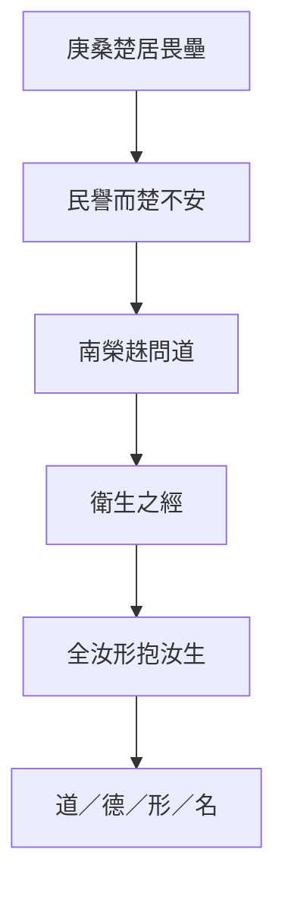

## 17. 延伸閱讀

### 原典與注疏

- 郭慶藩《莊子集釋》〈庚桑楚〉
- 王先謙《莊子集解》〈庚桑楚〉
- 成玄英《南華真經注疏》相關篇章
- 林希逸《莊子口義》相關篇章

### 今注今譯與研究

- 陳鼓應《莊子今註今譯》〈庚桑楚〉
- 王邦雄《莊子內七篇‧外秋水‧雜天下的現代解讀》相關章節
- 劉笑敢等關於《莊子》內、外、雜篇與文本層次的研究

### 本專案內交叉引用

- 相關篇章：〈養生主〉、〈人間世〉、〈德充符〉、〈刻意〉、〈繕性〉、〈庚桑楚〉本篇可連〈外物〉「外物不可必」
- 相關人物：[老聃](content/figures/老聃.md)、庚桑楚、南榮趎
- 相關名詞：衛生之經、全形抱生、[道](content/terms/道.md)、[性命之情](content/terms/性命之情.md)、形、名
- 相關主題：[工作與技道](content/themes/工作與技道.md)、[名與利](content/themes/名與利.md)、[焦慮與比較](content/themes/焦慮與比較.md)


<div class="pagebreak"></div>

<!-- part: 雜篇 id: 24 -->

# 徐無鬼

> **閱讀提示**：本篇依通行本段落次序導讀。下文清楚區分**原典**、**歷代注家**與**本書現代詮釋**；後兩者不可倒寫為「莊子原話」。

## 01. 篇名與背景

〈徐無鬼〉以隱士徐無鬼為線索，寫他因女商引見魏武侯，不談仁義教條，而以相狗、相馬切入「君主究竟賞什麼」。篇中最著名的匠石運斤、郢人白堊，則把「真賞」推到極致：高度技藝必須有能相與的對象（質）；質亡，技亦無可施。

雜篇常拼合多組故事，本篇的貫穿問題是：**政治與知人，能否離開言語表演與偏好？** 真知真賞，對政權與友誼同樣嚴苛。它與〈德充符〉「不以形取人」、〈應帝王〉破全知，形成雜篇中對用人與言說的集中批判；又以[[莊周]]過[[惠施]]之墓悼「無以為質」，把政治諷刺收於友誼與辯難。

> **原典位置**：雜篇・第24篇・〈徐無鬼〉；引文據郭慶藩《莊子集釋》所收通行系統。

## 02. 成書背景

戰國國君身邊充斥游士、說客與「善言」之士；能把仁義說得漂亮，往往比能辨人、能辦事更容易得寵。〈徐無鬼〉針對這種「以言取人」的生態：狗不因善吠為良，人也不該只因善言為賢。

匠石與郢人的故事，則可能來自工匠傳統與知音母題，被編入莊學後，成為對「對手／質」的哲學化：沒有可信任的對方，最高技藝也只能停擺。郭象注本定篇次；引文以郭慶藩《莊子集釋》為據。雜篇成書層次複雜，宜保留「編纂」意識，不宜全歸於莊周親筆。

後段尚有「黃顗問孔子」「南伯子綦」等段落，談知士、名言與道之關係，與前半政治諷刺、匠石哀悼形成三重結構：用人、技藝、知解，皆需「質」。

## 03. 結構分析

1. **徐無鬼見武侯**：拒談現成道德套語，改以相狗、相馬談好尚與知人。
2. **真賞與過**：涉及「真人之過」——連真人亦有過，政治更不可假裝無過。
3. **匠石運斤／郢人**：技與質相依；質死而斤無所運。
4. **後段問道與知士**：名言、知解的限度再被推開。

### 結構圖

```text
徐無鬼見魏武侯
        ↓ 不以善言定賢
相狗／相馬（好尚與用人）
        ↓
真賞／真人之過
        ↓
匠石運斤 ←→ 郢人為質
        ↓ 質亡技歇
莊子過惠施之墓：無以為質
        ↓
名言與知解的限度
```

全篇由「宮廷如何聽人」走到「技藝如何需要對手」，再落到「言說本身的邊界」：政治批判與認識論同場。

## 04. 原典

> **版本依據**：郭慶藩《莊子集釋》；以下擇錄關鍵句，非全篇逐字抄錄。
>
> **原典位置**：雜篇〈徐無鬼〉。

### （一）不以善言為賢

> 狗不以善吠為良，人不以善言為賢。

### （二）相狗相馬

> 吾相狗又不若吾相馬也。……吾相馬，直者中繩，曲者中鉤，方者中規，圓者中規，國馬之材止矣；天下馬一也。

### （三）匠石運斤

> 郢人堊漫其鼻端，若蠅翼，使匠石斲之。匠石運斤成風，聽而斲之，盡堊而鼻不傷，郢人立不失容。

### （四）無以為質

> 自夫子之死也，吾無以為質矣！吾無與言之矣。

### （五）真人之過

> 故真人其過人之也，若人之過也。

### （六）相馬層次（補）

> 上質若亡其一，若絕其一，若失其一，然後天下馬一也。

「天下馬」之說，把知人推到超越外形規矩的層次，與「不以善言為賢」形成對稱：真正的識見，不在聲與辭，而在結構與氣質。

第一則把「說得好」與「人是否賢」切開。第二則以相馬的層次，暗示知物、知人有精粗，不能停在表面反應。第三、四則是匠石典故：運斤成風極寫技，而莊子聞惠施之死歎「無以為質」，則把技藝寓言轉成對知音與論敵的哀悼。

## 05. 白話翻譯

### （一）

狗不因為叫得響就稱良犬，人也不因為話說得好就稱賢人。

### （二）

我相狗的本事，還不如我相馬。相馬時，看它體態是否合於法度——直、曲、方、圓各得其中，這是國馬之材；至於天下馬，則更上一層，不是只看外形規矩。

### （三）

郢人鼻尖沾了一點薄如蠅翼的白粉，請匠石砍掉。匠石揮斧生風，隨手斫去白粉，鼻卻毫髮無傷；郢人站著，面不改色。

### （四）

莊子經過惠施之墓，對跟隨的人講完這故事，說：夫子死了，我沒有對手了，也沒有可以深談的人了。

### （五）

所以真人犯了過錯，就像一般人犯過錯一樣——並非永不失手。

合起來看：本篇要分開的是「說得漂亮」與「真能相與」；政治若只寵善言，便失去質；友誼與辯論若失去可對之質，連最高的表達也落空。

## 06. 字詞註解

| 字詞 | 釋義 | 本篇閱讀提示 |
|---|---|---|
| 徐無鬼 | 篇中隱士 | 以「非善言」路線見國君 |
| 魏武侯 | 魏國君主 | 聽言、好尚的政治舞台 |
| 女商 | 引見者 | 宮廷中介，象徵說客生態 |
| 相狗／相馬 | 品評犬馬 | 喻知人層次；不為「聲」所欺 |
| 善言 | 動聽、合君意之言 | 本篇政治批判的靶心 |
| 真賞 | 真實的賞識 | 能識質，而非識辭令 |
| 質 | 對象、對手、可對之體 | 匠石故事關鍵：無質則技無可施 |
| 運斤成風 | 揮斧快疾如風 | 極技的象徵，依賴信任 |
| 堊 | 白土／白粉 | 鼻端薄粉，寫精度與危險 |
| [[真人]] | 體道之人 | 「真人之過」：連至者亦不諱過 |
| 天下馬 | 最上等的馬 | 相馬層次之高，喻知人之深 |

## 07. 段落解析

**走讀路線**：見武侯／相狗相馬 → 真人之過 → 匠石運斤 → 無以為質。前半諷「善言」，後半悼「對手」——技與言都需要質。

### 為何以見武侯開篇？

宮廷是「善言」最被獎勵的地方。徐無鬼若一開口就講仁義，只是另一種善言；改談相狗相馬，是迫使武侯離開套語，面對自己的好尚與用人之實。相馬層次（國馬→天下馬）更暗示：**知人也有高下，不能停在「會說」**。

### 為何中插入匠石運斤？

相馬還停在「識物」；運斤把問題升級為「關係中的技」：再高的能力，也需要對方不躲、不亂、能承擔風險。這使「真賞」有身體感——賞的不是表演，而是可與之共當危險的默契。與[[工作與技道]]主題相連：技進乎道，仍需「質」。宋元君聽後曰「寡人猶以為重言」——寓言之效在於讓君主自覺其聽言方式之淺。

### 後段名言與知士

篇末「黃顗問孔子」「南伯子綦」等段，再推「知士」「名言」之限：知解可傳，道不可執。這使全篇不止於諷武侯，亦反省**一切言說體制**——包括學術、師承與哲學本身。讀雜篇宜看編纂者如何把政治、技藝、知解三線收於「質」。

### 為何收在「無以為質」？

把匠石故事接到[[惠施]]之死，政治篇忽然變成悼友篇：[[莊周]]與惠施終身辯難，惠施卻是他的「質」。如此，本篇不只諷國君，也自省言辯之條件——沒有對手的正確，是寂寞的正確。宋元君想重演運斤而無人敢當郢人，正是**無質則技不可複製**的寫實。

### 真人之過如何與全篇相關？

「真人其過人之也，若人之過也」打破聖人無過神話，使政治批判仍有自省空間：連「真人」都可過，權力者更不可假裝無瑕。這與「不以善言為賢」呼應——**賢不在話說得滿，而在能承認限度**。

## 08. 歷代注家怎麼看

### 郭象

郭象解匠石段，多強調「非獨工之巧，乃有其質」：技不能離其所對。對武侯段，則警惕以言取士，失其人之實。

### 成玄英

成疏「運斤成風」為心手相得、物我無間；並指出郢人「立不失容」與匠石之信互為條件。其工夫化讀法有助理解「質」，但勿把寓言縮成純粹內修口訣。

### 林希逸

林氏提醒：莊子過惠子之墓而稱「無以為質」，是文情極處——辯敵即知音。讀雜篇不可只摘「狗不以善吠為良」當罵人話，而忽略後文的哀悼結構。

### 郭慶藩與其他

郭慶藩《莊子集釋》於相馬、匠石各段可核對字句；王先謙集解簡明可參。近人論「質」多連知音傳統，宜回到本篇政治與友誼雙線。又，魏武侯好言而輕實，與戰國君主普遍困境相呼應，寓言雖誇飾，問題仍具現代性。

## 09. 哲學分析

> 以下為**本書現代詮釋**。

本篇提出一種嚴格的認識倫理：**能說，不代表能見；能見，還需要能對。** 「善言為賢」之所以危險，是因為語言可以脫離實踐與性格，自成討喜的商品。相狗相馬的層次說，要求判斷回到可觀察的結構，而不是音量與修辭。

「質」的概念比「知音」更冷峻：它包含信任、穩定與一起承擔失誤的可能。匠石可以運斤，因為郢人不閃；政治與組織若人人自保、無人肯當質，再好的人才也只能「聽而無可斲」。真人之過，則打破「有道者永不犯錯」的神話，使批評與自省仍有空間。全篇因此同時服務[[政治與無為]]與[[工作與技道]]兩條主題線。

## 10. 與老子比較

《老子》「信言不美，美言不信」「知人者智」，與「不以善言為賢」同調。老子多從治國用言的戒律說；〈徐無鬼〉則用宮廷對話與工匠寓言，把「言／質」的分裂寫成可感的場面，並連到友誼與喪友，層次更敘事化。

## 11. 與儒家比較

儒家亦重「聽其言而觀其行」「以友輔仁」。本篇與之可對話處在於：反對空言取人。差異是匠石段把「友」推到可共生死風險的「質」，且莊子與惠施的關係並非同門進德，而是辯難中的相成。故可補儒家「觀行」之所未寫：有時對手比同溫層更能成全言說。

## 12. 與佛學比較

本篇暫略。匠石之「質」屬技藝與知音傳統，不宜逕比佛教善知識或禪宗機鋒對手，以免概念錯置。

## 13. 現代人生應用

> 以下為**現代詮釋**，回扣本篇概念。

- **不以善言取人**：面試、投票、追網紅意見時，把「說得真好」與「做得是否穩」分開；多看長期行為與承擔後果的方式。
- **真賞**：欣賞同事或朋友，賞其可託之事、可對之質，而非只轉發其金句。
- **運斤與質**：團隊裡若無人敢當「郢人」（承擔風險、不臨場閃躲），再強的執行者也會被迫收斧——先建立信任，再談極致表現。
- **無以為質**：失去可深辯的對手時，承認寂寞，而非假裝自己已無需對話；必要時主動尋找能立不失容的批評者。
- **真人之過**：領導者與專家亦須保留認錯空間，勿以「絕不出錯」維持權威。

### 13.1 招聘與選舉

履歷上的華麗表述、辯論場上的機鋒、社群上的金句，都可能是「善言」。真賞要求看見：此人在壓力下如何決策、犯錯後如何承擔、與他人合作時是否可當「質」。

### 13.2 團隊中的郢人

高績效文化常缺少敢承擔風險的「質」——人人怕背鍋，便無人敢讓匠石運斤。領導者若只獎表演、不獎承擔，團隊技藝終會空心化。

### 13.4 公共討論中的「質」

公共討論若只剩同溫層按讚，便無「質」可言。真賞在公共領域意味著：主動尋找能立而不失容的反方、願意被修正的對話夥伴，而非只收集支持自己的證據。

## 14. 常見誤解

1. **「反對善言＝反對溝通、鼓勵講粗話。」** 所反的是以動聽取代賢能，不是否定清楚表達。
2. **「匠石故事教人冒險炫技。」** 重點是信與質；無質而運斤，是宋元君式的愚蠢重演。
3. **「真賞就是挑剔、永遠不滿意。」** 真賞是能識結構與承擔，不是以否定證明自己高明。
4. **「莊子悼惠施＝忽然變溫情主義。」** 悼的是失質；辯難本身仍被肯定為思想的條件。
5. **「真人無過，故政治人物可神聖化。」** 文本反說真人之過——更不可神化權力。
6. **「相馬只論外形。」** 天下馬之說，正是超越表面規矩的層次。
7. **「悼惠施＝否定辯論。」** 悼的是失質，不是否定惠施之學；〈天下〉篇對惠施仍有專條評述。

## 15. 本篇總結

〈徐無鬼〉從魏武侯的聽言，寫到匠石的運斤，再落到莊子失惠施之質：它追問的是**誰配被賞、誰配被言、誰配作為對手**。警句「狗不以善吠為良，人不以善言為賢」必須與「吾無以為質矣」連讀，才不致變成只會罵人的口號。全篇三線——宮廷用人、工匠技藝、哲學辯難——同歸於「質」：沒有可對之體，言與技皆空轉。

若以一句話收束：**沒有可對之質，再華麗的言與再高的技，都只是空轉。**

## 16. 心智圖

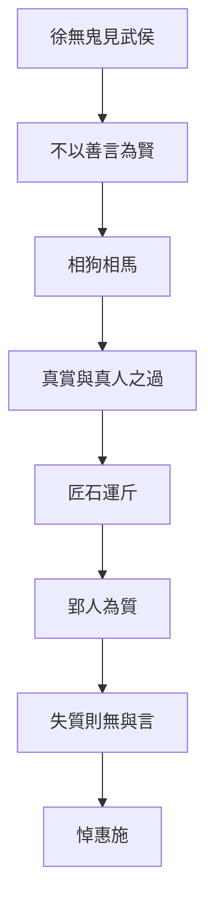

## 17. 延伸閱讀

### 原典與注疏

- 郭慶藩《莊子集釋》〈徐無鬼〉
- 王先謙《莊子集解》〈徐無鬼〉
- 成玄英《南華真經注疏》相關篇章
- 林希逸《莊子口義》相關篇章

### 今注今譯與研究

- 陳鼓應《莊子今註今譯》〈徐無鬼〉
- 王邦雄《莊子內七篇‧外秋水‧雜天下的現代解讀》相關章節
- 劉笑敢等關於《莊子》內、外、雜篇與文本層次的研究

---
### 交叉引用
- 相關篇章：〈德充符〉、〈大宗師〉、〈秋水〉、〈天下〉
- 相關人物：徐無鬼、魏武侯、匠石、郢人、[[莊周]]、[[惠施]]
- 相關名詞：[[真人]]、善言、真賞、質、運斤成風
- 相關主題：[[政治與無為]]、[[工作與技道]]、知人、友誼與辯難

### 讀法建議

初讀宜通讀全篇，勿只摘「狗不以善吠為良」；須讀到匠石運斤與悼惠施，才見全篇文勢。與〈天下〉惠施條、〈齊物論〉辯論傳統、〈德充符〉不以形取人可並讀。研究層次宜並置郭慶藩、林希逸對「質」的說明，並標明雜篇編纂性。匠石段與〈徐無鬼〉外〈列御寇〉等技藝寓言可對照，但本篇獨特處在宮廷用人與悼友並置。


<div class="pagebreak"></div>

<!-- part: 雜篇 id: 25 -->

# 則陽

> **閱讀提示**：本篇依通行本段落次序導讀。下文清楚區分**原典**、**歷代注家**與**本書現代詮釋**；後兩者不可倒寫為「莊子原話」。

## 01. 篇名與背景

〈則陽〉以人物則陽遊於楚開篇，隨即進入少知與太公調關於道、言、知的問答；中段戴晉人對魏王講述蝸角上蠻氏、觸氏之戰，把「奪地而戰、伏尸數萬」縮到蝸牛兩角——全篇最尖銳的政治寓言。其問題不是「世界很小」的感嘆，而是：**名分與尺度一被絕對化，微小的爭端也可燃燒成巨大的犧牲。**

雜篇材料駁雜，本篇宜抓住「名實／尺度」主軸：游士求見、玄談道體、國君爭地，三種場面共用同一把被放大的尺子。它與〈齊物論〉彼是、〈秋水〉小大無定、〈徐無鬼〉不以善言為賢，可並讀為莊學對**名實政治**的持續追問。

> **原典位置**：雜篇・第25篇・〈則陽〉；引文據郭慶藩《莊子集釋》所收通行系統。

## 02. 成書背景

戰國爭地、會盟、游說並行：一寸疆土、一項名號，皆可動員千軍。名家、辯者又使「名」「實」成為專門問題。〈則陽〉把這兩股壓力疊在一起——太公調談道不可執於言，戴晉人則用蝸角讓國君看見自己的戰爭尺度何其荒謬。

此類寓言不必視為史實紀錄；它是思想實驗：若把觀測尺度拉遠，今日不可讓的「國恥／國體」，是否仍值得以數萬生命支付？引文據郭慶藩《莊子集釋》。雜篇成書非一時，讀者宜保留編纂與層次意識。

則陽遊楚見接輿、舊國舊都之歎，與蝸角寓言形成對照：前者寫故土之名牽動情感，後者寫名分膨脹導致殺戮——名可使人暢然，也可使人伏尸。

## 03. 結構分析

1. **則陽遊楚**：求聞於有道，見接輿之風而不得其門——先寫「言與見」的落空。
2. **少知問太公調**：道、物、言、知如何相及而不相役。
3. **戴晉人／蝸角蠻觸**：魏瑩欲戰，以蝸牛兩角之國相喻。
4. **名實收束**：爭的是名，耗的是實；尺度一變，勝負改觀。

### 結構圖

```text
則陽遊楚（求言而不得）
        ↓
少知 ↔ 太公調（道／言／知）
        ↓ 把「大」說破
戴晉人：蝸角上的蠻觸之戰
        ↓ 尺度塌陷
名實之爭顯出偶然與可讓
```

順序上，先讓「求道之言」受挫，再給玄理，最後用寓言砸向具體戰爭——理論不懸空，政治不免責。

## 04. 原典

> **版本依據**：郭慶藩《莊子集釋》；以下擇錄關鍵句，非全篇逐字抄錄。
>
> **原典位置**：雜篇〈則陽〉。

### （一）蝸角蠻觸

> 有國於蝸之左角者曰觸氏，有國於蝸之右角者曰蠻氏；時相與爭地而戰，伏尸數萬，逐北旬有五日而後反。

### （二）丘里之言

> 少知問於太公調曰：「何謂丘里之言？」……太公調曰：「……言而足，則終日言而盡道；言而不足，則終日言而盡物。……」

### （三）道與一曲

> 道不可有，有不可無。……或使莫為，在物一曲。

### （四）則陽遊楚

> 則陽之楚，南之沛，見接輿而問焉，曰：「舊國舊都，望之暢然。」

### （五）名實（節錄）

> 名也者，相軋也；實也者，相爭也。

名實相軋，是蝸角寓言的理論收束：爭端常因名而起，耗的卻是實。

蝸角一段是本篇記憶點：兩國在蝸牛角上爭地，死傷慘重——對聽者（魏王）而言，這不是笑話，而是鏡子。少知與太公調則處理「言能否盡道」：言若自足於道則可，若只在物上打轉，終日言也只是盡物。後者與蝸角寓言合流：把局部物爭說成絕對大道，正是「言而不足」的政治版。

## 05. 白話翻譯

### （一）蝸角

蝸牛左角上有個國家叫觸氏，右角上有個叫蠻氏；兩邊為了爭地盤打仗，倒斃的屍體數以萬計，追擊敗軍十五天後才回來。

### （二）丘里之言

少知問太公調：什麼叫「丘里之言」？太公調答到：話若真夠得上道，整天說也在說道；話若夠不上，整天說也只是在說物。道不能被「佔有」；硬說「有」或硬說「無」，都容易偏在一曲。

### （三）則陽

則陽到楚國，向南到沛，見接輿而問。接輿說：舊國舊都，遠遠望見就暢快——暗示故土之名與實感相連，亦可能被名所縛。

合起來看：本篇不是叫人覺得「人類很渺小就好了」；它要讀者看見——爭端常由一個被絕對化的名分與尺度放大。站在蝸牛之外，蠻觸之戰荒唐；站在一角之內，它卻像整個世界。政治智慧在於，偶爾願意爬到角外看一眼。

## 06. 字詞註解

| 字詞 | 釋義 | 本篇閱讀提示 |
|---|---|---|
| 則陽 | 篇首游士 | 求見、求言的起點 |
| 少知／太公調 | 問答雙方 | 處理道與言之關係 |
| 丘里之言 | 鄉里間的說法／局部之言 | 對比「盡道」之言 |
| 戴晉人 | 說蝸角寓言者 | 以喻諫君，改其戰爭尺度 |
| 蠻氏／觸氏 | 蝸角兩國 | 極端縮小的「國際關係」 |
| 爭地 | 爭奪土地 | 戰國主題的寓言化 |
| 伏尸數萬 | 死傷極多 | 諷刺「小爭」的大代價 |
| 名實 | 名稱與實際 | 本篇政治哲學關鍵 |
| 尺度 | 觀看與評價的基準 | 蝸角寓言之所改 |
| 一曲 | 偏於一端 | 太公調對言之戒 |
| 接輿 | 楚狂接輿 | 與則陽段相連的隱逸形象 |

## 07. 段落解析

**走讀路線**：則陽求言不得 → 太公調論言 → 蝸角蠻觸之戰 → 名實收束。蝸角段是全文記憶點：**角內像天下，角外像鬧劇。**

### 為何先寫則陽遊楚、求言不得？

開篇若直接講蝸角，易被當成只諷戰爭。先寫求道者得不到現成教誨，才建立全篇態度：重大道理往往不在可販售的「一句話」，而在尺度轉換的經驗。接輿「舊國舊都，望之暢然」亦暗示：**名（故土）可牽動實感，也可成執**。

### 為何中段要有太公調？

蝸角是形象打擊；太公調是概念準備。「言而足／不足」說明：語言可以盡道，也可以把人鎖在物爭裡。沒有這段，寓言只剩相對主義的笑；有了這段，笑才變成對「名言如何製造戰爭」的分析。與[[齊物]]論的彼是、[[卮言]]的流動相呼應。

### 則陽與接輿：舊國之名

則陽見接輿，接輿言「舊國舊都，望之暢然」——故土之名可牽動真實情感，亦可成執。這與蝸角形成張力：名可以使人歸心，也可以使人伏尸。全篇因此不是單純「名皆虛」，而是**名實何時相稱、何時脫節**的細密追問。

### 為何蝸角放在政治對話裡？

戴晉人不是對隱士說宇宙觀，而是對欲戰的魏王說。寓言的位置決定其功能：改君之尺，不是勸人出世。後文名實之累，則防止讀者以為「看小了就結束」——真正要鬆動的是以名為實的執著。這與[[政治與無為]]的「戒強加」不同層面：本篇重**尺度**，彼篇重**私意整容**。

### 名實收束如何與全篇相關？

爭地之戰，表面是實（土地），往往由名（國體、恥辱、正義）驅動。蝸角寓言使名實脫節可見：角外看，名很大、實很小；角內看，實（生命）支付於名的膨脹。太公調的「一曲」，正是警告：任何立場、學說、民族敘事，都可能只是局部，卻自稱全體。

## 08. 歷代注家怎麼看

### 郭象

郭象讀蝸角，重在「以差觀之，則齊」：自其異者視之，肝膽楚越；自其同者視之，萬物皆一。他強調尺度相對，但亦須防把郭注讀成取消一切是非的藉口——文本針對的是爭地之虐，不是取消救護。

### 成玄英

成疏蠻觸，明言以小喻大、破國君矜伐；於太公調段則重「遣名」以求玄通。其破執語感強，仍屬唐代義疏層。

### 林希逸

林氏特賞蝸角敘事的戲劇力：先問「有之乎」，再指「在魏王之前」——讓聽者發現自己正是角上之人。讀法上不可只當奇想，而要還原諫諍結構。

### 郭慶藩與其他

郭慶藩《莊子集釋》於蝸角、丘里之言各段可核對異文；王先謙集解簡明。近人常將本篇與戰國地緣政治、名辯研究並讀。又，戴晉人寓言的諫諍結構，與《戰國策》說士傳統有形式相似，但莊子目的在改尺度，不在提供權謀。

## 09. 哲學分析

> 以下為**本書現代詮釋**。

本篇的哲學貢獻是把[[齊物]]的「因是因非」接到地緣政治：是非不只在口舌，也在地圖與動員令裡。蝸角寓言運作的機制是**尺度轉換**——同一場戰爭，在角內是聖戰，在角外是鬧劇。名實問題因此不是書齋遊戲：當「名」要求「實」無限支付（人民、土地、尊嚴的修辭），莊子要求重新校準名是否仍指涉其宣稱要保護之物。

「言而足則盡道，不足則盡物」可讀作：政治修辭若只在物（土地、戰利、面子）上打轉，卻自稱替天行道，便是言不足而僭道。太公調的「一曲」，正是對這種僭越的診斷。與[[焦慮與比較]]主題相連：人常因比較與名分而放大爭端，蝸角則提供認知上的「拉遠」。

## 10. 與老子比較

《老子》「兵者凶器」「飄風不終朝」，與蝸角諷戰相通；「道可道，非常道」亦近太公調對言之戒。差異在於：老子常以治術格言收斂欲望；〈則陽〉用極小空間裡的極大傷亡，製造認知休克，使國君無法維持原來的「不得不戰」敘事。

## 11. 與儒家比較

儒家重義戰、正名、華夷與封疆。本篇不否認秩序需要名稱，但質問：正名若成為爭地的燃料，名是否已離實？可與孟子反「爭地以戰，殺人盈野」對讀——價值取向或近，而莊子的方法是尺度寓言，不是仁政制度設計。

## 12. 與佛學比較

本篇暫略。雖有人以「一多」「須彌芥子」比蝸角，然本篇脈絡是戰國諫戰與名實，與佛教宇宙論、空觀修行不同源，不宜硬比附。

## 13. 現代人生應用

> 以下為**現代詮釋**，回扣本篇概念。

- **蝸角之爭**：組織內鬥、網路論戰、家族意氣相持時，試問「若把鏡頭拉遠十倍，這塊『地』還值不值得伏尸（關係破裂、健康透支）？」
- **名實尺度**：頭銜、品牌、國族修辭都很硬時，查核它們實際保護了什麼、犧牲了什麼；名大而實空，便是角上的旗。
- **言而足／盡物**：發言前區分：我是在澄清道理，還是在反覆搬運情緒與物利？後者即使終日言，也只是盡物。
- **一曲之戒**：專業、立場、陣營都是「一曲」；需要時借太公調的提醒，承認自己可能只看見蝸牛的一角。
- **則陽求言**：重大抉擇前，少依賴單一金句，多做尺度轉換的實際檢核。

### 13.1 組織內鬥的蝸角化

部門利益、職稱、歸功歸責等「小地」，有時消耗遠超其實質價值。定期用「蝸角測試」：若把時間拉到五年後、視角拉到公司外，這場爭執還值得伏尸（健康、信任、合作）嗎？

### 13.2 輿論與國族修辭

當「名」要求無限支付——時間、仇恨、犧牲——宜問：這個名實際保護了誰的日常生活？誰在承擔伏尸？太公調的「一曲」提醒我們：任何敘事都可能是局部。

### 13.3 言而足與公共討論

公共討論若只剩立場宣稱與情緒動員，便是「言而不足，終日言而盡物」。言而足要求論點可修正、證據可檢核、尺度可轉換——這與〈徐無鬼〉不以善言為賢同調。

### 13.4 決策前的尺度檢核

重大決策（離職、離婚、遷徙、組織對抗）前，可做「蝸角檢核」：列出你以為在守的「名」，再列出實際支付的「實」（健康、關係、金錢、時間）。若實遠大於名所指涉之物，尺度可能已失真。

## 14. 常見誤解

1. **「蝸角＝人生毫無意義，什麼都不必爭。」** 寓言針對的是被放大的名實之戰，不是取消保護弱者或基本正義。
2. **「看破尺度就可以嘲笑所有認真的人。」** 戴晉人是為了止戰與校準，不是培養犬儒式冷笑。
3. **「名都是假的，所以不用負責任。」** 本篇要名回到實，不是廢名；無名的權力往往更難追究。
4. **「太公調教人不說話。」** 「言而足」反而肯定能盡道之言；所戒是不足而強以為道。
5. **「則陽篇只是相對主義故事集。」** 結構上有求道、論言、諫戰的推進，主題是尺度與名實，不是怎麼都行。
6. **「蝸角只諷古代戰爭。」** 名實與尺度問題在當代組織、輿論、地緣敘事中仍常可見。
7. **「接輿暢然＝否定鄉愁。」** 故土之名可動人，問題在名是否膨脹為無限支付之命。

## 15. 本篇總結

〈則陽〉以遊楚求言起，經太公調之理，落在蠻觸之戰的鏡子上：它逼問國君與讀者——**你以為自己在守整個天下，是否其實只在守蝸牛的一角？** 名實與尺度一明，許多「不可讓」會重新變得可商量；真正不可讓的，應是生命與基本之實，而非膨脹的名。則陽之求、接輿之暢、戴晉人之諷，三層共同完成「名可動人，亦可殺人」的立體論證。

若以一句話收束：**先改尺子，再決定是否值得一戰。**

## 16. 心智圖

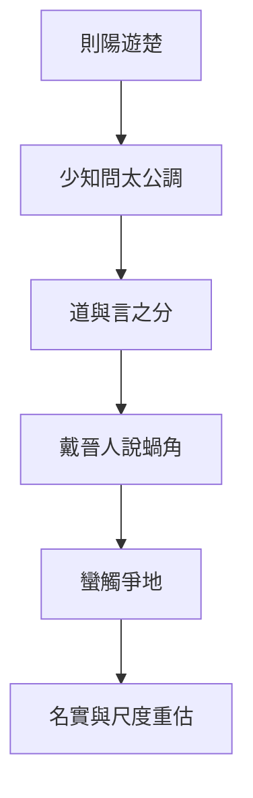

## 17. 延伸閱讀

### 原典與注疏

- 郭慶藩《莊子集釋》〈則陽〉
- 王先謙《莊子集解》〈則陽〉
- 成玄英《南華真經注疏》相關篇章
- 林希逸《莊子口義》相關篇章

### 今注今譯與研究

- 陳鼓應《莊子今註今譯》〈則陽〉
- 王邦雄《莊子內七篇‧外秋水‧雜天下的現代解讀》相關章節
- 劉笑敢等關於《莊子》內、外、雜篇與文本層次的研究

---
### 交叉引用
- 相關篇章：〈齊物論〉、〈秋水〉、〈逍遙遊〉、〈徐無鬼〉
- 相關人物：則陽、少知、太公調、戴晉人、魏瑩
- 相關名詞：[[齊物]]、[[卮言]]、蝸角、蠻觸、名實、尺度、丘里之言
- 相關主題：[[焦慮與比較]]、[[政治與無為]]、戰爭、語言與政治

### 讀法建議

初讀宜抓住則陽—太公調—蝸角三層推進，勿只記蠻觸之戰為笑話。與〈秋水〉河伯見海、〈齊物論〉彼是、〈逍遙遊〉小大之辯並讀，可見莊學「尺度」主題的一條長線。研究時並置郭象、林希逸對蝸角諫諍結構的說明，並以郭慶藩核對字句。則陽見接輿與戴晉人見魏王，宜對讀：前者寫名之暢，後者寫名之殺。


<div class="pagebreak"></div>

<!-- part: 雜篇 id: 26 -->

# 外物

> **閱讀提示**：本篇依通行本段落次序導讀。下文清楚區分**原典**、**歷代注家**與**本書現代詮釋**；後兩者不可倒寫為「莊子原話」。

## 01. 篇名與背景

〈外物〉開宗明義：「外物不可必」——外界的事物、機遇、別人的反應，都不能用意志保證。篇中有莊周貸粟、任公子以大鉤巨緇釣魚、儒者詩禮發冢等故事，末段收在「得魚忘筌」「得意忘言」：工具（筌、蹄、言）為抵達而設，抵達後執著工具，便反客為主。

本篇因此有雙線：**生存條件的不可控**，與**符號工具的可放下**。雜篇拼合痕跡明顯，但兩線共同指向——人若把外物與言說當成可必、可執的終點，便會自困。

> **原典位置**：雜篇・第26篇・〈外物〉；引文據郭慶藩《莊子集釋》所收通行系統。

## 02. 成書背景

戰國民生無常：貸貸、乾魚、大河之魚，皆可寫成寓言。士人又依賴詩書禮樂作為晉身工具，遂有「儒以詩禮發冢」的尖刻諷刺——經典若只為盜墓式的利益服務，文言與實行已經脫節。

「筌蹄」之喻後來影響魏晉言意之辨，但在本篇脈絡裡，它首先接在「外物不可必」之後：連魚是否上鉤都不可控，何況把筌當成魚本身。引文據郭慶藩《莊子集釋》。

## 03. 結構分析

1. **外物不可必**：總起——陰陽、天時、人情皆不可強求必得。
2. **莊周貸粟／涸轍**：急難中的緩不濟急，寫「必」之妄。
3. **任公子釣魚**：大鉤巨緇、蹲乎會稽——大事需大器與時，非小得失可比。
4. **儒以詩禮發冢**：諷經典工具化。
5. **得魚忘筌／得意忘言**：收束工具與意旨的關係。

### 結構圖

```text
外物不可必（總綱）
        ↓
貸粟／急難（不可必的日常）
        ↓
任公子大鉤（不可必的「大成」條件）
        ↓
詩禮發冢（工具被利益劫持）
        ↓
得魚忘筌 → 得意忘言
```

由「求而不可必」，寫到「得而應能忘」：前者戒妄控，後者戒執器。

## 04. 原典

> **版本依據**：郭慶藩《莊子集釋》；以下擇錄關鍵句，非全篇逐字抄錄。
>
> **原典位置**：雜篇〈外物〉。

> 外物不可必，故龍逢誅，比干戮，箕子狂……

> 任公子為大鉤巨緇，五十犗以為餌，蹲乎會稽，投竿東海……

> 儒以詩禮發冢。……「詩固有之曰：『青青之麥，生於陵陂。……』」

> 荃者所以在魚，得魚而忘荃；蹄者所以在兔，得兔而忘蹄；言者所以在意，得意而忘言。吾安得夫忘言之人而與之言哉！

> 莊周家貧，故往貸粟於監河侯。監河侯曰：「諾。我將得邑金，將貸子三百金，可乎？」莊周忿然作色曰：「周昨來，有中道而呼者。周顧視車轍中，有鮒魚。周問之曰：『鮒魚來，子何為者邪？』對曰：『我，東海之波臣也。君豈有斗升之水而活我邪？』周曰：『諾。我且南遊吳越之王，激西江之水而迎子，可乎？』鮒魚忿然作色曰：『吾失神明，無所處，吾得斗升之水然活耳，君乃言此，曾不如早索我於枯魚之肆！』」

第一則以忠臣命運說明：德行與外物後果之間沒有保證契約。第二則任公子之釣，寫「大」需要相稱的工具與等待，嘲諷只用小竿心思度量世界的人。第三則儒者一邊誦詩一邊盜墓，極寫文言與行為的分裂。第四則是全書論言意最常被徵引的句子：筌、蹄、言都是手段；並歎息難遇已能忘言、仍可與之言的人。第五則「貸粟／涸轍之魚」把「不可必」落到急難：緩不濟急的承諾，與空談大計同構——都是用遙遠的「將來」迴避當下的責任。

## 05. 白話翻譯

外在的事物不能指望「必然如此」：所以龍逢被殺，比干被害，箕子裝瘋……德行換不來外物的保險。

任公子做了巨大的釣鉤和粗繩，用五十頭牛當魚餌，蹲在會稽，把竿投向東海……（久之才有大魚），然後遠近的人才能分享——這不是抱著小魚竿在溝渠邊能理解的事業。

有儒生按著詩禮去挖墳。……還引《詩》說「青青的麥子，長在山坡上……」——經典成了掩護盜掘的台詞。

魚笱是用來捕魚的，捕到魚就該忘掉魚笱；兔網是用來捉兔的，捉到兔就該忘掉兔網；言語是用來傳達意思的，得到意思就該忘掉言語。我哪裡能遇到已經忘掉言語的人，再和他說話呢！

合起來看：「忘筌」不是反知識、反語言，而是警告——工具一旦被當成目的，就遮住原本要抵達的事；「外物不可必」則提醒：物資、機會與名位，從來不是意志的奴隸。

## 06. 字詞註解

| 字詞 | 釋義 | 本篇閱讀提示 |
|---|---|---|
| 外物 | 自身以外的事物與際遇 | 篇名；強調不可「必」 |
| 不可必 | 不能保證、不能強制 | 總綱；反宿命擔保幻想 |
| 任公子 | 寓言中的大釣者 | 大事業需大器與時 |
| 大鉤巨緇 | 巨大釣具 | 與小智小得對照 |
| 貸粟 | 借糧 | 莊周急難；緩不濟急的諷喻 |
| 詩禮發冢 | 以詩禮之言盜墓 | 諷經典淪為利益話術 |
| 荃／筌 | 捕魚器具 | 「得魚忘筌」之器 |
| 蹄 | 捕兔之具 | 與筌並列的工具喻 |
| 得意忘言 | 得意義而忘言辭 | 言意關係；影響後世玄學 |

## 07. 段落解析

**走讀路線**：外物不可必 → 貸粟急難 → 任公子大釣 → 詩禮發冢 → 得魚忘筌。兩條線：**別妄想必得**，**別死抓工具**。

### 為何以「不可必」總起？

若無此句，後文任公子、忘筌易被讀成成功學或語言哲學專題。總起先切斷「德→福」「努力→必得」的契約幻想，後面的故事才都落在同一個問題域：人如何在不可控中仍合宜地使用工具與言語。

### 莊周貸粟為何接在總起之後？

借糧遭拒、涸轍之魚——寫的是「急難等不得大計畫」。它把「不可必」從抽象拉到日常：人餓了不能只用長遠道理搪塞。讀任公子前先看見小急難，才懂大釣不是嘲笑貧困，而是校正尺度。

### 為何要有任公子？

貸粟寫小急難；任公子寫大企圖。兩者都「不可必」，但尺度不同：有人用小溝的邏輯嘲笑東海之釣，正如用短期績效否定需長期條件的事。段落功能是校正「小成見」。

### 為何以忘筌收尾？

前面寫外物難必，人容易改為死抓工具（多備筌、多堆言、多引詩禮）。發冢段展示工具被劫持的醜態；忘筌段則給出對治：目的達成（或意義已得）後，放開工具，才能再與「忘言之人」對話——否則永遠在修辭層打架。

### 貸粟與涸轍之魚的諷刺結構

監河侯的「將貸子三百金」與莊子對鮒魚的「激西江之水而迎子」形成鏡像：兩者都用遙不可及的未來搪塞眼前的急需。這不是說人永遠不能規劃長遠，而是警告——當「大計畫」被用來迴避當下可做的最小幫助，它就變成另一種巧偽。段落因此把「外物不可必」與「人際責任」接起來：你可以控制不了結果，卻仍須辨認自己是在真誠回應，還是在表演慷慨。

### 與〈寓言〉、〈天下〉的言說線

忘筌句常與〈寓言〉的「言無言」、〈天下〉對莊周「卮言」的評述連讀。三篇共同關心：語言如何既必要又可放下。〈外物〉的獨特貢獻在於把言意問題嵌進「外物不可必」的生存處境——人對世界失控時，最容易加倍投資在可控的言與器上。

## 08. 歷代注家怎麼看

**郭象**解「外物不可必」，謂人之生當安其不可奈何；解忘筌，則謂言以出意，得意則言可忘——重在不執。其「安命」色彩強，宜與文本對忠臣被戮的憤慨並讀，避免變成純然順民哲學。

**成玄英**疏任公子，強調志大者器大、不可與井蛙論；疏筌蹄，則連到遣教、忘言的工夫。有助理解「忘」，但勿把莊子收成只勸人沉默。

**林希逸**特點「儒以詩禮發冢」之諷：莊子惡的是竊詩禮之名而行盜之實。讀忘筌句，他亦提醒末句「安得忘言之人而與之言」——忘言不是終止交談，而是尋找能越過言障的對話者。

**王先謙**於貸粟段多從惠施與莊子交誼傳統注之，提醒監河侯或即惠施之別稱（諸說不一）；無論坐實與否，諷刺結構不變：知識分子之間的「將來幫你」有時比陌生人的拒絕更傷人，因為它消耗了信任卻未兌現。

**郭慶藩**集釋於「得魚忘筌」句廣引魏晉言意之辨材料，顯示此喻在後世哲學史中的獨立生命；讀戰國原脈絡時，仍應把它放回「外物不可必」之後——忘筌首先是生存與工具倫理，然後才是玄學命題。

## 09. 哲學分析

> 以下為**本書現代詮釋**。

本篇同時處理**因果傲慢**與**符號崇拜**。因果傲慢以為外物可由德行或計劃鎖定；符號崇拜以為掌握經典、模型、術語就等於掌握實事。任公子表明：有些目標需要相稱的條件與時間，不可必得，卻仍可準備；忘筌表明：準備本身不是目的。

「得意忘言」常被抽去當藝術理論；在〈外物〉裡，它緊貼「外物不可必」——因為人對外物失控時，最容易加倍投資在可控的言與器上，最後只剩下器，沒有魚。莊子要的是：用言，但不被言佔滿；求物，但不與不可必之物賭上整個自我。

與[語言與真實](content/themes/語言與真實.md)主題條目可對讀：全書從〈齊物論〉的天籟、〈外物〉的忘筌到〈寓言〉的三種言，形成一條可追蹤的言說哲學線。本篇的現代意義在於：當我們無法控制市場、疫情、選舉結果時，是否反而更執著於意識形態口號、方法論標籤、或學位與證照——把「筌」當成「魚」？

## 10. 與老子比較

《老子》「為者敗之，執者失之」「功成身退」，與「不可必」「忘筌」相近：戒強執。老子更常從治道與謙退說；〈外物〉則並舉忠臣慘局、大釣、盜墓儒生，使「執」的失敗有社會與語言的多幅畫面。

## 11. 與儒家比較

本篇「詩禮發冢」是對儒家符號被濫用的內部嘲諷式外部批評：不是否定詩禮可成德，而是暴露其可被盜用。孔子亦重「辭達而已矣」；「得意忘言」可與「辭達」對讀——達意之後，不以辭為驕。爭點在於：莊子更不信任外物對德行的回報契約。

## 12. 與佛學比較

本篇暫略。後世禪語常引「得魚忘筌」，屬格義與後設挪用；原典脈絡是先秦言意與外物，與佛教「筏喻」可作有限對話，但不宜直接等同解脫論。

## 13. 現代人生應用

> 以下為**現代詮釋**，回扣本篇概念。

- **外物不可必**：求職、感情、創作發表，可盡力準備，但把「結果必須如我所願」從自我價值裡卸載；未得不等於人格破產。
- **任公子之釣**：做需要長期累積的事時，拒絕只用「小溝邏輯」自我羞辱；檢查是否已具備相稱的「鉤與餌」（能力、資源、時間），而非只焦慮。
- **得魚忘筌**：學位、證照、簡報模板、術語——有用就用；事已成、意已達，便少拿它們壓人，也少被它們反鎖。
- **得意忘言**：爭論停在用詞警察時，改問「對方要保全的意思是什麼？」先得魚（意），再決定是否還要修筌（措辭）。

### 與全書「執」的批判線

從〈齊物論〉破成心、〈外物〉忘筌，到〈寓言〉言無言，莊子對「執器不執意」的關心一脈相承。本篇的「不可必」則補上**因果謙卑**：你可以準備大鉤，卻不能保證東海必有大魚；你可以誦詩禮，卻不能保證德行必得善終。這不是虛無，而是把努力從「擔保幻想」改為「合宜回應」。讀〈秋水〉「計四海之不能容大也」時，亦可見同一種尺度謙卑：大與小、成與敗，都須放在更寬的視野裡，而非賭上整個自我。

## 14. 常見誤解

1. **「外物不可必＝什麼都別規劃。」**  
   任公子恰恰在準備大器；不可必 ≠ 不作為。

2. **「忘筌＝反智、焚書、不學習。」**  
   先有筌而後可忘；無筌而誇忘，是空話。

3. **「得意忘言＝可以隨便說話、不負責。」**  
   忘的是執辭，不是取消意義與承諾。

4. **「諷儒＝全面否定儒家經典。」**  
   諷的是以詩禮掩護發冢式利益，不是否定經典的成德可能。

5. **「大釣成功學：要做就做最大。」**  
   寓言對照的是器與志相稱，以及小見笑大；不是盲目放大賭注。

## 15. 本篇總結

〈外物〉以「不可必」為綱，以任公子寫條件與等待，以發冢寫工具被盜，以忘筌寫得而後能捨。它既戒對外物的擔保幻想，也戒對言語與器具的戀物。末句「安得夫忘言之人而與之言」說明：忘言不是封閉，而是為了重新打開真正的交談。

若以一句話收束：**外物強求不到，言語執著不得；魚與意才是方向，筌與言只是路过的工具。**

## 16. 心智圖


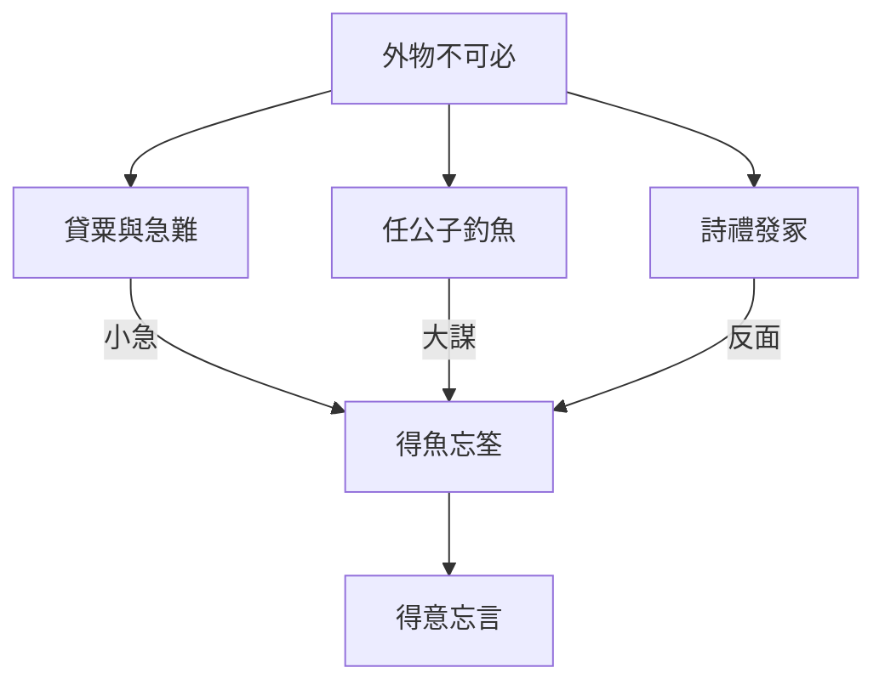

## 17. 延伸閱讀

### 原典與注疏

- 郭慶藩《莊子集釋》〈外物〉
- 王先謙《莊子集解》〈外物〉
- 成玄英《南華真經注疏》相關篇章
- 林希逸《莊子口義》相關篇章

### 今注今譯與研究

- 陳鼓應《莊子今註今譯》〈外物〉
- 王邦雄《莊子內七篇‧外秋水‧雜天下的現代解讀》相關章節
- 劉笑敢等關於《莊子》內、外、雜篇與文本層次的研究；魏晉「言意之辨」相關討論

### 本專案內交叉引用

- 相關篇章：〈逍遙遊〉、〈齊物論〉、〈養生主〉、〈秋水〉、〈寓言〉、〈天下〉
- 相關人物：[莊周](content/figures/莊周.md)、[惠施](content/figures/惠施.md)、任公子
- 相關名詞：外物、不可必、筌蹄、得意忘言、[寓言](content/terms/寓言.md)
- 相關主題：[語言與真實](content/themes/語言與真實.md)、[無用與有用](content/themes/無用與有用.md)、[名與利](content/themes/名與利.md)


<div class="pagebreak"></div>

<!-- part: 雜篇 id: 27 -->

# 寓言

> **閱讀提示**：本篇依通行本段落次序導讀。下文區分**原典**、**歷代注家**與**本書現代詮釋**；後兩者不可倒寫為「莊子原話」。

## 01. 篇名與背景

〈寓言〉篇名即全書寫作方法的自白。「寓」是寄託：把意思寄在別人、別事、別地上說；「言」則提醒讀者：莊子從來不以單一論證壓倒讀者，而以多聲部的說話方式打開思考。

本篇在雜篇中的特殊地位，在於它幾乎像一篇「讀《莊子》說明書」。〈天下〉末段亦以寓言、重言、卮言概括莊周之文；〈寓言〉則把這三種言說攤開，並用具體故事示範：為何有時要借重古人、為何有時要讓語言像酒器般隨滿隨傾。讀本篇，等於同時讀「怎麼說」與「怎麼聽」。

> **原典位置**：雜篇・第27篇・〈寓言〉。版本依據見下「原典」節。

## 02. 成書背景

〈寓言〉的語言理論口吻，與內篇寓言實踐高度呼應，但篇中若干人物故事（如陽子居見老聃、曾子再仕）的編排方式，仍顯示雜篇常見的「理論綱領＋例證串聯」結構。近人多視其為莊學傳統中對自身文體的後設反省：未必每一則例證皆出莊周親筆，但「三種言」的框架確能解釋內篇為何如此寫。

戰國名辯與游士辭令盛行，「說服」常等於爭勝。本篇卻提出另一條路：不是把話說得更硬，而是讓話說得更活——讓聽者自己從寄託中轉出新的觀看位置。引文以郭慶藩《莊子集釋》所收通行系統為準；異文異讀另參校勘，不宜由單一標點推斷全篇思想。

## 03. 結構分析

全篇可粗分為三層：先立「寓言／重言／卮言」與「和以天倪」的總綱；再以「齊與言」的辯證說明為何「不言則齊」仍必須言；其後串入陽子居南之沛、曾子再仕而心再化等故事，把抽象的說話方法落回具體的人情與仕隱抉擇。

### 結構圖

```text
寓言十九（寄託他人他事）
        ↕
重言十七（借重耆舊權威）
        ↕
卮言日出（隨滿隨傾的活語）
        ↓
和以天倪（與自然之分際相和）
        ↓
陽子居見老聃／曾子再仕等例
        ↓
示範：成見如何被語言鬆動
```

節奏上，理論在前、故事在後：先讓讀者知道「為什麼要用這種寫法」，再看「用了之後人會怎樣改變」。這與〈齊物論〉「物化」的是非相對、〈人間世〉「心齋」的聽言工夫可互相參照。

## 04. 原典

> **版本依據**：郭慶藩《莊子集釋》所據通行本；以下擇錄關鍵句，非全篇逐字抄錄。

> 寓言十九，重言十七，卮言日出，和以天倪。

> 寓言十九，藉外論之。……重言十七，所以已言也，是為耆艾。……卮言日出，和以天倪，因以曼衍，所以窮年。

> 不言則齊，齊與言不齊，言與齊不齊也，故曰無言。言無言，終身言，未嘗言；終身不言，未嘗不言。

> 陽子居南之沛，老聃西遊於秦，邀於郊，至於梁而遇老子。老子中道仰天而嘆曰：「始以汝為可教，今不可也。」

> 曾子再仕而心再化，曰：「吾及親仕，三釜而心樂；後仕，三千鍾而不洎，吾心悲。」

> 莊周與惠施遊於濠梁之上。莊子曰：「儵魚出游從容，是魚之樂也。」惠子曰：「子非魚，安知魚之樂？」莊子曰：「子非我，安知吾不知魚之樂？」

上引必須連讀：前段交代文體策略，中段談「言／不言」的弔詭，後段用人物故事證明——語言與處境會改變人對祿位、親情、榮辱的感受。陽子居一段尤重「可教／不可教」的轉折：傲慢一露，師者便嘆其不可。曾子段則以俸祿數字的翻轉，寫出「晚」的悲劇：不是錢少，而是親不及。篇末濠梁之辯（通行本或見於他篇，思想家族相近）則示範[卮言](content/terms/卮言.md)式回應：不正面贏辯論，而轉移觀看位置——從「知不知」到「我知我知之樂」。

## 05. 白話翻譯

「寓言占十分之九」：多數意思要借別人的嘴、別國的事來說，以免聽者因「這是針對我」而立刻防衛。「重言占十分之七」：其中又有許多話要借年長、有聲望者的名義來說，好讓爭辯先停下來。「卮言每天出現」：像酒器隨斟隨滿、滿則自傾，言語應隨時勢而新，與「天倪」（自然之分際、變化之端）相和，由此延伸展開，足以度過一生。

「不言則齊」以下大意是：若不說話，萬物本可齊一；但一說就與「齊」錯位，所以說「無言」——不是禁止開口，而是不以固定命題鎖定世界。終身在說，卻未嘗把話說死；終身不說，也未嘗沒有在回應。

陽子居南行至沛，與西遊的老聃相遇。老子中途仰天嘆氣：本來以為你可教，現在看你這樣，不行了。曾子兩度出仕，心境兩度改變：父母在時，俸祿雖少而心安；後來俸祿豐厚，卻來不及養親，因而悲傷。兩則故事都在說明：言語與祿位本身不是重點，重點是它們如何牽動人的自我認識。

## 06. 字詞註解

| 字詞 | 釋義 | 本篇閱讀提示 |
|---|---|---|
| 寓言 | 寄託於他者而說的話 | 非「虛構＝隨便」；有明確鬆動成見的功能 |
| 重言 | 借重耆舊、權威之口的話 | 「重」兼有重複與借重；為止爭，非神化古人 |
| 卮言 | 如卮器般隨滿隨傾的活語 | 日日出新，對應變化；忌讀成油滑空話 |
| 天倪 | 自然之分際、變化之端 | 「和以天倪」是與變化相和，非取消一切分別 |
| 曼衍 | 連綿推衍、隨之展開 | 卮言得以「窮年」的方式 |
| 耆艾 | 年長者、有資望者 | 重言所借的社會信用 |
| 藉外論之 | 藉外在人事來議論 | 避開「直接對號入座」的防衛 |
| 三釜／三千鍾 | 微薄與豐厚的俸祿 | 曾子故事的對照軸是親養，不是數字崇拜 |
| 不洎 | 來不及（及於親） | 祿厚而親不及，點出「晚」的悲劇 |
| 可教 | 尚可引導、可受教 | 陽子居段的關鍵評價，關乎態度而非智商 |

## 07. 段落解析


**走讀路線**：寓言重言卮言 → 莊周自辯 → 與惠施總評。

### 第一層：為何先講三種言？

開篇不講宇宙論，而講說話比例，因為全書最大的閱讀障礙正是文體：讀者若把寓言當史實、把重言當聖諭、把卮言當相對主義，就會整本讀歪。三種言的排列，是給讀者一張地圖，再進入後面故事。

### 第二層：「言無言」為何接在總綱之後？

若只有「多說寓言」，讀者可能以為莊子鼓勵巧辯。接上「言無言」的弔詭，是為了踩煞車：說話的目的不是堆砌命題，而是讓語言回到可用、可棄的工具位置。這與後文「得魚忘筌」類思想同調，但本篇焦點更窄——專攻「怎麼說才不傷齊」。

### 第三層：陽子居、曾子故事放在哪裡？

理論說完，立刻用「教／不教」「祿少心樂／祿多心悲」兩組對照，說明語言與處境會改寫人的自我。陽子居段寫傲慢使[重言](content/terms/重言.md)失效；曾子段寫親情尺度使祿位意義翻轉。兩者都不是附錄趣聞，而是三種言在人事上的驗收。

### 第四層：與〈天下〉的自述如何呼應？

〈天下〉末段評莊周「以寓言為廣，以重言為真，以卮言為曼衍」，與本篇開宗幾乎同構。讀者可把兩篇當「作者（或莊學傳統）對自己的說明書」：一篇在雜篇中間自我揭示，一篇在全書末尾學術史收束。若只讀〈天下〉而不讀〈寓言〉，容易把三種言當成抽象修辭學；讀了本篇的陽子居、曾子，才知道它們是**活生生的說話倫理**。

### 「言無言」與辯論文化

戰國縱橫、名辯之風，使「贏過對方」成為話語的隱性目標。本篇的「終身言，未嘗言」不是虛無，而是拒絕把語言變成佔領制高點的武器。這與〈齊物論〉「因是」「兩行」可連讀，但〈寓言〉更自覺地從**作者／說者**角度反省：我選擇用什麼方式說，本身已是倫理選擇。

## 08. 歷代注家怎麼看

**郭象**注「卮言」多就「無心而隨物」發揮：言語若執定一端，便與天倪相乖。他的路數把三種言收束到「適性」：寓言、重言都是因人而施的方便。長處是避免把本篇讀成修辭教科書；短處是若過度「適性」，可能淡化「藉外論之」對權力與成見的策略性批判。

**成玄英**疏「寓言十九」強調「寄之他人」「十言而九見信」，把說服效果說得很實務；疏「卮言」則連到「圓轉無窮」。唐代疏義常帶修道語彙，讀者應分開：其「圓轉」可助解文勢，不宜逕稱為戰國莊周的工夫術語。

**林希逸**特重本篇為「一部《莊子》之序」，提醒三種言是讀全書的鑰匙。他主張勿把陽子居、曾子故事坐實為傳記考證，而應看「寄言」所指向的驕吝與祿養問題。此見對雜篇讀法尤其穩妥。

## 09. 哲學分析

> 以下為**本書現代詮釋**。

〈寓言〉的哲學核心不是「相對主義＝怎麼說都行」，而是：**語言如何在不偽造絕對的前提下，仍然有效地鬆動執著。** 寓言降低防衛，重言暫停意氣之爭，卮言維持對變化的開放——三者合起來，是一種認識論上的「柔性介入」。

「和以天倪」標明限度：活語不是機會主義。天倪意味著世界本有分際與轉折；人的言語應貼著這些轉折調整，而不是用一個口號覆蓋所有情境。由此可聯繫〈齊物論〉的是非相因、〈人間世〉的「先存諸己」，但本篇更自覺地談「作者／說者」的倫理：你有沒有權利、有沒有技巧，用某種方式對別人說話？

陽子居與曾子則把問題從「說」轉到「被說與被處境改寫」：人聽見什麼、處在什麼祿養關係裡，會改變他以為穩固的自我。說話方法因此也是養生方法——傷人的話、過時的話、傲慢的姿態，都會傷生。與[導論](content/chapters/00-導論/00-導論.md)所說三層聲音（原典／注家／現代詮釋）可對照：本書亦採「寓言式」編排（故事＋注疏＋現代分析），讀者宜自覺文體，勿把任何一層冒充另一層。

## 10. 與老子比較

《老子》多次談「言」與「名」：「道可道，非常道」、「知者不言，言者不知」、「善言無瑕讁」。老子傾向以減損言說、慎用名號來守護道；〈寓言〉則承認必須大量說話（十九、十七），但改變說話的方式。

同處在於：兩者都不信任硬性定義能窮盡道。異處在於：老子常以治術與箴言壓縮語言；本篇以文學策略擴展語言的彈性。讀「卮言日出」，不宜直接等同老子的「希言」；一重節制發言量，一重改變發言形態。

## 11. 與儒家比較

儒家極重視「正名」、辭令與師說傳承；重言借用耆舊，表面上接近儒家對傳統權威的尊重。但〈寓言〉的重言是策略性的「所以已言」（讓爭議先停），不是把耆舊神聖化。寓言「藉外論之」也與儒家直陳倫理規範的路徑不同。

真正的張力在：儒家希望語言建立穩定的人倫秩序；本篇擔心穩定的語言本身成為新的成見。故比較不宜簡化為「儒重言、道廢言」——莊子廢的是死言，不是一切教化。

## 12. 與佛學比較

後世或以「方便說法」「不立文字」比附三種言。效果上或有鬆動執著之相似，但佛教的言說觀綁於解脫論與經教制度，與戰國莊學的天倪、曼衍並非同一系統。

**本篇暫略**更深的概念對勘；僅提醒讀者勿把「卮言」直接譯成「禪機」，以免時空錯置。

## 13. 現代人生應用

> 以下為**現代詮釋**，回扣本篇「寓言／重言／卮言／天倪」，不是職場公式。

### 13.1 需要勸說固執的對方時

先問：我是在「對他的身分開槍」，還是在「藉一個共同能看的故事」談事情？〈寓言〉的「藉外論之」提示：直接指責常啟動防衛；換成案例、類比、第三方經驗，往往才讓人聽得進去。這不是操縱，而是承認聽者的自尊也是真實條件。

### 13.2 討論陷入意氣、誰也不讓時

可暫時借用「重言」的精神：引入雙方都認的程序、數據來源或共同尊敬的第三者，先「已言」（止爭），再回到實質。重點不是抬出權威壓人，而是讓對話從勝負回到問題。

### 13.3 寫作、教學或公開發言時

檢查自己的句子是否已「說死」：有沒有把暫時有效的判斷寫成永恆定律？「卮言日出」要求定期更新表述，讓語言跟著經驗與證據轉，而不是用去年的口號管今年的情況。

### 13.4 面對升遷、加薪與親情時間衝突時

回扣曾子「三釜心樂／三千鍾而悲」：數字上升不自動等於生活完整。可問——這份報酬所換取的時間，是否仍夠照顧我真正在乎的關係？若來不及，祿位已在改寫「心」的方向，這正是本篇要人提早看見的地方。

## 14. 常見誤解

1. **「寓言＝故事很好聽，所以可以隨便解釋。」**  
   寄託仍有結構與指向；解釋須貼合三種言的功能與段落位置。

2. **「重言就是迷信古人、依賴權威。」**  
   原文功能是止爭與借信，不是取消獨立思考。

3. **「卮言＝怎麼說都對的相對主義。」**  
   「和以天倪」限制了任意性；活語仍須貼著變化的分際。

4. **「莊子既然講無言，就不必認真說話。」**  
   「言無言」反對的是把話說死，不是鼓勵冷漠或含糊塞責。

5. **「陽子居被罵，所以求學就要自我貶低。」**  
   故事針對的是驕態擋住可教性，不是否定尊嚴或提問。

## 15. 本篇總結

〈寓言〉以「寓言十九、重言十七、卮言日出，和以天倪」自我揭示莊子式說話方法，再用「言無言」的弔詭防止讀者把策略讀成油滑，最後以陽子居、曾子等故事驗收：語言與處境如何改寫人的自我與親養尺度。

若以一句話收束：**會說話，不是把人說服到無路可退，而是讓人還有路可以自己走過來。**

## 16. 心智圖


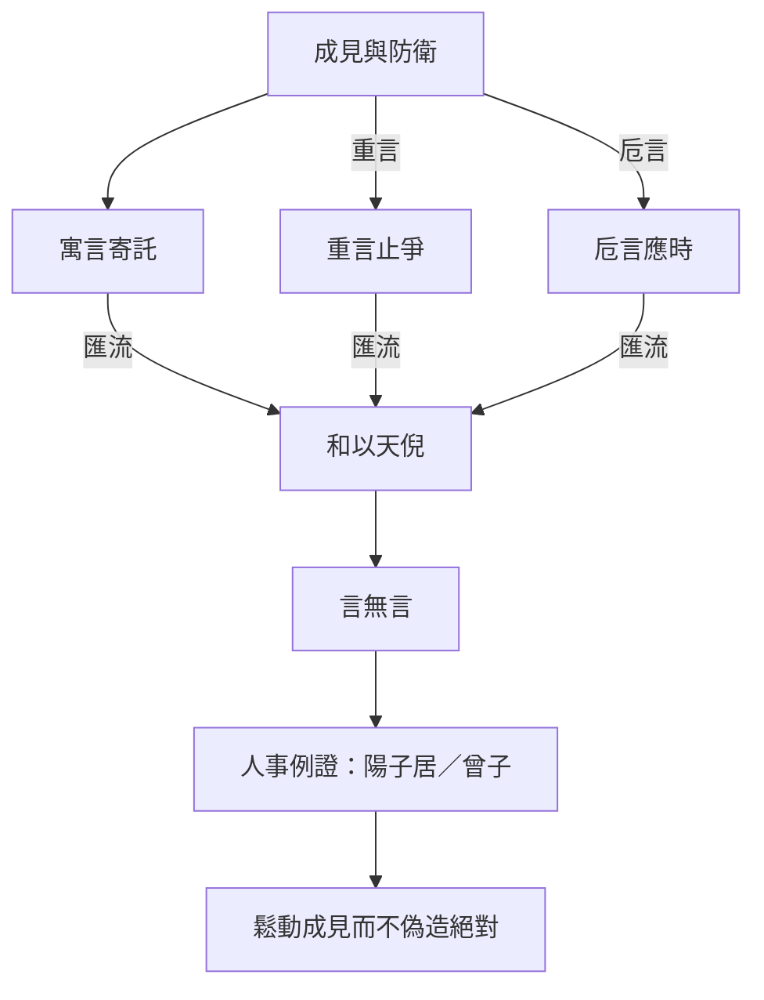

## 17. 延伸閱讀

### 原典與注疏

- 郭慶藩《莊子集釋》〈寓言〉
- 王先謙《莊子集解》〈寓言〉
- 成玄英《南華真經注疏》〈寓言〉
- 林希逸《莊子口義》〈寓言〉

### 今注今譯與研究

- 陳鼓應《莊子今註今譯》〈寓言〉
- 王邦雄相關現代解讀中關於莊子文體與寓言的討論
- 劉笑敢等關於《莊子》文體、內外雜篇與敘事策略的研究

### 本專案內交叉引用

- 相關篇章：〈齊物論〉、〈人間世〉、〈秋水〉、〈外物〉、〈天下〉
- 相關人物：[莊周](content/figures/莊周.md)、[老聃](content/figures/老聃.md)、[惠施](content/figures/惠施.md)、陽子居、曾子
- 相關名詞：[寓言](content/terms/寓言.md)、[重言](content/terms/重言.md)、[卮言](content/terms/卮言.md)、天倪、得意忘言（參〈外物〉）
- 相關主題：[語言與真實](content/themes/語言與真實.md)、[名與利](content/themes/名與利.md)


<div class="pagebreak"></div>

<!-- part: 雜篇 id: 28 -->

# 讓王

> **閱讀提示**：本篇依通行本段落次序導讀。下文區分**原典**、**歷代注家**與**本書現代詮釋**。本篇文本性質爭議大，尤不可把每個故事角色的話直接標成「莊子主張」。

## 01. 篇名與背景

〈讓王〉以「讓」與「王」對舉：王位、天下、爵祿被一讓再讓，拒受者反覆申明——生命比權位更先、更重。篇名本身已標出主題：**把統治慾望從價值金字塔的頂端移開**。

本篇在雜篇中屬於「故事聯章」型：堯讓許由、子州支父、善卷，大王亶父去邠，以及原憲、曾子、顏闔、列子辭粟等，幾乎一則接一則。文學上像隱逸倫理的主題變奏；思想上則反覆敲打「尊生」。讀者若只尋找一句精鍊哲學命題，會失望；若把它讀成戰國至漢初道家傳統如何用敘事教導「不以天下易生」，則脈絡清楚。

> **原典位置**：雜篇・第28篇・〈讓王〉。

## 02. 成書背景

近現代莊學研究多指出：〈讓王〉、〈盜跖〉、〈說劍〉、〈漁父〉四篇，文體、詞彙與內篇差異較顯，或為較晚編入的道家（乃至雜纂）材料。**本書採謹慎立場：不把本篇逕稱為莊周本人政論，而視為莊學傳統後續的「貴生／讓國」敘事彙編。** 其價值在思想史與倫理想像，不在為莊周「認證」每一句話。

材料所反映的焦慮很具體：在征伐與封賞頻繁的時代，士人如何拒絕「以身殉天下／殉名」的召喚？讓國故事提供一種極端示範——連天下都可以不要，何況爵祿。這種極端性正是文類特徵，讀時宜當寓言化倫理實驗，而非制度藍圖。引文據郭慶藩《莊子集釋》通行系統；文字異同另參校勘。

## 03. 結構分析

開篇多組「讓天下而不受」，確立「治身優先於治國、治天下」的價值序；中段轉入大王亶父避狄、窮士安貧、孔子陳蔡之厄等，把「尊生」從王位場面拉到流亡、疾病、飢寒；末段常以辭聘、辭粟收束，顯示「不取」同樣需要勇氣。

### 結構圖

```text
堯／舜讓天下 → 許由、子州支父、善卷拒受
        ↓
口號化命題：道之真以治身……土苴以治天下
        ↓
大王亶父去邠（土地可棄，人民與生為重）
        ↓
原憲、曾子、顏闔等安貧／辭祿
        ↓
尊生：不以爵祿、天下易生
```

全篇是「主題反覆」而非層層推理：同一價值（生重於位）在不同身分（天子候選人、國君、貧士）上重奏。讀法應抓變奏差異，避免每一則都摘要成同一句「不要當官」。

## 04. 原典

> **版本依據**：郭慶藩《莊子集釋》所據通行本；以下擇錄關鍵句，非全篇逐字抄錄。

> 堯以天下讓許由，許由不受。……道之真以治身，其緒餘以為國家，其土苴以治天下。由此觀之，帝王之功，聖人之餘事也，非所以完身養生也。

> 大王亶父居邠，狄人攻之。……不以所用養害所養。……因杖筴而去之。民相連而從之，遂成國於岐山之下。

> 原憲居魯，環堵之室，茨以生草……子貢乘大馬……原憲華冠縰履，杖藜而應門。……「憲聞之，無財謂之貧，學而不能行謂之病。今憲貧也，非病也。」

> 曾子居衛，縕袍無表，顏色腫噲，手足胼胝。……三日不舉火，十年不製衣。……天子不得臣，諸侯不得友。

> 顏闔為魯君使齊，孔子曰：「子之仕也，為君乎？為民乎？……今子之仕，人危之，子危之，子將安歸？」

> 列子行食於道，見有餓者，仰而視之。……子列子之辭粟也，為見善而驚，為見善而驚，是內誠而外發者也。

上引三組不宜拆散：第一組給出價值排序（身／國／天下）；第二組把「所用養」與「所養」分開——土地是養人之具，不可反過來傷害被養的人；第三組以貧困形象對抗「病在不行」的自我欺騙，顯示尊生不是享樂，而是拒絕用身分羞辱填補生命。顏闔段則把「仕」的動機拆成「為君」還是「為民」，逼問出仕是否把自己與他人同時置入危局。列子辭粟段則反轉：不是「清高拒絕一切」，而是「見善而驚」——內心仍有真誠反應，才配談不取；假裝不動心反而是另一種病。

## 05. 白話翻譯

堯要把天下讓給許由，許由不接受。篇中因而申明：道真正切要的部分用來安頓自身；多餘的一點點才拿去治理國家；剩下的糟粕才去治理天下。照此看來，帝王功業只是聖人的餘事，並不是用來保全身體、養護生命的正道。

大王亶父住在邠地，狄人來侵。他不願為了養人的土地，去傷害被養的人民與生命，於是拄著杖離開；百姓相連跟隨，後來在岐山之下另成一國。重點不在「搬家成功」，而在他分得清：工具（土地、財用）不能壓過目的（人的生存）。

原憲住在簡陋的屋子裡，子貢車馬鮮麗來訪。原憲說：沒有錢叫做貧；學了卻做不到才叫做病。我是貧，不是病。曾子在衛，衣袍破舊、形容憔悴，卻仍呈現「天子不得臣，諸侯不得友」的不可徵用性。兩則都在改寫貧窮的意義：匱乏可以是條件，屈從才是病。

## 06. 字詞註解

| 字詞 | 釋義 | 本篇閱讀提示 |
|---|---|---|
| 讓王 | 辭讓王位／天下 | 篇名主題；「讓」是倫理姿態，未必是史料 |
| 尊生 | 以生命為尊 | 本篇主軸；不同於縱欲式貴生 |
| 緒餘 | 剩餘、餘緒 | 治國相對治身而言只是剩餘 |
| 土苴 | 糟粕、渣滓 | 治天下在價值序上更邊緣 |
| 完身養生 | 保全身體、養護生命 | 「帝王之功」被明確排除在此目的之外 |
| 所用養／所養 | 用來養生之具／被養者 | 大王亶父段的概念核心 |
| 貧／病 | 無財 vs 學而不能行 | 原憲用來翻轉羞辱性目光 |
| 天子不得臣 | 不可被天子納為臣屬 | 曾子形象的「不可徵用」 |
| 辭粟／辭聘 | 拒絕糧食資助或聘任 | 「不取」與「讓位」同屬拒斥外物主宰 |
| 岐山 | 亶父遷居之地 | 敘事結果；重點仍在抉擇理由 |

## 07. 段落解析


**走讀路線**：讓國故事群 → 守真拒位 → 名不如生。

### 第一層：為何連綴那麼多「讓天下」？

重複不是無話可說，而是文類需要：要把「天下可讓」說到令人震驚，才能動搖「得天下＝最高成就」的預設。許由、善卷等名字像一組符號，功能接近母題變奏，不宜逐一做人物年表考證。

### 第二層：為何插入大王亶父？

若只有隱士拒位，讀者易以為本篇教人逃離責任。亶父一段保留「為民」的關切：他不是拋下百姓，而是拒絕用戰爭與土地拜物教傷害所養之人。尊生在此與保民發生聯繫——這是本篇少數直接碰觸統治倫理的地方。

### 第三層：貧士故事如何收束主題？

王位場面結束後，鏡頭對準環堵之室與縕袍，避免讀者以為尊生只屬於「有資格讓天下」的人。原憲的「貧／病」之辨、曾子的不可臣友，把問題轉成：在日常權力關係裡，你是否仍能不被祿位定義？這才是多數讀者真正會碰到的「讓」。

### 第四層：顏闔、列子段落在說什麼？

顏闔故事把隱逸倫理從「不當王」推進到「不當危臣」：出仕若只為君、不為民，則君危己危，無所歸。列子辭粟則校正「拒絕」的動機——若內心仍被善惡驚動，那是誠；若刻意表演不動，則是另一種求名。兩段補足本篇：尊生不是一律逃離，而是看清**為誰、為何、以什麼代價**在取或捨。

### 與〈逍遙遊〉許由線的關係

[許由](content/figures/許由.md)洗耳、拒堯天下是內篇經典場景；〈讓王〉幾乎把這條線擴寫成專輯。對讀時可問：內篇的許由與雜篇的善卷、子州支父，語氣是否一致？內篇較含蓄，雜篇較極端——這正是文本層次差異的教學案例。

## 08. 歷代注家怎麼看

**郭象**多以「各安其分」讀讓國：能讓者有能讓之性，居位者亦可適性而治，不必人人逃堯舜。此解緩和了文本的絕決，使〈讓王〉不致讀成全面反政治；但也可能把「土苴以治天下」的尖銳排序抹平。

**成玄英**疏「道之真以治身」一路推向修養先於外王，強調殘生傷性之不可。其唐代語境常把「養生」講得更工夫化；讀者應分辨：原文的「尊生」首先是價值排序與敘事倫理，不一定等於後來道教內養術。

**林希逸**提醒本篇「多是設辭」，人物有無不必死摳，要看「輕天下而重性命」之意。此見與現代文本批判可合流：把〈讓王〉當思想史材料，而不是莊周年譜附件。

## 09. 哲學分析

> 以下為**本書現代詮釋**。

〈讓王〉的哲學貢獻，不在提出比內篇更細緻的形上學，而在把「無用之用」「保身」等線索，改寫成一套**極端的價值序示範**：身＞國＞天下。它用敘事強迫讀者看見——許多被歌頌的「大事業」，預設了人以自身為燃料。

必須同時標出限度：作為後出色彩濃的材料，它有時把隱逸道德寫得過滿，接近「拒位即善」的簡化。與〈人間世〉相比，後者更痛苦地承認人必須在權縫中說話；〈讓王〉則常以拒絕為完整答案。故現代詮釋宜取「尊生」之醒覺，而慎取其「一律讓掉」的敘事解決。

「所用養害所養」是本篇最可普遍化的命題：手段顛倒為目的時，生命就被工具化。這比「大家都去當隱士」更經得起跨時代討論。與[名與利](content/themes/名與利.md)主題條目連讀：全書從〈逍遙遊〉的無功無名、〈人間世〉的「名」之危險，到本篇的「土苴以治天下」，可見「輕位」不是一次性的姿態，而是反覆被不同文體重奏的問題。

## 10. 與老子比較

《老子》言「名與身孰親？身與貨孰多？」「貴以身為天下，若可寄天下」。與〈讓王〉的尊生、輕位高度同調，甚至可說本篇是把老子式貴身命題故事化、戲劇化。

差異在文體與政治想像：老子仍常以「聖人治」的口吻說話；〈讓王〉大量寫「根本不接受治權」。若說老子是節制統治慾，本篇常是拒斥統治位——後者更絕，也更像隱逸文學的擴大。

## 11. 與儒家比較

儒家亦有「堯舜禪讓」敘事，但重點多在傳賢與公天下；〈讓王〉的重點卻在「不受」。原憲、曾子在儒家傳統本是德行典範，本篇借其貧而有守的形象，轉向「不可臣」的貴生論，等於改寫儒家人物的意義重心。

爭點不在「該不該有責任」，而在「責任是否可以合法地要求人犧牲生命與尊嚴」。儒家傾向在秩序中完成人格；本篇擔心秩序以「天下」之名吞噬人身。兩者可互為警戒，不宜單向取消。

## 12. 與佛學比較

**本篇暫略。** 雖後人或以「放下」「少欲」比附讓國安貧，但佛教出離與菩薩道的義理結構，與戰國道家尊生、讓王敘事並非一事；強比易把「完身養生」誤讀成解脫論。

## 13. 現代人生應用

> 以下為**現代詮釋**，回扣「尊生」「緒餘／土苴」「所用養／所養」，避免套用通用職場模板。

### 13.1 當「更大的職稱／舞台」伸手來邀時

先排價值序，再談榮譽：這份位置要佔用的睡眠、親密關係、健康與判斷力，是否已超過它能成就的「緒餘」意義？〈讓王〉不是叫你必然拒絕，而是叫你承認——**若連「可以拒絕」的想像都沒有，你已被王位敘事綁架。**

### 13.2 組織用「大局／使命」要求過度犧牲時

借用亶父句式檢查：我們正在用什麼「所用養」（業績、品牌、市場）傷害「所養」（員工、學生、家人、自己的身體）？若工具反噬目的，所謂忠誠已接近殘生。

### 13.3 經濟條件不佳、又被成功學羞辱時

回扣原憲「貧／病」之辨：物質匱乏需要務實改善；但把「還沒賺到」等同「人格病態」，是另一種傷生。可分開兩件事——理財行動與自我羞辱，不讓後者冒充前者。

### 13.4 面對「不接受資助／不掛名」的抉擇時

曾子式的「不得臣、不得友」在現代可轉讀為：有些資源附帶被徵用、被代表、被站隊。拒絕不一定清高，也可能是在保護自己還能誠實說話的位置。關鍵是看清交換條件，而不是表演清貧。

## 14. 常見誤解

1. **「篇中每個故事都是莊周親筆，代表莊子政治主張。」**  
   文本層次有爭議；宜作後出道家材料謹慎閱讀。

2. **「尊生＝苟活、恐懼責任。」**  
   本篇尊生常與不辱、不殘、不顛倒手段目的相連，不是膽小的別名。

3. **「讓王就是反政府、反一切公共事務。」**  
   亶父段仍關切人民；批判的是以天下之名害生，不是取消共同生活。

4. **「安貧被歌頌，所以不該改善生活。」**  
   原憲之貧是對照「病在不行」；重點在不被祿位定義，而非崇拜貧窮。

5. **「能讓位的人才有道德。」**  
   敘事極端化是文類需要；日常倫理更常落在如何拒絕傷生的交換，而非人人有王位可讓。

## 15. 本篇總結

〈讓王〉以一連串讓國、去邠、安貧、辭祿的故事，反覆演練「道之真以治身，其緒餘以為國家，其土苴以治天下」的價值序，並以「不以所用養害所養」點出手段與目的的顛倒危機。作為可能偏晚的道家彙編，它不宜被誇大為莊周本人的制度方案，卻仍尖銳地質問：你的「大事業」是否正在消耗你的生？

若以一句話收束：**先能護住可活、可尊的生命，其餘功業才談得上是餘事，而不是獻祭。**

## 16. 心智圖


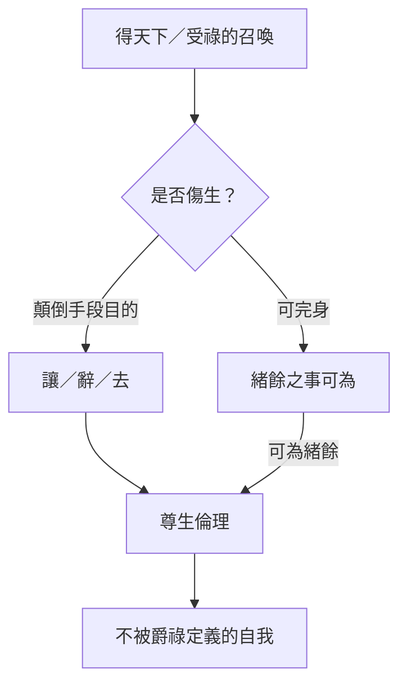

## 17. 延伸閱讀

### 原典與注疏

- 郭慶藩《莊子集釋》〈讓王〉
- 王先謙《莊子集解》〈讓王〉
- 成玄英《南華真經注疏》〈讓王〉
- 林希逸《莊子口義》〈讓王〉

### 今注今譯與研究

- 陳鼓應《莊子今註今譯》〈讓王〉（及其對雜篇真偽的說明）
- 關於〈讓王〉〈盜跖〉〈說劍〉〈漁父〉成篇年代的討論（劉笑敢等）
- 王邦雄等現代解讀中涉及貴生、隱逸的章節

### 本專案內交叉引用

- 相關篇章：〈逍遙遊〉、〈人間世〉、〈養生主〉、〈盜跖〉、〈漁父〉
- 相關人物：[許由](content/figures/許由.md)、[堯](content/figures/堯.md)、[列禦寇](content/figures/列禦寇.md)、原憲、曾子、顏闔
- 相關名詞：尊生、[性命之情](content/terms/性命之情.md)、[無用之用](content/terms/無用之用.md)、[無為](content/terms/無為.md)
- 相關主題：[名與利](content/themes/名與利.md)、[政治與無為](content/themes/政治與無為.md)


<div class="pagebreak"></div>

<!-- part: 雜篇 id: 29 -->

# 盜跖

> **閱讀提示**：本篇是高度戲劇化、言語誇張的辯難體。下文區分**原典**、**歷代注家**與**本書現代詮釋**。盜跖的話是文學上的「反面極言」，**不可直接當成作者頒布的人生守則**。

## 01. 篇名與背景

〈盜跖〉以盜賊之名為篇題，一開始就把讀者拋進道德顛倒的場景：最被禮教貶斥的人物，反而坐在主審席上；最被尊崇的孔子形象，變成被怒斥、被譏笑、狼狽而退的說客。篇名本身已是挑釁——它逼問「名」到底由誰定義。

本篇在雜篇中以「對決結構」著稱：幾乎全程是對話與斥罵，少有內篇式的層層遞進。其力量來自修辭的極端：歷數聖王不得好死、譏刺伯夷叔齊、嘲弄孔子「無病自灸」。讀它，先要承認這是**諷刺劇／抗辯詞**，不是平實史傳，也不是溫和的修養手冊。

> **原典位置**：雜篇・第29篇・〈盜跖〉。

## 02. 成書背景

學界多將〈盜跖〉與〈讓王〉〈說劍〉〈漁父〉並列，視為風格偏晚、論辯色彩濃的作品：詞彙急切、情節誇張、對儒家名教的攻擊遠比內篇外露。它可能反映戰國末至漢初某些道家（或反名教）論者的心情——對「仁義」被權力徵用極度不信任。

因此閱讀策略應是雙層的：一層聽盜跖如何拆穿「以名飾暴」；另一層保持文類警戒——**角色勝利≠命題真理**。把盜跖每一句都實踐為生活方式，會從批判偽善滑向為殘暴開脫。引文據郭慶藩《莊子集釋》通行系統。

## 03. 結構分析

篇首交代孔子與柳下季為友，欲往說盜跖；柳下季勸阻，孔子仍去。中段是盜跖大怒設席、痛斥「巧偽人」，歷數黃帝至周文王之戰伐與名士之慘死，並抨擊矯情的廉潔與聲譽。末段孔子色變、無言而退，柳下季以「無病而自灸」「料虎頭、編虎鬚」收束。

### 結構圖

```text
孔子欲化盜跖（名教自信）
        ↓
柳下季勸阻（知不可）
        ↓
盜跖怒斥：仁義／聖王／名士皆虛
        ↓
誇飾枚舉：戰伐、刑戮、餓死、毀名
        ↓
孔子狼狽退場
        ↓
「無病自灸」：干預錯位的諷刺
```

結構像一場單向壓倒的審判。作者幾乎不給孔子對等的理論反擊，這正是文類選擇：要讓「名教說教」在暴力與慾望的現實前失語。讀者的工作不是選邊站成盜賊，而是看見失語暴露了什麼問題。

## 04. 原典

> **版本依據**：郭慶藩《莊子集釋》所據通行本；以下擇錄關鍵句，非全篇逐字抄錄。

> 孔子與柳下季為友，柳下季之弟名曰盜跖。盜跖從卒九千人，橫行天下，侵暴諸侯。……孔子謂柳下季曰：「……丘請往說之。」

> 盜跖大怒，兩展其足，案劍瞋目聲如乳虎，曰：「丘來前！……爾作言造語，妄稱文、武……妄作孝弟而僥倖於封侯富貴者也。子之罪大極重，疾走歸！不然，我將以子肝益晝餔之膳！」

> 世之所高，莫若黃帝……湯放其主，武王殺紂。自是之後，以強凌弱，以眾暴寡。湯、武以來，皆亂人之徒也。

> 丘所謂無病而自灸也，疾走料虎頭，編虎鬚，幾不免虎口哉！

> 盜跖乃方休倚大杖，枕股而寢，弟子請起。盜跖仰目而視曰：「夫避己之所不肖，而強以名聲蓋之，此士之所苦也。」

> 孔子再拜趨走，出門上車，執轡三失，目芒然無見，色若死灰，據軾瞑目，不復得食。

上引顯示三種修辭暴力：人身威脅、歷史翻案、成語式譏刺。其尖銳處不在歷史考證是否精準，而在追問——若「世之所高」的聖王敘事充滿征伐，仁義之言是否可能成為粉飾？末句「無病自灸」則把箭頭轉回說教者：你不是在救人，而是在把自己送進虎口並製造新的表演。中引「避己之所不肖，而強以名聲蓋之」則點出**名聲補償**：人常借道德名號遮掩內在的不肖——這與〈人間世〉「德蕩乎名」、[孔子](content/figures/孔子.md)在多篇中被寫成「為名所役」的形象可連讀。末引孔子退場的身體描寫（執轡三失、色若死灰）不是滑稽小品，而是讓讀者看見：當話語失效，身體會先崩潰——名教自信在此刻變成可見的創傷。

## 05. 白話翻譯

孔子與柳下季是朋友；柳下季的弟弟叫盜跖，帶著大批人馬橫行侵暴。孔子仍要去勸說他。盜跖大怒，瞪眼按劍，罵孔子編造文武之言、假借孝悌求取富貴，喝令快走，否則要把他的肝當下酒菜。

接著盜跖翻轉「世人所推崇」的名單：從黃帝以下，征伐不斷；湯放逐其主，武王殺紂——既然如此，後世以強凌弱、以眾暴寡，不過是一脈相承。他並攻擊那些為名而死、為廉而枯的人：聲譽常常是另一種貪欲。

孔子嚇得臉色大變，退回去。柳下季說：這真是沒病卻給自己艾灸——跑去摸老虎頭、編老虎鬍鬚，差點送進虎口。白話意思是：你把干預當成美德，卻誤判對象與情勢，幾乎害死自己，也沒改變對方。

## 06. 字詞註解

| 字詞 | 釋義 | 本篇閱讀提示 |
|---|---|---|
| 盜跖 | 傳說中的大盜；篇中角色 | 文學符號，勿當信史人物傳 |
| 柳下季 | 柳下惠；篇中為勸阻者 | 代表「知其不可」的清醒 |
| 巧偽人 | 巧言矯飾之人 | 盜跖對孔子式說教的定性 |
| 妄稱文、武 | 假借文王、武王名義 | 攻擊「以古聖話語授權自己」 |
| 世之所高 | 世人最推崇者 | 翻案修辭的起點 |
| 以強凌弱 | 強者欺凌弱者 | 把聖王敘事連到暴力結構 |
| 無病而自灸 | 沒病卻灼艾自虐 | 譏不當干預、自我表演式道德 |
| 料虎頭、編虎鬚 | 撩弄猛虎 | 形容不自量力的勸說 |
| 橫行天下 | 肆意往來侵暴 | 開篇即確立暴力現實 |
| 名 | 名聲、令譽 | 本篇核心靶子：名如何遮掩與傷生 |

## 07. 段落解析


**走讀路線**：往說暴者 → 極言反詰 → 名實錯位。讀時記：**抗辯文體，非教條**。

### 第一層：為何讓孔子先「請往說之」？

開場必須建立名教的自信：以為言語可以化暴。沒有這份自信，後面的崩盤就沒有戲劇性。柳下季的勸阻則預告失敗——作者並不假裝這是勢均力敵的辯論賽。

### 第二層：盜跖的歷史枚舉在做什麼？

它用「極端取樣」攻擊神聖譜系：只要聖王敘事裡找得到征伐與弒放，仁義的純潔性就受質疑。這是修辭策略，不是嚴謹史學。段落功能是逼「名」與「實」對質：你們歌頌的秩序，是否建基在你不願直視的暴力上？

### 第三層：為何以「無病自灸」收束？

若停在盜跖勝訴，文本易被讀成「為盜張目」。末段把焦點轉到勸說者的自傷與錯位干預：問題不只是盜跖殘暴，也包括名教使者把「說教」本身當成功績。雙向諷刺，才是本篇較完整的落點。

### 第四層：孔子身體的退場

篇末不寫孔子「辯贏」或「悟道」，而寫他失態、失食、失見——這是戲劇性的**身體否定**。與〈漁父〉中孔子被漁父訓誡、〈說劍〉中趙文王吃不下飯，形成雜篇後段的「聖人形象鬆動」系列。讀者宜把[孔子](content/figures/孔子.md)當寓言裝置，看見話語與權力關係的裂縫，而非做傳記考據。

### 與〈胠篋〉、〈讓王〉的對讀

〈胠篋〉言「聖人不死，大盜不止」；〈盜跖〉則讓大盜親口罵聖王。〈讓王〉尊生而輕位；〈盜跖〉則懷疑「位」與「名」背後的暴力。三篇可串成雜篇對政治—道德敘事的批判線，但語氣與文類各異，不宜混為一談。

## 08. 歷代注家怎麼看

**郭象**面對此篇往往強調「各極一偏」：盜跖之言有激射名教虛偽之功，卻不可執為正道。這種讀法試圖挽救文本，使它不致淪為教人為惡的手冊——與現代「文類警戒」相近。

**成玄英**疏解時仍常以「寄言」說明：借盜跖之口，破貪名矯行。他承認語句猛厲，但把宗旨拉回「去偽」。讀者須注意：疏家的「破偽」是詮釋收編，未必等於原敘事的全部能量；原敘事確實更暴烈、更不留餘地。

**林希逸**一再提醒「此皆寓言」，人物對話不必核對春秋史實。對本篇尤其重要：若把盜跖當史料，會在歷史考證裡迷失；若當抗辯文體，才能看見它對「聲譽經濟」的攻擊。

## 09. 哲學分析

> 以下為**本書現代詮釋**。

〈盜跖〉最有哲學效力的一擊是：**名譽與仁義可以成為慾望的高級偽裝。** 當人追逐「被稱為善」，善就可能轉成可交易、可炫耀、可動員群眾的符號；而符號一旦脫離對生命與弱者的實際後果，便接近盜跖所罵的「巧偽」。

但本篇同時示範「反駁的限度」。以暴制名、以極言推翻一切規範，可以摧毀虛偽，也可以摧毀共同生活所需的起碼約束。故詮釋上應採「解毒劑」模型：劑量用於中和名教毒物，過量則自身成毒。這與〈齊物論〉反省是非、〈人間世〉反省「德蕩乎名」可對讀，惟本篇用的是怒吼而非分析。

「無病自灸」則提出干預倫理：動機良善不足以證明行動恰當；錯估對象、把勸說當自我完成，會製造新的傷害。與[名與利](content/themes/名與利.md)、[語言與真實](content/themes/語言與真實.md)主題可橫向連讀：全書對「名」的警惕，從內篇〈人間世〉到雜篇〈盜跖〉、〈漁父〉，強度遞增但問題域一脈相承。

## 10. 與老子比較

《老子》批評「大道廢，有仁義」「失德而後仁」，對仁義後起、作為衰世標籤的看法，與盜跖抨擊巧偽有家族相似性。但老子的語氣是凝鍊諷喻，常歸向無為、少私；〈盜跖〉則讓暴力主角以恐嚇與翻案發言，倫理餘地更窄。

不宜說「盜跖＝老子」。老子仍構想聖人治身治國的可能；本篇幾乎讓名教場景崩盤，只留下譏刺的煙塵。同處在疑仁義之工具化，異處在建設性方案的有無。

## 11. 與儒家比較

本篇是《莊子》中對儒家形象最不客氣的文本之一：孔子被寫成既冒險又无效的說客，聖王譜系被寫成亂源。它擊中的真實問題是——儒者若只販賣話術與聲望，而不處理權力與民生的殘酷，確實會變成「巧偽」。

儒家可以反問：沒有仁義名教，橫行侵暴如何被指認為惡？這正是本篇留下的張力。比較的收穫不是宣布誰贏，而是承認：**批判偽善，與放棄一切規範，中間還有漫長的路**；〈盜跖〉只走了前半段的爆破。

## 12. 與佛學比較

**本篇暫略。** 雖有人以「破執」「呵佛罵祖」比附盜跖罵聖，但本篇的怒氣綁於戰國名教—暴力政治語境，與佛教論師或禪門機鋒的制度背景不同；硬比附易美化罵街為開悟。

## 13. 現代人生應用

> 以下為**現代詮釋**，回扣「巧偽」「名」「無病自灸」，不套用通用績效／爭論模板。

### 13.1 看見「道德品牌」正在變現時

當個人或機構把慈善、理念、文化口號做成流量與權勢的通行證，可借用本篇的懷疑：這套語言實際保護了誰、傷害了誰？懷疑不是犬儒，而是要求名與後果對帳。

### 13.2 想去「感化」明顯不吃這套的對象時

先做柳下季式評估：對方的慾望結構與力量關係，是否允許說教進入？若場面更像虎須，你的前往可能主要滿足「我有行動」的自我形象——這正是「無病自灸」。改找可行的制度途徑，往往比獨行勸說更負責。

### 13.3 閱讀極端控訴文、網路公審稿時

練習文類辨識：誇飾枚舉擅長打倒光環，不擅長建立替代方案。可吸收其對偽善的敏感，同時問：文章有沒有把一切規範等同謊言？若有，你正在吞下一整瓶解毒劑。

### 13.4 自己靠「清譽」過活時（教師、NGO、公眾發言者）

定期檢查：我是否更在意被稱為正直，而非減少實際傷害？〈盜跖〉對「僥倖於封侯富貴」的嘲諷，可轉讀為對「道德資本」的自覺——清譽若成新的貪欲，批判別人虛偽之前先審查自己。

## 14. 常見誤解

1. **「盜跖說得痛快，所以作者支持偷搶殺掠。」**  
   文類是抗辯與諷刺；角色極言≠行為指南。

2. **「本篇證明儒家全假、仁義無用。」**  
   它攻擊的是被權力與名聲工具化的仁義表演，不能直接等同取消一切倫理。

3. **「孔子在篇中很蠢，所以歷史孔子如此。」**  
   人物是戲劇符號，用來測試名教話術的邊界。

4. **「既然名都虛偽，不如什麼都不信。」**  
   全面不信只是另一種偷懶；本篇較有價值的是追問名實錯位。

5. **「無病自灸＝不要幫助任何人。」**  
   它反對的是錯位、表演式、不自量力的干預，不是反對一切救助。

## 15. 本篇總結

〈盜跖〉以誇飾辯難讓「盜」審「聖」，把仁義、聖王與名士的聲譽經濟逼到牆角，並以「無病而自灸」「料虎頭、編虎鬚」回刺說教者的自傷式道德。作為雜篇戲劇體，它必須帶著文類說明書閱讀：其貢獻是爆破偽善，其風險是把爆破誤當成新的信仰。

若以一句話收束：**先別急著崇拜罵得最兇的人；先看被罵的「名」是否真的在遮掩傷害——以及罵本身是否又在製造新的傷害。**

## 16. 心智圖


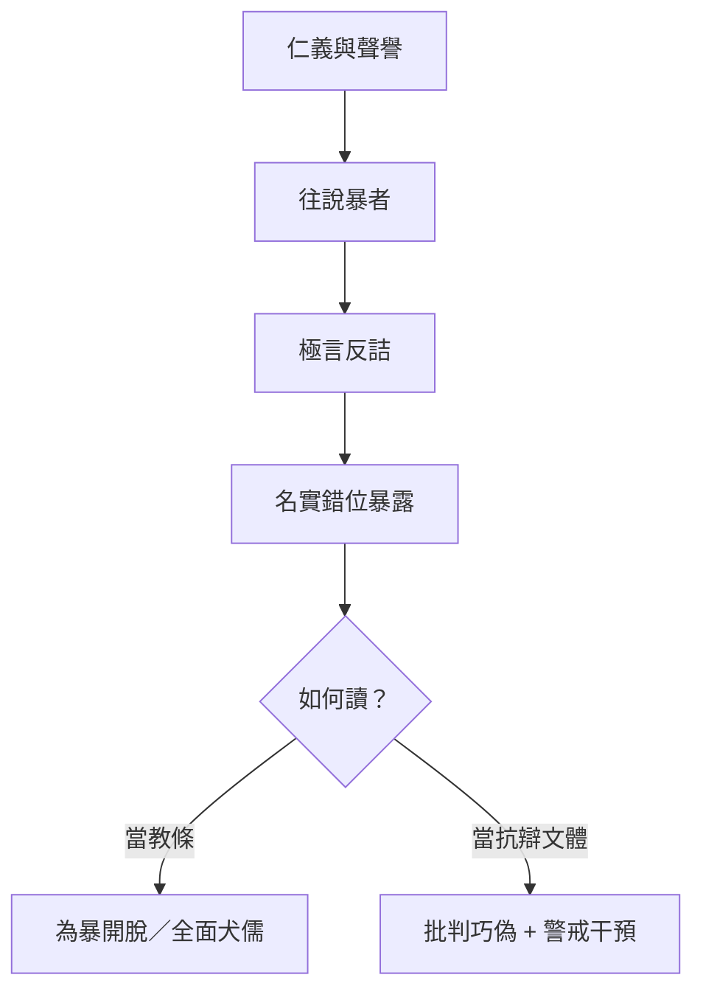

## 17. 延伸閱讀

### 原典與注疏

- 郭慶藩《莊子集釋》〈盜跖〉
- 王先謙《莊子集解》〈盜跖〉
- 成玄英《南華真經注疏》〈盜跖〉
- 林希逸《莊子口義》〈盜跖〉

### 今注今譯與研究

- 陳鼓應《莊子今註今譯》〈盜跖〉及雜篇討論
- 關於〈盜跖〉文體、成篇年代與「反儒」強度的研究
- 比較閱讀：〈人間世〉「德蕩乎名」、〈外物〉言意問題

### 本專案內交叉引用

- 相關篇章：〈人間世〉、〈胠篋〉、〈讓王〉、〈漁父〉、〈列御寇〉
- 相關人物：[孔子](content/figures/孔子.md)、[盜跖](content/figures/盜跖.md)、柳下季
- 相關名詞：名、仁義、巧偽、[無為](content/terms/無為.md)
- 相關主題：[名與利](content/themes/名與利.md)、[語言與真實](content/themes/語言與真實.md)、[政治與無為](content/themes/政治與無為.md)


<div class="pagebreak"></div>

<!-- part: 雜篇 id: 30 -->

# 說劍

> **閱讀提示**：本篇依通行本敘事導讀。下文區分**原典**、**歷代注家**與**本書現代詮釋**。篇中「莊子說劍」是文學場景，讀者應同時注意其游說修辭，不宜當成莊周行跡的實錄。

## 01. 篇名與背景

〈說劍〉的「說」是遊說、陳說；「劍」是趙文王沉迷的對象。篇名合起來，就是一場**圍繞嗜好展開的政治轉譯**：不正面禁止君主玩劍，而把「劍」重新定義成三種層級的治理隱喻。

在雜篇裡，本篇文體接近縱橫家辭令：鋪陳華麗、層次分明、以對方慾望為接口。它與內篇哲學散文距離明顯，卻也因此特別適合觀察——莊學傳統進入宮廷勸說場合時，會長成什麼樣子。核心戲劇動作只有一個：讓好劍之君，聽見「天子之劍」比「庶人之劍」更大。

> **原典位置**：雜篇・第30篇・〈說劍〉。

## 02. 成書背景

〈說劍〉常與〈讓王〉〈盜跖〉〈漁父〉同被視為偏晚或風格異質的篇章：情節完整如短篇小說，論點靠排比譬喻推進，較少內篇那種概念翻轉的密度。它可能出自嫻熟宮廷語言的道家後學之手，把「無用之用／無為」改裝成君主聽得懂的「劍論」。

戰國趙地武風與劍客文化，為故事提供現實底色：君主若以私鬥之勇為樂，國力與政治注意力會被吸進血腥娛樂。本篇的諷刺對象，正是這種**把殺戮當嗜好、把嗜好當政治**的錯位。引文據郭慶藩《莊子集釋》通行系統；人名、稱謂異文（趙文王／趙惠文王等）以通行讀法說明大意即可。

## 03. 結構分析

開端寫趙文王喜劍，劍士日夜相擊，死傷相繼；太子患之，以厚幣請莊子。莊子入見，不立刻罵「嗜殺」，而宣稱己亦有三劍。隨後依序陳說天子之劍、諸侯之劍、庶人之劍：前二者以天地、山河、諸侯、四時為喻，導向御天下／治一國；庶人之劍則是蓬頭突鬢、相擊於前的私鬥。文王聞罷，疏遠劍士，三月不出。

### 結構圖

```text
好劍之君 ← 劍士相擊、死傷相屬
        ↓
厚幣請「莊子」入說
        ↓
不直諫，而獻「三劍」框架
        ↓
天子之劍（山河四時／御天下）
諸侯之劍（銳士／一國之威）
庶人之劍（私鬥嗜殺）
        ↓
慾望被重新分級 → 止劍士
```

關鍵技法是「順勢抬升」：先承認對方愛劍，再把劍的意義升級，使原來的嗜好自動掉到最低層。這是勸說術，也是政治諷喻的結構。

## 04. 原典

> **版本依據**：郭慶藩《莊子集釋》所據通行本；以下擇錄關鍵句，非全篇逐字抄錄。

> 昔趙文王喜劍，劍士夾門而客三千餘人，日夜相擊於前，死傷者歲百餘人，好之不厭。

> 太子曰：「……夫子必肯，臣請奉千金。」莊子曰：「……臣有三劍，唯王所用，請先言而後試。」

> 天子之劍，以燕谿石城為鋒，齊岱為鍔……此劍一用，匡諸侯，天下服矣。……諸侯之劍……此劍一用，如雷霆之震也……庶人之劍，蓬頭突鬢垂冠……相擊於前，上斬頸領，下決肝肺……無異於鬥雞，一旦命已絕矣，無所用於國事。

> 王乃牽而上殿。宰人上食，王三環之。莊子曰：「大王安坐定氣，劍事已畢奏矣！」於是文王不出宮三月，劍士皆服斃其處也。

> 諸侯之劍：以知士為鋒，以道德為刃，以賢為脊，以忠為夾，以豪傑為環。此劍一用，如雷霆之震也，四方莫不賓，在內則治民，在外則伐敵，此諸侯之劍也。

上引須連看「喜之不厭」與「無所用於國事」：前者是慾望沉溺，後者是政治審判。三劍不是兵器分類學，而是把君主的注意力從「誰殺得過誰」拖到「你到底在用哪一種力量治理」。諸侯之劍段補上中間層：仍以「劍」為喻，但已把賢士、道德、忠義編入劍身——這是遊說術的「漸進抬升」，讓君主覺得自己若只玩庶人劍，就配不上諸侯乃至天子的自我形象。結局「不出宮三月」與「劍士服斃其處」則示範：改變嗜好型暴力的關鍵，往往是**撤走權力的注視與供養結構**，而不只是聽了一堂好課。

## 05. 白話翻譯

從前趙文王愛好劍術，門下聚集大批劍士，日夜在面前相擊，一年死傷上百人，他卻愛好不厭。太子憂心，用重金請莊子去勸。莊子說：我也有三把劍，請讓王挑選；不過請允許我先說明，再談試劍。

天子之劍，以廣大山川為鋒鍔，用起來足以匡正諸侯、使天下歸服。諸侯之劍，像雷霆震懾一方，用於一國之威。至於庶人之劍，不過蓬頭突鬢的人在眼前互砍，上斬頸項、下穿肝肺，跟鬥雞無異，轉眼喪命，對國事毫無用處。

文王聽完，神色改觀，環繞走了幾圈，吃不下飯。莊子說：請王安坐定氣，劍的事我已經奏完了。於是文王三個月不願出宮耽於劍事，劍士們也在原來的位置上頹廢失意。故事的重點是：慾望被更高層的意義「收編」之後，低層嗜好失去光澤。

## 06. 字詞註解

| 字詞 | 釋義 | 本篇閱讀提示 |
|---|---|---|
| 說劍 | 以言辭陳說「劍」之義 | 「說」是遊說，不只是談論兵器 |
| 劍士 | 以擊劍搏殺為業／為樂者 | 象徵被嗜好豢養的暴力群體 |
| 三劍 | 天子／諸侯／庶人三等劍喻 | 核心修辭裝置；非實劍目錄 |
| 天子之劍 | 以天下山川四時為喻之劍 | 把殺伐慾望轉成「御天下」的想像 |
| 諸侯之劍 | 一國威懾之劍 | 中間層：仍是力，但被納入邦國 |
| 庶人之劍 | 私鬥相擊之劍 | 被貶為鬥雞式娛樂 |
| 匡諸侯 | 匡正諸侯 | 天子之劍的政治效果宣稱 |
| 鬥雞 | 以雞相鬥為戲 | 庶人劍的貶義類比 |
| 先言而後試 | 先講清楚再比試 | 用語言取代血腥表演 |
| 定氣 | 安定氣息／情緒 | 勸說完成後對君主身心的收束 |

## 07. 段落解析


**走讀路線**：庶人劍 → 天子劍 → 好劍之君疏劍士。關鍵句：**轉譯嗜好**。

### 第一層：為何先寫死傷「好之不厭」？

開篇必須讓嗜好的代價可見，否則後面的層級升級沒有道德重量。死傷數字不是統計報告，而是諷刺：君王的娛樂帳單用人命支付。

### 第二層：為何不直諫「請停劍」？

在喜劍之君面前，直諫等於否定其快感來源，易觸怒而失敗。〈說劍〉選擇進入對方的慾望語言，再改寫詞彙表——這與〈人間世〉「因」的處世智慧同族，但本篇更華麗、更宮廷。

### 第三層：結局「劍士服斃」說明什麼？

勸說成功的標誌，不是哲理被理解，而是供養結構崩解：君主不再提供目光與場域，劍士便無以自處。政治諷喻在此收束——**嗜好型暴力依賴權力的注視**；注視一撤，表演結束。這與當代「注意力經濟」中爭議內容的興衰，有結構上的類比：沒有平台與觀眾，表演性衝突難以持續。

### 第四層：與〈人間世〉「因」的勸說倫理

〈人間世〉教人「因其所安」；〈說劍〉則示範極端順勢：先承認王愛劍，再改寫劍的等級。兩篇都拒絕硬碰，但〈說劍〉更華麗、風險更高——「天子之劍」可能美化更大的征服。讀者應學其**轉碼技術**，同時警覺其**政治代價**。與[政治與無為](content/themes/政治與無為.md)主題連讀：全書對治道的想像，從內篇〈應帝王〉的渾沌，到外篇〈在宥〉，再到本篇的「劍論」，語氣愈發入世，也愈需讀者自帶批判距離。

## 08. 歷代注家怎麼看

**郭象**注此篇，常把三劍收向「各安其分」：天子有天子之事，庶人劍不足以幹國。他的讀法強調「用當其分」，使文本成為治術寓言，而不只是反武故事。

**成玄英**疏「庶人之劍……無異於鬥雞」，明白點出譏刺；疏天子之劍則鋪陳「以道御世」之意。唐代疏義有時把「道」講得更抽象，讀者可回扣原文的具體物象（山河、四時、雷霆），避免把排比修辭全數玄學化。

**林希逸**視為「策士之詞」，提醒文采勝於理境，與內篇不同。此評有助定位：本篇的貢獻主要在政治諷喻與勸說結構，不在形上新義；但「把慾望重新分級」仍是可抽取的思想動作。

## 09. 哲學分析

> 以下為**本書現代詮釋**。

〈說劍〉的哲學動作可以概括為：**慾望轉碼**——不消滅慾望，而改寫慾望對象的意義階層，使原本的沉溺在新尺度下顯得渺小。庶人劍被貶，天子劍被抬，中間藏著危險與智慧：智慧是讓人跳出私鬥快感；危險是「天子之劍」仍可能美化更大的征服。

因此本篇不宜讀成單純反戰和平主義。它對私鬥式暴力很嚴厲，對「以天下為劍」的宏大力量卻近乎讚頌——這更像把君主從娛樂性殺戮，勸回「嚴肅的統治力」。與〈逍遙遊〉的無待相比，這裡明顯更入世、更權謀。現代詮釋應標明：可學其「改寫尺度」的方法，須警覺其「更大的劍」仍可能傷生。

「先言而後試」也有認識論意味：先讓概念出場，再決定是否進入實作；語言可以中止不必要的流血表演。與〈外物〉「得意忘言」對讀：一篇談放下言器，一篇談先用言器止住暴力——看似相反，其實都關心**言與行的先後與分際**。

## 10. 與老子比較

《老子》言「兵者不祥之器」「天下有道，卻走馬以糞；天下無道，戎馬生於郊」，對兵器與戰爭持節制態度。〈說劍〉同樣厭惡無意義的血腥娛樂，但論證策略不同：老子減損兵事，本篇則把「劍」升級成治天下的象徵資本。

同處：反對為嗜好而殺。異處：老子更徹底地貶低兵；本篇允許「天子之劍」的宏大想像作為勸說代價。讀時宜分開「反鬥雞式殺戮」與「是否贊成帝國式威懾」。

## 11. 與儒家比較

儒家論政常正面陳說仁義、禮樂、民本；〈說劍〉幾乎不走這條路，而走「以彼之矛，改彼之盾」的遊說。它與孟子見梁惠王談「何必曰利」的場景可對照：都是入君門、轉話題；但孟子直接改主題，本篇則假裝繼續談劍。

儒家可能批評：把治國比作劍，仍保留暴力隱喻。莊學此篇可能回應：對一個只聽得懂劍的耳朵，你只能先從劍說起。比較的價值在勸說倫理——順從對方語言到何種程度，才不算共謀？

## 12. 與佛學比較

**本篇暫略。** 以劍為喻的佛教經典（如般若「金剛」等）另有解脫論脈絡，與本篇宮廷遊說、三層政治譬喻不宜硬湊。

## 13. 現代人生應用

> 以下為**現代詮釋**，回扣「三劍」「好之不厭」「先言而後試」，不用通用績效模板。

### 13.1 主管沉迷「內部對決／零和競技」時

若團隊文化鼓勵互相砍殺式競爭，可嘗試〈說劍〉式分級：把榮耀從「贏過同事」抬到「共同完成對外人有用的事」。不是禁止競爭，而是讓庶人劍式互撕看起來像鬥雞。

### 13.2 自己有消耗性嗜好（包括資訊、爭辯、遊戲式憤怒）時

問：我的「劍士」是誰——哪些內容、社群、儀式每天在我面前相擊，讓我「好之不厭」？三劍框架可改寫為：這個嗜好對我真正要守護的生活層級，是天子級、諸侯級，還是庶人級的空轉？

### 13.3 必須勸說權力者、又不能直接頂撞時

學習「先言而後試」：先共同定義詞彙與層級，再談行動。直接說「你錯了」常失敗；先進入對方關心的符號，再改寫其高低，是本篇示範的險著——用時須自問有沒有把更大的暴力一起美化了。

### 13.4 文化產業或媒體靠「血腥／對立」取悅觀眾時

回扣劍士「夾門而客」：注意力經濟會豢養表演性衝突。撤走目光（不點讚、不演算法餵養）有時比道德說教更快讓「劍士服斃」。這是把結局段轉成公民媒體實踐。

### 與〈應帝王〉、〈在宥〉的治道對照

內篇〈應帝王〉以渾沌之死警告「好為人」；外篇〈在宥〉言「聞在宥天下，不聞治天下」。〈說劍〉則走另一條路：不直接談無為，而用君主聽得懂的「劍」重新分級。三篇可見莊學傳統對政治的不同語氣——從悲劇寓言、到制度批判、到宮廷遊說，讀者宜保持距離，擇其方法而不盲從其結論。

## 14. 常見誤解

1. **「篇中莊子真有其事，可當傳記。」**  
   敘事是文學遊說場景；人物行跡不可逕作史實。

2. **「本篇鼓吹天子用劍征服天下。」**  
   天子之劍是勸說用的升級譬喻；全文主要靶子是私鬥嗜殺。仍須警覺宏大暴力被美化的風險。

3. **「反對庶人劍＝反對所有武術或自衛。」**  
   譏刺的是作為國君娛樂、無用於國事的互砍文化。

4. **「會說話就能改變暴君。」**  
   故事是理想型成功案例；現實勸說受制度與個性限制，不可神話修辭。

5. **「風格像策士，所以沒有莊學意味。」**  
   文體異質不代表無可取：慾望轉碼與尺度重估，仍與莊學「換個角度看」的家族技巧相通。

## 15. 本篇總結

〈說劍〉寫趙文王好劍成癖，莊子以天子、諸侯、庶人三劍重新分級，把鬥雞式私搏貶下去，把治理尺度抬上來，終使君主疏遠劍士。作為偏宮廷辭令的雜篇作品，它示範如何順慾望而轉慾望，也留下「更大的劍」可能被歌頌的陰影。

若以一句話收束：**先別急著搶走別人手上的劍；先問他以為自己在耍的，究竟是哪一把——以及那一把到底配不配得上他真正的責任。**

## 16. 心智圖


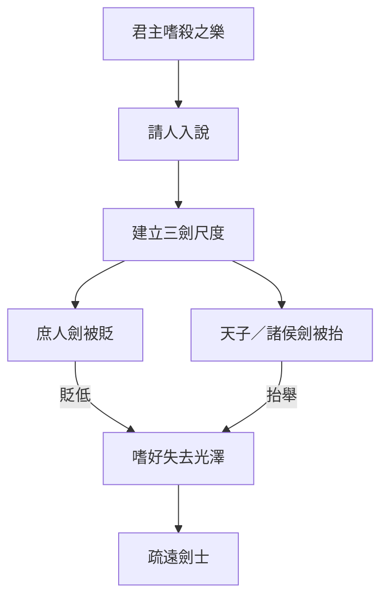

## 17. 延伸閱讀

### 原典與注疏

- 郭慶藩《莊子集釋》〈說劍〉
- 王先謙《莊子集解》〈說劍〉
- 成玄英《南華真經注疏》〈說劍〉
- 林希逸《莊子口義》〈說劍〉

### 今注今譯與研究

- 陳鼓應《莊子今註今譯》〈說劍〉及雜篇真偽說明
- 關於〈說劍〉與縱橫遊說文體、成篇年代的討論
- 對讀：〈人間世〉言說之難、〈徐無鬼〉中與武技／政治相關段落

### 本專案內交叉引用

- 相關篇章：〈人間世〉、〈讓王〉、〈盜跖〉、〈漁父〉、〈徐無鬼〉
- 相關人物：[莊周](content/figures/莊周.md)、趙文王、太子
- 相關名詞：[無為](content/terms/無為.md)、[無用之用](content/terms/無用之用.md)
- 相關主題：[政治與無為](content/themes/政治與無為.md)、[工作與技道](content/themes/工作與技道.md)


<div class="pagebreak"></div>

<!-- part: 雜篇 id: 31 -->

# 漁父

> **閱讀提示**：本篇依原文敘事順序展開。文中區分三層聲音——**原典**、**歷代注家**、**本書現代詮釋**。現代應用與哲學分析屬詮釋，不偽托為莊子原文原意。

## 01. 篇名與背景

〈漁父〉以「漁父」為篇名：不是寫漁業技術，而是以水濱隱者作為批判聲音。孔子師徒遊於緇帷之林，鼓琴誦書；一漁父上岸，先問弟子、再面見孔子，最後以「真」字收束全篇義理。

在雜篇諸作中，本篇與〈盜跖〉、〈說劍〉同屬「孔子受教／受辱」型戲劇。差別在於：〈盜跖〉以暴力與名教對撞，語氣極銳；〈漁父〉則較近「教誨體」——漁父不是要摧毀孔子，而是指出仁義禮樂若離開「精誠」，就只剩外飾。核心命題可濃縮為：**真者，精誠之至也**；禮的問題，不在有無儀式，而在儀式是否還能動人。

> **原典位置**：雜篇・第31篇・〈漁父〉。版本依據見郭慶藩《莊子集釋》。

## 02. 成書背景

學界多視〈漁父〉為雜篇中較晚的作品：文中孔子形象高度文學化，論辯明顯服務於道家「貴真」立場，與內篇〈人間世〉、〈德充符〉中對孔子較複雜的處理不同。這不表示本篇「沒有莊學價值」，而是提醒：它記錄的是後學如何用對話體，把「真／偽」「天／人」「誠／禮」的張力寫成一場可演出的相遇。

戰國至漢初，儒術與禮儀議論日盛；同時隱逸、養生與「法天」話語亦流行。〈漁父〉正坐落在此張力帶：一面承認孔子「仁則仁矣」，一面質問——若修身齊家治國平天下的路徑使人「苦心勞形以危其真」，則功業再大，亦可能是對生命本真的侵蝕。

引文以郭慶藩《莊子集釋》所收通行本為據；異文異讀另參校勘，不宜由單一標點推斷全部思想。

## 03. 結構分析

全篇可分為四個敘事單元，重心逐步由「問人」轉到「論真」：

1. **岸邊初遇**：漁父見弟子，問「彼何為者也」；子貢以孔子行藏答之。
2. **面見與批評**：孔子下船（或趨而就之），自陳憂世；漁父責其「飾禮樂、選人倫」而「苦心勞形」。
3. **論真與八疵四患**：提出「真者精誠之至」「法天貴真，不拘於俗」；並以事親、事君、飲酒、處喪等日常情境，說明「禮」須以「情」為核。
4. **孔子自省**：漁父刺船而去；孔子待水波定、不聞挐音而後敢升車，向弟子自嘆「遇丈人」如失。

### 結構圖

```text
緇帷之林：孔子鼓琴誦書
        ↓
漁父問弟子 → 知「孔氏」
        ↓
面責：仁義禮樂累身、危真
        ↓
正題：真＝精誠之至；法天貴真
        ↓
舉例：事親／事君／飲酒／處喪（禮不勝情）
        ↓
漁父去 → 孔子久立、自省
```

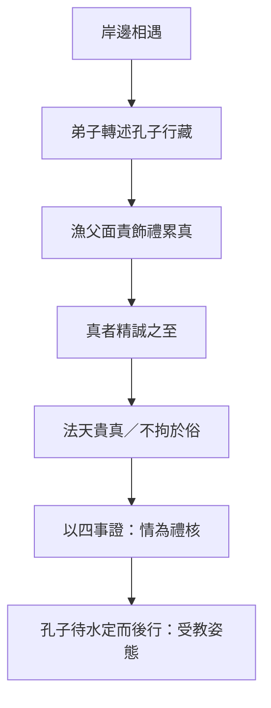

若用一句話總括結構：**先讓「禮的專家」出場，再讓「真」從水濱反過來考問禮。**

## 04. 原典

> **版本依據**：郭慶藩《莊子集釋》所據通行本；以下為必要引用，非全篇逐字抄錄。

### （一）漁父初問

> 孔子遊乎緇帷之林，休坐乎杏壇之上。弟子讀書，孔子絃歌鼓琴。奏曲未半，有漁父者，下船而來……

### （二）批評飾禮危真（節錄大意依據）

> 苦心勞形以危其真。……今子修身以明污，昭昭乎若揭日月而行也。

### （三）本篇樞紐：真與精誠

> 真者，精誠之至也。不精不誠，不能動人。故強哭者雖悲不哀，強怒者雖嚴不威，強親者雖笑不和。真悲無聲而哀，真怒未發而威，真親未笑而和。真在內者，神動於外，是所以貴真也。

### （四）法天貴真

> 禮者，世俗之所為也；真者，所以受於天也，自然不可易也。故聖人法天貴真，不拘於俗。

### （五）事親與處喪（禮以情為核）

> 事親以適，不論所以矣……處喪以哀，無問其禮矣。……功成之美，無一其跡矣。

## 05. 白話翻譯

### （一）岸邊

孔子在緇帷之林遊覽，在杏壇休息。弟子讀書，孔子彈琴唱歌。曲子還沒奏到一半，有位漁父下船走來，鬚眉皆白，被髮揄袂，沿著上岸，離陸地約數十步而止，向左而立，聽完曲。

### （二）批評的大意

漁父透過弟子得知對方是魯國孔氏，以仁義為業、飾禮樂、選人倫，上以忠君、下以化民。他並不否認孔子「仁」，卻指出：如此苦心勞形，其實可能危害「真」——把生命耗在可展示的德行與儀節上，反而遠離受於天的本然。

### （三）真者精誠之至

「真」是精誠到了極致。不精不誠，就不能打動人。強裝哭的人，看起來悲，其實不哀；強裝怒的人，看起來嚴，其實不威；強裝親的人，看起來笑，其實不和。真正的悲，不必靠聲音也哀；真正的怒，未發也自有威；真正的親，未笑也自有和。真在內，神采就會動於外——所以要貴真。

### （四）法天貴真

禮，多是世俗約定做出來的；真，卻是受於天、自然不可改易的。因此聖人效法天、看重真，不被流俗儀文綁死。事親以求安適為要，不必執著固定做法；處喪以哀為要，不必先問儀節是否完備；功業完成，也不必執著於單一痕跡與形式。

### （五）收束

漁父說完便刺船而去，延緣葦間。孔子待水面波紋平定、聽不見搖船聲，才敢登車。他對弟子說：遇到深於道的人，若不敬，便是遠於德——今日之遇，幾乎像失去了什麼。

## 06. 字詞註解

| 字詞 | 釋義 | 本篇閱讀提示 |
|------|------|--------------|
| 漁父 | 捕魚的隱者形象 | 敘事上的批判主體；非職業說明 |
| 緇帷之林 | 林木茂密如帷幕之處 | 開場場景；「帷」暗示遮蔽與靜聽 |
| 杏壇 | 孔子休坐授徒處 | 後世成為「講學」符號；此處為文學場景 |
| 真 | 精誠、未受矯飾的內在狀態 | 本篇最高價值詞；≠任性表露 |
| 精誠 | 精神專一而誠懇 | 「真」的定義項：真＝精誠之至 |
| 動人 | 感發他人 | 真偽的判準之一：能否自然動人 |
| 強哭／強怒／強親 | 勉強做出的表情 | 反襯「真在內，神動於外」 |
| 法天 | 效法天之自然 | 與「拘於俗」相對 |
| 貴真 | 以真為貴 | 本篇綱領：法天貴真 |
| 俗 | 流俗儀文與眾人習尚 | 禮之所從出；可有用，亦可成偽 |
| 禮 | 儀節、規範、人倫程序 | 本篇不廢禮，而問禮是否離情 |
| 情 | 真實之情（哀、適、和等） | 禮的核；「處喪以哀」即其例 |
| 八疵 | 漁父所列為人之病 | 與「四患」同屬修身檢核清單 |
| 四患 | 漁父所列處世之患 | 讀時宜回扣「危其真」的主題 |
| 受於天 | 得自天然、非人為捏造 | 真的來源；對照「世俗之所為」 |
| 不拘於俗 | 不被流俗綁死 | 非廢俗，而是不以俗代真 |

## 07. 段落解析


**走讀路線**：遇漁父於水濱 → 貴真 → 八疵四患。

### 第一層：為何從「聽琴」開始？

開場不是辯論會，而是漁父先聽完一曲。這安排很重要：**批判者先進入對方的世界**，不是一上來就罵。孔子師徒以絃歌呈現「有教」的文明形象；漁父的出現，則把場景從「杏壇講學」拉到「水濱異音」。後文「待水波定」的細節，也與開場的樂聲形成首尾呼應——聲音停了，反省才開始。

### 第二層：為何讓孔子「仁則仁矣」仍被責？

漁父並未否認孔子之仁，這比全盤否定更尖銳。問題不在「你不仁」，而在「你以仁義禮樂把自己與世人一起拖進勞形危真」。換言之，本篇攻擊的是**美德的外在化**：當德行變成可展示、可比較、可政治動員的工程，精誠就可能被「昭昭乎若揭日月」的表演取代。

與上下文：此段為「真」字登場鋪路——若沒有先承認孔子已站在道德高地，後面「貴真」就容易被讀成反道德；有了這層轉折，讀者才明白：真不是反仁，而是問仁是否還活著。

### 第三層：為何用「強哭／強怒／強親」說真？

這三組對比把抽象的「真」落到身體與表情。莊子（或後學）在此做的是現象學式提示：人能辨認「假悲」「假威」「假和」，因為外貌與神氣對不上。真不在嗓門大，而在「神動於外」——內在專一，自然外顯。

為何寫在這裡：緊接批評之後，必須給出可理解的標準；否則「貴真」只是口號。此處標準是「能否動人」，不是「是否合禮」。

### 第四層：事親、處喪為何出現？

若只停留在反禮，本篇會變成虛無主義。漁父改談日常倫理：事親重「適」，處喪重「哀」，飲酒重「樂」，事君重「功」——形式可以多樣，核心之情不可假。這是全篇最「可實踐」的一段：**不是叫人廢禮，而是叫人別讓禮壓過情。**

與前後文：前段立「真」，此段把真放進儒者最熟悉的人倫場景，形成「以彼之矛，攻彼之盾」的結構；末段孔子自省，才顯得有重量。

### 第五層：為何以「待水定」收束？

漁父離去後，孔子不立刻上車，而等波紋平、挐音歇。這不是多餘的文學花絮，而是把「受教」寫成身體節奏：聽完重話，心與感官需要一段靜定。雜篇常誇飾孔子狼狽；此處狼狽較溫和，卻更接近「真」之主題——連敬畏與慚愧，也要是真的。

## 08. 歷代注家怎麼看

### 郭象

郭象注「真」與「自然」一路，傾向把「法天貴真」讀成各安其性、不以外飾傷生。依此，漁父不是要廢人倫，而是反對「以世俗之禮強其所不能」。郭注的長處，是避免把本篇讀成「反孔子＝反一切文明」；風險則是：若過度「適性」，可能淡化原文對「飾禮」「昭昭而行」的鋒芒。

### 成玄英

成玄英疏強調「精誠」與「神動於外」的工夫意味：內不誠則外無感。他常以「去偽存真」疏通文氣，使「強哭不哀」等句成為修養檢證。讀者宜注意：唐疏的道教化語彙是詮釋層，不宜直接回填為戰國原義；但其對「誠能動人」的強調，與本文樞紐句高度貼合。

### 林希逸

林希逸重視文脈，提醒〈漁父〉是「寄言」：漁父不必坐實為某隱士傳記，孔子亦是文學中的受教者。他往往指出：篇中論禮處，並非全盤抹殺禮，而是「禮之本在誠」。此讀法對現代導讀特別有用——可同時保留儒道張力與文本的教誨結構。

### 其他

- **王先謙《莊子集解》**：字句簡明，便於對照「八疵」「四患」條目。
- **郭慶藩《莊子集釋》**：彙舊注，查「真者精誠之至」一段古注的重要入口。
- **今人**：陳鼓應突出「貴真」與反虛偽；王邦雄可連到生命真實感；傅佩榮可作概念澄清。皆屬今詮，勿與原典混聲。

## 09. 哲學分析

> 以下為**本書現代詮釋**。

### 9.1 真：不是「誠實發言」，而是「精誠之至」

現代語「真」常被縮成「不說謊」。本篇的「真」更強：它要求內在專一到能自然外顯，並能動人。因此，真包含認知上的不自欺，也包含情感與身體的一致性。一個人可以「字字屬實」卻毫無精誠——那仍可能是另一種偽。

### 9.2 禮與真：對立，還是層級？

本篇看似禮／真對立，更深結構是層級：**真為本，禮為末；情為核，文為緣。** 「處喪以哀，無問其禮」不是鼓勵失禮，而是說：若哀已至，儀節的完備性是次級問題；若儀節完備而哀假，則禮已死。

這使〈漁父〉與〈大宗師〉「死生一體」、〈人間世〉「心齋」可互參：都在問——形式與名教何時開始替代生命本身的感受與回應。

### 9.3 「動人」作為倫理判準

「不精不誠，不能動人」把倫理效果放進人與人的感通，而非僅放進規則符合。這接近一種「感通倫理學」：規範若不能喚起真實的敬、哀、和，就只剩管理技術。當然，現代詮釋也需警惕——「動人」可被煽情政治濫用；故必須連回「受於天」「自然不可易」，以免真淪為修辭表演。

### 9.4 接入思想地圖

```text
真（精誠之至）
 ├─ 內：神不外馳、不自欺
 ├─ 外：神動於外、能動人
 └─ 對治：飾禮／強哭強怒強親
         └─ 法天貴真，不拘於俗
             └─ 禮以情為核（事親適、處喪哀）
```

## 10. 與老子比較

《老子》云「信言不美，美言不信」，又重「見素抱樸」「少私寡欲」，與〈漁父〉之反飾、貴真同屬一家族。老子更常以治術與形上短章說話；〈漁父〉則把問題戲劇化為「儒者遇到水濱隱者」。

可並讀處：老子的「樸」助理解「真」為何拒絕雕飾；〈漁父〉的「精誠之至」則把樸推進到人際感通——不只自己素樸，還要問是否仍能真實動人。二者互照，不宜混成一句「反禮教」口號。

## 11. 與儒家比較

這是本篇最直接的對話面。儒家以禮立人倫，孔子本人亦重「禮云禮云，玉帛云乎哉」——儒家內部本有「禮之本」的反省。〈漁父〉把這條線拉到極端：若以道家「受於天」的真為最高，世俗之禮便只能居次。

爭點不應化約為「要不要禮」：

- 儒家問：沒有可傳承的形式，真誠如何不被私意吞噬？
- 本篇問：形式一旦可表演、可量化、可炫耀，真誠如何還活得成？

較健康的讀法是張力並存：〈漁父〉可作為儒家的鏡；儒家對「徒善不足以為政」的提醒，也可反過來質問「唯情感是否足夠」。

## 12. 與佛學比較

後世或以「去偽」「返本」比附佛教之破妄。兩者皆可提醒人勿執著名相與表演性自我；但《莊子》此處的「真」指向精誠與天然，佛教「空／妄」系統的解脫論並不相同。

故本篇僅作跨傳統對話：**可比較其鬆動虛偽的效果，不可把「貴真」直接等同於見性或涅槃。** 若無可靠文獻對應，不另作硬性比附。

## 13. 現代人生應用

> 以下為**現代詮釋**，回扣「真／精誠／禮以情為核」，不是職場公式。

### 13.1 儀式與場合：先問「還有沒有情」

婚喪喜慶、開會致詞、公開道歉——現代生活充滿儀式。可先問：我是在完成程序，還是在讓該有的敬、哀、謝真正到位？本篇不是叫人取消儀式，而是警告：**程序完整而情假，最傷人，也最傷己。**

### 13.2 表達憂慮與憤怒

「強怒者雖嚴不威」。在組織或家庭中，提高音量不自動等於有威信。較接近本篇的練習是：先辨認怒從何來、要保護什麼，再決定是否說、如何說——讓神氣與內容一致，而不是表演嚴厲。

### 13.3 公開形象與「揭日月而行」

個人品牌、履歷美德、社群上的良善人設，容易變成「昭昭乎若揭日月」。本篇提醒：越急著證明自己光明，越可能危及精誠。可操作的一問是——若沒有觀眾，這件事我還會同樣做嗎？

### 13.4 陪伴喪親與困境中的人

「處喪以哀，無問其禮」。面對他人悲痛，急著講正確的話、做足樣子，常不如安靜的在場與真實的難過。禮數可作底線，卻不應壓過哀本身。

## 14. 常見誤解

1. **「貴真就是想怎樣就怎樣。」**  
   真是精誠之至，包含對人倫之情的鄭重，不是任性。

2. **「本篇全面反儒家、反禮。」**  
   原文承認孔子之仁，並在事親、處喪中保留倫理核心；所反的是離情之禮。

3. **「能動人＝善煽情就對了。」**  
   「動人」須連回「真在內」；煽情恰是「強哭／強親」的現代版。

4. **「漁父的話句句等於莊周本人。」**  
   本篇屬雜篇教誨體，宜作思想史文本讀，不宜當成莊周語錄全集。

5. **「只要內心真誠，外在言行可完全不顧。」**  
   「神動於外」說明真會顯於外；內外分裂本身即不誠。

## 15. 本篇總結

〈漁父〉以水濱隱者考問杏壇聖人，把全篇壓到一個字：**真**。真被定義為精誠之至；其對立面不是「禮」本身，而是失誠之飾、強作之態、以及把美德做成表演的生活方式。「法天貴真，不拘於俗」要求人把尺度從「是否合俗儀」轉回「是否仍受於天、能否動人」。

若以一句話收束：**禮可以學習，真無法假裝；當儀文開始替代精誠，文明就只剩下聲響。**

## 16. 心智圖


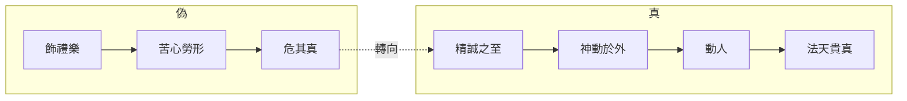

## 17. 延伸閱讀

### 原典與注疏

- 郭慶藩《莊子集釋》〈漁父〉
- 王先謙《莊子集解》〈漁父〉
- 成玄英《南華真經注疏》〈漁父〉相關疏文
- 林希逸《莊子口義》〈漁父〉

### 今注今譯與研究

- 陳鼓應《莊子今註今譯》〈漁父〉
- 王邦雄相關論「真實／虛偽」的現代解讀
- 關於雜篇「孔子對話體」年代與思想傾向的研究（劉笑敢等）

### 本專案內交叉引用

- 相關篇章：〈人間世〉、〈德充符〉、〈大宗師〉、〈盜跖〉、〈天下〉
- 相關人物：[孔子](content/figures/孔子.md)、[顏回](content/figures/顏回.md)、[莊周](content/figures/莊周.md)
- 相關名詞：[道](content/terms/道.md)、[無為](content/terms/無為.md)、精誠、真
- 相關主題：[政治與無為](content/themes/政治與無為.md)、[語言與真實](content/themes/語言與真實.md)、[焦慮與比較](content/themes/焦慮與比較.md)


<div class="pagebreak"></div>

<!-- part: 雜篇 id: 32 -->

# 列御寇

> **閱讀提示**：本篇為雜篇中的「故事串珠」體，段落語氣不一。文中區分三層聲音——**原典**、**歷代注家**、**本書現代詮釋**。不可把每一則寓言都讀成同一作者的同一命題。

## 01. 篇名與背景

〈列御寇〉以列子為篇名人物，但全篇並非列子專傳。開篇寫列子因受人敬奉而有「食於十漿」之驚，引出伯昏無人「巧者勞而智者憂」「虛而遨遊」的警策；中段以曹商使秦得車、莊子譏其「舔痔」式求寵，把啖名逐利推到荒誕；末段「莊子將死」，弟子欲厚葬，莊子以天地為棺槨、日月為連璧拒之——把「名」與「身後之名」一併放下。

本篇在全書中的功能像一組**處世風險說明書**：名聲如何反過來餵養你、吞噬你；人如何在被供養、被稱讚時失去「虛」；以及死亡面前，連殯葬之「禮」也可能變成另一種執名。它與〈逍遙遊〉列子「猶有所待」、〈應帝王〉「虛而待物」遙相呼應，但筆法更雜、更諷。

> **原典位置**：雜篇・第32篇・〈列御寇〉。版本依據見郭慶藩《莊子集釋》。

## 02. 成書背景

雜篇常彙編不同來源的短章。〈列御寇〉中，列子故事近隱逸警世，曹商故事近游士諷刺，莊子將死近學派自我形象塑造——三者主題相近（名、利、身），文氣不必同出一時。近現代研究多提醒：雜篇「莊子言行」材料，有的可能出自後學對宗師形象的追寫，讀時宜保留文本層次。

戰國游士奔走於諸侯之間，車馬、粟帛、名聲是可計算的報償；同時隱者傳統又以「不被供養」為清高的另一種身分政治。〈列御寇〉兩邊都寫到：它既嘲笑曹商式「以所學換車馬」，也警告列子式「尚未求名而名已至」——後者更細，因為危險發生在你以為自己仍清高之時。

引文以郭慶藩《莊子集釋》所收通行本為據。

## 03. 結構分析

全篇可粗分為三組（中間另有短章，此處抓主幹）：

1. **列子與伯昏無人**：受人敬奉 → 恐懼「咎」將至 → 「虛而遨遊」的教導。
2. **曹商使秦（及相關利祿故事）**：得車炫耀 → 莊子以極刻薄比喻刺穿「以身試寵」。
3. **莊子將死**：弟子欲厚葬 → 天地棺槨、烏鳶蝼蚁皆可「葬」 → 拒以人為形式障蔽自然。

### 結構圖

```text
列子食於十漿（名未求而人予）
        ↓
伯昏無人：巧勞智憂；虛己遨遊
        ↓
（中段短章：辯知、神巫等，略）
        ↓
曹商使秦得車：啖名逐利之極寫
        ↓
莊子將死：拒厚葬
        ↓
天地為棺槨／萬物為齋送
```

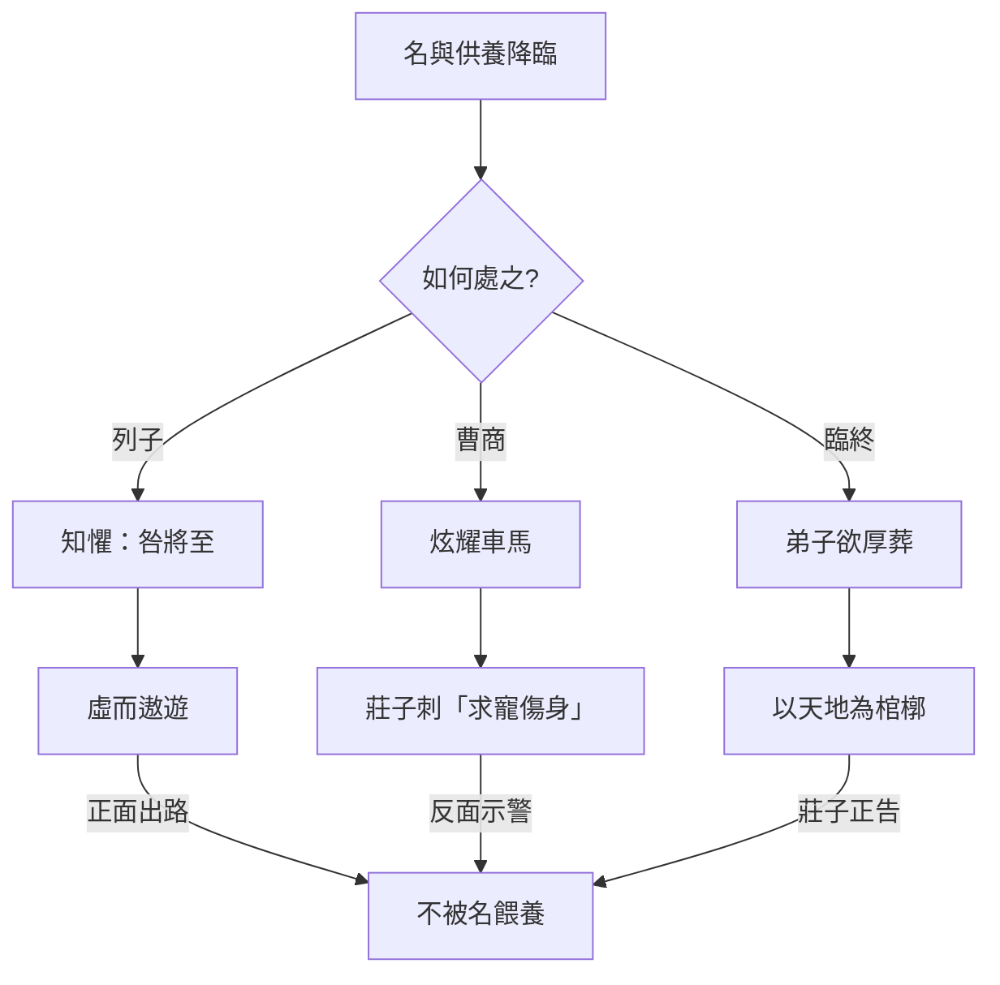

若用一句話總括：**名可遠人，也可來人；來人而不虛，人就被名所養、所驅、所葬。**

## 04. 原典

> **版本依據**：郭慶藩《莊子集釋》所據通行本；以下為必要引用，非全篇逐字抄錄。

### （一）列子驚於供養

> 列御寇之齊，中道而反，遇伯昏瞀人。伯昏瞀人曰：「奚方而反？」曰：「吾驚焉。」……「吾食於十漿，而五漿先饋。」

### （二）虛而遨遊

> 巧者勞而知者憂，無能者無所求，飽食而敖遊，汎若不繫之舟，虛而遨遊者也。

### （三）曹商使秦（諷刺）

> 宋人有曹商者，為宋王使秦。其往也，得車數乘；王說之，益車百乘。反於宋，見莊子……莊子曰：「秦王有病召醫，破癰潰痤者得車一乘，舔痔者得車五乘，所治愈下，得車愈多。子豈治其痔邪？何得車之多也？子行矣！」

### （四）莊子將死

> 莊子將死，弟子欲厚葬之。莊子曰：「吾以天地為棺槨，以日月為連璧，星辰為珠璣，萬物為齎送。吾葬具豈不備邪？何以加此！」弟子曰：「吾恐烏鳶之食夫子也。」莊子曰：「在上為烏鳶食，在下為螻蟻食，奪彼與此，何其偏也！」

## 05. 白話翻譯

### （一）列子為何中途折返？

列禦寇前往齊國，半路折回，遇見伯昏瞀人。伯昏問：為什麼回來？列子說：我受驚了。我在十家賣漿的地方用餐，竟有五家搶先送上——人家因為我的「名」而特別對待我。我擔心：這種被供養的狀態，會招來禍患。

### （二）伯昏的警策

伯昏指出：善於用巧的人勞苦，聰明外露的人憂慮；看似「無能」、無所求的人，反而能飽食而遨遊，像一艘沒有被繩索繫住的船——**虛而遨遊**。意思是：你若被他人的禮敬填滿，心就不虛；不虛，就會成為可被利用、可被忌妒、可被追究的「有名之物」。

### （三）曹商得車

宋人曹商替宋王出使秦國，去時只有幾輛車；秦王喜歡他，加到一百輛。他回宋後向莊子炫耀。莊子說：秦王生病召醫，能弄破膿瘡的得一輛車，願意「舔痔」的得五輛——治得越下作，車越多。你難道是治痔的嗎？為什麼車這麼多？你走吧！

### （四）莊子將死

莊子快死時，弟子想厚葬他。莊子說：我把天地當棺槨，日月當連璧，星辰當珠璣，萬物當陪葬——葬具還不夠完備嗎？何必再加？弟子擔心被烏鴉老鷹吃掉。莊子說：在上被烏鳶吃，在下被螻蟻吃；從那邊搶來給這邊，何必如此偏心！

## 06. 字詞註解

| 字詞 | 釋義 | 本篇閱讀提示 |
|------|------|--------------|
| 列御寇 | 列子；御風故事見〈逍遙遊〉 | 本篇寫其「驚於名」，與御風之「有待」可互參 |
| 伯昏瞀人／無人 | 隱者、達者之師形象 | 警策主體；「虛」之教導者 |
| 十漿／五漿先饋 | 十家賣漿、五家搶先供養 | 名至而物至的具體場景 |
| 驚焉 | 受驚、警覺 | 列子尚知懼，故可教 |
| 咎 | 災禍、罪責 | 名盛則謗與患隨之 |
| 巧者勞 | 有技巧者反更辛勞 | 與「無能者無所求」對舉 |
| 知者憂 | 智謀外露者多憂 | 智成為負擔 |
| 不繫之舟 | 未被纜繩繫住的船 | 「虛而遨遊」的核心喻象 |
| 虛 | 內心不被名利填滿 | 本篇工夫關鍵；≠自我貶低 |
| 遨遊 | 自在往來 | 與〈逍遙遊〉之「遊」同族 |
| 曹商 | 使秦得車的宋人 | 啖名求寵的諷刺典型 |
| 益車百乘 | 賞車增至百輛 | 「得」的誇飾；對照舔痔之喻 |
| 破癰潰痤 | 弄破膿瘡 | 求寵層級之起點 |
| 舔痔 | 極言卑屈取寵 | 諷刺修辭；非醫學記載 |
| 厚葬 | 隆重殯葬 | 臨終段落所拒之「名／禮」 |
| 棺槨 | 內棺外槨 | 莊子以天地代之 |
| 連璧／珠璣 | 陪葬珍寶 | 以日月星辰替換人間寶物 |
| 烏鳶／螻蟻 | 食屍之鳥與蟲 | 破「上下貴賤」的葬埋執念 |
| 齎送 | 送葬之物 | 萬物皆可為送；無需厚備 |

## 07. 段落解析


**走讀路線**：射之誡 → 中鹵彈 → 擊金而反。關鍵句：**技不失真**。

### 第一層：列子為何「驚」而不是「喜」？

普通人被五家搶著請客，多半沾沾自喜；列子卻折返。這「驚」是全篇第一個價值信號：**名至物至，未必是福。** 它接續〈逍遙遊〉對列子「猶有所待」的批評而轉深——此處所待者，不是風，而是他人的供養與目光。

與上下文：若開篇就寫曹商，讀者只看到醜陋求寵；先寫列子，才能寫出「清高者也可能被名擊中」的細膩危險。

### 第二層：「不繫之舟」為什麼是虛？

舟若被繫住，看似安全，實則失去隨水而往的自由；心若被禮敬填滿，看似受肯定，實則變成可被輿論與權力牽引的物件。「虛」不是空虛無內容，而是**不讓外來餵養成為自己的重心**。巧者勞、知者憂——越有能耐越被徵用；無能者無所求，反而保全遨遊的空間。

### 第三層：曹商段為何如此刻薄？

「舔痔得車」是《莊子》中最尖銳的政治諷刺之一。它把「外交成功—賞車—炫耀」的正當敘事，翻轉成「你到底願意卑屈到什麼程度」。文學效果極強，但也需提醒（現代詮釋）：這是寓言式極言，用來照出**報酬與人格屈降的交換結構**，不是教人辱罵所有出使或從政者。

與前後文：列子段寫「名未求而至」；曹商段寫「名與利主動獵取」。一被動、一主動，合起來才是完整的「名利病理學」。

### 第四層：臨終厚葬與「奪彼與此」

弟子的擔心很「正常」：怕老師屍體被鳥吃。莊子卻指出：厚葬不過是把鳥的食物改成蟻的食物——仍是偏心。這裡的哲學力道不在「薄葬政策」，而在**連死後安置也要爭「正確的被吃法」**，說明人對「我」的執著可以延伸到屍身。以天地為棺槨，是把個體還給大化，與〈至樂〉鼓盆、《大宗師》死生一體同調。

## 08. 歷代注家怎麼看

### 郭象

郭象讀「虛而遨遊」，多落在「無心以順物」：不預設機巧，則勞憂不生。對曹商段，郭注傾向點明「貪寵者自辱」；對將死段，則強調「死生與化為體」，厚葬只是生人之情的延續執著。其長處是把雜篇短章收束到「適性／無心」；需防的是把尖銳諷刺全部磨成溫和的安命論。

### 成玄英

成疏對「不繫之舟」發揮甚詳，常以心無繫著釋「虛」。對厚葬，成疏強調莊子「一死生、外形骸」，弟子之恐烏鳶，仍是分別心。唐疏工夫論色彩較濃，有助修養式閱讀，但語彙不可直接等同戰國原義。

### 林希逸

林希逸特重文氣：曹商段是「痛罵」，讀時要見其滑稽與凜烈；將死段是「達」，讀時要見其透脫。他提醒不可把舔痔句坐實為記事，也不可把列子「食於十漿」讀成勸人拒絕一切人情——重點在「心是否被餵養牽走」。

### 其他

- **王先謙《莊子集解》**：便於核對人名異稱（伯昏瞀人／無人）與章次。
- **郭慶藩《莊子集釋》**：曹商、將死兩段古注彙編的入口。
- **今人**：陳鼓應突出對權貴與虛名的批判；討論莊子形象塑造時，宜分開「思想」與「傳記真實性」。

## 09. 哲學分析

> 以下為**本書現代詮釋**。

### 9.1 名作為「餵養結構」

本篇最獨特的洞見，未必是「名不好」，而是：**名會餵人**。五漿先饋、車馬加益，都是餵養。被餵養者若無「虛」，就會調整自己的行為去維持餵養——於是名從結果變成主人。這比單純說「不要名」更精確。

### 9.2 虛而遨遊：與無待、心齋的關係

「虛」在〈人間世〉是心齋的核心；在〈應帝王〉是「虛而待物」；在本篇則具體化為「不被供養填滿」。三者可連成一條線：虛不是空無一物，而是保持可遊的餘地。列子御風猶有待於風；此處則警告猶有待於人的目光。

### 9.3 諷刺的倫理學限度

曹商段使用羞辱性比喻，力量來自冒犯。現代詮釋若只模仿刻薄，易落入以辱罵代替分析。較穩妥的讀法是抽出結構：當報酬隨「自我降格」而上升，體系就在獎勵屈從。批判應對準結構，而非以人身攻擊為樂。

### 9.4 死亡與「偏」

「奪彼與此，何其偏也」把喪葬爭論降維成對鳥與蟻的偏袒——用荒謬打破莊嚴執念。哲學上，這是齊物精神在屍身層次的運用：連「如何被分解」也不值得變成最後的勝負。

### 9.5 接入思想地圖

```text
名
 ├─ 被動至（列子：五漿先饋）→ 知懼 → 虛而遨遊
 ├─ 主動求（曹商：益車百乘）→ 諷刺 → 拒以身換寵
 └─ 身後延（厚葬）→ 天地棺槨 → 不與烏鳶螻蟻爭偏
```

## 10. 與老子比較

《老子》「名與身孰親」「知足不辱，知止不殆」，與本篇對名聲、車馬、身後榮光的警惕相通。老子多以格言收束欲望；〈列御寇〉則用場景與辱格比喻讓讀者「看見」名如何運作。

可並讀：老子助理解「知止」；本篇助理解「止不住時，名已開始養你」。虛而遨遊近於老子之「無私／不自見」，但莊子更強調遊的動態形象。

## 11. 與儒家比較

儒家重名教、慎終追遠、葬之以禮。本篇將死段幾乎正面衝撞厚葬與慎終的形式面。爭點仍宜精細化：

- 儒家之禮，意在透過形式安頓哀與敬；
- 本篇擔心形式變成對「我」的最後營造，反而障蔽大化。

列子段對「受人敬奉」的恐懼，也可對照儒家「君子疾沒世而名不稱焉」——一憂名不稱，一憂名稱而咎至。兩者不必互相取消，但張力真實存在。

## 12. 與佛學比較

「虛」易被讀成空；厚葬之拒易被讀成看破。可對話處在於：兩者皆鬆動對身、名的執取。然本篇「虛而遨遊」仍是道家式在世遊走，不是出離輪迴的解脫論。

**本篇暫以「可參照、勿等同」處理；不作硬性比附。**

## 13. 現代人生應用

> 以下為**現代詮釋**，回扣「虛而遨遊／名之餵養／厚葬之執」，非通用績效教戰。

### 13.1 當稱讚與資源開始「找上你」

升遷、邀約、免費招待、特別通融——若來勢突然，可學列子之「驚」：先問這份禮遇綁定了什麼期待。練習不是拒人千里，而是保持「不繫」：接受人情，卻不把自我價值外包給持續被餵養。

### 13.2 辨認「得車愈多」的交換

有些機會明碼標價：越願意自我矮化、越願意說違心的話，回報越高。本篇曹商段的現代用處，是給這種交換命名。你可以仍選擇進入體制，但應清楚自己付的是哪一種「身價」。

### 13.3 社群聲量與「五漿先饋」

粉絲、轉發、被認識的快感，很像漿家先饋。虛的練習可以很具體：定期做無人看見的事；或在稱讚到來時，延遲自我敘事的改寫——不要立刻變成「被稱讚的那個人設」。

### 13.4 談死亡與告別方式

預立醫療、喪禮形式、訃聞規格，常變成家人的面子戰場。本篇不是規定人人薄葬，而是問：我們是否在為逝者爭一種「正確的被安置」，而忽略哀與化本身？討論時可把「偏」字拿出來——我們在保護誰的心安，又在排除什麼自然過程？

## 14. 常見誤解

1. **「虛就是要變得無能、無成就。」**  
   「無能者無所求」是對照修辭；重點是無所求於名利餵養，不是否定能力。

2. **「本篇叫人拒絕一切禮物與職位。」**  
   列子所驚的是「因名而饋」的結構，不是一切人際餽贈。

3. **「莊子辱罵曹商，所以嘲諷等於有道。」**  
   諷刺是文學手段；道不在學會罵人。

4. **「拒厚葬＝不孝、不尊重死者。」**  
   文本挑戰的是執形與偏心；敬與哀仍可有其他安置方式。

5. **「篇中莊子言行皆為信史。」**  
   臨終對話富文學性，宜作思想表達讀，慎作傳記還原。

## 15. 本篇總結

〈列御寇〉用三組強場景寫同一個問題：人如何被「名」養活、驅使、甚至死後繼續塑造。列子段教「虛而遨遊」——如不繫之舟；曹商段揭「求寵的價格」；將死段把棺槨交還天地。合起來，它不是教人變冷漠，而是教人**別把餵養當自己，別把賞車當成就，別把厚葬當最後的我**。

若以一句話收束：**能遊者，不是從未被名碰到的人，而是被碰到仍能保持虛、不讓纜繩繫住船的人。**

## 16. 心智圖


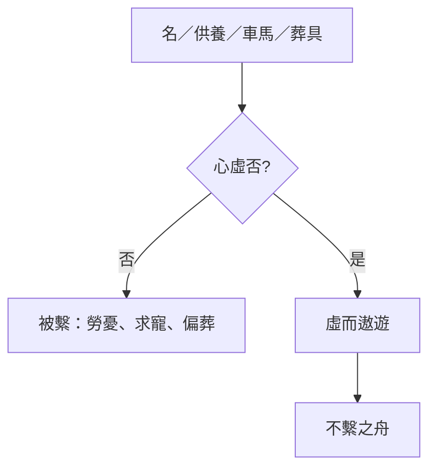

## 17. 延伸閱讀

### 原典與注疏

- 郭慶藩《莊子集釋》〈列御寇〉
- 王先謙《莊子集解》〈列御寇〉
- 成玄英《南華真經注疏》相關疏文
- 林希逸《莊子口義》〈列御寇〉

### 今注今譯與研究

- 陳鼓應《莊子今註今譯》〈列御寇〉
- 〈逍遙遊〉列子御風段對讀
- 關於《莊子》中「莊子言行」材料性質的討論

### 本專案內交叉引用

- 相關篇章：〈逍遙遊〉、〈人間世〉、〈應帝王〉、〈至樂〉、〈外物〉、〈天下〉
- 相關人物：[列禦寇](content/figures/列禦寇.md)、[莊周](content/figures/莊周.md)、[惠施](content/figures/惠施.md)
- 相關名詞：[逍遙](content/terms/逍遙.md)、[無用之用](content/terms/無用之用.md)、[物化](content/terms/物化.md)、虛
- 相關主題：[死亡與喪親](content/themes/死亡與喪親.md)、[無用與有用](content/themes/無用與有用.md)、[自由與無待](content/themes/自由與無待.md)


<div class="pagebreak"></div>

<!-- part: 雜篇 id: 33 -->

# 天下

> **閱讀提示**：〈天下〉是《莊子》中罕見的**學術史／思想地圖**篇章，不是人物寓言集。讀法應接近「先秦道術總論」：先立「古之道術」的整全理想，再評各家「得一察焉以自好」。文中區分**原典**、**歷代注家**、**本書現代詮釋**三層聲音。

## 01. 篇名與背景

〈天下〉列雜篇之末，篇名取開篇視野：「天下」非僅政治疆域，而是文明中「道術」所託的整體世界。它提出一個全書級命題——**道術將為天下裂**——然後以有序的學派評述，為讀者繪製戰國思想的裂變圖。

在三十三篇中，本篇地位特殊：它幾乎不靠鯤鵬式寓言推進，而靠**分類、稱引、褒貶與自我定位**。末段寫莊周「以謬悠之說、荒唐之言、無端崖之辭」及「寓言／重言／卮言」，等於給《莊子》文體立自我說明。因此，〈天下〉既是思想史文獻，也是理解「莊子如何看待莊子」的後設篇章。

> **原典位置**：雜篇・第33篇・〈天下〉。版本依據見郭慶藩《莊子集釋》。

## 02. 成書背景

多數研究者視〈天下〉為較晚出的總論性作品：它對墨家、宋鈃尹文、彭蒙田駢慎到、關尹老聃、莊周（以及惠施等）的掌握，顯示作者處於學派分化已明、需要「譜系敘事」的時代。其立場明顯偏道家——以「古之人」「道術」之全為尺度，評諸子為偏至——故它不是中立百科，而是**有判準的學術史**。

此種寫法，與《荀子・非十二子》《韓非子・顯學》等同屬戰國至漢初「論諸子」傳統，但〈天下〉的獨特性在於：它把最高理想放在「備於天地之美、稱神明之容」的整全道術，並在譜系末端安放莊周，使全書收束於自我解釋。

引文以郭慶藩《莊子集釋》所收通行本為據；學派歸類與人物離合，歷來有異說，下文於註解標明爭議處。

## 03. 結構分析

全篇是清楚的「總—分—合」結構：

1. **總論**：古之道術／「道術將為天下裂」／「天下多得一察焉以自好」。
2. **分評諸家**（由遠而近、由偏而親）：
   - 墨翟、禽滑釐
   - 宋鈃、尹文
   - 彭蒙、田駢、慎到
   - 關尹、老聃
   - 莊周
3. **附論名家**：惠施（及桓團、公孫龍等）——以「弱於德、強於物」收束辯者之蔽。

### 結構圖

```text
古之道術（整全：天地—神明—人倫—萬物）
                ↓ 裂
        ┌───────┼───────┐
       墨家    宋尹    彭田慎
    （儉苦兼愛）（禁攻情欲）（棄知去己）
                ↓
            關尹・老聃（見譽／無為）
                ↓
              莊周（謬悠荒唐；寓／重／卮）
                ↓
            惠施等辯者（強於物而弱於德）
```

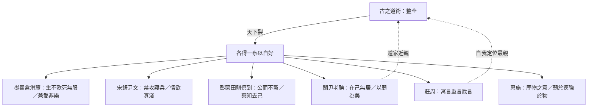

總括一句：**先畫「全」，再量「偏」，最後用莊周文體說明「如何說那個全」。**

## 04. 原典

> **版本依據**：郭慶藩《莊子集釋》所據通行本；以下為必要引用，非全篇逐字抄錄。

### （一）總綱：道術將為天下裂

> 天下之治方術者多矣，皆以其有為不可加矣。……天下大亂，賢聖不明，道德不一，天下多得一察焉以自好。……道術將為天下裂。

### （二）古之人的整全

> 古之人其備乎！配神明，醇天地，育萬物，和天下，澤及百姓，昭於本數，係於末度，六通四辟，小大精粗，其運無乎不在。

### （三）墨家（節錄評語方向）

> 不侈於後世，不靡於萬物，不暉於數度，以繩墨自矯，而備世之急；古之道術有在於是者。墨翟禽滑釐聞其風而說之。……其生也勤，其死也薄，其道大觳；使人憂，使人悲，其行難為也……

### （四）宋鈃、尹文

> 不累於俗，不飾於物，不苟於人，不忮於眾，願天下之安寧以活民命，人我之養畢足而止……

### （五）彭蒙、田駢、慎到

> 公而不當，易而無私，決然無主，趣物而不兩，不顧於慮，不謀於知，於物無擇，與之俱往……

### （六）關尹、老聃

> 以本為精，以物為粗，以有積為不足，澹然獨與神明居……人皆取先，己獨取後……人皆取實，己獨取虛……堅則毀矣，銳則挫矣……可謂至極。

### （七）莊周（文體自我說明）

> 芴漠無形，變化無常……以天下為沈濁，不可與莊語；以卮言為曼衍，以重言為真，以寓言為廣。……獨與天地精神往來而不敖倪於萬物，不譴是非，以與世俗處。……其於本也，弘大而辟，深閎而肆；其於宗也，可謂稠適而上遂矣。

### （八）惠施

> 弱於德，強於物，其塗隩矣。……惠施不能以此自寧，散於萬物而不厭，卒以善辯為名。……悲夫！

## 05. 白話翻譯

### （一）總論

天下研究「方術」的人很多，都覺得自己那一套已無可再加。其實古來的道術是整全的：能配合神明、醇厚於天地、養育萬物、調和天下。後來天下大亂，聖賢之光不明，道德標準分裂，於是各人只抓住一個角落的觀察，自以為完整——**道術將要被天下撕裂了。**

### （二）墨家

墨翟、禽滑釐一派，崇尚儉約、以繩墨自我矯正，生時勤勞、死時薄葬，反對奢樂。他們確有「備世之急」的古風；但道路過於枯苦，使人憂悲，難於普遍實行，其「非樂、節葬」等主張，在〈天下〉看來是得其一端而失其和。

### （三）宋鈃、尹文

他們不被流俗拖累，不以外物矯飾，希望天下安寧、人民活命，人我之養夠用就停；主張禁攻寢兵，情欲寡淺。〈天下〉承認其有「見侮不辱」一路的救世心，同時暗示其對「心」與「物」的處理仍屬一偏之察。

### （四）彭蒙、田駢、慎到

他們強調公正而不結黨，平易而無私，決然不立固定主宰，隨物而往，棄知去己。〈天下〉一方面肯定其近於「公」；另一方面批評：若「非生人之行而至死人之理」，把活的主體過度掏空，仍未臻道術之全——慎到之道，「慨乎皆有所缺」。

### （五）關尹、老聃

以本為精、以物為粗；人爭先而己取後，人取實而己取虛；知道堅易毀、銳易挫。〈天下〉給予極高評價，稱為「古之博大真人」——在譜系中，這是莊周之前最受推崇的近親。

### （六）莊周

他認為天下沈濁，不可只用一本正經的「莊語」；於是以卮言推衍，以重言取信，以寓言擴大。他獨與天地精神往來，卻不傲視萬物；不執著譴責是非，而能與世俗相處。其於本、於宗，〈天下〉許以弘大深閎——這是全書最明確的「莊學自贊／自述」。

### （七）惠施

惠施強於分析萬物、善辯出名，卻「弱於德」。〈天下〉嘆其不能自寧，終究散於物論——辯者之途，幽曲而難歸於道。

## 06. 字詞註解

| 字詞 | 釋義 | 本篇閱讀提示 |
|------|------|--------------|
| 道術 | 整全的道與治術／學術 | 本篇最高尺度；對照「方術」 |
| 方術 | 一方之術、局部之學 | 諸子所執；「皆以其有為不可加」 |
| 天下裂 | 道術分裂於天下 | 總命題；思想史的危機敘事 |
| 一察 | 一隅之觀察 | 「自好」的認識論根源 |
| 自好 | 自以為尚、自以為足 | 學派封閉性的心理機制 |
| 神明 | 靈明／造化之精微 | 「配神明」屬古之人整全的一環 |
| 本數／末度 | 根本與末節法度 | 全備者能貫穿本末 |
| 墨翟／禽滑釐 | 墨家宗師與大弟子 | 評為勤苦薄葬、道大觳 |
| 大觳 | 過於瘠薄苛苦 | 墨家之蔽的關鍵評語 |
| 宋鈃／尹文 | 近墨而重心性與反戰 | 「禁攻寢兵」「情欲寡淺」 |
| 彭蒙／田駢／慎到 | 齊學一系；貴公、棄知 | 〈天下〉許其公，惜其缺 |
| 棄知去己 | 去掉智巧與自我執持 | 近道又恐近「死人」 |
| 關尹／老聃 | 道家近親 | 本篇推崇為「博大真人」 |
| 取後／取虛 | 不爭先、不積實 | 老子式策略的學術史表述 |
| 莊語 | 端莊正經的言論 | 對照卮言、寓言 |
| 寓言 | 寄託他人他事之言 | 「以寓言為廣」 |
| 重言 | 借重耆老／權威之言 | 「以重言為真」 |
| 卮言 | 曼衍無端、因應變化之言 | 「以卮言為曼衍」；莊學文體核心 |
| 天地精神 | 與造化相通之精神 | 莊周「獨與……往來」 |
| 不敖倪於萬物 | 不傲視萬物 | 逍遙而不傲慢 |
| 不譴是非 | 不執著譴責是非 | 與〈齊物論〉互通 |
| 惠施 | 名家／辯者代表 | 「弱於德，強於物」 |
| 歷物之意 | 惠施分析萬物的論題 | 見篇末歷物諸條 |
| 弱於德、強於物 | 德弱而物論強 | 辯者總評 |

## 07. 段落解析


**走讀路線**：道術分裂 → 諸家評述 → 莊子寓重卮言。全書總綱篇。

### 第一層：為何先立「古之道術」才評諸子？

若沒有「全」的理想型，任何批評都會變成派系互罵。〈天下〉先描繪一個能貫穿神明、天地、萬物、百姓、本數末度的整全狀態，然後才說「裂」。這使後文對墨、慎、惠的貶抑，都服務於同一個認識論命題：**局部觀察被膨脹成全體，就是亂世之學術結構。**

### 第二層：評列順序為什麼如此排列？

大致由「遠於道」到「近於道」，再到「莊周自我定位」，最後以惠施為辯者殷鑑。墨家最先，因其「大觳」與莊學養生、任自然距離最遠；關老緊挨莊周，顯示道家內部譜系；惠施殿後，提醒「強於物」的知識主義仍是威脅。這不是現代學科分類，而是**價值距離的排序**。

### 第三層：對墨家「承認其風」又「嘆其難為」說明什麼？

〈天下〉的評定技術很穩：先說「古之道術有在於是者」——承認一端之真；再說其不可普遍、失於和——指出膨脹之害。這比全盤抹殺更有思想史信度，也避免讀者把莊學讀成「凡異己皆錯」。

### 第四層：慎到「棄知去己」為何仍「有所缺」？

此段極關鍵：看起來很「道家」的主張，仍可能被評為缺。因為把「去己」推到近乎「死人之理」，會失去活的因應與神明之醇。這為莊周段鋪路——莊子要的不是死寂的無己，而是能「與世俗處」又「與天地精神往來」的雙向能力。

### 第五層：寓言／重言／卮言為何出現在學術史末段？

因為〈天下〉不只問「誰對」，還問「**如何言說才配得上道術之全**」。天下沈濁，莊語不夠；需要寓言打開想像，重言借力傳統，卮言保持流動。這三段論是閱讀全書的方法論鑰匙，也使本篇從「評別人」轉成「解釋自己為何這樣寫」。

### 第六層：惠施收束的作用

以惠施之才，終「善辯為名」而「不能自寧」——〈天下〉用悲劇語氣提醒：分析萬物的能力若無「德」的承載，知識會變成自我流放。對照全書莊惠對話，此處等於給「好友兼對手」一個總帳。

## 08. 歷代注家怎麼看

### 郭象

郭象注「道術裂」與「一察自好」，常回到其「性分」論：各家執一性以為全，故裂。他對莊周段「不譴是非，以與世俗處」特別契其「遊外以冥內」的讀法。需注意：郭象可能把「裂」解釋得過順，削弱原文對亂世與道德不一的歷史痛感。

### 成玄英

成疏細釋寓言、重言、卮言：寓言廣其義，重言信其言，卮言曼衍以應時。此三分法經成疏而更教條化，卻極便於教學。對墨、慎諸評，成疏多以「執滯」釋其蔽，與「一察」相通。

### 林希逸

林希逸強調〈天下〉是「莊子後序」式文字：讀全書後再讀此篇，方知諸篇筆法有自。他提醒惠施段與〈齊物論〉〈秋水〉互看；並指出「博大真人」美關老，可見莊學對老子傳統的自覺歸趨與差異（莊更謬悠）。

### 其他

- **王先謙《莊子集解》**：學派人名、章次對讀方便。
- **郭慶藩《莊子集釋》**：本篇長文古注最富，宜作校讀底本。
- **今人**：侯外廬、錢穆、陳鼓應、劉笑敢等對〈天下〉年代與學派歸類討論甚多；本專案採「晚出總論、道家立場的學術史」為工作假說，不關閉異說。

## 09. 哲學分析

> 以下為**本書現代詮釋**。

### 9.1 「一察焉以自好」：認識論的政治

本篇最深的哲學貢獻，未必是對某家評分高低，而是揭示：**亂世不只是武力分裂，也是判準分裂。** 每人把自己窗口所見稱為天下，學術就成為「自好」的戰場。這與〈齊物論〉「道隱於小成」同構，但〈天下〉把它歷史化、學派化。

### 9.2 整全不是百科相加

「古之道術」不是把墨、名、法、儒條目加總。它是一種**本末貫通的運作**：小大精粗，其運無乎不在。因此，現代讀者若把〈天下〉讀成「知識愈多愈全」，恰與篇旨相反；全來自通，不來自堆。

### 9.3 莊周的自我定位：親關老，別於慎墨，戒於惠施

譜系距離本身就是論證：

| 對象 | 〈天下〉的基本判斷（概括） | 對莊學的意義 |
|------|---------------------------|--------------|
| 墨家 | 有古風，道大觳，難為 | 拒苦行普遍化 |
| 宋尹 | 救民之志，仍屬一察 | 拒僅以反戰／寡欲為極 |
| 彭田慎 | 貴公去己，慨有所缺 | 拒死寂式無主 |
| 關老 | 至極、博大真人 | 近親與典範 |
| 莊周 | 弘大深閎；寓重卮 | 自我方法論 |
| 惠施 | 弱德強物 | 辯者之戒 |

### 9.4 文體即哲學：卮言為什麼必要？

若道術之全無法被「莊語」一次說盡，則語言策略本身成為思想的一部分。寓言防僵化，重言防無根，卮言防固著——三者合起來，是對「一察自好」在文體層的對治。

### 9.5 接入思想地圖

```text
道術（全）
 └─ 裂 → 方術／一察自好
      ├─ 墨：儉苦兼愛
      ├─ 宋尹：禁攻寡欲
      ├─ 彭田慎：公／棄知
      ├─ 關老：虛／後／弱
      ├─ 莊：寓・重・卮；與天地精神往來
      └─ 惠：歷物善辯（戒）
```

## 10. 與老子比較

〈天下〉幾乎把關尹、老聃寫成理想型：「取後」「取虛」「堅毀銳挫」。這與《老子》本文高度一致。差異在於：〈天下〉接著推出莊周——在老子式「至極」之後，還需要謬悠荒唐的言說，以面對「天下沈濁」。

可謂：老子示範「道之行」；〈天下〉中的莊周示範「道之言」。讀《老子》可理解為何關老被尊；讀莊周段可理解為何《莊子》不能寫成《老子》的複本。

## 11. 與儒家比較

〈天下〉對儒家著墨不如對墨、名、道清楚（篇中「詩書禮樂」多出現在古之道術的整全描述，而非獨立長評）。這本身值得玩味：儒家經典被寫進「古之人備」的文化背景，卻未像墨家那樣被單列痛批或單列盛讚。

對照《荀子・非十二子》可見不同學術史策略：荀重正名定分，莊（後學）重道術整全與言說方式。現代詮釋不宜硬說〈天下〉「反儒」或「親儒」；較準確的是——**它以道家尺度重繪諸子，儒家在圖中更像背景座標。**

## 12. 與佛學比較

後世或以「破執」「不落邊見」比附「一察自好」之戒。認識論上可對話：皆警惕局部執為全體。但〈天下〉的框架是先秦道術與方術，目標是文明中的神明與人倫貫通，不是解脫論。

**本篇作思想史閱讀時，佛學比較非必要；若談，僅標為跨傳統對話，勿等同。**

## 13. 現代人生應用

> 以下為**現代詮釋**，回扣「道術／一察自好／寓重卮」，服務於如何讀書、如何處多元價值，而非績效或爭論教戰模板。

### 13.1 讀思想、學科與「專業」時

每個學科都像「方術」：經濟學、心理學、工程、管理，皆「以其有為不可加」。〈天下〉的練習是：先承認其「有在於是者」，再問它把哪一塊膨脹成了全體。這能減少門戶之見，也避免反智地否定專業。

### 13.2 面對公共議論的「自好」

網路時代人人有窗口，窗口極易變成天下。可借用本篇三問：我是否只有一察？我是否自好到聽不進本末？我是否把方法（流量、立場、語氣）當成了真理本身？

### 13.3 表達複雜觀點：向寓言／重言／卮言借法

- **寓言**：用故事與案例打開想像，避免一開始就下定義戰。  
- **重言**：適當援引傳統與可靠來源，避免憑空立說。  
- **卮言**：保持可修正、可轉向，避免一次發言鎖定終身立場。  

這不是寫作炫技，而是對治「一察自好」的語言倫理。

### 13.4 看學派譜系，也看自我定位

〈天下〉教人畫地圖：誰近、誰遠、誰是戒鑑。個人知識生活亦可如此——標出自己的「關老」（典範）、自己的「惠施」（易沉迷的智力遊戲）、自己的「墨」（易走極端的道德熱情）。地圖的目的不是站隊，而是避免把偏愛誤認為整全。

## 14. 常見誤解

1. **「〈天下〉是客觀中立的先秦哲學史。」**  
   它是道家立場的評定譜系；「中立百科」不是其文體。

2. **「道術裂＝百家都錯，只有莊子對。」**  
   原文對各家多先肯定「有在於是者」；莊周段亦是方法論自述，不是簡單頒獎。

3. **「棄知去己就是莊學最高境界。」**  
   慎到被評「有所缺」；莊學要的是能往來天地又處世俗。

4. **「寓言就是假話，所以莊子不嚴肅。」**  
   寓言是廣；莊語不足時，寓言反而是更嚴肅的策略。

5. **「惠施段證明莊子與名家無關。」**  
   相反，全書密集對話惠施；此處是總評其蔽，不是否認其重要性。

## 15. 本篇總結

〈天下〉以「道術將為天下裂」為總綱，把《莊子》收束成一幅有判準的先秦思想地圖：墨之苦、宋尹之救、慎到之公而缺、關老之至極、莊周之寓重卮、惠施之強物弱德。它讓讀者明白——全書的荒唐謬悠，不是隨便；而是在沈濁之世，為了逼近那個「小大精粗，其運無乎不在」的整全，所採取的言說與生存方式。

若以一句話收束：**裂不可怕，可怕的是把一察當成天下；而莊學的回應，是畫出裂縫，並發明能在裂縫中仍與天地精神往來的語言。**

## 16. 心智圖


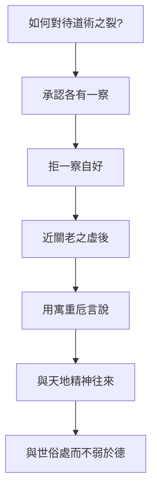

## 17. 延伸閱讀

### 原典與注疏

- 郭慶藩《莊子集釋》〈天下〉
- 王先謙《莊子集解》〈天下〉
- 成玄英《南華真經注疏》〈天下〉（寓言／重言／卮言疏）
- 林希逸《莊子口義》〈天下〉

### 今注今譯與研究

- 陳鼓應《莊子今註今譯》〈天下〉
- 王邦雄《莊子內七篇‧外秋水‧雜天下的現代解讀》相關章節
- 劉笑敢等關於〈天下〉年代、作者與先秦學術史書寫的研究
- 對讀：《荀子・非十二子》《史記・太史公自序》論六家要指

### 本專案內交叉引用

- 相關篇章：〈齊物論〉、〈秋水〉、〈寓言〉、〈逍遙遊〉、〈天道〉、〈天運〉
- 相關人物：[莊周](content/figures/莊周.md)、[惠施](content/figures/惠施.md)、[老聃](content/figures/老聃.md)、關尹、墨翟
- 相關名詞：[道](content/terms/道.md)、[卮言](content/terms/卮言.md)、[齊物](content/terms/齊物.md)、[無為](content/terms/無為.md)、[逍遙](content/terms/逍遙.md)
- 相關主題：[政治與無為](content/themes/政治與無為.md)、[自由與無待](content/themes/自由與無待.md)、[語言與真實](content/themes/語言與真實.md)
- 相關地圖：[思想地圖](content/maps/思想地圖.md)（道術分裂譜系）


<div class="pagebreak"></div>

# 後記

本書在此落筆，但屬於我們的人生才正要啟航。

在全書的尾聲，我想以蘇軾晚年被貶惠州時，《錢氏私志》所記載佛印禪師寄給他的一封信，作為與諸位讀者的共勉：

> 子瞻中大科，登金門，上玉堂，遠於寂寞之濱，權臣忌子瞻為宰相耳。
>
> 人生一世間，如白駒之過隙。二三十年功名富貴，轉盼成空，何不一筆勾斷，尋取自家本來面目，萬劫常住，永無墮落。縱未得到如來地，亦可以驂駕鸞鶴，翱翔三島，為不死人。何乃膠柱守株，待入惡趣？
>
> 昔有問師，佛法在甚麼處？師云在行住坐臥處，著衣吃飯處，屙屎剌撒處，沒理沒會處，死活不得處。子瞻胸中有萬卷書，筆下無一點塵，到這地位，不知性命所在，一生聰明，要作甚麼？
>
> 三世諸佛，則是一個有血性的漢子。子瞻若能腳下承當，把一二十年富貴功名賤如泥土，努力向前，珍重，珍重。

%%RAW%%
<div class="afterword-closing">
  <p>願你我心中，皆能養就那一點浩然之氣，乘千里快哉之風，自在前行。</p>
  <div class="afterword-calligraphy-wrap">
    
    <p class="calligraphy-fallback sr-only">人生如逆旅，我亦是行人。</p>
  </div>
</div>
%%/RAW%%


<div class="pagebreak"></div>

# 版權頁

**莊子全解**（Zhuangzi Atlas）  
原典・白話・哲學・人生智慧

編著：李孟霖編集  
版本：1.0.0（draft）  
年份：2026

原典引文依據通行本系統（郭慶藩《莊子集釋》為主）。  
歷代注解屬各注家文獻；現代詮釋屬本專案編寫。

本成冊稿僅供個人學習、教學參考與非商業影印裝訂。  
商業出版或大規模重製前，請另行確認權利與最新版本。

© 2026 李孟霖編集
