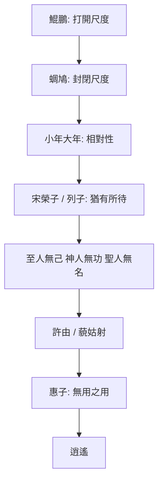
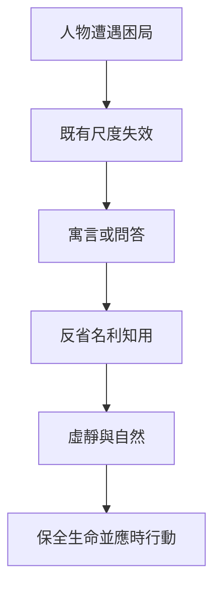

# 莊子全解

**原典・白話・哲學・人生智慧**

Zhuangzi Atlas

人生玩家

李孟霖編集

版本 0.3.0（draft）・2026


<div class="pagebreak"></div>

%%RAW%%
<section class="author-flap-page" id="作者介紹">
  <p class="author-flap-label">書面折頁｜作者介紹</p>
  <p class="author-flap-name">
    
  </p>
  <p class="author-flap-role">編集・《莊子全解》</p>
  <p class="author-flap-body">出生於台灣。年少時不學無術，母親說以後長大應該是放牛吃草、撿牛屎賺錢。這幾年在人世中載浮載沉，見證過人性純粹的惡，也感受過美好。是個迷途的小書僮。</p>
  <p class="author-flap-body">未來打算寫一本結合 OECD 指引與各國判決的移轉訂價與預先訂價實務指南。（有時間的話）</p>
</section>
%%/RAW%%


<div class="pagebreak"></div>

%%RAW%%
<section class="epigraph-page">
  
  <p class="calligraphy-fallback sr-only">人生不過短短三萬天，要放膽體驗，要勇敢冒險與嘗試，不要把自己困在方寸之間。</p>
</section>
%%/RAW%%


<div class="pagebreak"></div>

# 出版資訊

## 書名與版本

- **中文書名**：莊子全解
- **英文書名**：Zhuangzi Atlas
- **副標題**：原典・白話・哲學・人生智慧
- **編著者**：李孟霖編集
- **版本**：0.3.0（draft，尚未達出版級 review／published）
- **年份**：2026

## 編輯說明

本書依《莊子》內篇、外篇、雜篇順序編排，並於正文前附緒論（改編自專案〈導論〉）。各篇採固定結構：原典、白話、字詞、段落解析、歷代注家、哲學分析、比較閱讀、現代應用等，方便影印後依篇翻查。

內容分三層聲音，閱讀時請分開看待：

1. **原典**：標明篇名與版本依據之《莊子》引文。
2. **歷代注解**：郭象、成玄英等注家說法（標注家名）。
3. **本書現代詮釋**：哲學分析與人生應用（明標為詮釋，不可視為原文）。

## 引用版本

正文引文以郭慶藩《莊子集釋》所收通行本系統為準；異文與篇章真偽僅在影響解讀時提示。

## 免責聲明

- 本書之現代詮釋與人生應用，僅供閱讀與思考參考，**不構成法律、醫療、宗教或人生決策之指導**。
- 目前為 draft 成冊稿，文字仍可能修訂；若用於正式出版或課堂指定讀本，請以日後 review／published 版本為準。
- 請尊重原典與注家文獻；轉載本書現代詮釋文字時，請註明出處「莊子全解」。


<div class="pagebreak"></div>

# 《莊子全解》自序

台灣人的平均壽命約為80歲，這意味著40歲的我，已經站在了人生折返點。

回首這幾年，迎接女兒的新生，目睹父母的逐漸老化，經歷了自己的一場大病，再到送走阿公——生、老、病、死，彷彿在短時間內將人生「全餐」吃了一遍。記得那年躺在病床上，我曾發誓絕不再為了工作透支生命，可康復後，卻又下意識地加班到深夜才離去。也記得大伯與阿公臨終時，那瘦骨嶙峋、與往昔判若兩人的模樣，那種視覺上的衝擊，曾讓我陷入巨大的虛無：我們窮盡一生，到底在追求什麼？

當女兒出生，看著那個小生命努力睜開眼，第一次探索這個世界，我對她說：「嗨，歡迎來到這個世界。」那一刻，生命顯得無比神奇；但當阿公離世，站在棺木前，看著他因脫水而變得陌生，甚至難以辨識的容顏，我才驚覺，原來死亡並非電影裡的平靜安詳，而是如此赤裸且殘酷。

生命之於此，似乎就是這樣。走的時候，煙消雲散；走過一遭，連曾經穿過的衣物、蓋過的棉被，最終都將被捨棄。彷彿來過，卻沒帶走什麼，也沒留下什麼。在那一剎那，我隱約觸摸到了人生的底色。喔，原來這就是人生！

在職場浮沉多年，歷經挫折，我也見識了人性中純粹的惡，但也慶幸遇到了許多良善之人。面對情感與工作的磨難，我心中有過許多執著。為了尋找答案，我讀過《被討厭的勇氣》、《蛤蟆先生去看心理師》，也讀過《金剛經》。我不知道怎麼「課題分離」，也不確定如何「應無所住，而生其心」。直到遇見了《莊子》，我才在那些艱澀或平實的字句中，感受到靈魂的些許釋放與解惑。

然而，外人的詮釋終究隔了一層。與其一味汲取他人的觀點，不如由我親自記錄——記錄莊子的精神，如何真實地應用於現實的生活與工作。

這本《莊子全解》想做的事很單純：讓讀者在這一本書裡，依原典順序讀完三十三篇，而不是只撿幾句「人生金句」。

《莊子》難讀，往往不是因為文字古奧，而是因為它用寓言、重言、卮言說話，又被後世注家與現代勵志語層層覆蓋。因此，本書堅持三層分讀：

1. 先看**原典**寫了什麼；
2. 再看**注家**怎麼解；
3. 最後才讀本書的**現代詮釋**——後者是編者的哲學整理與人生應用，不是「莊子親口說」。

若你是第一次讀莊子，建議先讀緒論與內篇七篇，再依興趣進入外篇、雜篇。願這冊書能陪你把《莊子》，慢慢讀。這不僅是前人的智慧，更是指引我在人生折返點後，走得更從容的引路燈。

—— 莊子全解．李孟霖．2026 仲夏


<div class="pagebreak"></div>

# 緒論：如何閱讀《莊子》

> **閱讀提示**：本導論不是莊子原篇。原典引文均標明出處；注家意見與本書現代詮釋分列，不以後人語言冒充原文。

## 01. 篇名與背景

《莊子》不是一部可以用幾條「人生金句」讀完的書。它以寓言、重言、卮言穿插，時而辯論、時而戲謔、時而寫極深的死生經驗。這篇導論所要處理的，不是替讀者預先下結論，而是提供一張閱讀地圖：如何先辨文本，再入問題；如何既不把莊子讀成消極逃避，也不把它削成勵志語錄。

全書的中心關切可暫以四組問題表示：人如何不被功名、形體與成見困住？是非之爭有沒有更寬的視野？人在危險政治與人際關係中如何保全？面對變化、衰老與死亡，如何安頓？內篇七篇依次展開自由、齊同、養生、處世、德、死生與治道，並非零散名言的集合。

## 02. 成書背景

莊周約活動於戰國中期；列國競爭、遊說求仕、名辯興盛，正是「知」與「用」被高度競逐的時代。《莊子》三十三篇不大可能盡出一人之手。一般研究多將內篇七篇視為較接近莊周及其核心思想圈的文本；外篇、雜篇成分較複雜，可能有後學編入與不同支系聲音。這是閱讀的起點，不是貶抑：文本層次不同，問題與寫作時代也可能不同。

今本的定型與晉代郭象注本關係極深。郭象刪定為三十三篇，其注也深刻塑造後世理解；唐成玄英作疏，清郭慶藩《莊子集釋》廣收舊說，為今日常用考讀基礎。本書引文以郭慶藩所據通行本系統為準；異文與篇章真偽只在影響解讀時提示，不把學術爭議假裝成已定論。

## 03. 結構分析

本導論按「文本—方法—路線」行進：先建立成書與版本意識，再說明莊子獨特的寓言語言，最後把三十三篇與本專案的閱讀層次接起來。

### 結構圖

```text
戰國語境與成書層次
        ↓
內篇／外篇／雜篇的閱讀差異
        ↓
寓言、重言、卮言：不把話語當教條
        ↓
原典 → 注家 → 現代詮釋
        ↓
內篇七篇閱讀地圖 → 全書交叉閱讀
```

## 04. 原典

> 版本依據：郭慶藩《莊子集釋》所收通行本。以下引文分見〈寓言〉、〈天下〉、〈齊物論〉。

> 寓言十九，重言十七，卮言日出，和以天倪。

> 道術將為天下裂。

> 吹萬不同，而使其自己也，咸其自取，怒者其誰邪？

第一句說明《莊子》的說話方式：以故事寄託、以古人或權威之言加重、以隨境流出的話語應對。第二句提醒讀者，戰國思想已分流而爭；第三句則從風聲萬竅帶出萬物各有聲響、各自取其位置的問題。

> **原典位置**：〈寓言〉、〈天下〉、〈齊物論〉；本篇為編者導論，非《莊子》原有篇章。

## 05. 白話翻譯

「寓言十九」意謂全書多借故事寄意；「重言十七」常借古人、長者或他者之口增加分量；「卮言日出」則像自然傾注的酒器，隨時生發而不固著於一說。「道術將為天下裂」是說原本可通的道路與技藝，已被各家分割、各自執守。「吹萬不同」以風入萬竅而聲音不同為喻：差異確實存在，但不可立刻把自己的聲音當作唯一尺度。

## 06. 字詞註解

| 字詞 | 讀音／釋義 | 說明 |
|------|------------|------|
| 道術 | 關於道的學術、方術與治理之道 | 不只指單一宗教技術 |
| 內篇 | 今本前七篇 | 通常較受重視，仍須逐篇閱讀 |
| 外篇／雜篇 | 其餘二十六篇 | 文本年代與思想聲音較多樣 |
| 寓言 | 寄寓之言 | 非「虛構所以無真實價值」 |
| 重言 | 借重之言 | 常假託古人，須辨敘事策略 |
| 卮言 | 隨境流行之言 | 不可固定為僵硬命題 |
| 天倪 | 自然的分際、端倪 | 與〈齊物論〉的「兩行」相關 |

## 07. 段落解析

先講文本史，是為了防止把「莊子」當成沒有歷史的單一聲音；再講寓言，是為了防止把它讀成哲學教科書的定義集。兩步之後才談現代意義，因為若跳過文本與文脈，今日任何焦慮都可以硬套為「莊子早就說過」。

內篇建議依次讀。〈逍遙遊〉問自由與有待，〈齊物論〉鬆動是非與成心，〈養生主〉以技藝談生命節度，〈人間世〉進入危險的人間，〈德充符〉反轉形殘與德全，〈大宗師〉處理真人與死生，〈應帝王〉把工夫推到政治。讀完內篇，再回看外、雜篇中同題反覆，較能看見差異而非急著統一。

## 08. 歷代注家怎麼看

### 郭象

郭象以「自生」「獨化」解釋萬物，重視各物適其性分。其注使《莊子》成為魏晉玄學核心文本；優點是看見差異不必化為高下，限制是若只讀成「各安其分」，可能削弱原文對成心與權力的反詰。

### 成玄英

成玄英《南華真經注疏》承郭而加以疏通，常以遣執、虛通說明寓言。他的章句分疏有助於追蹤論述；但唐代道教語彙亦會帶入後起的修行框架，讀者宜辨其時代。

### 林希逸

林希逸《莊子口義》重文章脈絡與日常可理解性，特別適合初讀者。他提醒莊子多用奇譎誇飾來「寄言」，不宜將鯤鵬、神人逐項當作實錄。

### 其他重要注家

王先謙《莊子集解》便於字句對讀；郭慶藩《莊子集釋》是查古注與異文的重要門徑。近人陳鼓應、王邦雄、錢穆等各有哲學史、生命實踐或義理解讀；本書採取可核對原文、標出詮釋層次的方式與之對話。

## 09. 哲學分析

> 以下為**本書現代詮釋**。

讀《莊子》可守三個原則。第一，先問「這段話在故事裡反對什麼」，再問它能支持什麼；莊子常以反問與反轉破除既有答案。第二，區分「相對性」與「什麼都一樣」：齊物不是取消痛苦、是非與責任，而是拒絕把有限立場絕對化。第三，將「道」理解為一種使萬物變化得以展開的視野，不急著把它實體化為一個神祕物件。

本專案採三層標記：**原典**提供可查的文字與位置；**歷代注家**呈現可追溯的傳統解釋；**現代詮釋**才把概念帶入今日。三層可以互相照亮，不能互相冒名。

## 10. 與老子比較

《老子》與《莊子》都警惕強作、尚名與人為過度，皆談道、無為、自然。然而《老子》常以短章處理治術與反向策略；《莊子》則以長篇寓言、人物對話與感官形象鬆動讀者的立場。兩者有親緣，不能以「老莊」一詞抹平差別。

## 11. 與儒家比較

儒家以仁義、禮樂、學習與公共責任安頓人生；《莊子》則反覆追問：名分與善意一旦僵化，是否反而傷生？這不等於莊子沒有倫理關切。〈人間世〉關心受害者與危險政治，〈德充符〉拒絕以外形判人；它提供的是對既有規範的內部壓力測試。

## 12. 與佛學比較

後世讀者常將「忘我」「齊物」與佛教破執相聯。兩者都可用來反省執取，但歷史系統、苦集滅道與解脫目標並不相同。比較只能作為跨傳統對話，不能把《莊子》提前說成佛學，也不能以佛學術語取代原文。

## 13. 現代人生應用

> 以下為**現代詮釋**，不是「莊子職場守則」。

面對資訊與意見衝突，可先辨自己的「成心」：我以什麼身分、利益、恐懼在判斷？面對職涯競爭，可從「有待」檢查自己是否只靠職稱與評價維持價值。面對關係衝突，可借「兩行」暫停把對方壓成單一標籤。這些練習不替代制度改革、醫療或求助；莊子的用處是增加看見困局結構的空間。

## 14. 常見誤解

1. **「齊物就是沒有對錯」**：它先追問判斷的立足點，不是替暴力與欺騙免責。  
2. **「無為就是不做事」**：無為反對妄為與強制，不等於放棄回應。  
3. **「寓言不是真的，所以不用認真」**：寓言以不直說的方式逼近問題，正須讀其安排。  
4. **「莊子只有出世」**：內篇大量書寫在世的風險、身體與政治，並未逃開人間。  

## 15. 本篇總結

讀《莊子》，先把它放回戰國與傳本脈絡，再跟著寓言的轉折走；先分辨原典、注家與當代詮釋，再討論它能否照見今日。這種讀法不會立刻給你一句答案，卻能避免讓任何一句話成為新的牢籠。

## 16. 心智圖

```text
文本層次：內篇／外篇／雜篇 → 傳本與注疏
閱讀方法：寓言／重言／卮言 → 追問脈絡
核心問題：自由｜是非｜養生｜處世｜死生｜治道
三層聲音：原典 → 注家 → 現代詮釋
```

## 17. 延伸閱讀

- 郭慶藩《莊子集釋》
- 成玄英《南華真經注疏》
- 林希逸《莊子口義》
- 陳鼓應《莊子今註今譯》
- 王邦雄《莊子內七篇‧外秋水‧雜天下的現代解讀》
- A. C. Graham, *Chuang-tzu: The Inner Chapters*（英文選讀）

---

### 交叉引用

- 相關篇章：逍遙遊、齊物論、人間世、大宗師、天下、寓言
- 相關人物：莊周、郭象、成玄英、林希逸
- 相關名詞：道、自然、無為、成心、寓言、卮言
- 相關主題：文本史、自由、是非、死亡、政治


<div class="pagebreak"></div>

%%RAW%%
<nav class="toc" id="目錄-wrap">
<h1 id="目錄">目錄</h1>
<ul class="toc-list toc-front">
<li class="toc-row" data-target="莊子全解自序"><a href="#莊子全解自序">自序</a><span class="toc-dots" aria-hidden="true"></span><span class="toc-page"></span></li>
<li class="toc-row" data-target="緒論"><a href="#緒論">緒論：如何閱讀《莊子》</a><span class="toc-dots" aria-hidden="true"></span><span class="toc-page"></span></li>
</ul>
<h2 class="toc-part">內篇</h2>
<ul class="toc-list">
<li class="toc-row" data-target="逍遙遊"><a href="#逍遙遊">01　〈逍遙遊〉</a><span class="toc-dots" aria-hidden="true"></span><span class="toc-page"></span></li>
<li class="toc-row" data-target="齊物論"><a href="#齊物論">02　〈齊物論〉</a><span class="toc-dots" aria-hidden="true"></span><span class="toc-page"></span></li>
<li class="toc-row" data-target="養生主"><a href="#養生主">03　〈養生主〉</a><span class="toc-dots" aria-hidden="true"></span><span class="toc-page"></span></li>
<li class="toc-row" data-target="人間世"><a href="#人間世">04　〈人間世〉</a><span class="toc-dots" aria-hidden="true"></span><span class="toc-page"></span></li>
<li class="toc-row" data-target="德充符"><a href="#德充符">05　〈德充符〉</a><span class="toc-dots" aria-hidden="true"></span><span class="toc-page"></span></li>
<li class="toc-row" data-target="大宗師"><a href="#大宗師">06　〈大宗師〉</a><span class="toc-dots" aria-hidden="true"></span><span class="toc-page"></span></li>
<li class="toc-row" data-target="應帝王"><a href="#應帝王">07　〈應帝王〉</a><span class="toc-dots" aria-hidden="true"></span><span class="toc-page"></span></li>
</ul>
<h2 class="toc-part">外篇</h2>
<ul class="toc-list">
<li class="toc-row" data-target="駢拇"><a href="#駢拇">08　〈駢拇〉</a><span class="toc-dots" aria-hidden="true"></span><span class="toc-page"></span></li>
<li class="toc-row" data-target="馬蹄"><a href="#馬蹄">09　〈馬蹄〉</a><span class="toc-dots" aria-hidden="true"></span><span class="toc-page"></span></li>
<li class="toc-row" data-target="胠篋"><a href="#胠篋">10　〈胠篋〉</a><span class="toc-dots" aria-hidden="true"></span><span class="toc-page"></span></li>
<li class="toc-row" data-target="在宥"><a href="#在宥">11　〈在宥〉</a><span class="toc-dots" aria-hidden="true"></span><span class="toc-page"></span></li>
<li class="toc-row" data-target="天地"><a href="#天地">12　〈天地〉</a><span class="toc-dots" aria-hidden="true"></span><span class="toc-page"></span></li>
<li class="toc-row" data-target="天道"><a href="#天道">13　〈天道〉</a><span class="toc-dots" aria-hidden="true"></span><span class="toc-page"></span></li>
<li class="toc-row" data-target="天運"><a href="#天運">14　〈天運〉</a><span class="toc-dots" aria-hidden="true"></span><span class="toc-page"></span></li>
<li class="toc-row" data-target="刻意"><a href="#刻意">15　〈刻意〉</a><span class="toc-dots" aria-hidden="true"></span><span class="toc-page"></span></li>
<li class="toc-row" data-target="繕性"><a href="#繕性">16　〈繕性〉</a><span class="toc-dots" aria-hidden="true"></span><span class="toc-page"></span></li>
<li class="toc-row" data-target="秋水"><a href="#秋水">17　〈秋水〉</a><span class="toc-dots" aria-hidden="true"></span><span class="toc-page"></span></li>
<li class="toc-row" data-target="至樂"><a href="#至樂">18　〈至樂〉</a><span class="toc-dots" aria-hidden="true"></span><span class="toc-page"></span></li>
<li class="toc-row" data-target="達生"><a href="#達生">19　〈達生〉</a><span class="toc-dots" aria-hidden="true"></span><span class="toc-page"></span></li>
<li class="toc-row" data-target="山木"><a href="#山木">20　〈山木〉</a><span class="toc-dots" aria-hidden="true"></span><span class="toc-page"></span></li>
<li class="toc-row" data-target="田子方"><a href="#田子方">21　〈田子方〉</a><span class="toc-dots" aria-hidden="true"></span><span class="toc-page"></span></li>
<li class="toc-row" data-target="知北遊"><a href="#知北遊">22　〈知北遊〉</a><span class="toc-dots" aria-hidden="true"></span><span class="toc-page"></span></li>
</ul>
<h2 class="toc-part">雜篇</h2>
<ul class="toc-list">
<li class="toc-row" data-target="庚桑楚"><a href="#庚桑楚">23　〈庚桑楚〉</a><span class="toc-dots" aria-hidden="true"></span><span class="toc-page"></span></li>
<li class="toc-row" data-target="徐無鬼"><a href="#徐無鬼">24　〈徐無鬼〉</a><span class="toc-dots" aria-hidden="true"></span><span class="toc-page"></span></li>
<li class="toc-row" data-target="則陽"><a href="#則陽">25　〈則陽〉</a><span class="toc-dots" aria-hidden="true"></span><span class="toc-page"></span></li>
<li class="toc-row" data-target="外物"><a href="#外物">26　〈外物〉</a><span class="toc-dots" aria-hidden="true"></span><span class="toc-page"></span></li>
<li class="toc-row" data-target="寓言"><a href="#寓言">27　〈寓言〉</a><span class="toc-dots" aria-hidden="true"></span><span class="toc-page"></span></li>
<li class="toc-row" data-target="讓王"><a href="#讓王">28　〈讓王〉</a><span class="toc-dots" aria-hidden="true"></span><span class="toc-page"></span></li>
<li class="toc-row" data-target="盜跖"><a href="#盜跖">29　〈盜跖〉</a><span class="toc-dots" aria-hidden="true"></span><span class="toc-page"></span></li>
<li class="toc-row" data-target="說劍"><a href="#說劍">30　〈說劍〉</a><span class="toc-dots" aria-hidden="true"></span><span class="toc-page"></span></li>
<li class="toc-row" data-target="漁父"><a href="#漁父">31　〈漁父〉</a><span class="toc-dots" aria-hidden="true"></span><span class="toc-page"></span></li>
<li class="toc-row" data-target="列御寇"><a href="#列御寇">32　〈列御寇〉</a><span class="toc-dots" aria-hidden="true"></span><span class="toc-page"></span></li>
<li class="toc-row" data-target="天下"><a href="#天下">33　〈天下〉</a><span class="toc-dots" aria-hidden="true"></span><span class="toc-page"></span></li>
</ul>
<ul class="toc-list toc-back">
<li class="toc-row" data-target="後記"><a href="#後記">後記</a><span class="toc-dots" aria-hidden="true"></span><span class="toc-page"></span></li>
<li class="toc-row" data-target="版權頁"><a href="#版權頁">版權頁</a><span class="toc-dots" aria-hidden="true"></span><span class="toc-page"></span></li>
</ul>
</nav>
%%/RAW%%


<div class="pagebreak"></div>

<!-- part: 內篇 id: 01 -->

# 逍遙遊

> **閱讀提示**：本篇依原文脈絡展開。文中區分三層聲音——**原典**、**歷代注家**、**本書現代詮釋**。現代應用與哲學分析屬詮釋，不偽托為莊子原文原意。

## 01. 篇名與背景

〈逍遙遊〉為《莊子》內篇第一篇，也是全書最常被單獨閱讀的篇章。「逍遙」言精神之自在往來；「遊」不只是遊歷山水，更是心靈在世界中的活動方式。篇名合起來，問的是：人如何在變化不已的世界裡，真正自在地「遊」？

本篇在全書中的位置極關鍵：它先立下「小大」「有待／無待」「無用之用」等問題框架，其後〈齊物論〉深化是非相對，〈人間世〉談處世，〈大宗師〉談真人與死生，多可回扣此處已埋下的線頭。若把《莊子》比作一座思想建築，〈逍遙遊〉是大門與總綱。

> **原典位置**：內篇・第一篇・〈逍遙遊〉

## 02. 成書背景

《莊子》成書非一時一人之筆。學界通說：內七篇較接近莊周本人或其核心弟子之思想風格；外、雜篇則多有後學擴充、改編。〈逍遙遊〉屬內篇，文學張力與概念密度皆高，歷來視為理解莊學的入口。

戰國中晚期，列國爭戰、游士遊說、名辯大盛。人一方面追求功名與確定答案，一方面又常陷入比較、焦慮與自我束縛。〈逍遙遊〉以寓言破「小成」之見：不是教人逃跑，而是揭示——許多自以為的「自由」，其實仍依賴條件（有待）。

文本流傳上，今本多據晉郭象注本系統；清人郭慶藩《莊子集釋》彙聚舊注，是現代閱讀常用底本之一。本篇引文以通行本為準，標點與用字或有版本差異，重要異讀於註解中說明。

## 03. 結構分析

本篇並非散漫故事集，而有清楚的「升進」節奏：先以極端的大（鯤鵬）打開視野，再以小（蜩、學鳩）對照，破除以自我尺度衡量世界；接著由「小年大年」推到壽命與見識的相對；再由宋榮子、列子說明「猶有所待」；最後點出「至人無己，神人無功，聖人無名」。後半則以堯舜許由、藐姑射神人、以及惠子論大瓠／大樹，把抽象的「無待」落到政治姿態與「無用之用」。

### 結構圖

```text
北冥鯤 → 化而為鵬 → 圖南
        ↓
   蜩與學鳩笑之（小知笑大知）
        ↓
   朝菌／蟪蛄 vs 冥靈／大椿（小年大年）
        ↓
   宋榮子（猶有未樹）→ 列子御風（猶有所待）
        ↓
   至人無己／神人無功／聖人無名
        ↓
   許由卻天下 → 藐姑射神人
        ↓
   惠子：大瓠、大樹 → 無用之用
```

若用一句話總括結構：**由「大」破「小」，由「有待」推向「無待」，由「有用」翻轉為「無用之用」。**

## 04. 原典

> 版本依據：通行本《莊子》；註釋參考郭慶藩《莊子集釋》、成玄英疏、陳鼓應《莊子今註今譯》等。以下為**必要引用**，非全篇逐字照錄。

### （一）開篇：鯤鵬圖南

> 北冥有魚，其名為鯤。鯤之大，不知其幾千里也。化而為鳥，其名為鵬。鵬之背，不知其幾千里也；怒而飛，其翼若垂天之雲。是鳥也，海運則將徙於南冥。南冥者，天池也。

### （二）小知笑大知

> 蜩與學鳩笑之曰：「我決起而飛，搶榆枋，時則不至而控於地而已矣，奚以之九萬里而南為？」

### （三）小年大年

> 朝菌不知晦朔，蟪蛄不知春秋，此小年也。楚之南有冥靈者，以五百歲為春，五百歲為秋；上古有大椿者，以八千歲為春，八千歲為秋。而彭祖乃今以久特聞，眾人匹之，不亦悲乎！

### （四）有所待

> 夫列子御風而行，泠然善也，旬有五日而後反。彼於致福者，未數數然也。此雖免乎行，猶有所待者也。若夫乘天地之正，而御六氣之辯，以遊無窮者，彼且惡乎待哉！故曰：至人無己，神人無功，聖人無名。

### （五）無用之用（節錄）

> 今子有大樹，患其無用，何不樹之於無何有之鄉，廣莫之野，彷徨乎無為其側，逍遙乎寢臥其下？不夭斤斧，物無害者，無所可用，安所困苦哉！

## 05. 白話翻譯

### （一）鯤鵬

北海有一條魚，名字叫鯤。鯤非常大，不知道有幾千里。牠變化成鳥，名字叫鵬。鵬的背也不知道有幾千里；奮起而飛時，翅膀像掛在天邊的雲。這隻鳥，要等海風鼓動，才遷徙到南海——南海，就是天池。

### （二）蜩與學鳩

蟬和學鳩嘲笑牠說：「我們一下子起飛，碰到榆樹、枋樹就停；有時飛不到，就掉回地上罷了。何必飛到九萬里之外的南方去呢？」

### （三）小年大年

朝生暮死的菌類，不知道一個月的終始；夏生秋死的寒蟬，不知道春秋，這叫「小年」。楚國南方有冥靈樹，以五百年為春、五百年為秋；上古有大椿，以八千年為春、八千年為秋。彭祖如今因長壽特別出名，眾人拿他來比較，不也可悲嗎？

### （四）列子與無待

列子駕風而行，輕妙可喜，十五天後回來。他對求福這件事，並不汲汲營營。可是這雖然免於步行，**仍有所依賴**。至於順天地之正理、應六氣之變化，而遊於無窮的人——他還依賴什麼呢？所以說：至人無己，神人無功，聖人無名。

### （五）大樹

現在你有一棵大樹，擔心它無用，為什麼不把它種在「無何有之鄉」、廣漠的原野？在它旁邊徘徊無為，在它下面逍遙躺臥。它不會被斧頭砍伐，也沒有東西傷害它——因為沒什麼用，又哪來困苦呢？

## 06. 字詞註解

| 字詞 | 讀音／釋義 | 說明 |
|------|------------|------|
| 逍遙 | 自在、無掛礙地往來 | 篇名核心；非「玩樂」之義 |
| 遊 | 遊於世、遊於心 | 活動方式，不只地理旅行 |
| 鯤／鵬 | 寓言中的巨魚、巨鳥 | 極寫「大」，用以破「小知」 |
| 北冥／南冥 | 北海／南海 | 「冥」通「溟」，深廣之海 |
| 怒而飛 | 奮力而飛 | 「怒」為振奮，非憤怒 |
| 海運 | 海風鼓動、海水運動 | 鵬徙所需之條件 |
| 蜩 | 蟬 | 與學鳩同屬「小知」形象 |
| 學鳩 | 小鳩一類 | 以近距飛躍自足 |
| 槍榆枋 | 觸及榆、枋 | 形容飛行範圍極小 |
| 朝菌 | 朝生暮死之菌 | 「小年」之喻 |
| 蟪蛄 | 寒蟬之類 | 不知春秋 |
| 冥靈／大椿 | 長壽之樹 | 「大年」之喻 |
| 御風 | 駕風而行 | 列子之能，仍「有待」 |
| 有所待 | 有所依賴、有條件 | 本篇關鍵概念 |
| 六氣 | 陰陽風雨晦明等 | 自然變化之總稱 |
| 至人無己 | 至人不執著自我 | 與「無待」相應 |
| 神人無功 | 神人不居功 | 非追求功績 |
| 聖人無名 | 聖人不求名 | 名亦是一種「待」 |
| 無何有之鄉 | 什麼都沒有的地方 | 象徵不受「有用」邏輯支配之處 |
| 無用之用 | 看似無用，恰成保全與自在 | 篇末與惠子辯的收束 |

## 07. 段落解析

### 第一段：為何先寫鯤鵬？

原文不以定義開場，而以「大得過頭」的形象開場。這是敘事策略：**先讓讀者的尺度失效**。若一開始就講「無待」，抽象概念容易落空；先讓人感到「原來世界可以大到這種程度」，後面蜩鳩的嘲笑才顯得可笑，也才顯得可悲。

與上下文關係：鯤鵬是「問題的放大器」。它不是要你去當大鵬，而是要你看見——自己習慣用「我飛多高、我走多遠」來衡量一切。

### 第二段：蜩鳩之笑在說什麼？

蜩與學鳩並非單純愚蠢，而是**以自身經驗為絕對標準**。它們的飛行能力與鵬不同，這本身不是錯；錯在把「對我夠用」擴張成「對你多餘」。這正是小知笑大知的結構：比較來自尺度，尺度來自自我中心。

為何寫在這裡：承接鯤鵬之後，立即給出反題。讀者若只崇拜「大」，仍會落入另一種執著；莊子要破的是「以己度人」的封閉。

### 第三段：小年大年——時間尺度的相對

朝菌、蟪蛄與冥靈、大椿，把「大小」從空間轉到時間。彭祖長壽被眾人欽羨，莊子卻說「不亦悲乎」——悲的不是短命，而是**用單一尺度比較生命**。壽命、成就、名聲，一旦成為唯一坐標，人就永遠活在「不夠」裡。

與前後文：這一段把「小大之辯」普遍化：不只鳥飛得高低，連「什麼叫長久」都相對。為後文「有待」鋪路——人若依賴某個固定尺度，就會被尺度綁住。

### 第四段：宋榮子與列子——進階仍可能有待

宋榮子能做到「舉世譽之而不加勸，舉世非之而不加沮」，已遠超眾人；然而原文說他「猶有未樹也」。列子御風，已近乎神技，仍「猶有所待」——依賴風。

這是本篇最精密的轉折：**進步不等于無待**。能力更強、評價更穩、移動更省力，都可能只是「更高級的依賴」。真正的問題不是「你有多強」，而是「你還靠什麼才能覺得自己自由」。

然後才落到綱領句：乘天地之正、御六氣之辯、以遊無窮——彼且惡乎待哉。並以三句收束人格理想：至人無己，神人無功，聖人無名。

### 第五段：許由與藐姑射——把無待放進政治與生命形象

堯讓天下於許由，許由拒絕。這裡不是簡單歌頌隱士清高，而是質問：**把天下當成可授可受的「名器」，本身是否已落入「有名／有功」的邏輯？** 藐姑射神人則以極度詩意的形象，展示一種不被世俗功名灼傷的生命狀態（肌膚若冰雪、綽約若處子……）。對現代讀者，重點不在「真有神仙」，而在莊子如何用形象語言逼近「無待」的體驗。

### 第六段：惠子與無用之用——收束到人生實踐

惠子以大瓠、大樹譏莊子之言「大而無用」。莊子反問：無用，是否必然是失敗？大樹因無用而免於斤斧，人若只追求「被系統認定有用」，也可能活成永遠可被切割的材料。

「無何有之鄉」不是叫人躺平，而是指出：**「有用」常常是別人的尺子**；若人生只為符合尺子，就很難逍遙。此段與開篇呼應——開篇破小知的尺子，結尾破「有用」的尺子。

## 08. 歷代注家怎麼看

### 郭象

郭象注《莊子》，對後世影響極大。其核心詮釋傾向是「適性逍遙」：萬物各有其性，能安於自性、足於其性，便可逍遙；鵬飛九萬里與蜩鳩槍榆枋，若各適其性，皆可逍遙。此說強調「差異並存」，緩和了「大優於小」的讀法。

**本書提醒**（現代詮釋）：郭象之說有助避免把莊子讀成「必須變大鵬」；但也有學者批評，若過度「安分即逍遙」，可能削弱原文對「小知自以為是」的批判力。讀〈逍遙遊〉時，宜同時看見「破封閉尺度」與「不全然否定差異」兩面。

### 成玄英

成玄英疏多承郭象而更重義理疏通，常以「理」「性」解釋逍遙，並細化寓言中的修行意味。對「無己、無功、無名」，成疏傾向從去除執著、回歸自然之性來理解。對初學者，成疏的好處是條理清楚；需注意唐代疏解有時會帶入更強的工夫論語言。

### 林希逸

林希逸《莊子口義》以較近白話的方式講解，重視文脈與文氣。他往往提醒讀者：莊子善用誇飾與寓言，不可句句坐實為博物記載。對鯤鵬、藐姑射等，林氏多從「寄言」理解——這對現代出版導讀特別有用：先通文氣，再入哲理。

### 其他重要注家

- **王先謙《莊子集解》**：簡明，便於對照字句。
- **郭慶藩《莊子集釋》**：舊注彙編，查考異文與古注的重要工具。
- **今人**：陳鼓應重義理疏通與白話可讀；王邦雄重生命體證與通貫；傅佩榮重概念澄清與現代對話。本專案定位是吸收諸家之長，但**不混寫為同一聲音**。

## 09. 哲學分析

> 以下為**本書現代詮釋**，用於建立可檢索的概念網絡；請與原典、注家分開閱讀。

### 9.1 核心命題：逍遙的條件是什麼？

本篇最容易被誤讀成「追求更大的成功」或「什麼都不要」。更精確的問題是：**自由是否以「不依賴某個條件」來定義？**

- **有待**：自由建立在條件上（風、名、評價、有用、比較尺度）。
- **無待**：不是什麼條件都沒有的真空，而是不被某一條件綁死；能順天地之正、應變化而遊。

因此，「無待」不是能力歸零，而是**依賴結構的鬆綁**。

### 9.2 小大之辯：不是比大小，是比尺度

鯤鵬與蜩鳩的對立，表面是大與小，實際是「開放尺度」與「封閉尺度」。小知的悲劇，不在飛得低，而在**無法想像另有世界**。哲學上，這接近一種認識論提醒：我們的判斷，常被經驗邊界秘密規定。

### 9.3 三句綱領：無己、無功、無名

| 概念 | 所破之執 | 現代轉譯（詮釋） |
|------|----------|------------------|
| 無己 | 自我中心、自我證明 | 不把「我是否比較強」當唯一問題 |
| 無功 | 功績崇拜 | 不把「做出可見成績」當唯一價值 |
| 無名 | 名聲與標籤 | 不把「被看見、被命名」當唯一存在感 |

三者不是叫人變空洞，而是指出：己、功、名一旦成為「待」，人就難以逍遙。

### 9.4 無用之用：對「有用性暴政」的反擊

「有用」在社會中常由權力、市場、效率定義。莊子並非否定一切技能與貢獻，而是揭示：若「有用」成為唯一合法語言，人會恐懼無用，並因此失去自我安置的空間。大樹之喻說明——有時「不被系統徵用」，反而是存活與自在的條件。

### 9.5 接入思想地圖

```text
道
 └─ 無待
     ├─ 逍遙（本篇總題）
     ├─ 無己／無功／無名
     └─ 無用之用
         └─（後文可連）心齋、坐忘、緣督以為經
```

## 10. 與老子比較

《老子》重「無為」「柔弱」「知足」「不爭」，與〈逍遙遊〉的「無待」「無名」有家族相似性：都警惕過度 intervening、過度自我擴張。

差異在於表達與重心：

- 老子更常以「道」的形上語言與治術智慧說話（如「為學日益，為道日損」）。
- 〈逍遙遊〉更以寓言戲劇化「尺度」與「依賴」問題，文學性強，個人精神自由的色彩更鮮明。

可並讀：老子的「無為」，助理解莊子為何不把「強作」當自由；莊子的「無待」，則把自由問題推進到心理依賴與社會評價機制。

## 11. 與儒家比較

儒家重視名分、修身、經世，「有用」於人倫與政治是正面價值。〈逍遙遊〉許由卻天下、無功無名，看起來像直接反儒家。

更細的讀法是：莊子未必否定一切倫理責任，而是警告——當「名」與「功」成為自我綁架，連善也可能異化。儒家求「立人」，莊子問「人是否先被尺子立住」。兩者可緊張對話，而不必化約成「出世 vs 入世」口號。

## 12. 與佛學比較

後世常以「破執」讀莊子，與佛教「我執」「法執」話語易發生對話。〈逍遙遊〉之「無己」，確實可與「破我執」互參。

但需謹慎：

1. 《莊子》與佛教非同一系統，不可把鯤鵬直接譯成禪宗公案。
2. 「無待」不等于涅槃；「逍遙」不等于解脫論的完整結構。
3. 若作比較，宜標明為**跨傳統詮釋**，並回扣原文「有待／無待」本身。

本篇暫以「可對話、勿等同」為原則。

## 13. 現代人生應用

> 以下皆為**現代詮釋**，用於把概念轉成可操作的自我觀察，不是莊子「教你職場心法」的原話。

### 13.1 焦慮與比較

蜩鳩笑鵬，很像社群媒體上的相互丈量：以自己的軌道否定別人的軌道，或以別人的軌道羞辱自己。練習問題：

- 我現在用來評價自己的「尺子」是什麼？
- 這把尺子是我選擇的，還是環境塞給我的？

### 13.2 升遷與成功

列子御風「猶有所待」提醒：職位、資源、平台都可能是「風」。升遷本身不必否定；要問的是——若風停了，我是否仍覺得自己存在？無功、無名不是禁止成就，而是防止成就變成唯一氧氣。

### 13.3 財富與「有用」

惠子式焦慮是：「這麼大，為什麼不能變現？」現代對應是把一切（休息、學習、關係、身體）都折算成生產力。無用之用提供另一個問題：有沒有一塊「不被績效徵用」的生活空間？若完全沒有，人很容易「有用到耗盡」。

### 13.4 自由的自我檢測（三問）

1. 我最依賴什麼，才覺得自己還可以？
2. 我最害怕被說成什麼（沒用、失敗、沒名）？
3. 若不比較，我下一步仍想做什麼？

這三問不是標準答案，而是把「有待」從概念變成可觀察的經驗。

## 14. 常見誤解

1. **「逍遙＝躺平」**  
   原文強調的是鬆綁依賴與封閉尺度，不是否定一切行動。乘天地之正、遊於無窮，仍是一種高度的生命主動性。

2. **「要成為大鵬才算成功」**  
   若如此讀，只是把小知的尺子換成大知的尺子。重點是看見尺子本身。

3. **「無用＝什麼都不要做」**  
   「無用之用」針對的是「有用性暴政」，不是鼓勵放棄技能與責任。

4. **「無己＝沒有自我」**  
   更貼近的理解是：不執著以自我為中心的證明遊戲，而非人格消滅。

5. **「莊子反社會」**  
   本篇有許由、神人等形象，但也透過與惠子對話，重新回到人如何在世間安置自己。批判的是僵化價值，而非人必須離群。

## 15. 本篇總結

〈逍遙遊〉以寓言層層推進，核心不是炫博神話，而是追問自由的條件。鯤鵬打開尺度，蜩鳩暴露封閉，小年大年解除單一時間坐標，宋榮子與列子說明進階仍可能有待，三句綱領點明無己、無功、無名，終以無用之用回擊「有用」的單一語言。

若只記一句：

> **真正的問題不是飛得多高，而是你還在靠什麼才能飛——以及那依賴是否已變成牢籠。**

## 16. 心智圖

```text
有所待
  → 依靠（風／名／評價／有用）
    → 比較（小大、小年大年）
      → 執著（己／功／名）
        → 痛苦（焦慮、自卑、恐懼無用）

無所待
  → 順天地之正、應六氣之變
    → 無己／無功／無名
      → 無用之用（安頓不被徵用的空間）
        → 逍遙（遊於無窮）
```



## 17. 延伸閱讀

### 原典與注疏

- 郭慶藩《莊子集釋》〈逍遙遊〉
- 王先謙《莊子集解》〈逍遙遊〉
- 成玄英疏（見《莊子集釋》所引）

### 今注今譯與通論

- 陳鼓應《莊子今註今譯》〈逍遙遊〉
- 王邦雄《莊子內七篇‧外秋水‧雜天下的現代解讀》相關章節
- 傅佩榮相關莊子導讀（逍遙、無待概念）

### 進階討論（選讀）

- 關於郭象「適性逍遙」之研究論文／哲學史專章
- 徐復觀對莊子精神自由的討論（選讀相關段落）

### 本專案內交叉引用

- 相關篇章：〈齊物論〉（尺度與是非）、〈人間世〉（處世）、〈秋水〉（小大再論）、〈逍遙遊〉本篇惠子線可連〈徐無鬼〉等
- 相關人物：惠施、許由、列禦寇、堯
- 相關名詞：無待、有待、逍遙、無用之用、無己、無功、無名
- 相關主題：焦慮與比較、升遷與成功、財富與有用、自由

---

### 交叉引用（撰寫時填寫）

- 相關篇章：齊物論、人間世、秋水、至樂（死生題可後補）
- 相關人物：`content/figures/惠施.md`
- 相關名詞：`content/terms/無待.md`
- 相關主題：焦慮、升遷、財富、自由


<div class="pagebreak"></div>

<!-- part: 內篇 id: 02 -->

# 齊物論
> **閱讀提示**：以下區分原典、歷代注家與本書現代詮釋；「齊」不是抹平差異。

## 01. 篇名與背景
〈齊物論〉承〈逍遙遊〉的「小大之辯」，轉而追問：人何以把自己的見聞、好惡定為天下的是非？「齊物」不是把萬物做成同一物，而是鬆開以一端裁斷萬物的成心；「論」也包含對各種論辯的反省。

## 02. 成書背景
戰國名家、儒墨及諸子競相立論，「彼是」之爭既是學術問題，也是政治與生存問題。內篇此篇以南郭子綦、齧缺、王倪與夢蝶等對話，不提供一套新教條，而展示教條如何形成。通行本文字依郭象本系統，異文可參郭慶藩《莊子集釋》。

## 03. 結構分析
### 結構圖
```text
人籟／地籟／天籟 → 成心與言辯
→ 彼是互生、道樞兩行 → 朝三暮四
→ 生死是非的限度 → 夢蝶：物化
```
篇首由聲音入手，先破「有一主宰在操控」的直覺；中段拆解是非；末段以夢蝶不讓讀者停在概念，而回到身分與變化的經驗。

## 04. 原典
> 版本依據：郭慶藩《莊子集釋》通行本。**原典位置**：內篇第二篇〈齊物論〉。

> 大知閒閒，小知間間；大言炎炎，小言詹詹。  
> 彼亦一是非，此亦一是非。  
> 是亦彼也，彼亦是也。彼亦一是非，此亦一是非。  
> 夢飲酒者，旦而哭泣；夢哭泣者，旦而田獵。  
> 昔者莊周夢為胡蝶，栩栩然胡蝶也……不知周之夢為胡蝶與，胡蝶之夢為周與？周與胡蝶，則必有分矣。此之謂物化。


### 擴充導讀：再讀一則關鍵語句

> 汝聞人籟而未聞地籟，汝聞地籟而未聞天籟夫！

這句在通行本中的語勢，不是孤立格言，而是嵌在本篇的敘事與問答裡。它把讀者由概念帶回具體情境：誰在說、面對何種困局、說話後改變了什麼。閱讀時宜把它與前後段連讀，避免抽去脈絡後把《莊子》變成可任意套用的警句。
## 05. 白話翻譯
大智慧寬廣從容，小聰明忙於計較；大言宏闊，小言瑣碎。你說的「是」在對方眼中可能正是「非」；彼與此相對而生。夢中喝酒，醒來可能哭泣；夢中哭泣，醒來可能打獵，人生境遇也在轉換。莊周夢成蝴蝶，醒後不知是莊周夢蝶，還是蝶夢莊周；二者當然有分別，但這正顯出萬物在變化。


### 補譯與語氣

「汝聞人籟而未聞地籟，汝聞地籟而未聞天籟夫！」可譯為：「你只聽過人吹出的聲音，還沒有聽過風穿過眾竅的地籟，更沒有聽過使萬物各自如此的天籟。」這裡的譯文保留原文的張力，不把寓言語言立刻壓成單一術語。它所引導的不是一條可以背誦的結論，而是一種觀看與應對的轉向；讀者仍須回到人物、事件與後文的反折，才不致把方便的現代說法誤當原典原意。
## 06. 字詞註解
| 字詞 | 讀音／釋義 | 說明 |
|---|---|---|
| 成心 | 已成定見 | 使人以己為準的心理結構 |
| 天籟 | 自然自發之聲 | 非神祕音樂，而是「自己」的生成 |
| 道樞 | 道的樞紐 | 不黏死於彼此一端的位置 |
| 兩行 | 兩邊並行 | 非折衷，而是不以一方消滅他方 |
| 物化 | 萬物變化、彼此轉化 | 夢蝶結語 |

## 07. 段落解析
天籟段先用風入眾竅的圖像，讓「誰在發聲」成為問題；接著由大知小知與成心，說明言辯為何愈辯愈固。彼是段不是叫人停止判斷，而是指出任何判斷都有位置。朝三暮四以猴子故事顯示名目改變、情緒即隨之翻動；夢蝶置於末尾，讓前面的認識論落到「我」也非固定物的存在經驗。


### 段落推進的細讀

南郭子綦先以「吾喪我」鬆開主宰性的自我，再以風與眾竅說明聲音並非單由一個主人發出；其後才轉入成心、言辯與彼是。若跳過天籟而只讀是非，很容易把本篇誤成抽象相對論。

因此，本篇的敘事次序本身就是論證的一部分：前段先使既有直覺失效，中段讓人物在具體關係中承受後果，末段才提出較高的安頓。若只摘取末段結語，便會漏掉莊子故意保留的危險、哀情、技術難度或政治張力。

### 與全書的連線

本篇核心可概括為「天籟、成心、彼是、道樞與物化」。它與內、外篇反覆出現的無待、虛、順物、保身及物化相互照應，但各篇的問題場景不同。這種重複不是概念套疊，而是讓同一方向在認識、身體、政治、技藝與死生等不同位置接受考驗。
## 08. 歷代注家怎麼看
### 郭象
郭象重「彼此相因」與萬物自得，認為是非不必由外在標準強行統一。這能防止以一物壓萬物，但不可化成對現實傷害的冷漠。
### 成玄英
成疏以「忘彼此、遣是非」說明道樞，強調破除偏執；其詮釋較具工夫論色彩。
### 林希逸
林氏注意到朝三暮四的文字機鋒：猴子所得未變，變的是名目與預期，正揭露人情受語言牽動。
### 其他重要注家
郭慶藩可查異文舊說；近人多以本篇討論語言、相對性與主體問題，宜始終回到「成心」與「兩行」的原文脈絡。


### 注解分歧與閱讀分寸

郭象說「天籟者，萬物之自得也」，將天籟理解為萬物各依其性而發；成玄英則著重其無待、無主宰的一面。兩者都提醒：莊子不是在另立一個超越的發聲者。

郭慶藩《莊子集釋》彙聚舊注與校勘，適於追索字義、異文和前代解釋；王先謙《莊子集解》較便於通讀。今人譯注則有助於釐清語境。不同注家的歧異不必急著裁成唯一答案，反而可使讀者看見：每一種解法都選擇了某個重點，也可能遮蔽另一個面向。
## 09. 哲學分析
> 以下為**本書現代詮釋**。

齊物不是「所有主張同樣正確」，而是三步工夫：知道我有立場；承認他者也有其可理解處；在衝突中不把有限見識絕對化。道樞不是無立場，而是能移動的樞紐。夢蝶也不是宣告世界虛假，而是讓「固定自我」失去最後保證。可連結為：成心 → 彼是固化 → 爭辯；反省成心 → 兩行 → 開放回應。


### 概念的限度

「天籟、成心、彼是、道樞與物化」可作為本書的分析索引，但不是可以離開原文自行運作的理論標籤。莊子的論述常先以極端寓言打斷慣性，再讓讀者在反轉中調整位置；若將它簡化為一條永遠正確的生活原則，就會重造本篇所警惕的成心。較合宜的理解是：它提供一種反省問題設定、辨認執著與重開回應空間的方式。

從這個角度說，「自然」也不等於放任現況。順物要先看見物與人的具體條件；無為要先辨別何種作為出於私欲、何種作為是在減少傷害。文本不供給現代制度的現成答案，卻要求任何答案接受情境、差異與後果的檢驗。
## 10. 與老子比較
《老子》說「知不知，上」，同樣警惕知識自滿；〈齊物論〉更細緻地分析語言如何製造彼是。老子多以反向格言說治道，莊子則使讀者在對話與寓言中親歷尺度的滑動。

## 11. 與儒家比較
儒家需辨義利、善惡以承擔責任；莊子追問的是，誰有資格把某一套名目當作絕對？兩者的張力促使我們區分「必要判斷」與「把判斷神聖化」。

## 12. 與佛學比較
可與佛教的執著、分別心對話，但《莊子》未建立四諦、業報或解脫論。比較只宜作後設參照，不以佛學術語替代物化、成心。


### 比較的共同方法

跨傳統閱讀最容易出現兩種相反失誤：一是看見幾個相近詞語便宣布兩者完全相同；二是因歷史、教義不同而拒絕任何對話。較穩妥的作法，是先辨明本篇所處的問題與用語，再指出可互相照亮之處，最後保留不可化約的差異。以本篇的「天籟、成心、彼是、道樞與物化」而言，它可使讀者反省執著、控制與固定標準；但《莊子》並未因此建立佛教的四諦、緣起、業報、戒律或解脫次第。

同樣地，與老子或儒家的比較也不該只做立場標籤。老子常以簡約的格言與治術語言談道，莊子則多用人物、反問與荒誕情境使人失去慣性尺度；儒家則把修身、關係與公共責任放在較可傳習的規範中。把三者並讀，真正重要的不是急著判誰高下，而是辨別：此刻我們需要的是減損強作、建立可共同承擔的責任，或回到具體生命重新校正制度。

因此，本書的比較皆屬現代的閱讀路徑，不回頭替原典補寫它沒有說過的思想史。當比較用來增加對文本與現實的敏感度，它是有益的；當比較只為把陌生概念翻成自己早已熟悉的答案，它便會重演本篇所反省的以己度物。
## 13. 現代人生應用
> 以下為**現代詮釋**。

網路爭論前可問：我的「是」依據何種經驗？是否把對方縮成標籤？職場分歧中，兩行不是不決策，而是在決策前補足被排除的觀點。朝三暮四也提醒我們，制度溝通不能只改包裝；若資源與尊嚴未變，話術終會被看穿。


### 情境練習：從概念回到行動

在衝突裡先把「我已經聽懂」延後：分開事實、感受、利益與價值判斷，再暫借對方的處境重述其理由。這不是取消決斷，而是防止成心先於理解。

可每次用三問作收束：第一，眼前有哪些事實、權力差與身體限制，不能被漂亮口號略過？第二，我所依賴的名聲、效率、控制或安全，是否已變成唯一尺度？第三，在不傷己亦不傷人的前提下，下一步最小而可修正的行動是什麼？這些問題是現代詮釋的練習，並非古人直接提供的處方。
## 14. 常見誤解
1. **齊物＝道德相對主義**：原文批判成心，未說傷害與照護毫無差別。  
2. **夢蝶＝人生只是夢**：它說物化與認同的不穩，不是虛無主義。  
3. **不要說話才不執著**：本篇正以語言教人反省語言，關鍵在不固執。


4. **把寓言直接當作現代處方。** 本篇提供的是辨識執著與調整位置的思想資源；醫療、法律、職場安全、障礙權益或公共政策仍須依可靠專業、當事人經驗和具體證據處理。
5. **把「自然」說成不必負責。** 莊子反覆批評的是私意強作與外物傷生，不是替冷漠、放棄照護或任由強者支配辯護。
## 15. 本篇總結
〈齊物論〉讓人看見：困住人的不只是外物，也是把一己尺度誤當全體的成心。齊不是消滅差異，而是在差異裡保留可轉身、可聽見他者的道樞。


### 閱讀後的回扣

重讀本篇時，可不急於問「它給我什麼成功答案」，而問：我在哪裡把有限的視角當成全部？我正以何種功名、恐懼或方法框住自己與他人？「天籟、成心、彼是、道樞與物化」的價值，正在於使這些原本透明的框架變得可見，並為更合乎情境的回應留出餘地。
## 16. 心智圖
```text
天籟 → 成心 → 彼是爭辯
             ↓
          道樞／兩行
             ↓
          物化（夢蝶）
```

## 17. 延伸閱讀
- 郭慶藩《莊子集釋》〈齊物論〉
- 成玄英《南華真經注疏》〈齊物論〉
- 林希逸《莊子口義》〈齊物論〉
- 陳鼓應《莊子今註今譯》；王邦雄《莊子內七篇‧外秋水‧雜天下的現代解讀》

---
### 交叉引用
- 相關篇章：逍遙遊、養生主、秋水、寓言
- 相關人物：南郭子綦、齧缺、王倪、莊周
- 相關名詞：成心、天籟、道樞、兩行、物化
- 相關主題：認識、語言、衝突、身分


### 讀法建議

初讀可先將本篇完整讀一遍，再回看第四節的原典節錄與第七節的段落關係；進一步研究則宜把郭象、成玄英與林希逸的不同重點並置，並用郭慶藩核對字句。跨文化比較或現代應用，應在原文與注解的基礎上進行，且明確標示為後設詮釋。


<div class="pagebreak"></div>

<!-- part: 內篇 id: 03 -->

# 養生主
> **閱讀提示**：本篇的「養生」首先是保全天年與安頓生命，不可直接化約為養生保健術。

## 01. 篇名與背景
「養生主」可解作養生的宗旨或主宰。〈齊物論〉拆解成心後，本篇立刻問：在充滿限制與傷害的世界，生命如何不自耗？庖丁的刀、右師的足、老聃之死，分別由技藝、刑傷與哀傷呈現同一問題。

## 02. 成書背景
戰國人命常繫於戰爭、刑罰與徵役。「養生」並非奢侈的私人健康，而含避害、全身、盡年之意。本篇屬內篇，通行本依郭象注系統；重要引文據郭慶藩《莊子集釋》。

## 03. 結構分析
### 結構圖
```text
緣督以為經 → 庖丁：依乎天理
→ 公文軒見右師 → 澤雉寧處樊中
→ 秦失弔老聃：安時處順
```
篇首給綱領，庖丁具體示範；中段以殘身與受困的鳥防止讀者把「技進乎道」讀成炫技；末段以死亡收束養生的真正邊界。

## 04. 原典
> **原典位置**：內篇第三篇〈養生主〉；版本依據：郭慶藩《莊子集釋》。

> 吾生也有涯，而知也無涯。以有涯隨無涯，殆已！  
> 緣督以為經，可以保身，可以全生，可以養親，可以盡年。  
> 臣之所好者道也，進乎技矣。依乎天理，批大郤，導大窾，因其固然。  
> 適來，夫子時也；適去，夫子順也。安時而處順，哀樂不能入也。


### 擴充導讀：再讀一則關鍵語句

> 彼節者有間，而刀刃者無厚；以無厚入有間，恢恢乎其於遊刃必有餘地矣。

這句在通行本中的語勢，不是孤立格言，而是嵌在本篇的敘事與問答裡。它把讀者由概念帶回具體情境：誰在說、面對何種困局、說話後改變了什麼。閱讀時宜把它與前後段連讀，避免抽去脈絡後把《莊子》變成可任意套用的警句。
## 05. 白話翻譯
人的生命有限，欲知之事無窮；拿有限生命追逐無窮知識，會陷於危殆。沿著居中的常道行走，能保身、全生、奉親、終其天年。庖丁說他所喜愛的是道，已超過普通技術：順著牛體原有紋理，在筋骨空隙處下刀。老聃來是時機到了，去是順著變化；能安於時、順於變，哀樂便不會侵入到失去分寸。


### 補譯與語氣

「彼節者有間，而刀刃者無厚；以無厚入有間，恢恢乎其於遊刃必有餘地矣。」可譯為：「牛的關節本有空隙，刀刃則沒有厚度；以無厚的刀進入有隙之處，寬綽得很，刀自然總有餘地可遊。」這裡的譯文保留原文的張力，不把寓言語言立刻壓成單一術語。它所引導的不是一條可以背誦的結論，而是一種觀看與應對的轉向；讀者仍須回到人物、事件與後文的反折，才不致把方便的現代說法誤當原典原意。
## 06. 字詞註解
| 字詞 | 讀音／釋義 | 說明 |
|---|---|---|
| 涯 | 邊際 | 生命、精力皆有限 |
| 督 | 中、正 | 「緣督」非固定保健穴位說 |
| 天理 | 天然紋理 | 指牛體結構，不是抽象倫理 |
| 郤／窾 | 空隙 | 庖丁下刀所循之處 |
| 安時處順 | 安於所遇、順其變化 | 不等於毫無哀傷 |

## 07. 段落解析
開頭先立「有限／無限」的不對稱，故庖丁不是教人追求無盡效率，而是教人在結構中節用。庖丁由「所見無全牛」到「以神遇不以目視」，說的是熟練後的整體把握；遇到筋骨交錯仍「怵然為戒」，防止神技變成魯莽。右師斷足與澤雉拒絕籠養，轉入制度如何傷身、安逸如何失性。最後秦失不以禮俗哀哭，而以「始也吾以為其人也，而今非也」提醒：吊唁也可能只是對既定角色的表演。


### 段落推進的細讀

篇首的有限與無限不是悲觀宣言，而是為庖丁的「有餘地」預備尺度；庖丁後寫右師、澤雉與老聃之死，則把技術的從容推到制度傷身、囚禁失性與生死變化的層次。

因此，本篇的敘事次序本身就是論證的一部分：前段先使既有直覺失效，中段讓人物在具體關係中承受後果，末段才提出較高的安頓。若只摘取末段結語，便會漏掉莊子故意保留的危險、哀情、技術難度或政治張力。

### 與全書的連線

本篇核心可概括為「緣督、庖丁、知止與安時處順」。它與內、外篇反覆出現的無待、虛、順物、保身及物化相互照應，但各篇的問題場景不同。這種重複不是概念套疊，而是讓同一方向在認識、身體、政治、技藝與死生等不同位置接受考驗。
## 08. 歷代注家怎麼看
### 郭象
郭象將緣督解為順中而行、各得其性；庖丁所以不傷刀，因不逆物之自然。
### 成玄英
成疏著重忘知遣累，以虛心應物；「安時處順」是去除逆變之心，而非否認親情。
### 林希逸
林氏特別指出庖丁故事的文勢：刀十九年不換，正為凸顯「順理」勝過蠻力，不可拘泥為廚藝秘方。
### 其他重要注家
郭慶藩彙集名物與字義考證；今人解讀多提醒「吾生有涯」不是反智，而是反對無節制地耗盡生命。


### 注解分歧與閱讀分寸

郭象以「各當其分」解緣督，重在不逆其理；成玄英把「緣」說成因循、「督」說成中道，提醒人不走偏鋒。兩家都不將它解成可保證長壽的方術。

郭慶藩《莊子集釋》彙聚舊注與校勘，適於追索字義、異文和前代解釋；王先謙《莊子集解》較便於通讀。今人譯注則有助於釐清語境。不同注家的歧異不必急著裁成唯一答案，反而可使讀者看見：每一種解法都選擇了某個重點，也可能遮蔽另一個面向。
## 09. 哲學分析
> 以下為**本書現代詮釋**。

「緣督」是一種節度：承認資源有限，選擇不與結構硬碰。庖丁的道不在掌握萬物，而在細察限制、等待可行之隙。這與「最有效率」不同：真正成熟的行動包含停刀、戒慎與保留。安時處順也不是命定論，而是區分不可控的變化與仍可調整的回應。


### 概念的限度

「緣督、庖丁、知止與安時處順」可作為本書的分析索引，但不是可以離開原文自行運作的理論標籤。莊子的論述常先以極端寓言打斷慣性，再讓讀者在反轉中調整位置；若將它簡化為一條永遠正確的生活原則，就會重造本篇所警惕的成心。較合宜的理解是：它提供一種反省問題設定、辨認執著與重開回應空間的方式。

從這個角度說，「自然」也不等於放任現況。順物要先看見物與人的具體條件；無為要先辨別何種作為出於私欲、何種作為是在減少傷害。文本不供給現代制度的現成答案，卻要求任何答案接受情境、差異與後果的檢驗。
## 10. 與老子比較
《老子》說「知足不辱，知止不殆」，與本篇不以有涯逐無涯相近。差異是〈養生主〉以具體技藝寫出順理的身體感，並把死亡置入養生的範圍。

## 11. 與儒家比較
儒家重奉親與哀禮；本篇也說「可以養親」，但秦失段反省哀禮若失真便成俗套。可視為對禮之真情與形式關係的追問，不宜簡化為反孝。

## 12. 與佛學比較
可與中道、無常作有限對讀；但庖丁與安時處順並非佛教修行次第，本篇暫不等同。


### 比較的共同方法

跨傳統閱讀最容易出現兩種相反失誤：一是看見幾個相近詞語便宣布兩者完全相同；二是因歷史、教義不同而拒絕任何對話。較穩妥的作法，是先辨明本篇所處的問題與用語，再指出可互相照亮之處，最後保留不可化約的差異。以本篇的「緣督、庖丁、知止與安時處順」而言，它可使讀者反省執著、控制與固定標準；但《莊子》並未因此建立佛教的四諦、緣起、業報、戒律或解脫次第。

同樣地，與老子或儒家的比較也不該只做立場標籤。老子常以簡約的格言與治術語言談道，莊子則多用人物、反問與荒誕情境使人失去慣性尺度；儒家則把修身、關係與公共責任放在較可傳習的規範中。把三者並讀，真正重要的不是急著判誰高下，而是辨別：此刻我們需要的是減損強作、建立可共同承擔的責任，或回到具體生命重新校正制度。

因此，本書的比較皆屬現代的閱讀路徑，不回頭替原典補寫它沒有說過的思想史。當比較用來增加對文本與現實的敏感度，它是有益的；當比較只為把陌生概念翻成自己早已熟悉的答案，它便會重演本篇所反省的以己度物。
## 13. 現代人生應用
> 以下為**現代詮釋**。

工作上，先列出不能硬碰的結構：工時、專業邊界、身體警訊；再找「窾」而非一味加力。學習上，「知無涯」提醒選擇問題而非囤積資訊。面對失去，安時處順不是催促自己不哭，而是容許哀傷存在，同時不以抗拒不可逆之事耗盡餘生。


### 情境練習：從概念回到行動

處理工作或照護壓力時，先辨認哪些是硬骨、哪些是可調整的縫隙：調整交付範圍、排程與求援，而非把加班當作唯一勇敢。遇到複雜處仍要「怵然為戒」，專業的從容包含停下來複查。

可每次用三問作收束：第一，眼前有哪些事實、權力差與身體限制，不能被漂亮口號略過？第二，我所依賴的名聲、效率、控制或安全，是否已變成唯一尺度？第三，在不傷己亦不傷人的前提下，下一步最小而可修正的行動是什麼？這些問題是現代詮釋的練習，並非古人直接提供的處方。
## 14. 常見誤解
1. **養生＝延年偏方**：本篇關心的是全生與盡年，不提供醫療處方。  
2. **庖丁＝熟能生巧**：熟練重要，但核心是依理、知止與戒慎。  
3. **安時處順＝壓抑悲傷**：它批評失度的沉溺，不否定情感。


4. **把寓言直接當作現代處方。** 本篇提供的是辨識執著與調整位置的思想資源；醫療、法律、職場安全、障礙權益或公共政策仍須依可靠專業、當事人經驗和具體證據處理。
5. **把「自然」說成不必負責。** 莊子反覆批評的是私意強作與外物傷生，不是替冷漠、放棄照護或任由強者支配辯護。
## 15. 本篇總結
〈養生主〉以刀與牛教人看見生命的節度：有限者不必追逐無限，行動不必硬闖，哀傷也不必演成自我毀傷。養生的最高處，是在變化中不失其生。


### 閱讀後的回扣

重讀本篇時，可不急於問「它給我什麼成功答案」，而問：我在哪裡把有限的視角當成全部？我正以何種功名、恐懼或方法框住自己與他人？「緣督、庖丁、知止與安時處順」的價值，正在於使這些原本透明的框架變得可見，並為更合乎情境的回應留出餘地。
## 16. 心智圖
```text
生命有限 → 緣督（節度）
庖丁 → 依理／知止／戒慎 → 保身
死生變化 → 安時處順 → 盡年
```

## 17. 延伸閱讀
- 郭慶藩《莊子集釋》〈養生主〉
- 成玄英《南華真經注疏》〈養生主〉
- 林希逸《莊子口義》〈養生主〉
- 陳鼓應《莊子今註今譯》；王邦雄《莊子內七篇‧外秋水‧雜天下的現代解讀》

---
### 交叉引用
- 相關篇章：人間世、德充符、大宗師、達生
- 相關人物：庖丁、文惠君、右師、老聃、秦失
- 相關名詞：緣督、天理、技進乎道、安時處順
- 相關主題：有限性、專業、身體、哀傷


### 讀法建議

初讀可先將本篇完整讀一遍，再回看第四節的原典節錄與第七節的段落關係；進一步研究則宜把郭象、成玄英與林希逸的不同重點並置，並用郭慶藩核對字句。跨文化比較或現代應用，應在原文與注解的基礎上進行，且明確標示為後設詮釋。


<div class="pagebreak"></div>

<!-- part: 內篇 id: 04 -->

# 人間世
> 本篇直面人間的危險。原典的保身之說不可被讀成對暴政的讚許；注家與現代詮釋另行標示。

## 01. 篇名與背景
「人間世」是人與人相遇、彼此傷害也彼此承擔的世界。承〈養生主〉的保全，本篇將問題放入君臣、父子、權力與勸諫：當統治者暴戾，善意如何不反成送死？

## 02. 成書背景
戰國游士常以言說求仕，亦可能因直諫受禍。莊子不以抽象倫理取代這種風險，而用顏回將使衛、葉公問政、匠石見櫟社樹等故事呈現。通行本依郭象系統。

## 03. 結構分析
### 結構圖
```text
顏回使衛：勸諫之危 → 心齋
→ 葉公／楚國狂人：言與形的風險
→ 櫟社樹：無用保全 → 支離疏：制度外的存活
```


### 讀結構時的提問

本篇的結構不能只視為方便背誦的提綱。每一次由人物轉入譬喻、由肯定轉入反折，都是在阻止讀者太快把一個詞定義死。例如「心齋、聽之以氣、保身與權力風險」若只拆成幾個名詞，容易失去其問題意識；放回段落遞進，才會看見莊子常先承認常情的理由，再指出常情一旦絕對化便會造成何種傷害。

閱讀時可沿著三條線標記：第一，發言者此刻被什麼困住；第二，寓言改變了哪一個原先看似當然的尺度；第三，結尾留下的不是什麼口號，而是哪一種仍需自行判斷的分際。如此讀，結構圖才不會把活的文本壓成僵硬公式。
## 04. 原典
> **原典位置**：內篇第四篇〈人間世〉；版本依據：郭慶藩《莊子集釋》。
> 若一志，無聽之以耳而聽之以心；無聽之以心而聽之以氣。  
> 唯道集虛。虛者，心齋也。  
> 瞻彼闋者，虛室生白，吉祥止止。  
> 山木，自寇也；膏火，自煎也。


### 擴充導讀：再讀一則關鍵語句

> 若受命而不見其難，孰知其不合也？

這句在通行本中的語勢，不是孤立格言，而是嵌在本篇的敘事與問答裡。它把讀者由概念帶回具體情境：誰在說、面對何種困局、說話後改變了什麼。閱讀時宜把它與前後段連讀，避免抽去脈絡後把《莊子》變成可任意套用的警句。
## 05. 白話翻譯
孔子告訴顏回：先使心志專一；不要只用耳朵聽，也不要只用既有心意聽，要以虛明的氣去感受。道只聚於虛，虛就是心齋。空室會生出光明，吉祥停留在能停留之處。山木因材可用而招砍伐，油脂與火因可燃而自煎。


### 補譯與語氣

「若受命而不見其難，孰知其不合也？」可譯為：「若接受使命卻看不見其中的艱難與不相合之處，又怎會知道它其實行不通呢？」這裡的譯文保留原文的張力，不把寓言語言立刻壓成單一術語。它所引導的不是一條可以背誦的結論，而是一種觀看與應對的轉向；讀者仍須回到人物、事件與後文的反折，才不致把方便的現代說法誤當原典原意。
## 06. 字詞註解
| 字詞 | 讀音／釋義 | 說明 |
|---|---|---|
| 心齋 | 齋戒其心 | 暫停成見與欲求，不是放空 |
| 虛 | 虛明、能受 | 非空洞或無知 |
| 聽之以氣 | 以整體感通 | 不可誤作神祕感應 |
| 自寇 | 自招寇害 | 有材可用可能招禍 |
| 支離疏 | 形體殘缺者 | 寓言人物，涉及制度排除 |

## 07. 段落解析
顏回原欲以仁義說服衛君，孔子先問其心是否已被「我要救他」的意圖填滿；故心齋置於勸諫之前。中段列出許多危險的說話情境，說明語言並非永遠安全。末段從大樹與殘疾者轉向「無用」：前者因不材免伐，後者免於徭役。其尖銳處正在揭示制度把可用者徵用、把殘者排除的雙重現實。


### 段落推進的細讀

顏回急於以仁義救衛君，孔子先逼他看見任務的危險，心齋因此不是一般靜坐術，而是進入權力現場前的辨勢。其後的葉公、接輿與匠石故事，逐層展示言語、名位與可用性如何招致傷害。

因此，本篇的敘事次序本身就是論證的一部分：前段先使既有直覺失效，中段讓人物在具體關係中承受後果，末段才提出較高的安頓。若只摘取末段結語，便會漏掉莊子故意保留的危險、哀情、技術難度或政治張力。

### 與全書的連線

本篇核心可概括為「心齋、聽之以氣、保身與權力風險」。它與內、外篇反覆出現的無待、虛、順物、保身及物化相互照應，但各篇的問題場景不同。這種重複不是概念套疊，而是讓同一方向在認識、身體、政治、技藝與死生等不同位置接受考驗。
## 08. 歷代注家怎麼看
### 郭象
郭象以虛心應物解心齋，認為不先以己意塞住，才可因物而行。
### 成玄英
成疏強調忘懷遣累，耳、心、氣依序去除狹隘感官與成見。
### 林希逸
林氏將「虛室生白」說得平實：心裡空出位置，事理才照得進來；並提醒社樹之大是寓言誇飾。
### 其他重要注家
近人常提醒，無用之用是對功利與權力的批判，不能把支離疏的存活浪漫化為殘缺本身值得追求。


### 注解分歧與閱讀分寸

郭象以虛心順物釋心齋，反對先持一套成說壓向他人；成玄英將耳、心、氣的次第視為去除感官偏執與主觀計慮。此處的「虛」是能受，不是自我抹除。

郭慶藩《莊子集釋》彙聚舊注與校勘，適於追索字義、異文和前代解釋；王先謙《莊子集解》較便於通讀。今人譯注則有助於釐清語境。不同注家的歧異不必急著裁成唯一答案，反而可使讀者看見：每一種解法都選擇了某個重點，也可能遮蔽另一個面向。
## 09. 哲學分析
> 以下為**本書現代詮釋**。

心齋不是把自己洗成沒有判斷，而是暫停「我已知答案」與「我必須成功影響對方」兩種佔有。它使人先看權力差、情勢與自身能力，再決定說、怎麼說、是否離開。無用之用亦不是自我矮化，而是保留不被績效和徵用完全吞沒的生命空間。


### 概念的限度

「心齋、聽之以氣、保身與權力風險」可作為本書的分析索引，但不是可以離開原文自行運作的理論標籤。莊子的論述常先以極端寓言打斷慣性，再讓讀者在反轉中調整位置；若將它簡化為一條永遠正確的生活原則，就會重造本篇所警惕的成心。較合宜的理解是：它提供一種反省問題設定、辨認執著與重開回應空間的方式。

從這個角度說，「自然」也不等於放任現況。順物要先看見物與人的具體條件；無為要先辨別何種作為出於私欲、何種作為是在減少傷害。文本不供給現代制度的現成答案，卻要求任何答案接受情境、差異與後果的檢驗。
## 10. 與老子比較
《老子》說「知其雄，守其雌」與「不敢為天下先」，同樣有不強出頭的智慧；〈人間世〉更具體地展示權力現場與勸諫風險。

## 11. 與儒家比較
顏回、孔子與葉公都屬儒家語境。本篇不否定仁義，而質疑在暴君面前只憑正言是否足夠；它補充了儒家「當為」之外的「如何不被犧牲」。

## 12. 與佛學比較
心齋可與觀照、放下預設對話，卻非佛教禪定術語；本篇暫不作等同。


### 比較的共同方法

跨傳統閱讀最容易出現兩種相反失誤：一是看見幾個相近詞語便宣布兩者完全相同；二是因歷史、教義不同而拒絕任何對話。較穩妥的作法，是先辨明本篇所處的問題與用語，再指出可互相照亮之處，最後保留不可化約的差異。以本篇的「心齋、聽之以氣、保身與權力風險」而言，它可使讀者反省執著、控制與固定標準；但《莊子》並未因此建立佛教的四諦、緣起、業報、戒律或解脫次第。

同樣地，與老子或儒家的比較也不該只做立場標籤。老子常以簡約的格言與治術語言談道，莊子則多用人物、反問與荒誕情境使人失去慣性尺度；儒家則把修身、關係與公共責任放在較可傳習的規範中。把三者並讀，真正重要的不是急著判誰高下，而是辨別：此刻我們需要的是減損強作、建立可共同承擔的責任，或回到具體生命重新校正制度。

因此，本書的比較皆屬現代的閱讀路徑，不回頭替原典補寫它沒有說過的思想史。當比較用來增加對文本與現實的敏感度，它是有益的；當比較只為把陌生概念翻成自己早已熟悉的答案，它便會重演本篇所反省的以己度物。
## 13. 現代人生應用
> 以下為**現代詮釋**。

面對權力不對等的職場或家庭，心齋可先做三件事：辨認風險、區分對方是否可聽、準備退出與求援管道。這不是要求受害者沉默；涉及暴力或違法時，安全計畫、可信支持與正式資源優先。無用之用提醒人不要把所有休息、關係與能力都交給績效衡量。


### 情境練習：從概念回到行動

面對強勢主管、家族長輩或公共權力時，心齋可落實為風險盤點：我掌握的資訊、對方的可聽程度、可能的報復與可求援的同盟各是什麼。涉及暴力或違法，安全和正式支持永遠優先於單獨勸諫。

可每次用三問作收束：第一，眼前有哪些事實、權力差與身體限制，不能被漂亮口號略過？第二，我所依賴的名聲、效率、控制或安全，是否已變成唯一尺度？第三，在不傷己亦不傷人的前提下，下一步最小而可修正的行動是什麼？這些問題是現代詮釋的練習，並非古人直接提供的處方。
## 14. 常見誤解
1. **心齋＝什麼都不想**：它是去除成見以更能聽見，不是放棄判斷。  
2. **保身＝討好權力**：本篇寫的是辨勢與避害，不是替權力辯護。  
3. **無用＝故意無能**：問題在單一有用標準，不在否定能力。


4. **把寓言直接當作現代處方。** 本篇提供的是辨識執著與調整位置的思想資源；醫療、法律、職場安全、障礙權益或公共政策仍須依可靠專業、當事人經驗和具體證據處理。
5. **把「自然」說成不必負責。** 莊子反覆批評的是私意強作與外物傷生，不是替冷漠、放棄照護或任由強者支配辯護。
## 15. 本篇總結
〈人間世〉不許讀者假裝世界沒有危險，也不讓人以勇敢口號輕率耗損。心齋使人先空出成見，無用之用使生命保有不被吞噬的地方。


### 閱讀後的回扣

重讀本篇時，可不急於問「它給我什麼成功答案」，而問：我在哪裡把有限的視角當成全部？我正以何種功名、恐懼或方法框住自己與他人？「心齋、聽之以氣、保身與權力風險」的價值，正在於使這些原本透明的框架變得可見，並為更合乎情境的回應留出餘地。
## 16. 心智圖
```text
人間危局 → 成見與逞強 → 受傷
        ↓
      心齋（虛／聽）
        ↓
  因時應物＋保留無用空間
```

## 17. 延伸閱讀
- 郭慶藩《莊子集釋》〈人間世〉
- 成玄英《南華真經注疏》〈人間世〉
- 林希逸《莊子口義》〈人間世〉
- 陳鼓應《莊子今註今譯》；王邦雄《莊子內七篇‧外秋水‧雜天下的現代解讀》

---
### 交叉引用
- 相關篇章：逍遙遊、養生主、德充符、山木
- 相關人物：顏回、孔子、葉公、匠石、支離疏
- 相關名詞：心齋、虛、無用之用、保身
- 相關主題：權力、勸諫、界線、制度傷害


### 讀法建議

初讀可先將本篇完整讀一遍，再回看第四節的原典節錄與第七節的段落關係；進一步研究則宜把郭象、成玄英與林希逸的不同重點並置，並用郭慶藩核對字句。跨文化比較或現代應用，應在原文與注解的基礎上進行，且明確標示為後設詮釋。


<div class="pagebreak"></div>

<!-- part: 內篇 id: 05 -->

# 德充符
> **閱讀提示**：本篇以形體殘缺者為主角，批判的是以外形判人；不得將其浪漫化，或拿來否定障礙者的現實處境。

## 01. 篇名與背景
「德充符」意為內在德性充實而有可感之符驗。〈人間世〉談亂世保身，〈德充符〉繼而問：即使身體被刑罰或社會目光標為「不全」，人是否仍能保有完整的生命尊嚴？

## 02. 成書背景
戰國刑罰常施於身體，形貌也與仕進、婚配及社會地位相連。本篇以兀者王駘、申徒嘉、哀駘它等寓言人物翻轉「形全才值得尊重」的秩序。通行本依郭象系統。

## 03. 結構分析
### 結構圖
```text
王駘：兀者而從者如市 → 申徒嘉與子產
→ 哀駘它：醜而受愛 → 闉跂支離無脣
→ 才全德不形／遊心乎德之和
```


### 讀結構時的提問

本篇的結構不能只視為方便背誦的提綱。每一次由人物轉入譬喻、由肯定轉入反折，都是在阻止讀者太快把一個詞定義死。例如「德充、形殘、止水與不以外物奪心」若只拆成幾個名詞，容易失去其問題意識；放回段落遞進，才會看見莊子常先承認常情的理由，再指出常情一旦絕對化便會造成何種傷害。

閱讀時可沿著三條線標記：第一，發言者此刻被什麼困住；第二，寓言改變了哪一個原先看似當然的尺度；第三，結尾留下的不是什麼口號，而是哪一種仍需自行判斷的分際。如此讀，結構圖才不會把活的文本壓成僵硬公式。
## 04. 原典
> **原典位置**：內篇第五篇〈德充符〉；版本依據：郭慶藩《莊子集釋》。
> 人莫鑑於流水，而鑑於止水；唯止能止眾止。  
> 死生亦大矣，而不得與之變。雖天地覆墜，亦將不與之遺。  
> 自其異者視之，肝膽楚越也；自其同者視之，萬物皆一也。


### 擴充導讀：再讀一則關鍵語句

> 彼兀者也，而王先生與之並立而爭言矣。

這句在通行本中的語勢，不是孤立格言，而是嵌在本篇的敘事與問答裡。它把讀者由概念帶回具體情境：誰在說、面對何種困局、說話後改變了什麼。閱讀時宜把它與前後段連讀，避免抽去脈絡後把《莊子》變成可任意套用的警句。
## 05. 白話翻譯
人不以流動的水為鏡，而以靜水為鏡；只有自身能安定，才能使別人的躁動也安定。死生是大事，但他不被它牽著改變；即使天地傾覆，也不遺失所守。從差異看，肝膽如楚越般相隔；從共同處看，萬物原可相通。


### 補譯與語氣

「彼兀者也，而王先生與之並立而爭言矣。」可譯為：「他只是被截足的人，國君卻願意和他並立、爭著同他說話。」這裡的譯文保留原文的張力，不把寓言語言立刻壓成單一術語。它所引導的不是一條可以背誦的結論，而是一種觀看與應對的轉向；讀者仍須回到人物、事件與後文的反折，才不致把方便的現代說法誤當原典原意。
## 06. 字詞註解
| 字詞 | 讀音／釋義 | 說明 |
|---|---|---|
| 兀者 | 斷足受刑者 | 非用於貶稱現代障礙者 |
| 德充 | 德性充實 | 非道德績效 |
| 符 | 外顯徵驗 | 指德的感化力 |
| 止水 | 安定之心 | 與僵化沉默不同 |
| 才全 | 才性完具 | 不等於技能齊全 |

## 07. 段落解析
王駘外形殘缺卻「從之者如市」，先使子產的政治身分失效；申徒嘉受辱而不以刑餘自卑，進一步暴露子產仍以身分壓人。哀駘它的醜貌與眾人親近形成強烈反差，逼讀者承認自己先看形貌的習慣。最後轉向止水、死生與萬物同異，說明德不是社會魅力，而是能不被外物奪走中心。


### 段落推進的細讀

王駘先以「眾人從之」衝撞子產的爵位眼光；申徒嘉再把受刑者與執政者置於同一課堂，使羞辱與身分的權力關係無可迴避；哀駘它等故事則把問題推向何種德能使人不以形相互拒絕。

因此，本篇的敘事次序本身就是論證的一部分：前段先使既有直覺失效，中段讓人物在具體關係中承受後果，末段才提出較高的安頓。若只摘取末段結語，便會漏掉莊子故意保留的危險、哀情、技術難度或政治張力。

### 與全書的連線

本篇核心可概括為「德充、形殘、止水與不以外物奪心」。它與內、外篇反覆出現的無待、虛、順物、保身及物化相互照應，但各篇的問題場景不同。這種重複不是概念套疊，而是讓同一方向在認識、身體、政治、技藝與死生等不同位置接受考驗。
## 08. 歷代注家怎麼看
### 郭象
郭象以「德充於內，形不害道」解釋，重在各安其性而不為外形所累。
### 成玄英
成疏強調忘形遣累、虛心應物；內德充實故能感人。
### 林希逸
林氏提醒哀駘它故事是極端的文學反轉，目的在破相貌與名位之見。
### 其他重要注家
現代讀法應同時承認文本反歧視的力量與其古代刑罰背景，不能把殘缺當成抽象哲學素材。


### 注解分歧與閱讀分寸

郭象所謂「德充於內，形不害道」，不是要求受刑者忍受污名，而是拒絕以外形裁定其可敬與可學。成玄英的忘形遣累，可理解為不讓外界標籤佔據全部心志。

郭慶藩《莊子集釋》彙聚舊注與校勘，適於追索字義、異文和前代解釋；王先謙《莊子集解》較便於通讀。今人譯注則有助於釐清語境。不同注家的歧異不必急著裁成唯一答案，反而可使讀者看見：每一種解法都選擇了某個重點，也可能遮蔽另一個面向。
## 09. 哲學分析
> 以下為**本書現代詮釋**。

「德」在此不是可量化的品格清單，而是人不被形貌、處境與評價完全定義的穩定性。止水並非壓制情緒，而是不把他人的嫌惡內化為自身價值。這也要求制度改變：若只讚美個人超越，卻不處理無障礙、污名與排除，就誤讀了本篇對社會眼光的挑戰。


### 概念的限度

「德充、形殘、止水與不以外物奪心」可作為本書的分析索引，但不是可以離開原文自行運作的理論標籤。莊子的論述常先以極端寓言打斷慣性，再讓讀者在反轉中調整位置；若將它簡化為一條永遠正確的生活原則，就會重造本篇所警惕的成心。較合宜的理解是：它提供一種反省問題設定、辨認執著與重開回應空間的方式。

從這個角度說，「自然」也不等於放任現況。順物要先看見物與人的具體條件；無為要先辨別何種作為出於私欲、何種作為是在減少傷害。文本不供給現代制度的現成答案，卻要求任何答案接受情境、差異與後果的檢驗。
## 10. 與老子比較
《老子》說「大白若辱」，同樣反轉表面價值；本篇更集中於身體、刑罰與被觀看者。

## 11. 與儒家比較
儒家重德化與人格感召，本篇亦說德能感人；其差異在於莊子更警惕禮法如何藉形貌、爵位區分高下。

## 12. 與佛學比較
可與色相不等於究竟價值對話，但本篇非佛教身心論，暫不等同。


### 比較的共同方法

跨傳統閱讀最容易出現兩種相反失誤：一是看見幾個相近詞語便宣布兩者完全相同；二是因歷史、教義不同而拒絕任何對話。較穩妥的作法，是先辨明本篇所處的問題與用語，再指出可互相照亮之處，最後保留不可化約的差異。以本篇的「德充、形殘、止水與不以外物奪心」而言，它可使讀者反省執著、控制與固定標準；但《莊子》並未因此建立佛教的四諦、緣起、業報、戒律或解脫次第。

同樣地，與老子或儒家的比較也不該只做立場標籤。老子常以簡約的格言與治術語言談道，莊子則多用人物、反問與荒誕情境使人失去慣性尺度；儒家則把修身、關係與公共責任放在較可傳習的規範中。把三者並讀，真正重要的不是急著判誰高下，而是辨別：此刻我們需要的是減損強作、建立可共同承擔的責任，或回到具體生命重新校正制度。

因此，本書的比較皆屬現代的閱讀路徑，不回頭替原典補寫它沒有說過的思想史。當比較用來增加對文本與現實的敏感度，它是有益的；當比較只為把陌生概念翻成自己早已熟悉的答案，它便會重演本篇所反省的以己度物。
## 13. 現代人生應用
> 以下為**現代詮釋**。
遇見外貌、疾病、年齡或身心差異時，先檢查自己的預設：是否把可見特徵當成能力和人格的證據？在組織中，尊重不能只靠「看見內在」，更要有可近用環境、反歧視流程與當事人發聲位置。


### 情境練習：從概念回到行動

今天讀本篇，不能只讚美「內在美」。招募、教室、醫療與公共空間須檢查是否預設某種身體才配被看見、被聽見與被信任；無障礙設計、當事人決策權與反歧視流程，才是對文本挑戰的具體回應。

可每次用三問作收束：第一，眼前有哪些事實、權力差與身體限制，不能被漂亮口號略過？第二，我所依賴的名聲、效率、控制或安全，是否已變成唯一尺度？第三，在不傷己亦不傷人的前提下，下一步最小而可修正的行動是什麼？這些問題是現代詮釋的練習，並非古人直接提供的處方。
## 14. 常見誤解
1. **德充符說殘缺更高貴**：它否定以形貶人，不美化痛苦。  
2. **內在好就不必改制度**：這恰把負擔丟回個人。  
3. **止水是沒有情緒**：它是安定，不是麻木。


4. **把寓言直接當作現代處方。** 本篇提供的是辨識執著與調整位置的思想資源；醫療、法律、職場安全、障礙權益或公共政策仍須依可靠專業、當事人經驗和具體證據處理。
5. **把「自然」說成不必負責。** 莊子反覆批評的是私意強作與外物傷生，不是替冷漠、放棄照護或任由強者支配辯護。
## 15. 本篇總結
〈德充符〉以形殘者動搖「外形—價值—資格」的連鎖。德充不是掩蓋身體，而是讓人不被社會目光耗盡，同時要求目光本身接受質詢。


### 閱讀後的回扣

重讀本篇時，可不急於問「它給我什麼成功答案」，而問：我在哪裡把有限的視角當成全部？我正以何種功名、恐懼或方法框住自己與他人？「德充、形殘、止水與不以外物奪心」的價值，正在於使這些原本透明的框架變得可見，並為更合乎情境的回應留出餘地。


### 最後的閱讀提醒

本篇的結論不宜脫離前面的故事獨立使用。當它被帶入今日，應先確認問題的尺度、受影響者與可能後果；能夠保留這份具體性，才不是以抽象的「莊子智慧」取代現實的判斷。
## 16. 心智圖
```text
形貌／刑罰／污名 → 以外判人
王駘等寓言 → 內德與止水
→ 不為外物奪心 → 尊嚴與制度反省
```

## 17. 延伸閱讀
- 郭慶藩《莊子集釋》〈德充符〉
- 成玄英《南華真經注疏》〈德充符〉
- 林希逸《莊子口義》〈德充符〉
- 陳鼓應《莊子今註今譯》；王邦雄《莊子內七篇‧外秋水‧雜天下的現代解讀》

---
### 交叉引用
- 相關篇章：人間世、大宗師、達生
- 相關人物：王駘、申徒嘉、子產、哀駘它
- 相關名詞：德充、才全、止水、形殘德全
- 相關主題：身體、歧視、尊嚴、制度


### 讀法建議

初讀可先將本篇完整讀一遍，再回看第四節的原典節錄與第七節的段落關係；進一步研究則宜把郭象、成玄英與林希逸的不同重點並置，並用郭慶藩核對字句。跨文化比較或現代應用，應在原文與注解的基礎上進行，且明確標示為後設詮釋。


<div class="pagebreak"></div>

<!-- part: 內篇 id: 06 -->

# 大宗師

> **閱讀提示**：本篇以「道」為最高宗師；死生之論旨在改變執取，不是要求人不哀或輕忽死亡。

## 01. 篇名與背景
「大宗師」即以道為大宗師。〈德充符〉由形殘見德，本篇再推至死生：若身形與遭遇皆變，人如何不把生死當作唯一的自我判決？

## 02. 成書背景

內篇以戰國寓言處理死亡、友誼與修養。真人、女偊與顏回、子桑戶等故事未必是史實人物；通行本依郭象注系統，以下引文依郭慶藩《莊子集釋》。

## 03. 結構分析

由道先天地的描述立宗，再寫真人與坐忘的工夫，接著由相忘與四友的病死，讓抽象的死生觀落在關係與儀式裡。

### 結構圖

```text
道為宗師 → 真人不逆變 → 坐忘
→ 相忘於江湖 → 子桑戶之死與鼓琴
→ 化、命、安時
```


### 讀結構時的提問

本篇的結構不能只視為方便背誦的提綱。每一次由人物轉入譬喻、由肯定轉入反折，都是在阻止讀者太快把一個詞定義死。例如「道為宗師、真人、坐忘與死生之化」若只拆成幾個名詞，容易失去其問題意識；放回段落遞進，才會看見莊子常先承認常情的理由，再指出常情一旦絕對化便會造成何種傷害。

閱讀時可沿著三條線標記：第一，發言者此刻被什麼困住；第二，寓言改變了哪一個原先看似當然的尺度；第三，結尾留下的不是什麼口號，而是哪一種仍需自行判斷的分際。如此讀，結構圖才不會把活的文本壓成僵硬公式。
## 04. 原典

> **原典位置**：內篇第六篇〈大宗師〉；版本依據：郭慶藩《莊子集釋》。
> 古之真人，不逆寡，不雄成，不謨士。  
> 泉涸，魚相與處於陸，相呴以濕，相濡以沫，不如相忘於江湖。  
> 墮肢體，黜聰明，離形去知，同於大通，此謂坐忘。  
> 假於異物，託於同體；忘其肝膽，遺其耳目。


### 擴充導讀：再讀一則關鍵語句

> 夫道，有情有信，無為無形；可傳而不可受，可得而不可見。

這句在通行本中的語勢，不是孤立格言，而是嵌在本篇的敘事與問答裡。它把讀者由概念帶回具體情境：誰在說、面對何種困局、說話後改變了什麼。閱讀時宜把它與前後段連讀，避免抽去脈絡後把《莊子》變成可任意套用的警句。
## 05. 白話翻譯

古代真人不逞強補救不足，不以成功自雄，也不急著出謀。泉水枯竭，魚在陸地互相吐沫潤濕，還不如在江湖中彼此忘卻。坐忘是放下對肢體、聰明與形知的執著，與大道相通。身體借自不同物質，生命同屬一體，於是能暫忘肝膽耳目之私。


### 補譯與語氣

「夫道，有情有信，無為無形；可傳而不可受，可得而不可見。」可譯為：「道有其真實可信之處，卻無所作為、沒有固定形狀；可由人相傳而不能像物品般授受，可體得而不能以眼看見。」這裡的譯文保留原文的張力，不把寓言語言立刻壓成單一術語。它所引導的不是一條可以背誦的結論，而是一種觀看與應對的轉向；讀者仍須回到人物、事件與後文的反折，才不致把方便的現代說法誤當原典原意。
## 06. 字詞註解

| 字詞 | 讀音／釋義 | 說明 |
|------|------------|------|
| 真人 | 真實而通於道的人 | 非神仙頭銜 |
| 坐忘 | 坐而忘形知 | 非昏沉或失憶 |
| 化 | 變化 | 生死是化的一環 |
| 命 | 所遇之分 | 不等於消極宿命 |

## 07. 段落解析

真人段先說不逆變的姿態，坐忘段才提出工夫；相忘於江湖把看似冷峻的「忘」放到互困與自由的對比。四友面對子桑戶之死，一人鼓琴而歌，正使讀者不安：莊子不是要求模仿儀式，而是追問哀禮能否承認變化而不把死者鎖為失去。


### 段落推進的細讀

篇首不先談死亡，而先以道的不可物化奠定「大宗師」；真人的描述接著顯示不逆變的生命姿態，坐忘才提出鬆開形知的工夫。相忘與子桑戶之死置於後段，是要測試這套工夫能否在親密關係與喪亡中成立。

因此，本篇的敘事次序本身就是論證的一部分：前段先使既有直覺失效，中段讓人物在具體關係中承受後果，末段才提出較高的安頓。若只摘取末段結語，便會漏掉莊子故意保留的危險、哀情、技術難度或政治張力。

### 與全書的連線

本篇核心可概括為「道為宗師、真人、坐忘與死生之化」。它與內、外篇反覆出現的無待、虛、順物、保身及物化相互照應，但各篇的問題場景不同。這種重複不是概念套疊，而是讓同一方向在認識、身體、政治、技藝與死生等不同位置接受考驗。
## 08. 歷代注家怎麼看

### 郭象

郭象以「任其自化」解真人，不以人力逆天；其長處是強調不強作。

### 成玄英

成玄英以忘形遣知、冥同大道解坐忘，較突出修養次第。

### 林希逸

林希逸重文脈，指出相忘不是薄情，而是有江湖可遊時不必在枯竭處勉強相濡。

### 其他重要注家

郭慶藩可供字義、異文參照；今人多由此篇討論莊子的死生觀，宜避免將其說成否認親情。


### 注解分歧與閱讀分寸

郭象以任其自化說真人，避免把真人塑成能控制一切的神人；成玄英以離形去知說坐忘，較突出工夫性。兩種讀法共同反對把道變成可炫耀的資格。

郭慶藩《莊子集釋》彙聚舊注與校勘，適於追索字義、異文和前代解釋；王先謙《莊子集解》較便於通讀。今人譯注則有助於釐清語境。不同注家的歧異不必急著裁成唯一答案，反而可使讀者看見：每一種解法都選擇了某個重點，也可能遮蔽另一個面向。
## 09. 哲學分析

> 以下為**本書現代詮釋**。真人不是完美人格，而是不把控制感當作生命唯一支柱。坐忘先鬆開「我必須靠身分、能力、記憶維持自己」的執著；物化則使死亡不只是剝奪，也回到變化的整體。這不取消醫療、哀傷或倫理責任。


### 概念的限度

「道為宗師、真人、坐忘與死生之化」可作為本書的分析索引，但不是可以離開原文自行運作的理論標籤。莊子的論述常先以極端寓言打斷慣性，再讓讀者在反轉中調整位置；若將它簡化為一條永遠正確的生活原則，就會重造本篇所警惕的成心。較合宜的理解是：它提供一種反省問題設定、辨認執著與重開回應空間的方式。

從這個角度說，「自然」也不等於放任現況。順物要先看見物與人的具體條件；無為要先辨別何種作為出於私欲、何種作為是在減少傷害。文本不供給現代制度的現成答案，卻要求任何答案接受情境、差異與後果的檢驗。
## 10. 與老子比較

《老子》重「復歸於根」與不爭，本篇則由真人、友誼和喪禮具體呈現返本與順化。

## 11. 與儒家比較

儒家以喪禮安置哀與關係；本篇以鼓琴挑戰禮的唯一形式。兩者都在面對失去，分歧在是否以既定儀式衡量真情。

## 12. 與佛學比較

可與無常、無我對話，但《莊子》的坐忘並非佛教禪修與解脫論，不能等同。


### 比較的共同方法

跨傳統閱讀最容易出現兩種相反失誤：一是看見幾個相近詞語便宣布兩者完全相同；二是因歷史、教義不同而拒絕任何對話。較穩妥的作法，是先辨明本篇所處的問題與用語，再指出可互相照亮之處，最後保留不可化約的差異。以本篇的「道為宗師、真人、坐忘與死生之化」而言，它可使讀者反省執著、控制與固定標準；但《莊子》並未因此建立佛教的四諦、緣起、業報、戒律或解脫次第。

同樣地，與老子或儒家的比較也不該只做立場標籤。老子常以簡約的格言與治術語言談道，莊子則多用人物、反問與荒誕情境使人失去慣性尺度；儒家則把修身、關係與公共責任放在較可傳習的規範中。把三者並讀，真正重要的不是急著判誰高下，而是辨別：此刻我們需要的是減損強作、建立可共同承擔的責任，或回到具體生命重新校正制度。

因此，本書的比較皆屬現代的閱讀路徑，不回頭替原典補寫它沒有說過的思想史。當比較用來增加對文本與現實的敏感度，它是有益的；當比較只為把陌生概念翻成自己早已熟悉的答案，它便會重演本篇所反省的以己度物。
## 13. 現代人生應用

> 以下為**現代詮釋**。遭逢病痛、退休或喪親時，可問哪些身份正在被迫改變，並讓哀傷有時間與關係承接。相忘的提醒不是切斷照顧，而是別把困局常態化：能修復泉源時，應共同尋回江湖。


### 情境練習：從概念回到行動

面臨疾病、退休或失親，與其倉促要求自己「看破」，不如先辨認哪一種身份與日常正在改變，讓哀傷獲得關係、儀式與專業支持。所謂順化，是在不可逆處不再耗盡自己，不是拒絕照護或記憶。

可每次用三問作收束：第一，眼前有哪些事實、權力差與身體限制，不能被漂亮口號略過？第二，我所依賴的名聲、效率、控制或安全，是否已變成唯一尺度？第三，在不傷己亦不傷人的前提下，下一步最小而可修正的行動是什麼？這些問題是現代詮釋的練習，並非古人直接提供的處方。
## 14. 常見誤解

1. **齊生死＝不悲傷**：本篇處理的是不被哀傷吞沒。  
2. **坐忘＝放空**：它是去執的工夫，不是逃避現實。  
3. **順命＝拒絕治療**：原文未授權放棄照護。


4. **把寓言直接當作現代處方。** 本篇提供的是辨識執著與調整位置的思想資源；醫療、法律、職場安全、障礙權益或公共政策仍須依可靠專業、當事人經驗和具體證據處理。
5. **把「自然」說成不必負責。** 莊子反覆批評的是私意強作與外物傷生，不是替冷漠、放棄照護或任由強者支配辯護。
## 15. 本篇總結

〈大宗師〉以道取代外在權威，以真人、坐忘與死生之化鬆開自我固著。它要人學的不是冷漠，而是在不可控變化中仍能不失其通。


### 閱讀後的回扣

重讀本篇時，可不急於問「它給我什麼成功答案」，而問：我在哪裡把有限的視角當成全部？我正以何種功名、恐懼或方法框住自己與他人？「道為宗師、真人、坐忘與死生之化」的價值，正在於使這些原本透明的框架變得可見，並為更合乎情境的回應留出餘地。


### 最後的閱讀提醒

本篇的結論不宜脫離前面的故事獨立使用。當它被帶入今日，應先確認問題的尺度、受影響者與可能後果；能夠保留這份具體性，才不是以抽象的「莊子智慧」取代現實的判斷。
## 16. 心智圖

```text
道 → 真人 → 坐忘
生死之化 → 相忘／同體 → 安時而不失情
```

## 17. 延伸閱讀

- 郭慶藩《莊子集釋》〈大宗師〉
- 成玄英《南華真經注疏》〈大宗師〉
- 林希逸《莊子口義》〈大宗師〉
- 陳鼓應《莊子今註今譯》；王邦雄《莊子內七篇‧外秋水‧雜天下的現代解讀》

---

### 交叉引用
- 相關篇章：養生主、德充符、至樂、達生
- 相關人物：女偊、顏回、子桑戶、孟子反
- 相關名詞：真人、坐忘、物化、安時處順
- 相關主題：死亡、哀傷、友誼、身分


### 讀法建議

初讀可先將本篇完整讀一遍，再回看第四節的原典節錄與第七節的段落關係；進一步研究則宜把郭象、成玄英與林希逸的不同重點並置，並用郭慶藩核對字句。跨文化比較或現代應用，應在原文與注解的基礎上進行，且明確標示為後設詮釋。


<div class="pagebreak"></div>

<!-- part: 內篇 id: 07 -->

# 應帝王

> **閱讀提示**：本篇的無為政治批判強制塑形與炫耀治理；不等於主張政府放棄公共責任。

## 01. 篇名與背景

「應帝王」說明如何面對帝王、亦如何作為治理者而不以私智宰制。內篇最後以渾沌被鑿七竅而死作結，將政治的問題濃縮為：善意改革為何可能殺死所欲改善者？

## 02. 成書背景

戰國諸侯競逐富強，治術往往意味徵發、教化與控制。本篇以寓言回應這種治理欲；通行本依郭象系統，以下依郭慶藩《莊子集釋》。

## 03. 結構分析

由識人神巫受壺子戲弄，破除全知者；由肩吾問連叔，展示無功之治；再以蒲衣子與渾沌故事收束。

### 結構圖

```text
神巫自信知人 → 壺子示變
→ 無為之治與用心若鏡
→ 渾沌鑿竅 → 強加秩序之害
```


### 讀結構時的提問

本篇的結構不能只視為方便背誦的提綱。每一次由人物轉入譬喻、由肯定轉入反折，都是在阻止讀者太快把一個詞定義死。例如「應物若鏡、無容私與渾沌之死」若只拆成幾個名詞，容易失去其問題意識；放回段落遞進，才會看見莊子常先承認常情的理由，再指出常情一旦絕對化便會造成何種傷害。

閱讀時可沿著三條線標記：第一，發言者此刻被什麼困住；第二，寓言改變了哪一個原先看似當然的尺度；第三，結尾留下的不是什麼口號，而是哪一種仍需自行判斷的分際。如此讀，結構圖才不會把活的文本壓成僵硬公式。
## 04. 原典

> **原典位置**：內篇第七篇〈應帝王〉；版本依據：郭慶藩《莊子集釋》。
> 至人之用心若鏡，不將不迎，應而不藏，故能勝物而不傷。  
> 順物自然而無容私焉，而天下治矣。  
> 南海之帝為儵，北海之帝為忽，中央之帝為渾沌。儵與忽時相與遇於渾沌之地，渾沌待之甚善。儵與忽謀報渾沌之德，曰：「人皆有七竅以視聽食息，此獨無有，嘗試鑿之。」日鑿一竅，七日而渾沌死。


### 擴充導讀：再讀一則關鍵語句

> 人皆有七竅以視聽食息，此獨無有，嘗試鑿之。

這句在通行本中的語勢，不是孤立格言，而是嵌在本篇的敘事與問答裡。它把讀者由概念帶回具體情境：誰在說、面對何種困局、說話後改變了什麼。閱讀時宜把它與前後段連讀，避免抽去脈絡後把《莊子》變成可任意套用的警句。
## 05. 白話翻譯

至人用心像鏡子：不預先迎接，也不把來者藏住；只是如實回應，因此能勝任外物而不傷害。順著萬物的自然，不容進私意，天下便可治理。儵、忽感謝渾沌厚待，想替他鑿出七竅；一天一竅，第七天渾沌死了。


### 補譯與語氣

「人皆有七竅以視聽食息，此獨無有，嘗試鑿之。」可譯為：「人人都有七個孔竅用來看、聽、飲食和呼吸，只有他沒有；我們試著替他鑿出來吧。」這裡的譯文保留原文的張力，不把寓言語言立刻壓成單一術語。它所引導的不是一條可以背誦的結論，而是一種觀看與應對的轉向；讀者仍須回到人物、事件與後文的反折，才不致把方便的現代說法誤當原典原意。
## 06. 字詞註解

| 字詞 | 讀音／釋義 | 說明 |
|------|------------|------|
| 應 | 感應、應對 | 非迎合 |
| 若鏡 | 如鏡照物 | 不預設、不滯留 |
| 無容私 | 不容納私意 | 非沒有判斷 |
| 渾沌 | 未分化的整體 | 寓言形象 |
| 七竅 | 視聽食息之孔 | 渾沌故事的秩序象徵 |

## 07. 段落解析

神巫先斷言能知人生死，壺子以不同氣象使其失準，先拆穿「治理者全知」的幻想。鏡喻繼而提出應物而不預設的工夫；渾沌置末最有力：儵忽的動機是報德，結果卻因把「人人皆有」強加於異者而致死。它使前面的無為不成口號。


### 段落推進的細讀

季咸被壺子變化莫測的氣象嚇退，先打破預知他人的幻想；接著的若鏡提出不預設地回應；渾沌故事置於篇末，將「無容私」化成最可怕也最具同情心的反例：善意的標準化可以致命。

因此，本篇的敘事次序本身就是論證的一部分：前段先使既有直覺失效，中段讓人物在具體關係中承受後果，末段才提出較高的安頓。若只摘取末段結語，便會漏掉莊子故意保留的危險、哀情、技術難度或政治張力。

### 與全書的連線

本篇核心可概括為「應物若鏡、無容私與渾沌之死」。它與內、外篇反覆出現的無待、虛、順物、保身及物化相互照應，但各篇的問題場景不同。這種重複不是概念套疊，而是讓同一方向在認識、身體、政治、技藝與死生等不同位置接受考驗。
## 08. 歷代注家怎麼看

### 郭象

郭象以鏡不留物解「應而不藏」，強調感而後應、無心順物。

### 成玄英

成玄英說虛心照物、不將不迎，將無為解作不以私智傷物。

### 林希逸

林希逸把渾沌故事讀作寓言警策：人常以自己所習為善，反害其本。

### 其他重要注家

郭慶藩可供校勘；近代討論常由本篇連至反技術官僚、反家長主義，須避免把古文直接套作現代制度答案。


### 注解分歧與閱讀分寸

郭象以鏡照而不留釋「不將不迎」；成玄英強調虛心照物、不以私智為先。兩家都未把無為說成行政空白，而是說行動不應先由自我好惡支配。

郭慶藩《莊子集釋》彙聚舊注與校勘，適於追索字義、異文和前代解釋；王先謙《莊子集解》較便於通讀。今人譯注則有助於釐清語境。不同注家的歧異不必急著裁成唯一答案，反而可使讀者看見：每一種解法都選擇了某個重點，也可能遮蔽另一個面向。
## 09. 哲學分析

> 以下為**本書現代詮釋**。鏡的理想是回應能力，不是被動。好的治理需觀察具體處境、接受回饋、承認不知道；「無容私」尤其防止把統治者的偏好偽裝為普遍需要。渾沌之死警告改革者：若只以同一標準設計人與社會，善政也可能成為傷害。


### 概念的限度

「應物若鏡、無容私與渾沌之死」可作為本書的分析索引，但不是可以離開原文自行運作的理論標籤。莊子的論述常先以極端寓言打斷慣性，再讓讀者在反轉中調整位置；若將它簡化為一條永遠正確的生活原則，就會重造本篇所警惕的成心。較合宜的理解是：它提供一種反省問題設定、辨認執著與重開回應空間的方式。

從這個角度說，「自然」也不等於放任現況。順物要先看見物與人的具體條件；無為要先辨別何種作為出於私欲、何種作為是在減少傷害。文本不供給現代制度的現成答案，卻要求任何答案接受情境、差異與後果的檢驗。
## 10. 與老子比較

《老子》以「無為而無不為」及小國寡民批評多欲多事；〈應帝王〉以鏡與渾沌更強調回應性與差異。

## 11. 與儒家比較

儒家重教化與德治，莊子則追問教化何時越過人的自性。可把本篇視為對善意權力的限制，而非否定公共照護。

## 12. 與佛學比較

可與佛教不執著、隨緣比較，但本篇核心是戰國政治寓言，暫不等同。


### 比較的共同方法

跨傳統閱讀最容易出現兩種相反失誤：一是看見幾個相近詞語便宣布兩者完全相同；二是因歷史、教義不同而拒絕任何對話。較穩妥的作法，是先辨明本篇所處的問題與用語，再指出可互相照亮之處，最後保留不可化約的差異。以本篇的「應物若鏡、無容私與渾沌之死」而言，它可使讀者反省執著、控制與固定標準；但《莊子》並未因此建立佛教的四諦、緣起、業報、戒律或解脫次第。

同樣地，與老子或儒家的比較也不該只做立場標籤。老子常以簡約的格言與治術語言談道，莊子則多用人物、反問與荒誕情境使人失去慣性尺度；儒家則把修身、關係與公共責任放在較可傳習的規範中。把三者並讀，真正重要的不是急著判誰高下，而是辨別：此刻我們需要的是減損強作、建立可共同承擔的責任，或回到具體生命重新校正制度。

因此，本書的比較皆屬現代的閱讀路徑，不回頭替原典補寫它沒有說過的思想史。當比較用來增加對文本與現實的敏感度，它是有益的；當比較只為把陌生概念翻成自己早已熟悉的答案，它便會重演本篇所反省的以己度物。
## 13. 現代人生應用

> 以下為**現代詮釋**。管理者可把「若鏡」轉成程序：先聽當事人、用小規模試行、設回饋與撤回機制，再推行政策。親密關係亦然：不要以「為你好」鑿掉對方的差異；涉及危害時，尊重差異不排除明確界線與保護。


### 情境練習：從概念回到行動

政策與管理可採取「鏡」的程序含義：先讓受影響者說明需求，試行後公開回饋與傷害資料，並保留修正或撤回機制。尊重差異不妨礙保護弱者；它要求的是不要把單一正常樣貌強加給所有人。

可每次用三問作收束：第一，眼前有哪些事實、權力差與身體限制，不能被漂亮口號略過？第二，我所依賴的名聲、效率、控制或安全，是否已變成唯一尺度？第三，在不傷己亦不傷人的前提下，下一步最小而可修正的行動是什麼？這些問題是現代詮釋的練習，並非古人直接提供的處方。
## 14. 常見誤解

1. **無為＝不治理**：它批評妄為，並要求更細的應物能力。  
2. **渾沌＝愚昧最好**：故事批判強制同化，非讚美無知。  
3. **若鏡＝沒有立場**：鏡能照見並回應，只是不先以私意扭曲。


4. **把寓言直接當作現代處方。** 本篇提供的是辨識執著與調整位置的思想資源；醫療、法律、職場安全、障礙權益或公共政策仍須依可靠專業、當事人經驗和具體證據處理。
5. **把「自然」說成不必負責。** 莊子反覆批評的是私意強作與外物傷生，不是替冷漠、放棄照護或任由強者支配辯護。
## 15. 本篇總結

〈應帝王〉以無心若鏡收束內篇：從逍遙的無待、齊物的兩行，到治理時不強加私智。渾沌之死留下最尖銳的提醒：改善他人之前，先問自己是否正在把他變成自己。


### 閱讀後的回扣

重讀本篇時，可不急於問「它給我什麼成功答案」，而問：我在哪裡把有限的視角當成全部？我正以何種功名、恐懼或方法框住自己與他人？「應物若鏡、無容私與渾沌之死」的價值，正在於使這些原本透明的框架變得可見，並為更合乎情境的回應留出餘地。
## 16. 心智圖

```text
全知幻覺 → 強制塑形 → 渾沌之死
虛心若鏡 → 順物自然 → 應而不傷
```

## 17. 延伸閱讀

- 郭慶藩《莊子集釋》〈應帝王〉
- 成玄英《南華真經注疏》〈應帝王〉
- 林希逸《莊子口義》〈應帝王〉
- 陳鼓應《莊子今註今譯》；王邦雄《莊子內七篇‧外秋水‧雜天下的現代解讀》

---

### 交叉引用
- 相關篇章：逍遙遊、齊物論、人間世、在宥
- 相關人物：壺子、神巫季咸、肩吾、連叔、儵、忽、渾沌
- 相關名詞：無為、若鏡、應、渾沌
- 相關主題：政治、管理、差異、改革


### 讀法建議

初讀可先將本篇完整讀一遍，再回看第四節的原典節錄與第七節的段落關係；進一步研究則宜把郭象、成玄英與林希逸的不同重點並置，並用郭慶藩核對字句。跨文化比較或現代應用，應在原文與注解的基礎上進行，且明確標示為後設詮釋。


<div class="pagebreak"></div>

<!-- part: 外篇 id: 08 -->

# 駢拇

> **閱讀提示**：本篇依原文脈絡展開，區分**原典**、**歷代注家**與**本書現代詮釋**。後兩者是理解的媒介，不冒充莊子原話。

## 01. 篇名與背景

〈駢拇〉位於外篇一組密集反省文明、教化與政治的作品之中。篇名的焦點是「性命之情」；作者不以定義起筆，而以寓言與反語讓讀者看見：當人把善、知、技或秩序看成唯一標準，原本欲保全的生命反而可能被犧牲。

它承接內篇對成見與有待的追問，將問題推到公共世界。文本不是說人必須逃出人群，而是問：人為安排何時仍服務生命，何時已要求生命服務它？

> **原典位置**：外篇・第 8 篇・〈駢拇〉

## 02. 成書背景

今本《莊子》依郭象注本系統流傳。外篇多被學界視為莊學後學累積、編定的作品，思想語氣與內篇有別；因此不宜把寓言人物當作可直接考證的史實，也不宜用一個政治口號概括全篇。戰國時代法令、遊說、禮樂與技術皆迅速發展，本篇正從這些人為力量的副作用發問。

本文引文以郭慶藩《莊子集釋》所收通行本為依據；不同版本在個別文字與標點上或有異同。閱讀時應先看前後文的論辯，再討論其可否轉化為今日觀點。

## 03. 結構分析

由身體的「多餘」起喻，批評仁義禮樂的外加尺度；以伯夷、盜跖等反證名目不同而傷性相同。

### 結構圖

```text
具體生命或技藝 → 人為加法的吸引力
        ↓
善名、知識、制度或修行的反轉
        ↓
回到天、性命、虛靜的限度
        ↓
保留差異與回應，而非把手段絕對化
```

## 04. 原典

> 版本依據：郭慶藩《莊子集釋》所據通行本。以下為必要節錄，非全篇照錄。

### （一）立題

> 駢拇枝指，出乎性哉，而侈於德；附贅縣疣，出乎形哉，而侈於性。

### （二）轉折與歸結

> 彼正正者，不失其性命之情。故合者不為駢，而枝者不為指；長者不為有餘，短者不為不足。

原文的力量在於反轉：先使讀者承認世俗做法的合理性，再逼問它擴大之後的代價。若抽離脈絡作格言，便會失去這個論證過程。

## 05. 白話翻譯

第一段以鮮明的例子指出，生命原有的能力、需要或運行，不必立刻接受外加標準的裁決。第二段進一步說明：被稱為聰明、善治或高行的作法，若失去分寸，可能把人或萬物變成可加工、可佔有的材料。

這不是要求回到沒有語言、工具與制度的幻想世界，而是要求人先辨識手段的位置。手段本可協助生活；一旦被當成終極價值，便會反過來統治生活。

## 06. 字詞註解

| 字詞 | 釋義 | 說明 |
|---|---|---|
| 性命之情 | 本篇核心線索 | 須依前後文理解 |
| 性命 | 生命本有的實情與生存條件 | 非現代心理學術語 |
| 天 | 自然運行、不由私意壟斷的尺度 | 不等同人格神 |
| 為 | 人為安排、造作、施作 | 不必一概視為惡 |
| 無為 | 不妄作、不強制 | 仍需因時應物 |

古字的確切訓詁可參看郭慶藩、王先謙諸注；今譯不可只按現代日常義望文生義。

## 07. 段落解析

### 第一段：為何先寫具體形象？

作者不先講大道理，因為身體、器物、工作與故事最能暴露抽象標準的代價。讀者先感到失衡，才會理解後文批判的不是某個好人，而是一種「越加越好」的直覺。

### 第二段：為何擴至政治與教化？

篇中轉入人事與治理，是要說明小處有效的技術一旦被全面化，便會成為支配。名、利、教化與規則都可能如此；它們不是天然邪惡，危險在於不再容納差異，也不再詢問被安排者的感受。

### 第三段：何以回到天與性命？

「天」與「性命」在此首先是限度原則，不是由權威替每個人規定的固定本性。人可行動，卻須知道何時退一步；這樣的退讓不是消極，而是讓活的存在保有回應與變化的空間。

## 08. 歷代注家怎麼看

### 郭象

郭象常以「各適其性」說《莊子》。依此看，本篇所反對的不是事物不同，而是用外在尺度迫使萬物離開其分。此說能防止把莊子讀成人人都必須採同一種隱逸生活；但若只談安分，也可能削弱原文對名目與權力的批判。

### 成玄英

成玄英《南華真經注疏》多以失真性、去執著來說明人為矯飾的問題，並將無為理解為除卻私心強作，使萬物各得其所。他的唐代道教義理語彙有助梳理概念，但不可直接倒灌為先秦原意。

### 林希逸

林希逸《莊子口義》重文脈與寓言筆法。篇中人物、極語與誇飾，宜先視為論辯裝置，而非逐字的歷史裁判；如此才能讀出它如何逼近問題。

### 其他重要注家

郭慶藩《莊子集釋》彙集舊注，適合檢核異文；王先謙《莊子集解》簡明可讀；陳鼓應今注今譯可供初步對照。外篇作者與年代仍有研究爭論，引用研究結論時應保留其假說性。

## 09. 哲學分析

> 以下為**本書現代詮釋**。

本篇可讀成一種「反轉診斷」：某種價值原本有用；它被絕對化後，開始排除異質事物；最後，原本要保護的人與物反而受傷。故問題不只在動機善惡，也在結構是否允許修正。

「性命之情」不是浪漫的反文明，而是反對把文明工具神聖化。它和無為、虛靜、不以人滅天相連：人能使用技術與規範，但不把自己的尺度誤認為世界全體。

```text
生命實情 → 工具與規範 → 被絕對化
   ↑                         ↓
保留回應性 ← 反省代價 ← 差異被壓平
```

## 10. 與老子比較

《老子》同樣警覺智巧、名利與強為，並以無為、樸與不爭回應。兩者皆重干預的反效果；差別是《老子》多用簡約格言談治術，〈駢拇〉則透過人物與寓言，把人在具體關係中被塑形的經驗寫得更尖銳。可互照，不宜混同。

## 11. 與儒家比較

儒家肯定仁義禮樂與修身可養成人倫；本篇則警告，若它們成為求名或控制他人的工具，善名也會傷人。這不等於儒家只有壓迫：儒家問關係如何長久，莊子問規範是否仍聽見個別生命。兩個問題形成必要的緊張對話。

## 12. 與佛學比較

後世可由去執、破名相使本篇與佛學對話；但《莊子》不是佛教空性論，「天」亦不等於佛性。比較只能作跨傳統的啟發，仍須回到本篇的人為、性命與限度語境。

## 13. 現代人生應用

> 以下為**現代詮釋**，不是把莊子化成萬用成功學。

教育、職場、醫療與公共治理都離不開規則與專業；本篇要求的不是廢除它們，而是把三個問題放回決策：這條規則保護誰、排除誰？若不能展示或排名，這件事仍有內在理由嗎？當它造成傷害時，是否保留調整與退出的空間？

例如健康管理可照顧身體，也可異化為打卡與焦慮；組織流程可協作，也可讓第一線失語。能持續回到當事人的節奏與具體處境，便比把「自然」喊成口號更接近本篇的精神。

## 14. 常見誤解

1. **反對一切制度與專業。** 本篇批判的是制度被絕對化及其反效果，不是否定法律、教育或技術。
2. **自然就是放任衝動。** 性命之情不是任意妄為，而是不讓外加欲望與控制破壞生命。
3. **無為是什麼都不做。** 無為首先是不妄作，仍包含因時應物的責任。
4. **寓言人物都是歷史結論。** 外篇常重寫人物以推進論辯，不能直接作史實判語。

## 15. 本篇總結

〈駢拇〉由「性命之情」揭露一種持續的危險：人以為增加了善、知、技或秩序，卻可能因不知限度而傷及生命。其積極面不是給出另一套僵硬標準，而是培養虛心、回應差異與不讓手段奪走本旨的能力。

## 16. 心智圖

```text
性命之情
├─ 問題：人為加法的反效果
├─ 批判：名／知／技／規範絕對化
├─ 原則：虛靜、無為、保全性命
└─ 實踐：察覺代價、容許修正、尊重差異
```

## 17. 延伸閱讀

- 郭慶藩《莊子集釋》〈駢拇〉
- 王先謙《莊子集解》〈駢拇〉
- 成玄英《南華真經注疏》相關篇章
- 陳鼓應《莊子今註今譯》相關章節
- 王邦雄《莊子內七篇‧外秋水‧雜天下的現代解讀》、傅佩榮莊子導讀相關討論

### 深讀的提問

本篇的問題不能只用「贊成」或「反對」回答。莊子式的閱讀先要求我們把一件事放回它的發生處：誰在命名？誰有權決定何為正常、有效、進步或高尚？被安排的人是否能發言、拒絕與修正？若我們只把文本讀成反制度的宣言，便會忽略它對自身立場同樣嚴格的要求：批評者也可能以「自然」之名建立新尺度，也可能把不合作變成可炫耀的姿態。

因此，較成熟的實踐不是急於選擇人為或自然，而是在每次決定中辨別比例與後果。必要的照顧、共同規則與傳承，未必違背性命；真正需要警惕的是，規則失去可申訴、可變更的渠道，或專業者只看見自己的成功而看不見承受代價的人。本篇所謂虛、靜、無為，可以理解為一種認識上的留白：暫停把既有答案套上去，讓情境中的人、物與關係顯出它們自己的要求。

對讀者而言，這也改變了閱讀古典的方式。我們不必把莊子請來替今天的每一項政策背書，更不必把他變成逃避責任的權威。較好的做法，是讓文本提供一個逆向問題：我所稱讚的效率、道德、健康或秩序，是否已遮住了生命自身的節奏？若答案是肯定的，下一步未必是推翻一切，而是縮小強制、增加傾聽、保留可逆性。這種能收能放的判斷，正使本篇不只是反面的警告，也成為持續的自我校正。


最後還要注意，這種校正不是一次完成的結論。處境改變，原先合宜的安排也可能需要重估；能承認不知道、能回到具體經驗，正是避免把自己的理解再度變成他人負擔的開始。


這份自覺須落在每一次具體選擇：少一分自信的佔有，多一分對後果、關係與時間的耐心；不急於替他者下最後判語，也不以抽象原則免除自己重新聆聽的責任。

---

### 交叉引用

- 相關篇章：〈逍遙遊〉、〈人間世〉、〈繕性〉、〈天下〉
- 相關人物：郭象、成玄英、林希逸及本篇寓言人物
- 相關名詞：無為、性命之情、自然、虛靜
- 相關主題：教育與規訓、組織治理、技術與生命、自由


<div class="pagebreak"></div>

<!-- part: 外篇 id: 09 -->

# 馬蹄

> **閱讀提示**：本篇依原文脈絡展開，區分**原典**、**歷代注家**與**本書現代詮釋**。後兩者是理解的媒介，不冒充莊子原話。

## 01. 篇名與背景

〈馬蹄〉位於外篇一組密集反省文明、教化與政治的作品之中。篇名的焦點是「馬之真性」；作者不以定義起筆，而以寓言與反語讓讀者看見：當人把善、知、技或秩序看成唯一標準，原本欲保全的生命反而可能被犧牲。

它承接內篇對成見與有待的追問，將問題推到公共世界。文本不是說人必須逃出人群，而是問：人為安排何時仍服務生命，何時已要求生命服務它？

> **原典位置**：外篇・第 9 篇・〈馬蹄〉

## 02. 成書背景

今本《莊子》依郭象注本系統流傳。外篇多被學界視為莊學後學累積、編定的作品，思想語氣與內篇有別；因此不宜把寓言人物當作可直接考證的史實，也不宜用一個政治口號概括全篇。戰國時代法令、遊說、禮樂與技術皆迅速發展，本篇正從這些人為力量的副作用發問。

本文引文以郭慶藩《莊子集釋》所收通行本為依據；不同版本在個別文字與標點上或有異同。閱讀時應先看前後文的論辯，再討論其可否轉化為今日觀點。

## 03. 結構分析

先寫馬的本能，再將伯樂的「善治」翻轉為傷害；繼以陶匠與聖人治民，指出教化若過度即失常性。

### 結構圖

```text
具體生命或技藝 → 人為加法的吸引力
        ↓
善名、知識、制度或修行的反轉
        ↓
回到天、性命、虛靜的限度
        ↓
保留差異與回應，而非把手段絕對化
```

## 04. 原典

> 版本依據：郭慶藩《莊子集釋》所據通行本。以下為必要節錄，非全篇照錄。

### （一）立題

> 馬，蹄可以踐霜雪，毛可以御風寒；齕草飲水，翹足而陸，此馬之真性也。

### （二）轉折與歸結

> 及至伯樂，曰：「我善治馬。」燒之，剔之，刻之，雒之；連之以羈馽，編之以皁棧，馬之死者十二三矣。

原文的力量在於反轉：先使讀者承認世俗做法的合理性，再逼問它擴大之後的代價。若抽離脈絡作格言，便會失去這個論證過程。

## 05. 白話翻譯

第一段以鮮明的例子指出，生命原有的能力、需要或運行，不必立刻接受外加標準的裁決。第二段進一步說明：被稱為聰明、善治或高行的作法，若失去分寸，可能把人或萬物變成可加工、可佔有的材料。

這不是要求回到沒有語言、工具與制度的幻想世界，而是要求人先辨識手段的位置。手段本可協助生活；一旦被當成終極價值，便會反過來統治生活。

## 06. 字詞註解

| 字詞 | 釋義 | 說明 |
|---|---|---|
| 馬之真性 | 本篇核心線索 | 須依前後文理解 |
| 性命 | 生命本有的實情與生存條件 | 非現代心理學術語 |
| 天 | 自然運行、不由私意壟斷的尺度 | 不等同人格神 |
| 為 | 人為安排、造作、施作 | 不必一概視為惡 |
| 無為 | 不妄作、不強制 | 仍需因時應物 |

古字的確切訓詁可參看郭慶藩、王先謙諸注；今譯不可只按現代日常義望文生義。

## 07. 段落解析

### 第一段：為何先寫具體形象？

作者不先講大道理，因為身體、器物、工作與故事最能暴露抽象標準的代價。讀者先感到失衡，才會理解後文批判的不是某個好人，而是一種「越加越好」的直覺。

### 第二段：為何擴至政治與教化？

篇中轉入人事與治理，是要說明小處有效的技術一旦被全面化，便會成為支配。名、利、教化與規則都可能如此；它們不是天然邪惡，危險在於不再容納差異，也不再詢問被安排者的感受。

### 第三段：何以回到天與性命？

「天」與「性命」在此首先是限度原則，不是由權威替每個人規定的固定本性。人可行動，卻須知道何時退一步；這樣的退讓不是消極，而是讓活的存在保有回應與變化的空間。

## 08. 歷代注家怎麼看

### 郭象

郭象常以「各適其性」說《莊子》。依此看，本篇所反對的不是事物不同，而是用外在尺度迫使萬物離開其分。此說能防止把莊子讀成人人都必須採同一種隱逸生活；但若只談安分，也可能削弱原文對名目與權力的批判。

### 成玄英

成玄英《南華真經注疏》多以失真性、去執著來說明人為矯飾的問題，並將無為理解為除卻私心強作，使萬物各得其所。他的唐代道教義理語彙有助梳理概念，但不可直接倒灌為先秦原意。

### 林希逸

林希逸《莊子口義》重文脈與寓言筆法。篇中人物、極語與誇飾，宜先視為論辯裝置，而非逐字的歷史裁判；如此才能讀出它如何逼近問題。

### 其他重要注家

郭慶藩《莊子集釋》彙集舊注，適合檢核異文；王先謙《莊子集解》簡明可讀；陳鼓應今注今譯可供初步對照。外篇作者與年代仍有研究爭論，引用研究結論時應保留其假說性。

## 09. 哲學分析

> 以下為**本書現代詮釋**。

本篇可讀成一種「反轉診斷」：某種價值原本有用；它被絕對化後，開始排除異質事物；最後，原本要保護的人與物反而受傷。故問題不只在動機善惡，也在結構是否允許修正。

「馬之真性」不是浪漫的反文明，而是反對把文明工具神聖化。它和無為、虛靜、不以人滅天相連：人能使用技術與規範，但不把自己的尺度誤認為世界全體。

```text
生命實情 → 工具與規範 → 被絕對化
   ↑                         ↓
保留回應性 ← 反省代價 ← 差異被壓平
```

## 10. 與老子比較

《老子》同樣警覺智巧、名利與強為，並以無為、樸與不爭回應。兩者皆重干預的反效果；差別是《老子》多用簡約格言談治術，〈馬蹄〉則透過人物與寓言，把人在具體關係中被塑形的經驗寫得更尖銳。可互照，不宜混同。

## 11. 與儒家比較

儒家肯定仁義禮樂與修身可養成人倫；本篇則警告，若它們成為求名或控制他人的工具，善名也會傷人。這不等於儒家只有壓迫：儒家問關係如何長久，莊子問規範是否仍聽見個別生命。兩個問題形成必要的緊張對話。

## 12. 與佛學比較

後世可由去執、破名相使本篇與佛學對話；但《莊子》不是佛教空性論，「天」亦不等於佛性。比較只能作跨傳統的啟發，仍須回到本篇的人為、性命與限度語境。

## 13. 現代人生應用

> 以下為**現代詮釋**，不是把莊子化成萬用成功學。

教育、職場、醫療與公共治理都離不開規則與專業；本篇要求的不是廢除它們，而是把三個問題放回決策：這條規則保護誰、排除誰？若不能展示或排名，這件事仍有內在理由嗎？當它造成傷害時，是否保留調整與退出的空間？

例如健康管理可照顧身體，也可異化為打卡與焦慮；組織流程可協作，也可讓第一線失語。能持續回到當事人的節奏與具體處境，便比把「自然」喊成口號更接近本篇的精神。

## 14. 常見誤解

1. **反對一切制度與專業。** 本篇批判的是制度被絕對化及其反效果，不是否定法律、教育或技術。
2. **自然就是放任衝動。** 性命之情不是任意妄為，而是不讓外加欲望與控制破壞生命。
3. **無為是什麼都不做。** 無為首先是不妄作，仍包含因時應物的責任。
4. **寓言人物都是歷史結論。** 外篇常重寫人物以推進論辯，不能直接作史實判語。

## 15. 本篇總結

〈馬蹄〉由「馬之真性」揭露一種持續的危險：人以為增加了善、知、技或秩序，卻可能因不知限度而傷及生命。其積極面不是給出另一套僵硬標準，而是培養虛心、回應差異與不讓手段奪走本旨的能力。

## 16. 心智圖

```text
馬之真性
├─ 問題：人為加法的反效果
├─ 批判：名／知／技／規範絕對化
├─ 原則：虛靜、無為、保全性命
└─ 實踐：察覺代價、容許修正、尊重差異
```

## 17. 延伸閱讀

- 郭慶藩《莊子集釋》〈馬蹄〉
- 王先謙《莊子集解》〈馬蹄〉
- 成玄英《南華真經注疏》相關篇章
- 陳鼓應《莊子今註今譯》相關章節
- 王邦雄《莊子內七篇‧外秋水‧雜天下的現代解讀》、傅佩榮莊子導讀相關討論

### 深讀的提問

本篇的問題不能只用「贊成」或「反對」回答。莊子式的閱讀先要求我們把一件事放回它的發生處：誰在命名？誰有權決定何為正常、有效、進步或高尚？被安排的人是否能發言、拒絕與修正？若我們只把文本讀成反制度的宣言，便會忽略它對自身立場同樣嚴格的要求：批評者也可能以「自然」之名建立新尺度，也可能把不合作變成可炫耀的姿態。

因此，較成熟的實踐不是急於選擇人為或自然，而是在每次決定中辨別比例與後果。必要的照顧、共同規則與傳承，未必違背性命；真正需要警惕的是，規則失去可申訴、可變更的渠道，或專業者只看見自己的成功而看不見承受代價的人。本篇所謂虛、靜、無為，可以理解為一種認識上的留白：暫停把既有答案套上去，讓情境中的人、物與關係顯出它們自己的要求。

對讀者而言，這也改變了閱讀古典的方式。我們不必把莊子請來替今天的每一項政策背書，更不必把他變成逃避責任的權威。較好的做法，是讓文本提供一個逆向問題：我所稱讚的效率、道德、健康或秩序，是否已遮住了生命自身的節奏？若答案是肯定的，下一步未必是推翻一切，而是縮小強制、增加傾聽、保留可逆性。這種能收能放的判斷，正使本篇不只是反面的警告，也成為持續的自我校正。


最後還要注意，這種校正不是一次完成的結論。處境改變，原先合宜的安排也可能需要重估；能承認不知道、能回到具體經驗，正是避免把自己的理解再度變成他人負擔的開始。


這份自覺須落在每一次具體選擇：少一分自信的佔有，多一分對後果、關係與時間的耐心；不急於替他者下最後判語，也不以抽象原則免除自己重新聆聽的責任。

---

### 交叉引用

- 相關篇章：〈逍遙遊〉、〈人間世〉、〈繕性〉、〈天下〉
- 相關人物：郭象、成玄英、林希逸及本篇寓言人物
- 相關名詞：無為、性命之情、自然、虛靜
- 相關主題：教育與規訓、組織治理、技術與生命、自由


<div class="pagebreak"></div>

<!-- part: 外篇 id: 10 -->

# 胠篋

> **閱讀提示**：本篇依原文脈絡展開，區分**原典**、**歷代注家**與**本書現代詮釋**。後兩者是理解的媒介，不冒充莊子原話。

## 01. 篇名與背景

〈胠篋〉位於外篇一組密集反省文明、教化與政治的作品之中。篇名的焦點是「聖知與大盜」；作者不以定義起筆，而以寓言與反語讓讀者看見：當人把善、知、技或秩序看成唯一標準，原本欲保全的生命反而可能被犧牲。

它承接內篇對成見與有待的追問，將問題推到公共世界。文本不是說人必須逃出人群，而是問：人為安排何時仍服務生命，何時已要求生命服務它？

> **原典位置**：外篇・第 10 篇・〈胠篋〉

## 02. 成書背景

今本《莊子》依郭象注本系統流傳。外篇多被學界視為莊學後學累積、編定的作品，思想語氣與內篇有別；因此不宜把寓言人物當作可直接考證的史實，也不宜用一個政治口號概括全篇。戰國時代法令、遊說、禮樂與技術皆迅速發展，本篇正從這些人為力量的副作用發問。

本文引文以郭慶藩《莊子集釋》所收通行本為依據；不同版本在個別文字與標點上或有異同。閱讀時應先看前後文的論辯，再討論其可否轉化為今日觀點。

## 03. 結構分析

由小盜與守備的反轉，寫田成子竊齊；再批判聖知仁義被權力挪用，揭示制度整體被大盜接收的可能。

### 結構圖

```text
具體生命或技藝 → 人為加法的吸引力
        ↓
善名、知識、制度或修行的反轉
        ↓
回到天、性命、虛靜的限度
        ↓
保留差異與回應，而非把手段絕對化
```

## 04. 原典

> 版本依據：郭慶藩《莊子集釋》所據通行本。以下為必要節錄，非全篇照錄。

### （一）立題

> 將為胠篋探囊發匱之盜而為守備，則必攝緘縢，固扃鐍。此世俗之所謂知也。

### （二）轉折與歸結

> 然而巨盜至，則負匱揭篋擔囊而趨，唯恐緘縢扃鐍之不固也。然則鄉之所謂知者，不乃為大盜積者也？

原文的力量在於反轉：先使讀者承認世俗做法的合理性，再逼問它擴大之後的代價。若抽離脈絡作格言，便會失去這個論證過程。

## 05. 白話翻譯

第一段以鮮明的例子指出，生命原有的能力、需要或運行，不必立刻接受外加標準的裁決。第二段進一步說明：被稱為聰明、善治或高行的作法，若失去分寸，可能把人或萬物變成可加工、可佔有的材料。

這不是要求回到沒有語言、工具與制度的幻想世界，而是要求人先辨識手段的位置。手段本可協助生活；一旦被當成終極價值，便會反過來統治生活。

## 06. 字詞註解

| 字詞 | 釋義 | 說明 |
|---|---|---|
| 聖知與大盜 | 本篇核心線索 | 須依前後文理解 |
| 性命 | 生命本有的實情與生存條件 | 非現代心理學術語 |
| 天 | 自然運行、不由私意壟斷的尺度 | 不等同人格神 |
| 為 | 人為安排、造作、施作 | 不必一概視為惡 |
| 無為 | 不妄作、不強制 | 仍需因時應物 |

古字的確切訓詁可參看郭慶藩、王先謙諸注；今譯不可只按現代日常義望文生義。

## 07. 段落解析

### 第一段：為何先寫具體形象？

作者不先講大道理，因為身體、器物、工作與故事最能暴露抽象標準的代價。讀者先感到失衡，才會理解後文批判的不是某個好人，而是一種「越加越好」的直覺。

### 第二段：為何擴至政治與教化？

篇中轉入人事與治理，是要說明小處有效的技術一旦被全面化，便會成為支配。名、利、教化與規則都可能如此；它們不是天然邪惡，危險在於不再容納差異，也不再詢問被安排者的感受。

### 第三段：何以回到天與性命？

「天」與「性命」在此首先是限度原則，不是由權威替每個人規定的固定本性。人可行動，卻須知道何時退一步；這樣的退讓不是消極，而是讓活的存在保有回應與變化的空間。

## 08. 歷代注家怎麼看

### 郭象

郭象常以「各適其性」說《莊子》。依此看，本篇所反對的不是事物不同，而是用外在尺度迫使萬物離開其分。此說能防止把莊子讀成人人都必須採同一種隱逸生活；但若只談安分，也可能削弱原文對名目與權力的批判。

### 成玄英

成玄英《南華真經注疏》多以失真性、去執著來說明人為矯飾的問題，並將無為理解為除卻私心強作，使萬物各得其所。他的唐代道教義理語彙有助梳理概念，但不可直接倒灌為先秦原意。

### 林希逸

林希逸《莊子口義》重文脈與寓言筆法。篇中人物、極語與誇飾，宜先視為論辯裝置，而非逐字的歷史裁判；如此才能讀出它如何逼近問題。

### 其他重要注家

郭慶藩《莊子集釋》彙集舊注，適合檢核異文；王先謙《莊子集解》簡明可讀；陳鼓應今注今譯可供初步對照。外篇作者與年代仍有研究爭論，引用研究結論時應保留其假說性。

## 09. 哲學分析

> 以下為**本書現代詮釋**。

本篇可讀成一種「反轉診斷」：某種價值原本有用；它被絕對化後，開始排除異質事物；最後，原本要保護的人與物反而受傷。故問題不只在動機善惡，也在結構是否允許修正。

「聖知與大盜」不是浪漫的反文明，而是反對把文明工具神聖化。它和無為、虛靜、不以人滅天相連：人能使用技術與規範，但不把自己的尺度誤認為世界全體。

```text
生命實情 → 工具與規範 → 被絕對化
   ↑                         ↓
保留回應性 ← 反省代價 ← 差異被壓平
```

## 10. 與老子比較

《老子》同樣警覺智巧、名利與強為，並以無為、樸與不爭回應。兩者皆重干預的反效果；差別是《老子》多用簡約格言談治術，〈胠篋〉則透過人物與寓言，把人在具體關係中被塑形的經驗寫得更尖銳。可互照，不宜混同。

## 11. 與儒家比較

儒家肯定仁義禮樂與修身可養成人倫；本篇則警告，若它們成為求名或控制他人的工具，善名也會傷人。這不等於儒家只有壓迫：儒家問關係如何長久，莊子問規範是否仍聽見個別生命。兩個問題形成必要的緊張對話。

## 12. 與佛學比較

後世可由去執、破名相使本篇與佛學對話；但《莊子》不是佛教空性論，「天」亦不等於佛性。比較只能作跨傳統的啟發，仍須回到本篇的人為、性命與限度語境。

## 13. 現代人生應用

> 以下為**現代詮釋**，不是把莊子化成萬用成功學。

教育、職場、醫療與公共治理都離不開規則與專業；本篇要求的不是廢除它們，而是把三個問題放回決策：這條規則保護誰、排除誰？若不能展示或排名，這件事仍有內在理由嗎？當它造成傷害時，是否保留調整與退出的空間？

例如健康管理可照顧身體，也可異化為打卡與焦慮；組織流程可協作，也可讓第一線失語。能持續回到當事人的節奏與具體處境，便比把「自然」喊成口號更接近本篇的精神。

## 14. 常見誤解

1. **反對一切制度與專業。** 本篇批判的是制度被絕對化及其反效果，不是否定法律、教育或技術。
2. **自然就是放任衝動。** 性命之情不是任意妄為，而是不讓外加欲望與控制破壞生命。
3. **無為是什麼都不做。** 無為首先是不妄作，仍包含因時應物的責任。
4. **寓言人物都是歷史結論。** 外篇常重寫人物以推進論辯，不能直接作史實判語。

## 15. 本篇總結

〈胠篋〉由「聖知與大盜」揭露一種持續的危險：人以為增加了善、知、技或秩序，卻可能因不知限度而傷及生命。其積極面不是給出另一套僵硬標準，而是培養虛心、回應差異與不讓手段奪走本旨的能力。

## 16. 心智圖

```text
聖知與大盜
├─ 問題：人為加法的反效果
├─ 批判：名／知／技／規範絕對化
├─ 原則：虛靜、無為、保全性命
└─ 實踐：察覺代價、容許修正、尊重差異
```

## 17. 延伸閱讀

- 郭慶藩《莊子集釋》〈胠篋〉
- 王先謙《莊子集解》〈胠篋〉
- 成玄英《南華真經注疏》相關篇章
- 陳鼓應《莊子今註今譯》相關章節
- 王邦雄《莊子內七篇‧外秋水‧雜天下的現代解讀》、傅佩榮莊子導讀相關討論

### 深讀的提問

本篇的問題不能只用「贊成」或「反對」回答。莊子式的閱讀先要求我們把一件事放回它的發生處：誰在命名？誰有權決定何為正常、有效、進步或高尚？被安排的人是否能發言、拒絕與修正？若我們只把文本讀成反制度的宣言，便會忽略它對自身立場同樣嚴格的要求：批評者也可能以「自然」之名建立新尺度，也可能把不合作變成可炫耀的姿態。

因此，較成熟的實踐不是急於選擇人為或自然，而是在每次決定中辨別比例與後果。必要的照顧、共同規則與傳承，未必違背性命；真正需要警惕的是，規則失去可申訴、可變更的渠道，或專業者只看見自己的成功而看不見承受代價的人。本篇所謂虛、靜、無為，可以理解為一種認識上的留白：暫停把既有答案套上去，讓情境中的人、物與關係顯出它們自己的要求。

對讀者而言，這也改變了閱讀古典的方式。我們不必把莊子請來替今天的每一項政策背書，更不必把他變成逃避責任的權威。較好的做法，是讓文本提供一個逆向問題：我所稱讚的效率、道德、健康或秩序，是否已遮住了生命自身的節奏？若答案是肯定的，下一步未必是推翻一切，而是縮小強制、增加傾聽、保留可逆性。這種能收能放的判斷，正使本篇不只是反面的警告，也成為持續的自我校正。


最後還要注意，這種校正不是一次完成的結論。處境改變，原先合宜的安排也可能需要重估；能承認不知道、能回到具體經驗，正是避免把自己的理解再度變成他人負擔的開始。


這份自覺須落在每一次具體選擇：少一分自信的佔有，多一分對後果、關係與時間的耐心；不急於替他者下最後判語，也不以抽象原則免除自己重新聆聽的責任。

---

### 交叉引用

- 相關篇章：〈逍遙遊〉、〈人間世〉、〈繕性〉、〈天下〉
- 相關人物：郭象、成玄英、林希逸及本篇寓言人物
- 相關名詞：無為、性命之情、自然、虛靜
- 相關主題：教育與規訓、組織治理、技術與生命、自由


<div class="pagebreak"></div>

<!-- part: 外篇 id: 11 -->

# 在宥

> **閱讀提示**：本篇依原文脈絡展開，區分**原典**、**歷代注家**與**本書現代詮釋**。後兩者是理解的媒介，不冒充莊子原話。

## 01. 篇名與背景

〈在宥〉位於外篇一組密集反省文明、教化與政治的作品之中。篇名的焦點是「在宥與不妄治」；作者不以定義起筆，而以寓言與反語讓讀者看見：當人把善、知、技或秩序看成唯一標準，原本欲保全的生命反而可能被犧牲。

它承接內篇對成見與有待的追問，將問題推到公共世界。文本不是說人必須逃出人群，而是問：人為安排何時仍服務生命，何時已要求生命服務它？

> **原典位置**：外篇・第 11 篇・〈在宥〉

## 02. 成書背景

今本《莊子》依郭象注本系統流傳。外篇多被學界視為莊學後學累積、編定的作品，思想語氣與內篇有別；因此不宜把寓言人物當作可直接考證的史實，也不宜用一個政治口號概括全篇。戰國時代法令、遊說、禮樂與技術皆迅速發展，本篇正從這些人為力量的副作用發問。

本文引文以郭慶藩《莊子集釋》所收通行本為依據；不同版本在個別文字與標點上或有異同。閱讀時應先看前後文的論辯，再討論其可否轉化為今日觀點。

## 03. 結構分析

以在宥對治天下立題，提出無為；中段黃帝問廣成子，後段雲將問鴻蒙，皆將政治導回不強作的限度。

### 結構圖

```text
具體生命或技藝 → 人為加法的吸引力
        ↓
善名、知識、制度或修行的反轉
        ↓
回到天、性命、虛靜的限度
        ↓
保留差異與回應，而非把手段絕對化
```

## 04. 原典

> 版本依據：郭慶藩《莊子集釋》所據通行本。以下為必要節錄，非全篇照錄。

### （一）立題

> 聞在宥天下，不聞治天下也。在之也者，恐天下之淫其性也；宥之也者，恐天下之遷其德也。

### （二）轉折與歸結

> 故君子不得已而臨莅天下，莫若無為。無為也而後安其性命之情。

原文的力量在於反轉：先使讀者承認世俗做法的合理性，再逼問它擴大之後的代價。若抽離脈絡作格言，便會失去這個論證過程。

## 05. 白話翻譯

第一段以鮮明的例子指出，生命原有的能力、需要或運行，不必立刻接受外加標準的裁決。第二段進一步說明：被稱為聰明、善治或高行的作法，若失去分寸，可能把人或萬物變成可加工、可佔有的材料。

這不是要求回到沒有語言、工具與制度的幻想世界，而是要求人先辨識手段的位置。手段本可協助生活；一旦被當成終極價值，便會反過來統治生活。

## 06. 字詞註解

| 字詞 | 釋義 | 說明 |
|---|---|---|
| 在宥與不妄治 | 本篇核心線索 | 須依前後文理解 |
| 性命 | 生命本有的實情與生存條件 | 非現代心理學術語 |
| 天 | 自然運行、不由私意壟斷的尺度 | 不等同人格神 |
| 為 | 人為安排、造作、施作 | 不必一概視為惡 |
| 無為 | 不妄作、不強制 | 仍需因時應物 |

古字的確切訓詁可參看郭慶藩、王先謙諸注；今譯不可只按現代日常義望文生義。

## 07. 段落解析

### 第一段：為何先寫具體形象？

作者不先講大道理，因為身體、器物、工作與故事最能暴露抽象標準的代價。讀者先感到失衡，才會理解後文批判的不是某個好人，而是一種「越加越好」的直覺。

### 第二段：為何擴至政治與教化？

篇中轉入人事與治理，是要說明小處有效的技術一旦被全面化，便會成為支配。名、利、教化與規則都可能如此；它們不是天然邪惡，危險在於不再容納差異，也不再詢問被安排者的感受。

### 第三段：何以回到天與性命？

「天」與「性命」在此首先是限度原則，不是由權威替每個人規定的固定本性。人可行動，卻須知道何時退一步；這樣的退讓不是消極，而是讓活的存在保有回應與變化的空間。

## 08. 歷代注家怎麼看

### 郭象

郭象常以「各適其性」說《莊子》。依此看，本篇所反對的不是事物不同，而是用外在尺度迫使萬物離開其分。此說能防止把莊子讀成人人都必須採同一種隱逸生活；但若只談安分，也可能削弱原文對名目與權力的批判。

### 成玄英

成玄英《南華真經注疏》多以失真性、去執著來說明人為矯飾的問題，並將無為理解為除卻私心強作，使萬物各得其所。他的唐代道教義理語彙有助梳理概念，但不可直接倒灌為先秦原意。

### 林希逸

林希逸《莊子口義》重文脈與寓言筆法。篇中人物、極語與誇飾，宜先視為論辯裝置，而非逐字的歷史裁判；如此才能讀出它如何逼近問題。

### 其他重要注家

郭慶藩《莊子集釋》彙集舊注，適合檢核異文；王先謙《莊子集解》簡明可讀；陳鼓應今注今譯可供初步對照。外篇作者與年代仍有研究爭論，引用研究結論時應保留其假說性。

## 09. 哲學分析

> 以下為**本書現代詮釋**。

本篇可讀成一種「反轉診斷」：某種價值原本有用；它被絕對化後，開始排除異質事物；最後，原本要保護的人與物反而受傷。故問題不只在動機善惡，也在結構是否允許修正。

「在宥與不妄治」不是浪漫的反文明，而是反對把文明工具神聖化。它和無為、虛靜、不以人滅天相連：人能使用技術與規範，但不把自己的尺度誤認為世界全體。

```text
生命實情 → 工具與規範 → 被絕對化
   ↑                         ↓
保留回應性 ← 反省代價 ← 差異被壓平
```

## 10. 與老子比較

《老子》同樣警覺智巧、名利與強為，並以無為、樸與不爭回應。兩者皆重干預的反效果；差別是《老子》多用簡約格言談治術，〈在宥〉則透過人物與寓言，把人在具體關係中被塑形的經驗寫得更尖銳。可互照，不宜混同。

## 11. 與儒家比較

儒家肯定仁義禮樂與修身可養成人倫；本篇則警告，若它們成為求名或控制他人的工具，善名也會傷人。這不等於儒家只有壓迫：儒家問關係如何長久，莊子問規範是否仍聽見個別生命。兩個問題形成必要的緊張對話。

## 12. 與佛學比較

後世可由去執、破名相使本篇與佛學對話；但《莊子》不是佛教空性論，「天」亦不等於佛性。比較只能作跨傳統的啟發，仍須回到本篇的人為、性命與限度語境。

## 13. 現代人生應用

> 以下為**現代詮釋**，不是把莊子化成萬用成功學。

教育、職場、醫療與公共治理都離不開規則與專業；本篇要求的不是廢除它們，而是把三個問題放回決策：這條規則保護誰、排除誰？若不能展示或排名，這件事仍有內在理由嗎？當它造成傷害時，是否保留調整與退出的空間？

例如健康管理可照顧身體，也可異化為打卡與焦慮；組織流程可協作，也可讓第一線失語。能持續回到當事人的節奏與具體處境，便比把「自然」喊成口號更接近本篇的精神。

## 14. 常見誤解

1. **反對一切制度與專業。** 本篇批判的是制度被絕對化及其反效果，不是否定法律、教育或技術。
2. **自然就是放任衝動。** 性命之情不是任意妄為，而是不讓外加欲望與控制破壞生命。
3. **無為是什麼都不做。** 無為首先是不妄作，仍包含因時應物的責任。
4. **寓言人物都是歷史結論。** 外篇常重寫人物以推進論辯，不能直接作史實判語。

## 15. 本篇總結

〈在宥〉由「在宥與不妄治」揭露一種持續的危險：人以為增加了善、知、技或秩序，卻可能因不知限度而傷及生命。其積極面不是給出另一套僵硬標準，而是培養虛心、回應差異與不讓手段奪走本旨的能力。

## 16. 心智圖

```text
在宥與不妄治
├─ 問題：人為加法的反效果
├─ 批判：名／知／技／規範絕對化
├─ 原則：虛靜、無為、保全性命
└─ 實踐：察覺代價、容許修正、尊重差異
```

## 17. 延伸閱讀

- 郭慶藩《莊子集釋》〈在宥〉
- 王先謙《莊子集解》〈在宥〉
- 成玄英《南華真經注疏》相關篇章
- 陳鼓應《莊子今註今譯》相關章節
- 王邦雄《莊子內七篇‧外秋水‧雜天下的現代解讀》、傅佩榮莊子導讀相關討論

### 深讀的提問

本篇的問題不能只用「贊成」或「反對」回答。莊子式的閱讀先要求我們把一件事放回它的發生處：誰在命名？誰有權決定何為正常、有效、進步或高尚？被安排的人是否能發言、拒絕與修正？若我們只把文本讀成反制度的宣言，便會忽略它對自身立場同樣嚴格的要求：批評者也可能以「自然」之名建立新尺度，也可能把不合作變成可炫耀的姿態。

因此，較成熟的實踐不是急於選擇人為或自然，而是在每次決定中辨別比例與後果。必要的照顧、共同規則與傳承，未必違背性命；真正需要警惕的是，規則失去可申訴、可變更的渠道，或專業者只看見自己的成功而看不見承受代價的人。本篇所謂虛、靜、無為，可以理解為一種認識上的留白：暫停把既有答案套上去，讓情境中的人、物與關係顯出它們自己的要求。

對讀者而言，這也改變了閱讀古典的方式。我們不必把莊子請來替今天的每一項政策背書，更不必把他變成逃避責任的權威。較好的做法，是讓文本提供一個逆向問題：我所稱讚的效率、道德、健康或秩序，是否已遮住了生命自身的節奏？若答案是肯定的，下一步未必是推翻一切，而是縮小強制、增加傾聽、保留可逆性。這種能收能放的判斷，正使本篇不只是反面的警告，也成為持續的自我校正。


最後還要注意，這種校正不是一次完成的結論。處境改變，原先合宜的安排也可能需要重估；能承認不知道、能回到具體經驗，正是避免把自己的理解再度變成他人負擔的開始。


這份自覺須落在每一次具體選擇：少一分自信的佔有，多一分對後果、關係與時間的耐心；不急於替他者下最後判語，也不以抽象原則免除自己重新聆聽的責任。

---

### 交叉引用

- 相關篇章：〈逍遙遊〉、〈人間世〉、〈繕性〉、〈天下〉
- 相關人物：郭象、成玄英、林希逸及本篇寓言人物
- 相關名詞：無為、性命之情、自然、虛靜
- 相關主題：教育與規訓、組織治理、技術與生命、自由


<div class="pagebreak"></div>

<!-- part: 外篇 id: 12 -->

# 天地

> **閱讀提示**：本篇依原文脈絡展開，區分**原典**、**歷代注家**與**本書現代詮釋**。後兩者是理解的媒介，不冒充莊子原話。

## 01. 篇名與背景

〈天地〉位於外篇一組密集反省文明、教化與政治的作品之中。篇名的焦點是「天地之德」；作者不以定義起筆，而以寓言與反語讓讀者看見：當人把善、知、技或秩序看成唯一標準，原本欲保全的生命反而可能被犧牲。

它承接內篇對成見與有待的追問，將問題推到公共世界。文本不是說人必須逃出人群，而是問：人為安排何時仍服務生命，何時已要求生命服務它？

> **原典位置**：外篇・第 12 篇・〈天地〉

## 02. 成書背景

今本《莊子》依郭象注本系統流傳。外篇多被學界視為莊學後學累積、編定的作品，思想語氣與內篇有別；因此不宜把寓言人物當作可直接考證的史實，也不宜用一個政治口號概括全篇。戰國時代法令、遊說、禮樂與技術皆迅速發展，本篇正從這些人為力量的副作用發問。

本文引文以郭慶藩《莊子集釋》所收通行本為依據；不同版本在個別文字與標點上或有異同。閱讀時應先看前後文的論辯，再討論其可否轉化為今日觀點。

## 03. 結構分析

開篇以天地之德立尺度，寫堯舜與君德；漢陰丈人拒絕機械，將討論轉到機心與不以人滅天。

### 結構圖

```text
具體生命或技藝 → 人為加法的吸引力
        ↓
善名、知識、制度或修行的反轉
        ↓
回到天、性命、虛靜的限度
        ↓
保留差異與回應，而非把手段絕對化
```

## 04. 原典

> 版本依據：郭慶藩《莊子集釋》所據通行本。以下為必要節錄，非全篇照錄。

### （一）立題

> 天地雖大，其化均也；萬物雖多，其治一也；人卒雖眾，其主君也；君原於德而成於天。

### （二）轉折與歸結

> 夫子曰：「夫道，覆載萬物者也，洋洋乎大哉！君子不可以不刳心焉。」

原文的力量在於反轉：先使讀者承認世俗做法的合理性，再逼問它擴大之後的代價。若抽離脈絡作格言，便會失去這個論證過程。

## 05. 白話翻譯

第一段以鮮明的例子指出，生命原有的能力、需要或運行，不必立刻接受外加標準的裁決。第二段進一步說明：被稱為聰明、善治或高行的作法，若失去分寸，可能把人或萬物變成可加工、可佔有的材料。

這不是要求回到沒有語言、工具與制度的幻想世界，而是要求人先辨識手段的位置。手段本可協助生活；一旦被當成終極價值，便會反過來統治生活。

## 06. 字詞註解

| 字詞 | 釋義 | 說明 |
|---|---|---|
| 天地之德 | 本篇核心線索 | 須依前後文理解 |
| 性命 | 生命本有的實情與生存條件 | 非現代心理學術語 |
| 天 | 自然運行、不由私意壟斷的尺度 | 不等同人格神 |
| 為 | 人為安排、造作、施作 | 不必一概視為惡 |
| 無為 | 不妄作、不強制 | 仍需因時應物 |

古字的確切訓詁可參看郭慶藩、王先謙諸注；今譯不可只按現代日常義望文生義。

## 07. 段落解析

### 第一段：為何先寫具體形象？

作者不先講大道理，因為身體、器物、工作與故事最能暴露抽象標準的代價。讀者先感到失衡，才會理解後文批判的不是某個好人，而是一種「越加越好」的直覺。

### 第二段：為何擴至政治與教化？

篇中轉入人事與治理，是要說明小處有效的技術一旦被全面化，便會成為支配。名、利、教化與規則都可能如此；它們不是天然邪惡，危險在於不再容納差異，也不再詢問被安排者的感受。

### 第三段：何以回到天與性命？

「天」與「性命」在此首先是限度原則，不是由權威替每個人規定的固定本性。人可行動，卻須知道何時退一步；這樣的退讓不是消極，而是讓活的存在保有回應與變化的空間。

## 08. 歷代注家怎麼看

### 郭象

郭象常以「各適其性」說《莊子》。依此看，本篇所反對的不是事物不同，而是用外在尺度迫使萬物離開其分。此說能防止把莊子讀成人人都必須採同一種隱逸生活；但若只談安分，也可能削弱原文對名目與權力的批判。

### 成玄英

成玄英《南華真經注疏》多以失真性、去執著來說明人為矯飾的問題，並將無為理解為除卻私心強作，使萬物各得其所。他的唐代道教義理語彙有助梳理概念，但不可直接倒灌為先秦原意。

### 林希逸

林希逸《莊子口義》重文脈與寓言筆法。篇中人物、極語與誇飾，宜先視為論辯裝置，而非逐字的歷史裁判；如此才能讀出它如何逼近問題。

### 其他重要注家

郭慶藩《莊子集釋》彙集舊注，適合檢核異文；王先謙《莊子集解》簡明可讀；陳鼓應今注今譯可供初步對照。外篇作者與年代仍有研究爭論，引用研究結論時應保留其假說性。

## 09. 哲學分析

> 以下為**本書現代詮釋**。

本篇可讀成一種「反轉診斷」：某種價值原本有用；它被絕對化後，開始排除異質事物；最後，原本要保護的人與物反而受傷。故問題不只在動機善惡，也在結構是否允許修正。

「天地之德」不是浪漫的反文明，而是反對把文明工具神聖化。它和無為、虛靜、不以人滅天相連：人能使用技術與規範，但不把自己的尺度誤認為世界全體。

```text
生命實情 → 工具與規範 → 被絕對化
   ↑                         ↓
保留回應性 ← 反省代價 ← 差異被壓平
```

## 10. 與老子比較

《老子》同樣警覺智巧、名利與強為，並以無為、樸與不爭回應。兩者皆重干預的反效果；差別是《老子》多用簡約格言談治術，〈天地〉則透過人物與寓言，把人在具體關係中被塑形的經驗寫得更尖銳。可互照，不宜混同。

## 11. 與儒家比較

儒家肯定仁義禮樂與修身可養成人倫；本篇則警告，若它們成為求名或控制他人的工具，善名也會傷人。這不等於儒家只有壓迫：儒家問關係如何長久，莊子問規範是否仍聽見個別生命。兩個問題形成必要的緊張對話。

## 12. 與佛學比較

後世可由去執、破名相使本篇與佛學對話；但《莊子》不是佛教空性論，「天」亦不等於佛性。比較只能作跨傳統的啟發，仍須回到本篇的人為、性命與限度語境。

## 13. 現代人生應用

> 以下為**現代詮釋**，不是把莊子化成萬用成功學。

教育、職場、醫療與公共治理都離不開規則與專業；本篇要求的不是廢除它們，而是把三個問題放回決策：這條規則保護誰、排除誰？若不能展示或排名，這件事仍有內在理由嗎？當它造成傷害時，是否保留調整與退出的空間？

例如健康管理可照顧身體，也可異化為打卡與焦慮；組織流程可協作，也可讓第一線失語。能持續回到當事人的節奏與具體處境，便比把「自然」喊成口號更接近本篇的精神。

## 14. 常見誤解

1. **反對一切制度與專業。** 本篇批判的是制度被絕對化及其反效果，不是否定法律、教育或技術。
2. **自然就是放任衝動。** 性命之情不是任意妄為，而是不讓外加欲望與控制破壞生命。
3. **無為是什麼都不做。** 無為首先是不妄作，仍包含因時應物的責任。
4. **寓言人物都是歷史結論。** 外篇常重寫人物以推進論辯，不能直接作史實判語。

## 15. 本篇總結

〈天地〉由「天地之德」揭露一種持續的危險：人以為增加了善、知、技或秩序，卻可能因不知限度而傷及生命。其積極面不是給出另一套僵硬標準，而是培養虛心、回應差異與不讓手段奪走本旨的能力。

## 16. 心智圖

```text
天地之德
├─ 問題：人為加法的反效果
├─ 批判：名／知／技／規範絕對化
├─ 原則：虛靜、無為、保全性命
└─ 實踐：察覺代價、容許修正、尊重差異
```

## 17. 延伸閱讀

- 郭慶藩《莊子集釋》〈天地〉
- 王先謙《莊子集解》〈天地〉
- 成玄英《南華真經注疏》相關篇章
- 陳鼓應《莊子今註今譯》相關章節
- 王邦雄《莊子內七篇‧外秋水‧雜天下的現代解讀》、傅佩榮莊子導讀相關討論

### 深讀的提問

本篇的問題不能只用「贊成」或「反對」回答。莊子式的閱讀先要求我們把一件事放回它的發生處：誰在命名？誰有權決定何為正常、有效、進步或高尚？被安排的人是否能發言、拒絕與修正？若我們只把文本讀成反制度的宣言，便會忽略它對自身立場同樣嚴格的要求：批評者也可能以「自然」之名建立新尺度，也可能把不合作變成可炫耀的姿態。

因此，較成熟的實踐不是急於選擇人為或自然，而是在每次決定中辨別比例與後果。必要的照顧、共同規則與傳承，未必違背性命；真正需要警惕的是，規則失去可申訴、可變更的渠道，或專業者只看見自己的成功而看不見承受代價的人。本篇所謂虛、靜、無為，可以理解為一種認識上的留白：暫停把既有答案套上去，讓情境中的人、物與關係顯出它們自己的要求。

對讀者而言，這也改變了閱讀古典的方式。我們不必把莊子請來替今天的每一項政策背書，更不必把他變成逃避責任的權威。較好的做法，是讓文本提供一個逆向問題：我所稱讚的效率、道德、健康或秩序，是否已遮住了生命自身的節奏？若答案是肯定的，下一步未必是推翻一切，而是縮小強制、增加傾聽、保留可逆性。這種能收能放的判斷，正使本篇不只是反面的警告，也成為持續的自我校正。


最後還要注意，這種校正不是一次完成的結論。處境改變，原先合宜的安排也可能需要重估；能承認不知道、能回到具體經驗，正是避免把自己的理解再度變成他人負擔的開始。


這份自覺須落在每一次具體選擇：少一分自信的佔有，多一分對後果、關係與時間的耐心；不急於替他者下最後判語，也不以抽象原則免除自己重新聆聽的責任。

---

### 交叉引用

- 相關篇章：〈逍遙遊〉、〈人間世〉、〈繕性〉、〈天下〉
- 相關人物：郭象、成玄英、林希逸及本篇寓言人物
- 相關名詞：無為、性命之情、自然、虛靜
- 相關主題：教育與規訓、組織治理、技術與生命、自由


<div class="pagebreak"></div>

<!-- part: 外篇 id: 13 -->

# 天道

> **閱讀提示**：本篇依原文脈絡展開，區分**原典**、**歷代注家**與**本書現代詮釋**。後兩者是理解的媒介，不冒充莊子原話。

## 01. 篇名與背景

〈天道〉位於外篇一組密集反省文明、教化與政治的作品之中。篇名的焦點是「虛靜與不可盡傳」；作者不以定義起筆，而以寓言與反語讓讀者看見：當人把善、知、技或秩序看成唯一標準，原本欲保全的生命反而可能被犧牲。

它承接內篇對成見與有待的追問，將問題推到公共世界。文本不是說人必須逃出人群，而是問：人為安排何時仍服務生命，何時已要求生命服務它？

> **原典位置**：外篇・第 13 篇・〈天道〉

## 02. 成書背景

今本《莊子》依郭象注本系統流傳。外篇多被學界視為莊學後學累積、編定的作品，思想語氣與內篇有別；因此不宜把寓言人物當作可直接考證的史實，也不宜用一個政治口號概括全篇。戰國時代法令、遊說、禮樂與技術皆迅速發展，本篇正從這些人為力量的副作用發問。

本文引文以郭慶藩《莊子集釋》所收通行本為依據；不同版本在個別文字與標點上或有異同。閱讀時應先看前後文的論辯，再討論其可否轉化為今日觀點。

## 03. 結構分析

先論天道與人道、君臣分職，末以桓公讀書、輪扁斫輪，指出文字與技藝皆不能窮盡活的分寸。

### 結構圖

```text
具體生命或技藝 → 人為加法的吸引力
        ↓
善名、知識、制度或修行的反轉
        ↓
回到天、性命、虛靜的限度
        ↓
保留差異與回應，而非把手段絕對化
```

## 04. 原典

> 版本依據：郭慶藩《莊子集釋》所據通行本。以下為必要節錄，非全篇照錄。

### （一）立題

> 夫虛靜恬淡寂漠無為者，天地之平而道德之至，故帝王聖人休焉。

### （二）轉折與歸結

> 輪扁曰：「斫輪，徐則甘而不固，疾則苦而不入；不徐不疾，得之於手而應於心，口不能言，有數存焉於其間。」

原文的力量在於反轉：先使讀者承認世俗做法的合理性，再逼問它擴大之後的代價。若抽離脈絡作格言，便會失去這個論證過程。

## 05. 白話翻譯

第一段以鮮明的例子指出，生命原有的能力、需要或運行，不必立刻接受外加標準的裁決。第二段進一步說明：被稱為聰明、善治或高行的作法，若失去分寸，可能把人或萬物變成可加工、可佔有的材料。

這不是要求回到沒有語言、工具與制度的幻想世界，而是要求人先辨識手段的位置。手段本可協助生活；一旦被當成終極價值，便會反過來統治生活。

## 06. 字詞註解

| 字詞 | 釋義 | 說明 |
|---|---|---|
| 虛靜與不可盡傳 | 本篇核心線索 | 須依前後文理解 |
| 性命 | 生命本有的實情與生存條件 | 非現代心理學術語 |
| 天 | 自然運行、不由私意壟斷的尺度 | 不等同人格神 |
| 為 | 人為安排、造作、施作 | 不必一概視為惡 |
| 無為 | 不妄作、不強制 | 仍需因時應物 |

古字的確切訓詁可參看郭慶藩、王先謙諸注；今譯不可只按現代日常義望文生義。

## 07. 段落解析

### 第一段：為何先寫具體形象？

作者不先講大道理，因為身體、器物、工作與故事最能暴露抽象標準的代價。讀者先感到失衡，才會理解後文批判的不是某個好人，而是一種「越加越好」的直覺。

### 第二段：為何擴至政治與教化？

篇中轉入人事與治理，是要說明小處有效的技術一旦被全面化，便會成為支配。名、利、教化與規則都可能如此；它們不是天然邪惡，危險在於不再容納差異，也不再詢問被安排者的感受。

### 第三段：何以回到天與性命？

「天」與「性命」在此首先是限度原則，不是由權威替每個人規定的固定本性。人可行動，卻須知道何時退一步；這樣的退讓不是消極，而是讓活的存在保有回應與變化的空間。

## 08. 歷代注家怎麼看

### 郭象

郭象常以「各適其性」說《莊子》。依此看，本篇所反對的不是事物不同，而是用外在尺度迫使萬物離開其分。此說能防止把莊子讀成人人都必須採同一種隱逸生活；但若只談安分，也可能削弱原文對名目與權力的批判。

### 成玄英

成玄英《南華真經注疏》多以失真性、去執著來說明人為矯飾的問題，並將無為理解為除卻私心強作，使萬物各得其所。他的唐代道教義理語彙有助梳理概念，但不可直接倒灌為先秦原意。

### 林希逸

林希逸《莊子口義》重文脈與寓言筆法。篇中人物、極語與誇飾，宜先視為論辯裝置，而非逐字的歷史裁判；如此才能讀出它如何逼近問題。

### 其他重要注家

郭慶藩《莊子集釋》彙集舊注，適合檢核異文；王先謙《莊子集解》簡明可讀；陳鼓應今注今譯可供初步對照。外篇作者與年代仍有研究爭論，引用研究結論時應保留其假說性。

## 09. 哲學分析

> 以下為**本書現代詮釋**。

本篇可讀成一種「反轉診斷」：某種價值原本有用；它被絕對化後，開始排除異質事物；最後，原本要保護的人與物反而受傷。故問題不只在動機善惡，也在結構是否允許修正。

「虛靜與不可盡傳」不是浪漫的反文明，而是反對把文明工具神聖化。它和無為、虛靜、不以人滅天相連：人能使用技術與規範，但不把自己的尺度誤認為世界全體。

```text
生命實情 → 工具與規範 → 被絕對化
   ↑                         ↓
保留回應性 ← 反省代價 ← 差異被壓平
```

## 10. 與老子比較

《老子》同樣警覺智巧、名利與強為，並以無為、樸與不爭回應。兩者皆重干預的反效果；差別是《老子》多用簡約格言談治術，〈天道〉則透過人物與寓言，把人在具體關係中被塑形的經驗寫得更尖銳。可互照，不宜混同。

## 11. 與儒家比較

儒家肯定仁義禮樂與修身可養成人倫；本篇則警告，若它們成為求名或控制他人的工具，善名也會傷人。這不等於儒家只有壓迫：儒家問關係如何長久，莊子問規範是否仍聽見個別生命。兩個問題形成必要的緊張對話。

## 12. 與佛學比較

後世可由去執、破名相使本篇與佛學對話；但《莊子》不是佛教空性論，「天」亦不等於佛性。比較只能作跨傳統的啟發，仍須回到本篇的人為、性命與限度語境。

## 13. 現代人生應用

> 以下為**現代詮釋**，不是把莊子化成萬用成功學。

教育、職場、醫療與公共治理都離不開規則與專業；本篇要求的不是廢除它們，而是把三個問題放回決策：這條規則保護誰、排除誰？若不能展示或排名，這件事仍有內在理由嗎？當它造成傷害時，是否保留調整與退出的空間？

例如健康管理可照顧身體，也可異化為打卡與焦慮；組織流程可協作，也可讓第一線失語。能持續回到當事人的節奏與具體處境，便比把「自然」喊成口號更接近本篇的精神。

## 14. 常見誤解

1. **反對一切制度與專業。** 本篇批判的是制度被絕對化及其反效果，不是否定法律、教育或技術。
2. **自然就是放任衝動。** 性命之情不是任意妄為，而是不讓外加欲望與控制破壞生命。
3. **無為是什麼都不做。** 無為首先是不妄作，仍包含因時應物的責任。
4. **寓言人物都是歷史結論。** 外篇常重寫人物以推進論辯，不能直接作史實判語。

## 15. 本篇總結

〈天道〉由「虛靜與不可盡傳」揭露一種持續的危險：人以為增加了善、知、技或秩序，卻可能因不知限度而傷及生命。其積極面不是給出另一套僵硬標準，而是培養虛心、回應差異與不讓手段奪走本旨的能力。

## 16. 心智圖

```text
虛靜與不可盡傳
├─ 問題：人為加法的反效果
├─ 批判：名／知／技／規範絕對化
├─ 原則：虛靜、無為、保全性命
└─ 實踐：察覺代價、容許修正、尊重差異
```

## 17. 延伸閱讀

- 郭慶藩《莊子集釋》〈天道〉
- 王先謙《莊子集解》〈天道〉
- 成玄英《南華真經注疏》相關篇章
- 陳鼓應《莊子今註今譯》相關章節
- 王邦雄《莊子內七篇‧外秋水‧雜天下的現代解讀》、傅佩榮莊子導讀相關討論

### 深讀的提問

本篇的問題不能只用「贊成」或「反對」回答。莊子式的閱讀先要求我們把一件事放回它的發生處：誰在命名？誰有權決定何為正常、有效、進步或高尚？被安排的人是否能發言、拒絕與修正？若我們只把文本讀成反制度的宣言，便會忽略它對自身立場同樣嚴格的要求：批評者也可能以「自然」之名建立新尺度，也可能把不合作變成可炫耀的姿態。

因此，較成熟的實踐不是急於選擇人為或自然，而是在每次決定中辨別比例與後果。必要的照顧、共同規則與傳承，未必違背性命；真正需要警惕的是，規則失去可申訴、可變更的渠道，或專業者只看見自己的成功而看不見承受代價的人。本篇所謂虛、靜、無為，可以理解為一種認識上的留白：暫停把既有答案套上去，讓情境中的人、物與關係顯出它們自己的要求。

對讀者而言，這也改變了閱讀古典的方式。我們不必把莊子請來替今天的每一項政策背書，更不必把他變成逃避責任的權威。較好的做法，是讓文本提供一個逆向問題：我所稱讚的效率、道德、健康或秩序，是否已遮住了生命自身的節奏？若答案是肯定的，下一步未必是推翻一切，而是縮小強制、增加傾聽、保留可逆性。這種能收能放的判斷，正使本篇不只是反面的警告，也成為持續的自我校正。


最後還要注意，這種校正不是一次完成的結論。處境改變，原先合宜的安排也可能需要重估；能承認不知道、能回到具體經驗，正是避免把自己的理解再度變成他人負擔的開始。


這份自覺須落在每一次具體選擇：少一分自信的佔有，多一分對後果、關係與時間的耐心；不急於替他者下最後判語，也不以抽象原則免除自己重新聆聽的責任。

---

### 交叉引用

- 相關篇章：〈逍遙遊〉、〈人間世〉、〈繕性〉、〈天下〉
- 相關人物：郭象、成玄英、林希逸及本篇寓言人物
- 相關名詞：無為、性命之情、自然、虛靜
- 相關主題：教育與規訓、組織治理、技術與生命、自由


<div class="pagebreak"></div>

<!-- part: 外篇 id: 14 -->

# 天運

> **閱讀提示**：本篇依原文脈絡展開，區分**原典**、**歷代注家**與**本書現代詮釋**。後兩者是理解的媒介，不冒充莊子原話。

## 01. 篇名與背景

〈天運〉位於外篇一組密集反省文明、教化與政治的作品之中。篇名的焦點是「天運與禮樂」；作者不以定義起筆，而以寓言與反語讓讀者看見：當人把善、知、技或秩序看成唯一標準，原本欲保全的生命反而可能被犧牲。

它承接內篇對成見與有待的追問，將問題推到公共世界。文本不是說人必須逃出人群，而是問：人為安排何時仍服務生命，何時已要求生命服務它？

> **原典位置**：外篇・第 14 篇・〈天運〉

## 02. 成書背景

今本《莊子》依郭象注本系統流傳。外篇多被學界視為莊學後學累積、編定的作品，思想語氣與內篇有別；因此不宜把寓言人物當作可直接考證的史實，也不宜用一個政治口號概括全篇。戰國時代法令、遊說、禮樂與技術皆迅速發展，本篇正從這些人為力量的副作用發問。

本文引文以郭慶藩《莊子集釋》所收通行本為依據；不同版本在個別文字與標點上或有異同。閱讀時應先看前後文的論辯，再討論其可否轉化為今日觀點。

## 03. 結構分析

由天體運行設問，轉入孔子問老聃與禮樂興廢；以師金論樂收束，說明和諧不是固定一聲。

### 結構圖

```text
具體生命或技藝 → 人為加法的吸引力
        ↓
善名、知識、制度或修行的反轉
        ↓
回到天、性命、虛靜的限度
        ↓
保留差異與回應，而非把手段絕對化
```

## 04. 原典

> 版本依據：郭慶藩《莊子集釋》所據通行本。以下為必要節錄，非全篇照錄。

### （一）立題

> 天其運乎？地其處乎？日月其爭於所乎？孰主張是？孰維綱是？

### （二）轉折與歸結

> 夫明白於天地之德者，此之謂大本大宗，與天和者也；所以均調天下，與人和者也。

原文的力量在於反轉：先使讀者承認世俗做法的合理性，再逼問它擴大之後的代價。若抽離脈絡作格言，便會失去這個論證過程。

## 05. 白話翻譯

第一段以鮮明的例子指出，生命原有的能力、需要或運行，不必立刻接受外加標準的裁決。第二段進一步說明：被稱為聰明、善治或高行的作法，若失去分寸，可能把人或萬物變成可加工、可佔有的材料。

這不是要求回到沒有語言、工具與制度的幻想世界，而是要求人先辨識手段的位置。手段本可協助生活；一旦被當成終極價值，便會反過來統治生活。

## 06. 字詞註解

| 字詞 | 釋義 | 說明 |
|---|---|---|
| 天運與禮樂 | 本篇核心線索 | 須依前後文理解 |
| 性命 | 生命本有的實情與生存條件 | 非現代心理學術語 |
| 天 | 自然運行、不由私意壟斷的尺度 | 不等同人格神 |
| 為 | 人為安排、造作、施作 | 不必一概視為惡 |
| 無為 | 不妄作、不強制 | 仍需因時應物 |

古字的確切訓詁可參看郭慶藩、王先謙諸注；今譯不可只按現代日常義望文生義。

## 07. 段落解析

### 第一段：為何先寫具體形象？

作者不先講大道理，因為身體、器物、工作與故事最能暴露抽象標準的代價。讀者先感到失衡，才會理解後文批判的不是某個好人，而是一種「越加越好」的直覺。

### 第二段：為何擴至政治與教化？

篇中轉入人事與治理，是要說明小處有效的技術一旦被全面化，便會成為支配。名、利、教化與規則都可能如此；它們不是天然邪惡，危險在於不再容納差異，也不再詢問被安排者的感受。

### 第三段：何以回到天與性命？

「天」與「性命」在此首先是限度原則，不是由權威替每個人規定的固定本性。人可行動，卻須知道何時退一步；這樣的退讓不是消極，而是讓活的存在保有回應與變化的空間。

## 08. 歷代注家怎麼看

### 郭象

郭象常以「各適其性」說《莊子》。依此看，本篇所反對的不是事物不同，而是用外在尺度迫使萬物離開其分。此說能防止把莊子讀成人人都必須採同一種隱逸生活；但若只談安分，也可能削弱原文對名目與權力的批判。

### 成玄英

成玄英《南華真經注疏》多以失真性、去執著來說明人為矯飾的問題，並將無為理解為除卻私心強作，使萬物各得其所。他的唐代道教義理語彙有助梳理概念，但不可直接倒灌為先秦原意。

### 林希逸

林希逸《莊子口義》重文脈與寓言筆法。篇中人物、極語與誇飾，宜先視為論辯裝置，而非逐字的歷史裁判；如此才能讀出它如何逼近問題。

### 其他重要注家

郭慶藩《莊子集釋》彙集舊注，適合檢核異文；王先謙《莊子集解》簡明可讀；陳鼓應今注今譯可供初步對照。外篇作者與年代仍有研究爭論，引用研究結論時應保留其假說性。

## 09. 哲學分析

> 以下為**本書現代詮釋**。

本篇可讀成一種「反轉診斷」：某種價值原本有用；它被絕對化後，開始排除異質事物；最後，原本要保護的人與物反而受傷。故問題不只在動機善惡，也在結構是否允許修正。

「天運與禮樂」不是浪漫的反文明，而是反對把文明工具神聖化。它和無為、虛靜、不以人滅天相連：人能使用技術與規範，但不把自己的尺度誤認為世界全體。

```text
生命實情 → 工具與規範 → 被絕對化
   ↑                         ↓
保留回應性 ← 反省代價 ← 差異被壓平
```

## 10. 與老子比較

《老子》同樣警覺智巧、名利與強為，並以無為、樸與不爭回應。兩者皆重干預的反效果；差別是《老子》多用簡約格言談治術，〈天運〉則透過人物與寓言，把人在具體關係中被塑形的經驗寫得更尖銳。可互照，不宜混同。

## 11. 與儒家比較

儒家肯定仁義禮樂與修身可養成人倫；本篇則警告，若它們成為求名或控制他人的工具，善名也會傷人。這不等於儒家只有壓迫：儒家問關係如何長久，莊子問規範是否仍聽見個別生命。兩個問題形成必要的緊張對話。

## 12. 與佛學比較

後世可由去執、破名相使本篇與佛學對話；但《莊子》不是佛教空性論，「天」亦不等於佛性。比較只能作跨傳統的啟發，仍須回到本篇的人為、性命與限度語境。

## 13. 現代人生應用

> 以下為**現代詮釋**，不是把莊子化成萬用成功學。

教育、職場、醫療與公共治理都離不開規則與專業；本篇要求的不是廢除它們，而是把三個問題放回決策：這條規則保護誰、排除誰？若不能展示或排名，這件事仍有內在理由嗎？當它造成傷害時，是否保留調整與退出的空間？

例如健康管理可照顧身體，也可異化為打卡與焦慮；組織流程可協作，也可讓第一線失語。能持續回到當事人的節奏與具體處境，便比把「自然」喊成口號更接近本篇的精神。

## 14. 常見誤解

1. **反對一切制度與專業。** 本篇批判的是制度被絕對化及其反效果，不是否定法律、教育或技術。
2. **自然就是放任衝動。** 性命之情不是任意妄為，而是不讓外加欲望與控制破壞生命。
3. **無為是什麼都不做。** 無為首先是不妄作，仍包含因時應物的責任。
4. **寓言人物都是歷史結論。** 外篇常重寫人物以推進論辯，不能直接作史實判語。

## 15. 本篇總結

〈天運〉由「天運與禮樂」揭露一種持續的危險：人以為增加了善、知、技或秩序，卻可能因不知限度而傷及生命。其積極面不是給出另一套僵硬標準，而是培養虛心、回應差異與不讓手段奪走本旨的能力。

## 16. 心智圖

```text
天運與禮樂
├─ 問題：人為加法的反效果
├─ 批判：名／知／技／規範絕對化
├─ 原則：虛靜、無為、保全性命
└─ 實踐：察覺代價、容許修正、尊重差異
```

## 17. 延伸閱讀

- 郭慶藩《莊子集釋》〈天運〉
- 王先謙《莊子集解》〈天運〉
- 成玄英《南華真經注疏》相關篇章
- 陳鼓應《莊子今註今譯》相關章節
- 王邦雄《莊子內七篇‧外秋水‧雜天下的現代解讀》、傅佩榮莊子導讀相關討論

### 深讀的提問

本篇的問題不能只用「贊成」或「反對」回答。莊子式的閱讀先要求我們把一件事放回它的發生處：誰在命名？誰有權決定何為正常、有效、進步或高尚？被安排的人是否能發言、拒絕與修正？若我們只把文本讀成反制度的宣言，便會忽略它對自身立場同樣嚴格的要求：批評者也可能以「自然」之名建立新尺度，也可能把不合作變成可炫耀的姿態。

因此，較成熟的實踐不是急於選擇人為或自然，而是在每次決定中辨別比例與後果。必要的照顧、共同規則與傳承，未必違背性命；真正需要警惕的是，規則失去可申訴、可變更的渠道，或專業者只看見自己的成功而看不見承受代價的人。本篇所謂虛、靜、無為，可以理解為一種認識上的留白：暫停把既有答案套上去，讓情境中的人、物與關係顯出它們自己的要求。

對讀者而言，這也改變了閱讀古典的方式。我們不必把莊子請來替今天的每一項政策背書，更不必把他變成逃避責任的權威。較好的做法，是讓文本提供一個逆向問題：我所稱讚的效率、道德、健康或秩序，是否已遮住了生命自身的節奏？若答案是肯定的，下一步未必是推翻一切，而是縮小強制、增加傾聽、保留可逆性。這種能收能放的判斷，正使本篇不只是反面的警告，也成為持續的自我校正。


最後還要注意，這種校正不是一次完成的結論。處境改變，原先合宜的安排也可能需要重估；能承認不知道、能回到具體經驗，正是避免把自己的理解再度變成他人負擔的開始。


這份自覺須落在每一次具體選擇：少一分自信的佔有，多一分對後果、關係與時間的耐心；不急於替他者下最後判語，也不以抽象原則免除自己重新聆聽的責任。

---

### 交叉引用

- 相關篇章：〈逍遙遊〉、〈人間世〉、〈繕性〉、〈天下〉
- 相關人物：郭象、成玄英、林希逸及本篇寓言人物
- 相關名詞：無為、性命之情、自然、虛靜
- 相關主題：教育與規訓、組織治理、技術與生命、自由


<div class="pagebreak"></div>

<!-- part: 外篇 id: 15 -->

# 刻意

> **閱讀提示**：本篇依原文脈絡展開，區分**原典**、**歷代注家**與**本書現代詮釋**。後兩者是理解的媒介，不冒充莊子原話。

## 01. 篇名與背景

〈刻意〉位於外篇一組密集反省文明、教化與政治的作品之中。篇名的焦點是「養神與不矯情」；作者不以定義起筆，而以寓言與反語讓讀者看見：當人把善、知、技或秩序看成唯一標準，原本欲保全的生命反而可能被犧牲。

它承接內篇對成見與有待的追問，將問題推到公共世界。文本不是說人必須逃出人群，而是問：人為安排何時仍服務生命，何時已要求生命服務它？

> **原典位置**：外篇・第 15 篇・〈刻意〉

## 02. 成書背景

今本《莊子》依郭象注本系統流傳。外篇多被學界視為莊學後學累積、編定的作品，思想語氣與內篇有別；因此不宜把寓言人物當作可直接考證的史實，也不宜用一個政治口號概括全篇。戰國時代法令、遊說、禮樂與技術皆迅速發展，本篇正從這些人為力量的副作用發問。

本文引文以郭慶藩《莊子集釋》所收通行本為依據；不同版本在個別文字與標點上或有異同。閱讀時應先看前後文的論辯，再討論其可否轉化為今日觀點。

## 03. 結構分析

先列山谷、諫議、仁義、江海諸士的偏尚，繼論導引吐納，最後轉向不以養形害神的恬淡。

### 結構圖

```text
具體生命或技藝 → 人為加法的吸引力
        ↓
善名、知識、制度或修行的反轉
        ↓
回到天、性命、虛靜的限度
        ↓
保留差異與回應，而非把手段絕對化
```

## 04. 原典

> 版本依據：郭慶藩《莊子集釋》所據通行本。以下為必要節錄，非全篇照錄。

### （一）立題

> 刻意尚行，離世異俗，高論怨誹，為亢而已矣。

### （二）轉折與歸結

> 夫恬淡寂漠，虛無無為，此天地之平而道德之質也。故曰：聖人休休焉則平易矣。

原文的力量在於反轉：先使讀者承認世俗做法的合理性，再逼問它擴大之後的代價。若抽離脈絡作格言，便會失去這個論證過程。

## 05. 白話翻譯

第一段以鮮明的例子指出，生命原有的能力、需要或運行，不必立刻接受外加標準的裁決。第二段進一步說明：被稱為聰明、善治或高行的作法，若失去分寸，可能把人或萬物變成可加工、可佔有的材料。

這不是要求回到沒有語言、工具與制度的幻想世界，而是要求人先辨識手段的位置。手段本可協助生活；一旦被當成終極價值，便會反過來統治生活。

## 06. 字詞註解

| 字詞 | 釋義 | 說明 |
|---|---|---|
| 養神與不矯情 | 本篇核心線索 | 須依前後文理解 |
| 性命 | 生命本有的實情與生存條件 | 非現代心理學術語 |
| 天 | 自然運行、不由私意壟斷的尺度 | 不等同人格神 |
| 為 | 人為安排、造作、施作 | 不必一概視為惡 |
| 無為 | 不妄作、不強制 | 仍需因時應物 |

古字的確切訓詁可參看郭慶藩、王先謙諸注；今譯不可只按現代日常義望文生義。

## 07. 段落解析

### 第一段：為何先寫具體形象？

作者不先講大道理，因為身體、器物、工作與故事最能暴露抽象標準的代價。讀者先感到失衡，才會理解後文批判的不是某個好人，而是一種「越加越好」的直覺。

### 第二段：為何擴至政治與教化？

篇中轉入人事與治理，是要說明小處有效的技術一旦被全面化，便會成為支配。名、利、教化與規則都可能如此；它們不是天然邪惡，危險在於不再容納差異，也不再詢問被安排者的感受。

### 第三段：何以回到天與性命？

「天」與「性命」在此首先是限度原則，不是由權威替每個人規定的固定本性。人可行動，卻須知道何時退一步；這樣的退讓不是消極，而是讓活的存在保有回應與變化的空間。

## 08. 歷代注家怎麼看

### 郭象

郭象常以「各適其性」說《莊子》。依此看，本篇所反對的不是事物不同，而是用外在尺度迫使萬物離開其分。此說能防止把莊子讀成人人都必須採同一種隱逸生活；但若只談安分，也可能削弱原文對名目與權力的批判。

### 成玄英

成玄英《南華真經注疏》多以失真性、去執著來說明人為矯飾的問題，並將無為理解為除卻私心強作，使萬物各得其所。他的唐代道教義理語彙有助梳理概念，但不可直接倒灌為先秦原意。

### 林希逸

林希逸《莊子口義》重文脈與寓言筆法。篇中人物、極語與誇飾，宜先視為論辯裝置，而非逐字的歷史裁判；如此才能讀出它如何逼近問題。

### 其他重要注家

郭慶藩《莊子集釋》彙集舊注，適合檢核異文；王先謙《莊子集解》簡明可讀；陳鼓應今注今譯可供初步對照。外篇作者與年代仍有研究爭論，引用研究結論時應保留其假說性。

## 09. 哲學分析

> 以下為**本書現代詮釋**。

本篇可讀成一種「反轉診斷」：某種價值原本有用；它被絕對化後，開始排除異質事物；最後，原本要保護的人與物反而受傷。故問題不只在動機善惡，也在結構是否允許修正。

「養神與不矯情」不是浪漫的反文明，而是反對把文明工具神聖化。它和無為、虛靜、不以人滅天相連：人能使用技術與規範，但不把自己的尺度誤認為世界全體。

```text
生命實情 → 工具與規範 → 被絕對化
   ↑                         ↓
保留回應性 ← 反省代價 ← 差異被壓平
```

## 10. 與老子比較

《老子》同樣警覺智巧、名利與強為，並以無為、樸與不爭回應。兩者皆重干預的反效果；差別是《老子》多用簡約格言談治術，〈刻意〉則透過人物與寓言，把人在具體關係中被塑形的經驗寫得更尖銳。可互照，不宜混同。

## 11. 與儒家比較

儒家肯定仁義禮樂與修身可養成人倫；本篇則警告，若它們成為求名或控制他人的工具，善名也會傷人。這不等於儒家只有壓迫：儒家問關係如何長久，莊子問規範是否仍聽見個別生命。兩個問題形成必要的緊張對話。

## 12. 與佛學比較

後世可由去執、破名相使本篇與佛學對話；但《莊子》不是佛教空性論，「天」亦不等於佛性。比較只能作跨傳統的啟發，仍須回到本篇的人為、性命與限度語境。

## 13. 現代人生應用

> 以下為**現代詮釋**，不是把莊子化成萬用成功學。

教育、職場、醫療與公共治理都離不開規則與專業；本篇要求的不是廢除它們，而是把三個問題放回決策：這條規則保護誰、排除誰？若不能展示或排名，這件事仍有內在理由嗎？當它造成傷害時，是否保留調整與退出的空間？

例如健康管理可照顧身體，也可異化為打卡與焦慮；組織流程可協作，也可讓第一線失語。能持續回到當事人的節奏與具體處境，便比把「自然」喊成口號更接近本篇的精神。

## 14. 常見誤解

1. **反對一切制度與專業。** 本篇批判的是制度被絕對化及其反效果，不是否定法律、教育或技術。
2. **自然就是放任衝動。** 性命之情不是任意妄為，而是不讓外加欲望與控制破壞生命。
3. **無為是什麼都不做。** 無為首先是不妄作，仍包含因時應物的責任。
4. **寓言人物都是歷史結論。** 外篇常重寫人物以推進論辯，不能直接作史實判語。

## 15. 本篇總結

〈刻意〉由「養神與不矯情」揭露一種持續的危險：人以為增加了善、知、技或秩序，卻可能因不知限度而傷及生命。其積極面不是給出另一套僵硬標準，而是培養虛心、回應差異與不讓手段奪走本旨的能力。

## 16. 心智圖

```text
養神與不矯情
├─ 問題：人為加法的反效果
├─ 批判：名／知／技／規範絕對化
├─ 原則：虛靜、無為、保全性命
└─ 實踐：察覺代價、容許修正、尊重差異
```

## 17. 延伸閱讀

- 郭慶藩《莊子集釋》〈刻意〉
- 王先謙《莊子集解》〈刻意〉
- 成玄英《南華真經注疏》相關篇章
- 陳鼓應《莊子今註今譯》相關章節
- 王邦雄《莊子內七篇‧外秋水‧雜天下的現代解讀》、傅佩榮莊子導讀相關討論

### 深讀的提問

本篇的問題不能只用「贊成」或「反對」回答。莊子式的閱讀先要求我們把一件事放回它的發生處：誰在命名？誰有權決定何為正常、有效、進步或高尚？被安排的人是否能發言、拒絕與修正？若我們只把文本讀成反制度的宣言，便會忽略它對自身立場同樣嚴格的要求：批評者也可能以「自然」之名建立新尺度，也可能把不合作變成可炫耀的姿態。

因此，較成熟的實踐不是急於選擇人為或自然，而是在每次決定中辨別比例與後果。必要的照顧、共同規則與傳承，未必違背性命；真正需要警惕的是，規則失去可申訴、可變更的渠道，或專業者只看見自己的成功而看不見承受代價的人。本篇所謂虛、靜、無為，可以理解為一種認識上的留白：暫停把既有答案套上去，讓情境中的人、物與關係顯出它們自己的要求。

對讀者而言，這也改變了閱讀古典的方式。我們不必把莊子請來替今天的每一項政策背書，更不必把他變成逃避責任的權威。較好的做法，是讓文本提供一個逆向問題：我所稱讚的效率、道德、健康或秩序，是否已遮住了生命自身的節奏？若答案是肯定的，下一步未必是推翻一切，而是縮小強制、增加傾聽、保留可逆性。這種能收能放的判斷，正使本篇不只是反面的警告，也成為持續的自我校正。


最後還要注意，這種校正不是一次完成的結論。處境改變，原先合宜的安排也可能需要重估；能承認不知道、能回到具體經驗，正是避免把自己的理解再度變成他人負擔的開始。


這份自覺須落在每一次具體選擇：少一分自信的佔有，多一分對後果、關係與時間的耐心；不急於替他者下最後判語，也不以抽象原則免除自己重新聆聽的責任。

---

### 交叉引用

- 相關篇章：〈逍遙遊〉、〈人間世〉、〈繕性〉、〈天下〉
- 相關人物：郭象、成玄英、林希逸及本篇寓言人物
- 相關名詞：無為、性命之情、自然、虛靜
- 相關主題：教育與規訓、組織治理、技術與生命、自由


<div class="pagebreak"></div>

<!-- part: 外篇 id: 16 -->

# 繕性
> 本文按通行本次序區分原典、注家與本書現代詮釋。

## 01. 篇名與背景
「繕」是修飾、整治；「性」是性命之本然。篇名看似主張修性，全文卻反覆警惕以外在學說矯飾本性。它承〈刻意〉對刻意養形的批判，將焦點放在仁義、好知與世俗成功如何使人「失其性」。

## 02. 成書背景
本篇屬外篇，應含莊學後學的論辯材料，思想與內篇相近而筆法較論說化。今本依郭象注本傳世；引文採郭慶藩《莊子集釋》系統。戰國諸子競談治身治世，本篇以「自然」反省修養語言本身的代價。

## 03. 結構分析
篇首先說古人不以知傷道、不以人助天；繼論性情為仁義與學問所擾；再以容成氏、伯夷等古今人物，辨「保性」與「失性」；末以「古之人，在混芒之中」收束於未被分別切割的生命狀態。
### 結構圖
```text
古人不傷道 → 仁義、好知起 → 性命失真
     ↓                         ↓
不失其初／自得 ← 反省名教與成心 ← 偽飾之累
```

## 04. 原典
> **原典位置**：外篇・第十六篇・〈繕性〉；版本依據：郭慶藩《莊子集釋》系統。
> 古之治道者，以恬養知；知生而無以知為也，謂之以知養恬。
>
> 古之人，在混芒之中，與一世而得澹漠焉。當是時也，陰陽和靜，鬼神不擾，四時得節，萬物不傷，群生不夭。
>
> 及至聖人，蹩躠為仁，踉跄為義，而天下始疑矣；澶漫為樂，摘僻為禮，而天下始分矣。


### 擴充導讀：再讀一則關鍵語句

> 知生而無以知為也，謂之以知養恬。

這句在通行本中的語勢，不是孤立格言，而是嵌在本篇的敘事與問答裡。它把讀者由概念帶回具體情境：誰在說、面對何種困局、說話後改變了什麼。閱讀時宜把它與前後段連讀，避免抽去脈絡後把《莊子》變成可任意套用的警句。
## 05. 白話翻譯
古時善治道的人，以恬淡涵養知識；知識生起，卻不拿知識去逞能，叫做以知養恬。古人處在渾融未分的狀態，與世同在而淡泊。那時陰陽平和、四時合節，萬物不受傷害。到了聖人奔走推行仁，踉蹌推行義，天下開始疑惑；鋪張音樂、分判禮制，天下開始分裂。


### 補譯與語氣

「知生而無以知為也，謂之以知養恬。」可譯為：「知識生起，卻不拿知識逞作為，這就叫用知識來養護恬淡。」這裡的譯文保留原文的張力，不把寓言語言立刻壓成單一術語。它所引導的不是一條可以背誦的結論，而是一種觀看與應對的轉向；讀者仍須回到人物、事件與後文的反折，才不致把方便的現代說法誤當原典原意。
## 06. 字詞註解
| 字詞 | 釋義 | 說明 |
|---|---|---|
| 繕性 | 修飾性情 | 本篇多帶反諷：過度修飾反傷性。 |
| 恬 | 安靜淡泊 | 非遲鈍，而是不以知逞勝。 |
| 混芒 | 渾融未分貌 | 理想化的原初狀態。 |
| 蹩躠 | 奔走勞苦貌 | 顯示仁義一旦強作的緊張。 |
| 成心 | 已成的固定見解 | 雖非本篇唯一術語，為理解其批判關鍵。 |

## 07. 段落解析
開頭不否定知，而說「以知養恬」：知應受恬淡節制，不能變成征服工具。接著的混芒敘事不是歷史考證，而是反襯後世分別與競逐。仁義、禮樂段緊接其後，意在指出善意制度一旦離開人情與時宜，也會使人疑惑、彼此區分。末段談保性者，看似舉古人名目，實把問題落在「能否不失其初」。


### 段落推進的細讀

本篇先以「以知養恬」避免把它讀成反知識，繼而描寫混芒與陰陽和靜，作為反襯；隨後才批判仁義、禮樂一旦被強作所造成的疑與分。段落的推進重點在知與制度何時離開了養生的功能。

因此，本篇的敘事次序本身就是論證的一部分：前段先使既有直覺失效，中段讓人物在具體關係中承受後果，末段才提出較高的安頓。若只摘取末段結語，便會漏掉莊子故意保留的危險、哀情、技術難度或政治張力。

### 與全書的連線

本篇核心可概括為「以知養恬、性命之初與名教之累」。它與內、外篇反覆出現的無待、虛、順物、保身及物化相互照應，但各篇的問題場景不同。這種重複不是概念套疊，而是讓同一方向在認識、身體、政治、技藝與死生等不同位置接受考驗。
## 08. 歷代注家怎麼看
### 郭象
郭象多以「任其自得」釋性，認為仁義非必為害，害在矯性強為；此說保留了差異中各適其性的空間。
### 成玄英
成玄英將「恬」解為虛靜之心，說聖人若執跡立教，便易使人失真；重點是去其執著，不是毀棄一切德目。
### 林希逸與後世
林希逸提醒「聖人」在此帶批評語境，不能抽離上下文讚頌。郭慶藩便於校異；陳鼓應常從文明批判讀此篇，宜同時看到它也反省個人的求知欲。


### 注解分歧與閱讀分寸

郭象並不把仁義本身看作罪過，害處在於矯性求名；成玄英則以虛靜去執解恬淡。這使本篇可讀成對僵化道德實作的反省，而非取消關懷與規範。

郭慶藩《莊子集釋》彙聚舊注與校勘，適於追索字義、異文和前代解釋；王先謙《莊子集解》較便於通讀。今人譯注則有助於釐清語境。不同注家的歧異不必急著裁成唯一答案，反而可使讀者看見：每一種解法都選擇了某個重點，也可能遮蔽另一個面向。
## 09. 哲學分析
> 以下為本書現代詮釋。
本篇提出「修養悖論」：人為了更好而累加方法、身分與規範，可能把原先要保存的生命感受磨損。它不反智，而要求知識與制度回到能否養恬、能否減少傷害的檢驗。所謂「復初」不是退回無知，而是讓後天訓練不吞沒自發感、身體感與可變性。


### 概念的限度

「以知養恬、性命之初與名教之累」可作為本書的分析索引，但不是可以離開原文自行運作的理論標籤。莊子的論述常先以極端寓言打斷慣性，再讓讀者在反轉中調整位置；若將它簡化為一條永遠正確的生活原則，就會重造本篇所警惕的成心。較合宜的理解是：它提供一種反省問題設定、辨認執著與重開回應空間的方式。

從這個角度說，「自然」也不等於放任現況。順物要先看見物與人的具體條件；無為要先辨別何種作為出於私欲、何種作為是在減少傷害。文本不供給現代制度的現成答案，卻要求任何答案接受情境、差異與後果的檢驗。
## 10. 與老子比較
《老子》說「為學日益，為道日損」，與本篇對增飾的警覺近似；兩者皆以樸、恬、少私為重。差別是老子常直接說治術的無為，本篇以仁義禮樂造成的心理與社會分裂作細部批判。

## 11. 與儒家比較
儒家視仁義禮樂為成人與安邦的條件；本篇則問：若德目變成表演與強制，是否反而傷性？這不是簡單的反道德，而是對「德目如何實踐」的緊張對話。儒家可補莊子過度浪漫化自然之處，莊子可防儒家把教化絕對化。

## 12. 與佛學比較
可將「成心」與佛教對執著的批判互參，但本篇的性命、天與佛教無我、緣起並非同一概念。若無專門文獻支持，不宜把混芒直接說成空性。


### 比較的共同方法

跨傳統閱讀最容易出現兩種相反失誤：一是看見幾個相近詞語便宣布兩者完全相同；二是因歷史、教義不同而拒絕任何對話。較穩妥的作法，是先辨明本篇所處的問題與用語，再指出可互相照亮之處，最後保留不可化約的差異。以本篇的「以知養恬、性命之初與名教之累」而言，它可使讀者反省執著、控制與固定標準；但《莊子》並未因此建立佛教的四諦、緣起、業報、戒律或解脫次第。

同樣地，與老子或儒家的比較也不該只做立場標籤。老子常以簡約的格言與治術語言談道，莊子則多用人物、反問與荒誕情境使人失去慣性尺度；儒家則把修身、關係與公共責任放在較可傳習的規範中。把三者並讀，真正重要的不是急著判誰高下，而是辨別：此刻我們需要的是減損強作、建立可共同承擔的責任，或回到具體生命重新校正制度。

因此，本書的比較皆屬現代的閱讀路徑，不回頭替原典補寫它沒有說過的思想史。當比較用來增加對文本與現實的敏感度，它是有益的；當比較只為把陌生概念翻成自己早已熟悉的答案，它便會重演本篇所反省的以己度物。
## 13. 現代人生應用
> 以下為本書現代詮釋。
自我管理、履歷與療癒課程都可能成為「繕性」：先問它是否使人更能安靜、感受與照料關係，還是只製造新的比較。工作訓練不可少，但可保留不績效化的閱讀、散步與休息；這不是逃避，而是避免工具理性獨占生命。


### 情境練習：從概念回到行動

自我優化、測驗與績效制度可以提供工具，卻要定期追問：它是否使人更能感受、休息與照顧他人，還是只讓每個人把自己當成待修復的專案？保留無目的的閱讀、步行與交談，是對工具理性的一種節度。

可每次用三問作收束：第一，眼前有哪些事實、權力差與身體限制，不能被漂亮口號略過？第二，我所依賴的名聲、效率、控制或安全，是否已變成唯一尺度？第三，在不傷己亦不傷人的前提下，下一步最小而可修正的行動是什麼？這些問題是現代詮釋的練習，並非古人直接提供的處方。
## 14. 常見誤解
1. **本篇反對仁義。** 它批判仁義被強作、僵化的後果，不等於讚美殘酷。
2. **復初就是拒絕學習。** 「以知養恬」明言知可存在，關鍵是不以知傷道。
3. **自然等於放任。** 不傷萬物、不夭群生本身含有節制與責任。


4. **把寓言直接當作現代處方。** 本篇提供的是辨識執著與調整位置的思想資源；醫療、法律、職場安全、障礙權益或公共政策仍須依可靠專業、當事人經驗和具體證據處理。
5. **把「自然」說成不必負責。** 莊子反覆批評的是私意強作與外物傷生，不是替冷漠、放棄照護或任由強者支配辯護。
## 15. 本篇總結
〈繕性〉追問：修身何時會變成傷身？答案不在取消一切學問，而在使知識、仁義與禮制不離恬淡、不失其初。它把「自然」提出為對文明與自我塑造的持續校正。


### 閱讀後的回扣

重讀本篇時，可不急於問「它給我什麼成功答案」，而問：我在哪裡把有限的視角當成全部？我正以何種功名、恐懼或方法框住自己與他人？「以知養恬、性命之初與名教之累」的價值，正在於使這些原本透明的框架變得可見，並為更合乎情境的回應留出餘地。
## 16. 心智圖
```text
性命之初 → 恬淡自得
  ├─ 好知、名教、強為 → 分別與失性
  └─ 以知養恬 → 不失其初 → 少傷害、能應變
```

## 17. 延伸閱讀
- 郭慶藩《莊子集釋》、王先謙《莊子集解》〈繕性〉。
- 成玄英《南華真經注疏》、林希逸《莊子口義》〈繕性〉。
- 陳鼓應《莊子今註今譯》、王邦雄《莊子內七篇‧外秋水‧雜天下的現代解讀》相關章節。

---
### 交叉引用
- 相關篇章：〈刻意〉、〈在宥〉、〈天道〉、〈知北遊〉
- 相關名詞：性命、恬淡、自然、成心
- 相關主題：自我優化、教育、制度與生命


### 讀法建議

初讀可先將本篇完整讀一遍，再回看第四節的原典節錄與第七節的段落關係；進一步研究則宜把郭象、成玄英與林希逸的不同重點並置，並用郭慶藩核對字句。跨文化比較或現代應用，應在原文與注解的基礎上進行，且明確標示為後設詮釋。


<div class="pagebreak"></div>

<!-- part: 外篇 id: 17 -->

# 秋水

> 閱讀提示：本文依通行本次序說明；「原典」「注家」與「本書現代詮釋」分列，不把後世說法偽作莊子原意。

## 01. 篇名與背景
秋水盛漲，百川灌河，河伯因見自身廣大而自滿；至北海，見海若，方知所見有限。〈秋水〉以這一視覺劇變開篇，隨後用問答討論大小、貴賤、死生、利害與人天之分。它承接〈逍遙遊〉的小大之辯，卻不只說「相對」，更追問人在相對處境中如何不僭越。

## 02. 成書背景
本篇屬外篇，語言與內篇相通而篇幅較長，通常視為莊學後學整理的材料，不能直接等同莊周親筆。今本依郭象注本系統流傳；引文以郭慶藩《莊子集釋》所收通行文字為準。戰國名辯盛行，大小、是非、名實都是爭論焦點，本篇用河海寓言將辯論拉回有限生命的自知。

## 03. 結構分析
本篇從河伯的「自多」開始，經海若逐層拆除單一尺度：先破河海大小，再破人間貴賤，繼而談萬物之齊、得失之變；後段以夔、蚿、蛇、風等譬喻說明各有條件，並以井蛙、夏蟲、曲士警醒見聞的侷限。

### 結構圖
```text
秋水百川 → 河伯自多 → 見北海而慚
    ↓
大小、貴賤無定 → 萬物有分、不可強齊
    ↓
井蛙／夏蟲／曲士 → 見聞之限
    ↓
無以人滅天 → 知分、守分、應變
```

## 04. 原典
> **原典位置**：外篇・第十七篇・〈秋水〉。版本依據：郭慶藩《莊子集釋》系統。

> 秋水時至，百川灌河；涇流之大，兩涘渚崖之間，不辨牛馬。於是焉河伯欣然自喜，以天下之美為盡在己。

> 順流而東行，至於北海，東面而視，不見水端。於是焉河伯始旋其面目，望洋向若而歎曰：「野語有之曰：『聞道百，以為莫己若者。』我之謂也。」

> 井蛙不可以語於海者，拘於虛也；夏蟲不可以語於冰者，篤於時也；曲士不可以語於道者，束於教也。

> 牛馬四足，是謂天；落馬首，穿牛鼻，是謂人。故曰：無以人滅天，無以故滅命，無以得殉名。

## 05. 白話翻譯
秋水到來，所有河流注入黃河，水勢浩大，兩岸沙洲間連牛馬也分不清。河伯很高興，以為天下的美景全在自己這裡。順流東行到北海，向東望去看不見海的盡頭，他才轉過頭對海若感嘆：俗話說「聽到一點道理，就以為沒有人比得上自己」，說的正是我。

井裡的蛙不能和牠談海，因為住處侷限；夏天的蟲不能談冰，因為生命受季節限制；見識偏狹的讀書人不能談大道，因為被既有教條束住。牛馬本有四足，這叫天性；套住馬頭、穿牛鼻牽引，這是人為。因此不要用人為傷害天性，不要用成見傷害生命，不要為了名聲犧牲所得。

## 06. 字詞註解
| 字詞 | 釋義 | 說明 |
|---|---|---|
| 秋水 | 秋季盛水 | 起篇的自然時令，也是視野改變的條件。 |
| 河伯／若 | 河神／北海神 | 寓言角色，不宜坐實為神話知識。 |
| 望洋 | 仰望無際貌 | 河伯見海而驚惶自失。 |
| 自多 | 自以為多、自滿 | 不是擁有多，而是把所見當全部。 |
| 曲士 | 見識偏狹者 | 「曲」是局曲，不專指某一階層。 |
| 天／人 | 自然本然／人為安排 | 本篇要辨分際，不是消滅人事。 |

## 07. 段落解析
### 河伯何以先「自喜」？
河伯的錯不在看見黃河浩大，而在「以天下之美為盡在己」。先寫其自信，才使北海的無邊形成轉折：認知的問題常非完全無知，而是局部經驗被誤認為全體。

### 海若為何不直接說「一切都相對」？
海若承認河海有大小、事物有差等，卻說尺度須連同時間、位置、用途來看。這避免把相對論讀成「沒有事實、什麼都一樣」。前段破自多，後段轉入「知分」：知道自己有限，也知道萬物不能任意互換。

### 三種不能語道如何銜接？
井蛙受空間限制，夏蟲受時間限制，曲士受教條限制，次第從外在環境轉入心智框架。它們不是嘲笑弱者，而是提醒讀者：每個人都有自己的井、季節與課本；河伯剛離開一口井，不應再把北海變成新教條。

### 「無以人滅天」在篇中何意？
在小大、貴賤的辯論後，本篇回到身體與生命。牛馬之喻說人為制度、技術、名聲都有力量，卻不得反過來壓毀生命的本有節律。這與前面的相對性相接：既知人見有限，就不宜以一套人定標準吞沒全部。

## 08. 歷代注家怎麼看
### 郭象
郭象以「各當其分」理解大小：河伯在河、海若在海，各自適性，不必互相奪取。他的強項是反對以一物的尺度裁斷萬物；但若只讀成安分，也可能淡化原文對自滿與人為侵奪的警告。
### 成玄英
成玄英疏重「達觀」，說河伯由局促轉為知其不及；對天人之辨，強調順任自然、不以私意矯治。其疏可幫助讀者看見海若非傳授百科知識，而在調整觀看方式。
### 林希逸與後世
林希逸特別適合用來讀本篇的文勢：河伯一喜一慚，寓言先以情狀動人再出義理。郭慶藩彙諸家異文；王先謙字句較簡明。今人陳鼓應多從萬物相對與自然主義闡釋，閱讀時仍須保留本篇「有分」的限制。

## 09. 哲學分析
> 以下為本書現代詮釋。

〈秋水〉不是粗略的「相對主義」。它提出三層工作：第一，**尺度反省**：大小、貴賤、得失若抽離條件便易失真。第二，**認知謙抑**：見聞有限並不使判斷不可能，卻要求判斷可修正。第三，**生命分際**：不以人滅天，要求制度與效率尊重身體、物種與生活的承受力。

河伯的成長也不是由「錯」變「全知」。他只是由自多轉為能問。這種可受教性，正是本篇的達觀；「齊」不是抹平差異，而是不以單一位置霸佔全體。

## 10. 與老子比較
《老子》說「知人者智，自知者明」與「人法地，地法天」，同樣將自知與順自然相連。不同處在於：老子多以簡約格言與政治語言說無為；〈秋水〉則用河海、井蛙的具體視角，展示尺度如何在移動中改變。兩者都不是反對技術，而是反對自以為能完全支配。

## 11. 與儒家比較
儒家重名分、禮義與學習，〈秋水〉批評「曲士」與「以人滅天」，似乎衝突。然而本篇所反對的不是學問本身，而是把已學的規範封成唯一世界。儒家的「知所不知」與謙遜可和河伯受教對讀；差異在於，儒家較相信以禮整理人倫，莊子更警惕整理逾界。

## 12. 與佛學比較
後世可把河伯的自多與佛教對我慢的分析互參，也可將條件性與緣起作比較；但《莊子》不以苦、集、滅、道或解脫論為框架。「無以人滅天」亦不能直接等同佛教戒律。此處僅作跨傳統對話，不作同一化。

## 13. 現代人生應用
> 以下為本書現代詮釋。

在專業工作中，河伯時刻是「我掌握這個指標，所以已懂全局」。實作上可在重大判斷前問：我的資料像河流還是像北海？受誰、受哪段時間、受哪種制度限制？在跨領域合作中，勿把專業術語變成曲士之教；先讓不同尺度彼此可見。

「無以人滅天」可用於工時、醫療與科技設計：績效、演算法與流程是人為工具，若使睡眠、關係、身體承受長期損害，便需重估其代價。它不是拒絕管理，而是使管理服從生命，而非反之。

## 14. 常見誤解
1. **萬物齊一，所以沒有對錯。** 本篇反對的是絕對化尺度，並未取消具體情境中的判斷與傷害。
2. **河伯見海後就應自卑。** 他由自滿轉為學習，不是改投另一種「我最渺小」的執著。
3. **反人為就是反文明。** 「人」可安排、教化；問題是其是否滅傷「天」與「命」。
4. **井蛙是罵人。** 這三喻首先是自我檢查：我們皆可能受位置、時代與訓練所限。

## 15. 本篇總結
〈秋水〉由河伯見海，教人放下「所見即全體」的自多；由井蛙、夏蟲、曲士，辨識限制的來源；再以天人之辨，防止人為尺度毀傷生命。其要點不是拒絕判斷，而是在判斷中保有尺度感、修正力與分際。

## 16. 心智圖
```text
河伯自多
 └─ 見北海 → 承認有限
      ├─ 小大／貴賤：依條件而顯
      ├─ 井蛙／夏蟲／曲士：空間、時間、教條之限
      └─ 天人之辨：不以人滅天
            → 知分而能應變
```

## 17. 延伸閱讀
- 郭慶藩《莊子集釋》〈秋水〉；王先謙《莊子集解》〈秋水〉。
- 成玄英《南華真經注疏》〈秋水〉；林希逸《莊子口義》〈秋水〉。
- 陳鼓應《莊子今註今譯》、王邦雄《莊子內七篇‧外秋水‧雜天下的現代解讀》相關章節。

---
### 交叉引用
- 相關篇章：〈逍遙遊〉、〈齊物論〉、〈山木〉、〈知北遊〉
- 相關人物：河伯、海若
- 相關名詞：小大之辯、天人之分、相對性、知分
- 相關主題：認知偏誤、跨域合作、科技倫理


<div class="pagebreak"></div>

<!-- part: 外篇 id: 18 -->

# 至樂
> 本文區分原典、歷代注家與本書現代詮釋。

## 01. 篇名與背景
〈至樂〉問「天下有至樂無有哉」，卻不提供一份快樂清單。篇中有髑髏託夢、莊子妻死鼓盆、莊子拒作祭祀神龜等故事，將樂、死、生、名與自由連在一起。它接續〈秋水〉的尺度反省，轉以死生變化考驗人能否不被一時感受拘束。

## 02. 成書背景
本篇為外篇，含寓言、問答與辯論，成書層次可能不一。本文依郭象注本系統及郭慶藩《莊子集釋》通行文字閱讀。戰國諸家多問如何得福避禍，本篇反問：追逐可得之樂，是否已把生命縮成患得患失？

## 03. 結構分析
篇首先問至樂，羅列富貴、壽考、善名而不即肯定；中段髑髏說死者的安適，打開生死視角；妻死鼓盆以「氣變」解哀；末段神龜寧曳尾泥中，收束到不以尊榮換取失其生。
### 結構圖
```text
至樂之問 → 富貴名壽的不足
  ↓
髑髏之夢：死生換位 → 鼓盆：察其始終
  ↓
神龜曳尾：生存自在勝於被供奉
```

## 04. 原典
> **原典位置**：外篇・第十八篇・〈至樂〉；版本依據：郭慶藩《莊子集釋》系統。
> 天下有至樂無有哉？有可以活身者無有哉？
>
> 莊子妻死，惠子弔之，莊子則方箕踞鼓盆而歌。惠子曰：「與人居，長子老身，死不哭亦足矣，又鼓盆而歌，不亦甚乎！」莊子曰：「不然。是其始死也，我獨何能無概然！察其始而本無生，非徒無生也而本無形，非徒無形也而本無氣。雜乎芒芴之間，變而有氣，氣變而有形，形變而有生，今又變而之死，是相與為春秋冬夏四時行也。」
>
> 莊子曰：「往矣，吾將曳尾於塗中。」


### 擴充導讀：再讀一則關鍵語句

> 察其始而本無生，非徒無生也而本無形，非徒無形也而本無氣。

這句在通行本中的語勢，不是孤立格言，而是嵌在本篇的敘事與問答裡。它把讀者由概念帶回具體情境：誰在說、面對何種困局、說話後改變了什麼。閱讀時宜把它與前後段連讀，避免抽去脈絡後把《莊子》變成可任意套用的警句。
## 05. 白話翻譯
天下有最高的快樂嗎？有可以安頓生命的方法嗎？妻子去世時，惠子來弔唁，莊子卻叉腿坐著敲盆唱歌。惠子責怪他太過分。莊子說：她剛死時我怎能不悲傷？但追究起初，本來沒有生命，進一步也沒有形體、沒有氣；在恍惚中變而有氣、有形、有生，現在又變成死，如同四季運行。我若在旁邊哭得呼天搶地，便是不明白命運的變化，所以停止了。


### 補譯與語氣

「察其始而本無生，非徒無生也而本無形，非徒無形也而本無氣。」可譯為：「追察她的開始，本來沒有生命；不只沒有生命，本來也沒有形體；不只沒有形體，本來也沒有氣。」這裡的譯文保留原文的張力，不把寓言語言立刻壓成單一術語。它所引導的不是一條可以背誦的結論，而是一種觀看與應對的轉向；讀者仍須回到人物、事件與後文的反折，才不致把方便的現代說法誤當原典原意。
## 06. 字詞註解
| 字詞 | 釋義 | 說明 |
|---|---|---|
| 至樂 | 至高、充分之樂 | 非感官刺激的最大化。 |
| 概然 | 感傷不平貌 | 莊子承認初死有哀。 |
| 芒芴 | 恍惚不可定貌 | 指形氣未分的狀態。 |
| 塗 | 泥地 | 神龜故事中「曳尾塗中」的自在。 |
| 反其真 | 回到本真 | 不等於逃離一切關係。 |

## 07. 段落解析
開篇先把富貴名壽納入問題，表示至樂不是立即可占有的物。髑髏故事使活人想像死者，顛倒通常的「活必勝死」；它在妻死故事前鋪路，讓讀者理解死生不只可由生者的恐懼判定。鼓盆段最易誤讀：莊子先明說「何能無概然」，哀傷未被否認；轉折在於他不讓哀傷固化為對變化的拒絕。神龜結尾則把抽象死生觀落回政治：被供奉的「尊」若失去泥中之生，未必是福。


### 段落推進的細讀

開頭反覆問至樂，先讓富貴、壽命與名聲失去理所當然的位置；髑髏故事把生死位置倒置；妻死鼓盆才進一步處理親近之人的失去；神龜曳尾收在政治尊榮，使死生的體悟回到活著如何不失自由。

因此，本篇的敘事次序本身就是論證的一部分：前段先使既有直覺失效，中段讓人物在具體關係中承受後果，末段才提出較高的安頓。若只摘取末段結語，便會漏掉莊子故意保留的危險、哀情、技術難度或政治張力。

### 與全書的連線

本篇核心可概括為「至樂、氣化、哀傷與曳尾塗中」。它與內、外篇反覆出現的無待、虛、順物、保身及物化相互照應，但各篇的問題場景不同。這種重複不是概念套疊，而是讓同一方向在認識、身體、政治、技藝與死生等不同位置接受考驗。
## 08. 歷代注家怎麼看
### 郭象
郭象以「任其所受」釋死生，認為氣聚則生、散則死，達者不以主觀強留。此說重安時處順，不能被讀成對喪親者的道德要求。
### 成玄英
成玄英以四時譬喻說死生是大化流行，鼓盆非薄情，而是由情入理後不使哀傷傷害生者。
### 林希逸與後世
林希逸注意莊子先悲後達的敘事節奏。郭慶藩彙注可核文字；今人多以本篇討論死亡哲學，須防把神話式髑髏問答當經驗事實。


### 注解分歧與閱讀分寸

郭象以氣聚散說死生，成玄英以四時行說大化；二者都可幫助理解鼓盆，卻不應被拿來要求悲傷者迅速平復。文本中的轉折是由「概然」而至於不固執，不是從一開始毫無情感。

郭慶藩《莊子集釋》彙聚舊注與校勘，適於追索字義、異文和前代解釋；王先謙《莊子集解》較便於通讀。今人譯注則有助於釐清語境。不同注家的歧異不必急著裁成唯一答案，反而可使讀者看見：每一種解法都選擇了某個重點，也可能遮蔽另一個面向。
## 09. 哲學分析
> 以下為本書現代詮釋。
至樂不是「永遠快樂」，而是能讓生存不被名利與恐死完全劫持的安頓。鼓盆的論證不是證明死亡無痛，而是區分兩件事：失去所愛的悲哀，與把變化判成不該發生的抗拒。前者需要容納，後者可能使哀傷無限延長。神龜提醒幸福有自主條件：外在尊榮若剝奪活動空間，便不能算樂。


### 概念的限度

「至樂、氣化、哀傷與曳尾塗中」可作為本書的分析索引，但不是可以離開原文自行運作的理論標籤。莊子的論述常先以極端寓言打斷慣性，再讓讀者在反轉中調整位置；若將它簡化為一條永遠正確的生活原則，就會重造本篇所警惕的成心。較合宜的理解是：它提供一種反省問題設定、辨認執著與重開回應空間的方式。

從這個角度說，「自然」也不等於放任現況。順物要先看見物與人的具體條件；無為要先辨別何種作為出於私欲、何種作為是在減少傷害。文本不供給現代制度的現成答案，卻要求任何答案接受情境、差異與後果的檢驗。
## 10. 與老子比較
《老子》說「死而不亡者壽」，重精神不朽與不爭；〈至樂〉則更直接以具體喪亡談化。兩者皆把生死置於道的運行中，但莊子用戲劇性情境保留了哀情的起點。

## 11. 與儒家比較
儒家重喪禮與哀敬，惠子的反應代表常情與禮義。莊子不是制定普遍喪葬規範，而是在寓言中探問哀傷如何不轉成執死；二者對「表達哀」的社會功能與「超越哀」的工夫，重點不同。

## 12. 與佛學比較
本篇可與佛教無常觀對讀，皆不把變化視為例外；但莊子以氣化、自然為語彙，非以苦諦、業與解脫為結構。不可直接把鼓盆等同佛教的葬儀或修行結論。


### 比較的共同方法

跨傳統閱讀最容易出現兩種相反失誤：一是看見幾個相近詞語便宣布兩者完全相同；二是因歷史、教義不同而拒絕任何對話。較穩妥的作法，是先辨明本篇所處的問題與用語，再指出可互相照亮之處，最後保留不可化約的差異。以本篇的「至樂、氣化、哀傷與曳尾塗中」而言，它可使讀者反省執著、控制與固定標準；但《莊子》並未因此建立佛教的四諦、緣起、業報、戒律或解脫次第。

同樣地，與老子或儒家的比較也不該只做立場標籤。老子常以簡約的格言與治術語言談道，莊子則多用人物、反問與荒誕情境使人失去慣性尺度；儒家則把修身、關係與公共責任放在較可傳習的規範中。把三者並讀，真正重要的不是急著判誰高下，而是辨別：此刻我們需要的是減損強作、建立可共同承擔的責任，或回到具體生命重新校正制度。

因此，本書的比較皆屬現代的閱讀路徑，不回頭替原典補寫它沒有說過的思想史。當比較用來增加對文本與現實的敏感度，它是有益的；當比較只為把陌生概念翻成自己早已熟悉的答案，它便會重演本篇所反省的以己度物。
## 13. 現代人生應用
> 以下為本書現代詮釋。
面對喪失時，鼓盆故事不應被用來要求「看開」。較合宜的練習是區分：我正在想念誰、痛在哪裡？又有哪些「必須永不改變」的想法加重了痛？照顧、哀悼與求助是必要的人事；理解變化則是讓哀傷逐漸能被安放。職場上神龜之問可化為：這個頭銜是否以健康、時間與自主為代價？


### 情境練習：從概念回到行動

喪親時可以同時做兩件事：允許想念、憤怒和儀式性的送別，也慢慢辨認哪些「事情不該變」的想法正在令痛苦無處安放。若哀傷持續壓垮生活，尋求親友、諮商或醫療支持，並不違背本篇。

可每次用三問作收束：第一，眼前有哪些事實、權力差與身體限制，不能被漂亮口號略過？第二，我所依賴的名聲、效率、控制或安全，是否已變成唯一尺度？第三，在不傷己亦不傷人的前提下，下一步最小而可修正的行動是什麼？這些問題是現代詮釋的練習，並非古人直接提供的處方。
## 14. 常見誤解
1. **莊子妻死不悲傷。** 原文說「何能無概然」，他承認悲傷。
2. **理解無常就不必哀悼。** 理解與情感復原不同，前者不可取代後者。
3. **曳尾泥中是拒絕責任。** 神龜故事批判的是把尊榮強加於生命，不是排斥所有公共事務。


4. **把寓言直接當作現代處方。** 本篇提供的是辨識執著與調整位置的思想資源；醫療、法律、職場安全、障礙權益或公共政策仍須依可靠專業、當事人經驗和具體證據處理。
5. **把「自然」說成不必負責。** 莊子反覆批評的是私意強作與外物傷生，不是替冷漠、放棄照護或任由強者支配辯護。
## 15. 本篇總結
〈至樂〉以提問而非答案開場，經髑髏、鼓盆與神龜，指出最高的樂不在占有更多，而在不讓名、死與尊榮奪走生命的活動餘地。它不取消哀情，而要求在哀情中看見大化。


### 閱讀後的回扣

重讀本篇時，可不急於問「它給我什麼成功答案」，而問：我在哪裡把有限的視角當成全部？我正以何種功名、恐懼或方法框住自己與他人？「至樂、氣化、哀傷與曳尾塗中」的價值，正在於使這些原本透明的框架變得可見，並為更合乎情境的回應留出餘地。
## 16. 心智圖
```text
至樂之問
 ├─ 名利壽考：未必安生
 ├─ 死生之化：承認哀、勿執死
 └─ 神龜曳尾：自主生命勝於虛名
       → 安時而不失真
```

## 17. 延伸閱讀
- 郭慶藩《莊子集釋》、王先謙《莊子集解》〈至樂〉。
- 成玄英《南華真經注疏》、林希逸《莊子口義》〈至樂〉。
- 陳鼓應《莊子今註今譯》、王邦雄《莊子內七篇‧外秋水‧雜天下的現代解讀》相關章節。
---
### 交叉引用
- 相關篇章：〈大宗師〉、〈養生主〉、〈秋水〉、〈達生〉
- 相關人物：惠施、莊子之妻
- 相關名詞：至樂、死生、氣化、安時處順
- 相關主題：哀傷、死亡、職涯自主


### 讀法建議

初讀可先將本篇完整讀一遍，再回看第四節的原典節錄與第七節的段落關係；進一步研究則宜把郭象、成玄英與林希逸的不同重點並置，並用郭慶藩核對字句。跨文化比較或現代應用，應在原文與注解的基礎上進行，且明確標示為後設詮釋。


<div class="pagebreak"></div>

<!-- part: 外篇 id: 19 -->

# 達生
> 本文依原典次序，區分原典、注家與本書現代詮釋。
## 01. 篇名與背景
「達生」不是延年秘術，而是通達生命的情理。篇中祝宗人、佝僂承蜩、津人操舟、梓慶削木為鐻、呂梁丈人等故事，從養神、技藝、冒險到工巧，反覆說明：形體與技術可鍛鍊，真正關鍵卻是心不被外物、恐懼與名利打散。
## 02. 成書背景
本篇屬外篇，故事群可能來自不同傳承，後來編入同一「達生」主題。今本以郭象注本系統為據，引文從郭慶藩《莊子集釋》。它反映戰國技藝、游士與養生論盛行的時代，卻不把「成功技法」當成終點。
## 03. 結構分析
前段先說達生者不以利害害生；中段列承蜩、操舟、蹈水者，展示專注如何忘卻外在驚駭；梓慶故事把工巧推至「以天合天」；後段以鬥雞、射者等反面例子，顯示勝負心反使技藝失常。
### 結構圖
```text
不以利害累生 → 凝神忘形
  ↓                 ↓
承蜩／操舟／蹈水 → 梓慶為鐻：以天合天
  ↓
勝負、名利、恐懼 → 擾心失技
```
## 04. 原典
> **原典位置**：外篇・第十九篇・〈達生〉；依郭慶藩《莊子集釋》系統。
> 達生之情者，不務生之所無以為；達命之情者，不務知之所無奈何。
>
> 仲尼曰：「用志不分，乃凝於神。其痀僂丈人之謂乎！」
>
> 梓慶削木為鐻，鐻成，見者驚猶鬼神。魯侯問其故。梓慶曰：「臣將為鐻，未嘗敢以耗氣也，必齊以靜心。……然後入山林，觀天性；形軀至矣，然後成見鐻。」


### 擴充導讀：再讀一則關鍵語句

> 外天下，遺世事，澹然無極而眾美從之。

這句在通行本中的語勢，不是孤立格言，而是嵌在本篇的敘事與問答裡。它把讀者由概念帶回具體情境：誰在說、面對何種困局、說話後改變了什麼。閱讀時宜把它與前後段連讀，避免抽去脈絡後把《莊子》變成可任意套用的警句。
## 05. 白話翻譯
通達生命情理的人，不追求生命本來無法得到的東西；通達命運情理的人，不強求知曉無可奈何之事。孔子說：心志不分散，就凝聚成神明般的專注，說的正是那位彎腰捕蟬的老人。梓慶做鐻前必先齋戒安靜心神，忘掉爵祿與讚譽，進山觀察木材自然的形勢；遇見最相合的材料，鐻的樣子先在心中完成，才下手製作。


### 補譯與語氣

「外天下，遺世事，澹然無極而眾美從之。」可譯為：「把天下的紛擾置於外，把世事的纏累放下，澹然而沒有邊際，眾多美好反而隨之而來。」這裡的譯文保留原文的張力，不把寓言語言立刻壓成單一術語。它所引導的不是一條可以背誦的結論，而是一種觀看與應對的轉向；讀者仍須回到人物、事件與後文的反折，才不致把方便的現代說法誤當原典原意。
## 06. 字詞註解
| 字詞 | 釋義 | 說明 |
|---|---|---|
| 達生 | 通達生之情理 | 非單指保養肉身。 |
| 用志不分 | 意志不分散 | 是專注，不是僵硬緊繃。 |
| 凝於神 | 精神凝聚 | 描寫熟練而澄明的狀態。 |
| 鐻 | 架鐘的木器 | 梓慶的工藝作品。 |
| 齊 | 齋戒、整肅 | 清除功利雜念的準備。 |
## 07. 段落解析
開頭先劃出限度：有些事「生之所無以為」「知之所無奈何」，硬求只會傷神。承蜩緊承其後，說明心志不分能使身體在極細微的行動中穩定；不是靠神秘能力，而是減少雜念。梓慶故事再進一步：技藝不是主觀意志壓服材料，而是先忘功名、再觀天性，讓手作與木材的形勢相合。後段反覆置入賭注、恐懼與炫技，作為前述凝神的反面。


### 段落推進的細讀

達生先由不務無可奈何立下限度，承蜩、操舟與蹈水讓「凝神」顯在危險與技藝中；梓慶為鐻則把專注發展成先齋心、後觀材的工夫。各故事不在比誰神奇，而在拆解利害、恐懼與炫耀如何使手足失常。

因此，本篇的敘事次序本身就是論證的一部分：前段先使既有直覺失效，中段讓人物在具體關係中承受後果，末段才提出較高的安頓。若只摘取末段結語，便會漏掉莊子故意保留的危險、哀情、技術難度或政治張力。

### 與全書的連線

本篇核心可概括為「達生、凝神、以天合天與知命限」。它與內、外篇反覆出現的無待、虛、順物、保身及物化相互照應，但各篇的問題場景不同。這種重複不是概念套疊，而是讓同一方向在認識、身體、政治、技藝與死生等不同位置接受考驗。
## 08. 歷代注家怎麼看
### 郭象
郭象以順其所受釋「達命」，不把不可控之事變成心病；對技者則重其「任自然」而非刻意造作。
### 成玄英
成玄英說凝神須除去塵累，梓慶的齋戒是忘名利以虛心應物，不是求奇術。
### 林希逸與後世
林希逸善說本篇故事的層級：承蜩見專一，梓慶見虛心合材。今人常以它談心流，但「心流」只能作對照，不可抹去其天人關係。


### 注解分歧與閱讀分寸

郭象著重順其所受，成玄英著重忘除塵累；林希逸則特別能指出故事的層遞。把它譯作今天的「心流」可作提示，但心流沒有涵蓋本篇對命、材與名利的反省。

郭慶藩《莊子集釋》彙聚舊注與校勘，適於追索字義、異文和前代解釋；王先謙《莊子集解》較便於通讀。今人譯注則有助於釐清語境。不同注家的歧異不必急著裁成唯一答案，反而可使讀者看見：每一種解法都選擇了某個重點，也可能遮蔽另一個面向。
## 09. 哲學分析
> 以下為本書現代詮釋。
達生有兩面：承認不可控，並在可做之處全神投入。前者防止全能焦慮，後者避免把順其自然誤為消極。梓慶的「以天合天」提出一種非支配式技術觀：專業並非只問我能逼材料做到什麼，還要問材料、身體與情境允許什麼。


### 概念的限度

「達生、凝神、以天合天與知命限」可作為本書的分析索引，但不是可以離開原文自行運作的理論標籤。莊子的論述常先以極端寓言打斷慣性，再讓讀者在反轉中調整位置；若將它簡化為一條永遠正確的生活原則，就會重造本篇所警惕的成心。較合宜的理解是：它提供一種反省問題設定、辨認執著與重開回應空間的方式。

從這個角度說，「自然」也不等於放任現況。順物要先看見物與人的具體條件；無為要先辨別何種作為出於私欲、何種作為是在減少傷害。文本不供給現代制度的現成答案，卻要求任何答案接受情境、差異與後果的檢驗。
## 10. 與老子比較
《老子》重「知足」「不爭」與「大巧若拙」，和本篇不以利害累生相近。〈達生〉更細緻地寫出工藝過程，將無為表現為高度準備後的順勢，不是什麼都不做。
## 11. 與儒家比較
儒家重習藝、敬事與專業責任，與梓慶的整肅並不相斥。差別在於莊子尤其警惕名利與勝負污染技藝；儒家則較重技藝如何服務倫理與社會。
## 12. 與佛學比較
凝神可與佛教定學作有限比較，但《莊子》不建立戒定慧或解脫階次；其重點是應物與養生，不能直接等同禪定。


### 比較的共同方法

跨傳統閱讀最容易出現兩種相反失誤：一是看見幾個相近詞語便宣布兩者完全相同；二是因歷史、教義不同而拒絕任何對話。較穩妥的作法，是先辨明本篇所處的問題與用語，再指出可互相照亮之處，最後保留不可化約的差異。以本篇的「達生、凝神、以天合天與知命限」而言，它可使讀者反省執著、控制與固定標準；但《莊子》並未因此建立佛教的四諦、緣起、業報、戒律或解脫次第。

同樣地，與老子或儒家的比較也不該只做立場標籤。老子常以簡約的格言與治術語言談道，莊子則多用人物、反問與荒誕情境使人失去慣性尺度；儒家則把修身、關係與公共責任放在較可傳習的規範中。把三者並讀，真正重要的不是急著判誰高下，而是辨別：此刻我們需要的是減損強作、建立可共同承擔的責任，或回到具體生命重新校正制度。

因此，本書的比較皆屬現代的閱讀路徑，不回頭替原典補寫它沒有說過的思想史。當比較用來增加對文本與現實的敏感度，它是有益的；當比較只為把陌生概念翻成自己早已熟悉的答案，它便會重演本篇所反省的以己度物。
## 13. 現代人生應用
> 以下為本書現代詮釋。
面對高壓任務，可先分「能做、不能控制、尚未知道」三類；把精力放回可練習的流程。做設計、寫程式或醫療判斷時，梓慶提醒先清除展示欲，再讀材料與限制；熟練不是無視限制，而是能讓限制參與決策。


### 情境練習：從概念回到行動

專案受阻時，把項目分成可練習、可協商與暫不可控制三類；前兩類投入技術與溝通，後一類停止自責式猜測。做工與創作前預留不被評分打斷的準備時間，讓材料、使用者與風險真正進入判斷。

可每次用三問作收束：第一，眼前有哪些事實、權力差與身體限制，不能被漂亮口號略過？第二，我所依賴的名聲、效率、控制或安全，是否已變成唯一尺度？第三，在不傷己亦不傷人的前提下，下一步最小而可修正的行動是什麼？這些問題是現代詮釋的練習，並非古人直接提供的處方。
## 14. 常見誤解
1. **達生就是養生術。** 本篇首重不以外物傷神。
2. **專注等於逼迫自己。** 「不分」來自去除雜累，不是更猛烈地焦慮。
3. **順自然否定訓練。** 承蜩與梓慶皆有長久工夫。


4. **把寓言直接當作現代處方。** 本篇提供的是辨識執著與調整位置的思想資源；醫療、法律、職場安全、障礙權益或公共政策仍須依可靠專業、當事人經驗和具體證據處理。
5. **把「自然」說成不必負責。** 莊子反覆批評的是私意強作與外物傷生，不是替冷漠、放棄照護或任由強者支配辯護。
## 15. 本篇總結
〈達生〉以技藝故事說生命哲學：承認命限，不被利害牽引，虛心觀物，才能使形與神、技與材相合。其通達不是神奇掌控，而是少受無謂損耗後的從容準確。


### 閱讀後的回扣

重讀本篇時，可不急於問「它給我什麼成功答案」，而問：我在哪裡把有限的視角當成全部？我正以何種功名、恐懼或方法框住自己與他人？「達生、凝神、以天合天與知命限」的價值，正在於使這些原本透明的框架變得可見，並為更合乎情境的回應留出餘地。
## 16. 心智圖
```text
達生 → 知不可控 → 不務無奈何
  └─ 專志凝神 → 忘名利 → 觀物之性
       → 以天合天 → 技進而不傷生
```
## 17. 延伸閱讀
- 郭慶藩《莊子集釋》、王先謙《莊子集解》〈達生〉。
- 成玄英《南華真經注疏》、林希逸《莊子口義》〈達生〉。
- 陳鼓應《莊子今註今譯》、王邦雄《莊子內七篇‧外秋水‧雜天下的現代解讀》相關章節。
---
### 交叉引用
- 相關篇章：〈養生主〉、〈人間世〉、〈田子方〉
- 相關名詞：達生、凝神、以天合天、技進乎道
- 相關主題：專注、職業技藝、不確定性


### 讀法建議

初讀可先將本篇完整讀一遍，再回看第四節的原典節錄與第七節的段落關係；進一步研究則宜把郭象、成玄英與林希逸的不同重點並置，並用郭慶藩核對字句。跨文化比較或現代應用，應在原文與注解的基礎上進行，且明確標示為後設詮釋。


<div class="pagebreak"></div>

<!-- part: 外篇 id: 20 -->

# 山木
> 本文按原典次序，將原典、注家與現代詮釋分開敘述。
## 01. 篇名與背景
〈山木〉最著名的張力是：山中大木因「不材」免伐，主人家的雁卻因「不材」被殺。它拒絕把「無用之用」簡化成萬能處方，並以孔子困於陳蔡、莊子與弟子問答等片段，追問人在材與不材、用世與避害之間如何安身。
## 02. 成書背景
本篇屬外篇，故事性強，與〈人間世〉、〈逍遙遊〉共享保身與無用主題，文獻形成可能較晚。今本依郭象系統，引用郭慶藩《莊子集釋》通行文字。戰國遊士的仕進風險，使「才幹是否必然帶來福祉」成為切身問題。
## 03. 結構分析
山木不伐先提出不材保身；雁被殺立即反轉，顯示不材亦可受害；莊子因此說「周將處乎材與不材之間」，再以乘道德之鄉超出二分。後段人物遭遇將這一觀念擴至貧富、毀譽與交遊。
### 結構圖
```text
山木不材得全 → 雁不材被殺
          ↓
材／不材皆可能成累 → 處乎其間
          ↓
乘道德之鄉 → 不為名利與情境定死
```


### 讀結構時的提問

本篇的結構不能只視為方便背誦的提綱。每一次由人物轉入譬喻、由肯定轉入反折，都是在阻止讀者太快把一個詞定義死。例如「材與不材、情境反轉與乘道德而遊」若只拆成幾個名詞，容易失去其問題意識；放回段落遞進，才會看見莊子常先承認常情的理由，再指出常情一旦絕對化便會造成何種傷害。

閱讀時可沿著三條線標記：第一，發言者此刻被什麼困住；第二，寓言改變了哪一個原先看似當然的尺度；第三，結尾留下的不是什麼口號，而是哪一種仍需自行判斷的分際。如此讀，結構圖才不會把活的文本壓成僵硬公式。
## 04. 原典
> **原典位置**：外篇・第二十篇・〈山木〉；依郭慶藩《莊子集釋》系統。
> 莊子行於山中，見大木，枝葉盛茂。伐木者止其旁而不取也。問其故，曰：「無所可用。」莊子曰：「此木以不材得終其天年。」
>
> 莊子出於山，舍於故人之家。故人喜，命豎子殺雁而烹之。豎子請曰：「其一能鳴，其一不能鳴，請奚殺？」主人曰：「殺不能鳴者。」
>
> 莊子笑曰：「周將處乎材與不材之間。材與不材之間，似之而非也，故未免乎累。若夫乘道德而浮遊則不然。」


### 擴充導讀：再讀一則關鍵語句

> 材與不材之間，似之而非也，故未免乎累。

這句在通行本中的語勢，不是孤立格言，而是嵌在本篇的敘事與問答裡。它把讀者由概念帶回具體情境：誰在說、面對何種困局、說話後改變了什麼。閱讀時宜把它與前後段連讀，避免抽去脈絡後把《莊子》變成可任意套用的警句。
## 05. 白話翻譯
莊子在山中見一棵枝葉茂盛的大樹，伐木人停在旁邊卻不砍，說它沒有可用之處。莊子說：這樹靠不成材而能終其天年。離山投宿友人家，主人命童僕殺雁；兩隻雁一能叫、一不能叫，主人說殺不能叫的。莊子笑說：我將處在成材與不成材之間；但這仍近似而非真正脫累，只有乘著道德而浮遊才不同。


### 補譯與語氣

「材與不材之間，似之而非也，故未免乎累。」可譯為：「處在成材與不成材之間，看似近於道其實不是，所以仍免不了牽累。」這裡的譯文保留原文的張力，不把寓言語言立刻壓成單一術語。它所引導的不是一條可以背誦的結論，而是一種觀看與應對的轉向；讀者仍須回到人物、事件與後文的反折，才不致把方便的現代說法誤當原典原意。
## 06. 字詞註解
| 字詞 | 釋義 | 說明 |
|---|---|---|
| 材／不材 | 有用才幹／不合用 | 皆是外部評價，非固定本質。 |
| 終其天年 | 活盡自然壽命 | 不等於消極求壽。 |
| 累 | 牽累、禍患 | 名利與角色皆可能成累。 |
| 道德之鄉 | 道與德所安之境 | 非地名，指不執一端的依歸。 |
## 07. 段落解析
樹的故事讓人以為「無用」可保全；雁的故事緊接著拆除此公式，因評價權在不同情境與他人手中。於是「材與不材之間」不是折衷技巧，而是先拒絕固定角色。莊子旋即說仍未免累，避免讀者把中間位置再變成策略；最後以乘道德收束，將保身提升為不被用／無用的二分支配。


### 段落推進的細讀

大樹不材得全先形成一條保身公式，雁不鳴被殺立刻推翻它；莊子說處於材不材之間，卻又自揭這仍未免累。三重轉折使本篇不容人把低調、聰明或中庸當作萬用生存術。

因此，本篇的敘事次序本身就是論證的一部分：前段先使既有直覺失效，中段讓人物在具體關係中承受後果，末段才提出較高的安頓。若只摘取末段結語，便會漏掉莊子故意保留的危險、哀情、技術難度或政治張力。

### 與全書的連線

本篇核心可概括為「材與不材、情境反轉與乘道德而遊」。它與內、外篇反覆出現的無待、虛、順物、保身及物化相互照應，但各篇的問題場景不同。這種重複不是概念套疊，而是讓同一方向在認識、身體、政治、技藝與死生等不同位置接受考驗。
## 08. 歷代注家怎麼看
### 郭象
郭象重「各適其性」，材不材隨時而顯，不能預定一策。其注突出莊子非教人假裝無能。
### 成玄英
成玄英解「乘道德」為忘懷毀譽、順化應物；在兩端間遊而不滯，才能遠累。
### 林希逸與後世
林希逸指出木與雁的並置故意造成反諷，正不可只記「無用之用」。郭慶藩與王先謙可供字句互證。


### 注解分歧與閱讀分寸

郭象以材不材隨時而顯，反對人預先假裝無能；成玄英以乘道德為忘毀譽、隨化遊世。注家的共同點是：本篇的自由不在選到正確人設，而在不被人設固定。

郭慶藩《莊子集釋》彙聚舊注與校勘，適於追索字義、異文和前代解釋；王先謙《莊子集解》較便於通讀。今人譯注則有助於釐清語境。不同注家的歧異不必急著裁成唯一答案，反而可使讀者看見：每一種解法都選擇了某個重點，也可能遮蔽另一個面向。
## 09. 哲學分析
> 以下為本書現代詮釋。
本篇批判的是「身分最佳化」：把自己永久包裝成最有用、最低調或最中庸，都可能成為新的牢籠。處乎材與不材之間，意指保留調整位置的能力；乘道德則要求不以避禍算計吞沒內在方向。安全很重要，但若只追求可控安全，人仍受恐懼役使。


### 概念的限度

「材與不材、情境反轉與乘道德而遊」可作為本書的分析索引，但不是可以離開原文自行運作的理論標籤。莊子的論述常先以極端寓言打斷慣性，再讓讀者在反轉中調整位置；若將它簡化為一條永遠正確的生活原則，就會重造本篇所警惕的成心。較合宜的理解是：它提供一種反省問題設定、辨認執著與重開回應空間的方式。

從這個角度說，「自然」也不等於放任現況。順物要先看見物與人的具體條件；無為要先辨別何種作為出於私欲、何種作為是在減少傷害。文本不供給現代制度的現成答案，卻要求任何答案接受情境、差異與後果的檢驗。
## 10. 與老子比較
《老子》稱「大巧若拙」「知其雄，守其雌」，與不炫材近似。〈山木〉更強調情境反轉：守拙也未必安全，因此不能把柔弱變成可保證的公式。
## 11. 與儒家比較
儒家推重才德用世，會質疑一味避害是否失去責任。本篇提醒，人才被徵用也可能受傷；兩者的對話可落在：公共責任如何不以耗盡個人為前提。
## 12. 與佛學比較
「不住兩邊」可作有限比較，但莊子的材不材問題起於社會角色與自然保全，非佛教中道的完整教義，不宜混同。


### 比較的共同方法

跨傳統閱讀最容易出現兩種相反失誤：一是看見幾個相近詞語便宣布兩者完全相同；二是因歷史、教義不同而拒絕任何對話。較穩妥的作法，是先辨明本篇所處的問題與用語，再指出可互相照亮之處，最後保留不可化約的差異。以本篇的「材與不材、情境反轉與乘道德而遊」而言，它可使讀者反省執著、控制與固定標準；但《莊子》並未因此建立佛教的四諦、緣起、業報、戒律或解脫次第。

同樣地，與老子或儒家的比較也不該只做立場標籤。老子常以簡約的格言與治術語言談道，莊子則多用人物、反問與荒誕情境使人失去慣性尺度；儒家則把修身、關係與公共責任放在較可傳習的規範中。把三者並讀，真正重要的不是急著判誰高下，而是辨別：此刻我們需要的是減損強作、建立可共同承擔的責任，或回到具體生命重新校正制度。

因此，本書的比較皆屬現代的閱讀路徑，不回頭替原典補寫它沒有說過的思想史。當比較用來增加對文本與現實的敏感度，它是有益的；當比較只為把陌生概念翻成自己早已熟悉的答案，它便會重演本篇所反省的以己度物。
## 13. 現代人生應用
> 以下為本書現代詮釋。
不要把「有用」或「躺平」當職涯人格。遇到組織要求時，可分辨：此刻展現能力是否值得？隱藏能力是否真的保護我？有無調整職務、界線或離場的第三路？山木與雁提醒風險須按情境評估，不能靠單一人設。


### 情境練習：從概念回到行動

職涯中不必永遠高調證明能力，也不必把隱身當成德性。可依工作風險、關係可信度與自身資源調整可見度；同時問自己，安全策略是否已讓恐懼替代了想做的事。必要時轉職、集體協商與求援也是處世的一部分。

可每次用三問作收束：第一，眼前有哪些事實、權力差與身體限制，不能被漂亮口號略過？第二，我所依賴的名聲、效率、控制或安全，是否已變成唯一尺度？第三，在不傷己亦不傷人的前提下，下一步最小而可修正的行動是什麼？這些問題是現代詮釋的練習，並非古人直接提供的處方。
## 14. 常見誤解
1. **不材必定安全。** 雁的故事正推翻此說。
2. **處中間就是投機。** 原文承認此仍未免累，並非教人圓滑。
3. **莊子反對能力。** 他反對被能力與評價完全徵用。


4. **把寓言直接當作現代處方。** 本篇提供的是辨識執著與調整位置的思想資源；醫療、法律、職場安全、障礙權益或公共政策仍須依可靠專業、當事人經驗和具體證據處理。
5. **把「自然」說成不必負責。** 莊子反覆批評的是私意強作與外物傷生，不是替冷漠、放棄照護或任由強者支配辯護。
## 15. 本篇總結
〈山木〉以一樹一雁破除成功與避害的簡單公式。真正的處世不在固定選材或不材，而在隨境調整、不失所依，並不把自保手段當成全部人生。


### 閱讀後的回扣

重讀本篇時，可不急於問「它給我什麼成功答案」，而問：我在哪裡把有限的視角當成全部？我正以何種功名、恐懼或方法框住自己與他人？「材與不材、情境反轉與乘道德而遊」的價值，正在於使這些原本透明的框架變得可見，並為更合乎情境的回應留出餘地。
## 16. 心智圖
```text
材／不材 → 皆由情境評定 → 皆可能受累
  ↓
不固著人設 → 處乎其間
  ↓
乘道德而遊 → 保身且不失方向
```
## 17. 延伸閱讀
- 郭慶藩《莊子集釋》、王先謙《莊子集解》〈山木〉。
- 成玄英《南華真經注疏》、林希逸《莊子口義》〈山木〉。
- 陳鼓應《莊子今註今譯》、王邦雄《莊子內七篇‧外秋水‧雜天下的現代解讀》。
---
### 交叉引用
- 相關篇章：〈逍遙遊〉、〈人間世〉、〈秋水〉
- 相關名詞：無用之用、材與不材、道德之鄉
- 相關主題：職涯、界線、風險與自我定位


### 讀法建議

初讀可先將本篇完整讀一遍，再回看第四節的原典節錄與第七節的段落關係；進一步研究則宜把郭象、成玄英與林希逸的不同重點並置，並用郭慶藩核對字句。跨文化比較或現代應用，應在原文與注解的基礎上進行，且明確標示為後設詮釋。


<div class="pagebreak"></div>

<!-- part: 外篇 id: 21 -->

# 田子方
> 本文依原典順序，區分原典、注家與本書現代詮釋。
## 01. 篇名與背景
田子方為魏文侯師，本篇卻不以他的學說立論，而以他與文侯、溫伯雪子、畫史等人物串接。核心不是「像不像」，而是人能否超出儀容、技法與名位的外殼，保有真實、虛靜而能應物的神采。
## 02. 成書背景
本篇為外篇，材料有師友問答、技藝寓言與孔子故事，可能經後學編纂。今本依郭象注本，原典引自郭慶藩《莊子集釋》。戰國士人重禮貌、辭令與仕途，篇中屢以「不答」「解衣般礡」反襯對形式的依賴。
## 03. 結構分析
開頭田子方談師，文侯問何以尊德；溫伯雪子初見仲尼、不答而去，破除禮貌即真誠的期待；畫史裸體作畫，展示技藝的忘形；末段以孔子見老聃等，回到外貌、言語不能盡道。
### 結構圖
```text
師道與尊德 → 溫伯不答：不以禮貌為真
        ↓
畫史解衣般礡：忘形而得神
        ↓
孔子見老聃：言貌之外的道
```
## 04. 原典
> **原典位置**：外篇・第二十一篇・〈田子方〉；依郭慶藩《莊子集釋》系統。
> 溫伯雪子適齊，舍於魯。魯人有請見之者，溫伯雪子曰：「不可。吾聞中國之君子，明乎禮義而陋乎人心。」
>
> 宋元君將畫圖，眾史皆至，受揖而立，舐筆和墨，在外者半。有一史後至者，儃儃然不趨，受揖不立，因之舍。公使人視之，則解衣般礡，裸。君曰：「可矣，是真畫者也。」
>
> 哀公異日以告閔子，閔子曰：「然。昔者有虞氏隱德，天子不得而臣也。」


### 擴充導讀：再讀一則關鍵語句

> 眾史皆至，受揖而立，舐筆和墨，在外者半。

這句在通行本中的語勢，不是孤立格言，而是嵌在本篇的敘事與問答裡。它把讀者由概念帶回具體情境：誰在說、面對何種困局、說話後改變了什麼。閱讀時宜把它與前後段連讀，避免抽去脈絡後把《莊子》變成可任意套用的警句。
## 05. 白話翻譯
溫伯雪子到魯國，有人請求拜見；他說不可，我聽說中原君子明白禮義，卻鄙陋於人心。宋元君要畫圖，畫工都來，恭敬站立、舔筆調墨；一人姍姍來遲，行禮後也不站著，回房休息。君主派人看他，見他脫衣盤腿，近於裸體，便說：這才是真正的畫者。


### 補譯與語氣

「眾史皆至，受揖而立，舐筆和墨，在外者半。」可譯為：「眾畫史都到了，受禮後站著，舔筆調墨，仍在門外的就有一半。」這裡的譯文保留原文的張力，不把寓言語言立刻壓成單一術語。它所引導的不是一條可以背誦的結論，而是一種觀看與應對的轉向；讀者仍須回到人物、事件與後文的反折，才不致把方便的現代說法誤當原典原意。
## 06. 字詞註解
| 字詞 | 釋義 | 說明 |
|---|---|---|
| 陋乎人心 | 對人心幽微處理解淺 | 非泛指中原人低劣。 |
| 儃儃然 | 從容自在貌 | 不急於取悅君主。 |
| 般礡 | 盤腿舒展坐貌 | 顯示忘卻儀態拘束。 |
| 真畫者 | 真正能畫者 | 真在全神投入，非粗鄙本身。 |
## 07. 段落解析
田子方與文侯的師道對話先立下「尊德不在位高」的問題。溫伯故事隨即把禮義與人心拉開：禮若只成可見姿態，未必抵達真實。畫史故事更尖銳，其他人忙著呈現「像畫工的樣子」，真畫者反而忘形；這不是鼓勵失禮，而是說創作當下，作品與材料比表演身份重要。孔子、老聃等段落將技藝的忘形轉為對道不可拘於言貌的認識。


### 段落推進的細讀

田子方與魏文侯的師道問題先問何者值得尊；溫伯雪子拒見魯人，把禮義與人心的裂縫揭開；真畫者的忘形再把焦點落到技藝；後續孔子、老聃等材料，使「真」不止於藝術，而回到言貌不能窮盡道。

因此，本篇的敘事次序本身就是論證的一部分：前段先使既有直覺失效，中段讓人物在具體關係中承受後果，末段才提出較高的安頓。若只摘取末段結語，便會漏掉莊子故意保留的危險、哀情、技術難度或政治張力。

### 與全書的連線

本篇核心可概括為「真、禮與人心、忘形及技藝之神」。它與內、外篇反覆出現的無待、虛、順物、保身及物化相互照應，但各篇的問題場景不同。這種重複不是概念套疊，而是讓同一方向在認識、身體、政治、技藝與死生等不同位置接受考驗。
## 08. 歷代注家怎麼看
### 郭象
郭象以各適其性解溫伯與畫史：不趨不立非故作傲慢，而是無心於矯飾；真者不以外形求合。
### 成玄英
成玄英說禮義若失本心即成跡，溫伯所拒的是執跡；畫史忘形，正因神不外馳。
### 林希逸與後世
林希逸提醒「裸」是敘事誇張的動作，意在顯其專注自然，不可照字面倡行。今人討論藝術時可借本篇，但不可把每種反規範姿態都誤認為真。


### 注解分歧與閱讀分寸

郭象以適性解不趨不立，成玄英以忘跡說不為形式拘束；林希逸則提醒裸體是故事的極寫，不能把失禮的姿態本身當成真。注解的分寸正在防止反形式也變成另一種表演。

郭慶藩《莊子集釋》彙聚舊注與校勘，適於追索字義、異文和前代解釋；王先謙《莊子集解》較便於通讀。今人譯注則有助於釐清語境。不同注家的歧異不必急著裁成唯一答案，反而可使讀者看見：每一種解法都選擇了某個重點，也可能遮蔽另一個面向。
## 09. 哲學分析
> 以下為本書現代詮釋。
本篇的「真」不是內心有一個可展示的純物，而是在行動中不被展示欲分裂。畫史之所以真，因他未把注意力耗在「君主怎麼看我」；溫伯之所以令人不安，因他拒絕用互相吹捧完成交往。真實因此不是任性，而是能讓形式回到服務事情本身。


### 概念的限度

「真、禮與人心、忘形及技藝之神」可作為本書的分析索引，但不是可以離開原文自行運作的理論標籤。莊子的論述常先以極端寓言打斷慣性，再讓讀者在反轉中調整位置；若將它簡化為一條永遠正確的生活原則，就會重造本篇所警惕的成心。較合宜的理解是：它提供一種反省問題設定、辨認執著與重開回應空間的方式。

從這個角度說，「自然」也不等於放任現況。順物要先看見物與人的具體條件；無為要先辨別何種作為出於私欲、何種作為是在減少傷害。文本不供給現代制度的現成答案，卻要求任何答案接受情境、差異與後果的檢驗。
## 10. 與老子比較
《老子》說「大巧若拙」「質勝文則野」的方向可與真畫者互參；皆批評過度雕飾。〈田子方〉更重人際情境中的禮與心，展示外在合宜如何可能掩蓋內在空洞。
## 11. 與儒家比較
儒家不把禮只看成表演，亦重誠敬與「禮之本」。因此本篇可被讀為對禮的僵化運用，而非對所有禮義的否定。差異是：莊子較願意讓不合禮的姿態揭穿虛偽，儒家更憂慮這會傷及共同生活的秩序。
## 12. 與佛學比較
忘形專注可和佛教不著相作對讀，但本篇沒有佛教的無我與戒律脈絡。「真」也不可直接化約為佛性。


### 比較的共同方法

跨傳統閱讀最容易出現兩種相反失誤：一是看見幾個相近詞語便宣布兩者完全相同；二是因歷史、教義不同而拒絕任何對話。較穩妥的作法，是先辨明本篇所處的問題與用語，再指出可互相照亮之處，最後保留不可化約的差異。以本篇的「真、禮與人心、忘形及技藝之神」而言，它可使讀者反省執著、控制與固定標準；但《莊子》並未因此建立佛教的四諦、緣起、業報、戒律或解脫次第。

同樣地，與老子或儒家的比較也不該只做立場標籤。老子常以簡約的格言與治術語言談道，莊子則多用人物、反問與荒誕情境使人失去慣性尺度；儒家則把修身、關係與公共責任放在較可傳習的規範中。把三者並讀，真正重要的不是急著判誰高下，而是辨別：此刻我們需要的是減損強作、建立可共同承擔的責任，或回到具體生命重新校正制度。

因此，本書的比較皆屬現代的閱讀路徑，不回頭替原典補寫它沒有說過的思想史。當比較用來增加對文本與現實的敏感度，它是有益的；當比較只為把陌生概念翻成自己早已熟悉的答案，它便會重演本篇所反省的以己度物。
## 13. 現代人生應用
> 以下為本書現代詮釋。
簡報、面試與社群經營需要形式，但可自問：我是在讓形式幫助內容，還是在用形式遮掩內容？創作或專業工作可安排一段不面向評分的深度時段，練習像真畫者般先回到材料與問題，而非先設想掌聲。


### 情境練習：從概念回到行動

需要面試、簡報和社群呈現時，形式仍然重要；可把它當作讓內容被理解的容器，而不讓它吞掉內容。為創作或專業判斷留一段不即時展示的時間，先回到材料、證據與問題，而非先排演他人的掌聲。

可每次用三問作收束：第一，眼前有哪些事實、權力差與身體限制，不能被漂亮口號略過？第二，我所依賴的名聲、效率、控制或安全，是否已變成唯一尺度？第三，在不傷己亦不傷人的前提下，下一步最小而可修正的行動是什麼？這些問題是現代詮釋的練習，並非古人直接提供的處方。
## 14. 常見誤解
1. **真實就是不守禮。** 本篇批判的是以禮代心，不是讚賞冒犯。
2. **藝術家必須放浪。** 畫史的裸是寓言動作，關鍵是全神而非姿態。
3. **反對形式。** 形式可用；不可讓它取代所要完成的事與所要相待的人。


4. **把寓言直接當作現代處方。** 本篇提供的是辨識執著與調整位置的思想資源；醫療、法律、職場安全、障礙權益或公共政策仍須依可靠專業、當事人經驗和具體證據處理。
5. **把「自然」說成不必負責。** 莊子反覆批評的是私意強作與外物傷生，不是替冷漠、放棄照護或任由強者支配辯護。
## 15. 本篇總結
〈田子方〉用師道、訪客與畫工故事，拆解「看起來正確」的誘惑。德、禮與技藝若能返本於心、事與物，便可成真；若只供名位與展示，便失其神。


### 閱讀後的回扣

重讀本篇時，可不急於問「它給我什麼成功答案」，而問：我在哪裡把有限的視角當成全部？我正以何種功名、恐懼或方法框住自己與他人？「真、禮與人心、忘形及技藝之神」的價值，正在於使這些原本透明的框架變得可見，並為更合乎情境的回應留出餘地。
## 16. 心智圖
```text
外在形式（禮、貌、名）
  ├─ 為展示服務 → 失真、分心
  └─ 為心與事服務 → 忘形、凝神
       → 真畫者／真交往
```
## 17. 延伸閱讀
- 郭慶藩《莊子集釋》、王先謙《莊子集解》〈田子方〉。
- 成玄英《南華真經注疏》、林希逸《莊子口義》〈田子方〉。
- 陳鼓應《莊子今註今譯》、王邦雄《莊子內七篇‧外秋水‧雜天下的現代解讀》相關章節。
---
### 交叉引用
- 相關篇章：〈達生〉、〈德充符〉、〈知北遊〉
- 相關人物：田子方、溫伯雪子、宋元君、老聃
- 相關名詞：真、忘形、神、禮與人心
- 相關主題：創作、專業倫理、表演文化


### 讀法建議

初讀可先將本篇完整讀一遍，再回看第四節的原典節錄與第七節的段落關係；進一步研究則宜把郭象、成玄英與林希逸的不同重點並置，並用郭慶藩核對字句。跨文化比較或現代應用，應在原文與注解的基礎上進行，且明確標示為後設詮釋。


<div class="pagebreak"></div>

<!-- part: 外篇 id: 22 -->

# 知北遊
> 本文依原典次序，區分原典、歷代注家與本書現代詮釋。
## 01. 篇名與背景
「知」是寓言人物，向北遊歷求道。北方未必是地理方向，更像走向幽深、未知之處。本篇以知問無為謂、狂屈、黃帝、玄冥等一連串問答，層層顯示：道不能被當成一件可取得、可說盡的對象；然而「不可知」並非停止學習，而是改變知的姿態。
## 02. 成書背景
本篇屬外篇，神話人物與抽象命名交錯，顯示多層文本可能。今本依郭象注本系統，原典引自郭慶藩《莊子集釋》。它與〈齊物論〉的言意問題、〈大宗師〉的體道工夫相通，也帶有戰國後期道論的宇宙生成語彙。
## 03. 結構分析
知先問道在哪裡，無為謂不答、狂屈欲答而不得，讓語言的限度先顯出；黃帝答以無為無形，玄冥追問何以知之，形成「知道不可言」的悖論；後段由東郭子問道在何處，說道在螻蟻、稊稗、瓦甓乃至屎溺，打破把道安置在高遠純淨處的想像。
### 結構圖
```text
知北遊問道 → 不答／欲答不得
     ↓
無為、無形、無名 → 言知之限
     ↓
道在螻蟻、稊稗、瓦甓、屎溺
     ↓
不以概念占有道 → 虛心應物
```
## 04. 原典
> **原典位置**：外篇・第二十二篇・〈知北遊〉；依郭慶藩《莊子集釋》系統。
> 知北遊於玄水之上，登隱弅之丘，而適遭無為謂焉。知謂無為謂曰：「予欲有問乎若：何思何慮則知道？何處何服則安道？何從何道則得道？」三問而無為謂不答也。
>
> 東郭子問於莊子曰：「所謂道，惡乎在？」莊子曰：「無所不在。」東郭子曰：「期而後可。」莊子曰：「在螻蟻。」曰：「何其下邪？」曰：「在稊稗。」曰：「何其愈下邪？」曰：「在瓦甓。」曰：「何其愈甚邪？」曰：「在屎溺。」
>
> 知曰：「何思何慮則知道？」曰：「無思無慮始知道；何處何服則安道？無處無服始安道；何從何道則得道？無從無道始得道。」


### 擴充導讀：再讀一則關鍵語句

> 道不可聞，聞而非也；道不可見，見而非也；道不可言，言而非也。

這句在通行本中的語勢，不是孤立格言，而是嵌在本篇的敘事與問答裡。它把讀者由概念帶回具體情境：誰在說、面對何種困局、說話後改變了什麼。閱讀時宜把它與前後段連讀，避免抽去脈絡後把《莊子》變成可任意套用的警句。
## 05. 白話翻譯
知在玄水旁、隱弅丘上遇到無為謂，問：怎樣思慮才知道？在哪裡安身才安於道？從哪條路走才得到道？問了三次，無為謂都不答。東郭子問莊子道在哪裡，莊子說無所不在；他要求說得具體，莊子依次說在螻蟻、野草、瓦片磚塊，最後說在糞尿。知後來得到答覆：不以思慮計較，才開始知道；不執著固定處所與服從方式，才安於道；不把道當道路去追逐，才可能得道。


### 補譯與語氣

「道不可聞，聞而非也；道不可見，見而非也；道不可言，言而非也。」可譯為：「道不能只靠耳聞；若只成為所聞，便不是道。道不能只靠眼見；若只成為所見，便不是道。道不能只靠言說；若只成為所說，便不是道。」這裡的譯文保留原文的張力，不把寓言語言立刻壓成單一術語。它所引導的不是一條可以背誦的結論，而是一種觀看與應對的轉向；讀者仍須回到人物、事件與後文的反折，才不致把方便的現代說法誤當原典原意。
## 06. 字詞註解
| 字詞 | 釋義 | 說明 |
|---|---|---|
| 知 | 人物名 | 同時帶有「知識」意涵的寓言設計。 |
| 無為謂 | 人物名 | 不可簡化成一句「無為」教條。 |
| 玄水／隱弅 | 幽深、隱微的地名 | 多有象徵意味。 |
| 稊稗 | 雜草 | 東郭子認為低下的事物。 |
| 屎溺 | 糞尿 | 用以徹底打破高潔化的道。 |
| 無思無慮 | 不以計慮強求 | 非腦中一片空白。 |
## 07. 段落解析
無為謂的沉默置於開頭，不是故弄玄虛，而是先讓提問者看見問題形式：若把道預設成可用「何處、何服、何從」取得的對象，答案已被問題框住。後來的回答仍用語言，卻用否定語破除佔有。東郭子段再把道由高遠拉到最低賤處，防止讀者把「玄」「無」誤想成脫離日常的純物。從不答、不得到無所不在，是一條由概念追問轉為處處可驗的路。


### 段落推進的細讀

知以「何思、何處、何從」三問開場，無為謂的沉默先暴露提問的佔有結構；後來的否定回答不是終點，東郭子追問道在何處，將道一路推到螻蟻、瓦甓與屎溺，才防止人把道高潔化、對象化。

因此，本篇的敘事次序本身就是論證的一部分：前段先使既有直覺失效，中段讓人物在具體關係中承受後果，末段才提出較高的安頓。若只摘取末段結語，便會漏掉莊子故意保留的危險、哀情、技術難度或政治張力。

### 與全書的連線

本篇核心可概括為「道不可據有、無思無慮與道在卑近」。它與內、外篇反覆出現的無待、虛、順物、保身及物化相互照應，但各篇的問題場景不同。這種重複不是概念套疊，而是讓同一方向在認識、身體、政治、技藝與死生等不同位置接受考驗。
## 08. 歷代注家怎麼看
### 郭象
郭象以「物物皆道」釋無所不在，道不在萬物之外另有一物；螻蟻至屎溺的次第，破的是好高惡下的分別。
### 成玄英
成玄英重玄冥、無為等名的寓意，認為無思非絕思，而是去除執著計校；得道非外得，而是冥會。
### 林希逸與後世
林希逸提醒屎溺之喻意在「無所不在」，不是說任何穢物可被神聖化。郭慶藩彙合舊說，適合查「安」「服」等字的不同解釋。


### 注解分歧與閱讀分寸

郭象的「物物皆道」說道不在萬物之外；成玄英所說無思，是去執而非斷絕思考。兩者都不支持把不可言當作拒絕討論的藉口：本篇正以密集問答校正語言。

郭慶藩《莊子集釋》彙聚舊注與校勘，適於追索字義、異文和前代解釋；王先謙《莊子集解》較便於通讀。今人譯注則有助於釐清語境。不同注家的歧異不必急著裁成唯一答案，反而可使讀者看見：每一種解法都選擇了某個重點，也可能遮蔽另一個面向。
## 09. 哲學分析
> 以下為本書現代詮釋。
本篇的否定不是知識反對知識，而是反對把知識誤作所有權。概念能指路，不能取代所指；當人以定義、資格、方法論保證自己已「有道」，知便成為障礙。「道在屎溺」還有倫理效果：若道遍在，價值不應只附著於被社會標為高級、潔淨、有效的事物。這不是取消判斷，而是停止以嫌惡決定存在價值。


### 概念的限度

「道不可據有、無思無慮與道在卑近」可作為本書的分析索引，但不是可以離開原文自行運作的理論標籤。莊子的論述常先以極端寓言打斷慣性，再讓讀者在反轉中調整位置；若將它簡化為一條永遠正確的生活原則，就會重造本篇所警惕的成心。較合宜的理解是：它提供一種反省問題設定、辨認執著與重開回應空間的方式。

從這個角度說，「自然」也不等於放任現況。順物要先看見物與人的具體條件；無為要先辨別何種作為出於私欲、何種作為是在減少傷害。文本不供給現代制度的現成答案，卻要求任何答案接受情境、差異與後果的檢驗。
## 10. 與老子比較
《老子》說「道可道，非常道」「大曰逝」，與本篇道不可被固定語言掌握高度相近；也同樣以無名、無為說道。不同是〈知北遊〉把問題寫成連環問答，並用屎溺的衝擊性形象擴大「無所不在」。
## 11. 與儒家比較
儒家重學、思、行與可傳的道統；本篇「無思無慮」表面相反。較精確地說，它不是取消學思，而是拒絕把學思的程序當成道的占有證書。儒家的格物與莊子的應物可互相質詢：一方防空疏，一方防教條。
## 12. 與佛學比較
道不可言可與佛教的離言、般若作對讀，但《莊子》的道遍在與佛教空性、法性之論有各自文本與修行脈絡。將無思直接等為禪定或空性，皆屬過度比附。


### 比較的共同方法

跨傳統閱讀最容易出現兩種相反失誤：一是看見幾個相近詞語便宣布兩者完全相同；二是因歷史、教義不同而拒絕任何對話。較穩妥的作法，是先辨明本篇所處的問題與用語，再指出可互相照亮之處，最後保留不可化約的差異。以本篇的「道不可據有、無思無慮與道在卑近」而言，它可使讀者反省執著、控制與固定標準；但《莊子》並未因此建立佛教的四諦、緣起、業報、戒律或解脫次第。

同樣地，與老子或儒家的比較也不該只做立場標籤。老子常以簡約的格言與治術語言談道，莊子則多用人物、反問與荒誕情境使人失去慣性尺度；儒家則把修身、關係與公共責任放在較可傳習的規範中。把三者並讀，真正重要的不是急著判誰高下，而是辨別：此刻我們需要的是減損強作、建立可共同承擔的責任，或回到具體生命重新校正制度。

因此，本書的比較皆屬現代的閱讀路徑，不回頭替原典補寫它沒有說過的思想史。當比較用來增加對文本與現實的敏感度，它是有益的；當比較只為把陌生概念翻成自己早已熟悉的答案，它便會重演本篇所反省的以己度物。
## 13. 現代人生應用
> 以下為本書現代詮釋。
面對複雜問題，先辨識哪些提問假設了「只要找到正確方法便能完全掌控」。保留方法，但也保留修正方法的能力。跨階層或面對被視為瑣碎、髒亂的工作時，「道在屎溺」提醒：不可因地位低便不看見其中的技術、勞動與生命；尊重不是浪漫化，而是先承認其存在與關聯。


### 情境練習：從概念回到行動

研究或決策遇到複雜問題，保留方法卻不把方法當保證：寫下它能看見什麼、遮蔽什麼，以及哪種證據會使自己改變主意。面對被視為低微髒亂的勞動與處境，先承認其技術、關聯與尊嚴，而非以嫌惡取消其價值。

可每次用三問作收束：第一，眼前有哪些事實、權力差與身體限制，不能被漂亮口號略過？第二，我所依賴的名聲、效率、控制或安全，是否已變成唯一尺度？第三，在不傷己亦不傷人的前提下，下一步最小而可修正的行動是什麼？這些問題是現代詮釋的練習，並非古人直接提供的處方。
## 14. 常見誤解
1. **無思無慮就是不思考。** 它反對的是執著算計，非否定辨析。
2. **道無所不在，所以善惡無別。** 存在遍在不等於具體行為沒有後果與評價。
3. **不可言就不必討論。** 本篇仍以大量問答引導人看見語言限度。


4. **把寓言直接當作現代處方。** 本篇提供的是辨識執著與調整位置的思想資源；醫療、法律、職場安全、障礙權益或公共政策仍須依可靠專業、當事人經驗和具體證據處理。
5. **把「自然」說成不必負責。** 莊子反覆批評的是私意強作與外物傷生，不是替冷漠、放棄照護或任由強者支配辯護。
## 15. 本篇總結
〈知北遊〉從沉默與否定起步，最後說道在最卑微之處。其要義是：道不可被思慮、處所和方法據為己有；真正的知需帶著不知的開放，並在萬物日用中不斷校正自己。


### 閱讀後的回扣

重讀本篇時，可不急於問「它給我什麼成功答案」，而問：我在哪裡把有限的視角當成全部？我正以何種功名、恐懼或方法框住自己與他人？「道不可據有、無思無慮與道在卑近」的價值，正在於使這些原本透明的框架變得可見，並為更合乎情境的回應留出餘地。
## 16. 心智圖
```text
求道如求物 → 問法、問處、問路
  ↓
無為謂不答 → 破占有式提問
  ↓
道無所不在（螻蟻至屎溺）
  ↓
無思無慮＝不執計慮 → 虛心應物
```
## 17. 延伸閱讀
- 郭慶藩《莊子集釋》、王先謙《莊子集解》〈知北遊〉。
- 成玄英《南華真經注疏》、林希逸《莊子口義》〈知北遊〉。
- 陳鼓應《莊子今註今譯》、王邦雄《莊子內七篇‧外秋水‧雜天下的現代解讀》相關章節。
---
### 交叉引用
- 相關篇章：〈齊物論〉、〈大宗師〉、〈秋水〉、〈繕性〉
- 相關人物：知、無為謂、東郭子、莊子
- 相關名詞：道、無為、無思無慮、道不可言
- 相關主題：知識謙遜、方法論、尊重日常勞動


### 讀法建議

初讀可先將本篇完整讀一遍，再回看第四節的原典節錄與第七節的段落關係；進一步研究則宜把郭象、成玄英與林希逸的不同重點並置，並用郭慶藩核對字句。跨文化比較或現代應用，應在原文與注解的基礎上進行，且明確標示為後設詮釋。


<div class="pagebreak"></div>

<!-- part: 雜篇 id: 23 -->

# 庚桑楚

> **閱讀提示**：本篇依通行本的段落次序導讀。下文清楚區分**原典**、**歷代注家**與**本書現代詮釋**；後兩者不可倒寫為「莊子原話」。

## 01. 篇名與背景

〈庚桑楚〉列在今本《莊子》雜篇。雜篇多為戰國中晚期至兩漢之際道家傳統累積、編纂的文本，篇內往往含多組語調不一的材料。因此，讀它不宜預設每一段都出自莊周本人；更好的問題是：這些故事如何承接、改寫或爭辯莊學的自由、自然、名利與政治問題？

本篇的核心線索可概括為：衛生之經、南榮趎問道，以及由小成走向大成的工夫論。 它不用單一論證推到底，而以人物問答、誇飾比喻與轉折串成思考路徑。這種寫法要求讀者同時注意故事的文學效果和它所針對的價值結構。

> **原典位置**：雜篇・第23篇・〈庚桑楚〉。

## 02. 成書背景

《莊子》三十三篇的形成歷時甚長。郭象注本奠定今本篇次；近現代研究多認為內篇與莊周關係較密，外、雜篇則包含後學材料。這不是說雜篇「沒有價值」，而是要在閱讀時保留文本層次：它們常記錄了道家思想進入游士論辯、隱逸倫理、政治修辭後的不同面貌。

本篇所反映的時代，正是諸侯競爭、士人游說、名辯與禮法並起的世界。在此環境中，「名」「利」「用」「真」不只是個人修養詞，也是制度如何規訓人的問題。引文以郭慶藩《莊子集釋》所收通行系統為依據；文字異同應另參校勘本，不宜由單一標點推斷全部思想。

## 03. 結構分析

庚桑楚居畏壘，南榮趎慕名而來問道；篇中先寫未得其門的焦灼，繼而以「衛生之經」與「全汝形、抱汝生」轉正問法，最後伸展到道、德、形、名的關係。

### 結構圖

```text
問題與人物相遇
        ↓
寓言／問答打破既有判準
        ↓
名、利、知、用的反省
        ↓
回到自然、虛靜或保全生命
```

全篇的節奏不是提供一條可套用的教條，而是先讓慣常判準碰壁，再開出另一個觀看位置。這也使它能和〈逍遙遊〉的「有待」、〈齊物論〉的是非問題、〈人間世〉的處世困境互相呼應。

## 04. 原典

> **版本依據**：郭慶藩《莊子集釋》所據通行本；以下擇錄關鍵句，非全篇逐字抄錄。

> 庚桑楚之始來，吾洒然異之。今吾日計之而不足，歲計之而有餘。

這一句必須放回前後故事理解。它不是孤立格言：前段通常先顯出人物被某種名位、知識或功效逼迫，後段才藉比喻改變視角。故其尖銳處不在提出一個新的固定標準，而在使原標準失去唯一性。

另可參看本篇中關於人物進退、技藝或言說的段落。雜篇筆法時有誇張、反諷與辯難，不能把每個角色的話都當作者最後裁決；尤其反面人物的極言，常是為了逼出問題。

## 05. 白話翻譯

上引大意是：重點不在積累一套控制身心的技術，而在停止以名聲、知識和功效不斷耗散生命。南榮趎的困惑，是想以急切的意志取得安定；庚桑楚所示，反是使心不再逐物。

若把本篇主要敘事連起來，可譯為：人在世間往往先以自己的利益、名分或既有知識判斷一件事；然而當故事中的人物遭遇更大的變化，原先牢靠的判斷便顯出局限。篇中所說的「道」不是另一件可佔有的外物，而是提醒人不以局部經驗冒充全體。於是，合宜的行動不是逞強地掌控一切，而是在具體關係中辨明何者值得守護、何者應當放下。

這種白話翻譯保留了原文的張力：它並未許諾人只要「放下」便沒有困難；它所反對的是把困難一概化約成可用名聲、辭令或暴力解決的東西。

## 06. 字詞註解

| 字詞 | 釋義 | 本篇閱讀提示 |
|---|---|---|
| 道 | 萬物運行與人可依循的根源 | 不宜簡化成一條口號或規則 |
| 德 | 各物得其性、保其生的力量 | 常與外在功名相對照 |
| 命 | 所受之限與時勢 | 非消極宿命，而是辨認不可強制處 |
| 名 | 名聲、名分、概念標籤 | 可溝通，亦可能反過來束縛人 |
| 利 | 爵祿、利益與可獲取之物 | 莊子警惕把它變成唯一尺度 |
| 真 | 真實、精誠或未受矯飾的狀態 | 不等於任性表露 |
| 自然 | 自然而然、各循其性 | 非近代意義的「野外」 |
| 無為 | 不妄作、不強加 | 不等於什麼也不做 |
| 虛 | 容納而不自滿 | 是工夫上的開放，不是空洞 |
| 言 | 語言、論說 | 可以指路，不能取代所指 |
| 用 | 功效與可被徵用性 | 需與「無用之用」對讀 |
| 逍遙 | 不被單一依賴困住的遊 | 非消費式的放鬆 |

## 07. 段落解析

### 第一層：為何從故事與相遇開始？

庚桑楚居畏壘，南榮趎慕名而來問道；篇中先寫未得其門的焦灼，繼而以「衛生之經」與「全汝形、抱汝生」轉正問法，最後伸展到道、德、形、名的關係。 以人物相遇起筆，讓抽象問題先化為一個具體困局。這種安排使讀者不會把「道」誤讀成外加答案：人物本來已帶著一套判準，故事的功能正是使其判準受挫。

### 第二層：寓言為何要誇張？

誇張不是知識不足，而是將日常習焉不察的結構放大。當利益、辯論、名位或技能被推到極端，讀者才會看見其中的依賴關係。這與〈逍遙遊〉用鯤鵬放大尺度相似，但本篇更貼近人事與語言的糾結。

### 第三層：後段如何收束？

前段拆解成見，後段不以新教條取代舊教條，而把焦點轉回生命的保全與應時。這是全篇與上下文的連接：否定的目的不是虛無，而是讓人有餘地重新安頓行動。

## 08. 歷代注家怎麼看

**郭象**常以「各適其性」解《莊子》。依此進路，本篇不必被讀成反對一切名利或制度，而是反對違其性、以外物傷生。郭注的長處是避免把寓言硬讀為逃世命令；但若只說安分適性，也可能淡化文本對權力與言說的尖銳質疑。

**成玄英**的疏解多把道、德、虛靜串成修養工夫，強調去除偏執而通於自然。他有助於理解故事為何不只批評別人，也逼讀者反省自己的心。閱讀時仍須注意：唐代道教化語彙是疏家的詮釋層，不可直接回填為戰國原義。

**林希逸**重視文脈與寓言筆法，提醒讀者勿把奇事逐字坐實。這對雜篇尤其重要：本篇許多人物與對話可視為「寄言」，其真實性首先是思想與文學的真實，而不是傳記證據。

## 09. 哲學分析

> 以下為**本書現代詮釋**。

重點不在積累一套控制身心的技術，而在停止以名聲、知識和功效不斷耗散生命。南榮趎的困惑，是想以急切的意志取得安定；庚桑楚所示，反是使心不再逐物。 從哲學上說，本篇處理的是「判準的自限」：任何有用的尺度——功績、道德名目、專業知識、群體立場——一旦宣稱自己能窮盡生命，就會變成傷人的尺度。

這不導向「所有判斷都一樣」。莊子式的反省不是取消判斷，而是要求判斷知道自己的邊界，並能在情勢變化時調整。由此可連到三個概念：

1. **齊物**：不把一時立場絕對化。
2. **無待**：不以名、利、被肯定作為唯一心理支點。
3. **養生**：保全生命的節奏，不為外物過度耗損。

## 10. 與老子比較

《老子》說「為學日益，為道日損」、「名與身孰親」，與本篇對名利、強為的警惕相通。兩者都不把擴張欲望視為自由。不同處在於：老子多以短章和治術語言呈示「無為」，本篇則以人物衝突和反諷展示判準崩解的瞬間。

因此可把老子的「損」理解為減少妄作，把本篇的故事理解為：人如何發現自己一直在妄作。二者互照，不應混成同一句話。

## 11. 與儒家比較

儒家重視仁義、禮、責任與可傳承的學習，本篇則警惕仁義、名分或辭令被外在化、工具化。兩者真正的爭點不必概括為「入世／出世」：儒家問如何建立可靠的人際秩序，莊子問秩序何時開始壓迫生命的自發性。

故本篇可作為反省而非簡單反儒。當禮使人能相敬，它有其功能；當禮或道德標籤成為控制、羞辱或自我炫耀的工具，莊子的批判便切中要害。

## 12. 與佛學比較

後世讀者容易以「破執」比較本篇與佛教。兩者都可提醒人勿固著名相與自我中心；但歷史上佛教傳入中國遠在《莊子》成書之後，概念系統、解脫目標與修行脈絡並不相同。

因此本篇僅作跨傳統對話：可比較其鬆動執著的效果，**不可**把道、虛、自然直接等同於空、涅槃或佛教無我。

## 13. 現代人生應用

> 以下為**現代詮釋**，不是古人提供的職場公式。

### 13.1 被績效追趕時

先辨認自己正在追的是工作本身的品質，還是「必須被看見」的焦慮。前者可以促進投入；後者常把人交給無盡的比較。本篇所破的不是努力，而是把可量化成果當唯一生命證據。

### 13.2 面對爭論時

問自己：我是在澄清事情，還是在保衛一個不能失去的身分？若對話只剩勝負，便可能落入本篇所警惕的名言之累。暫停、重述對方觀點、承認未知，都是「虛」的具體練習。

### 13.3 面對資源與機會時

外物可求而不可必。規畫、儲蓄與爭取機會都合理；但若把未得視為人格失敗，外物便已傷生。可問：即使結果未如預期，我要守住的生活節奏和關係是什麼？

### 13.4 面對公共議題時

本篇不支持冷漠。它要求人在站隊以前先看尺度與代價：一項政策、制度或道德訴求，究竟保護了誰，又讓誰失去說話與安身的位置？這是把「齊物」帶入公共判斷的起點。

## 14. 常見誤解

1. **「批判名利，所以什麼責任都不必承擔。」**  
   本篇批判的是名利反客為主，不是取消照顧他人與完成承諾。

2. **「自然就是想怎樣就怎樣。」**  
   「自然」包含因時、知限與不強加，與任性並不相同。

3. **「寓言不可靠，所以可以任意解釋。」**  
   寓言非史料並不等於無結構；仍須依篇章位置、用詞與前後轉折閱讀。

4. **「無為就是不作為。」**  
   無為反對妄為。庖丁、匠人等故事恰顯示高度技藝與不強作可並存。

5. **「莊子只反對儒家。」**  
   《莊子》對自身的言說、知識與名聲也持續自我反省，不能化約為派別口號。

## 15. 本篇總結

〈庚桑楚〉以雜篇特有的多聲部筆法，將衛生之經、南榮趎問道，以及由小成走向大成的工夫論。放進故事、辯難與比喻中。其重要處不在提供一個「正確人生」的答案，而在拆開那些看似理所當然的答案：名聲是否等於價值？辭令是否等於理解？效用是否等於生命的理由？

若以一句話收束：**真正的自在，不是拒絕世界，而是不讓世界既定的尺子完全代替你判斷何為值得。**

## 16. 心智圖

```text
外在判準（名／利／知／用）
          ↓ 過度固著
焦慮、爭奪、傷生
          ↓ 寓言與反諷
看見判準的限度
          ↓ 虛靜、因時、保全
在關係中較自由地行動
```



## 17. 延伸閱讀

### 原典與注疏

- 郭慶藩《莊子集釋》〈庚桑楚〉
- 王先謙《莊子集解》〈庚桑楚〉
- 成玄英《南華真經注疏》相關篇章
- 林希逸《莊子口義》相關篇章

### 今注今譯與研究

- 陳鼓應《莊子今註今譯》〈庚桑楚〉
- 王邦雄《莊子內七篇‧外秋水‧雜天下的現代解讀》相關章節
- 劉笑敢等關於《莊子》內、外、雜篇與文本層次的研究

### 本專案內交叉引用

- 相關篇章：〈逍遙遊〉、〈齊物論〉、〈人間世〉、〈秋水〉、〈知北遊〉、〈天下〉
- 相關人物：莊周、惠施、孔子、列禦寇（依本篇人物另行補建）
- 相關名詞：道、德、自然、無為、無待、齊物、無用之用
- 相關主題：自由、比較、名利、政治、語言與真實


<div class="pagebreak"></div>

<!-- part: 雜篇 id: 24 -->

# 徐無鬼

> **閱讀提示**：本篇依通行本的段落次序導讀。下文清楚區分**原典**、**歷代注家**與**本書現代詮釋**；後兩者不可倒寫為「莊子原話」。

## 01. 篇名與背景

〈徐無鬼〉列在今本《莊子》雜篇。雜篇多為戰國中晚期至兩漢之際道家傳統累積、編纂的文本，篇內往往含多組語調不一的材料。因此，讀它不宜預設每一段都出自莊周本人；更好的問題是：這些故事如何承接、改寫或爭辯莊學的自由、自然、名利與政治問題？

本篇的核心線索可概括為：徐無鬼見魏武侯、匠人論郢人，以及真知真賞的政治批判。 它不用單一論證推到底，而以人物問答、誇飾比喻與轉折串成思考路徑。這種寫法要求讀者同時注意故事的文學效果和它所針對的價值結構。

> **原典位置**：雜篇・第24篇・〈徐無鬼〉。

## 02. 成書背景

《莊子》三十三篇的形成歷時甚長。郭象注本奠定今本篇次；近現代研究多認為內篇與莊周關係較密，外、雜篇則包含後學材料。這不是說雜篇「沒有價值」，而是要在閱讀時保留文本層次：它們常記錄了道家思想進入游士論辯、隱逸倫理、政治修辭後的不同面貌。

本篇所反映的時代，正是諸侯競爭、士人游說、名辯與禮法並起的世界。在此環境中，「名」「利」「用」「真」不只是個人修養詞，也是制度如何規訓人的問題。引文以郭慶藩《莊子集釋》所收通行系統為依據；文字異同應另參校勘本，不宜由單一標點推斷全部思想。

## 03. 結構分析

徐無鬼因女商見魏武侯，先以相狗、相馬折入用人與好尚；中段有匠石運斤、郢人白堊等故事，顯示技藝依賴默契；末段又以黃帝問道、知士之死，推開名言的限度。

### 結構圖

```text
問題與人物相遇
        ↓
寓言／問答打破既有判準
        ↓
名、利、知、用的反省
        ↓
回到自然、虛靜或保全生命
```

全篇的節奏不是提供一條可套用的教條，而是先讓慣常判準碰壁，再開出另一個觀看位置。這也使它能和〈逍遙遊〉的「有待」、〈齊物論〉的是非問題、〈人間世〉的處世困境互相呼應。

## 04. 原典

> **版本依據**：郭慶藩《莊子集釋》所據通行本；以下擇錄關鍵句，非全篇逐字抄錄。

> 狗不以善吠為良，人不以善言為賢。

這一句必須放回前後故事理解。它不是孤立格言：前段通常先顯出人物被某種名位、知識或功效逼迫，後段才藉比喻改變視角。故其尖銳處不在提出一個新的固定標準，而在使原標準失去唯一性。

另可參看本篇中關於人物進退、技藝或言說的段落。雜篇筆法時有誇張、反諷與辯難，不能把每個角色的話都當作者最後裁決；尤其反面人物的極言，常是為了逼出問題。

## 05. 白話翻譯

上引大意是：篇中多次把「看得出」與「說得好」分開。真正的知人不等於把人變成可排名的物件；真正的政治也不等於君主偏好幾句順耳的話。

若把本篇主要敘事連起來，可譯為：人在世間往往先以自己的利益、名分或既有知識判斷一件事；然而當故事中的人物遭遇更大的變化，原先牢靠的判斷便顯出局限。篇中所說的「道」不是另一件可佔有的外物，而是提醒人不以局部經驗冒充全體。於是，合宜的行動不是逞強地掌控一切，而是在具體關係中辨明何者值得守護、何者應當放下。

這種白話翻譯保留了原文的張力：它並未許諾人只要「放下」便沒有困難；它所反對的是把困難一概化約成可用名聲、辭令或暴力解決的東西。

## 06. 字詞註解

| 字詞 | 釋義 | 本篇閱讀提示 |
|---|---|---|
| 道 | 萬物運行與人可依循的根源 | 不宜簡化成一條口號或規則 |
| 德 | 各物得其性、保其生的力量 | 常與外在功名相對照 |
| 命 | 所受之限與時勢 | 非消極宿命，而是辨認不可強制處 |
| 名 | 名聲、名分、概念標籤 | 可溝通，亦可能反過來束縛人 |
| 利 | 爵祿、利益與可獲取之物 | 莊子警惕把它變成唯一尺度 |
| 真 | 真實、精誠或未受矯飾的狀態 | 不等於任性表露 |
| 自然 | 自然而然、各循其性 | 非近代意義的「野外」 |
| 無為 | 不妄作、不強加 | 不等於什麼也不做 |
| 虛 | 容納而不自滿 | 是工夫上的開放，不是空洞 |
| 言 | 語言、論說 | 可以指路，不能取代所指 |
| 用 | 功效與可被徵用性 | 需與「無用之用」對讀 |
| 逍遙 | 不被單一依賴困住的遊 | 非消費式的放鬆 |

## 07. 段落解析

### 第一層：為何從故事與相遇開始？

徐無鬼因女商見魏武侯，先以相狗、相馬折入用人與好尚；中段有匠石運斤、郢人白堊等故事，顯示技藝依賴默契；末段又以黃帝問道、知士之死，推開名言的限度。 以人物相遇起筆，讓抽象問題先化為一個具體困局。這種安排使讀者不會把「道」誤讀成外加答案：人物本來已帶著一套判準，故事的功能正是使其判準受挫。

### 第二層：寓言為何要誇張？

誇張不是知識不足，而是將日常習焉不察的結構放大。當利益、辯論、名位或技能被推到極端，讀者才會看見其中的依賴關係。這與〈逍遙遊〉用鯤鵬放大尺度相似，但本篇更貼近人事與語言的糾結。

### 第三層：後段如何收束？

前段拆解成見，後段不以新教條取代舊教條，而把焦點轉回生命的保全與應時。這是全篇與上下文的連接：否定的目的不是虛無，而是讓人有餘地重新安頓行動。

## 08. 歷代注家怎麼看

**郭象**常以「各適其性」解《莊子》。依此進路，本篇不必被讀成反對一切名利或制度，而是反對違其性、以外物傷生。郭注的長處是避免把寓言硬讀為逃世命令；但若只說安分適性，也可能淡化文本對權力與言說的尖銳質疑。

**成玄英**的疏解多把道、德、虛靜串成修養工夫，強調去除偏執而通於自然。他有助於理解故事為何不只批評別人，也逼讀者反省自己的心。閱讀時仍須注意：唐代道教化語彙是疏家的詮釋層，不可直接回填為戰國原義。

**林希逸**重視文脈與寓言筆法，提醒讀者勿把奇事逐字坐實。這對雜篇尤其重要：本篇許多人物與對話可視為「寄言」，其真實性首先是思想與文學的真實，而不是傳記證據。

## 09. 哲學分析

> 以下為**本書現代詮釋**。

篇中多次把「看得出」與「說得好」分開。真正的知人不等於把人變成可排名的物件；真正的政治也不等於君主偏好幾句順耳的話。 從哲學上說，本篇處理的是「判準的自限」：任何有用的尺度——功績、道德名目、專業知識、群體立場——一旦宣稱自己能窮盡生命，就會變成傷人的尺度。

這不導向「所有判斷都一樣」。莊子式的反省不是取消判斷，而是要求判斷知道自己的邊界，並能在情勢變化時調整。由此可連到三個概念：

1. **齊物**：不把一時立場絕對化。
2. **無待**：不以名、利、被肯定作為唯一心理支點。
3. **養生**：保全生命的節奏，不為外物過度耗損。

## 10. 與老子比較

《老子》說「為學日益，為道日損」、「名與身孰親」，與本篇對名利、強為的警惕相通。兩者都不把擴張欲望視為自由。不同處在於：老子多以短章和治術語言呈示「無為」，本篇則以人物衝突和反諷展示判準崩解的瞬間。

因此可把老子的「損」理解為減少妄作，把本篇的故事理解為：人如何發現自己一直在妄作。二者互照，不應混成同一句話。

## 11. 與儒家比較

儒家重視仁義、禮、責任與可傳承的學習，本篇則警惕仁義、名分或辭令被外在化、工具化。兩者真正的爭點不必概括為「入世／出世」：儒家問如何建立可靠的人際秩序，莊子問秩序何時開始壓迫生命的自發性。

故本篇可作為反省而非簡單反儒。當禮使人能相敬，它有其功能；當禮或道德標籤成為控制、羞辱或自我炫耀的工具，莊子的批判便切中要害。

## 12. 與佛學比較

後世讀者容易以「破執」比較本篇與佛教。兩者都可提醒人勿固著名相與自我中心；但歷史上佛教傳入中國遠在《莊子》成書之後，概念系統、解脫目標與修行脈絡並不相同。

因此本篇僅作跨傳統對話：可比較其鬆動執著的效果，**不可**把道、虛、自然直接等同於空、涅槃或佛教無我。

## 13. 現代人生應用

> 以下為**現代詮釋**，不是古人提供的職場公式。

### 13.1 被績效追趕時

先辨認自己正在追的是工作本身的品質，還是「必須被看見」的焦慮。前者可以促進投入；後者常把人交給無盡的比較。本篇所破的不是努力，而是把可量化成果當唯一生命證據。

### 13.2 面對爭論時

問自己：我是在澄清事情，還是在保衛一個不能失去的身分？若對話只剩勝負，便可能落入本篇所警惕的名言之累。暫停、重述對方觀點、承認未知，都是「虛」的具體練習。

### 13.3 面對資源與機會時

外物可求而不可必。規畫、儲蓄與爭取機會都合理；但若把未得視為人格失敗，外物便已傷生。可問：即使結果未如預期，我要守住的生活節奏和關係是什麼？

### 13.4 面對公共議題時

本篇不支持冷漠。它要求人在站隊以前先看尺度與代價：一項政策、制度或道德訴求，究竟保護了誰，又讓誰失去說話與安身的位置？這是把「齊物」帶入公共判斷的起點。

## 14. 常見誤解

1. **「批判名利，所以什麼責任都不必承擔。」**  
   本篇批判的是名利反客為主，不是取消照顧他人與完成承諾。

2. **「自然就是想怎樣就怎樣。」**  
   「自然」包含因時、知限與不強加，與任性並不相同。

3. **「寓言不可靠，所以可以任意解釋。」**  
   寓言非史料並不等於無結構；仍須依篇章位置、用詞與前後轉折閱讀。

4. **「無為就是不作為。」**  
   無為反對妄為。庖丁、匠人等故事恰顯示高度技藝與不強作可並存。

5. **「莊子只反對儒家。」**  
   《莊子》對自身的言說、知識與名聲也持續自我反省，不能化約為派別口號。

## 15. 本篇總結

〈徐無鬼〉以雜篇特有的多聲部筆法，將徐無鬼見魏武侯、匠人論郢人，以及真知真賞的政治批判。放進故事、辯難與比喻中。其重要處不在提供一個「正確人生」的答案，而在拆開那些看似理所當然的答案：名聲是否等於價值？辭令是否等於理解？效用是否等於生命的理由？

若以一句話收束：**真正的自在，不是拒絕世界，而是不讓世界既定的尺子完全代替你判斷何為值得。**

## 16. 心智圖

```text
外在判準（名／利／知／用）
          ↓ 過度固著
焦慮、爭奪、傷生
          ↓ 寓言與反諷
看見判準的限度
          ↓ 虛靜、因時、保全
在關係中較自由地行動
```


## 17. 延伸閱讀

### 原典與注疏

- 郭慶藩《莊子集釋》〈徐無鬼〉
- 王先謙《莊子集解》〈徐無鬼〉
- 成玄英《南華真經注疏》相關篇章
- 林希逸《莊子口義》相關篇章

### 今注今譯與研究

- 陳鼓應《莊子今註今譯》〈徐無鬼〉
- 王邦雄《莊子內七篇‧外秋水‧雜天下的現代解讀》相關章節
- 劉笑敢等關於《莊子》內、外、雜篇與文本層次的研究

### 本專案內交叉引用

- 相關篇章：〈逍遙遊〉、〈齊物論〉、〈人間世〉、〈秋水〉、〈知北遊〉、〈天下〉
- 相關人物：莊周、惠施、孔子、列禦寇（依本篇人物另行補建）
- 相關名詞：道、德、自然、無為、無待、齊物、無用之用
- 相關主題：自由、比較、名利、政治、語言與真實


<div class="pagebreak"></div>

<!-- part: 雜篇 id: 25 -->

# 則陽

> **閱讀提示**：本篇依通行本的段落次序導讀。下文清楚區分**原典**、**歷代注家**與**本書現代詮釋**；後兩者不可倒寫為「莊子原話」。

## 01. 篇名與背景

〈則陽〉列在今本《莊子》雜篇。雜篇多為戰國中晚期至兩漢之際道家傳統累積、編纂的文本，篇內往往含多組語調不一的材料。因此，讀它不宜預設每一段都出自莊周本人；更好的問題是：這些故事如何承接、改寫或爭辯莊學的自由、自然、名利與政治問題？

本篇的核心線索可概括為：則陽遊楚、少知問太公調，及蝸角之爭所揭示的名實與尺度問題。 它不用單一論證推到底，而以人物問答、誇飾比喻與轉折串成思考路徑。這種寫法要求讀者同時注意故事的文學效果和它所針對的價值結構。

> **原典位置**：雜篇・第25篇・〈則陽〉。

## 02. 成書背景

《莊子》三十三篇的形成歷時甚長。郭象注本奠定今本篇次；近現代研究多認為內篇與莊周關係較密，外、雜篇則包含後學材料。這不是說雜篇「沒有價值」，而是要在閱讀時保留文本層次：它們常記錄了道家思想進入游士論辯、隱逸倫理、政治修辭後的不同面貌。

本篇所反映的時代，正是諸侯競爭、士人游說、名辯與禮法並起的世界。在此環境中，「名」「利」「用」「真」不只是個人修養詞，也是制度如何規訓人的問題。引文以郭慶藩《莊子集釋》所收通行系統為依據；文字異同應另參校勘本，不宜由單一標點推斷全部思想。

## 03. 結構分析

篇首則陽遊於楚，見接輿而不得其言；隨後少知問太公調，環繞道、言、知的不可執；蝸角兩國的戰爭將宏大政治縮成微小爭地，末以魏瑩與田子方等對話收束名實之累。

### 結構圖

```text
問題與人物相遇
        ↓
寓言／問答打破既有判準
        ↓
名、利、知、用的反省
        ↓
回到自然、虛靜或保全生命
```

全篇的節奏不是提供一條可套用的教條，而是先讓慣常判準碰壁，再開出另一個觀看位置。這也使它能和〈逍遙遊〉的「有待」、〈齊物論〉的是非問題、〈人間世〉的處世困境互相呼應。

## 04. 原典

> **版本依據**：郭慶藩《莊子集釋》所據通行本；以下擇錄關鍵句，非全篇逐字抄錄。

> 有國於蝸之左角者曰觸氏，有國於蝸之右角者曰蠻氏；時相與爭地而戰，伏尸數萬。

這一句必須放回前後故事理解。它不是孤立格言：前段通常先顯出人物被某種名位、知識或功效逼迫，後段才藉比喻改變視角。故其尖銳處不在提出一個新的固定標準，而在使原標準失去唯一性。

另可參看本篇中關於人物進退、技藝或言說的段落。雜篇筆法時有誇張、反諷與辯難，不能把每個角色的話都當作者最後裁決；尤其反面人物的極言，常是為了逼出問題。

## 05. 白話翻譯

上引大意是：本篇不只說「萬物很小」；它要讀者看見，爭端往往由一個被絕對化的名分擴大。尺度一變，原先不可退讓的事，可能現出其偶然。

若把本篇主要敘事連起來，可譯為：人在世間往往先以自己的利益、名分或既有知識判斷一件事；然而當故事中的人物遭遇更大的變化，原先牢靠的判斷便顯出局限。篇中所說的「道」不是另一件可佔有的外物，而是提醒人不以局部經驗冒充全體。於是，合宜的行動不是逞強地掌控一切，而是在具體關係中辨明何者值得守護、何者應當放下。

這種白話翻譯保留了原文的張力：它並未許諾人只要「放下」便沒有困難；它所反對的是把困難一概化約成可用名聲、辭令或暴力解決的東西。

## 06. 字詞註解

| 字詞 | 釋義 | 本篇閱讀提示 |
|---|---|---|
| 道 | 萬物運行與人可依循的根源 | 不宜簡化成一條口號或規則 |
| 德 | 各物得其性、保其生的力量 | 常與外在功名相對照 |
| 命 | 所受之限與時勢 | 非消極宿命，而是辨認不可強制處 |
| 名 | 名聲、名分、概念標籤 | 可溝通，亦可能反過來束縛人 |
| 利 | 爵祿、利益與可獲取之物 | 莊子警惕把它變成唯一尺度 |
| 真 | 真實、精誠或未受矯飾的狀態 | 不等於任性表露 |
| 自然 | 自然而然、各循其性 | 非近代意義的「野外」 |
| 無為 | 不妄作、不強加 | 不等於什麼也不做 |
| 虛 | 容納而不自滿 | 是工夫上的開放，不是空洞 |
| 言 | 語言、論說 | 可以指路，不能取代所指 |
| 用 | 功效與可被徵用性 | 需與「無用之用」對讀 |
| 逍遙 | 不被單一依賴困住的遊 | 非消費式的放鬆 |

## 07. 段落解析

### 第一層：為何從故事與相遇開始？

篇首則陽遊於楚，見接輿而不得其言；隨後少知問太公調，環繞道、言、知的不可執；蝸角兩國的戰爭將宏大政治縮成微小爭地，末以魏瑩與田子方等對話收束名實之累。 以人物相遇起筆，讓抽象問題先化為一個具體困局。這種安排使讀者不會把「道」誤讀成外加答案：人物本來已帶著一套判準，故事的功能正是使其判準受挫。

### 第二層：寓言為何要誇張？

誇張不是知識不足，而是將日常習焉不察的結構放大。當利益、辯論、名位或技能被推到極端，讀者才會看見其中的依賴關係。這與〈逍遙遊〉用鯤鵬放大尺度相似，但本篇更貼近人事與語言的糾結。

### 第三層：後段如何收束？

前段拆解成見，後段不以新教條取代舊教條，而把焦點轉回生命的保全與應時。這是全篇與上下文的連接：否定的目的不是虛無，而是讓人有餘地重新安頓行動。

## 08. 歷代注家怎麼看

**郭象**常以「各適其性」解《莊子》。依此進路，本篇不必被讀成反對一切名利或制度，而是反對違其性、以外物傷生。郭注的長處是避免把寓言硬讀為逃世命令；但若只說安分適性，也可能淡化文本對權力與言說的尖銳質疑。

**成玄英**的疏解多把道、德、虛靜串成修養工夫，強調去除偏執而通於自然。他有助於理解故事為何不只批評別人，也逼讀者反省自己的心。閱讀時仍須注意：唐代道教化語彙是疏家的詮釋層，不可直接回填為戰國原義。

**林希逸**重視文脈與寓言筆法，提醒讀者勿把奇事逐字坐實。這對雜篇尤其重要：本篇許多人物與對話可視為「寄言」，其真實性首先是思想與文學的真實，而不是傳記證據。

## 09. 哲學分析

> 以下為**本書現代詮釋**。

本篇不只說「萬物很小」；它要讀者看見，爭端往往由一個被絕對化的名分擴大。尺度一變，原先不可退讓的事，可能現出其偶然。 從哲學上說，本篇處理的是「判準的自限」：任何有用的尺度——功績、道德名目、專業知識、群體立場——一旦宣稱自己能窮盡生命，就會變成傷人的尺度。

這不導向「所有判斷都一樣」。莊子式的反省不是取消判斷，而是要求判斷知道自己的邊界，並能在情勢變化時調整。由此可連到三個概念：

1. **齊物**：不把一時立場絕對化。
2. **無待**：不以名、利、被肯定作為唯一心理支點。
3. **養生**：保全生命的節奏，不為外物過度耗損。

## 10. 與老子比較

《老子》說「為學日益，為道日損」、「名與身孰親」，與本篇對名利、強為的警惕相通。兩者都不把擴張欲望視為自由。不同處在於：老子多以短章和治術語言呈示「無為」，本篇則以人物衝突和反諷展示判準崩解的瞬間。

因此可把老子的「損」理解為減少妄作，把本篇的故事理解為：人如何發現自己一直在妄作。二者互照，不應混成同一句話。

## 11. 與儒家比較

儒家重視仁義、禮、責任與可傳承的學習，本篇則警惕仁義、名分或辭令被外在化、工具化。兩者真正的爭點不必概括為「入世／出世」：儒家問如何建立可靠的人際秩序，莊子問秩序何時開始壓迫生命的自發性。

故本篇可作為反省而非簡單反儒。當禮使人能相敬，它有其功能；當禮或道德標籤成為控制、羞辱或自我炫耀的工具，莊子的批判便切中要害。

## 12. 與佛學比較

後世讀者容易以「破執」比較本篇與佛教。兩者都可提醒人勿固著名相與自我中心；但歷史上佛教傳入中國遠在《莊子》成書之後，概念系統、解脫目標與修行脈絡並不相同。

因此本篇僅作跨傳統對話：可比較其鬆動執著的效果，**不可**把道、虛、自然直接等同於空、涅槃或佛教無我。

## 13. 現代人生應用

> 以下為**現代詮釋**，不是古人提供的職場公式。

### 13.1 被績效追趕時

先辨認自己正在追的是工作本身的品質，還是「必須被看見」的焦慮。前者可以促進投入；後者常把人交給無盡的比較。本篇所破的不是努力，而是把可量化成果當唯一生命證據。

### 13.2 面對爭論時

問自己：我是在澄清事情，還是在保衛一個不能失去的身分？若對話只剩勝負，便可能落入本篇所警惕的名言之累。暫停、重述對方觀點、承認未知，都是「虛」的具體練習。

### 13.3 面對資源與機會時

外物可求而不可必。規畫、儲蓄與爭取機會都合理；但若把未得視為人格失敗，外物便已傷生。可問：即使結果未如預期，我要守住的生活節奏和關係是什麼？

### 13.4 面對公共議題時

本篇不支持冷漠。它要求人在站隊以前先看尺度與代價：一項政策、制度或道德訴求，究竟保護了誰，又讓誰失去說話與安身的位置？這是把「齊物」帶入公共判斷的起點。

## 14. 常見誤解

1. **「批判名利，所以什麼責任都不必承擔。」**  
   本篇批判的是名利反客為主，不是取消照顧他人與完成承諾。

2. **「自然就是想怎樣就怎樣。」**  
   「自然」包含因時、知限與不強加，與任性並不相同。

3. **「寓言不可靠，所以可以任意解釋。」**  
   寓言非史料並不等於無結構；仍須依篇章位置、用詞與前後轉折閱讀。

4. **「無為就是不作為。」**  
   無為反對妄為。庖丁、匠人等故事恰顯示高度技藝與不強作可並存。

5. **「莊子只反對儒家。」**  
   《莊子》對自身的言說、知識與名聲也持續自我反省，不能化約為派別口號。

## 15. 本篇總結

〈則陽〉以雜篇特有的多聲部筆法，將則陽遊楚、少知問太公調，及蝸角之爭所揭示的名實與尺度問題。放進故事、辯難與比喻中。其重要處不在提供一個「正確人生」的答案，而在拆開那些看似理所當然的答案：名聲是否等於價值？辭令是否等於理解？效用是否等於生命的理由？

若以一句話收束：**真正的自在，不是拒絕世界，而是不讓世界既定的尺子完全代替你判斷何為值得。**

## 16. 心智圖

```text
外在判準（名／利／知／用）
          ↓ 過度固著
焦慮、爭奪、傷生
          ↓ 寓言與反諷
看見判準的限度
          ↓ 虛靜、因時、保全
在關係中較自由地行動
```


## 17. 延伸閱讀

### 原典與注疏

- 郭慶藩《莊子集釋》〈則陽〉
- 王先謙《莊子集解》〈則陽〉
- 成玄英《南華真經注疏》相關篇章
- 林希逸《莊子口義》相關篇章

### 今注今譯與研究

- 陳鼓應《莊子今註今譯》〈則陽〉
- 王邦雄《莊子內七篇‧外秋水‧雜天下的現代解讀》相關章節
- 劉笑敢等關於《莊子》內、外、雜篇與文本層次的研究

### 本專案內交叉引用

- 相關篇章：〈逍遙遊〉、〈齊物論〉、〈人間世〉、〈秋水〉、〈知北遊〉、〈天下〉
- 相關人物：莊周、惠施、孔子、列禦寇（依本篇人物另行補建）
- 相關名詞：道、德、自然、無為、無待、齊物、無用之用
- 相關主題：自由、比較、名利、政治、語言與真實


<div class="pagebreak"></div>

<!-- part: 雜篇 id: 26 -->

# 外物

> **閱讀提示**：本篇依通行本的段落次序導讀。下文清楚區分**原典**、**歷代注家**與**本書現代詮釋**；後兩者不可倒寫為「莊子原話」。

## 01. 篇名與背景

〈外物〉列在今本《莊子》雜篇。雜篇多為戰國中晚期至兩漢之際道家傳統累積、編纂的文本，篇內往往含多組語調不一的材料。因此，讀它不宜預設每一段都出自莊周本人；更好的問題是：這些故事如何承接、改寫或爭辯莊學的自由、自然、名利與政治問題？

本篇的核心線索可概括為：外物不可必、任公子釣魚、得魚忘筌，以及言意與外在條件的關係。 它不用單一論證推到底，而以人物問答、誇飾比喻與轉折串成思考路徑。這種寫法要求讀者同時注意故事的文學效果和它所針對的價值結構。

> **原典位置**：雜篇・第26篇・〈外物〉。

## 02. 成書背景

《莊子》三十三篇的形成歷時甚長。郭象注本奠定今本篇次；近現代研究多認為內篇與莊周關係較密，外、雜篇則包含後學材料。這不是說雜篇「沒有價值」，而是要在閱讀時保留文本層次：它們常記錄了道家思想進入游士論辯、隱逸倫理、政治修辭後的不同面貌。

本篇所反映的時代，正是諸侯競爭、士人游說、名辯與禮法並起的世界。在此環境中，「名」「利」「用」「真」不只是個人修養詞，也是制度如何規訓人的問題。引文以郭慶藩《莊子集釋》所收通行系統為依據；文字異同應另參校勘本，不宜由單一標點推斷全部思想。

## 03. 結構分析

篇首從惠子困於窮境說起，轉入外物不可必；任公子大鉤巨緇的寓言將目光拉到大事業的條件；中後段談儒以詩禮求仕、得魚忘筌，最後回到言與意的難題。

### 結構圖

```text
問題與人物相遇
        ↓
寓言／問答打破既有判準
        ↓
名、利、知、用的反省
        ↓
回到自然、虛靜或保全生命
```

全篇的節奏不是提供一條可套用的教條，而是先讓慣常判準碰壁，再開出另一個觀看位置。這也使它能和〈逍遙遊〉的「有待」、〈齊物論〉的是非問題、〈人間世〉的處世困境互相呼應。

## 04. 原典

> **版本依據**：郭慶藩《莊子集釋》所據通行本；以下擇錄關鍵句，非全篇逐字抄錄。

> 筌者所以在魚，得魚而忘筌；蹄者所以在兔，得兔而忘蹄；言者所以在意，得意而忘言。

這一句必須放回前後故事理解。它不是孤立格言：前段通常先顯出人物被某種名位、知識或功效逼迫，後段才藉比喻改變視角。故其尖銳處不在提出一個新的固定標準，而在使原標準失去唯一性。

另可參看本篇中關於人物進退、技藝或言說的段落。雜篇筆法時有誇張、反諷與辯難，不能把每個角色的話都當作者最後裁決；尤其反面人物的極言，常是為了逼出問題。

## 05. 白話翻譯

上引大意是：「忘筌」不是反知識或反語言，而是警告工具一旦被當作目的，便遮住原想抵達的事。篇名「外物」也提醒：物資、機會與名位都不完全可由意志支配。

若把本篇主要敘事連起來，可譯為：人在世間往往先以自己的利益、名分或既有知識判斷一件事；然而當故事中的人物遭遇更大的變化，原先牢靠的判斷便顯出局限。篇中所說的「道」不是另一件可佔有的外物，而是提醒人不以局部經驗冒充全體。於是，合宜的行動不是逞強地掌控一切，而是在具體關係中辨明何者值得守護、何者應當放下。

這種白話翻譯保留了原文的張力：它並未許諾人只要「放下」便沒有困難；它所反對的是把困難一概化約成可用名聲、辭令或暴力解決的東西。

## 06. 字詞註解

| 字詞 | 釋義 | 本篇閱讀提示 |
|---|---|---|
| 道 | 萬物運行與人可依循的根源 | 不宜簡化成一條口號或規則 |
| 德 | 各物得其性、保其生的力量 | 常與外在功名相對照 |
| 命 | 所受之限與時勢 | 非消極宿命，而是辨認不可強制處 |
| 名 | 名聲、名分、概念標籤 | 可溝通，亦可能反過來束縛人 |
| 利 | 爵祿、利益與可獲取之物 | 莊子警惕把它變成唯一尺度 |
| 真 | 真實、精誠或未受矯飾的狀態 | 不等於任性表露 |
| 自然 | 自然而然、各循其性 | 非近代意義的「野外」 |
| 無為 | 不妄作、不強加 | 不等於什麼也不做 |
| 虛 | 容納而不自滿 | 是工夫上的開放，不是空洞 |
| 言 | 語言、論說 | 可以指路，不能取代所指 |
| 用 | 功效與可被徵用性 | 需與「無用之用」對讀 |
| 逍遙 | 不被單一依賴困住的遊 | 非消費式的放鬆 |

## 07. 段落解析

### 第一層：為何從故事與相遇開始？

篇首從惠子困於窮境說起，轉入外物不可必；任公子大鉤巨緇的寓言將目光拉到大事業的條件；中後段談儒以詩禮求仕、得魚忘筌，最後回到言與意的難題。 以人物相遇起筆，讓抽象問題先化為一個具體困局。這種安排使讀者不會把「道」誤讀成外加答案：人物本來已帶著一套判準，故事的功能正是使其判準受挫。

### 第二層：寓言為何要誇張？

誇張不是知識不足，而是將日常習焉不察的結構放大。當利益、辯論、名位或技能被推到極端，讀者才會看見其中的依賴關係。這與〈逍遙遊〉用鯤鵬放大尺度相似，但本篇更貼近人事與語言的糾結。

### 第三層：後段如何收束？

前段拆解成見，後段不以新教條取代舊教條，而把焦點轉回生命的保全與應時。這是全篇與上下文的連接：否定的目的不是虛無，而是讓人有餘地重新安頓行動。

## 08. 歷代注家怎麼看

**郭象**常以「各適其性」解《莊子》。依此進路，本篇不必被讀成反對一切名利或制度，而是反對違其性、以外物傷生。郭注的長處是避免把寓言硬讀為逃世命令；但若只說安分適性，也可能淡化文本對權力與言說的尖銳質疑。

**成玄英**的疏解多把道、德、虛靜串成修養工夫，強調去除偏執而通於自然。他有助於理解故事為何不只批評別人，也逼讀者反省自己的心。閱讀時仍須注意：唐代道教化語彙是疏家的詮釋層，不可直接回填為戰國原義。

**林希逸**重視文脈與寓言筆法，提醒讀者勿把奇事逐字坐實。這對雜篇尤其重要：本篇許多人物與對話可視為「寄言」，其真實性首先是思想與文學的真實，而不是傳記證據。

## 09. 哲學分析

> 以下為**本書現代詮釋**。

「忘筌」不是反知識或反語言，而是警告工具一旦被當作目的，便遮住原想抵達的事。篇名「外物」也提醒：物資、機會與名位都不完全可由意志支配。 從哲學上說，本篇處理的是「判準的自限」：任何有用的尺度——功績、道德名目、專業知識、群體立場——一旦宣稱自己能窮盡生命，就會變成傷人的尺度。

這不導向「所有判斷都一樣」。莊子式的反省不是取消判斷，而是要求判斷知道自己的邊界，並能在情勢變化時調整。由此可連到三個概念：

1. **齊物**：不把一時立場絕對化。
2. **無待**：不以名、利、被肯定作為唯一心理支點。
3. **養生**：保全生命的節奏，不為外物過度耗損。

## 10. 與老子比較

《老子》說「為學日益，為道日損」、「名與身孰親」，與本篇對名利、強為的警惕相通。兩者都不把擴張欲望視為自由。不同處在於：老子多以短章和治術語言呈示「無為」，本篇則以人物衝突和反諷展示判準崩解的瞬間。

因此可把老子的「損」理解為減少妄作，把本篇的故事理解為：人如何發現自己一直在妄作。二者互照，不應混成同一句話。

## 11. 與儒家比較

儒家重視仁義、禮、責任與可傳承的學習，本篇則警惕仁義、名分或辭令被外在化、工具化。兩者真正的爭點不必概括為「入世／出世」：儒家問如何建立可靠的人際秩序，莊子問秩序何時開始壓迫生命的自發性。

故本篇可作為反省而非簡單反儒。當禮使人能相敬，它有其功能；當禮或道德標籤成為控制、羞辱或自我炫耀的工具，莊子的批判便切中要害。

## 12. 與佛學比較

後世讀者容易以「破執」比較本篇與佛教。兩者都可提醒人勿固著名相與自我中心；但歷史上佛教傳入中國遠在《莊子》成書之後，概念系統、解脫目標與修行脈絡並不相同。

因此本篇僅作跨傳統對話：可比較其鬆動執著的效果，**不可**把道、虛、自然直接等同於空、涅槃或佛教無我。

## 13. 現代人生應用

> 以下為**現代詮釋**，不是古人提供的職場公式。

### 13.1 被績效追趕時

先辨認自己正在追的是工作本身的品質，還是「必須被看見」的焦慮。前者可以促進投入；後者常把人交給無盡的比較。本篇所破的不是努力，而是把可量化成果當唯一生命證據。

### 13.2 面對爭論時

問自己：我是在澄清事情，還是在保衛一個不能失去的身分？若對話只剩勝負，便可能落入本篇所警惕的名言之累。暫停、重述對方觀點、承認未知，都是「虛」的具體練習。

### 13.3 面對資源與機會時

外物可求而不可必。規畫、儲蓄與爭取機會都合理；但若把未得視為人格失敗，外物便已傷生。可問：即使結果未如預期，我要守住的生活節奏和關係是什麼？

### 13.4 面對公共議題時

本篇不支持冷漠。它要求人在站隊以前先看尺度與代價：一項政策、制度或道德訴求，究竟保護了誰，又讓誰失去說話與安身的位置？這是把「齊物」帶入公共判斷的起點。

## 14. 常見誤解

1. **「批判名利，所以什麼責任都不必承擔。」**  
   本篇批判的是名利反客為主，不是取消照顧他人與完成承諾。

2. **「自然就是想怎樣就怎樣。」**  
   「自然」包含因時、知限與不強加，與任性並不相同。

3. **「寓言不可靠，所以可以任意解釋。」**  
   寓言非史料並不等於無結構；仍須依篇章位置、用詞與前後轉折閱讀。

4. **「無為就是不作為。」**  
   無為反對妄為。庖丁、匠人等故事恰顯示高度技藝與不強作可並存。

5. **「莊子只反對儒家。」**  
   《莊子》對自身的言說、知識與名聲也持續自我反省，不能化約為派別口號。

## 15. 本篇總結

〈外物〉以雜篇特有的多聲部筆法，將外物不可必、任公子釣魚、得魚忘筌，以及言意與外在條件的關係。放進故事、辯難與比喻中。其重要處不在提供一個「正確人生」的答案，而在拆開那些看似理所當然的答案：名聲是否等於價值？辭令是否等於理解？效用是否等於生命的理由？

若以一句話收束：**真正的自在，不是拒絕世界，而是不讓世界既定的尺子完全代替你判斷何為值得。**

## 16. 心智圖

```text
外在判準（名／利／知／用）
          ↓ 過度固著
焦慮、爭奪、傷生
          ↓ 寓言與反諷
看見判準的限度
          ↓ 虛靜、因時、保全
在關係中較自由地行動
```


## 17. 延伸閱讀

### 原典與注疏

- 郭慶藩《莊子集釋》〈外物〉
- 王先謙《莊子集解》〈外物〉
- 成玄英《南華真經注疏》相關篇章
- 林希逸《莊子口義》相關篇章

### 今注今譯與研究

- 陳鼓應《莊子今註今譯》〈外物〉
- 王邦雄《莊子內七篇‧外秋水‧雜天下的現代解讀》相關章節
- 劉笑敢等關於《莊子》內、外、雜篇與文本層次的研究

### 本專案內交叉引用

- 相關篇章：〈逍遙遊〉、〈齊物論〉、〈人間世〉、〈秋水〉、〈知北遊〉、〈天下〉
- 相關人物：莊周、惠施、孔子、列禦寇（依本篇人物另行補建）
- 相關名詞：道、德、自然、無為、無待、齊物、無用之用
- 相關主題：自由、比較、名利、政治、語言與真實


<div class="pagebreak"></div>

<!-- part: 雜篇 id: 27 -->

# 寓言

> **閱讀提示**：本篇依通行本的段落次序導讀。下文清楚區分**原典**、**歷代注家**與**本書現代詮釋**；後兩者不可倒寫為「莊子原話」。

## 01. 篇名與背景

〈寓言〉列在今本《莊子》雜篇。雜篇多為戰國中晚期至兩漢之際道家傳統累積、編纂的文本，篇內往往含多組語調不一的材料。因此，讀它不宜預設每一段都出自莊周本人；更好的問題是：這些故事如何承接、改寫或爭辯莊學的自由、自然、名利與政治問題？

本篇的核心線索可概括為：「寓言十九、重言十七、卮言日出」：本篇自我揭示莊子式說話方法。 它不用單一論證推到底，而以人物問答、誇飾比喻與轉折串成思考路徑。這種寫法要求讀者同時注意故事的文學效果和它所針對的價值結構。

> **原典位置**：雜篇・第27篇・〈寓言〉。

## 02. 成書背景

《莊子》三十三篇的形成歷時甚長。郭象注本奠定今本篇次；近現代研究多認為內篇與莊周關係較密，外、雜篇則包含後學材料。這不是說雜篇「沒有價值」，而是要在閱讀時保留文本層次：它們常記錄了道家思想進入游士論辯、隱逸倫理、政治修辭後的不同面貌。

本篇所反映的時代，正是諸侯競爭、士人游說、名辯與禮法並起的世界。在此環境中，「名」「利」「用」「真」不只是個人修養詞，也是制度如何規訓人的問題。引文以郭慶藩《莊子集釋》所收通行系統為依據；文字異同應另參校勘本，不宜由單一標點推斷全部思想。

## 03. 結構分析

本篇先說天下沉溺於成見，直言不易被接受，因而以寓言寄託；再分辨重言所借的權威與卮言隨時而出的活語，並穿插陽子居、曾子等故事，說明固定的是非如何傷害生命。

### 結構圖

```text
問題與人物相遇
        ↓
寓言／問答打破既有判準
        ↓
名、利、知、用的反省
        ↓
回到自然、虛靜或保全生命
```

全篇的節奏不是提供一條可套用的教條，而是先讓慣常判準碰壁，再開出另一個觀看位置。這也使它能和〈逍遙遊〉的「有待」、〈齊物論〉的是非問題、〈人間世〉的處世困境互相呼應。

## 04. 原典

> **版本依據**：郭慶藩《莊子集釋》所據通行本；以下擇錄關鍵句，非全篇逐字抄錄。

> 寓言十九，重言十七，卮言日出，和以天倪。

這一句必須放回前後故事理解。它不是孤立格言：前段通常先顯出人物被某種名位、知識或功效逼迫，後段才藉比喻改變視角。故其尖銳處不在提出一個新的固定標準，而在使原標準失去唯一性。

另可參看本篇中關於人物進退、技藝或言說的段落。雜篇筆法時有誇張、反諷與辯難，不能把每個角色的話都當作者最後裁決；尤其反面人物的極言，常是為了逼出問題。

## 05. 白話翻譯

上引大意是：這是全書最重要的閱讀說明之一。莊子不是要讀者把每則故事當史實，也不是任意玩弄相對主義；寓言是為了鬆動僵硬語言，使人回到「天倪」的變化。

若把本篇主要敘事連起來，可譯為：人在世間往往先以自己的利益、名分或既有知識判斷一件事；然而當故事中的人物遭遇更大的變化，原先牢靠的判斷便顯出局限。篇中所說的「道」不是另一件可佔有的外物，而是提醒人不以局部經驗冒充全體。於是，合宜的行動不是逞強地掌控一切，而是在具體關係中辨明何者值得守護、何者應當放下。

這種白話翻譯保留了原文的張力：它並未許諾人只要「放下」便沒有困難；它所反對的是把困難一概化約成可用名聲、辭令或暴力解決的東西。

## 06. 字詞註解

| 字詞 | 釋義 | 本篇閱讀提示 |
|---|---|---|
| 道 | 萬物運行與人可依循的根源 | 不宜簡化成一條口號或規則 |
| 德 | 各物得其性、保其生的力量 | 常與外在功名相對照 |
| 命 | 所受之限與時勢 | 非消極宿命，而是辨認不可強制處 |
| 名 | 名聲、名分、概念標籤 | 可溝通，亦可能反過來束縛人 |
| 利 | 爵祿、利益與可獲取之物 | 莊子警惕把它變成唯一尺度 |
| 真 | 真實、精誠或未受矯飾的狀態 | 不等於任性表露 |
| 自然 | 自然而然、各循其性 | 非近代意義的「野外」 |
| 無為 | 不妄作、不強加 | 不等於什麼也不做 |
| 虛 | 容納而不自滿 | 是工夫上的開放，不是空洞 |
| 言 | 語言、論說 | 可以指路，不能取代所指 |
| 用 | 功效與可被徵用性 | 需與「無用之用」對讀 |
| 逍遙 | 不被單一依賴困住的遊 | 非消費式的放鬆 |

## 07. 段落解析

### 第一層：為何從故事與相遇開始？

本篇先說天下沉溺於成見，直言不易被接受，因而以寓言寄託；再分辨重言所借的權威與卮言隨時而出的活語，並穿插陽子居、曾子等故事，說明固定的是非如何傷害生命。 以人物相遇起筆，讓抽象問題先化為一個具體困局。這種安排使讀者不會把「道」誤讀成外加答案：人物本來已帶著一套判準，故事的功能正是使其判準受挫。

### 第二層：寓言為何要誇張？

誇張不是知識不足，而是將日常習焉不察的結構放大。當利益、辯論、名位或技能被推到極端，讀者才會看見其中的依賴關係。這與〈逍遙遊〉用鯤鵬放大尺度相似，但本篇更貼近人事與語言的糾結。

### 第三層：後段如何收束？

前段拆解成見，後段不以新教條取代舊教條，而把焦點轉回生命的保全與應時。這是全篇與上下文的連接：否定的目的不是虛無，而是讓人有餘地重新安頓行動。

## 08. 歷代注家怎麼看

**郭象**常以「各適其性」解《莊子》。依此進路，本篇不必被讀成反對一切名利或制度，而是反對違其性、以外物傷生。郭注的長處是避免把寓言硬讀為逃世命令；但若只說安分適性，也可能淡化文本對權力與言說的尖銳質疑。

**成玄英**的疏解多把道、德、虛靜串成修養工夫，強調去除偏執而通於自然。他有助於理解故事為何不只批評別人，也逼讀者反省自己的心。閱讀時仍須注意：唐代道教化語彙是疏家的詮釋層，不可直接回填為戰國原義。

**林希逸**重視文脈與寓言筆法，提醒讀者勿把奇事逐字坐實。這對雜篇尤其重要：本篇許多人物與對話可視為「寄言」，其真實性首先是思想與文學的真實，而不是傳記證據。

## 09. 哲學分析

> 以下為**本書現代詮釋**。

這是全書最重要的閱讀說明之一。莊子不是要讀者把每則故事當史實，也不是任意玩弄相對主義；寓言是為了鬆動僵硬語言，使人回到「天倪」的變化。 從哲學上說，本篇處理的是「判準的自限」：任何有用的尺度——功績、道德名目、專業知識、群體立場——一旦宣稱自己能窮盡生命，就會變成傷人的尺度。

這不導向「所有判斷都一樣」。莊子式的反省不是取消判斷，而是要求判斷知道自己的邊界，並能在情勢變化時調整。由此可連到三個概念：

1. **齊物**：不把一時立場絕對化。
2. **無待**：不以名、利、被肯定作為唯一心理支點。
3. **養生**：保全生命的節奏，不為外物過度耗損。

## 10. 與老子比較

《老子》說「為學日益，為道日損」、「名與身孰親」，與本篇對名利、強為的警惕相通。兩者都不把擴張欲望視為自由。不同處在於：老子多以短章和治術語言呈示「無為」，本篇則以人物衝突和反諷展示判準崩解的瞬間。

因此可把老子的「損」理解為減少妄作，把本篇的故事理解為：人如何發現自己一直在妄作。二者互照，不應混成同一句話。

## 11. 與儒家比較

儒家重視仁義、禮、責任與可傳承的學習，本篇則警惕仁義、名分或辭令被外在化、工具化。兩者真正的爭點不必概括為「入世／出世」：儒家問如何建立可靠的人際秩序，莊子問秩序何時開始壓迫生命的自發性。

故本篇可作為反省而非簡單反儒。當禮使人能相敬，它有其功能；當禮或道德標籤成為控制、羞辱或自我炫耀的工具，莊子的批判便切中要害。

## 12. 與佛學比較

後世讀者容易以「破執」比較本篇與佛教。兩者都可提醒人勿固著名相與自我中心；但歷史上佛教傳入中國遠在《莊子》成書之後，概念系統、解脫目標與修行脈絡並不相同。

因此本篇僅作跨傳統對話：可比較其鬆動執著的效果，**不可**把道、虛、自然直接等同於空、涅槃或佛教無我。

## 13. 現代人生應用

> 以下為**現代詮釋**，不是古人提供的職場公式。

### 13.1 被績效追趕時

先辨認自己正在追的是工作本身的品質，還是「必須被看見」的焦慮。前者可以促進投入；後者常把人交給無盡的比較。本篇所破的不是努力，而是把可量化成果當唯一生命證據。

### 13.2 面對爭論時

問自己：我是在澄清事情，還是在保衛一個不能失去的身分？若對話只剩勝負，便可能落入本篇所警惕的名言之累。暫停、重述對方觀點、承認未知，都是「虛」的具體練習。

### 13.3 面對資源與機會時

外物可求而不可必。規畫、儲蓄與爭取機會都合理；但若把未得視為人格失敗，外物便已傷生。可問：即使結果未如預期，我要守住的生活節奏和關係是什麼？

### 13.4 面對公共議題時

本篇不支持冷漠。它要求人在站隊以前先看尺度與代價：一項政策、制度或道德訴求，究竟保護了誰，又讓誰失去說話與安身的位置？這是把「齊物」帶入公共判斷的起點。

## 14. 常見誤解

1. **「批判名利，所以什麼責任都不必承擔。」**  
   本篇批判的是名利反客為主，不是取消照顧他人與完成承諾。

2. **「自然就是想怎樣就怎樣。」**  
   「自然」包含因時、知限與不強加，與任性並不相同。

3. **「寓言不可靠，所以可以任意解釋。」**  
   寓言非史料並不等於無結構；仍須依篇章位置、用詞與前後轉折閱讀。

4. **「無為就是不作為。」**  
   無為反對妄為。庖丁、匠人等故事恰顯示高度技藝與不強作可並存。

5. **「莊子只反對儒家。」**  
   《莊子》對自身的言說、知識與名聲也持續自我反省，不能化約為派別口號。

## 15. 本篇總結

〈寓言〉以雜篇特有的多聲部筆法，將「寓言十九、重言十七、卮言日出」：本篇自我揭示莊子式說話方法。放進故事、辯難與比喻中。其重要處不在提供一個「正確人生」的答案，而在拆開那些看似理所當然的答案：名聲是否等於價值？辭令是否等於理解？效用是否等於生命的理由？

若以一句話收束：**真正的自在，不是拒絕世界，而是不讓世界既定的尺子完全代替你判斷何為值得。**

## 16. 心智圖

```text
外在判準（名／利／知／用）
          ↓ 過度固著
焦慮、爭奪、傷生
          ↓ 寓言與反諷
看見判準的限度
          ↓ 虛靜、因時、保全
在關係中較自由地行動
```


## 17. 延伸閱讀

### 原典與注疏

- 郭慶藩《莊子集釋》〈寓言〉
- 王先謙《莊子集解》〈寓言〉
- 成玄英《南華真經注疏》相關篇章
- 林希逸《莊子口義》相關篇章

### 今注今譯與研究

- 陳鼓應《莊子今註今譯》〈寓言〉
- 王邦雄《莊子內七篇‧外秋水‧雜天下的現代解讀》相關章節
- 劉笑敢等關於《莊子》內、外、雜篇與文本層次的研究

### 本專案內交叉引用

- 相關篇章：〈逍遙遊〉、〈齊物論〉、〈人間世〉、〈秋水〉、〈知北遊〉、〈天下〉
- 相關人物：莊周、惠施、孔子、列禦寇（依本篇人物另行補建）
- 相關名詞：道、德、自然、無為、無待、齊物、無用之用
- 相關主題：自由、比較、名利、政治、語言與真實


<div class="pagebreak"></div>

<!-- part: 雜篇 id: 28 -->

# 讓王

> **閱讀提示**：本篇依通行本的段落次序導讀。下文清楚區分**原典**、**歷代注家**與**本書現代詮釋**；後兩者不可倒寫為「莊子原話」。

## 01. 篇名與背景

〈讓王〉列在今本《莊子》雜篇。雜篇多為戰國中晚期至兩漢之際道家傳統累積、編纂的文本，篇內往往含多組語調不一的材料。因此，讀它不宜預設每一段都出自莊周本人；更好的問題是：這些故事如何承接、改寫或爭辯莊學的自由、自然、名利與政治問題？

本篇的核心線索可概括為：讓王諸故事所呈現的貴生輕位與隱逸倫理；文本真偽與編纂問題尤須辨明。 它不用單一論證推到底，而以人物問答、誇飾比喻與轉折串成思考路徑。這種寫法要求讀者同時注意故事的文學效果和它所針對的價值結構。

> **原典位置**：雜篇・第28篇・〈讓王〉。

## 02. 成書背景

《莊子》三十三篇的形成歷時甚長。郭象注本奠定今本篇次；近現代研究多認為內篇與莊周關係較密，外、雜篇則包含後學材料。這不是說雜篇「沒有價值」，而是要在閱讀時保留文本層次：它們常記錄了道家思想進入游士論辯、隱逸倫理、政治修辭後的不同面貌。

本篇所反映的時代，正是諸侯競爭、士人游說、名辯與禮法並起的世界。在此環境中，「名」「利」「用」「真」不只是個人修養詞，也是制度如何規訓人的問題。引文以郭慶藩《莊子集釋》所收通行系統為依據；文字異同應另參校勘本，不宜由單一標點推斷全部思想。

## 03. 結構分析

篇中連綴堯讓天下於許由、子州支父、子綦、舜讓善卷，以及原憲、曾子、顏闔等故事。敘事由拒位而護生，兼及貧困、疾病與死生，呈現不以爵祿換取生命完整的立場。

### 結構圖

```text
問題與人物相遇
        ↓
寓言／問答打破既有判準
        ↓
名、利、知、用的反省
        ↓
回到自然、虛靜或保全生命
```

全篇的節奏不是提供一條可套用的教條，而是先讓慣常判準碰壁，再開出另一個觀看位置。這也使它能和〈逍遙遊〉的「有待」、〈齊物論〉的是非問題、〈人間世〉的處世困境互相呼應。

## 04. 原典

> **版本依據**：郭慶藩《莊子集釋》所據通行本；以下擇錄關鍵句，非全篇逐字抄錄。

> 道之真以治身，其緒餘以為國家，其土苴以治天下。

這一句必須放回前後故事理解。它不是孤立格言：前段通常先顯出人物被某種名位、知識或功效逼迫，後段才藉比喻改變視角。故其尖銳處不在提出一個新的固定標準，而在使原標準失去唯一性。

另可參看本篇中關於人物進退、技藝或言說的段落。雜篇筆法時有誇張、反諷與辯難，不能把每個角色的話都當作者最後裁決；尤其反面人物的極言，常是為了逼出問題。

## 05. 白話翻譯

上引大意是：今本〈讓王〉多被研究者視為後出材料匯編，與內篇語氣、思想並不完全一致。因此應把它當作戰國至漢初道家化隱逸敘事閱讀，不能無條件當成莊周親筆政治主張。

若把本篇主要敘事連起來，可譯為：人在世間往往先以自己的利益、名分或既有知識判斷一件事；然而當故事中的人物遭遇更大的變化，原先牢靠的判斷便顯出局限。篇中所說的「道」不是另一件可佔有的外物，而是提醒人不以局部經驗冒充全體。於是，合宜的行動不是逞強地掌控一切，而是在具體關係中辨明何者值得守護、何者應當放下。

這種白話翻譯保留了原文的張力：它並未許諾人只要「放下」便沒有困難；它所反對的是把困難一概化約成可用名聲、辭令或暴力解決的東西。

## 06. 字詞註解

| 字詞 | 釋義 | 本篇閱讀提示 |
|---|---|---|
| 道 | 萬物運行與人可依循的根源 | 不宜簡化成一條口號或規則 |
| 德 | 各物得其性、保其生的力量 | 常與外在功名相對照 |
| 命 | 所受之限與時勢 | 非消極宿命，而是辨認不可強制處 |
| 名 | 名聲、名分、概念標籤 | 可溝通，亦可能反過來束縛人 |
| 利 | 爵祿、利益與可獲取之物 | 莊子警惕把它變成唯一尺度 |
| 真 | 真實、精誠或未受矯飾的狀態 | 不等於任性表露 |
| 自然 | 自然而然、各循其性 | 非近代意義的「野外」 |
| 無為 | 不妄作、不強加 | 不等於什麼也不做 |
| 虛 | 容納而不自滿 | 是工夫上的開放，不是空洞 |
| 言 | 語言、論說 | 可以指路，不能取代所指 |
| 用 | 功效與可被徵用性 | 需與「無用之用」對讀 |
| 逍遙 | 不被單一依賴困住的遊 | 非消費式的放鬆 |

## 07. 段落解析

### 第一層：為何從故事與相遇開始？

篇中連綴堯讓天下於許由、子州支父、子綦、舜讓善卷，以及原憲、曾子、顏闔等故事。敘事由拒位而護生，兼及貧困、疾病與死生，呈現不以爵祿換取生命完整的立場。 以人物相遇起筆，讓抽象問題先化為一個具體困局。這種安排使讀者不會把「道」誤讀成外加答案：人物本來已帶著一套判準，故事的功能正是使其判準受挫。

### 第二層：寓言為何要誇張？

誇張不是知識不足，而是將日常習焉不察的結構放大。當利益、辯論、名位或技能被推到極端，讀者才會看見其中的依賴關係。這與〈逍遙遊〉用鯤鵬放大尺度相似，但本篇更貼近人事與語言的糾結。

### 第三層：後段如何收束？

前段拆解成見，後段不以新教條取代舊教條，而把焦點轉回生命的保全與應時。這是全篇與上下文的連接：否定的目的不是虛無，而是讓人有餘地重新安頓行動。

## 08. 歷代注家怎麼看

**郭象**常以「各適其性」解《莊子》。依此進路，本篇不必被讀成反對一切名利或制度，而是反對違其性、以外物傷生。郭注的長處是避免把寓言硬讀為逃世命令；但若只說安分適性，也可能淡化文本對權力與言說的尖銳質疑。

**成玄英**的疏解多把道、德、虛靜串成修養工夫，強調去除偏執而通於自然。他有助於理解故事為何不只批評別人，也逼讀者反省自己的心。閱讀時仍須注意：唐代道教化語彙是疏家的詮釋層，不可直接回填為戰國原義。

**林希逸**重視文脈與寓言筆法，提醒讀者勿把奇事逐字坐實。這對雜篇尤其重要：本篇許多人物與對話可視為「寄言」，其真實性首先是思想與文學的真實，而不是傳記證據。

## 09. 哲學分析

> 以下為**本書現代詮釋**。

今本〈讓王〉多被研究者視為後出材料匯編，與內篇語氣、思想並不完全一致。因此應把它當作戰國至漢初道家化隱逸敘事閱讀，不能無條件當成莊周親筆政治主張。 從哲學上說，本篇處理的是「判準的自限」：任何有用的尺度——功績、道德名目、專業知識、群體立場——一旦宣稱自己能窮盡生命，就會變成傷人的尺度。

這不導向「所有判斷都一樣」。莊子式的反省不是取消判斷，而是要求判斷知道自己的邊界，並能在情勢變化時調整。由此可連到三個概念：

1. **齊物**：不把一時立場絕對化。
2. **無待**：不以名、利、被肯定作為唯一心理支點。
3. **養生**：保全生命的節奏，不為外物過度耗損。

## 10. 與老子比較

《老子》說「為學日益，為道日損」、「名與身孰親」，與本篇對名利、強為的警惕相通。兩者都不把擴張欲望視為自由。不同處在於：老子多以短章和治術語言呈示「無為」，本篇則以人物衝突和反諷展示判準崩解的瞬間。

因此可把老子的「損」理解為減少妄作，把本篇的故事理解為：人如何發現自己一直在妄作。二者互照，不應混成同一句話。

## 11. 與儒家比較

儒家重視仁義、禮、責任與可傳承的學習，本篇則警惕仁義、名分或辭令被外在化、工具化。兩者真正的爭點不必概括為「入世／出世」：儒家問如何建立可靠的人際秩序，莊子問秩序何時開始壓迫生命的自發性。

故本篇可作為反省而非簡單反儒。當禮使人能相敬，它有其功能；當禮或道德標籤成為控制、羞辱或自我炫耀的工具，莊子的批判便切中要害。

## 12. 與佛學比較

後世讀者容易以「破執」比較本篇與佛教。兩者都可提醒人勿固著名相與自我中心；但歷史上佛教傳入中國遠在《莊子》成書之後，概念系統、解脫目標與修行脈絡並不相同。

因此本篇僅作跨傳統對話：可比較其鬆動執著的效果，**不可**把道、虛、自然直接等同於空、涅槃或佛教無我。

## 13. 現代人生應用

> 以下為**現代詮釋**，不是古人提供的職場公式。

### 13.1 被績效追趕時

先辨認自己正在追的是工作本身的品質，還是「必須被看見」的焦慮。前者可以促進投入；後者常把人交給無盡的比較。本篇所破的不是努力，而是把可量化成果當唯一生命證據。

### 13.2 面對爭論時

問自己：我是在澄清事情，還是在保衛一個不能失去的身分？若對話只剩勝負，便可能落入本篇所警惕的名言之累。暫停、重述對方觀點、承認未知，都是「虛」的具體練習。

### 13.3 面對資源與機會時

外物可求而不可必。規畫、儲蓄與爭取機會都合理；但若把未得視為人格失敗，外物便已傷生。可問：即使結果未如預期，我要守住的生活節奏和關係是什麼？

### 13.4 面對公共議題時

本篇不支持冷漠。它要求人在站隊以前先看尺度與代價：一項政策、制度或道德訴求，究竟保護了誰，又讓誰失去說話與安身的位置？這是把「齊物」帶入公共判斷的起點。

## 14. 常見誤解

1. **「批判名利，所以什麼責任都不必承擔。」**  
   本篇批判的是名利反客為主，不是取消照顧他人與完成承諾。

2. **「自然就是想怎樣就怎樣。」**  
   「自然」包含因時、知限與不強加，與任性並不相同。

3. **「寓言不可靠，所以可以任意解釋。」**  
   寓言非史料並不等於無結構；仍須依篇章位置、用詞與前後轉折閱讀。

4. **「無為就是不作為。」**  
   無為反對妄為。庖丁、匠人等故事恰顯示高度技藝與不強作可並存。

5. **「莊子只反對儒家。」**  
   《莊子》對自身的言說、知識與名聲也持續自我反省，不能化約為派別口號。

## 15. 本篇總結

〈讓王〉以雜篇特有的多聲部筆法，將讓王諸故事所呈現的貴生輕位與隱逸倫理；文本真偽與編纂問題尤須辨明。放進故事、辯難與比喻中。其重要處不在提供一個「正確人生」的答案，而在拆開那些看似理所當然的答案：名聲是否等於價值？辭令是否等於理解？效用是否等於生命的理由？

若以一句話收束：**真正的自在，不是拒絕世界，而是不讓世界既定的尺子完全代替你判斷何為值得。**

## 16. 心智圖

```text
外在判準（名／利／知／用）
          ↓ 過度固著
焦慮、爭奪、傷生
          ↓ 寓言與反諷
看見判準的限度
          ↓ 虛靜、因時、保全
在關係中較自由地行動
```


## 17. 延伸閱讀

### 原典與注疏

- 郭慶藩《莊子集釋》〈讓王〉
- 王先謙《莊子集解》〈讓王〉
- 成玄英《南華真經注疏》相關篇章
- 林希逸《莊子口義》相關篇章

### 今注今譯與研究

- 陳鼓應《莊子今註今譯》〈讓王〉
- 王邦雄《莊子內七篇‧外秋水‧雜天下的現代解讀》相關章節
- 劉笑敢等關於《莊子》內、外、雜篇與文本層次的研究

### 本專案內交叉引用

- 相關篇章：〈逍遙遊〉、〈齊物論〉、〈人間世〉、〈秋水〉、〈知北遊〉、〈天下〉
- 相關人物：莊周、惠施、孔子、列禦寇（依本篇人物另行補建）
- 相關名詞：道、德、自然、無為、無待、齊物、無用之用
- 相關主題：自由、比較、名利、政治、語言與真實


<div class="pagebreak"></div>

<!-- part: 雜篇 id: 29 -->

# 盜跖

> **閱讀提示**：本篇依通行本的段落次序導讀。下文清楚區分**原典**、**歷代注家**與**本書現代詮釋**；後兩者不可倒寫為「莊子原話」。

## 01. 篇名與背景

〈盜跖〉列在今本《莊子》雜篇。雜篇多為戰國中晚期至兩漢之際道家傳統累積、編纂的文本，篇內往往含多組語調不一的材料。因此，讀它不宜預設每一段都出自莊周本人；更好的問題是：這些故事如何承接、改寫或爭辯莊學的自由、自然、名利與政治問題？

本篇的核心線索可概括為：孔子見盜跖的戲劇性對話，對禮教、名教與暴力秩序提出激烈反詰。 它不用單一論證推到底，而以人物問答、誇飾比喻與轉折串成思考路徑。這種寫法要求讀者同時注意故事的文學效果和它所針對的價值結構。

> **原典位置**：雜篇・第29篇・〈盜跖〉。

## 02. 成書背景

《莊子》三十三篇的形成歷時甚長。郭象注本奠定今本篇次；近現代研究多認為內篇與莊周關係較密，外、雜篇則包含後學材料。這不是說雜篇「沒有價值」，而是要在閱讀時保留文本層次：它們常記錄了道家思想進入游士論辯、隱逸倫理、政治修辭後的不同面貌。

本篇所反映的時代，正是諸侯競爭、士人游說、名辯與禮法並起的世界。在此環境中，「名」「利」「用」「真」不只是個人修養詞，也是制度如何規訓人的問題。引文以郭慶藩《莊子集釋》所收通行系統為依據；文字異同應另參校勘本，不宜由單一標點推斷全部思想。

## 03. 結構分析

篇首孔子欲化盜跖，柳下季勸阻；盜跖以尖銳言辭反斥孔子，歷數古今聖王與名士的死亡；末段孔子狼狽而返，柳下季以「無病自灸」結局。全篇採高度誇飾的辯難體。

### 結構圖

```text
問題與人物相遇
        ↓
寓言／問答打破既有判準
        ↓
名、利、知、用的反省
        ↓
回到自然、虛靜或保全生命
```

全篇的節奏不是提供一條可套用的教條，而是先讓慣常判準碰壁，再開出另一個觀看位置。這也使它能和〈逍遙遊〉的「有待」、〈齊物論〉的是非問題、〈人間世〉的處世困境互相呼應。

## 04. 原典

> **版本依據**：郭慶藩《莊子集釋》所據通行本；以下擇錄關鍵句，非全篇逐字抄錄。

> 丘所謂無病而自灸也，疾走料虎頭，編虎鬚，幾不免虎口哉！

這一句必須放回前後故事理解。它不是孤立格言：前段通常先顯出人物被某種名位、知識或功效逼迫，後段才藉比喻改變視角。故其尖銳處不在提出一個新的固定標準，而在使原標準失去唯一性。

另可參看本篇中關於人物進退、技藝或言說的段落。雜篇筆法時有誇張、反諷與辯難，不能把每個角色的話都當作者最後裁決；尤其反面人物的極言，常是為了逼出問題。

## 05. 白話翻譯

上引大意是：本篇的力量在於逼問：若統治、戰爭與掠奪本已殘酷，聖賢之名是否可能替它塗脂抹粉？但盜跖的言論不應直接化為道德準則；它是破壞性的反面聲音，迫使名教自我檢驗。

若把本篇主要敘事連起來，可譯為：人在世間往往先以自己的利益、名分或既有知識判斷一件事；然而當故事中的人物遭遇更大的變化，原先牢靠的判斷便顯出局限。篇中所說的「道」不是另一件可佔有的外物，而是提醒人不以局部經驗冒充全體。於是，合宜的行動不是逞強地掌控一切，而是在具體關係中辨明何者值得守護、何者應當放下。

這種白話翻譯保留了原文的張力：它並未許諾人只要「放下」便沒有困難；它所反對的是把困難一概化約成可用名聲、辭令或暴力解決的東西。

## 06. 字詞註解

| 字詞 | 釋義 | 本篇閱讀提示 |
|---|---|---|
| 道 | 萬物運行與人可依循的根源 | 不宜簡化成一條口號或規則 |
| 德 | 各物得其性、保其生的力量 | 常與外在功名相對照 |
| 命 | 所受之限與時勢 | 非消極宿命，而是辨認不可強制處 |
| 名 | 名聲、名分、概念標籤 | 可溝通，亦可能反過來束縛人 |
| 利 | 爵祿、利益與可獲取之物 | 莊子警惕把它變成唯一尺度 |
| 真 | 真實、精誠或未受矯飾的狀態 | 不等於任性表露 |
| 自然 | 自然而然、各循其性 | 非近代意義的「野外」 |
| 無為 | 不妄作、不強加 | 不等於什麼也不做 |
| 虛 | 容納而不自滿 | 是工夫上的開放，不是空洞 |
| 言 | 語言、論說 | 可以指路，不能取代所指 |
| 用 | 功效與可被徵用性 | 需與「無用之用」對讀 |
| 逍遙 | 不被單一依賴困住的遊 | 非消費式的放鬆 |

## 07. 段落解析

### 第一層：為何從故事與相遇開始？

篇首孔子欲化盜跖，柳下季勸阻；盜跖以尖銳言辭反斥孔子，歷數古今聖王與名士的死亡；末段孔子狼狽而返，柳下季以「無病自灸」結局。全篇採高度誇飾的辯難體。 以人物相遇起筆，讓抽象問題先化為一個具體困局。這種安排使讀者不會把「道」誤讀成外加答案：人物本來已帶著一套判準，故事的功能正是使其判準受挫。

### 第二層：寓言為何要誇張？

誇張不是知識不足，而是將日常習焉不察的結構放大。當利益、辯論、名位或技能被推到極端，讀者才會看見其中的依賴關係。這與〈逍遙遊〉用鯤鵬放大尺度相似，但本篇更貼近人事與語言的糾結。

### 第三層：後段如何收束？

前段拆解成見，後段不以新教條取代舊教條，而把焦點轉回生命的保全與應時。這是全篇與上下文的連接：否定的目的不是虛無，而是讓人有餘地重新安頓行動。

## 08. 歷代注家怎麼看

**郭象**常以「各適其性」解《莊子》。依此進路，本篇不必被讀成反對一切名利或制度，而是反對違其性、以外物傷生。郭注的長處是避免把寓言硬讀為逃世命令；但若只說安分適性，也可能淡化文本對權力與言說的尖銳質疑。

**成玄英**的疏解多把道、德、虛靜串成修養工夫，強調去除偏執而通於自然。他有助於理解故事為何不只批評別人，也逼讀者反省自己的心。閱讀時仍須注意：唐代道教化語彙是疏家的詮釋層，不可直接回填為戰國原義。

**林希逸**重視文脈與寓言筆法，提醒讀者勿把奇事逐字坐實。這對雜篇尤其重要：本篇許多人物與對話可視為「寄言」，其真實性首先是思想與文學的真實，而不是傳記證據。

## 09. 哲學分析

> 以下為**本書現代詮釋**。

本篇的力量在於逼問：若統治、戰爭與掠奪本已殘酷，聖賢之名是否可能替它塗脂抹粉？但盜跖的言論不應直接化為道德準則；它是破壞性的反面聲音，迫使名教自我檢驗。 從哲學上說，本篇處理的是「判準的自限」：任何有用的尺度——功績、道德名目、專業知識、群體立場——一旦宣稱自己能窮盡生命，就會變成傷人的尺度。

這不導向「所有判斷都一樣」。莊子式的反省不是取消判斷，而是要求判斷知道自己的邊界，並能在情勢變化時調整。由此可連到三個概念：

1. **齊物**：不把一時立場絕對化。
2. **無待**：不以名、利、被肯定作為唯一心理支點。
3. **養生**：保全生命的節奏，不為外物過度耗損。

## 10. 與老子比較

《老子》說「為學日益，為道日損」、「名與身孰親」，與本篇對名利、強為的警惕相通。兩者都不把擴張欲望視為自由。不同處在於：老子多以短章和治術語言呈示「無為」，本篇則以人物衝突和反諷展示判準崩解的瞬間。

因此可把老子的「損」理解為減少妄作，把本篇的故事理解為：人如何發現自己一直在妄作。二者互照，不應混成同一句話。

## 11. 與儒家比較

儒家重視仁義、禮、責任與可傳承的學習，本篇則警惕仁義、名分或辭令被外在化、工具化。兩者真正的爭點不必概括為「入世／出世」：儒家問如何建立可靠的人際秩序，莊子問秩序何時開始壓迫生命的自發性。

故本篇可作為反省而非簡單反儒。當禮使人能相敬，它有其功能；當禮或道德標籤成為控制、羞辱或自我炫耀的工具，莊子的批判便切中要害。

## 12. 與佛學比較

後世讀者容易以「破執」比較本篇與佛教。兩者都可提醒人勿固著名相與自我中心；但歷史上佛教傳入中國遠在《莊子》成書之後，概念系統、解脫目標與修行脈絡並不相同。

因此本篇僅作跨傳統對話：可比較其鬆動執著的效果，**不可**把道、虛、自然直接等同於空、涅槃或佛教無我。

## 13. 現代人生應用

> 以下為**現代詮釋**，不是古人提供的職場公式。

### 13.1 被績效追趕時

先辨認自己正在追的是工作本身的品質，還是「必須被看見」的焦慮。前者可以促進投入；後者常把人交給無盡的比較。本篇所破的不是努力，而是把可量化成果當唯一生命證據。

### 13.2 面對爭論時

問自己：我是在澄清事情，還是在保衛一個不能失去的身分？若對話只剩勝負，便可能落入本篇所警惕的名言之累。暫停、重述對方觀點、承認未知，都是「虛」的具體練習。

### 13.3 面對資源與機會時

外物可求而不可必。規畫、儲蓄與爭取機會都合理；但若把未得視為人格失敗，外物便已傷生。可問：即使結果未如預期，我要守住的生活節奏和關係是什麼？

### 13.4 面對公共議題時

本篇不支持冷漠。它要求人在站隊以前先看尺度與代價：一項政策、制度或道德訴求，究竟保護了誰，又讓誰失去說話與安身的位置？這是把「齊物」帶入公共判斷的起點。

## 14. 常見誤解

1. **「批判名利，所以什麼責任都不必承擔。」**  
   本篇批判的是名利反客為主，不是取消照顧他人與完成承諾。

2. **「自然就是想怎樣就怎樣。」**  
   「自然」包含因時、知限與不強加，與任性並不相同。

3. **「寓言不可靠，所以可以任意解釋。」**  
   寓言非史料並不等於無結構；仍須依篇章位置、用詞與前後轉折閱讀。

4. **「無為就是不作為。」**  
   無為反對妄為。庖丁、匠人等故事恰顯示高度技藝與不強作可並存。

5. **「莊子只反對儒家。」**  
   《莊子》對自身的言說、知識與名聲也持續自我反省，不能化約為派別口號。

## 15. 本篇總結

〈盜跖〉以雜篇特有的多聲部筆法，將孔子見盜跖的戲劇性對話，對禮教、名教與暴力秩序提出激烈反詰。放進故事、辯難與比喻中。其重要處不在提供一個「正確人生」的答案，而在拆開那些看似理所當然的答案：名聲是否等於價值？辭令是否等於理解？效用是否等於生命的理由？

若以一句話收束：**真正的自在，不是拒絕世界，而是不讓世界既定的尺子完全代替你判斷何為值得。**

## 16. 心智圖

```text
外在判準（名／利／知／用）
          ↓ 過度固著
焦慮、爭奪、傷生
          ↓ 寓言與反諷
看見判準的限度
          ↓ 虛靜、因時、保全
在關係中較自由地行動
```


## 17. 延伸閱讀

### 原典與注疏

- 郭慶藩《莊子集釋》〈盜跖〉
- 王先謙《莊子集解》〈盜跖〉
- 成玄英《南華真經注疏》相關篇章
- 林希逸《莊子口義》相關篇章

### 今注今譯與研究

- 陳鼓應《莊子今註今譯》〈盜跖〉
- 王邦雄《莊子內七篇‧外秋水‧雜天下的現代解讀》相關章節
- 劉笑敢等關於《莊子》內、外、雜篇與文本層次的研究

### 本專案內交叉引用

- 相關篇章：〈逍遙遊〉、〈齊物論〉、〈人間世〉、〈秋水〉、〈知北遊〉、〈天下〉
- 相關人物：莊周、惠施、孔子、列禦寇（依本篇人物另行補建）
- 相關名詞：道、德、自然、無為、無待、齊物、無用之用
- 相關主題：自由、比較、名利、政治、語言與真實


<div class="pagebreak"></div>

<!-- part: 雜篇 id: 30 -->

# 說劍

> **閱讀提示**：本篇依通行本的段落次序導讀。下文清楚區分**原典**、**歷代注家**與**本書現代詮釋**；後兩者不可倒寫為「莊子原話」。

## 01. 篇名與背景

〈說劍〉列在今本《莊子》雜篇。雜篇多為戰國中晚期至兩漢之際道家傳統累積、編纂的文本，篇內往往含多組語調不一的材料。因此，讀它不宜預設每一段都出自莊周本人；更好的問題是：這些故事如何承接、改寫或爭辯莊學的自由、自然、名利與政治問題？

本篇的核心線索可概括為：趙文王好劍，莊子以庶人劍、諸侯劍、天子劍轉化政治欲望。 它不用單一論證推到底，而以人物問答、誇飾比喻與轉折串成思考路徑。這種寫法要求讀者同時注意故事的文學效果和它所針對的價值結構。

> **原典位置**：雜篇・第30篇・〈說劍〉。

## 02. 成書背景

《莊子》三十三篇的形成歷時甚長。郭象注本奠定今本篇次；近現代研究多認為內篇與莊周關係較密，外、雜篇則包含後學材料。這不是說雜篇「沒有價值」，而是要在閱讀時保留文本層次：它們常記錄了道家思想進入游士論辯、隱逸倫理、政治修辭後的不同面貌。

本篇所反映的時代，正是諸侯競爭、士人游說、名辯與禮法並起的世界。在此環境中，「名」「利」「用」「真」不只是個人修養詞，也是制度如何規訓人的問題。引文以郭慶藩《莊子集釋》所收通行系統為依據；文字異同應另參校勘本，不宜由單一標點推斷全部思想。

## 03. 結構分析

趙文王沉湎劍客，趙惠文王請莊子入說；莊子不直接責罵，而將劍分為庶人、諸侯、天子三等，前二者導向私鬥與國亂，天子之劍則以山河、四時、德政為象徵，終使文王止劍士。

### 結構圖

```text
問題與人物相遇
        ↓
寓言／問答打破既有判準
        ↓
名、利、知、用的反省
        ↓
回到自然、虛靜或保全生命
```

全篇的節奏不是提供一條可套用的教條，而是先讓慣常判準碰壁，再開出另一個觀看位置。這也使它能和〈逍遙遊〉的「有待」、〈齊物論〉的是非問題、〈人間世〉的處世困境互相呼應。

## 04. 原典

> **版本依據**：郭慶藩《莊子集釋》所據通行本；以下擇錄關鍵句，非全篇逐字抄錄。

> 臣之所奉皆可。然臣有三劍，唯王所用，請先言而後試。

這一句必須放回前後故事理解。它不是孤立格言：前段通常先顯出人物被某種名位、知識或功效逼迫，後段才藉比喻改變視角。故其尖銳處不在提出一個新的固定標準，而在使原標準失去唯一性。

另可參看本篇中關於人物進退、技藝或言說的段落。雜篇筆法時有誇張、反諷與辯難，不能把每個角色的話都當作者最後裁決；尤其反面人物的極言，常是為了逼出問題。

## 05. 白話翻譯

上引大意是：篇章顯然善於辭令與鋪陳，與內篇哲學散文風格相距甚遠，通常被看作後起的縱橫家式作品。其可取處是以君主熟悉的欲望為入口，將「好劍」轉譯為治國責任。

若把本篇主要敘事連起來，可譯為：人在世間往往先以自己的利益、名分或既有知識判斷一件事；然而當故事中的人物遭遇更大的變化，原先牢靠的判斷便顯出局限。篇中所說的「道」不是另一件可佔有的外物，而是提醒人不以局部經驗冒充全體。於是，合宜的行動不是逞強地掌控一切，而是在具體關係中辨明何者值得守護、何者應當放下。

這種白話翻譯保留了原文的張力：它並未許諾人只要「放下」便沒有困難；它所反對的是把困難一概化約成可用名聲、辭令或暴力解決的東西。

## 06. 字詞註解

| 字詞 | 釋義 | 本篇閱讀提示 |
|---|---|---|
| 道 | 萬物運行與人可依循的根源 | 不宜簡化成一條口號或規則 |
| 德 | 各物得其性、保其生的力量 | 常與外在功名相對照 |
| 命 | 所受之限與時勢 | 非消極宿命，而是辨認不可強制處 |
| 名 | 名聲、名分、概念標籤 | 可溝通，亦可能反過來束縛人 |
| 利 | 爵祿、利益與可獲取之物 | 莊子警惕把它變成唯一尺度 |
| 真 | 真實、精誠或未受矯飾的狀態 | 不等於任性表露 |
| 自然 | 自然而然、各循其性 | 非近代意義的「野外」 |
| 無為 | 不妄作、不強加 | 不等於什麼也不做 |
| 虛 | 容納而不自滿 | 是工夫上的開放，不是空洞 |
| 言 | 語言、論說 | 可以指路，不能取代所指 |
| 用 | 功效與可被徵用性 | 需與「無用之用」對讀 |
| 逍遙 | 不被單一依賴困住的遊 | 非消費式的放鬆 |

## 07. 段落解析

### 第一層：為何從故事與相遇開始？

趙文王沉湎劍客，趙惠文王請莊子入說；莊子不直接責罵，而將劍分為庶人、諸侯、天子三等，前二者導向私鬥與國亂，天子之劍則以山河、四時、德政為象徵，終使文王止劍士。 以人物相遇起筆，讓抽象問題先化為一個具體困局。這種安排使讀者不會把「道」誤讀成外加答案：人物本來已帶著一套判準，故事的功能正是使其判準受挫。

### 第二層：寓言為何要誇張？

誇張不是知識不足，而是將日常習焉不察的結構放大。當利益、辯論、名位或技能被推到極端，讀者才會看見其中的依賴關係。這與〈逍遙遊〉用鯤鵬放大尺度相似，但本篇更貼近人事與語言的糾結。

### 第三層：後段如何收束？

前段拆解成見，後段不以新教條取代舊教條，而把焦點轉回生命的保全與應時。這是全篇與上下文的連接：否定的目的不是虛無，而是讓人有餘地重新安頓行動。

## 08. 歷代注家怎麼看

**郭象**常以「各適其性」解《莊子》。依此進路，本篇不必被讀成反對一切名利或制度，而是反對違其性、以外物傷生。郭注的長處是避免把寓言硬讀為逃世命令；但若只說安分適性，也可能淡化文本對權力與言說的尖銳質疑。

**成玄英**的疏解多把道、德、虛靜串成修養工夫，強調去除偏執而通於自然。他有助於理解故事為何不只批評別人，也逼讀者反省自己的心。閱讀時仍須注意：唐代道教化語彙是疏家的詮釋層，不可直接回填為戰國原義。

**林希逸**重視文脈與寓言筆法，提醒讀者勿把奇事逐字坐實。這對雜篇尤其重要：本篇許多人物與對話可視為「寄言」，其真實性首先是思想與文學的真實，而不是傳記證據。

## 09. 哲學分析

> 以下為**本書現代詮釋**。

篇章顯然善於辭令與鋪陳，與內篇哲學散文風格相距甚遠，通常被看作後起的縱橫家式作品。其可取處是以君主熟悉的欲望為入口，將「好劍」轉譯為治國責任。 從哲學上說，本篇處理的是「判準的自限」：任何有用的尺度——功績、道德名目、專業知識、群體立場——一旦宣稱自己能窮盡生命，就會變成傷人的尺度。

這不導向「所有判斷都一樣」。莊子式的反省不是取消判斷，而是要求判斷知道自己的邊界，並能在情勢變化時調整。由此可連到三個概念：

1. **齊物**：不把一時立場絕對化。
2. **無待**：不以名、利、被肯定作為唯一心理支點。
3. **養生**：保全生命的節奏，不為外物過度耗損。

## 10. 與老子比較

《老子》說「為學日益，為道日損」、「名與身孰親」，與本篇對名利、強為的警惕相通。兩者都不把擴張欲望視為自由。不同處在於：老子多以短章和治術語言呈示「無為」，本篇則以人物衝突和反諷展示判準崩解的瞬間。

因此可把老子的「損」理解為減少妄作，把本篇的故事理解為：人如何發現自己一直在妄作。二者互照，不應混成同一句話。

## 11. 與儒家比較

儒家重視仁義、禮、責任與可傳承的學習，本篇則警惕仁義、名分或辭令被外在化、工具化。兩者真正的爭點不必概括為「入世／出世」：儒家問如何建立可靠的人際秩序，莊子問秩序何時開始壓迫生命的自發性。

故本篇可作為反省而非簡單反儒。當禮使人能相敬，它有其功能；當禮或道德標籤成為控制、羞辱或自我炫耀的工具，莊子的批判便切中要害。

## 12. 與佛學比較

後世讀者容易以「破執」比較本篇與佛教。兩者都可提醒人勿固著名相與自我中心；但歷史上佛教傳入中國遠在《莊子》成書之後，概念系統、解脫目標與修行脈絡並不相同。

因此本篇僅作跨傳統對話：可比較其鬆動執著的效果，**不可**把道、虛、自然直接等同於空、涅槃或佛教無我。

## 13. 現代人生應用

> 以下為**現代詮釋**，不是古人提供的職場公式。

### 13.1 被績效追趕時

先辨認自己正在追的是工作本身的品質，還是「必須被看見」的焦慮。前者可以促進投入；後者常把人交給無盡的比較。本篇所破的不是努力，而是把可量化成果當唯一生命證據。

### 13.2 面對爭論時

問自己：我是在澄清事情，還是在保衛一個不能失去的身分？若對話只剩勝負，便可能落入本篇所警惕的名言之累。暫停、重述對方觀點、承認未知，都是「虛」的具體練習。

### 13.3 面對資源與機會時

外物可求而不可必。規畫、儲蓄與爭取機會都合理；但若把未得視為人格失敗，外物便已傷生。可問：即使結果未如預期，我要守住的生活節奏和關係是什麼？

### 13.4 面對公共議題時

本篇不支持冷漠。它要求人在站隊以前先看尺度與代價：一項政策、制度或道德訴求，究竟保護了誰，又讓誰失去說話與安身的位置？這是把「齊物」帶入公共判斷的起點。

## 14. 常見誤解

1. **「批判名利，所以什麼責任都不必承擔。」**  
   本篇批判的是名利反客為主，不是取消照顧他人與完成承諾。

2. **「自然就是想怎樣就怎樣。」**  
   「自然」包含因時、知限與不強加，與任性並不相同。

3. **「寓言不可靠，所以可以任意解釋。」**  
   寓言非史料並不等於無結構；仍須依篇章位置、用詞與前後轉折閱讀。

4. **「無為就是不作為。」**  
   無為反對妄為。庖丁、匠人等故事恰顯示高度技藝與不強作可並存。

5. **「莊子只反對儒家。」**  
   《莊子》對自身的言說、知識與名聲也持續自我反省，不能化約為派別口號。

## 15. 本篇總結

〈說劍〉以雜篇特有的多聲部筆法，將趙文王好劍，莊子以庶人劍、諸侯劍、天子劍轉化政治欲望。放進故事、辯難與比喻中。其重要處不在提供一個「正確人生」的答案，而在拆開那些看似理所當然的答案：名聲是否等於價值？辭令是否等於理解？效用是否等於生命的理由？

若以一句話收束：**真正的自在，不是拒絕世界，而是不讓世界既定的尺子完全代替你判斷何為值得。**

## 16. 心智圖

```text
外在判準（名／利／知／用）
          ↓ 過度固著
焦慮、爭奪、傷生
          ↓ 寓言與反諷
看見判準的限度
          ↓ 虛靜、因時、保全
在關係中較自由地行動
```


## 17. 延伸閱讀

### 原典與注疏

- 郭慶藩《莊子集釋》〈說劍〉
- 王先謙《莊子集解》〈說劍〉
- 成玄英《南華真經注疏》相關篇章
- 林希逸《莊子口義》相關篇章

### 今注今譯與研究

- 陳鼓應《莊子今註今譯》〈說劍〉
- 王邦雄《莊子內七篇‧外秋水‧雜天下的現代解讀》相關章節
- 劉笑敢等關於《莊子》內、外、雜篇與文本層次的研究

### 本專案內交叉引用

- 相關篇章：〈逍遙遊〉、〈齊物論〉、〈人間世〉、〈秋水〉、〈知北遊〉、〈天下〉
- 相關人物：莊周、惠施、孔子、列禦寇（依本篇人物另行補建）
- 相關名詞：道、德、自然、無為、無待、齊物、無用之用
- 相關主題：自由、比較、名利、政治、語言與真實


<div class="pagebreak"></div>

<!-- part: 雜篇 id: 31 -->

# 漁父

> **閱讀提示**：本篇依通行本的段落次序導讀。下文清楚區分**原典**、**歷代注家**與**本書現代詮釋**；後兩者不可倒寫為「莊子原話」。

## 01. 篇名與背景

〈漁父〉列在今本《莊子》雜篇。雜篇多為戰國中晚期至兩漢之際道家傳統累積、編纂的文本，篇內往往含多組語調不一的材料。因此，讀它不宜預設每一段都出自莊周本人；更好的問題是：這些故事如何承接、改寫或爭辯莊學的自由、自然、名利與政治問題？

本篇的核心線索可概括為：漁父與孔子的相遇，圍繞真、禮、修身與「法天貴真」展開。 它不用單一論證推到底，而以人物問答、誇飾比喻與轉折串成思考路徑。這種寫法要求讀者同時注意故事的文學效果和它所針對的價值結構。

> **原典位置**：雜篇・第31篇・〈漁父〉。

## 02. 成書背景

《莊子》三十三篇的形成歷時甚長。郭象注本奠定今本篇次；近現代研究多認為內篇與莊周關係較密，外、雜篇則包含後學材料。這不是說雜篇「沒有價值」，而是要在閱讀時保留文本層次：它們常記錄了道家思想進入游士論辯、隱逸倫理、政治修辭後的不同面貌。

本篇所反映的時代，正是諸侯競爭、士人游說、名辯與禮法並起的世界。在此環境中，「名」「利」「用」「真」不只是個人修養詞，也是制度如何規訓人的問題。引文以郭慶藩《莊子集釋》所收通行系統為依據；文字異同應另參校勘本，不宜由單一標點推斷全部思想。

## 03. 結構分析

篇首孔子遊乎緇帷之林，漁父見其弟子而問其人；孔子自陳行藏，漁父批評其以仁義累身，提出真者、法天、貴真的說法；漁父去後，孔子向弟子自省，篇末以顏回問答收束。

### 結構圖

```text
問題與人物相遇
        ↓
寓言／問答打破既有判準
        ↓
名、利、知、用的反省
        ↓
回到自然、虛靜或保全生命
```

全篇的節奏不是提供一條可套用的教條，而是先讓慣常判準碰壁，再開出另一個觀看位置。這也使它能和〈逍遙遊〉的「有待」、〈齊物論〉的是非問題、〈人間世〉的處世困境互相呼應。

## 04. 原典

> **版本依據**：郭慶藩《莊子集釋》所據通行本；以下擇錄關鍵句，非全篇逐字抄錄。

> 真者，精誠之至也；不精不誠，不能動人。

這一句必須放回前後故事理解。它不是孤立格言：前段通常先顯出人物被某種名位、知識或功效逼迫，後段才藉比喻改變視角。故其尖銳處不在提出一個新的固定標準，而在使原標準失去唯一性。

另可參看本篇中關於人物進退、技藝或言說的段落。雜篇筆法時有誇張、反諷與辯難，不能把每個角色的話都當作者最後裁決；尤其反面人物的極言，常是為了逼出問題。

## 05. 白話翻譯

上引大意是：本篇把孔子塑成受教者，論辯明顯服務於道家立場。它也常被視為雜篇中較晚的作品。閱讀時宜區分文學中的孔子形象與歷史孔子，更不可據此簡化儒道關係。

若把本篇主要敘事連起來，可譯為：人在世間往往先以自己的利益、名分或既有知識判斷一件事；然而當故事中的人物遭遇更大的變化，原先牢靠的判斷便顯出局限。篇中所說的「道」不是另一件可佔有的外物，而是提醒人不以局部經驗冒充全體。於是，合宜的行動不是逞強地掌控一切，而是在具體關係中辨明何者值得守護、何者應當放下。

這種白話翻譯保留了原文的張力：它並未許諾人只要「放下」便沒有困難；它所反對的是把困難一概化約成可用名聲、辭令或暴力解決的東西。

## 06. 字詞註解

| 字詞 | 釋義 | 本篇閱讀提示 |
|---|---|---|
| 道 | 萬物運行與人可依循的根源 | 不宜簡化成一條口號或規則 |
| 德 | 各物得其性、保其生的力量 | 常與外在功名相對照 |
| 命 | 所受之限與時勢 | 非消極宿命，而是辨認不可強制處 |
| 名 | 名聲、名分、概念標籤 | 可溝通，亦可能反過來束縛人 |
| 利 | 爵祿、利益與可獲取之物 | 莊子警惕把它變成唯一尺度 |
| 真 | 真實、精誠或未受矯飾的狀態 | 不等於任性表露 |
| 自然 | 自然而然、各循其性 | 非近代意義的「野外」 |
| 無為 | 不妄作、不強加 | 不等於什麼也不做 |
| 虛 | 容納而不自滿 | 是工夫上的開放，不是空洞 |
| 言 | 語言、論說 | 可以指路，不能取代所指 |
| 用 | 功效與可被徵用性 | 需與「無用之用」對讀 |
| 逍遙 | 不被單一依賴困住的遊 | 非消費式的放鬆 |

## 07. 段落解析

### 第一層：為何從故事與相遇開始？

篇首孔子遊乎緇帷之林，漁父見其弟子而問其人；孔子自陳行藏，漁父批評其以仁義累身，提出真者、法天、貴真的說法；漁父去後，孔子向弟子自省，篇末以顏回問答收束。 以人物相遇起筆，讓抽象問題先化為一個具體困局。這種安排使讀者不會把「道」誤讀成外加答案：人物本來已帶著一套判準，故事的功能正是使其判準受挫。

### 第二層：寓言為何要誇張？

誇張不是知識不足，而是將日常習焉不察的結構放大。當利益、辯論、名位或技能被推到極端，讀者才會看見其中的依賴關係。這與〈逍遙遊〉用鯤鵬放大尺度相似，但本篇更貼近人事與語言的糾結。

### 第三層：後段如何收束？

前段拆解成見，後段不以新教條取代舊教條，而把焦點轉回生命的保全與應時。這是全篇與上下文的連接：否定的目的不是虛無，而是讓人有餘地重新安頓行動。

## 08. 歷代注家怎麼看

**郭象**常以「各適其性」解《莊子》。依此進路，本篇不必被讀成反對一切名利或制度，而是反對違其性、以外物傷生。郭注的長處是避免把寓言硬讀為逃世命令；但若只說安分適性，也可能淡化文本對權力與言說的尖銳質疑。

**成玄英**的疏解多把道、德、虛靜串成修養工夫，強調去除偏執而通於自然。他有助於理解故事為何不只批評別人，也逼讀者反省自己的心。閱讀時仍須注意：唐代道教化語彙是疏家的詮釋層，不可直接回填為戰國原義。

**林希逸**重視文脈與寓言筆法，提醒讀者勿把奇事逐字坐實。這對雜篇尤其重要：本篇許多人物與對話可視為「寄言」，其真實性首先是思想與文學的真實，而不是傳記證據。

## 09. 哲學分析

> 以下為**本書現代詮釋**。

本篇把孔子塑成受教者，論辯明顯服務於道家立場。它也常被視為雜篇中較晚的作品。閱讀時宜區分文學中的孔子形象與歷史孔子，更不可據此簡化儒道關係。 從哲學上說，本篇處理的是「判準的自限」：任何有用的尺度——功績、道德名目、專業知識、群體立場——一旦宣稱自己能窮盡生命，就會變成傷人的尺度。

這不導向「所有判斷都一樣」。莊子式的反省不是取消判斷，而是要求判斷知道自己的邊界，並能在情勢變化時調整。由此可連到三個概念：

1. **齊物**：不把一時立場絕對化。
2. **無待**：不以名、利、被肯定作為唯一心理支點。
3. **養生**：保全生命的節奏，不為外物過度耗損。

## 10. 與老子比較

《老子》說「為學日益，為道日損」、「名與身孰親」，與本篇對名利、強為的警惕相通。兩者都不把擴張欲望視為自由。不同處在於：老子多以短章和治術語言呈示「無為」，本篇則以人物衝突和反諷展示判準崩解的瞬間。

因此可把老子的「損」理解為減少妄作，把本篇的故事理解為：人如何發現自己一直在妄作。二者互照，不應混成同一句話。

## 11. 與儒家比較

儒家重視仁義、禮、責任與可傳承的學習，本篇則警惕仁義、名分或辭令被外在化、工具化。兩者真正的爭點不必概括為「入世／出世」：儒家問如何建立可靠的人際秩序，莊子問秩序何時開始壓迫生命的自發性。

故本篇可作為反省而非簡單反儒。當禮使人能相敬，它有其功能；當禮或道德標籤成為控制、羞辱或自我炫耀的工具，莊子的批判便切中要害。

## 12. 與佛學比較

後世讀者容易以「破執」比較本篇與佛教。兩者都可提醒人勿固著名相與自我中心；但歷史上佛教傳入中國遠在《莊子》成書之後，概念系統、解脫目標與修行脈絡並不相同。

因此本篇僅作跨傳統對話：可比較其鬆動執著的效果，**不可**把道、虛、自然直接等同於空、涅槃或佛教無我。

## 13. 現代人生應用

> 以下為**現代詮釋**，不是古人提供的職場公式。

### 13.1 被績效追趕時

先辨認自己正在追的是工作本身的品質，還是「必須被看見」的焦慮。前者可以促進投入；後者常把人交給無盡的比較。本篇所破的不是努力，而是把可量化成果當唯一生命證據。

### 13.2 面對爭論時

問自己：我是在澄清事情，還是在保衛一個不能失去的身分？若對話只剩勝負，便可能落入本篇所警惕的名言之累。暫停、重述對方觀點、承認未知，都是「虛」的具體練習。

### 13.3 面對資源與機會時

外物可求而不可必。規畫、儲蓄與爭取機會都合理；但若把未得視為人格失敗，外物便已傷生。可問：即使結果未如預期，我要守住的生活節奏和關係是什麼？

### 13.4 面對公共議題時

本篇不支持冷漠。它要求人在站隊以前先看尺度與代價：一項政策、制度或道德訴求，究竟保護了誰，又讓誰失去說話與安身的位置？這是把「齊物」帶入公共判斷的起點。

## 14. 常見誤解

1. **「批判名利，所以什麼責任都不必承擔。」**  
   本篇批判的是名利反客為主，不是取消照顧他人與完成承諾。

2. **「自然就是想怎樣就怎樣。」**  
   「自然」包含因時、知限與不強加，與任性並不相同。

3. **「寓言不可靠，所以可以任意解釋。」**  
   寓言非史料並不等於無結構；仍須依篇章位置、用詞與前後轉折閱讀。

4. **「無為就是不作為。」**  
   無為反對妄為。庖丁、匠人等故事恰顯示高度技藝與不強作可並存。

5. **「莊子只反對儒家。」**  
   《莊子》對自身的言說、知識與名聲也持續自我反省，不能化約為派別口號。

## 15. 本篇總結

〈漁父〉以雜篇特有的多聲部筆法，將漁父與孔子的相遇，圍繞真、禮、修身與「法天貴真」展開。放進故事、辯難與比喻中。其重要處不在提供一個「正確人生」的答案，而在拆開那些看似理所當然的答案：名聲是否等於價值？辭令是否等於理解？效用是否等於生命的理由？

若以一句話收束：**真正的自在，不是拒絕世界，而是不讓世界既定的尺子完全代替你判斷何為值得。**

## 16. 心智圖

```text
外在判準（名／利／知／用）
          ↓ 過度固著
焦慮、爭奪、傷生
          ↓ 寓言與反諷
看見判準的限度
          ↓ 虛靜、因時、保全
在關係中較自由地行動
```


## 17. 延伸閱讀

### 原典與注疏

- 郭慶藩《莊子集釋》〈漁父〉
- 王先謙《莊子集解》〈漁父〉
- 成玄英《南華真經注疏》相關篇章
- 林希逸《莊子口義》相關篇章

### 今注今譯與研究

- 陳鼓應《莊子今註今譯》〈漁父〉
- 王邦雄《莊子內七篇‧外秋水‧雜天下的現代解讀》相關章節
- 劉笑敢等關於《莊子》內、外、雜篇與文本層次的研究

### 本專案內交叉引用

- 相關篇章：〈逍遙遊〉、〈齊物論〉、〈人間世〉、〈秋水〉、〈知北遊〉、〈天下〉
- 相關人物：莊周、惠施、孔子、列禦寇（依本篇人物另行補建）
- 相關名詞：道、德、自然、無為、無待、齊物、無用之用
- 相關主題：自由、比較、名利、政治、語言與真實


<div class="pagebreak"></div>

<!-- part: 雜篇 id: 32 -->

# 列御寇

> **閱讀提示**：本篇依通行本的段落次序導讀。下文清楚區分**原典**、**歷代注家**與**本書現代詮釋**；後兩者不可倒寫為「莊子原話」。

## 01. 篇名與背景

〈列御寇〉列在今本《莊子》雜篇。雜篇多為戰國中晚期至兩漢之際道家傳統累積、編纂的文本，篇內往往含多組語調不一的材料。因此，讀它不宜預設每一段都出自莊周本人；更好的問題是：這些故事如何承接、改寫或爭辯莊學的自由、自然、名利與政治問題？

本篇的核心線索可概括為：列子、伯昏無人、曹商與莊子臨終：虛己遊世與不受名祿之累。 它不用單一論證推到底，而以人物問答、誇飾比喻與轉折串成思考路徑。這種寫法要求讀者同時注意故事的文學效果和它所針對的價值結構。

> **原典位置**：雜篇・第32篇・〈列御寇〉。

## 02. 成書背景

《莊子》三十三篇的形成歷時甚長。郭象注本奠定今本篇次；近現代研究多認為內篇與莊周關係較密，外、雜篇則包含後學材料。這不是說雜篇「沒有價值」，而是要在閱讀時保留文本層次：它們常記錄了道家思想進入游士論辯、隱逸倫理、政治修辭後的不同面貌。

本篇所反映的時代，正是諸侯競爭、士人游說、名辯與禮法並起的世界。在此環境中，「名」「利」「用」「真」不只是個人修養詞，也是制度如何規訓人的問題。引文以郭慶藩《莊子集釋》所收通行系統為依據；文字異同應另參校勘本，不宜由單一標點推斷全部思想。

## 03. 結構分析

篇中先寫列御寇之畏名與伯昏無人的警策，繼而以曹商得車、秦王遺莊子粟等故事諷刺利祿；後段談莊子將死，弟子欲厚葬，莊子以天地為棺槨、日月為連璧拒絕，收於自然的喪葬觀。

### 結構圖

```text
問題與人物相遇
        ↓
寓言／問答打破既有判準
        ↓
名、利、知、用的反省
        ↓
回到自然、虛靜或保全生命
```

全篇的節奏不是提供一條可套用的教條，而是先讓慣常判準碰壁，再開出另一個觀看位置。這也使它能和〈逍遙遊〉的「有待」、〈齊物論〉的是非問題、〈人間世〉的處世困境互相呼應。

## 04. 原典

> **版本依據**：郭慶藩《莊子集釋》所據通行本；以下擇錄關鍵句，非全篇逐字抄錄。

> 至人者，至人自以為不知，斯已矣。

這一句必須放回前後故事理解。它不是孤立格言：前段通常先顯出人物被某種名位、知識或功效逼迫，後段才藉比喻改變視角。故其尖銳處不在提出一個新的固定標準，而在使原標準失去唯一性。

另可參看本篇中關於人物進退、技藝或言說的段落。雜篇筆法時有誇張、反諷與辯難，不能把每個角色的話都當作者最後裁決；尤其反面人物的極言，常是為了逼出問題。

## 05. 白話翻譯

上引大意是：本篇的「虛」不是自我貶抑，而是不把他人的賞罰變成自己的中心。莊子拒粟與薄葬的姿態，也須理解為寓言式價值表態，不能粗暴套成所有人的生活規則。

若把本篇主要敘事連起來，可譯為：人在世間往往先以自己的利益、名分或既有知識判斷一件事；然而當故事中的人物遭遇更大的變化，原先牢靠的判斷便顯出局限。篇中所說的「道」不是另一件可佔有的外物，而是提醒人不以局部經驗冒充全體。於是，合宜的行動不是逞強地掌控一切，而是在具體關係中辨明何者值得守護、何者應當放下。

這種白話翻譯保留了原文的張力：它並未許諾人只要「放下」便沒有困難；它所反對的是把困難一概化約成可用名聲、辭令或暴力解決的東西。

## 06. 字詞註解

| 字詞 | 釋義 | 本篇閱讀提示 |
|---|---|---|
| 道 | 萬物運行與人可依循的根源 | 不宜簡化成一條口號或規則 |
| 德 | 各物得其性、保其生的力量 | 常與外在功名相對照 |
| 命 | 所受之限與時勢 | 非消極宿命，而是辨認不可強制處 |
| 名 | 名聲、名分、概念標籤 | 可溝通，亦可能反過來束縛人 |
| 利 | 爵祿、利益與可獲取之物 | 莊子警惕把它變成唯一尺度 |
| 真 | 真實、精誠或未受矯飾的狀態 | 不等於任性表露 |
| 自然 | 自然而然、各循其性 | 非近代意義的「野外」 |
| 無為 | 不妄作、不強加 | 不等於什麼也不做 |
| 虛 | 容納而不自滿 | 是工夫上的開放，不是空洞 |
| 言 | 語言、論說 | 可以指路，不能取代所指 |
| 用 | 功效與可被徵用性 | 需與「無用之用」對讀 |
| 逍遙 | 不被單一依賴困住的遊 | 非消費式的放鬆 |

## 07. 段落解析

### 第一層：為何從故事與相遇開始？

篇中先寫列御寇之畏名與伯昏無人的警策，繼而以曹商得車、秦王遺莊子粟等故事諷刺利祿；後段談莊子將死，弟子欲厚葬，莊子以天地為棺槨、日月為連璧拒絕，收於自然的喪葬觀。 以人物相遇起筆，讓抽象問題先化為一個具體困局。這種安排使讀者不會把「道」誤讀成外加答案：人物本來已帶著一套判準，故事的功能正是使其判準受挫。

### 第二層：寓言為何要誇張？

誇張不是知識不足，而是將日常習焉不察的結構放大。當利益、辯論、名位或技能被推到極端，讀者才會看見其中的依賴關係。這與〈逍遙遊〉用鯤鵬放大尺度相似，但本篇更貼近人事與語言的糾結。

### 第三層：後段如何收束？

前段拆解成見，後段不以新教條取代舊教條，而把焦點轉回生命的保全與應時。這是全篇與上下文的連接：否定的目的不是虛無，而是讓人有餘地重新安頓行動。

## 08. 歷代注家怎麼看

**郭象**常以「各適其性」解《莊子》。依此進路，本篇不必被讀成反對一切名利或制度，而是反對違其性、以外物傷生。郭注的長處是避免把寓言硬讀為逃世命令；但若只說安分適性，也可能淡化文本對權力與言說的尖銳質疑。

**成玄英**的疏解多把道、德、虛靜串成修養工夫，強調去除偏執而通於自然。他有助於理解故事為何不只批評別人，也逼讀者反省自己的心。閱讀時仍須注意：唐代道教化語彙是疏家的詮釋層，不可直接回填為戰國原義。

**林希逸**重視文脈與寓言筆法，提醒讀者勿把奇事逐字坐實。這對雜篇尤其重要：本篇許多人物與對話可視為「寄言」，其真實性首先是思想與文學的真實，而不是傳記證據。

## 09. 哲學分析

> 以下為**本書現代詮釋**。

本篇的「虛」不是自我貶抑，而是不把他人的賞罰變成自己的中心。莊子拒粟與薄葬的姿態，也須理解為寓言式價值表態，不能粗暴套成所有人的生活規則。 從哲學上說，本篇處理的是「判準的自限」：任何有用的尺度——功績、道德名目、專業知識、群體立場——一旦宣稱自己能窮盡生命，就會變成傷人的尺度。

這不導向「所有判斷都一樣」。莊子式的反省不是取消判斷，而是要求判斷知道自己的邊界，並能在情勢變化時調整。由此可連到三個概念：

1. **齊物**：不把一時立場絕對化。
2. **無待**：不以名、利、被肯定作為唯一心理支點。
3. **養生**：保全生命的節奏，不為外物過度耗損。

## 10. 與老子比較

《老子》說「為學日益，為道日損」、「名與身孰親」，與本篇對名利、強為的警惕相通。兩者都不把擴張欲望視為自由。不同處在於：老子多以短章和治術語言呈示「無為」，本篇則以人物衝突和反諷展示判準崩解的瞬間。

因此可把老子的「損」理解為減少妄作，把本篇的故事理解為：人如何發現自己一直在妄作。二者互照，不應混成同一句話。

## 11. 與儒家比較

儒家重視仁義、禮、責任與可傳承的學習，本篇則警惕仁義、名分或辭令被外在化、工具化。兩者真正的爭點不必概括為「入世／出世」：儒家問如何建立可靠的人際秩序，莊子問秩序何時開始壓迫生命的自發性。

故本篇可作為反省而非簡單反儒。當禮使人能相敬，它有其功能；當禮或道德標籤成為控制、羞辱或自我炫耀的工具，莊子的批判便切中要害。

## 12. 與佛學比較

後世讀者容易以「破執」比較本篇與佛教。兩者都可提醒人勿固著名相與自我中心；但歷史上佛教傳入中國遠在《莊子》成書之後，概念系統、解脫目標與修行脈絡並不相同。

因此本篇僅作跨傳統對話：可比較其鬆動執著的效果，**不可**把道、虛、自然直接等同於空、涅槃或佛教無我。

## 13. 現代人生應用

> 以下為**現代詮釋**，不是古人提供的職場公式。

### 13.1 被績效追趕時

先辨認自己正在追的是工作本身的品質，還是「必須被看見」的焦慮。前者可以促進投入；後者常把人交給無盡的比較。本篇所破的不是努力，而是把可量化成果當唯一生命證據。

### 13.2 面對爭論時

問自己：我是在澄清事情，還是在保衛一個不能失去的身分？若對話只剩勝負，便可能落入本篇所警惕的名言之累。暫停、重述對方觀點、承認未知，都是「虛」的具體練習。

### 13.3 面對資源與機會時

外物可求而不可必。規畫、儲蓄與爭取機會都合理；但若把未得視為人格失敗，外物便已傷生。可問：即使結果未如預期，我要守住的生活節奏和關係是什麼？

### 13.4 面對公共議題時

本篇不支持冷漠。它要求人在站隊以前先看尺度與代價：一項政策、制度或道德訴求，究竟保護了誰，又讓誰失去說話與安身的位置？這是把「齊物」帶入公共判斷的起點。

## 14. 常見誤解

1. **「批判名利，所以什麼責任都不必承擔。」**  
   本篇批判的是名利反客為主，不是取消照顧他人與完成承諾。

2. **「自然就是想怎樣就怎樣。」**  
   「自然」包含因時、知限與不強加，與任性並不相同。

3. **「寓言不可靠，所以可以任意解釋。」**  
   寓言非史料並不等於無結構；仍須依篇章位置、用詞與前後轉折閱讀。

4. **「無為就是不作為。」**  
   無為反對妄為。庖丁、匠人等故事恰顯示高度技藝與不強作可並存。

5. **「莊子只反對儒家。」**  
   《莊子》對自身的言說、知識與名聲也持續自我反省，不能化約為派別口號。

## 15. 本篇總結

〈列御寇〉以雜篇特有的多聲部筆法，將列子、伯昏無人、曹商與莊子臨終：虛己遊世與不受名祿之累。放進故事、辯難與比喻中。其重要處不在提供一個「正確人生」的答案，而在拆開那些看似理所當然的答案：名聲是否等於價值？辭令是否等於理解？效用是否等於生命的理由？

若以一句話收束：**真正的自在，不是拒絕世界，而是不讓世界既定的尺子完全代替你判斷何為值得。**

## 16. 心智圖

```text
外在判準（名／利／知／用）
          ↓ 過度固著
焦慮、爭奪、傷生
          ↓ 寓言與反諷
看見判準的限度
          ↓ 虛靜、因時、保全
在關係中較自由地行動
```


## 17. 延伸閱讀

### 原典與注疏

- 郭慶藩《莊子集釋》〈列御寇〉
- 王先謙《莊子集解》〈列御寇〉
- 成玄英《南華真經注疏》相關篇章
- 林希逸《莊子口義》相關篇章

### 今注今譯與研究

- 陳鼓應《莊子今註今譯》〈列御寇〉
- 王邦雄《莊子內七篇‧外秋水‧雜天下的現代解讀》相關章節
- 劉笑敢等關於《莊子》內、外、雜篇與文本層次的研究

### 本專案內交叉引用

- 相關篇章：〈逍遙遊〉、〈齊物論〉、〈人間世〉、〈秋水〉、〈知北遊〉、〈天下〉
- 相關人物：莊周、惠施、孔子、列禦寇（依本篇人物另行補建）
- 相關名詞：道、德、自然、無為、無待、齊物、無用之用
- 相關主題：自由、比較、名利、政治、語言與真實


<div class="pagebreak"></div>

<!-- part: 雜篇 id: 33 -->

# 天下

> **閱讀提示**：本篇依通行本的段落次序導讀。下文清楚區分**原典**、**歷代注家**與**本書現代詮釋**；後兩者不可倒寫為「莊子原話」。

## 01. 篇名與背景

〈天下〉列在今本《莊子》雜篇。雜篇多為戰國中晚期至兩漢之際道家傳統累積、編纂的文本，篇內往往含多組語調不一的材料。因此，讀它不宜預設每一段都出自莊周本人；更好的問題是：這些故事如何承接、改寫或爭辯莊學的自由、自然、名利與政治問題？

本篇的核心線索可概括為：全書收束的先秦思想史：道術為天下裂，以及墨家、宋鈃尹文、彭蒙田駢、慎到、關尹老聃與莊周的譜系。 它不用單一論證推到底，而以人物問答、誇飾比喻與轉折串成思考路徑。這種寫法要求讀者同時注意故事的文學效果和它所針對的價值結構。

> **原典位置**：雜篇・第33篇・〈天下〉。

## 02. 成書背景

《莊子》三十三篇的形成歷時甚長。郭象注本奠定今本篇次；近現代研究多認為內篇與莊周關係較密，外、雜篇則包含後學材料。這不是說雜篇「沒有價值」，而是要在閱讀時保留文本層次：它們常記錄了道家思想進入游士論辯、隱逸倫理、政治修辭後的不同面貌。

本篇所反映的時代，正是諸侯競爭、士人游說、名辯與禮法並起的世界。在此環境中，「名」「利」「用」「真」不只是個人修養詞，也是制度如何規訓人的問題。引文以郭慶藩《莊子集釋》所收通行系統為依據；文字異同應另參校勘本，不宜由單一標點推斷全部思想。

## 03. 結構分析

篇首提出「道術將為天下裂」，追憶古之人如何備天地萬物之理；中段依序評述墨翟、禽滑釐，宋鈃尹文，彭蒙田駢慎到，關尹老聃；末段轉入莊周，以寓言、重言、卮言描述其文與其志。

### 結構圖

```text
問題與人物相遇
        ↓
寓言／問答打破既有判準
        ↓
名、利、知、用的反省
        ↓
回到自然、虛靜或保全生命
```

全篇的節奏不是提供一條可套用的教條，而是先讓慣常判準碰壁，再開出另一個觀看位置。這也使它能和〈逍遙遊〉的「有待」、〈齊物論〉的是非問題、〈人間世〉的處世困境互相呼應。

## 04. 原典

> **版本依據**：郭慶藩《莊子集釋》所據通行本；以下擇錄關鍵句，非全篇逐字抄錄。

> 古之道術有在於是者，莊周聞其風而悅之。

這一句必須放回前後故事理解。它不是孤立格言：前段通常先顯出人物被某種名位、知識或功效逼迫，後段才藉比喻改變視角。故其尖銳處不在提出一個新的固定標準，而在使原標準失去唯一性。

另可參看本篇中關於人物進退、技藝或言說的段落。雜篇筆法時有誇張、反諷與辯難，不能把每個角色的話都當作者最後裁決；尤其反面人物的極言，常是為了逼出問題。

## 05. 白話翻譯

上引大意是：〈天下〉不是中立的百科全書，而是道家立場寫成的學術史；它一面承認各家各得一偏，一面以「道術」的整全作為衡量。正因如此，它是理解先秦多元思想與《莊子》自我定位的關鍵結尾。

若把本篇主要敘事連起來，可譯為：人在世間往往先以自己的利益、名分或既有知識判斷一件事；然而當故事中的人物遭遇更大的變化，原先牢靠的判斷便顯出局限。篇中所說的「道」不是另一件可佔有的外物，而是提醒人不以局部經驗冒充全體。於是，合宜的行動不是逞強地掌控一切，而是在具體關係中辨明何者值得守護、何者應當放下。

這種白話翻譯保留了原文的張力：它並未許諾人只要「放下」便沒有困難；它所反對的是把困難一概化約成可用名聲、辭令或暴力解決的東西。

## 06. 字詞註解

| 字詞 | 釋義 | 本篇閱讀提示 |
|---|---|---|
| 道 | 萬物運行與人可依循的根源 | 不宜簡化成一條口號或規則 |
| 德 | 各物得其性、保其生的力量 | 常與外在功名相對照 |
| 命 | 所受之限與時勢 | 非消極宿命，而是辨認不可強制處 |
| 名 | 名聲、名分、概念標籤 | 可溝通，亦可能反過來束縛人 |
| 利 | 爵祿、利益與可獲取之物 | 莊子警惕把它變成唯一尺度 |
| 真 | 真實、精誠或未受矯飾的狀態 | 不等於任性表露 |
| 自然 | 自然而然、各循其性 | 非近代意義的「野外」 |
| 無為 | 不妄作、不強加 | 不等於什麼也不做 |
| 虛 | 容納而不自滿 | 是工夫上的開放，不是空洞 |
| 言 | 語言、論說 | 可以指路，不能取代所指 |
| 用 | 功效與可被徵用性 | 需與「無用之用」對讀 |
| 逍遙 | 不被單一依賴困住的遊 | 非消費式的放鬆 |

## 07. 段落解析

### 第一層：為何從故事與相遇開始？

篇首提出「道術將為天下裂」，追憶古之人如何備天地萬物之理；中段依序評述墨翟、禽滑釐，宋鈃尹文，彭蒙田駢慎到，關尹老聃；末段轉入莊周，以寓言、重言、卮言描述其文與其志。 以人物相遇起筆，讓抽象問題先化為一個具體困局。這種安排使讀者不會把「道」誤讀成外加答案：人物本來已帶著一套判準，故事的功能正是使其判準受挫。

### 第二層：寓言為何要誇張？

誇張不是知識不足，而是將日常習焉不察的結構放大。當利益、辯論、名位或技能被推到極端，讀者才會看見其中的依賴關係。這與〈逍遙遊〉用鯤鵬放大尺度相似，但本篇更貼近人事與語言的糾結。

### 第三層：後段如何收束？

前段拆解成見，後段不以新教條取代舊教條，而把焦點轉回生命的保全與應時。這是全篇與上下文的連接：否定的目的不是虛無，而是讓人有餘地重新安頓行動。

## 08. 歷代注家怎麼看

**郭象**常以「各適其性」解《莊子》。依此進路，本篇不必被讀成反對一切名利或制度，而是反對違其性、以外物傷生。郭注的長處是避免把寓言硬讀為逃世命令；但若只說安分適性，也可能淡化文本對權力與言說的尖銳質疑。

**成玄英**的疏解多把道、德、虛靜串成修養工夫，強調去除偏執而通於自然。他有助於理解故事為何不只批評別人，也逼讀者反省自己的心。閱讀時仍須注意：唐代道教化語彙是疏家的詮釋層，不可直接回填為戰國原義。

**林希逸**重視文脈與寓言筆法，提醒讀者勿把奇事逐字坐實。這對雜篇尤其重要：本篇許多人物與對話可視為「寄言」，其真實性首先是思想與文學的真實，而不是傳記證據。

## 09. 哲學分析

> 以下為**本書現代詮釋**。

〈天下〉不是中立的百科全書，而是道家立場寫成的學術史；它一面承認各家各得一偏，一面以「道術」的整全作為衡量。正因如此，它是理解先秦多元思想與《莊子》自我定位的關鍵結尾。 從哲學上說，本篇處理的是「判準的自限」：任何有用的尺度——功績、道德名目、專業知識、群體立場——一旦宣稱自己能窮盡生命，就會變成傷人的尺度。

這不導向「所有判斷都一樣」。莊子式的反省不是取消判斷，而是要求判斷知道自己的邊界，並能在情勢變化時調整。由此可連到三個概念：

1. **齊物**：不把一時立場絕對化。
2. **無待**：不以名、利、被肯定作為唯一心理支點。
3. **養生**：保全生命的節奏，不為外物過度耗損。

## 10. 與老子比較

《老子》說「為學日益，為道日損」、「名與身孰親」，與本篇對名利、強為的警惕相通。兩者都不把擴張欲望視為自由。不同處在於：老子多以短章和治術語言呈示「無為」，本篇則以人物衝突和反諷展示判準崩解的瞬間。

因此可把老子的「損」理解為減少妄作，把本篇的故事理解為：人如何發現自己一直在妄作。二者互照，不應混成同一句話。

## 11. 與儒家比較

儒家重視仁義、禮、責任與可傳承的學習，本篇則警惕仁義、名分或辭令被外在化、工具化。兩者真正的爭點不必概括為「入世／出世」：儒家問如何建立可靠的人際秩序，莊子問秩序何時開始壓迫生命的自發性。

故本篇可作為反省而非簡單反儒。當禮使人能相敬，它有其功能；當禮或道德標籤成為控制、羞辱或自我炫耀的工具，莊子的批判便切中要害。

## 12. 與佛學比較

後世讀者容易以「破執」比較本篇與佛教。兩者都可提醒人勿固著名相與自我中心；但歷史上佛教傳入中國遠在《莊子》成書之後，概念系統、解脫目標與修行脈絡並不相同。

因此本篇僅作跨傳統對話：可比較其鬆動執著的效果，**不可**把道、虛、自然直接等同於空、涅槃或佛教無我。

## 13. 現代人生應用

> 以下為**現代詮釋**，不是古人提供的職場公式。

### 13.1 被績效追趕時

先辨認自己正在追的是工作本身的品質，還是「必須被看見」的焦慮。前者可以促進投入；後者常把人交給無盡的比較。本篇所破的不是努力，而是把可量化成果當唯一生命證據。

### 13.2 面對爭論時

問自己：我是在澄清事情，還是在保衛一個不能失去的身分？若對話只剩勝負，便可能落入本篇所警惕的名言之累。暫停、重述對方觀點、承認未知，都是「虛」的具體練習。

### 13.3 面對資源與機會時

外物可求而不可必。規畫、儲蓄與爭取機會都合理；但若把未得視為人格失敗，外物便已傷生。可問：即使結果未如預期，我要守住的生活節奏和關係是什麼？

### 13.4 面對公共議題時

本篇不支持冷漠。它要求人在站隊以前先看尺度與代價：一項政策、制度或道德訴求，究竟保護了誰，又讓誰失去說話與安身的位置？這是把「齊物」帶入公共判斷的起點。

## 14. 常見誤解

1. **「批判名利，所以什麼責任都不必承擔。」**  
   本篇批判的是名利反客為主，不是取消照顧他人與完成承諾。

2. **「自然就是想怎樣就怎樣。」**  
   「自然」包含因時、知限與不強加，與任性並不相同。

3. **「寓言不可靠，所以可以任意解釋。」**  
   寓言非史料並不等於無結構；仍須依篇章位置、用詞與前後轉折閱讀。

4. **「無為就是不作為。」**  
   無為反對妄為。庖丁、匠人等故事恰顯示高度技藝與不強作可並存。

5. **「莊子只反對儒家。」**  
   《莊子》對自身的言說、知識與名聲也持續自我反省，不能化約為派別口號。

## 15. 本篇總結

〈天下〉以雜篇特有的多聲部筆法，將全書收束的先秦思想史：道術為天下裂，以及墨家、宋鈃尹文、彭蒙田駢、慎到、關尹老聃與莊周的譜系。放進故事、辯難與比喻中。其重要處不在提供一個「正確人生」的答案，而在拆開那些看似理所當然的答案：名聲是否等於價值？辭令是否等於理解？效用是否等於生命的理由？

若以一句話收束：**真正的自在，不是拒絕世界，而是不讓世界既定的尺子完全代替你判斷何為值得。**

## 16. 心智圖

```text
外在判準（名／利／知／用）
          ↓ 過度固著
焦慮、爭奪、傷生
          ↓ 寓言與反諷
看見判準的限度
          ↓ 虛靜、因時、保全
在關係中較自由地行動
```


## 17. 延伸閱讀

### 原典與注疏

- 郭慶藩《莊子集釋》〈天下〉
- 王先謙《莊子集解》〈天下〉
- 成玄英《南華真經注疏》相關篇章
- 林希逸《莊子口義》相關篇章

### 今注今譯與研究

- 陳鼓應《莊子今註今譯》〈天下〉
- 王邦雄《莊子內七篇‧外秋水‧雜天下的現代解讀》相關章節
- 劉笑敢等關於《莊子》內、外、雜篇與文本層次的研究

### 本專案內交叉引用

- 相關篇章：〈逍遙遊〉、〈齊物論〉、〈人間世〉、〈秋水〉、〈知北遊〉、〈天下〉
- 相關人物：莊周、惠施、孔子、列禦寇（依本篇人物另行補建）
- 相關名詞：道、德、自然、無為、無待、齊物、無用之用
- 相關主題：自由、比較、名利、政治、語言與真實


<div class="pagebreak"></div>

# 後記

本書在此落筆，但屬於我們的人生才正要啟航。

在全書的尾聲，我想以蘇軾晚年被貶惠州時，《錢氏私志》所記載佛印禪師寄給他的一封信，作為與諸位讀者的共勉：

> 子瞻中大科，登金門，上玉堂，遠於寂寞之濱，權臣忌子瞻為宰相耳。
>
> 人生一世間，如白駒之過隙。二三十年功名富貴，轉盼成空，何不一筆勾斷，尋取自家本來面目，萬劫常住，永無墮落。縱未得到如來地，亦可以驂駕鸞鶴，翱翔三島，為不死人。何乃膠柱守株，待入惡趣？
>
> 昔有問師，佛法在甚麼處？師云在行住坐臥處，著衣吃飯處，屙屎剌撒處，沒理沒會處，死活不得處。子瞻胸中有萬卷書，筆下無一點塵，到這地位，不知性命所在，一生聰明，要作甚麼？
>
> 三世諸佛，則是一個有血性的漢子。子瞻若能腳下承當，把一二十年富貴功名賤如泥土，努力向前，珍重，珍重。

%%RAW%%
<div class="afterword-closing">
  <p>願你我心中，皆能養就那一點浩然之氣，乘千里快哉之風，自在前行。</p>
  <div class="afterword-calligraphy-wrap">
    
    <p class="calligraphy-fallback sr-only">人生如逆旅，我亦是行人。</p>
  </div>
</div>
%%/RAW%%


<div class="pagebreak"></div>

# 版權頁

**莊子全解**（Zhuangzi Atlas）  
原典・白話・哲學・人生智慧

編著：李孟霖編集  
版本：0.3.0（draft）  
年份：2026

原典引文依據通行本系統（郭慶藩《莊子集釋》為主）。  
歷代注解屬各注家文獻；現代詮釋屬本專案編寫。

本成冊稿僅供個人學習、教學參考與非商業影印裝訂。  
商業出版或大規模重製前，請另行確認權利與最新版本。

© 2026 李孟霖編集
